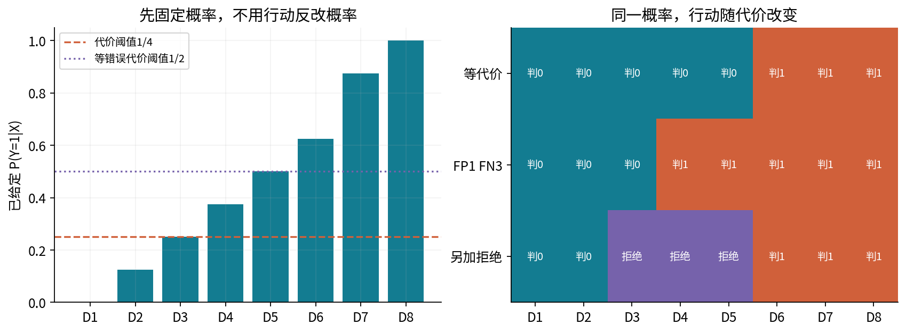
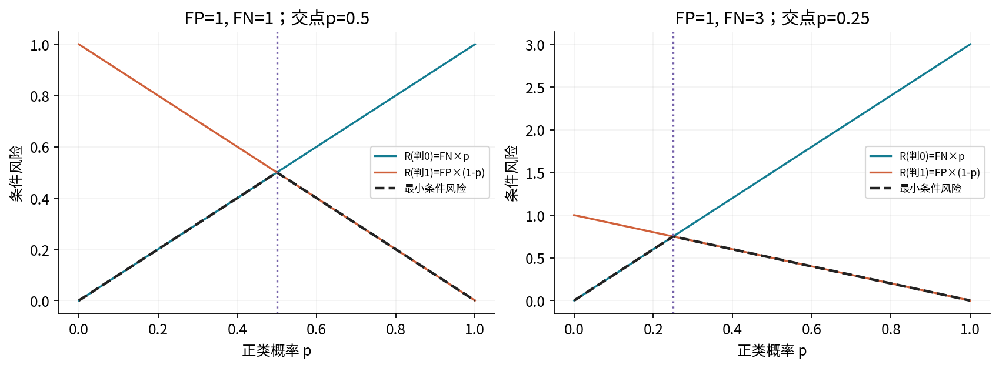
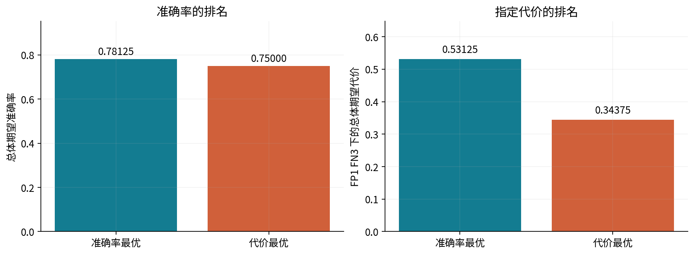
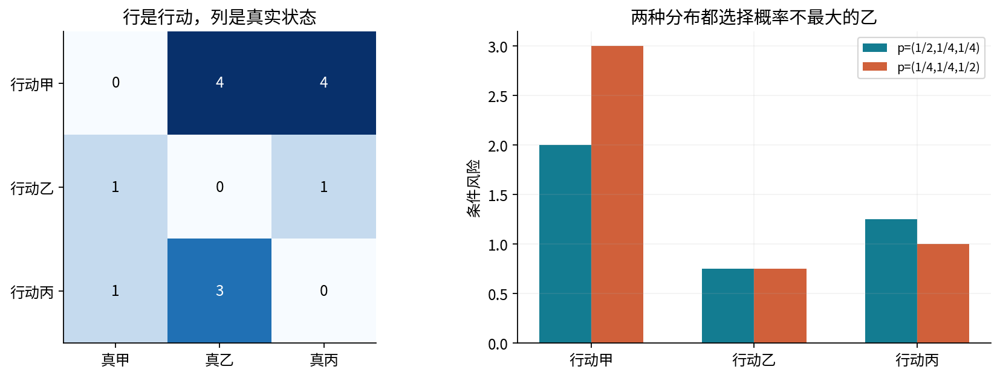
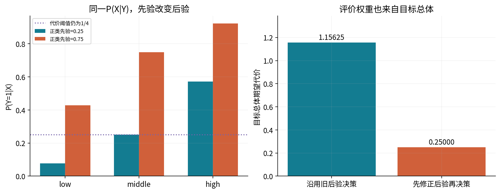
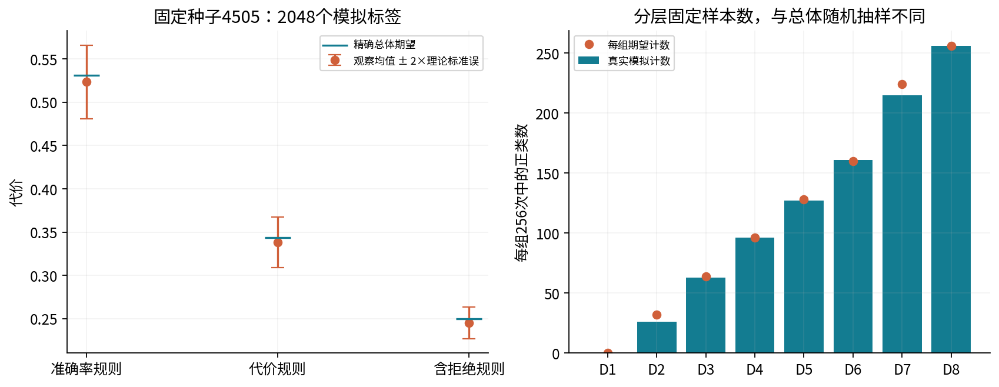
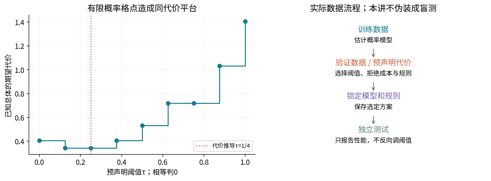

# 第045讲 从概率到决策

## 1 一个概率还不是一个行动

模型告诉我们“这条合成记录属于正类的概率是0.3”，下一步却可能有几种行动：判为负类、判为正类，或付出代价请求复核。应该选哪一种，除了概率，还取决于各种结果会造成什么损失。概率预测与行动选择是两个相连但不同的问题。

本讲直接先修018至019。我们先把概率当作已给定输入，所以不要求先会训练042或043的分类器。已经学过那些单元的读者，可以把它们的概率输出接入这里；还没学过，也能用条件概率与期望完成所有核心推导。

所有数据和代价均为原创合成教学设定，代价单位只是无量纲教学单位，不用于现实医疗、金融或个人判断。我们会逐行展开“概率→每种真实状态的损失贡献→条件风险→比较行动→总体期望代价”，不把一个硬分类阈值伪装成训练算法。

## 2 状态 行动 信息 损失

令Y表示还未知的真实类别，X表示行动前已经可见的信息，a表示我们选择的行动。损失 $L(a,y)$ 回答：如果采取a而真实状态是y，这次后果有多差？不同真实状态下的损失由任务定义给出，不能等看完测试结果才替换成更有利的数。

类别与行动不一定一一对应。二分类Y只有0、1，但可以有“判0”“判1”“复核”三个行动。多类问题中，还可以让多个类别对应同一行动。程序因此用A行K列的代价矩阵，行是行动，列是真实状态；矩阵不一定是方阵。

本讲的基本二分类代价是：正确行动损失0，误报 $C_{FP}=1$，漏报 $C_{FN}=3$。误报是行动1而真实0；漏报是行动0而真实1。矩阵必须按这个方向写：

$$C=\begin{pmatrix}0&3\\1&0\end{pmatrix}.$$

如果把矩阵转置，等于把两种错误的相对严重性倒过来，并非一个无害的存储习惯。后文用真实scikit-learn混淆矩阵核验时，还会再检查其“行是真类，列是预测”的相反方向。

## 3 条件风险是对未知真实状态求平均

给定X=x后，Y仍可能随机。行动a的条件风险定义为

$$R(a\mid x)=E[L(a,Y)\mid X=x]=\sum_y L(a,y)P(Y=y\mid X=x).$$

这里先固定行动a，再对真实状态求期望。不是对所有行动平均，也不是把最大概率类的概率直接当损失。若类别概率向量为p、代价矩阵为C，所有行动风险组成Cp；批量P每行一个样本时，对应 $PC^\top$。

例如正类概率p=3/8，负类概率5/8。判0的两个状态贡献为(0×5/8,3×3/8)=(0,9/8)，相加9/8；判1为(1×5/8,0×3/8)=(5/8,0)，相加5/8。虽然正类概率小于1/2，判1仍有较小预期代价。

风险不是已经发生的损失。这次真实Y若恰好为0，判1会损失1，而判0损失0；我们在行动前不知道答案，因此不能用事后这一个结果否定按给定信息做出的期望比较。重复观察时才会体现平均意义。

## 4 Bayes行动为何可以逐点求

定义 $a^*(x)\in\arg\min_a R(a\mid x)$，称为Bayes行动。总体风险为

$$\mathcal R(a)=E_X[R(a(X)\mid X)].$$

若每个x处都选条件风险最小的行动，则对任意其他规则g，都有 $R(a^*(x)\mid x)\leq R(g(x)\mid x)$。对X再取期望，不等式保持，因此 $\mathcal R(a^*)\leq\mathcal R(g)$。这个证明依赖逐点行动可行、损失和分布已明确；它没有用到某一种模型名称。

有多个最小行动时，任何一个都达到相同风险。本讲按预声明行动列表顺序取第一个，并把全部并列索引保存。随机在并列行动间选择也保持最小期望风险，但可能改变实际工作量分配。本讲没有额外资源约束，所以不需要为此引入随机化。

“Bayes”在这里指按条件分布最小化期望损失，不要求概率估计器必须用Bayesian参数后验训练。把最大似然模型输出接入风险比较也可以，只是它的概率是否适用于当前场景还需验证。

## 5 从两条风险直线推阈值

记p=P(Y=1|x)。在正确分类成本为0时，

$$R(0\mid x)=C_{FN}p,\qquad R(1\mid x)=C_{FP}(1-p).$$

判1严格更好要求 $C_{FP}(1-p)<C_{FN}p$。展开左边、把含p的项放在右边：$C_{FP}<(C_{FP}+C_{FN})p$。当两代价非负且总和大于0，得到

$$p>\tau,\qquad \tau=\frac{C_{FP}}{C_{FP}+C_{FN}}.$$

等号时风险相同；本讲行动顺序为0、1，因此相等判0。正文使用严格大于，不能在实现中无说明换成大于等于。第042讲采用的边界约定不同也可以，前提是明确边界并分别核验；似然本身不指定这一行动并列规则。

FP=FN>0才得到1/2。本讲FP=1、FN=3给1/4。漏报更贵时，需要较低的正类概率就愿意判正，这个方向可先凭代价直觉检查，避免公式分子颠倒。

读图问题：如果误报变得更贵，交点向左还是向右？如果两种代价同时乘10，交点会不会移动？前者向右，后者不动。

## 6 八组主例的逐行前向账本

data/posteriors.csv有八个条件组。每组占总体1/8，给定组后的正类概率按下表固定。它们是教学中已知的真实条件概率，不是从这八行拟合出来的预测；CSV中的一行表示一个条件组，不是一条已观察标签记录。

|组|p|负类概率1−p|判0风险3p|判1风险1−p|最小风险行动|
|---|---:|---:|---:|---:|---|
|D1|0|1|0|1|0|
|D2|1/8|7/8|3/8|7/8|0|
|D3|1/4|3/4|3/4|3/4|0，并列|
|D4|3/8|5/8|9/8|5/8|1|
|D5|1/2|1/2|3/2|1/2|1|
|D6|5/8|3/8|15/8|3/8|1|
|D7|7/8|1/8|21/8|1/8|1|
|D8|1|0|3|0|1|

每行不是直接套阈值就结束。先形成两个真实状态的损失贡献，分别求和得到两个风险，再比较。以D2为例，判0贡献(0,3/8)，判1贡献(7/8,0)，选0；以D6为例，判0贡献(0,15/8)，判1贡献(3/8,0)，选1。完整贡献张量的形状为(8,2,2)：组、行动、真实状态。

总体风险还要乘组权重。所选风险依次为(0,3/8,3/4,5/8,1/2,3/8,1/8,0)，总和11/4，再除8得到 $11/32=0.34375$。先把所有p平均，再只作一个总体行动，通常不能得到这个逐组最优值，因为它丢掉了组的信息。

## 7 准确率更高可以同时代价更差

把错误都记成1，等价于0-1损失，最优规则是在p>1/2时判1，相等判0。对同一八组，行动变为(0,0,0,0,0,1,1,1)。它的期望错误率为7/32，所以期望准确率25/32=0.78125。

但把这个规则放回本讲FP1、FN3的实际代价，D4和D5的漏报很贵，总风险为17/32=0.53125。代价最优规则的错误率是1/4，准确率3/4=0.75，略低，却把代价降低到11/32。

因此不能脱离损失定义问“哪个分类器最好”。这不是说准确率永远无用，而是它对应一种非常具体的对称错误成本。若业务损失不是0-1损失，却只用准确率给决策排序，就可能作出与目标相反的选择。

## 8 零成本 正确行动成本 与并列

如果FP=0而FN>0，只要p>0就判1；p=0时两行动风险均0，按顺序判0。若FN=0而FP>0，判0总能取得0风险，p=1时也是并列但仍判0。若FP=FN=0，所有行动所有p都同为0，公式0/0无意义，程序返回threshold=null并采用首行动。

若正确行动也有成本，不能继续原样套FP/(FP+FN)。一般二类矩阵给

$$R(0)=C_{00}(1-p)+C_{01}p,\quad R(1)=C_{10}(1-p)+C_{11}p.$$

只在 $C_{10}>C_{00}$ 且 $C_{01}>C_{11}$ 这类常见条件下，才可用两种错误相对于正确行动的增量代价重新推阈值。若符号条件不成立，阈值方向或常量行动都会改变，直接比较完整风险更稳妥。

代码中的并列指计算出的浮点风险精确相等。默认主例是可精确表示的二进分数，所以关键并列已用Fraction核对。对任意非二进小数，舍入可能改变靠近边界的最小索引；程序没有偷偷加一个事后并列容差。真正需要容差策略时，必须说明它允许多大风险差并单独验收。

## 9 拒绝行动也要付费

增加行动r，表示暂不作二类判断而进入复核。先采用一个简单模型：不论真实Y是什么，复核的总成本都是 $c_r=3/8$，于是R(r|x)=3/8。这个成本假设包含我们想纳入的复核负担；它不自动保证人工复核没有错误或没有延迟。

要让拒绝严格优于判0和判1，需要同时满足 $c_r<C_{FN}p$ 与 $c_r<C_{FP}(1-p)$。当FP和FN都正，整理为

$$\frac{c_r}{C_{FN}}<p<1-\frac{c_r}{C_{FP}}.$$

本例为1/8<p<5/8。因为行动顺序0、1、r，p=1/8处判0与r并列时选0；p=5/8处判1与r并列时选1。中间D3、D4、D5拒绝。拒绝范围不围绕1/2对称，因为误报与漏报代价不同。

## 10 重新前向并计入所有拒绝费

保持同一八组概率不变，把每组的三个风险重新计算：

|组|判0风险|判1风险|拒绝风险|采用行动|所选风险|
|---|---:|---:|---:|---|---:|
|D1|0|1|3/8|0|0|
|D2|3/8|7/8|3/8|0，与r并列|3/8|
|D3|3/4|3/4|3/8|r|3/8|
|D4|9/8|5/8|3/8|r|3/8|
|D5|3/2|1/2|3/8|r|3/8|
|D6|15/8|3/8|3/8|1，与r并列|3/8|
|D7|21/8|1/8|3/8|1|1/8|
|D8|3|0|3/8|1|0|

拒绝行动每行的两个真实状态贡献为 $(3(1-p)/8,3p/8)$，相加恒为3/8。它不是把被拒绝样本从分母删除，也不是把拒绝损失记为0。总风险为(5×3/8+1/8)/8=1/4；拒绝人口质量为3/8。

若只对自动接受的样本算准确率，可能得到更漂亮的数字，却改变了评价对象。完整报告至少要同时给出自动覆盖比例、拒绝比例和包含复核成本的总风险，不能把困难样本移出分母后就宣布总体变好。

## 11 拒绝什么时候没有严格优势

拒绝开区间存在要求 $c_r/C_{FN}<1-c_r/C_{FP}$。两代价正时等价于

$$c_r<\frac{C_{FP}C_{FN}}{C_{FP}+C_{FN}}.$$

右边正是两条二类风险线交点的高度。本例为3/4。当拒绝成本达到或超过3/4，拒绝不会严格好于两种直接行动；在等号的交点可以并列，但本讲按行动顺序不拒绝。两种错误有一种成本为0时，总能选一个常量行动得到0风险，非负拒绝成本也不会严格更好。

实际复核可能只容纳每天固定数量的样本，这时各样本行动受到共同容量约束，逐点独立最小化不再直接给可行解。可以考虑比较复核带来的风险减少量，再处理容量；本讲不实现这一资源优化，也不把“低置信度就全送人工”当作可部署方案。

## 12 多分类时最大概率也不是通用答案

一般K类下，仍是对每个行动计算 $R(a|x)=\sum_k C_{ak}p_k$。如果C的对角为0、所有非对角为1，R(a)=1−p_a，最小化风险才等价于选最大概率类。只要代价不对称，就应回到矩阵乘法。

沿用043的两个分布p⁻=(1/2,1/4,1/4)、p⁺=(1/4,1/4,1/2)，给定新代价矩阵

$$C=\begin{pmatrix}0&4&4\\1&0&1\\1&3&0\end{pmatrix}.$$

p⁻下三行动风险为(2,3/4,5/4)，p⁺下为(3,3/4,1)。两者都选择乙行动，而最大概率类分别是甲和丙。概率预测器没有改变；改变的是后果比较。把风险矩阵算出的行动误说成模型最确信的类别，会混淆两个对象。

## 13 概率误差怎样影响决策

设真实正类概率为η，模型给p。Bayes阈值仍是τ。若两者位于阈值同一侧，可能给出相同行动；即使概率有误差，也未必改变这次行动。若分到不同侧，错误行动相对于最优行动的条件超额风险为

$$|C_{FP}-(C_{FP}+C_{FN})\eta|=(C_{FP}+C_{FN})|\eta-\tau|.$$

不同侧还意味着 $|\eta-\tau|\leq|p-\eta|$，所以超额风险不超过 $(C_{FP}+C_{FN})|p-\eta|$。这是一个明确的误差传递上界，要求使用同一成本、阈值和真实条件分布；不意味着每个小概率误差都产生同样后果。

本例η=3/8而估计p=7/40=.175，误差1/5，错误判0的超额风险是9/8−5/8=1/2，不超过4/5。边界附近的概率质量、代价大小以及概率在哪些条件下失准，都会影响行动质量。整体校准也不自动等于对完整X的每个条件概率都正确；047会进一步区分这些评价对象。

## 14 类别先验改变之前 先说清假设

这里的先验π=P(Y=1)是观察X之前的类别比例，不是对模型参数设置的先验。设来源总体与目标总体满足 $P_t(X|Y)=P_s(X|Y)$，但类别比例π_s、π_t不同，这种特定变化叫label shift。它不覆盖所有分布偏移。

用Bayes公式写后验odds：

$$\frac{p_s}{1-p_s}=\frac{P(X=x|Y=1)}{P(X=x|Y=0)}\frac{\pi_s}{1-\pi_s}.$$

在类条件分布保持不变时，目标odds等于来源odds乘先验odds之比。设 $\alpha=\pi_t/\pi_s$、$\beta=(1-\pi_t)/(1-\pi_s)$，不直接除以1−p的稳定形式为

$$p_t=\frac{\alpha p_s}{\alpha p_s+\beta(1-p_s)}.$$

假设两先验严格在(0,1)内，分母正，p_s=0或1也可以直接处理。来源某类别完全没有支持时，不能靠一个除零公式凭空恢复该类别信息。本实现的修正接口进一步把先验限制在[1e−6,1−1e−6]的教学范围。

## 15 三个条件组的完整先验更新

第二份CSV固定三个条件组的类条件概率：

|组|$P(X\mid Y=0)$|$P(X\mid Y=1)$|来源后验 π_s=1/4|目标后验 π_t=3/4|
|---|---:|---:|---:|---:|
|low|1/2|1/8|1/13|3/7|
|middle|3/8|3/8|1/4|3/4|
|high|1/8|1/2|4/7|12/13|

每列P(X|Y)分别和为1，不能把它们当一行里两个类别概率相加归一化。例如low的来源正类联合质量为(1/4)(1/8)=1/32，负类联合质量为(3/4)(1/2)=12/32，故后验1/13。目标对应3/32与4/32，后验3/7。

先验odds从1/3变为3，修正因子9，所以 $p_t=9p_s/(1+8p_s)$。三个结果与直接按联合质量算出的后验逐项相同。目标X边缘权重也改变为(7/32,3/8,13/32)，评价目标总体时要使用这些权重，不能只改后验却沿用来源组频率。

FP1、FN3的阈值仍为1/4，因为它是对当前适用后验的代价阈值。沿用来源后验会给(0,0,1)，在目标总体的代价为37/32=1.15625；修正后三个组都判1，总成本为目标负类比例1/4。这是已知分布机制例的精确计算，不是估计了现实先验。

## 16 先验修正不能成为万能补丁

如果P(X|Y)也发生变化，上一节抵消类条件比的步骤就失效。若来源模型本来没有估计出可信后验，直接套公式也不能保证目标概率正确。目标先验通常还需要估计，其误差也会传播到后验和行动。

本讲把两先验与类条件表都作为已知教学输入，未实现黑盒label-shift估计、EM估计先验或未知偏移检测。所引研究论文用于核对label-shift条件与校准相关限制，不据此把它们的算法或实验结果算作本讲成果。

代价变化与先验变化也要分开。代价变化改变同一概率上的行动阈值；先验变化在特定分布假设下改变后验。若后验已经是目标总体的条件概率，再在同一公式中重复加入目标先验，会把同一信息算两次。

## 17 一次观察与精确总体期望怎样比较

为了展示抽样波动，固定种子4505，每个主例组独立生成256个Bernoulli标签，共2048个。三种政策共享完全相同的标签，构成配对比较；没有根据结果搜索阈值或更换种子。

八组观察到的正类数为(0,26,63,96,127,161,215,256)。按准确率规则、代价规则、含拒绝规则计算的观察平均成本分别为0.5234375、0.337890625、0.2451171875，而精确期望是0.53125、0.34375、0.25。有限抽样不要求恰好等于期望。

每组固定行动后，若真实0、1对应损失l₀、l₁，则损失方差为 $p(1-p)(l_1-l_0)^2$。每组m个独立标签、组权重w_i固定时，分层平均成本方差为

$$\operatorname{Var}(\widehat{\mathcal R})=\sum_i\frac{w_i^2}{m}p_i(1-p_i)(l_{1i}-l_{0i})^2.$$

本例三政策的标准误约0.0212164、0.0146158、0.0090035。拒绝费是固定常数，所以被拒绝组的这个条件方差为0；它不代表现实复核成本没有波动。图上±2标准误只是波动尺度示意，不冒充严格有限样本95%置信区间。

## 18 风险斜率不是概率模型的训练目标

对固定行动的条件风险，$\partial R_0/\partial p=C_{FN}$，$\partial R_1/\partial p=-C_{FP}$，固定拒绝成本的导数为0。这解释两条风险直线的斜率。本讲的计算是已知概率上的代数比较，没有参数梯度下降，也没有把“改变代价后的新行动”称为一轮模型更新。

最优条件风险是几条仿射函数的下包络，分段线性且在某些交点不可导。硬行动索引在区间内不变，到阈值会跳变，不能把argmin当平滑概率学习层直接套普通链式法则。

更重要的是，不能让模型仅通过修改自己报出的p来降低“自己估算的最小风险”。它可以虚报p接近0或1，让估计风险很低，却不改善真实结果。概率模型需用真实标签与适当学习目标训练，决策层再用适用概率和代价选择行动；042与043所学的负对数似然正属于前一层。

## 19 阈值选择需要独立的评价流程

本讲预声明阈值网格，并对已知总体表计算精确风险。这是机制核验，不是从封存测试标签选阈值。有限格点会产生平台：τ=1/8与τ=1/4虽然在D3处选不同并列行动，总风险都为11/32，因此最小成本不总唯一确定一个数值阈值。

实际问题通常只有样本和估计概率。若代价已给定且概率适用，可以直接推阈值；若需要按经验指标调阈值，应在训练之外的验证流程选择，锁定规则后再用独立测试评价。看完测试混淆矩阵再挑一个最漂亮阈值，会使测试参与选择。

实现用Fraction逐行重算风险、人口加权和全部256种二行动政策与6561种含拒绝政策；另用真实sklearn加权混淆矩阵重算观察成本。普通/-O、新工作目录和新核必须一致，输入坏尾字段在随机生成前拒绝。程序的可靠实现仍不能替代现实代价由谁承担、概率是否适用及资源约束的判断。

## 20 练习与下一讲

1. 区分真实状态、行动、可用信息和损失；写清代价矩阵的行列。
2. 从条件期望推风险矩阵，手算p=3/8的全部真实状态贡献。
3. 证明逐点Bayes行动最小化总体风险，指出资源容量约束为何例外。
4. 从不等式逐步推FP/(FP+FN)，说明相等点的约定。
5. 完整重算八组二行动风险、并列集合、行动及加权贡献。
6. 算准确率最优规则的错误率与指定代价，解释排名反转。
7. 处理一个错误成本为0和两个都为0的情况。
8. 正确行动成本非零时，从完整矩阵重新推行动条件。
9. 推拒绝开区间及其存在条件，不遗漏两端并列。
10. 重算八组加入拒绝后的完整账本、总风险和拒绝质量。
11. 用043的两个分布核验三类代价矩阵，解释为何不选最大概率类。
12. 推二类概率误差到条件超额风险的界，并重算η=3/8的例子。
13. 从Bayes公式推先验odds修正，注明类条件不变和支持条件。
14. 独立重算三个条件组的来源/目标后验、边缘与目标总代价。
15. 给一个P(X|Y)变化的情形，说明哪一步修正论证不再成立。
16. 从八组标签计数重算三种观察成本，并推分层平均成本方差。
17. 解释风险对p的导数与硬行动跳变，为什么不能只优化自报风险。
18. 制定不使用测试标签调阈值的方案，并写出浮点并列与接口验收边界。

046将进一步区分混淆矩阵、precision/recall、ROC和PR曲线。记住，评价指标与决策代价都必须由问题来解释，不能让一个默认阈值替我们决定任务究竟重视什么。

## 一手来源与范围

- [scikit-learn 1.8 阈值与分类行动](https://scikit-learn.org/1.8/modules/classification_threshold.html)：核对概率估计与行动的区别、阈值改变不改概率、验证选择与过拟合风险。本讲不声称运行TunedThresholdClassifierCV。
- [Bartlett与Wegkamp 拒绝选项原论文](https://www.stat.berkeley.edu/~bartlett/papers/bw-crouhl-06.pdf)：实际阅读引言的二分类风险、对称错误成本下拒绝规则；本讲不对称成本阈值和八组计算自行推导，未实现论文的hinge训练算法。
- [Garg等 Label Shift原论文页面](https://proceedings.neurips.cc/paper/2020/hash/219e052492f4008818b8adb6366c7ed6-Abstract.html)：核对类别先验变化而类条件不变的假设及校准相关限制，仅使用该范围，不声称复现其估计器。
- [NumPy 2.3 argmin](https://numpy.org/doc/2.3/reference/generated/numpy.argmin.html)：核对沿指定轴求最小索引以及精确并列返回第一个位置。
- [scikit-learn 1.8 confusion_matrix](https://scikit-learn.org/1.8/modules/generated/sklearn.metrics.confusion_matrix.html)：核对真类为行、预测为列、labels顺序及sample_weight；本讲真实调用后重算观察成本。
