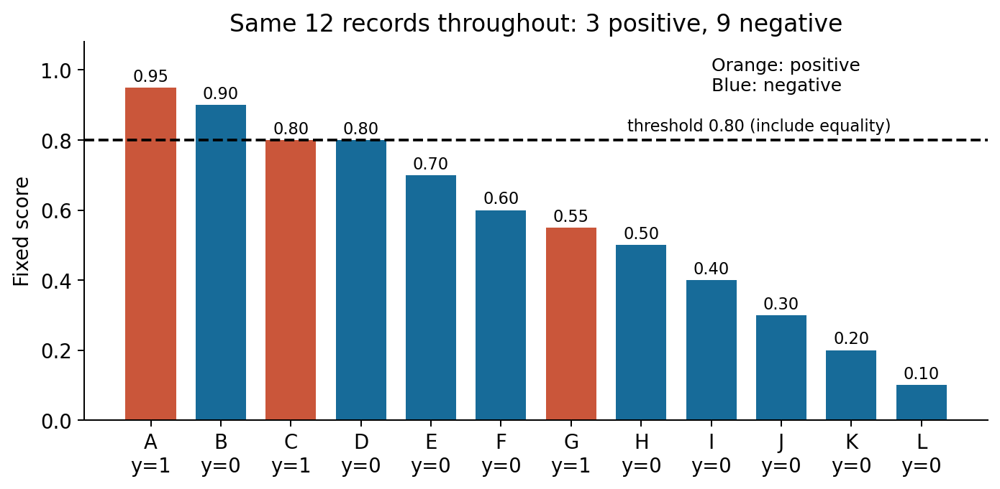
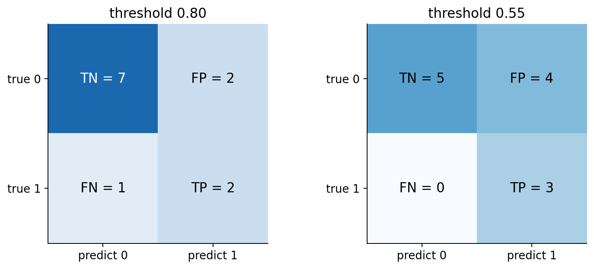
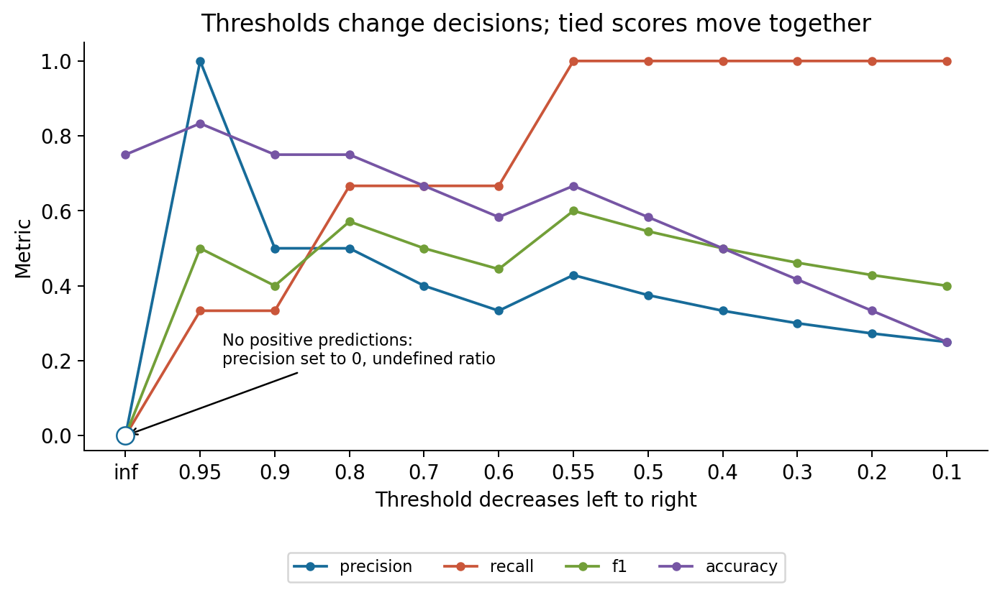
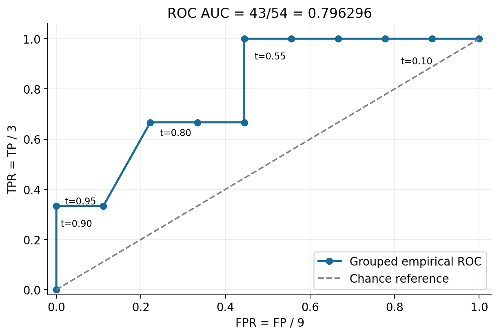
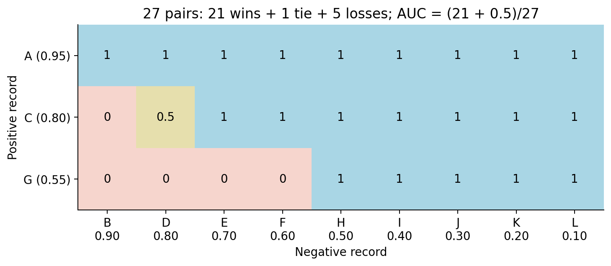
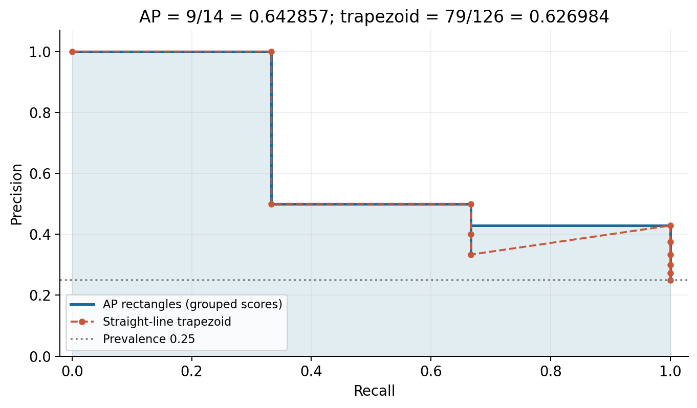
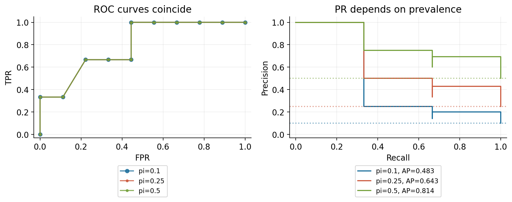
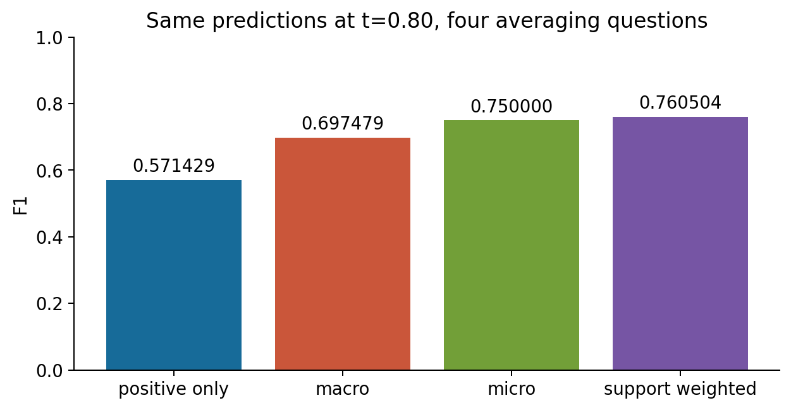
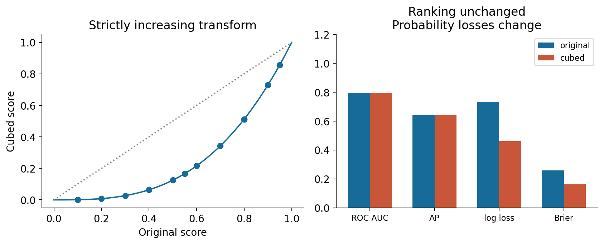

# 046 分类指标与排序评价

本讲回答一个容易影响整个研究结论的问题：同一组预测，为什么在不同指标下会得到相反评价？答案在于每个指标的分母、关注对象和决策规则不同。一个数字不能同时说明发现了多少阳性、发出的警报有多少可靠、排序是否合理，以及部署时会损失多少。

本讲直接先修为第 7、18、45 讲。请能读懂一个分数、条件概率和“概率经过阈值变成行动”的过程。不要求先会训练新模型。本讲从同一份 12 行教学数据出发，逐行数错对，再推到 ROC、AUC、PR、平均方式和阳性率变化。所有图和数值均可由随包代码重建。

学习完成后，你应能独立交出四样东西：带轴说明的混淆矩阵；每个不同评分阈值的完整记录；与手算一致的 sklearn 核验；一段说明目标人群、阳性定义、阈值和平均方式的结果陈述。这里没有用测试标签选择模型，也没有为了提高指标改动记录。

## 1 先确定究竟在评价什么

### 1.1 一行记录与一个问题

假设我们每天把一批机器零件交给复核员。评分器只给出“越大越值得复核”的分数。事后完整检查确定零件是否存在缺陷。本讲把有缺陷记为阳性 $y=1$，无缺陷记为阴性 $y=0$。阳性不是“好”的意思，只是我们明确指定的事件。

表中每行是一个不同的零件。标签在评分后才用于评价。这里的零件、分数和标签全部是作者构造的合成教学记录，不涉及真实工厂，也不代表从总体随机抽出的样本。它是用来暴露计算约定的显微镜，不能据此宣布某个模型的真实生产性能。

| 编号 | 标签 $y$ | 固定评分 $s$ | 在 $t=0.80$ 时预测 | 归属 |
|---|---:|---:|---:|---|
| A | 1 | 0.95 | 1 | TP |
| B | 0 | 0.90 | 1 | FP |
| C | 1 | 0.80 | 1 | TP |
| D | 0 | 0.80 | 1 | FP |
| E | 0 | 0.70 | 0 | TN |
| F | 0 | 0.60 | 0 | TN |
| G | 1 | 0.55 | 0 | FN |
| H | 0 | 0.50 | 0 | TN |
| I | 0 | 0.40 | 0 | TN |
| J | 0 | 0.30 | 0 | TN |
| K | 0 | 0.20 | 0 | TN |
| L | 0 | 0.10 | 0 | TN |

记样本数 $n=12$，真阳性样本数 $n_+=3$，真阴性样本数 $n_-=9$。样本阳性率为 $\hat\pi=n_+/n=1/4$。“真阳性样本数”此处指真实标签为 1 的总数，不能与预测成功的计数 TP 混淆。类不平衡指两个真实类别的数量不同，不等于评分器一定不好。

评分 $s_i$ 处于 $[0,1]$ 并不自动成为概率。我们只假设大分数倾向阳性，暂不假设 0.80 表示 80% 的真实缺陷概率。评估排序不需要校准假设；直接用概率制定代价决策则需要更强的条件。

### 1.2 阈值和等号是协议的一部分

我们使用 $\hat y_i(t)=\mathbf{1}\{s_i\ge t\}$。符号 $\mathbf{1}\{A\}$ 表示条件 $A$ 成立时取 1，否则取 0。阈值 $t=0.80$ 时，分数恰好为 0.80 的 C、D 都必须入选。若改成严格大于，两行都会退出，结果不再相同。

读图问题 G1：为什么 C 和 D 必须一同跨过阈值？仅凭这张图能否说 A 有 95% 的缺陷概率？完整答案见答案册 G1。

生产评价还需要明确：一人多件是否有关联；标签是否完整；漏检标签是否更容易缺失；评分发生时是否能看到相关信息；数据来自哪段时间。数学公式不会自动解决这些数据问题。若标签只来自被复核的零件，未复核部分的 FN 与 TN 可能无法观察，此时不能直接把下面的全样本公式当作无偏评价。

## 2 混淆矩阵是后续所有计数的起点

### 2.1 四个格子如何得到

混淆矩阵有两个轴：本讲行是真实类别，列是预测类别，类别顺序固定为 $[0,1]$。TP 是“真实阳性且预测阳性”，FP 是“真实阴性却预测阳性”，FN 是“真实阳性却预测阴性”，TN 是“真实阴性且预测阴性”。第一个字母表示预测是否正确，第二个字母表示预测结果的正负。

$$
\mathrm{TP}(t)=\sum_{i=1}^n\mathbf{1}\{y_i=1\}\mathbf{1}\{s_i\ge t\}.
$$

这不是神秘公式：先逐行判断真实标签是否为 1，再判断是否越过阈值，两个条件同时成立才贡献一个 1。其余格子只需替换条件。于是在 $t=0.80$，A、C 贡献 2 个 TP；B、D 贡献 2 个 FP；G 贡献 1 个 FN；余下七个编号贡献 7 个 TN。

| 真实类别与预测类别 | 预测0 | 预测1 | 行合计 |
|---|---:|---:|---:|
| 真实0 | TN = 7 | FP = 2 | 9 |
| 真实1 | FN = 1 | TP = 2 | 3 |
| 列合计 | 8 | 4 | 12 |

行合计是真实类别数量，列合计是预测类别数量。检查四格和等于 12、第二行和等于 3，是非常便宜且有效的查错方式。不同资料可能交换行列；比较图之前一定先读轴，不能凭格子位置背 TP。

### 2.2 准确率为什么会掩盖任务

准确率为 $\mathrm{Accuracy}=(\mathrm{TP}+\mathrm{TN})/n$。本例是 $(2+7)/12=3/4$。如果一个评分器根本不看零件，全部预测阴性，也能靠 9 个 TN 得到 $9/12=3/4$，却漏掉全部缺陷。这不说明准确率“错误”，而是说明它把每个零件的对错等权相加，没有表达漏掉缺陷相对多发警报的代价。

同样，全部预测阳性会得到召回率 1，却让 9 个合格零件也进入复核。评价必须先问业务愿意承担什么，再决定看什么。不能先挑一个漂亮数字，再为它补任务解释。

### 2.3 归一化矩阵有不同含义

四格除以 $n$ 得到联合频率；每一行除以该行合计得到“在某个真实类别内，预测去了哪里”；每一列除以该列合计得到“某个预测结果内，真实构成是什么”。例如第二行的 $2/3$ 是召回率，第二列的 $2/4$ 是精确率。把这两种归一化都标成“比例”会丢失条件，进而把不同问题误当成同一个问题。

读图问题 G2：从 0.80 降到 0.55，新增哪三行？为什么 TP 增加 1，FP 却增加 2？准确率和召回率分别怎样变？

## 3 Precision Recall 与 F1 的每一步

### 3.1 精确率的分母是发出的警报

精确率也称查准率，记作 $P$：

$$
P=\frac{\mathrm{TP}}{\mathrm{TP}+\mathrm{FP}}.
$$

分母是所有被预测为阳性的记录。问题是“我交给复核员的这堆零件里，有多少是真的缺陷？”在 0.80 阈值，警报是 A、B、C、D 四件，其中 A、C 有缺陷，所以 $P=2/4=1/2$。这与总体阳性率 $3/12$ 不同；二者的条件不同。

### 3.2 召回率的分母是所有真实阳性

召回率或查全率记作 $R$，也叫真正率 TPR：

$$
R=\mathrm{TPR}=\frac{\mathrm{TP}}{\mathrm{TP}+\mathrm{FN}}.
$$

问题是“所有真正有缺陷的零件中，我找到了多少？”A、C、G 三件缺陷中找出 A、C，因此 $R=2/3$。同一个 TP = 2，因为分母不同，得到的含义和数值都不同。精确率近似的是 $P(Y=1\mid\hat Y=1)$，召回率近似的是 $P(\hat Y=1\mid Y=1)$。条件概率不能把竖线两边直接交换。

假正率 $\mathrm{FPR}=\mathrm{FP}/(\mathrm{FP}+\mathrm{TN})=2/9$；特异度 $\mathrm{TNR}=1-\mathrm{FPR}=7/9$。注意 $1-P$ 是警报中的错误比例，分母是警报总数；FPR 是合格零件中的误报比例，分母是阴性总数，它们通常不同。

### 3.3 为什么用调和平均

F1 将精确率与召回率合成一个数。对于 $P,R>0$：先取倒数，做算术平均，再取倒数，得到调和平均：

$$
F_1=\frac{1}{\tfrac12(1/P+1/R)}=\frac{2PR}{P+R}.
$$

将两个分数代入并约分，能得到更容易直接数格子的表达式：

$$
F_1=\frac{2\mathrm{TP}}{2\mathrm{TP}+\mathrm{FP}+\mathrm{FN}}.
$$

中间过程是 $1/P=(\mathrm{TP}+\mathrm{FP})/\mathrm{TP}$，$1/R=(\mathrm{TP}+\mathrm{FN})/\mathrm{TP}$；相加后分子为 $2\mathrm{TP}+\mathrm{FP}+\mathrm{FN}$。本例 $F_1=4/(4+2+1)=4/7\approx0.571429$。简单算术平均为 $(1/2+2/3)/2=7/12\approx0.583333$，不是 F1。

调和平均对一高一低的组合更严格，例如 $P=1,R=0.1$ 时 F1 约为 0.182，而算术平均为 0.55。但“严格”不是“客观最优”：F1 没有 TN 项，也没有直接写入货币代价、人工容量或人群差异。向数据添加许多预测正确的阴性，可以提高准确率，却完全不改变阳性 F1。

### 3.4 零分母要明示

若阈值高于全部分数，没有任何警报，$\mathrm{TP}+\mathrm{FP}=0$，精确率是 $0/0$，数学上未定义。不能说“没有误报，所以精确率天然为 1”。本讲标量计算采用 `zero_division=0` 的报告约定，同时保留 `precision_defined=false` 标志，告诉读者 0 是填充值。此时有真实阳性，召回率和 F1 都是 0。

如果评价集中没有真实阳性，召回率、ROC 的纵坐标和一些面积解释会失去必要条件。我们的教学包装函数直接拒绝只含一个类别的输入。库可能返回警告、NaN 或特定约定；不要把这些约定当作性能证据。PR 曲线另有用于画图的 $(R,P)=(0,1)$ 端点，稍后会说明，它不是对空警报精确率的统计估计。

## 4 从一个阈值走到全部阈值

### 4.1 为何只需要检查不同评分

当阈值在两个相邻不同评分之间移动，没有样本改变预测，因此混淆矩阵不变。我们从 $+\infty$ 开始，使全部记录预测阴性，然后把阈值依次降到每个不同评分。有限评分共有 11 个，加上起点，总共 12 种不同决策。低于最小评分会继续全预测阳性，没有新的决策。

0.80 同分组包含 C 和 D。它们没有由分数提供的内部顺序，所以必须同时进入。如果为了多算一个“好点”而把 C 放在 D 前面，便使用了标签打破并列，会夸大结果。稳定排序只能保证程序重复运行的顺序一致，不能使这个人为中间点成为可实施的纯评分阈值。

### 4.2 完整扫描表

表中 P 为精确率，R 为召回率。“空”表示未定义比率；程序为标量报告填 0。所有行来自同一份 CSV，未省略中间阴性记录。

| 阈值 $t$ | 新进入的编号 | TP | FP | FN | TN | P | R | F1 |
|---|---|---:|---:|---:|---:|---|---|---|
| $+\infty$ | 无 | 0 | 0 | 3 | 9 | 空 | 0 | 0 |
| 0.95 | A | 1 | 0 | 2 | 9 | 1 | 1/3 | 1/2 |
| 0.90 | B | 1 | 1 | 2 | 8 | 1/2 | 1/3 | 2/5 |
| 0.80 | C与D | 2 | 2 | 1 | 7 | 1/2 | 2/3 | 4/7 |
| 0.70 | E | 2 | 3 | 1 | 6 | 2/5 | 2/3 | 1/2 |
| 0.60 | F | 2 | 4 | 1 | 5 | 1/3 | 2/3 | 4/9 |
| 0.55 | G | 3 | 4 | 0 | 5 | 3/7 | 1 | 3/5 |
| 0.50 | H | 3 | 5 | 0 | 4 | 3/8 | 1 | 6/11 |
| 0.40 | I | 3 | 6 | 0 | 3 | 1/3 | 1 | 1/2 |
| 0.30 | J | 3 | 7 | 0 | 2 | 3/10 | 1 | 6/13 |
| 0.20 | K | 3 | 8 | 0 | 1 | 3/11 | 1 | 3/7 |
| 0.10 | L | 3 | 9 | 0 | 0 | 1/4 | 1 | 2/5 |

读一行并确认上下变化：0.70 到 0.60 只多入选阴性 F，TP 和 FN 不变，FP 增 1、TN 减 1，召回率不变，精确率从 $2/5$ 降到 $2/6$。0.60 到 0.55 多入选阳性 G，FP 不变，TP 增 1，精确率反而从 $1/3$ 升到 $3/7$。因此阈值下降时召回率单调不减，精确率不必单调。

同一个预测集合对应一个阈值区间。例如选中 A、B、C、D 的条件是 $0.70<t\le0.80$。上端包含 0.80，下端不包含 0.70，因为 E 的评分恰为 0.70。若实现与这个区间不同，先查等号约定。

读图问题 G3：精确率哪一段上升？这组数据中最高 F1 和最高准确率是否出现在同一决策？如果这是封存测试集，能否拿最高点当作已验证的部署性能？

### 4.3 看见最高点不等于获准采用它

扫描是诊断，不自动成为阈值选择。在这 12 行上挑最高 F1 会找到 0.55 的决策，而最高准确率来自 0.95 的决策。若在同一批标签上选阈值再报告该阈值成绩，会产生选择偏差。正式流程应先确定目标指标、约束与并列选择规则，在训练之外的验证集选择，再在未使用的测试集评价锁定规则。测试集扫描图可以作为事后描述，但必须说清没有把最高点当作无偏的部署成绩。

本讲 0.80 和 0.55 是教学预先指定的比较点；扫描表只说明指标机制。没有训练集、验证集、测试集的真实抽样设计，因此不存在可宣称的泛化保证。

## 5 ROC 是不同阈值下的两种类内比例

### 5.1 从扫描表投到平面

ROC 横轴为 FPR，纵轴为 TPR。每个阈值对应一个点：$(\mathrm{FP}/9,\mathrm{TP}/3)$。起点 $+\infty$ 为 $(0,0)$，终点全阳性为 $(1,1)$。只加入阴性使点向右，只加入阳性使点向上；同分组中两类都有时两个方向一起变。

本例从 0.90 到 0.80，点从 $(1/9,1/3)$ 到 $(2/9,2/3)$。C、D 同时进入，形成斜线段。线段中的点通常不对应某个确定性的纯评分阈值；它可以解释为按某个概率随机接受同分组或混合两个决策后的期望比例。不能因画了线，就断言线段上每一点都可通过换一个数值阈值取得。

读图问题 G4：0.80 阈值的点为何横坐标是 $2/9$ 而不是 $2/4$？AUC 相同能否保证两模型在 FPR 不超过 0.01 时同样好？

### 5.2 AUC 是面积 也能逐对数

ROC AUC 是按横坐标积分得到的面积。经验 ROC 通常用相邻点连线作梯形积分：

$$
\mathrm{AUC}=\sum_k(x_k-x_{k-1})\frac{z_k+z_{k-1}}{2},
$$

其中 $x_k$ 为 FPR，$z_k$ 为 TPR。竖直移动的宽度为 0，不贡献面积；横向移动贡献“宽度乘高度”；含同分的斜线贡献梯形面积。

本例的非零贡献如下。加入 B 时，宽 $1/9$，高 $1/3$，面积 $1/27$；加入 C、D 的同分组时，宽 $1/9$，平均高 $(1/3+2/3)/2=1/2$，面积 $1/18$；E、F 各贡献 $2/27$；H 至 L 五个阴性各贡献 $1/9$。总和为：

$$
\frac1{27}+\frac1{18}+\frac2{27}+\frac2{27}+\frac59
=\frac{43}{54}\approx0.796296.
$$

另一个完全不同的手算法是把每个阳性与每个阴性配成一对。共 $3\times9=27$ 对。若阳性分数大，记 1；相等记 $1/2$；小则记 0。A 胜过 9 个阴性，C 胜过 7 个、与 D 并列 1 个、输给 B，G 胜过 5 个、输给 4 个。总分为 $9+7+1/2+5=21.5$，除以 27 仍为 $43/54$。

$$
\widehat{\mathrm{AUC}}=\frac{1}{n_+n_-}\sum_{i:y_i=1}\sum_{j:y_j=0}
\left[\mathbf{1}\{s_i>s_j\}+\frac12\mathbf{1}\{s_i=s_j\}\right].
$$

这条式子的概率解释是：从该经验阳性分布与经验阴性分布各抽一个，阳性排名更高的概率，加上并列概率的一半。若要推广到目标总体，还需要样本能代表对应条件分布。这里“随机抽两个”的解释不是“随机抽一个样本，它被分对的概率”。后者与阈值有关。

读图问题 G5：如果把 C、D 的 CSV 行顺序互换，AUC 应否改变？若错误地把并列一律算阳性获胜，面积将被高估多少？

### 5.3 AUC 没有替你决定阈值

AUC 对整段排序作汇总。把阈值设为 $+\infty$，部署召回率为 0，但原始分数的 AUC 仍为 $43/54$。把阈值设为 0.10，所有零件触发复核，AUC 也不变。它既不告诉你发几条警报，也不直接给出代价。

严格递增变换保持两两顺序与同分关系，因此保持 AUC；然而数值阈值需要一起变换。$s^3$ 与 $s$ 的排序相同，但“变换后仍用 0.80”相当于原评分门槛约 0.9283。它与原先 0.80 的决策不同。相同的 ROC AUC 也不保证两条 ROC 在关键低 FPR 区间一致；可以有交叉，整体面积只是汇总。

全同分时没有排序信息，两两比较全部记半分，AUC 为 0.5。完全反向排序可低于 0.5；不能擅自把 $1-\mathrm{AUC}$ 当成新的成绩，除非确实明确反转分数方向并在合法流程中重新验证。

## 6 PR 曲线和 Average Precision

### 6.1 为什么换一个坐标系

PR 横轴是 Recall，纵轴是 Precision。它询问“找出这么大比例的阳性时，发出的警报有多可靠”。由于精确率的分母含所有预测阳性，PR 会直接体现阴性数量带来的复核压力。

本例 0.80 的点是 $(2/3,1/2)$，0.55 的点是 $(1,3/7)$。阈值再往下，召回率已经为 1，精确率一路下降到 $1/4$。在 ROC 图中这些点沿顶部向右，在 PR 图中它们在右边界向下。后面的阴性仍然影响部署精确率；它们不增加召回，因而不增加 AP 的召回增量面积。

### 6.2 库的顺序与画图端点

sklearn 1.8 的 `roc_curve` 返回下降的阈值，首个阈值为正无穷，TPR/FPR 随之不减。`precision_recall_curve` 则返回上升的有限阈值，精确率和召回率各比阈值数组多一个元素，最后额外附上 $(P,R)=(1,0)$，该点没有对应阈值。两种函数的数组方向不同，不能按同一个下标直接拼在一起。课程代码都显式设 `drop_intermediate=False`，保留全部不同评分点。[ROC接口](https://scikit-learn.org/1.8/modules/generated/sklearn.metrics.roc_curve.html)；[PR接口](https://scikit-learn.org/1.8/modules/generated/sklearn.metrics.precision_recall_curve.html)。

在手算时我们仍按阈值下降、召回率上升的顺序。为画图加上 $(R,P)=(0,1)$ 的约定点，但不把它说成实际空警报的测量结果。所有样本入选时，PR 端点为 $(1,\hat\pi)=(1,1/4)$。

### 6.3 AP 的权重为何是召回增量

Average Precision，缩写 AP，将每次新增召回量作为该步精确率的权重：

$$
\mathrm{AP}=\sum_k(R_k-R_{k-1})P_k.
$$

这个公式从阈值高到低读取。注意使用的是变化之后的精确率 $P_k$；若该步只增加阴性，召回增量为 0，该项为 0。本例新增阳性的步骤只有三次：

| 阈值 | 新增阳性 | 召回从何处到何处 | 该步精确率 | AP贡献 |
|---|---|---|---|---|
| 0.95 | A | 0到1/3 | 1 | 1/3 |
| 0.80 | C 同时 D 入选 | 1/3到2/3 | 1/2 | 1/6 |
| 0.55 | G | 2/3到1 | 3/7 | 1/7 |

因此 $\mathrm{AP}=1/3+1/6+1/7=9/14\approx0.642857$。对没有并列且每行等权的数据，可以理解为每个阳性出现时的前缀精确率平均。但有同分时，必须用整个同分组入选后的精确率，不能把阳性放到组内最前面偷偷提高 AP。

### 6.4 AP 与梯形 PR 面积不是同一个量

连接 PR 点后用梯形法积分会在两个召回值之间线性插值。AP 则按右端精确率铺矩形，二者一般不同。sklearn 的 AP 不使用这种线性插值；报告时应写清 `average_precision_score` 或明确“梯形 PR 面积”，不要只写含混的 PR-AUC。[AP接口与计算约定](https://scikit-learn.org/1.8/modules/generated/sklearn.metrics.average_precision_score.html)。

本例梯形面积可按三段有宽度的移动来算：第一段为 $1/3$；第二段的前后精确率都是 $1/2$，贡献 $1/6$；第三段从 $1/3$ 升到 $3/7$，贡献 $\tfrac13(\tfrac13+\tfrac37)/2=8/63$。总和为 $79/126\approx0.626984$，比 AP 小 $1/63$。这份数据特意保留了这个事实：梯形面积并非在所有离散数据上都大于 AP。插值可能造成乐观解释，但不是一条固定大小关系定理。

读图问题 G6：为什么 G 入选前后的精确率上升使本例梯形面积小于 AP？全同分评分的 AP 是多少？

随机分数在大样本、分数与标签独立时，PR 的参考精确率接近总体阳性率。有限样本的随机排序 AP 不是必然精确等于样本阳性率；它会有随机波动和有限样本效应。对全部同分、整组一次入选的特殊预测，经验 AP 恰等于样本阳性率。不要把这两种情况混为一谈。

## 7 阳性率变化为何改变 PR

### 7.1 条件不变必须先声明

设目标人群阳性率为 $\pi$。现在做一个受控实验：保留阳性内部的评分分布与阴性内部的评分分布，只改变两个类别在混合人群里的比例。这是条件评分分布不变的先验比例变化。它比“换一个数据集”强得多；换设备、换人群或换标签流程也可能改变每类内部的评分行为，此时 ROC 不一定不变。

在固定阈值 $t$，记 $a=\mathrm{TPR}(t)$，$b=\mathrm{FPR}(t)$。每 1 单位总人群中，阳性占 $\pi$，其中 $a$ 被选中，所以真阳性质量为 $\pi a$；阴性占 $1-\pi$，其中 $b$ 被误选，所以假阳性质量为 $(1-\pi)b$。精确率就是：

$$
P(t;\pi)=\frac{\pi a}{\pi a+(1-\pi)b}.
$$

这也是贝叶斯公式的直接展开。只有分母非零时它才定义。$a,b$ 是类内比例，在这个受控假设下保持不变；精确率是两类混合后的比例，通常改变。

### 7.2 同一个0.80阈值的具体重算

原例 $a=2/3,b=2/9$。如果 $\pi=0.10$，则 $\pi a=1/15$，$(1-\pi)b=1/5$，两者和为 $4/15$，所以 $P=1/4$。若 $\pi=0.25$，$P=1/2$；若 $\pi=0.50$，$P=3/4$。

| 阳性率 | 0.80处TPR | 0.80处FPR | 0.80处Precision | ROC AUC | AP |
|---|---|---|---|---|---|
| 0.10 | 2/3 | 2/9 | 1/4 | 43/54 | 29/60 |
| 0.25 | 2/3 | 2/9 | 1/2 | 43/54 | 9/14 |
| 0.50 | 2/3 | 2/9 | 3/4 | 43/54 | 127/156 |

这些是同一经验类条件分布的加权结果，不是声称我们观察到了分数个真实零件。若用 900 件构造一个整数思想实验：在 10% 阳性率下有 90 阳性和 810 阴性，按相同比例得到 TP = 60、FP = 180，精确率仍为 1/4。把单位选择说清楚后，小数权重就不再神秘。

### 7.3 代码如何实现相同的实验

原经验阳性率为 $\pi_0=1/4$。赋予每个阳性权重 $w_+=\pi/\pi_0$，每个阴性权重 $w_-=(1-\pi)/(1-\pi_0)$。阳性总权重是 $3w_+=12\pi$，阴性总权重是 $9w_-=12(1-\pi)$，总权重仍为 12。每一类内所有样本使用相同权重，因此 TP/(TP+FN) 与 FP/(FP+TN) 中的因子会约掉。

当 $\pi=0.10$，每个阳性权重为 0.4，每个阴性为 1.2。在 0.80 阈值，TP = 0.8，FP = 2.4，FN = 0.4，TN = 8.4，所以精确率 $0.8/3.2=0.25$。不能一边用加权 TP、一边把分母仍当原始 12 行的计数。

AP 也随之改变。仍然只有三个步骤增加召回，各增加 $1/3$。当 $\pi=0.10$，这三步精确率分别为 $1,1/4,1/5$，因此 AP 为 $(1+1/4+1/5)/3=29/60$。当 $\pi=0.50$，它们为 $1,3/4,9/13$，AP 为 $127/156$。

读图问题 G7：阳性率下降后精确率变低，是否足以说明排序器退化？把验证集做成一半阳性、一半阴性，直接报告其精确率到 10% 阳性率的部署场景，有什么问题？

真实部署中应检查类条件稳定假设、标签取得机制和目标阳性率来源。重加权不能创造原数据中没有的特征区域，也不能修复失真的标签。如果目标阳性率未知，应该展示不同合理阳性率下的敏感性，而不是挑一个让 PR 更好看的比例。

## 8 宏平均 微平均与支持度加权

### 8.1 先用同一个二分类例子解释

无需换一组数据就能看到平均方式的差异。仍在 0.80 阈值：把类别 1 当“关注类”时，$P_1=2/4=1/2$，$R_1=2/3$，$F_{1,1}=4/7$，支持度 $n_1=3$。

然后把类别 0 当作新的关注类：原 TN = 7 变成这个类别的 TP；原 FN = 1 是误预测为类别 0 的记录，所以成为它的 FP；原 FP = 2 是漏掉的真实类别 0，所以成为它的 FN。于是 $P_0=7/8$，$R_0=7/9$，$F_{1,0}=14/17$，支持度 $n_0=9$。这里只是在换问题，没有改任何预测。

### 8.2 宏平均是每类一票

有 $K$ 个预先定义的类别时，宏平均 F1 为：

$$
F_{1,\mathrm{macro}}=\frac1K\sum_{k=1}^K F_{1,k}.
$$

本例 $K=2$，宏 F1 为 $(4/7+14/17)/2=83/119\approx0.697479$。它把稀少的阳性与较多的阴性各给一票。宏精确率为 $(1/2+7/8)/2=11/16$，宏召回率为 $(2/3+7/9)/2=13/18$。

先平均每类 F1 与先平均 P、R 再算 F1，运算顺序不同，一般不相等。F1 是非线性函数。研究论文若只写“macro”却不说明平均的是哪个量，可能造成不可复现。

### 8.3 微平均先合并计数

微平均先加所有关注类的 TP、FP、FN，然后再做比值。对本例两个类别，$\sum\mathrm{TP}_k=2+7=9$，$\sum\mathrm{FP}_k=2+1=3$，$\sum\mathrm{FN}_k=1+2=3$。因此 micro precision、micro recall、micro F1 都为 $9/12=3/4$。

这个相等关系可以一般推导：单标签 $K$ 类任务中，每条记录只有一个真实类和一个预测类。一个正确预测贡献一个 TP；一个错误预测给预测类别贡献一个 FP，同时给真实类别贡献一个 FN。若正确数为 $c$，则合并后 TP = $c$、FP = FN = $n-c$，故三个 micro 指标都等于 $c/n$。

前提不可遗漏：所有类别均纳入，单标签分类，每样本恰一个预测类别，同一种样本权重。若只选某些类别、使用多标签任务或允许拒识，这个恒等式不能直接照搬。微平均通常更受常见类别影响，因为常见类别贡献更多样本。

### 8.4 支持度加权不是微平均

支持度加权 F1 先算各类 F1，再按真实类别人数加权：

$$
F_{1,\mathrm{weighted}}=\sum_k\frac{n_k}{n}F_{1,k}.
$$

本例为 $(3\cdot4/7+9\cdot14/17)/12=181/238\approx0.760504$。它与 micro 的 0.75 不相等。支持度加权召回率在完整单标签类别集合下等于准确率；支持度加权 F1 没有这个保证。

读图问题 G8：如果报告只有“F1 = 0.7605”，读者为何可能误以为少数阳性找得很好？把每类 F1 与支持度一起列出来能补充什么？

sklearn 中显式用 `average='binary'`、`'macro'`、`'micro'` 或 `'weighted'`，并写出 `labels=[0,1]`、`pos_label=1`、`zero_division=0`。`average=None` 返回各类结果，是检查汇总的好起点。多分类、多标签可以拆成每类对其余类的二分类，但两者的样本语义不同，不能把所有输出都套进单标签恒等式。[平均方式接口](https://scikit-learn.org/1.8/modules/generated/sklearn.metrics.precision_recall_fscore_support.html)。

## 9 离散评价和概率学习目标的关系

### 9.1 为什么本讲没有硬塞一段训练

本讲评价的是冻结的评分。没有待学习参数，没有用梯度更新模型，也没有优化器收敛的命题。训练、评价、阈值选择是不同步骤：模型可以用一个连续损失学习分数；评价可能关注排名；部署则按概率、代价和容量选择行动。三者应相互服务，但不必是同一个数学函数。

对固定真实标签，如果某个分数小幅变化却不跨阈值，混淆矩阵不变，准确率与 F1 也不变；跨过阈值时可能突然跳变。这种离散性说明直接对硬预测指标求普通梯度往往没有有用信号。它不意味着这些指标没有价值，也不意味着必须把测试 F1 塞进训练循环。

### 9.2 连续概率损失在问什么

如果把 $p\in(0,1)$ 解释为阳性概率，单样本对数损失为 $-[y\log p+(1-y)\log(1-p)]$。对一个真实阳性概率为 $q$ 的固定条件群体，期望损失为：

$$
L(p;q)=-q\log p-(1-q)\log(1-p).
$$

对 $p$ 求导：第一项导数为 $-q/p$，第二项为 $(1-q)/(1-p)$；通分得到：

$$
\frac{\partial L}{\partial p}=\frac{p-q}{p(1-p)}.
$$

在 $p\in(0,1)$ 内分母为正，因此当 $p<q$ 时增大 $p$ 会降低损失，当 $p>q$ 时减小 $p$ 会降低损失；极小点为 $p=q$。边界 $q=0$ 或 1 应按极限理解。这说明期望对数损失鼓励诚实概率，而 AUC 只看次序。这是损失与指标关系的分析，不是本讲的训练算法。有限数据、模型限制和分布变化仍可能使学到的概率失准。

Brier 分数为 $n^{-1}\sum_i(p_i-y_i)^2$，也评价概率数值。对真实概率 $q$，期望平方误差可拆成 $(p-q)^2+q(1-q)$；第二项不依赖 $p$，最小值同样在 $p=q$。它和对数损失对极端错误的惩罚方式不同。

### 9.3 同一排序 不同概率质量

实验把 $s$ 变成 $s^3$，不拟合任何东西。两者严格保序，AUC 与 AP 完全相同；若仍用数值阈值 0.80，预测集合改变。若把阈值也变为 $0.80^3=0.512$，预测集合才恢复相同。代码同时计算“把这些评分当作概率时”的 log loss 和 Brier；它们改变不代表我们已经证明某个真实总体的校准更好，只展示排名指标无法识别的数值差异。

读图问题 G9：变换后为什么不能继续把数值阈值 0.80 当作原来的同一行动规则？若部署代价已知，单有 AUC 为什么还不够？

回到第 45 讲：若概率可靠、两种错误代价已明示，可以由期望风险决定阈值；若有限人工复核容量，还需考虑每天入选数量。最高 F1 未必是最低风险，最高 AUC 未必满足局部工作点约束。研究应报告与目的匹配的主指标，同时保留能揭露局限的辅助指标。

## 10 从手算到可复现的库核验

数据固定在 `data/review_scores.csv`，评分以整数百分位保存，再除以 100。程序读入时核对 SHA256，避免不小心修改数据后仍对照旧答案。手算参照由 `fractions.Fraction` 使用整数评分独立枚举，再与 numpy/sklearn 的浮点结果比较。独立参照不调用课程扫描函数，也不把 sklearn 输出当预期答案。

主实验使用 Python 3.12、numpy 2.3.5、scikit-learn 1.8.0；精确依赖在 `requirements.txt`。没有随机种子，因为没有随机数据生成、随机抽样或拟合。正确写法是明确确定性来源，不是机械写一个没有作用的 seed。

核心核验顺序为：确认标签与评分长度；指定阳性类别；逐行阈值化；用 `confusion_matrix(..., labels=[0,1])` 对照四格；用 `precision_recall_fscore_support` 核对平均方式；用 ROC/PR 曲线保留全部阈值；核对数组端点与方向；最后才比较 AUC/AP 标量。只检查标量会漏掉阈值错配、坐标交换和并列处理错误。

输入包装函数有明确边界：2 到 100000 行；真实标签恰为 0/1 且两类都存在；评分为有限实数并处在 $[0,1]$；可选权重必须有限、处于 $[10^{-6},10^6]$；阈值为 $[0,1]$ 内实数或正负无穷；先验敏感性参数处在 $[0.01,0.99]$。这些是教学程序的支持范围，不是 ROC 理论只支持概率分数。一般库可以接收无界的决策分数；本讲为了数据契约清楚而主动限定。

`audit.py` 完整枚举 4 行时的所有两类标签配置和三级评分配置，共 $14\times3^4=1134$ 个小例子。这是对并列、顺序和端点的有限精确检验，不是使用大量无关极端值制造测试数量。程序不用 `assert` 做输入检查或测试判定，因此 `python -O` 也执行同样核验。正常进程、优化模式和新 Notebook 内核的命令在实验册。

## 11 科研报告中不能被一个数字代替的内容

首先写评价总体、时间窗、样本单位、标签定义与缺失机制。然后写评分方向、阈值及其选择数据、并列处理和平均方式。类不平衡时给出每类数量、原始混淆矩阵、每类指标；若用权重，说明权重来源、目标总体与有效假设。

AUC 和 AP 是点估计。只有 3 个阳性，移动一个阳性的评分就可能明显改变结论；27 个阳性阴性配对不是 27 个相互独立的观察，因为同一零件会参与多对。不能把 27 对当独立伯努利试验粗暴套置信区间。正式不确定性分析应与样本独立单位、分组结构和设计相匹配，例如按患者、设备或时间块重采样，而不是盲目按行抽样；方法细节留给后续统计推断单元。

比较两个模型时应保持测试记录、标签定义、前处理可用性与评价协议一致。不同阳性率的两个 AP 不能直接解释为排序能力差异。对类别缺失、未知类别、重复记录和拒识，也应预先规定处理方式。不要删除难例、后验改正类、筛掉低分组或改权重只为提升分数。

一段合格的本讲结果陈述可以是：“对固定的 12 行合成评分记录，阳性为缺陷，阳性率为 3/12；按 $s\ge0.80$ 预测阳性，得到 TP = 2、FP = 2、FN = 1、TN = 7，阳性 precision = 1/2、recall = 2/3、F1 = 4/7。按同分组扫描全部阈值，ROC AUC = 43/54，非插值 AP = 9/14。这里是计算演示，不是对生产总体的泛化评估。”

## 12 练习与阅读

练习 E1：不用看扫描表，逐行写出 0.55 阈值的预测、四格、precision、recall、F1、accuracy，并比较全部预测阴性的基线。

练习 E2：解释“0.80 阈值下的精确率等于 $1-\mathrm{FPR}$”错在哪里。各自给出正确值和条件概率语义。

练习 E3：写出选中 A、B、C、D 的完整阈值区间；若把规则改为严格大于，该区间如何变化？

练习 E4：分别用梯形和27个配对计算 AUC；说明错误地在并列时只给0分或1分会得到什么结果。

练习 E5：手算 AP 和梯形 PR 面积；解释为什么本例两者不是相等，也不是“梯形必然更大”。

练习 E6：令阳性率为 0.10，手算 0.80 阈值四格的加权计数，precision、recall、FPR 和 AP；明确不变假设。

练习 E7：从同一0.80混淆矩阵计算类别0的 precision/recall/F1，以及 macro、micro、weighted F1。证明完整单标签任务的 micro F1 等于 accuracy。

练习 E8：把评分改成 $s^3$，写出保持原预测所需的新阈值；用概率损失的含义解释为什么 AUC 不足以评价概率。

练习 E9：一位同事在测试集扫描阈值后报告最高 F1，并比较两个阳性率不同数据集的 AP。提出能防止误解的修正报告与验证流程。

练习 E10：全部同分、无警报、全部预测阳性、没有真实阳性，分别哪些量定义、哪些需要约定、哪些被教学程序拒绝？

主要来源为 sklearn 1.8 官方文档，本讲推导、数据与图为课程原创计算。完整的来源日期、接口参数与支持范围记录在 `sources.md`。各接口链接已在相关段落就近给出。建议先完成纸笔步骤，再看实验册和答案册；答案册包含所有 E1 至 E10 以及 G1 至 G9 的完整解释。
