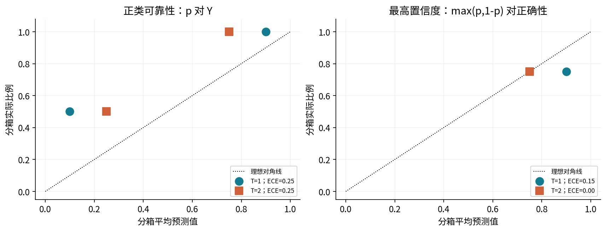
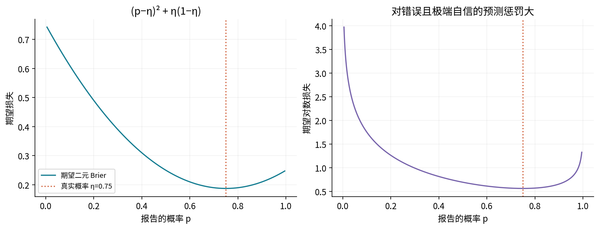
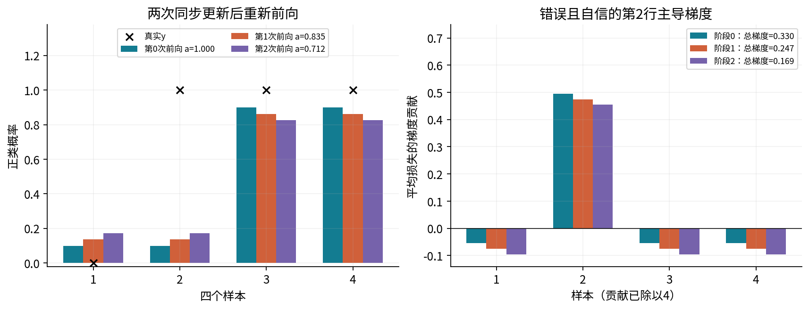
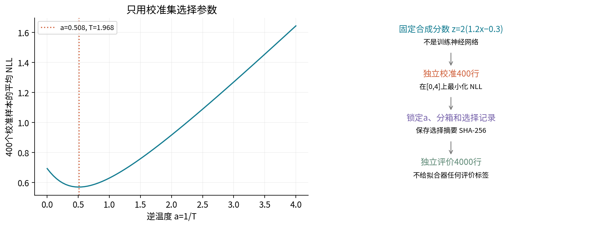
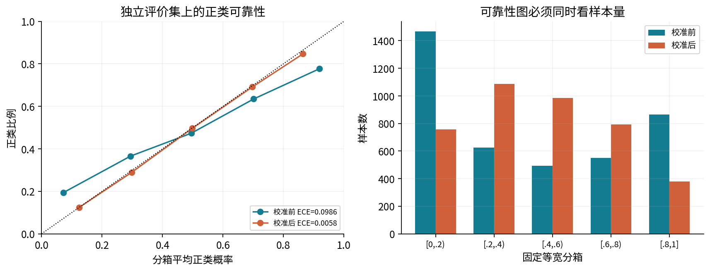
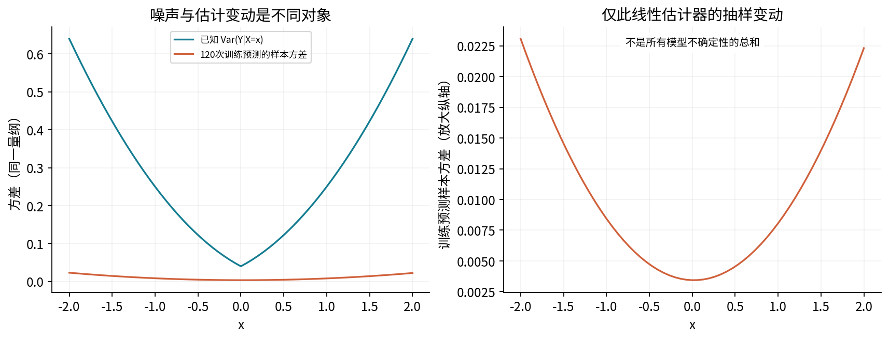
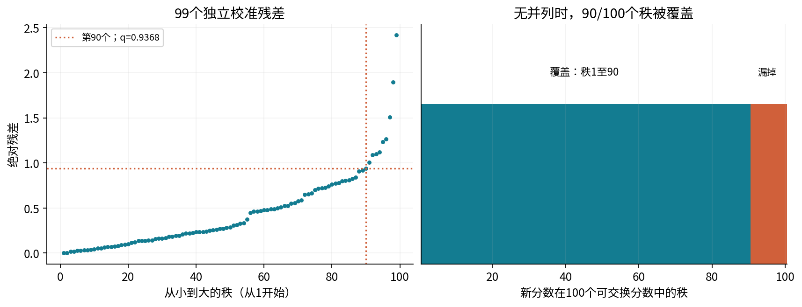
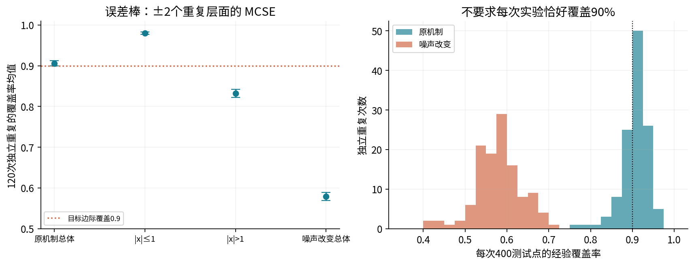
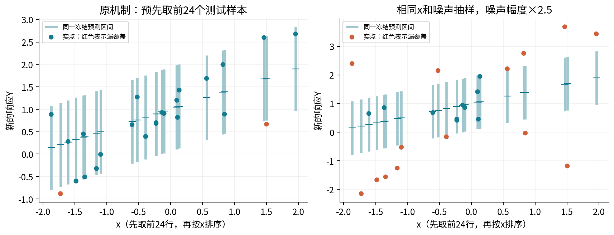
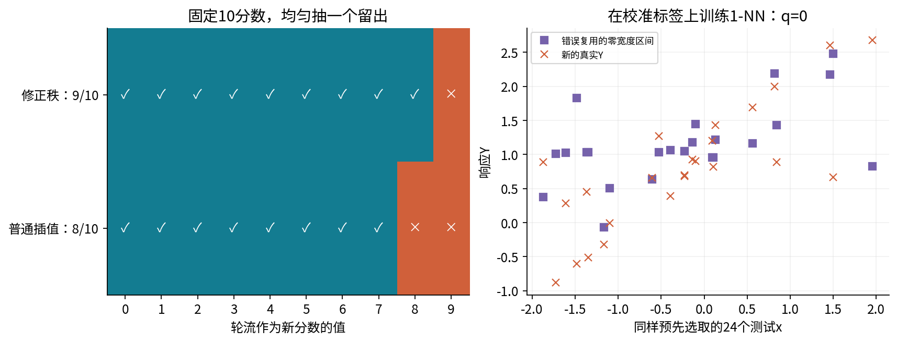

# 第047讲 校准与预测不确定性

从“预测正确多少次”走到“概率是否可信、区间承诺什么”

**阅读路线。** 先修024–025讲的概率与评价流程、042–043讲的概率分类与交叉熵，以及045–046讲的决策、指标。第一次学习请先完成四行纸笔例子，再做独立校准实验，最后读秩证明。建议分三次学习，每次约60–90分钟；不要一口气背完术语。

本讲有两个独立实验。分类部分只调整一个已经固定的合成分数的温度，没有训练神经网络。回归部分先拟合直线，再用另一批样本构造新响应的预测区间。全部数据为合成数据，不含真实人物，不把模拟效果当作现实部署保证。

## 1. 一句“我有九成把握”缺少了什么

若模型对一千次不同情况都输出正类概率0.9，我们可以查看这一组中正类出现的比例。它接近0.9，才是这一组频率与预测的一致。单个事件最终只有0或1；一次预测错误，不能证明0.9这个概率一定错。反过来，一次预测正确也不能证明0.999比0.7更诚实。

必须先说清报告的对象：

- 正类概率：$p(X)$试图描述$P(Y=1\mid X)$。
- 最高置信度：$c(X)=\max\{p(X),1-p(X)\}$描述所选类别的置信度。
- 点预测：$\widehat f(x)$预测响应的位置，通常是均值或中位数。
- 预测集合：$C(x)$给出可能包含新响应$Y$的一组值。

“概率校准”与“预测区间覆盖”不是同一个命题。今天校准良好的分类器，并不会自动产生明天回归任务的90%区间。

## 2. 校准是一个总体条件，而可靠性图是估计

二分类正类校准的理想表达是$E[Y\mid p(X)]=p(X)$，即在相同报告概率的人群中，正类比例与报告一致。连续概率很少恰好相同，实践中将区间$[0,1]$分成若干箱。第$b$箱的样本集合为$B_b$，记

$$\bar p_b=\frac{1}{n_b}\sum_{i\in B_b}p_i,\qquad \bar y_b=\frac{1}{n_b}\sum_{i\in B_b}y_i.$$

可靠性图画$(\bar p_b,\bar y_b)$，不是箱中心与标签比例。点在对角线上方表示这一箱的正类比例比预测更高；但“更高”不总意味着最高类别置信度更高。负类占优的箱需要转换语义。

本讲的分箱误差定义为

$$\widehat{\mathrm{ECE}}_{+}=\sum_{b:n_b>0}\frac{n_b}{n}|\bar p_b-\bar y_b|.$$

空箱计数是0，均值记录为`null`，不能伪造为$(0,0)$。边界采用左闭右开，最后一箱含1；实际边界以程序返回的浮点`edges`为准。固定5箱后，不得再看测试标签改成“效果更好”的箱数。ECE不是无偏估计，也不是可直接当作总体保证的误差上界：粗箱可能让正负误差相互抵消，细箱会增加采样噪声。总要同时看样本数与其他评分。

对最高置信度，则将$p_i,y_i$分别替换为$c_i$与$1\{\widehat y_i=y_i\}$。本讲约定$p_i>1/2$才判1，等于1/2判0。这个对象的ECE记为$\widehat{\mathrm{ECE}}_{\rm top}$。两个ECE必须分开命名。

## 3. 四行反例：一个ECE为零，不代表另一个为零

取$m=2\log3=2.197224577$，原始logit和标签为

| 样本 | 原始logit $z$ | 真实 $y$ | 原始正类概率 |
| --- | --- | --- | --- |
| 1 | −m | 0 | 0.1 |
| 2 | −m | 1 | 0.1 |
| 3 | m | 1 | 0.9 |
| 4 | m | 1 | 0.9 |

用温度$T>0$得到$p_i(T)=\sigma(z_i/T)$。当$T=2$，四个概率变成$(1/4,1/4,3/4,3/4)$，预测类别仍是$(0,0,1,1)$，四行中三行正确。

正类可靠性分为两个非空箱：低分组标签均值$1/2$，高分组标签均值1。因此原来ECE是$\tfrac12|0.1-0.5|+\tfrac12|0.9-1|=0.25$；温度为2时变成$\tfrac12|0.25-0.5|+\tfrac12|0.75-1|=0.25$，没有改善。

最高置信度却不同：原来四行置信度都是0.9，准确率0.75，ECE为0.15；现在置信度全为0.75，ECE为0。原因是两个负logit样本和两个正logit样本被合并到了同一个“置信度箱”。这个有限样本例子不能证明总体完美校准，只能展示两种统计对象的差别。

**读图问题。** 若只保留右图，会隐藏哪两组正类概率误差？图中$T=2$的左侧点为何横坐标为0.25、纵坐标为0.5？请从四行数据回答，而不是从曲线颜色猜测。

## 4. 为什么还要看Brier与对数损失

二元Brier定义为$\mathrm{BS}=n^{-1}\sum_i(p_i-y_i)^2$。注意本讲不再把两个类别的平方误差相加；若采用全向量约定，二元数值会是这里的两倍。

设某个给定$x$的真实正类概率是$\eta$，报告概率为$p$。直接展开得到

$$E[(p-Y)^2\mid x]=\eta(p-1)^2+(1-\eta)p^2=(p-\eta)^2+\eta(1-\eta).$$

第一项在且仅在$p=\eta$时为零，第二项不随报告$p$改变。因此诚实报告真实概率使期望损失最小，这叫严格适当评分。它评价整个概率预测，不能简化为纯粹的“校准误差”：知道更多有用特征、提高分辨能力，也会改善评分。一个总是输出总体正类率的模型可以校准，却未必能区分容易和困难样本。

对数损失的期望为$-\eta\log p-(1-\eta)\log(1-p)$。对$p$求导得$(p-\eta)/[p(1-p)]$，在内部$0<\eta<1$时唯一最小值同样是$p=\eta$。当错误类别概率趋近0，损失趋于无穷；所以少量极端自信的错误会很重要。

四行例子的Brier从$(0.01+0.81+0.01+0.01)/4=0.21$降至$(0.0625+0.5625+0.0625+0.0625)/4=0.1875$。准确率没变、正类ECE没变、Brier变好了，这些结果并不矛盾。**读图问题：** 左图的最低值为什么不是0？右图左右两端的增长为何不对称？

## 5. 温度学习：将每个局部导数接起来

为让优化结构清楚，定义逆温度$a=1/T$，$u_i=az_i$，$p_i=\sigma(u_i)$，并最小化平均交叉熵$L(a)$。这里原始分数$z_i$固定，只更新一个$a$。

$$\frac{\partial\ell_i}{\partial p_i}=-\frac{y_i}{p_i}+\frac{1-y_i}{1-p_i},\quad \frac{\partial p_i}{\partial u_i}=p_i(1-p_i),\quad \frac{\partial u_i}{\partial a}=z_i.$$

连乘并约去分母，得到$\partial\ell_i/\partial a=(p_i-y_i)z_i$。平均损失梯度与Hessian为

$$g(a)=\frac14\sum_{i=1}^4(p_i-y_i)z_i,\qquad H(a)=\frac14\sum_{i=1}^4p_i(1-p_i)z_i^2\ge0.$$

非负Hessian说明对$a$的目标凸；不是说对$T$的任何参数化都自动凸。以下所有梯度贡献均已除以4。我们用学习率$\eta_a=0.5$，同步更新$a^+=\Pi_{[0,4]}(a-0.5g)$。投影是越界时截到边界；本例两步都没有触发。

### 第0次前向与完整局部链

| 行 | p | 损失ℓ | ∂ℓ/∂p | ∂p/∂u | ∂u/∂a | 对g贡献 |
| --- | --- | --- | --- | --- | --- | --- |
| 1 | 0.100000 | 0.105361 | 1.111111 | 0.090000 | -2.197225 | -0.054931 |
| 2 | 0.100000 | 2.302585 | -10.000000 | 0.090000 | -2.197225 | 0.494376 |
| 3 | 0.900000 | 0.105361 | -1.111111 | 0.090000 | 2.197225 | -0.054931 |
| 4 | 0.900000 | 0.105361 | -1.111111 | 0.090000 | 2.197225 | -0.054931 |

以第2行为例：$(-10)\times0.09\times(-2.197224577)/4=0.494375530$。它的错误且自信的预测使梯度显著为正；其余每行贡献约$-0.054930614$。相加得到$g_0=0.329583687$，平均损失$L_0=0.654666660$，Hessian $H_0=0.434501626$。

同步更新$a_1=1-0.5\times0.329583687=0.835208157$。绝不能在算完第1行后就改$a$，再用新$a$算第2行；那会变成另一种算法。

### 第1次前向：所有样本都用同一个新参数

| 行 | 新u | 新p | 新损失ℓ | ∂ℓ/∂p | ∂p/∂u | 对g贡献 |
| --- | --- | --- | --- | --- | --- | --- |
| 1 | -1.835140 | 0.137627 | 0.148068 | 1.159591 | 0.118686 | -0.075599 |
| 2 | -1.835140 | 0.137627 | 1.983207 | -7.266011 | 0.118686 | 0.473707 |
| 3 | 1.835140 | 0.862373 | 0.148068 | -1.159591 | 0.118686 | -0.075599 |
| 4 | 1.835140 | 0.862373 | 0.148068 | -1.159591 | 0.118686 | -0.075599 |

此时每行的$\partial u_i/\partial a=z_i$仍不变。汇总得到$L_1=0.606852480$，$g_1=0.246908489$，$H_1=0.572991218$。再同步更新$a_2=0.835208157-0.5\times0.246908489=0.711753912$。

### 第2次前向：验证刚刚发生的更新

| 行 | 新u | 新p | 新损失ℓ | ∂ℓ/∂p | ∂p/∂u | 对g贡献 |
| --- | --- | --- | --- | --- | --- | --- |
| 1 | -1.563883 | 0.173090 | 0.190060 | 1.209322 | 0.143130 | -0.095079 |
| 2 | -1.563883 | 0.173090 | 1.753943 | -5.777337 | 0.143130 | 0.454227 |
| 3 | 1.563883 | 0.826910 | 0.190060 | -1.209322 | 0.143130 | -0.095079 |
| 4 | 1.563883 | 0.826910 | 0.190060 | -1.209322 | 0.143130 | -0.095079 |

第三次汇总是$L_2=0.581030384$，$g_2=0.168988233$，$H_2=0.691002148$。这并未达到最优点，因为梯度仍为正。记录一次更新而不执行下一次前向，就无法确认更新后的真实损失。

**读图问题。** 为什么第2行正类概率上升，而第3行正类概率下降？它们都经历了同一$a$下降。图左纵轴留出图例空白，不意味着概率可以超过1。

## 6. 不靠迭代器成功消息的解析参照

令$q=\sigma(am)$。四行中三个预测方向正确、一个错误，故$L(a)=-\tfrac34\log q-\tfrac14\log(1-q)$。求导为

$$g(a)=m(q-3/4),\qquad H(a)=m^2q(1-q).$$

令$g=0$得$q=3/4$，于是$am=\log3$，$a^*=1/2$、$T^*=2$，最小损失约0.562335145。这个解析结果独立于数值优化器，是四行协议专用证据。换掉标签后必须重算，不能还硬塞$T=2$。

正式实现对$a\in[0,4]$求解：若左端导数非负，左端就是约束最优；若右端导数非正，右端最优；否则导数异号，二分法缩小根所在区间。结束记录括区宽度、边界状态和投影梯度残差，不以“迭代次数多”替代正确性。

$a=0$表示$T=+\infty$的极限，所有概率为1/2；JSON用温度`null`和单独的无限标记表示。有限正温度保持logit排序，所以保持argmax；无限温度可能将原本不同的分数变成并列，不能沿用同一准确率保证。$a=4$也是预先限定的搜索边界，不是声称找到了无约束最优。

## 7. 稳定计算与数值支持范围

不要用$\log(\sigma(u))$在极端概率处相减或先产生0再取对数。代码令$t=(2y-1)u$，用$\max(-t,0)+\log(1+\exp(-|t|))$计算损失。梯度对正标签用$-\sigma(-u)$，避免$\sigma(u)-1$在大正数时提前变成0。

局部$\partial\ell/\partial p$本身可能大到不可表示，而连乘后梯度仍有限。因此逐行记录对这个局部量允许`null`，含义是该局部商不可安全表示；核心损失与梯度仍用稳定公式。纸笔四行没有这个问题。

本教学API明确支持一维有限实数，长度1至20000；一般logit与响应绝对值不超过1000，回归特征不超过100，逆温度在0至4。拒绝布尔值、字符串、复数、NaN、无穷和非零绝对值小于$10^{-100}$的原始输入。不是任意精度库。线性设计秩亏会拒绝；边界范围也不等于承诺一切病态矩阵都能高精度求解。合成正态分布在数学上无界，默认固定数据全部处于实现范围内；程序不会偷偷裁剪越界样本。

## 8. 独立校准实验：参数选择和评价分开

固定$x\sim N(0,1)$，$\eta(x)=\sigma(1.2x-0.3)$，$Y\mid x\sim\mathrm{Bernoulli}(\eta(x))$，而原始分数故意设成$z=2(1.2x-0.3)$。这是用于看清机制的合成失真，不是训练网络的实测结论。理论上温度2可抵消乘2，但有限校准样本的最优温度会波动。

种子4705，先生成400行校准、再生成4000行独立评价。拟合函数只接收校准logit与标签；真概率列仅帮助解释机制。拟合后把$a$、5个分箱及选择记录锁定并计算摘要，再读取评价指标。改变评价标签或真概率，不得改变选择摘要。

拟合温度为1.968054732，并非强制等于2。下表都是固定协议真实输出。

| 集合 | 阶段 | NLL | 二元Brier | 准确率 | 正类ECE | 最高置信度ECE |
| --- | --- | --- | --- | --- | --- | --- |
| calibration | after | 0.569922 | 0.194426 | 0.680000 | 0.027139 | 0.034679 |
| calibration | before | 0.629814 | 0.208693 | 0.680000 | 0.123016 | 0.125250 |
| evaluation | after | 0.559407 | 0.189806 | 0.720250 | 0.005766 | 0.011821 |
| evaluation | before | 0.624266 | 0.201830 | 0.720250 | 0.098558 | 0.098104 |

**读图问题。** 校准后极端箱样本数为什么少了？为什么评价ECE比校准ECE还低，不是反常或泄漏的充分证据？样本量、具体抽样和绝对值统计量都会影响结果。此次改善不保证任意数据、任意分箱或每一次抽样都改善；温度只能统一缩放，不能修正任意依赖$x$的错误。

## 9. 回归不确定性：先区分噪声与模型变动

现在切换到新的合成回归实验：$X\sim U[-2,2]$，$Y=1+0.6X+\sigma(X)\epsilon$，其中$\epsilon\sim N(0,1)$独立、$\sigma(x)=0.2+0.3|x|$。给定$x$仍然存在的响应变化常称偶然不确定性；因训练样本有限而产生的估计变动属于认知不确定性的一种具体来源。两种划分相对于已有信息定义：如果增加一个能解释噪声的特征，原来的“不可约”可能减少。

每次只用60行训练直线$\widehat f(x)=b+wx$。换一批训练样本，$b,w$也会变。图6左图比较已知噪声方差$\sigma^2(x)$和120次训练预测的样本方差；右图放大后者。这里只估计这个正确设定线性均值估计器的抽样变动，没有声称覆盖全部模型错误、未知分布变化或完整贝叶斯后验。

**读图问题。** 在$x=2$处预测均值可以很稳定，为什么新$Y$仍可能离均值很远？增加训练量通常减少哪一种变动？不能把“均值估计的置信区间”直接改名为“新观测的预测区间”。

## 10. 三份数据如何形成一条区间

先用60行训练数据求最小二乘，再冻结模型。默认实际系数为$b=1.002696684,w=0.459716233$；它不同于真系数$(1,0.6)$，这是有限样本估计，不修正为更好看的真值。

用另外99行校准数据算$s_i=|y_i-(b+wx_i)|$。这些标签没有参与拟合$b,w$。将99个残差从小到大排列，取后面定义的$q$。对独立新输入$x$，预测区间为

$$C(x)=[\widehat f(x)-q,\widehat f(x)+q].$$

以下展示原始顺序前六行校准链，完整99行保存在结果JSON与Notebook中。每行先乘$wx$、加$b$、减实际$y$，最后取绝对值；分数不是训练残差。

| 行 | x | y | 预测 b+wx | 绝对残差 |
| --- | --- | --- | --- | --- |
| 1 | 1.335035 | 1.496429 | 1.616434 | 0.120005 |
| 2 | -1.940014 | -0.807966 | 0.110841 | 0.918807 |
| 3 | -0.378157 | 1.063027 | 0.828852 | 0.234175 |
| 4 | -0.501948 | 1.105420 | 0.771943 | 0.333477 |
| 5 | -0.157097 | 0.947041 | 0.930476 | 0.016564 |
| 6 | -0.970799 | 0.305036 | 0.556404 | 0.251369 |

默认$q=0.936792199$，区间宽度$2q=1.873584399$。第一行评价样本从固定模型到覆盖判断的链为：

| x | 实际y | 预测值 | 下界 | 上界 | 是否覆盖 |
| --- | --- | --- | --- | --- | --- |
| 0.843667 | 0.889857 | 1.390544 | 0.453752 | 2.327336 | True |

这里没有对$q$反向传播或梯度更新。$q$是排序统计量；用温度学习的梯度公式更新它会混淆两种任务。

## 11. 为什么是 n+1：有限样本秩证明

令目标漏覆盖率为$\alpha$，校准样本数$n$。定义

$$k=\lceil(n+1)(1-\alpha)\rceil,\qquad q=s_{(k)}\ \text{若 }k\le n;\quad q=+\infty\ \text{若 }k>n.$$

这里$s_{(k)}$是从1开始计数的第$k$小值。不是对两个相邻残差插值。默认$n=99,\alpha=0.1$，所以$k=\lceil100\times0.9\rceil=90$。

固定训练集和训练得到的模型，假设校准点与新点可交换；独立同分布抽样是足够条件。可交换意味着联合分布不因重新编号而改变，而不只是每个点边缘分布相同。固定同一个评分函数后，$n+1$个分数也可交换。

先假定分数无并列。新分数在$n+1$个位置中的秩均匀。若新分数的秩不大于$k$，去掉它后校准分数的第$k$小值仍至少一样大，新点被覆盖；若秩大于$k$则不被覆盖。于是覆盖概率等于$k/(n+1)\ge1-\alpha$。默认就是90/100。这个概率平均了校准数据和新点的随机性；并不是说给定某一套校准数据后必然至少覆盖90%。

存在并列时，使用闭区间和“分数不大于阈值”的规则保证至少目标覆盖，可能更保守；不再自动声称精确等于$k/(n+1)$。训练模型再差也不破坏这个秩逻辑，但可能需要非常宽甚至无穷的集合，实际效用 仍依赖模型。

**读图问题。** 为什么右图有100个秩，左图只有99个残差？如果把训练残差与新点残差混在一起，哪一步对称性失效？

## 12. 三个看似小的实现细节

**无穷区间。** 当$n=9,\alpha=0.05$，$k=\lceil10\times0.95\rceil=10>9$，现有九个分数没有第10个。正确做法是整个实数轴，覆盖有限$Y$但宽度无穷。取最大值替代无穷会把保证改成最多9/10的无并列秩覆盖。JSON用`infinite=true, quantile=null`表示，不把无穷写成非法JSON数值。

**不要用普通插值。** 固定十个互异分数$0,1,\ldots,9$，均匀选择一个作为新分数，其余九个作为校准分数。这是一个可交换的有限随机实验。$\alpha=0.1$修正秩覆盖9/10；直接取校准分数普通线性90%分位数只覆盖8/10。图10左半保留每种留出情况。

**库方法名称不能替代秩定义。** 对分数1至10，$n=10,\alpha=0.2$，$k=9$，本讲取第9小值9。而`np.quantile(scores, k/n, method='higher')`在当前NumPy得到10，因为该选项基于$(n-1)q$的位置；它在这个例子更保守，却不等于本讲的第$k$小值。代码直接用`np.partition(scores,k-1)[k-1]`，先处理$k>n$。

十进制0.29的中间浮点乘法可能略大于数学整数，使`ceil`错上一个秩。本实现将传入浮点数的规范十进制字符串解释为精确分数再求整秩。例如$n=99,\alpha=0.29$得到$k=71$。这是一条公开的输入语义，不声称还原用户最初未提供的任意实数。

## 13. 一次覆盖率与重复实验分别说明什么

主实验种子4707，60行训练、99行校准、400行评价。固定前24行作为区间展示对象，再按$x$排序绘图，不挑漂亮样本。主实验原机制覆盖率0.8900，不能因小于0.9就判定秩证明失效。

另用预声明种子4708做120次独立重复，每次重新生成三份数据、重新训练、重新校准；每次400个测试点共享同一个区间构建过程。记录每次覆盖率$\widehat C_r$，再计算均值、重复间标准差和$\mathrm{MCSE}=s_C/\sqrt{120}$。这个Monte Carlo标准误针对所模拟重复过程均值的数值估计，不是对任意未来分布的保证。不能把48000个共享校准机制的点全部当独立来算一个过小标准误。

| 评价对象 | 120次均值 | 重复间SD | MCSE |
| --- | --- | --- | --- |
| 原机制总体覆盖 | 0.905958 | 0.032866 | 0.003000 |
| 低绝对值x覆盖 | 0.979855 | 0.015516 | 0.001416 |
| 高绝对值x覆盖 | 0.831958 | 0.053222 | 0.004858 |
| 噪声变化覆盖 | 0.578604 | 0.053925 | 0.004923 |
| 区间宽度 | 1.853438 | 0.211582 | 0.019315 |
| 错误复用覆盖 | 0.000000 | 0.000000 | 0.000000 |

整体均值0.90596与0.9接近，但低绝对值$x$组约0.97985、高绝对值$x$组约0.83196。这里模型用恒定宽度区间，而高绝对值$x$的噪声更大。边际覆盖绝不等于每个分组、每个$x$或每个人都被保证90%。

**读图问题。** 如果把总体覆盖和两个分组覆盖都画到0.90，是否只是“美化”？会抹掉本讲最重要的保证边界。重复更多次数可以更精确地看见分组不均衡，却不能自动修正它。

## 14. 噪声改变：同一模型与区间不再有原保证

现在保留同一$x$、同一标准正态噪声抽样$\epsilon$，只把评价响应改为$Y'=1+0.6x+2.5\sigma(x)\epsilon$。训练与校准不变，也不重新选择$q$。这是一组配对压力测试，不是额外训练或重新校准的结果。

原机制校准分数与新机制测试分数不再可交换。主实验覆盖降至0.5575，120次均值约0.57860。没有任何“分布无关”表述允许略去可交换性前提。若要应对变化，需要先明确变化类型与可获得信息，再设计新方法，并重新证明或评价；不能只凭把区间加宽一点就恢复原来的定理。

**读图问题。** 哪些元素在左右图完全相同？哪些改变？右图的纵轴随更大响应范围调整，比较覆盖应看实点是否落入对应竖线，而不是比较线段的屏幕长度。

## 15. 数据复用：零训练残差不是零不确定性

再故意制作错误流程：用99行校准标签训练1近邻，然后还用这99行计算残差。连续输入几乎肯定互异，每个点都能找到自身，残差全为0，于是$q=0$，得到零宽度区间。对新的连续噪声响应，恰好落在一个点上的概率为0；默认主实验及120次重复的经验覆盖都为0。

这不是“conformal算法很差”的有效比较，因为该流程违反了模型在评分前固定且没有看过校准标签的前提。它是常见泄漏错误的反例。合法的零分数也可能出现，例如真正无噪声且模型完全正确；不能仅看$q=0$就判泄漏，必须审查数据路径。

**读图问题。** 左图漏掉值8时，普通分位数落在校准的7与9之间哪里？右图的点预测有时很接近真实值，为何仍未覆盖？近似准确的点预测不等于正确的零宽度区间。

## 16. 从初学者走向研究问题

本讲只使用对称绝对残差区间，不声称是最短区间。若噪声随$x$变化，可以预先训练尺度函数，使用标准化残差，或学习条件分位数后再校准。尺度或分位数的训练标签不能偷偷与本次校准复用；模型选择之后还需要尊重数据角色。分组校准也需要足够样本和明确的组定义，不等于任意$x$条件覆盖。

多类别温度缩放对每类logit统一除以$T$，有限正温度保持排序，但最高置信度校准、逐类别校准和完整概率向量校准有不同强弱。一个标量不可能表达任意错设。下一步阅读论文时，应逐条确认：评价对象是什么，承诺是边际还是条件，有限样本还是渐近，是否默认无并列，选择过程是否数据依赖。

## 17. 复现、验证与合理失败

实验手册给出完整命令。本讲直接从CSV加载观测数据，再重新生成120次重复；默认数据有SHA-256契约。Notebook第一个物理单元只用标准库校验数据、算法、图代码与环境，之后才导入教学模块，避免先运行被改过的代码再告诉你“校验失败”。脚本可从其他工作目录运行。

独立参照包括100位Decimal四行链、非驻点有限差分、解析温度最优值、SciPy一维优化、scikit-learn评分、中心化标量OLS重算全部120次、精确秩枚举，以及实际1近邻库的错误复用反例。普通与`-O`运行都使用显式条件检查，不把科学验收放在可被优化模式移除的`assert`里。这些检查帮助发现实现错，不替代统计前提。

## 18. 原始资料与本讲自创内容

以下来源支持方法定义与实现核对；四行例子、全部合成数据、公式中间步骤、十图和实验结果为本讲重新制作。

1. Guo等，2017，[On Calibration of Modern Neural Networks](https://proceedings.mlr.press/v70/guo17a.html)。参阅置信度校准与温度缩放定义；本讲未复制其图、未复现其神经网络结果。
2. Angelopoulos与Bates，[A Gentle Introduction to Conformal Prediction](https://arxiv.org/abs/2107.07511)，特别是第1节与附录D的split conformal定义。这里用独立残差实验和自行展开的秩论证解释前提。
3. [scikit-learn 1.8 概率校准说明](https://scikit-learn.org/1.8/modules/calibration.html)及[Brier接口](https://scikit-learn.org/1.8/modules/generated/sklearn.metrics.brier_score_loss.html)。本讲显式指定二元缩放与正类；ECE由公开源码自行实现。
4. [NumPy 2.3 quantile](https://numpy.org/doc/2.3/reference/generated/numpy.quantile.html)。核对插值约定；本讲直接选秩，避免把不同分位数约定混同。

检索核对日期：2026-10-05。继续之前，请不用术语回答三句话：0.9概率承诺什么？90%预测区间平均了哪些随机性？哪一个被破坏的前提足以使覆盖骤降？
