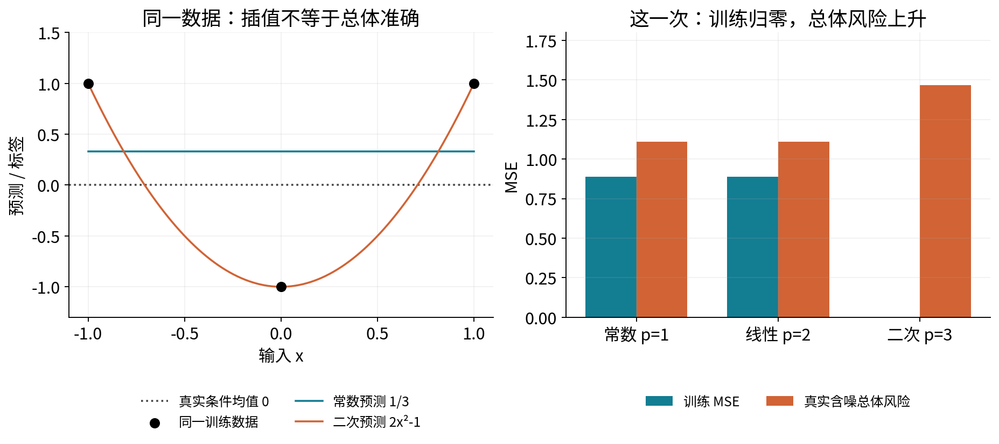
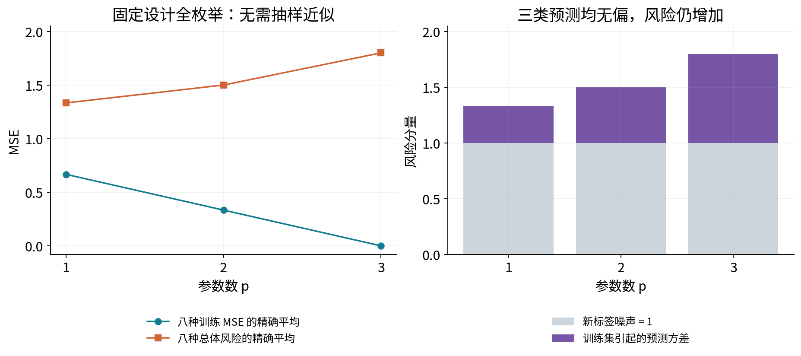
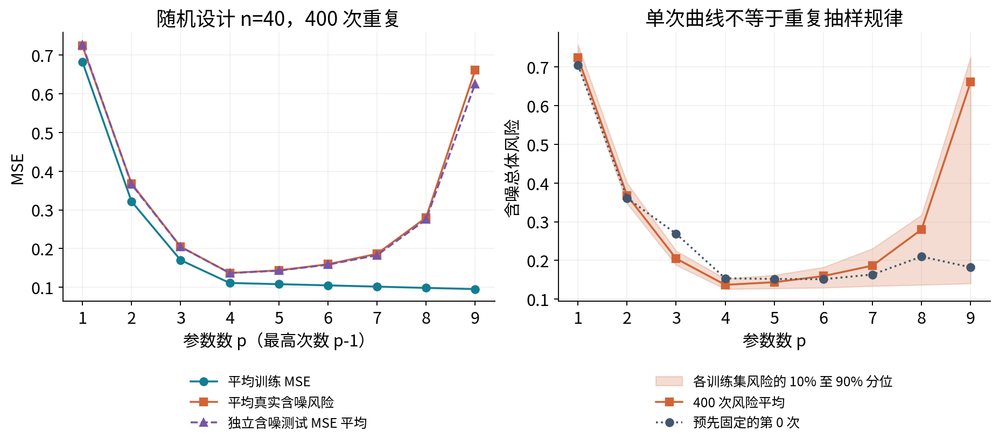
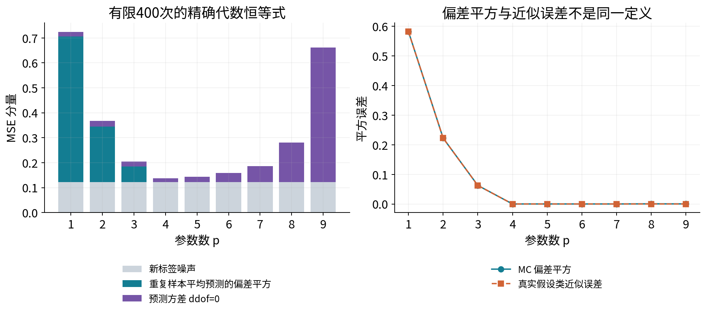
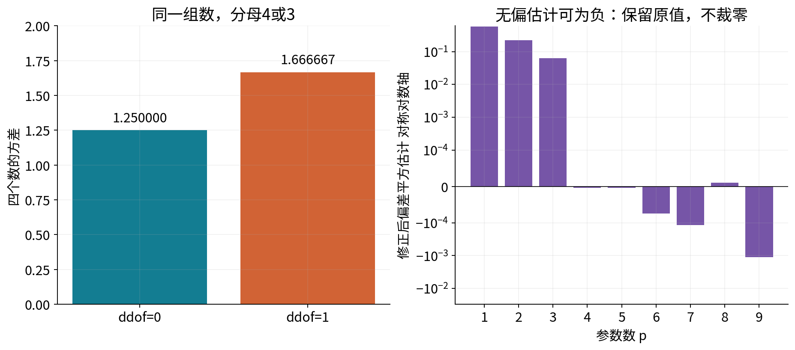
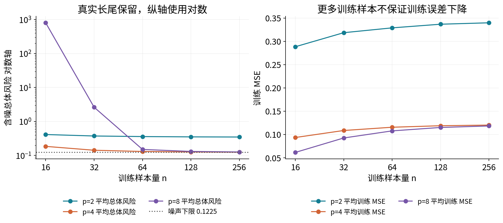
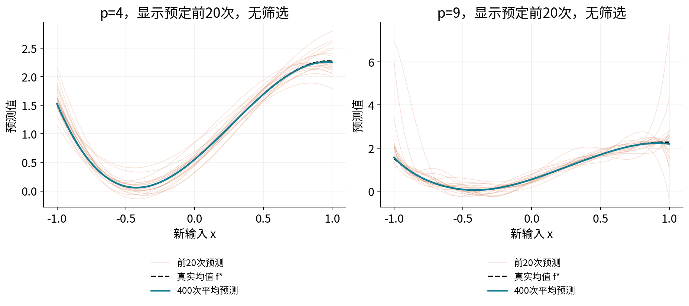
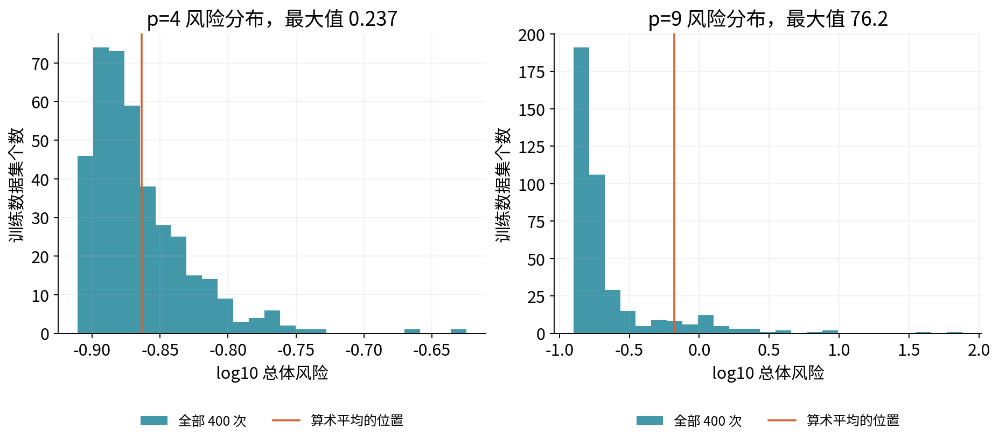
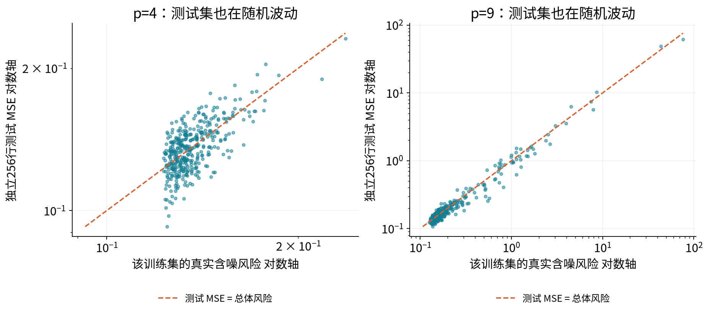
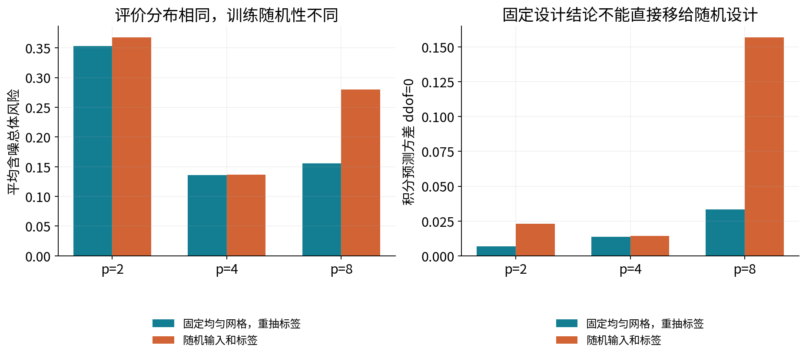

# 第048讲 泛化误差与复杂度

## 1 为什么训练越来越好仍可能预测越来越差

本讲回答一个经常被图形掩盖的问题：训练误差下降时，测试误差为什么可能上升？训练使用的是已经见过的标签；泛化关心的是同一目标机制产生的新样本。一个规则可以越来越适合某次数据中的偶然起伏，同时离可重复的规律越来越远。反过来，复杂度增加也可能同时改善训练和新样本表现，不能预先要求测试曲线一定转弯。

直接先修为019随机变量与期望、022抽样与极限定理、027估计误差与偏差方差、029多元线性回归与数值求解。这里重新定义随机对象、期望下标和设计矩阵，不要求读者记住“偏差方差权衡”口号。阅读顺序是三行纸笔反例、完整分解、八种训练数据的精确枚举、400次真实重采样。

学完后，应能在一张图旁写出：谁在随机变化，谁固定，评价对象是条件均值还是新标签，阴影代表什么，以及一个大误差是否可能来自数值求解。全部数据由明确的教学机制生成，不含现实个人记录。本讲研究统计机制，不声称已经验证某个现实应用。

## 2 先把三种平均区分开

一行观察为 $Z=(X,Y)$，输入X帮助预测标签Y。目标分布记为P。训练数据 $D=(Z_1,\ldots,Z_n)$；算法A读取D，输出函数 $\hat f_D=A(D)$。即使算法每次都确定地求最小二乘，D改变时输出函数通常仍会改变。

本讲的主实验假设训练行独立同分布，且新评价样本 $(X_0,Y_0)$ 与D独立、服从同一个P。这个条件不是装饰：若训练是旧医院、评价是新医院，两个分布不同，训练曲线就不能单独回答部署效果。固定设计小例则把训练输入事先钉住，只让标签噪声变化，评价输入分布另外明确给定。

|平均的对象|固定什么|在平均什么|回答的问题|
|---|---|---|---|
|经验风险|已实现的D和一个函数f|D内的n行损失|在手上数据表现怎样|
|给定训练集的总体风险|训练好的 $\hat f_D$|独立新样本|这一个训练结果未来表现怎样|
|算法的平均总体风险|训练协议与样本量|重新收集D，再抽新样本|重复做整个学习过程通常怎样|

三种量都可能叫“误差”，却有不同的随机性。对一次已经训练好的函数做一万行测试，主要压低测试评估噪声；它不会告诉你换一批训练数据时函数会怎样变。要看到后一种变化，需要重新生成训练数据并重新训练。

## 3 总体风险与经验风险

给定损失函数 $\ell(y,a)$，总体风险为 $R(f)=\mathbb E_{(X_0,Y_0)\sim P}\ell(Y_0,f(X_0))$。经验风险为

$$\hat R_D(f)=\frac1n\sum_{i=1}^n\ell(Y_i,f(X_i)).$$

本讲始终用平方损失 $\ell(y,a)=(y-a)^2$，不加1/2。y若以米计，风险以平方米计。函数f若在D出现之前就固定，i.i.d.条件下有 $\mathbb E_D\hat R_D(f)=R(f)$。但训练函数 $\hat f_D$ 是看过D后选择的，不能直接把f替换成它并宣布训练误差无偏。

原因可以用一句具体的话表达：算法有机会选择刚好在这批数据上显得好的函数。评价数据若也参与这种选择，就不再是一份独立考试。独立测试集 $T=\{(X_j^t,Y_j^t)\}_{j=1}^m$ 上的均方误差是

$$\hat R_T(\hat f_D)=\frac1m\sum_{j=1}^m(Y_j^t-\hat f_D(X_j^t))^2.$$

在T独立于训练及模型选择、同分布且损失可积时，条件期望 $\mathbb E_T[\hat R_T(\hat f_D)\mid D]=R(\hat f_D)$。一次测试仍可能偏高或偏低；“条件无偏”不意味着每一次都准确。若在同一测试集上反复挑最小值，选中函数已经依赖T，这个论证的前提就破坏了。

## 4 假设类和复杂度究竟指什么

假设类 $\mathcal H$ 是允许算法选择的函数集合。小例采用三类：常数 $\mathcal H_1=\{c\}$，一次函数 $\mathcal H_2=\{c+bx\}$，二次函数 $\mathcal H_3=\{c+bx+ax^2\}$。因此 $\mathcal H_1\subset\mathcal H_2\subset\mathcal H_3$。下标p是参数个数，最高次数是p−1，不能把二次函数误叫“两个参数”。

经验风险最小化的解记作 $\hat f_D^{\rm ERM}\in\arg\min_{f\in\mathcal H}\hat R_D(f)$。若同一D、同一损失、没有额外惩罚，且在嵌套类内都求到了全局最小值，较大类至少可以选回较小类的最优函数，所以最小训练风险不会增加。这是可证明的陈述。

它没有证明总体风险的单调性，也不适用于任意非嵌套模型、不同训练数据、不同损失归一化或求解未完成的比较。现实中的“复杂度”还可能与范数、正则强度、有效自由度和算法约束有关，单数参数只是本讲受控实验的横轴，不能拿来统一比较所有算法。

## 5 三行数据从输入一直算到风险

先做固定设计。训练输入钉为 $x=(-1,0,1)$。真实条件均值为 $f^*(x)=0$。每行标签等于独立噪声，噪声以相同概率取−1或1。本次实现为 $y=(1,-1,1)$。评价时新输入 $X_0\sim U[-1,1]$，新噪声独立且也等概率取±1。因此新标签噪声方差为1。

常数最小二乘解是标签均值 $\hat c=(1-1+1)/3=1/3$。线性设计矩阵三行为(1,−1)、(1,0)、(1,1)。两列内积为0，截距仍为1/3；斜率为 $\sum x_i y_i/\sum x_i^2=(-1+1)/2=0$。这一次常数和线性预测完全相同。

|行|x|y|常数预测|残差 预测减标签|平方损失|除以3后的贡献|
|---|---:|---:|---:|---:|---:|---:|
|H1|−1|1|1/3|−2/3|4/9|4/27|
|H2|0|−1|1/3|4/3|16/9|16/27|
|H3|1|1|1/3|−2/3|4/9|4/27|

将最后一列相加得到训练MSE为8/9，不是8/3。二次函数经过三点的方程为 $a-b+c=1$、$c=-1$、$a+b+c=1$。相减得b=0，代回得a=2，所以预测为 $2x^2-1$，三行预测正好为(1,−1,1)，每行损失都为0。

计算新标签风险时，先固定这一次训练出来的函数g。由于新噪声均值0且与g独立，交叉项期望消失，有 $R(g)=\mathbb E g(X_0)^2+1$。常数风险是 $1/9+1=10/9$。均匀分布下 $\mathbb E X_0^2=1/3$、$\mathbb E X_0^4=1/5$，所以

$$R(2x^2-1)=4\mathbb E X_0^4-4\mathbb E X_0^2+1+1=\frac{22}{15}.$$

训练MSE从8/9降到0，总体风险却从10/9升到22/15，增加16/45。这里不需要梯度下降、欠收敛或神秘的测试集：两个优化问题都已精确解完，变化来自学到的函数和目标分布之间的关系。

读图问题：三点处的二次残差为0，为什么两点之间仍出现错误？常数风险10/9中的1/9和1分别来自哪里？最后那一个1若已经写在风险里，还能再加一次吗？

## 6 条件均值为什么是平方损失的最优预测

定义 $f^*(x)=\mathbb E[Y\mid X=x]$，令 $\varepsilon=Y-f^*(X)$。于是 $\mathbb E[\varepsilon\mid X]=0$。对任意给定x处的数a，先加减条件均值，再展开：

$$\mathbb E[(Y-a)^2\mid X=x]=\mathbb E[(Y-f^*(x))^2\mid X=x]+(f^*(x)-a)^2.$$

交叉项为 $2(f^*(x)-a)\mathbb E[Y-f^*(x)\mid X=x]=0$。第一项与a无关，第二项最小为0，所以a取条件均值最优。再对X平均可得

$$R(f)=R^*+\mathbb E_X[(f(X)-f^*(X))^2],\qquad R^*=\mathbb E_X\operatorname{Var}(Y\mid X).$$

这里假设二阶矩存在，函数可测并具有有限平方风险。$R^*$ 是在当前特征X、当前标签定义与平方损失下的Bayes风险，不是说任何额外信息都无法减少它。增加一项真正有信息的输入可能降低条件噪声；单纯把同一X上的函数变复杂不能解释一个独立新噪声的具体实现。

## 7 偏差方差分解需要哪些条件

固定评价位置x，训练数据D随机。定义 $\mu(x)=\mathbb E_D\hat f_D(x)$。这里的期望也可以把算法随机数包含在D之外的独立随机源中，但必须说明。本讲算法为确定的最小二乘，训练输入与标签是主随机源。

本节的条件为：新标签与训练过程在给定评价x后独立；$\mathbb E[Y_0\mid X_0=x]=f^*(x)$；新标签条件方差 $\sigma^2(x)$ 有限；训练预测的二阶矩有限。正态分布、线性模型、同方差都不是这条恒等式的必要条件。训练行i.i.d.是主实验协议和一些进一步结论的条件，不是展开一个平方本身的条件。

写成三个部分：

$$Y_0-\hat f_D(x)=\underbrace{Y_0-f^*(x)}_{a}+\underbrace{f^*(x)-\mu(x)}_{b}+\underbrace{\mu(x)-\hat f_D(x)}_{c}.$$

平方后是 $a^2+b^2+c^2+2ab+2ac+2bc$。b固定；$\mathbb E a=0$ 消去ab；$\mathbb E_D c=0$ 消去bc；新标签噪声与训练预测的独立性及零均值消去ac。于是

$$\mathbb E_{D,Y_0\mid x}[(Y_0-\hat f_D(x))^2]=\sigma^2(x)+(\mu(x)-f^*(x))^2+\operatorname{Var}_D(\hat f_D(x)).$$

偏差是有符号的 $\mu-f^*$，风险分解里出现的是偏差的平方。方差描述在同一个x处重新训练后预测的离散程度，不是测试集所有x处预测值的方差，也不是某一次残差的方差。最后对目标X的分布积分，才得到算法的平均总体风险。

如果评价目标是条件均值 $f^*(X_0)$ 而不是含噪标签Y，左侧应改为 $\mathbb E_{D,X_0}(f^*(X_0)-\hat f_D(X_0))^2$，此时只有偏差平方加方差，不加新标签噪声。图、代码字段和论文里的“MSE”必须先查评价对象。

## 8 用八种数据精确看见训练方差

回到三行固定设计。每个噪声独立取±1，全部训练标签组合共有 $2^3=8$ 种，概率都是1/8。对每种组合重新拟合，已经穷尽这个训练随机机制，没有蒙特卡洛误差。

常数解是 $\hat c=(\varepsilon_1+\varepsilon_2+\varepsilon_3)/3$。它的均值0，方差为 $(1+1+1)/9=1/3$，对所有x都相同。因此平均总体风险为1+1/3=4/3。

线性解是 $\hat c=(\varepsilon_1+\varepsilon_2+\varepsilon_3)/3$ 与 $\hat b=(\varepsilon_3-\varepsilon_1)/2$。方差分别1/3与1/2，协方差为 $(-1+1)/6=0$。在新x处的预测方差是 $1/3+x^2/2$，对均匀X积分得1/2，所以平均风险3/2。

二次插值可以不用矩阵求逆，直接写为

$$\hat f_D(x)=\varepsilon_1\frac{x^2-x}{2}+\varepsilon_2(1-x^2)+\varepsilon_3\frac{x^2+x}{2}.$$

三个系数函数分别在自己的训练点取1、另两点取0。噪声独立且方差1，预测方差等于三个系数函数的平方和。逐项积分：两端各为 $(1/5+1/3)/4=2/15$，中间为 $1-2/3+1/5=8/15$，合计4/5。平均风险为9/5。

|参数数p|平均训练MSE|积分偏差平方|积分预测方差|新标签噪声|平均总体风险|
|---|---:|---:|---:|---:|---:|
|1|2/3|0|1/3|1|4/3|
|2|1/3|0|1/2|1|3/2|
|3|0|0|4/5|1|9/5|

三类都包含真实零函数，所以近似误差都为0；三类的预测也都无偏。增加复杂度没有带来降低偏差的收益，却增加了预测方差。总体风险在整个比较范围内上升，没有先下降再上升。U形不是学习理论的公理。

读图问题：既然训练噪声已经影响橙色或紫色分量，为什么仍需加一个新标签噪声？因为那是另一份独立的新观察噪声。若只预测均值0，哪一段柱高应被去掉？

## 9 近似误差和估计误差怎样分开

设 $f_{\mathcal H}^*\in\arg\min_{f\in\mathcal H}R(f)$，即知道总体P后在限制类内选择的最佳函数。为简洁先假定极小值可达到；否则改用下确界和任意接近最优的函数。对精确ERM有

$$R(\hat f_D^{\rm ERM})-R^*=\underbrace{R(f_{\mathcal H}^*)-R^*}_{\text{近似误差}}+\underbrace{R(\hat f_D^{\rm ERM})-R(f_{\mathcal H}^*)}_{\text{估计误差}}.$$

两个量在本定义下都非负。近似误差是函数集合的表达限制；估计误差是只能用有限数据而不是总体P来选函数的代价。第二项对具体D而言随机，平均后才是算法平均估计误差。

近似误差不是偏差平方的同义词。偏差平方使用“反复训练后平均的预测”与 $f^*$ 的距离；近似误差使用“总体最优类内函数”与 $f^*$ 的风险差。两者涉及不同函数。有限样本拟合、正则化、选择和算法约束都可能改变平均预测。特别地，某些非凸假设类的函数平均未必仍在该类中，也不能未经证明套用投影直觉。

主实验采用总体正交线性基底，近似误差有清楚的尾系数表达式；这只是一个可解析的特例。不要把这个特例推广成“所有模型的偏差都等于表达不足”。

## 10 优化误差不能随意塞成第三个非负加项

实际算法输出 $\tilde f_D$ 时，通常能控制的是经验目标上的差

$$\epsilon_{\rm opt}=\hat R_D(\tilde f_D)-\inf_{f\in\mathcal H}\hat R_D(f)\geq0.$$

如果为了凑出三个词，写总体风险差为“近似+估计+优化”，第三项必须明确是什么。代数上取 $R(\tilde f_D)-R(\hat f_D^{\rm ERM})$ 可以使等式成立，但它可能为负。没有完全拟合训练噪声的算法，有时在总体上反而比精确ERM好；这个总体差不能等同于上面的非负经验优化误差。

一个可靠的联系是上界。令 $\Delta_D=\sup_{f\in\mathcal H}|R(f)-\hat R_D(f)|$，假定它有限。在两边加减经验风险，逐步得到

$$R(\tilde f_D)\leq\hat R_D(\tilde f_D)+\Delta_D\leq\hat R_D(f_{\mathcal H}^*)+\epsilon_{\rm opt}+\Delta_D,$$

$$R(\tilde f_D)-R^*\leq[R(f_{\mathcal H}^*)-R^*]+2\Delta_D+\epsilon_{\rm opt}.$$

第一项是近似限制，中间项控制从样本到总体的偏差，最后项是求解不足。它是有条件的上界，不是可从三条训练曲线直接读出的等式。对无界系数和平方损失，$\Delta_D$ 往往不能直接得到有用的有限统一界，需额外约束和矩条件；本讲不把这条形式推导包装成主实验的数值保证。

三行例中，零函数总体风险为1、训练MSE为1；二次ERM总体风险22/15、训练MSE为0。选择零函数的经验优化误差是1，但相对ERM的总体风险差是−7/15。这正说明两个“优化差”不能混用。

## 11 固定设计与随机设计分别在重复什么

固定设计指训练输入矩阵被条件化为已知，重复时只重抽标签噪声。三行枚举就是这种实验。主实验则每次重新抽输入X和标签噪声，叫随机设计。即使输入总体分布相同，一次样本也可能在边界留下空白，使高次拟合特别敏感。

本讲另设40点固定网格，从−0.95等距到0.95，每次重抽正态标签噪声。它与随机设计都用 $U[-1,1]$ 作为新输入评价分布。这样评价任务相同，但训练设计不同。固定网格风险不能被当作随机设计风险的无偏估计。

若再引入算法随机种子U，总预测方差还可按全方差公式写成 $\mathbb E_D\operatorname{Var}_U(\hat f\mid D)+\operatorname{Var}_D\mathbb E_U(\hat f\mid D)$。只在同一个D上重启算法，只测到了第一类变化的一部分；只重分现有数据也不等于真的从总体重新收集独立训练集。主实验是模拟器中独立重生成，现实中通常做不到这么彻底。

## 12 让总体风险可以用两条路线算清

主实验中 $X\sim U[-1,1]$，$Y=f^*(X)+\varepsilon$，$\varepsilon\sim N(0,0.35^2)$ 且独立于X。采用归一化Legendre基底 $\phi_j(x)=\sqrt{2j+1}P_j(x)$，满足 $\mathbb E[\phi_j(X)\phi_k(X)]=\mathbf1\{j=k\}$。

前四项为 $\phi_0=1$、$\phi_1=\sqrt3x$、$\phi_2=\sqrt5(3x^2-1)/2$、$\phi_3=\sqrt7(5x^3-3x)/2$。高阶项可由递推式 $(j+1)P_{j+1}=(2j+1)xP_j-jP_{j-1}$ 生成，代码使用NumPy的legvander，不手写不稳定的显式逆矩阵。

真系数为 $\beta=(1,0.6,0.4,-0.25,0,0,0,0,0)$。类 $\mathcal H_p$ 使用前p列，p取1至9。把拟合系数补零到9维为 $\hat\beta_D$，正交性给

$$\mathbb E_X[(\hat f_D(X)-f^*(X))^2]=\sum_{j=0}^{8}(\hat\beta_{Dj}-\beta_j)^2.$$

因此某次含噪总体风险为这项加0.1225。类近似误差为 $\sum_{j=p}^{8}\beta_j^2$，p=1、2、3、4时依次为0.5825、0.2225、0.0625、0。独立数值参照用32节点Gauss–Legendre求积直接积分函数平方，而不是再次使用同一个系数平方公式。

归一化基底只改善坐标表达，不改变同次数多项式函数类；总体正交也不意味着每次有限随机训练矩阵的列正交。高阶项在数据稀少的区间仍可能产生巨大预测。这是后面不漂亮结果的关键。

## 13 复杂度曲线的实际结果

协议在执行前固定：随机种子48019，独立训练重复400次；复杂度曲线每次使用40行；同一次的所有p共享相同训练数据和独立256行测试数据。这种配对减少比较中的无关波动。没有依据曲线改随机种子，没有排除高误差或“异常”训练集，也没有用测试结果选择部署模型。

|p|平均训练MSE|平均真实风险|平均测试MSE|风险平均的MC标准误|
|---|---:|---:|---:|---:|
|1|0.682581|0.723821|0.726803|0.001363|
|2|0.321812|0.368057|0.366095|0.001226|
|3|0.170144|0.204815|0.204376|0.001136|
|4|0.111081|0.136885|0.136661|0.000640|
|6|0.104911|0.159485|0.158402|0.004035|
|8|0.098290|0.279944|0.275114|0.037118|
|9|0.095320|0.661216|0.625798|0.221713|

全部9个p和每次原始结果都保存在JSON中。400次平均在p=4附近较低，但这不是给现实应用选p的证据。p=9风险的标准差约4.4343，平均的蒙特卡洛标准误约0.2217，少量大风险训练集强烈影响均值。这种长尾下不能随手把均值±1.96标准误当作已经可靠校准的95%区间。随机设计的近奇异事件可能使总体风险的矩条件很弱；本讲没有证明每个高阶小样本配置的无限重复风险均值或方差都有限。因此这里的均值与SD/√400首先是有限结果的描述量，不是已知总体期望或无条件CLT保证。

读图问题：某个单次p=9模型优于p=8，是否否定平均趋势？平均值落在分位带的较高位置意味着什么？10%至90%分位带能否反映最大的10%风险幅度？它不能，所以还必须看尾部分布。

## 14 有限重复次数中的偏差方差究竟怎么算

对固定x有B次预测 $g_1,\ldots,g_B$，平均为 $\bar g$。直接展开并利用 $\sum_b(g_b-\bar g)=0$，有有限数据的代数恒等式

$$\frac1B\sum_b(g_b-f^*)^2=(\bar g-f^*)^2+\frac1B\sum_b(g_b-\bar g)^2.$$

右侧方差分母是B，对应ddof=0。这里B=400。它使当前400次结果精确分解，不表示总体预测方差已经被精确知道。若目标是用独立重复样本无偏估计真实方差，则用 $s^2=\sum_b(g_b-\bar g)^2/(B-1)$，对应ddof=1。

ddof=1不能原封不动与当前 $(\bar g-f^*)^2$ 相加冒充同一有限样本恒等式。另一方面 $\mathbb E(\bar g-f^*)^2=(\mu-f^*)^2+\operatorname{Var}(g)/B$，所以 $\widehat{\text{Bias}^2}_{u}=(\bar g-f^*)^2-s^2/B$ 是偏差平方的无偏估计。在有限样本中它可能为负，不能因为真实平方非负就静默裁为0。

这两个改动配对后仍有 $\widehat{\text{Bias}^2}_{u}+s^2=(\bar g-f^*)^2+(B-1)s^2/B$。代码同时保存两套量。p=4的修正估计约−0.000003858，p=9约−0.001122537，原值完整保留。它们是估计量的波动，不是“真实偏差平方小于零”。

## 15 学习曲线改变的是样本量

复杂度曲线固定n、改变模型类；学习曲线固定模型类和训练协议、改变n。主实验对p=2、4、8分别取n=16、32、64、128、256。每次先生成256行，较小n取前缀，所以同次不同n配对，横轴各点并非彼此独立。

|n|p=2平均风险|p=4平均风险|p=8平均风险|
|---|---:|---:|---:|
|16|0.412658|0.184745|805.824574|
|32|0.373583|0.142054|2.630797|
|64|0.359238|0.130759|0.150207|
|128|0.351831|0.126243|0.130945|
|256|0.348252|0.124360|0.126403|

p=2即使增加到256行仍存在类近似误差0.2225，加新噪声后的理想类内风险是0.345。更多样本主要减少估计部分，无法让固定的线性函数类表达三次真函数。p=4包含真实函数，在本机制下更接近噪声下限。

p=8、n=16的平均风险约805.825，最大单次风险约118455.528；风险标准差约7564.775，平均的MC标准误约378.239。不是把它删掉后再画一条漂亮线，而是用对数纵轴显示，同时报告极值和均值的不稳定性。n=16的最高设计条件数约4198.08；所有主实验的正规方程平均残差最大约 $6.81\times10^{-14}$。大泛化误差可以与很小的优化残差同时出现。

读图问题：p=2的训练误差和测试误差都较高时，继续增加n为何可能收益有限？p=8从n=16到32的下降能否量化成真实任务的样本复杂度？不能，这里只给有限模拟中的机制证据。

## 16 预测方差和一次测试波动不是一回事

图6把预先指定的前20次拟合画出来，并叠加全部400次平均函数。同一x处的函数散开显示训练集敏感性。图7进一步展示每次已训练函数的真实总体风险，避免一个平均数掩盖稀有大误差。

第86次训练数据的p=9真实风险约76.1773，独立256行测试MSE约61.3895。有限测试可能明显低估这一个模型的真实风险，但这里已知真函数，所以能直接发现差距。现实任务中没有这种总体答案，只能通过评估设计、重复性和不确定性分析降低误判。

如果固定D只重抽测试集，变化是评估误差；如果重新抽D并重新训练，变化还包含学习算法的训练集敏感性。对每次D都用新T时，测试MSE的总方差可用全方差公式分成 $\operatorname{Var}_D R(\hat f_D)+\mathbb E_D\operatorname{Var}_T(\hat R_T\mid D)$。这与点态预测方差 $\operatorname{Var}_D\hat f_D(x)$ 又不是同一个量。

## 17 改变训练设计会改变答案

固定40点网格时，p=2、4、8的平均真实风险分别约0.353366、0.136245、0.155805；随机设计对应约0.368057、0.136885、0.279944。固定设计避免了某些随机输入覆盖不足的情形，所以这里高复杂度的方差较小。

这不是建议现实里把所有数据排成规则网格，也不说明固定设计总更好。实际采样成本、可控输入、目标分布和边界覆盖都需重新讨论。它说明当别人给你偏差方差结论时，应追问“期望是对什么取的”，而不只是看最后的三个数字。

## 18 从教学机制走向研究判断

读论文或设计实验时，先写清总体、采样单位、数据划分、评价目标与选择协议，再报告结果。训练和测试来自不同人群、重复个体跨划分、预处理读了测试标签等问题，不能用一句“高方差”概括。训练误差和测试误差的差值叫泛化间隙，它不等于预测方差，也不等于估计误差。

一张U形曲线只描述某个复杂度族、数据机制、训练算法和样本区间。更复杂模型可能仍处于偏差减少区，也可能通过约束和数据结构控制方差；曲线可能平坦、单调或有多个转折。本讲不从有限p=1至9外推到所有过参数化模型，也不把“参数更多”当作独立于训练方法的结论。

诊断优化时看的是目标值、最优性条件、求解状态与数值稳定性；诊断统计泛化时看的是独立评估、重采样变化和目标分布。本实验直接求最小二乘，没有“训练多少轮”的横轴。刻意加入不相关的梯度轮数只会模糊问题。

完整报告至少同时留下均值、重复次数、离散程度、尾部或失败结果、真实协议与代码入口。对于重尾结果，继续收集更多重复可减少某些蒙特卡洛不确定性，但不能凭一次均值稳定就证明总体期望已被识别。若要进一步采用正则化，必须预先声明新的算法和比较协议，而不是悄悄修饰本讲的原实验。

## 19 本讲练习

1. 用自己的话区分经验风险、给定D的总体风险、平均总体风险，并写出各自平均的随机对象。
2. 重算三行常数模型的每行残差、平方损失和平均贡献。为什么不能再除一次3？
3. 解三行线性及二次最小二乘，并算出本次两类总体风险的差。
4. 从条件期望出发证明平方损失的Bayes预测为条件均值，并列出矩条件。
5. 完整展开固定x的偏差方差分解，指出三个交叉项分别为何为0。
6. 若评价目标是无噪条件均值，分解如何变化？若新噪声与训练预测相关，哪个步骤失败？
7. 推出三行常数模型在八种标签下的平均风险4/3，不逐一列完也应写出随机性来源。
8. 推出线性模型的截距、斜率方差和协方差，再对新输入积分。
9. 推导二次插值的三个系数函数，逐项积分得到预测方差4/5。
10. 证明嵌套类的最小训练风险不增，并说明四种使比较前提失效的改变。
11. 分清近似误差与偏差平方；给出本讲一个近似误差为0但风险大于噪声的例子。
12. 用三行零函数与二次ERM说明经验优化误差非负但总体风险优化差可为负。
13. 从统一偏差 $\Delta_D$ 推导三项上界，说明何时该界可能无用。
14. 在Legendre实验中算p=1、2、3、4的近似误差，并解释系数补零。
15. 对预测值−1、0、1、2及真值0计算均值、偏差平方、ddof=0和ddof=1方差，验证两套恒等式。
16. 解释p=9的风险标准差4.4343与MC标准误0.2217的区别。10%至90%带是否是均值置信区间？
17. 解释p=2学习曲线的下限0.345以及p=8、n=16的大风险为何不等于欠收敛。
18. 区分“同D重复随机初始化”“重新抽D”“只重新抽测试集”三种实验能回答的问题。
19. 设计一个不利用最终测试集选择复杂度的验证协议，并说明本讲曲线能和不能支持的结论。
20. 复核一个实际结果：取第86次p=9，核算真实风险与测试MSE的差；解释为何不能因此删除这次训练集。

## 20 来源与进一步阅读

推导、三行例、全枚举、Legendre协议与全部图为本讲原创计算。以下资料用于概念与API核对，未复制其示例结果。在线stable页面版本可能高于本机；实际执行锁定版本与来源核对日期见source-checks.json。

- James等，An Introduction to Statistical Learning，统计学习、测试误差与灵活度的入门背景，https://www.statlearning.com/
- scikit-learn官方，Validation curves 与 learning curves，区分横轴及训练验证曲线，https://scikit-learn.org/stable/modules/learning_curve.html
- scikit-learn官方，Single estimator versus bagging，反复训练的预测偏差方差解释，https://scikit-learn.org/stable/auto_examples/ensemble/plot_bias_variance.html
- NumPy官方，var的ddof分母约定，https://numpy.org/doc/stable/reference/generated/numpy.var.html
- NumPy官方，lstsq的解、秩、奇异值返回值，https://numpy.org/doc/stable/reference/generated/numpy.linalg.lstsq.html

本讲自查包括精确分数积分、SciPy枢轴QR、scikit-learn同目标拟合、全量结果恒等式、普通与优化模式新进程和真实Notebook新核执行。作者自查不等于独立课程验收；详细运行证据与限制随实验文件提供。
