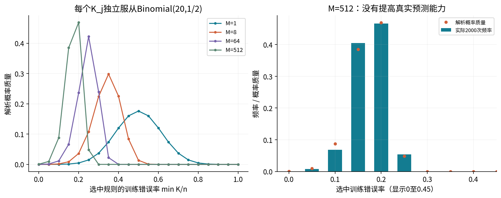

# 第049讲 练习详解

学习理论的第一组保证

以下二十二题对应独立实验手册。小数用于阅读，精确分数、计数与完整随机重复记录在数据和结果JSON中。概率界是带前提的结论，不能靠只报告一个漂亮数字代替前提。

## 1. 三个风险

总体风险$R(h)=E[\ell(h(X),Y)]$对数据分布取期望。经验风险$\widehat R_S(h)=n^{-1}\sum_i\ell(h(x_i),y_i)$是当前样本平均。选中规则的超额风险是$R(\widehat h)-\min_{h\in\mathcal H}R(h)$，比较的是两个总体风险。

经验风险并不等于优化误差。优化误差比较当前经验目标和可达到的最小经验目标；本例完整枚举所以优化误差为0，但选中规则仍可能有正超额风险。

## 2. 精确总体风险

H2在$(-2,1),(-1,1),(1,0),(2,0)$四个结果上出错，概率相加为$(1+6+6+1)/64=14/64=7/32$。

H1在$x=-1$预测1，错误结果换成$(-1,0)$，于是风险$(1+18+6+1)/64=26/64=13/32$。两者相差$12/64=3/16$。这来自真实分布权重，不是观察样本时错了几次。

## 3. 六行完整账本

| 行(x,y) | 五个预测 H0…H4 | 五个损失 H0…H4 |
| --- | --- | --- |
| (−2,0) | 1,0,0,0,0 | 1,0,0,0,0 |
| (−1,1) | 1,1,0,0,0 | 0,0,1,1,1 |
| (−1,0) | 1,1,0,0,0 | 1,1,0,0,0 |
| (1,1) | 1,1,1,0,0 | 0,0,0,1,1 |
| (2,1) | 1,1,1,1,0 | 0,0,0,0,1 |
| (2,0) | 1,1,1,1,0 | 1,1,1,1,0 |

逐列求和$(3,2,2,3,3)$，除以6得到$(1/2,1/3,1/3,1/2,1/2)$。并列集合H1、H2；按声明顺序选H1。不要把“两个最小值相同”理解为两规则预测完全相同。

## 4. 追加整批后的选择与下一前向

新增$(-1,0)$对五规则的损失是$(1,1,0,0,0)$；新增$(1,1)$是$(0,0,0,1,1)$。两者加到旧计数得到$(4,3,2,4,4)$，除以8为$(1/2,3/8,1/4,1/2,1/2)$，唯一最优H2。

选中模型对四个输入$(-2,-1,1,2)$的预测从H1的$(0,1,1,1)$变成H2的$(0,0,1,1)$。真实风险从13/32变成7/32。这里新增标签用于训练，不是允许在封存评价集上随意更新。

## 5. 没有梯度，但有完整计算链

参数空间是五个命名规则的有限列表，目标为按行比较标签得到的0-1损失。算法完整算出五个总损失后取最小值，不需要可微性，也不存在一个被代码执行的梯度步骤。

每行对平均风险的贡献是损失除以当前样本数。第2行对H2贡献1/6，追加后相同旧行贡献1/8。分母变化也是重新求平均的一部分。完整科学链可以是前向→损失→汇总→有限选择→下一次前向，不应伪造导数。

## 6. 固定规则界的前提

第一，当前评价样本没有参与选择这个规则，或已条件于与当前样本独立的训练过程。第二，当前观测是独立同分布的。第三，损失在[0,1]。

概率对整份随机样本$S$而言：反复抽样时，经验风险偏离固定总体风险超过ε的概率不超过$2e^{-2n\epsilon^2}$。不是对单个标签正确性的概率，也不是给真实风险指定一个后验分布。

## 7. 指数矩到Hoeffding

对$Z\in[0,1]$，中心化对数矩母函数$K(\lambda)=\log E e^{\lambda(Z-EZ)}$满足$K(0)=K'(0)=0$。其二阶导是指数倾斜分布下的方差；范围仍为[0,1]，所以$K''\le1/4$。两次积分得$K\le\lambda^2/8$。

Markov不等式给出$P\{\sum(Z_i-EZ_i)>n\epsilon\}\le e^{-\lambda n\epsilon}E e^{\lambda\sum(Z_i-EZ_i)}$。**独立性**允许把最后期望写成各项期望乘积，再以指数矩上界控制为$e^{-\lambda n\epsilon+n\lambda^2/8}$。

对λ求最小值，$-n\epsilon+n\lambda/4=0$得λ=4ε，代回为$e^{-2n\epsilon^2}$。对负偏差重复，再将两个尾部相加，系数变成2。

## 8. Union bound不用规则独立

对任意事件$A_1,\ldots,A_M$，逐个结果检查可得$1\{\cup_jA_j\}\le\sum_j1\{A_j\}$。取期望后为$P(\cup_jA_j)\le\sum_jP(A_j)$。事件可以强烈相关，甚至完全相同；那样界可能很松，但仍成立。

独立性要求在Hoeffding对每个规则的观测损失序列中使用，而不是在这一步要求不同规则之间独立。本讲五个阈值损失相关，却可使用union bound。

## 9. 同时半径的代数

将单个坏事件上界相加得$2M e^{-2n\epsilon^2}$。希望它不超过δ，先取对数：$\log(2M)-2n\epsilon^2\le\log\delta$。移项为$2n\epsilon^2\ge\log(2M/\delta)$，取非负平方根得到

$$\epsilon\ge\sqrt{\frac{\log(2M/\delta)}{2n}}.$$

使用这个半径时，所有规则同时满足偏差界的概率至少1−δ；因此选择类中的任意规则也被保护。若类是在看过这份数据后任意构造的，还需要额外分析。

## 10. ERM三项分解

插入两个经验风险：$R(\widehat h)-R(h^*)=[R(\widehat h)-\widehat R(\widehat h)]+[\widehat R(\widehat h)-\widehat R(h^*)]+[\widehat R(h^*)-R(h^*)]$。

同时好事件控制第一与第三项各不超过ε。精确ERM让第二项不大于0，所以超额风险不大于2ε。若经验优化误差不超过ζ，则第二项最多ζ，得到2ε+ζ。

这不是$R(\widehat h)\le2\epsilon$，因为还必须加上类内最小总体风险。默认最小风险为7/32，不能在代数中丢掉。

## 11. 两个半径

$n=20,\delta=0.05$时，$\log(2/\delta)=\log40$，固定模型半径$\sqrt{\log40/40}\approx0.303680731$。

$M=512$时，$\log(2M/\delta)=\log20480$，同时半径$\sqrt{\log20480/40}\approx0.498176778$，精确读数以Notebook为准。它明显更宽，因为要保护更多候选。不能因为最终输出一条规则就事后把512改成1。

## 12. 松但有效的界

$n=8,\epsilon=1/2$时，精确同时坏事件概率约0.003492207，而$2M e^{-2n\epsilon^2}=10e^{-4}\approx0.183156389$。相差约0.179664182，但前者确实不超过后者。

界只利用有界性、n与M，未利用具体质量分配或规则间关系，所以不必紧。这是“分布无关的保守保证”与“已知特定分布下精确计算”之间的区别，不能把上界当实际概率的预测值。

## 13. 序列与组合

八种结果每次选一种，n=4有$8^4=4096$个有序序列。非负计数$c_1+\cdots+c_8=4$有$\binom{11}{7}=330$种。

同一计数对应$4!/\prod c_i!$个不同顺序；每个顺序的概率都是$\prod p_i^{c_i}$。因此组合概率是二者乘积。不是给330种组合平均权重1/330。全部组合概率精确加和应为1。

## 14. 非单调尾概率

固定ε后，事件由经验风险格点决定。n变化时，格点$k/n$与阈值$R\pm\epsilon$的相对位置会跳变，某个格点可能突然进入坏事件。因此某个尾概率不一定对每个整数n单调。

默认H2在ε=1/8时，n=6尾概率约0.350621，n=8约0.384492。理论上界仍随n下降，整体集中趋势也仍可成立。不要把平滑直觉强加到离散事件上。

## 15. 512个候选的误用界失败

$K\le3$的概率为$(1+20+190+1140)/2^{20}=1351/1048576=q$。任一候选达到这个低错误数，选中最小值也达到。其概率$1-(1-q)^{512}$。

双侧失败还包括最小值至少17，即所有候选都至少17错，概率$q^{512}$。相加约0.483196884，超过δ=0.05。实测2000次为0.4800，差异属于Monte Carlo波动，没有为追近解析值改种子。

对M=1，两侧都重要，所以概率为2q，而不是q。对M=512，上侧项极小但推导中不能概念性丢掉。

## 16. 最小值分布与选择偏差

令单个CDF为$F(k)$。所有候选错误数都大于k的概率为$[1-F(k)]^M$，所以$P(K_{\min}>k)=[1-F(k)]^M$。相邻生存概率之差给出$P(K_{\min}=k)$。

M越大，训练最小值倾向变小；但每个规则在新数据上仍有一半错误。被选择的是样本上的运气，不是新增的总体预测信息。图中点的连线是离散概率质量的视觉辅助，不是连续密度。

## 17. 独立留出评价

条件于训练集，选中的索引已固定。新留出集与训练集独立，所以留出损失满足对这个固定规则的IID假设，可以用留出样本数计算单模型半径。

若再根据留出分数挑选候选、调整特征或阈值，留出集成为选择过程的一部分，不能沿用固定规则保证。一个选择摘要能够检查代码是否接收留出反馈，但摘要本身不能证明现实抽样独立。

## 18. 复制20次的失败概率

所有损失都是同一个公平位B。平均仍为B，取0或1各概率1/2。真实均值0.5，因此偏差始终0.5，大于误套的0.303680731，失败概率为1。

每行边缘分布相同没有问题；问题在于它们完全相关。不能通过复制文件行数来增加有效独立样本量。

## 19. 零次违约的上限

若真实违约概率为p，2000次独立重复均未违约的概率为$(1-p)^{2000}$。令该概率等于0.05，解得$p=1-0.05^{1/2000}\approx0.001496745$。

这是零次观测情况下单侧95%上限的构造，不代表真实p等于此数。观察到零也不能替代概率界的证明；若重复实验相关，此公式也不能直接用。

## 20. 两种充分样本数

一般有噪声ERM：要求$2\sqrt{\log(2M/\delta)/(2n)}\le\varepsilon$，整理得$n\ge2\log(2M/\delta)/\varepsilon^2$，再向上取整。

可实现且返回一致规则时，真实风险超过ε的固定坏规则训练全对概率不超过$e^{-n\epsilon}$，对M个候选相加；令$M e^{-n\epsilon}\le\delta$，得$n\ge\log(M/\delta)/\epsilon$。

默认总体有随机标签且最小风险7/32>0，所以一般公式适用，可实现公式的额外前提不成立。两个公式都只是充分样本量，没有保证搜索巨大候选类的计算效率。

## 21. VC维

固定向右阈值能给一个点标0或1，故至少能打散1点；任意两个有序不同点$x_1<x_2$都无法实现10，故不能打散2点，VC维1。

区间在两个点上能实现00（空覆盖）、10（只覆盖左点）、01（只覆盖右点）、11（覆盖两点），故VC维至少2。任意三个有序不同点都不能实现101，故VC维不超过2，因此等于2。

一般定义要求存在某个m点集可打散才能证明下界；证明上界要说明所有更大点集都有某种标签做不到。本例实数排序结构使任意不同点的讨论特别简单，但不能把这一特殊性推广到任意几何类。

## 22. 两个合法方案

方案一：在看样本之前固定整个有限候选类，使用同时界保护所有候选，然后允许数据依赖地选择类内规则。模型之间可以相关；观测的IID与损失范围前提仍要成立。

方案二：用训练/验证过程完成全部选择并冻结，再在完全独立且不反馈调参的最终留出集上使用单模型评价界。最终只输出一个模型并不能洗掉同一数据中的筛选过程。

任何方案都不能自动处理群组依赖、时间漂移、无界损失或任意事后创造的候选类。先说明评价对象与信息流，才能知道公式保护了什么。
