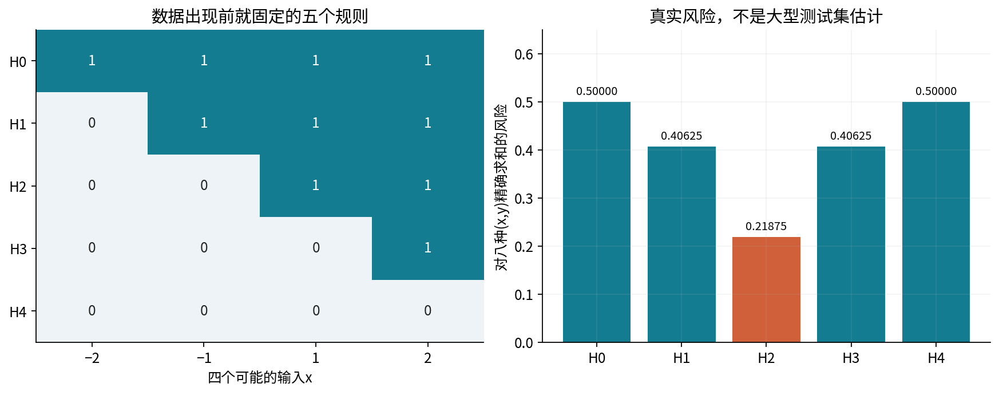
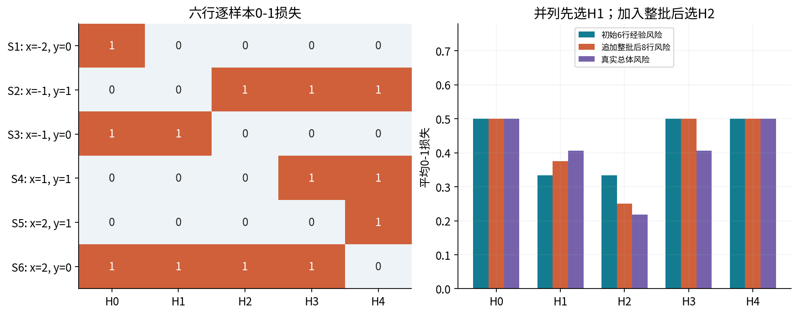
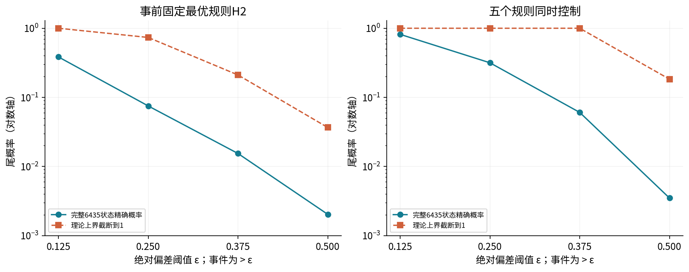
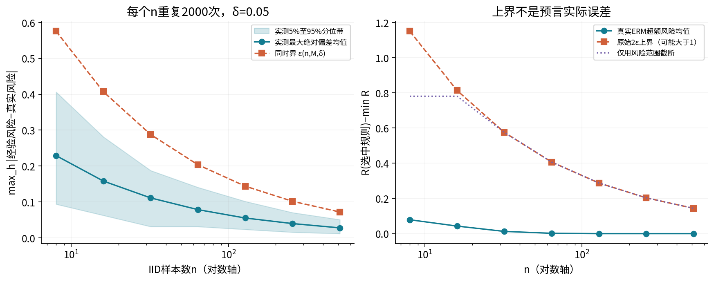
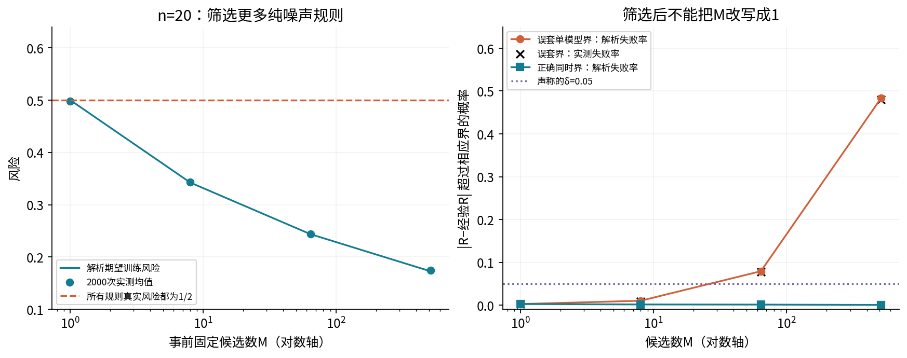
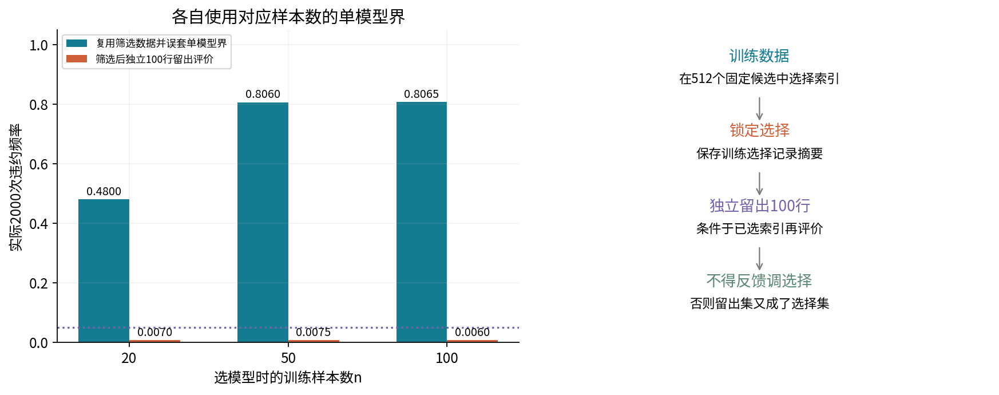
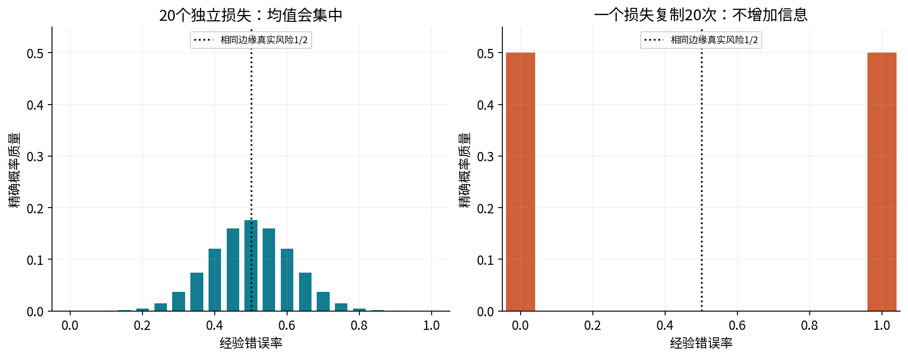
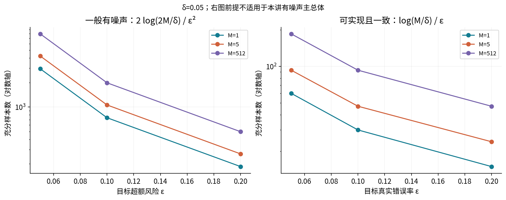
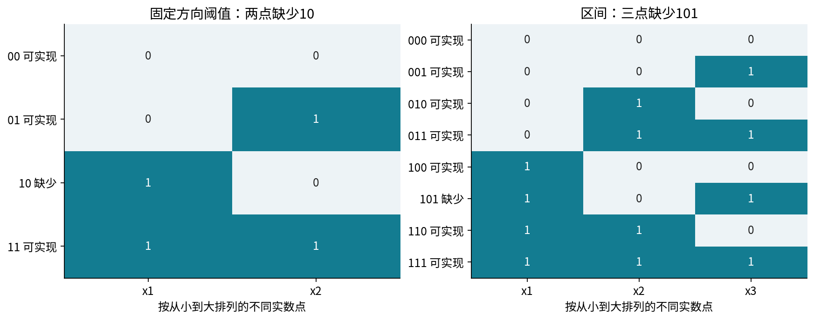

# 第049讲 学习理论的第一组保证

从“这一次误差不大”到“哪些随机实验中有多大概率出错”

**先修与路线。** 先修008讲的函数代数与数学表达、018讲的概率事件与条件信息、022讲的抽样与极限定理，以及048讲的风险与泛化分解。先完成六行五规则的计算，再读Hoeffding界和union bound；指数矩推导可留到第二遍。最后用一个失败率接近一半的反例检查你是否真的理解“固定模型”。建议三次学习，每次60–90分钟。

本讲研究有限规则集合，不假装每个机器学习任务都要梯度下降。数据、规则、风险、选择过程全部能逐格列出，因此可以把概率界与真实误差分开核对。所有实验为预声明合成机制，无真实个人数据，也不是现实任务的性能保证。

## 1. 先分清三个风险和两种概率

一个假设$h$就是一个预测规则。给定输入$x$，它输出预测$h(x)$；损失$\ell(h(x),y)$衡量预测与真实$y$的差异。总体风险和样本经验风险分别是

$$R(h)=E_{(X,Y)\sim P}[\ell(h(X),Y)],\qquad \widehat R_S(h)=\frac1n\sum_{i=1}^n\ell(h(x_i),y_i).$$

这里$P$是数据生成分布，$S=((x_1,y_1),\ldots,(x_n,y_n))$是抽到的样本。对一个固定$h$，$R(h)$是固定但通常未知的数，$\widehat R_S(h)$随$S$变化。学习算法从样本选择$\widehat h(S)$，所以$R(\widehat h)$也会随训练集变化。

目标可以是控制某一个$h$的估计误差，也可以控制所有$h\in\mathcal H$，或者控制选中规则相对于类内最佳规则的超额风险。三个对象不同，不能在公式中省掉下标后混用。

$\epsilon$表示允许的误差幅度，$\delta$表示允许的坏样本概率。例如“以至少0.95概率偏差不超过0.1”，是对重新抽取整份样本的随机实验作陈述。它不是说每个预测都有95%概率正确，也不是说真实风险本身是一个均匀随机数。

## 2. 一个能精确知道总体风险的小世界

令$X$取$(-2,-1,1,2)$，概率为$(1,3,3,1)/8$。正类概率依次是$(1/8,1/4,3/4,7/8)$。完整联合分布有八个结果：

| 输入x | 真实y | 联合概率 |
| --- | --- | --- |
| -2 | 0 | 7/64 |
| -2 | 1 | 1/64 |
| -1 | 0 | 9/32 |
| -1 | 1 | 3/32 |
| 1 | 0 | 3/32 |
| 1 | 1 | 9/32 |
| 2 | 0 | 1/64 |
| 2 | 1 | 7/64 |

预先固定五个向右递增的阈值规则。按四个输入顺序，预测向量为$H_0=(1,1,1,1)$，$H_1=(0,1,1,1)$，$H_2=(0,0,1,1)$，$H_3=(0,0,0,1)$，$H_4=(0,0,0,0)$。本讲用0-1损失：预测等于标签时0，否则1。

以$H_2$为例，它在$(-2,1),(-1,1),(1,0),(2,0)$上出错，所以

$$R(H_2)=\frac1{64}+\frac6{64}+\frac6{64}+\frac1{64}=\frac7{32}=0.21875.$$

$H_1$只在$x=-1$处与$H_2$不同，把原先的正类错误质量$6/64$换成负类错误质量$18/64$，风险增加$12/64=3/16$。所以$R(H_1)=13/32$。其余规则也逐项累加，不用大型测试集近似。

**读图问题。** 为什么$H_2$最好但风险仍不为0？标签本身有随机性。这个主实验属于有噪声、一般的学习场景，不满足“类内有一个零风险规则”的可实现假设。

## 3. 六行样本：前向、损失、汇总、选择

以下纸笔样本是事先写定的教学例子，不冒充随机抽样结果。每行先读取$x$，查每个规则的预测，再与$y$比较，得到五个损失。每个损失除以6后，才是该行对平均风险的贡献。

| 行 | x | y | 五规则预测 H0…H4 | 五个0-1损失 |
| --- | --- | --- | --- | --- |
| S1 | -2 | 0 | 1,0,0,0,0 | 1,0,0,0,0 |
| S2 | -1 | 1 | 1,1,0,0,0 | 0,0,1,1,1 |
| S3 | -1 | 0 | 1,1,0,0,0 | 1,1,0,0,0 |
| S4 | 1 | 1 | 1,1,1,0,0 | 0,0,0,1,1 |
| S5 | 2 | 1 | 1,1,1,1,0 | 0,0,0,0,1 |
| S6 | 2 | 0 | 1,1,1,1,0 | 1,1,1,1,0 |

第2行$x=-1,y=1$：$H_2(x)=0$，故损失$1\{0\ne1\}=1$，对平均风险贡献$1/6$。第3行同样$x=-1$但$y=0$，$H_2$的贡献是0。不能先对标签取整或把重复输入当作同一观测而合并掉标签噪声。

将整批六行汇总后，错误次数为$(3,2,2,3,3)$，经验风险为$(1/2,1/3,1/3,1/2,1/2)$。并列集合是$\{H_1,H_2\}$；预先约定按列表顺序选第一个，因此选择$H_1$，其真实风险$13/32$，比类内最佳高$3/16$。

这里没有光滑参数和局部导数。对离散规则列表作精确枚举，找到最小经验风险，称经验风险最小化（ERM）。若随意对0-1指示函数求一个不存在的全局普通梯度，再宣称完成“反向传播”，反而掩盖了真实算法。

## 4. 追加整批观测，再做下一次前向

接着把事先声明的两条**追加训练观测**$(-1,0),(1,1)$一起加入。它们不是封存测试集，算法允许使用它们更新选择。两行分别产生损失向量$(1,1,0,0,0)$和$(0,0,0,1,1)$。

同步加入整批后，八行总错误次数为$(4,3,2,4,4)$，经验风险为$(1/2,3/8,1/4,1/2,1/2)$，这次唯一最优是$H_2$。再执行所选规则的下一次前向，四个输入的预测从$(0,1,1,1)$变为$(0,0,1,1)$，只有$x=-1$改变。

| 阶段 | H0 | H1 | H2 | H3 | H4 | 选中 |
| --- | --- | --- | --- | --- | --- | --- |
| 初始六行 | 0.500000 | 0.333333 | 0.333333 | 0.500000 | 0.500000 | H1 |
| 追加后八行 | 0.500000 | 0.375000 | 0.250000 | 0.500000 | 0.500000 | H2 |
| 总体风险 | 0.500000 | 0.406250 | 0.218750 | 0.406250 | 0.500000 | 总体最优H2 |

**读图问题。** 如果起初并列时选择$H_2$，这份六行样本的真实风险会不同，为什么不违背“两个规则经验风险相同”？因为经验风险只描述当前六行；总体对未见结果的权重不同。

## 5. 固定规则：Hoeffding界究竟用了什么

先固定一个不依赖这份样本的$h$，令$Z_i=\ell(h(X_i),Y_i)$。假设观测独立同分布，并且损失位于$[0,1]$。则$Z_i$也是独立同分布的有界变量，均值为$R(h)$。

Hoeffding型双侧结论为

$$P\{|\widehat R_S(h)-R(h)|>\epsilon\}\le 2\exp(-2n\epsilon^2).$$

若右侧大于1，可以截到1，因为概率本来不超过1；这叫没有提供额外信息的平凡界，不是概率“大于100%”。以$\delta$为允许失败概率，反解得

$$\epsilon_{\rm fixed}(n,\delta)=\sqrt{\frac{\log(2/\delta)}{2n}}.$$

于是对这个固定规则，以至少$1-\delta$的概率，真实风险位于$[\widehat R-\epsilon_{\rm fixed},\widehat R+\epsilon_{\rm fixed}]\cap[0,1]$。不等式允许比$\delta$小得多的实际失败率。

**假设检查。** 独立同分布针对观测行，不是针对不同规则。0-1损失满足范围；无界平方误差、未截断对数损失不能直接代入这个$[0,1]$公式。若损失在$[a,b]$，可归一化，偏差尺度乘$b-a$；若不同时间分布发生变化，则估计的目标也需要重新定义。

## 6. 选读推导：为什么出现指数和 nε²

先看一个$Z\in[0,1]$。定义$K(\lambda)=\log E[e^{\lambda(Z-EZ)}]$。这是对指数变换再取对数，不是新的预测模型。$K(0)=0$、$K'(0)=0$；再求一次导数，$K''(\lambda)$是在按指数权重重新加权后的分布中的方差。

重新加权不改变$Z\in[0,1]$。对任意这种变量，因$Z^2\le Z$，若均值为$\mu$，方差不超过$\mu-\mu^2\le1/4$。所以$K''\le1/4$，从0积分两次得到$K(\lambda)\le\lambda^2/8$。即

$$E[e^{\lambda(Z-EZ)}]\le e^{\lambda^2/8}.$$

对独立的$n$个损失，指数和的期望能分解为期望乘积。这一步才是独立性进入证明的地方。对非负随机变量使用Markov不等式：

$$P\left\{\sum_i(Z_i-EZ_i)>n\epsilon\right\}\le e^{-\lambda n\epsilon}\prod_iE[e^{\lambda(Z_i-EZ_i)}]\le e^{-\lambda n\epsilon+n\lambda^2/8}.$$

取$\lambda=4\epsilon$使指数最小，得到$e^{-2n\epsilon^2}$。对负方向重复，再把两个坏事件概率相加，得到前面的系数2。若独立性不存在，乘积分解不能随便写下去；这比记住一个根号更重要。

## 7. 为什么训练后不能直接把选中规则当作固定规则

对每个事前固定的$h$，上面的结论都成立，并不意味着把$h$换成用同一份数据挑出来的$\widehat h$就自动成立。筛选偏好经验误差偶然偏小的规则，规则索引携带了样本信息。

一个常见错误是：“我最终只交付一个模型，所以$M=1$。”如果这一个模型是比较几百个候选后选出来的，选择发生之前的候选集合和选择过程不能被删除。后面我们会给出真实失败概率接近一半的例子。

解决办法之一是让同一个好事件同时保护整个事前固定集合。另一个办法是只在完全独立、没有反馈选择的留出集上评价已冻结规则。

## 8. Union bound：不要求规则之间独立

定义每个规则的坏事件$A_h=\{|\widehat R(h)-R(h)|>\epsilon\}$。至少一个规则出问题的事件是$\bigcup_{h\in\mathcal H}A_h$。指示函数满足

$$1\{\cup_hA_h\}\le\sum_h1\{A_h\}.$$

两边取期望，就有$P(\cup_hA_h)\le\sum_hP(A_h)$。这里没有使用坏事件互相独立。五个阈值规则的损失高度相关，但仍可以用这条界。

若事前固定有限类大小为$M$，得到

$$P\{\max_{h\in\mathcal H}|\widehat R(h)-R(h)|>\epsilon\}\le2M e^{-2n\epsilon^2}.$$

反解为

$$\epsilon_{\rm unif}(n,M,\delta)=\sqrt{\frac{\log(2M/\delta)}{2n}}.$$

在这个同时成立的好事件上，无论你根据当前样本如何选择类中的规则，选中者也受同一个偏差界保护。关键是它属于已经被保护的集合，而不是选择算法必须独立于样本。

## 9. 三项相加：从一致收敛走到ERM保证

令$h^*\in\arg\min_{h\in\mathcal H}R(h)$，$\widehat h\in\arg\min_h\widehat R(h)$。在所有规则的偏差都不超过$\epsilon$时，插入并减去经验风险：

$$R(\widehat h)-R(h^*)=[R(\widehat h)-\widehat R(\widehat h)]+[\widehat R(\widehat h)-\widehat R(h^*)]+[\widehat R(h^*)-R(h^*)].$$

第一项最多$\epsilon$，中间项因ERM最多0，最后一项最多$\epsilon$。所以$R(\widehat h)-R(h^*)\le2\epsilon$。这就是近似“训练好”如何变成“总体上接近类内最好”的桥梁。

若只找到经验目标距离最小值不超过$\zeta$的规则，中间项最多$\zeta$，保证就变成$2\epsilon+\zeta$。本讲是精确有限搜索，$\zeta=0$。该结论不解决模型类本身的近似误差，也不消除标签噪声；它与048讲的误差分解衔接。

## 10. 精确枚举：界真的压住了实际尾概率吗

每次抽样只会落在八种结果之一。若计数为$(c_1,\ldots,c_8)$、和为$n$，其概率为

$$P(c_1,\ldots,c_8)=\frac{n!}{\prod_i c_i!}\prod_i p_i^{c_i}.$$

计算每种计数的五个经验风险、固定规则偏差与最大偏差，再把坏事件的概率相加。所有$p_i$分母是64，因此可以用整数与有理数精确累计，而不依赖Monte Carlo。

对$n=8$共有$\binom{15}{7}=6435$种计数组合；它们代表$8^8$种有序样本。独立核验还对$n=4$逐个遍历全部4096个有序样本，与组合计数方法逐项一致。

| n=8，ε | 固定H2坏事件 | 同时坏事件 | 同时上界截断到1 |
| --- | --- | --- | --- |
| 1/8 | 0.384492355 | 0.815579853 | 1.000000000 |
| 1/4 | 0.075113166 | 0.316424976 | 1.000000000 |
| 3/8 | 0.015402707 | 0.060545543 | 1.000000000 |
| 1/2 | 0.002027565 | 0.003492207 | 0.183156389 |

**读图问题。** 当$\epsilon=1/2$时，同时坏事件概率约0.003492，而上界约0.183156。界很松，但没有声称实际概率等于这个上界。它只使用范围、样本数和类大小，舍弃了具体分布与规则相关性。

固定阈值的实际尾概率也不必随每个整数$n$严格单调。比如固定$H_2$、$\epsilon=1/8$时，$n=6$尾概率约0.350621，$n=8$约0.384492；经验误差格点跨过严格阈值会产生跳变。不要为了画单调线而改结果。

## 11. 14000次独立重复：把真实误差与界放在一起

主种子4905，样本数为8、16、32、64、128、256、512，每个$n$独立重复2000次。按八类别的多项分布直接抽计数，与抽IID有序样本后计数具有相同分布；顺序不影响这些风险。每次保留完整计数、选中规则、经验/真实风险、带符号差、最大绝对差和超额风险。

| n | 同时半径 | 实测最大偏差均值 | 超额风险均值 | 同时界违约次数/2000 |
| --- | --- | --- | --- | --- |
| 8 | 0.575452 | 0.228969 | 0.078797 | 3 |
| 16 | 0.406906 | 0.158078 | 0.042797 | 2 |
| 32 | 0.287726 | 0.111156 | 0.012516 | 2 |
| 64 | 0.203453 | 0.078508 | 0.001781 | 1 |
| 128 | 0.143863 | 0.055129 | 0.000000 | 2 |
| 256 | 0.101726 | 0.039678 | 0.000000 | 1 |
| 512 | 0.071931 | 0.027733 | 0.000000 | 5 |

这里真实违约次数不是全零，也远少于$0.05\times2000$。$\delta$是上限而非必须达到的比例。图左阴影是重复结果的5%至95%分位带，不是均值置信区间；图右曲线为平均超额风险，不是每次实验最大值。

$n=256$的带符号乐观差$R(\widehat h)-\widehat R(\widehat h)$样本均值为$-0.000378906$，照实保留。有限次Monte Carlo均值可以因为抽样波动为负；不能强制裁成0。零观测违约也不证明真实概率为0：若2000次独立重复均未违约，单侧95%二项上限是$1-0.05^{1/2000}\approx0.001497$。

## 12. 纯噪声候选：错误使用单模型界的反例

现在换一个预声明机制。标签恒为0，输入有$M$个彼此独立的公平二元特征，每个规则$h_j(x)=x_j$。所以所有规则真实风险都是1/2，不存在真正更有预测力的候选。

$n$行训练数据中，第$j$个规则的错误数$K_j\sim\mathrm{Binomial}(n,1/2)$，并且这些错误数相互独立。ERM选择最小的$K_j$。增加候选越容易碰到“偶然训练错误很少”的规则，但真实风险仍为1/2。这一特别构造中的候选独立只用于计算精确最小值分布，不是union bound的普遍要求。

$n=20,\delta=0.05$时，固定模型半径约0.303681；若选中错误数不超过3，则$0.5-K_{\min}/20$超过半径。单个规则出现至多3错的概率为

$$q=\frac{\binom{20}{0}+\binom{20}{1}+\binom{20}{2}+\binom{20}{3}}{2^{20}}=\frac{1351}{1048576}.$$

至少一个候选出现这个事件的概率是$1-(1-q)^M$。双侧违约还包括所有候选都至少17错的极小概率$q^M$。所以误用单模型界的真实违约概率是$1-(1-q)^M+q^M$。$M=512$时约0.483196884，大于声称的0.05。

| M | 误套单模型界：解析 | 误套：实测/2000 | 正确同时界：解析 | 同时界：实测/2000 |
| --- | --- | --- | --- | --- |
| 1 | 0.002576828 | 6 | 0.002576828 | 6 |
| 8 | 0.010260951 | 17 | 0.001608669 | 1 |
| 64 | 0.079199301 | 156 | 0.001280930 | 0 |
| 512 | 0.483196884 | 960 | 0.000488162 | 0 |

**读图问题。** 如果有人只展示左图的下降曲线，并把最终模型称作“优秀模型”，还缺哪一个总体事实？若按同样逻辑把512写成1，右图哪个实际结果直接否定这一做法？

## 13. 分布而不只是平均值

独立候选的最小错误数满足

$$P(K_{\min}>k)=[1-F_{\mathrm{Binomial}(n,1/2)}(k)]^M.$$

相邻尾概率相减就得到最小值的概率质量。程序先用精确整数二项系数构建CDF，再以100位Decimal计算这些概率；这些是高精度解析公式求值，不称为无限精度的有理数输出。Monte Carlo按相同二项计数分布抽样，不伪装成训练了神经网络。

核验时也遇到一个普通数值问题：直接对接近1的生存概率取512次方再相减，在$n=100$某个小概率格点有约$3.59\times10^{-14}$绝对差。改用互补CDF、`log1p`和`expm1`进行独立SciPy参照后，最大差约$10^{-15}$；没有扩大验收容差或改科学结果。

**读图问题。** 每条分布的总概率质量是多少？选中训练误差0.2的模型，真实风险仍可能是多少？这里答案恰好是0.5，因为所有候选的总体表现都已由机制确定。

## 14. 独立留出集为什么能重新使用单模型界

训练数据先选索引$\widehat j$，保存选择摘要。再取独立100行留出数据，不根据留出结果反向修改索引。条件于全部训练数据，$\widehat j$已经固定；留出损失仍是独立的伯努利1/2，因此可以在留出样本数100上使用单模型界。

这不是把训练时的512个比较抹掉，而是换了一份与选择独立的样本来评价。训练样本数20、50、100时，独立留出违约频率分别是0.0070、0.0075、0.0060，均为2000次重复的实际频率。

**读图问题。** 左图两个柱形使用的是同一个半径吗？训练侧半径按训练$n$，留出侧按100计算，所以不是。若用留出分数再从512个候选挑最好者，哪个条件随之失效？

## 15. 边缘分布相同，并不等于独立

另取一个公平伯努利变量$B$，把它复制20次作为损失，即$Z_1=\cdots=Z_{20}=B$。每一行的边缘分布都是伯努利1/2，真实风险也为1/2；但经验均值只能为0或1，绝对偏差始终0.5。

如果错误地按$n=20$套用半径0.303681，就会每次都违约，失败概率为1。多保存19份相同观测没有增加19份独立信息。这个反例不靠随机种子；两种可能结果已经枚举完。

**读图问题。** 为什么这不是“样本量20所以理论失效”的反例？被破坏的是独立性前提。真实群组和时间数据不一定完全复制，但同样需要先识别有效独立单位；050讲将具体处理划分与评价对象。

## 16. PAC：把 ε、δ 与样本量连起来

在统计学习意义下，PAC的核心是：对指定的分布/任务范围，样本足够多时，以至少$1-\delta$概率得到误差不超过目标$\epsilon$的规则。可实现场景以真实错误率为目标，一般有噪声场景通常以相对类内最优的超额风险为目标。量词是对允许的分布与目标条件成立，而不是只在一个随机种子上成功。

令一般ERM保证中的$2\epsilon_{\rm unif}$不超过目标$\varepsilon$，平方整理：

$$2\sqrt{\frac{\log(2M/\delta)}{2n}}\le\varepsilon\quad\Longleftarrow\quad n\ge\frac{2\log(2M/\delta)}{\varepsilon^2}.$$

这是充分条件，不是必要样本数，也不保证我们能高效搜索所有规则。统计可学习性与计算效率需要区分。

如果另外知道类内有一个零风险规则，且算法返回训练集上零错的一致规则，可以得到更强的可实现结论。真实风险大于$\varepsilon$的固定坏规则在$n$行上全对的概率不超过$(1-\varepsilon)^n\le e^{-n\varepsilon}$；对$M$个候选求union bound，令$M e^{-n\varepsilon}\le\delta$，得到$n\ge\log(M/\delta)/\varepsilon$。

**读图问题。** 为什么右图样本数较少？它增加了零风险可实现性及一致学习器要求。不能只因右图更漂亮，就用它替换左图对有噪声数据的结论。

## 17. 从有限数量走向VC维

实数阈值有无穷多个，不能直接把$M=\infty$代入有限类公式后得到有用界。一个新思路是看这些规则能在有限点集上制造多少种标签模式，而不只数参数有多少取值。

一个假设类能**打散**一组$m$个点，表示这$2^m$种二元标签分配都能由类中某个规则实现。VC维是存在可被打散点集的最大大小。注意“存在某种点的摆放能打散”和“任意摆放都能打散”不同。

对于固定向右的阈值，任一单点能标0或1；对两个有序不同点，标签10永远做不到，因此VC维1。这里没有允许阈值方向随意翻转；若换了类，维数结论可能改变。

对于实数轴上的区间内标1，两个点四种标签都能实现；三个有序点的101做不到，因为区间包含两端就必须包含中间，所以VC维2。对$m$个有序不同点，阈值模式数$m+1$，区间模式数$m(m+1)/2+1$，后者还包括全0模式。

**读图问题。** 右侧101行被画出来，是否表示它可实现？看行标签“缺少”；图列出了全部可能的标签需求，然后标记类不能实现的那一种。

VC理论用增长函数、对称化与额外论证处理无限类。不能直接把当前样本上观察到的模式数，替换固定类union bound里的$M$而不证明。模式可能由当前样本决定，而相同样本内行为的规则在总体上仍不同。本讲介绍这一入口，不把有限实验冒充一般VC定理证明。

## 18. 如何读界、复现以及继续研究

先写清损失范围、独立单位、数据分布、候选集合确定时间、选择与评价的数据角色，再谈界的数值。界很松可能因为舍弃了方差、相关性或算法结构，可以寻找更精细理论；但“松”本身不等于错误。反过来，某次实验的差距小也不能补上缺失前提。

`experiment.py`保存全部14000次主实验计数和6000次纯噪声重复的选择记录；`audit.py`独立做4096条有序样本枚举、固定规则的精确二项尾概率、事件union核对、Decimal半径、实际SciPy分布、所有随机流重建及数据角色变换测试。普通和`-O`都用显式检查，Notebook首格先核验源与数据。详见独立实验手册。

数值工具有公开的有限资源范围，不接受布尔、复数、非有限值冒充数值。精确组合枚举限$n\le8$；大规模部分用明确标注的Monte Carlo。概率小到浮点下溢时，指数上界同时保留对数值，不声称输出0就是数学概率0。完整输入域与失败契约见README。

### 原始来源

1. Hoeffding（1963），[Probability Inequalities for Sums of Bounded Random Variables](https://www.cs.rpi.edu/academics/courses/spring06/random/hoefding.pdf)，核对原论文Theorem1/2与指数矩方法；本讲自行展开适用于学习损失的推导，没有复制论文图。
2. Balcan，[Foundations of Machine Learning and Data Science，2015-09-16](https://www.cs.cmu.edu/~ninamf/courses/806/lect-09-16.pdf)，核对可实现有限类样本复杂度、PAC及阈值/区间打散定义。
3. Póczos，[CMU 10-715 VC Theory](https://www.cs.cmu.edu/~epxing/Class/10715/lectures/VCTheory.pdf)，核对有限类与无限类处理的区别。未把课程图作为本讲插图。

核对日期2026-10-05。所有八状态分布、六行手算、追加批次、纯噪声选择及十图为原创教学构造。学完后请解释：为什么数据依赖的选择可以被同时界保护，却不能自动被固定单模型界保护？
