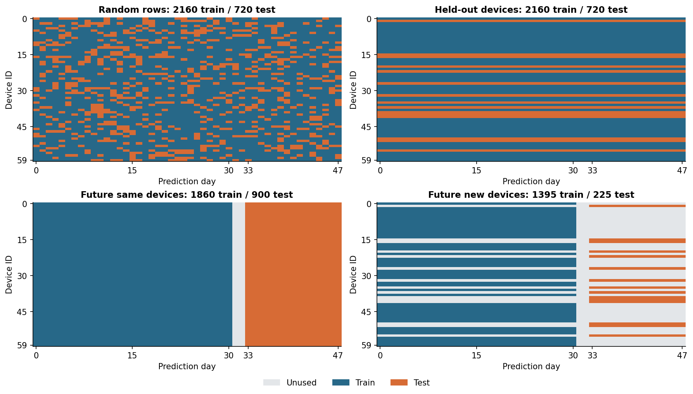
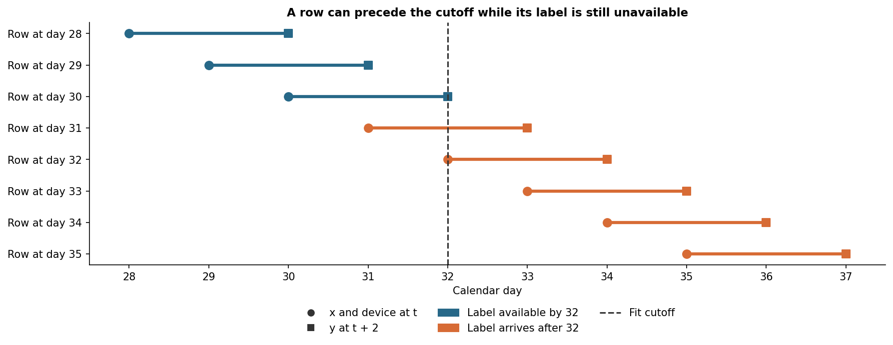
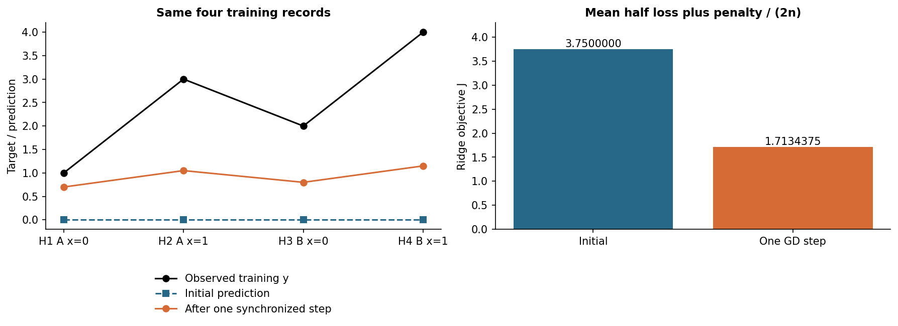
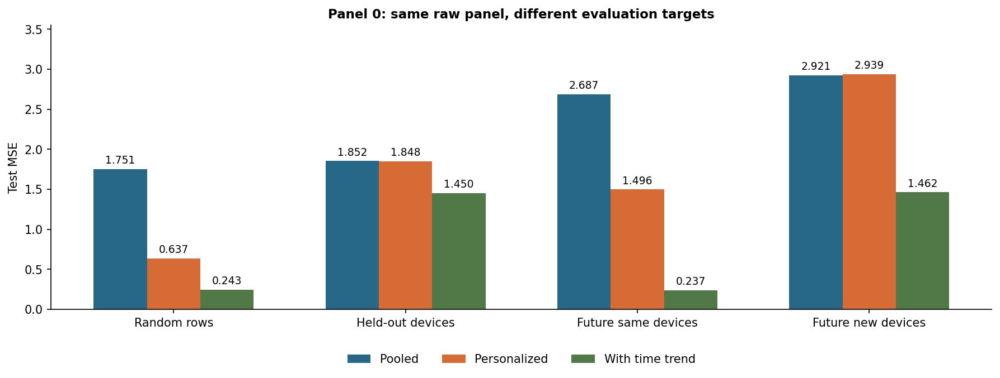
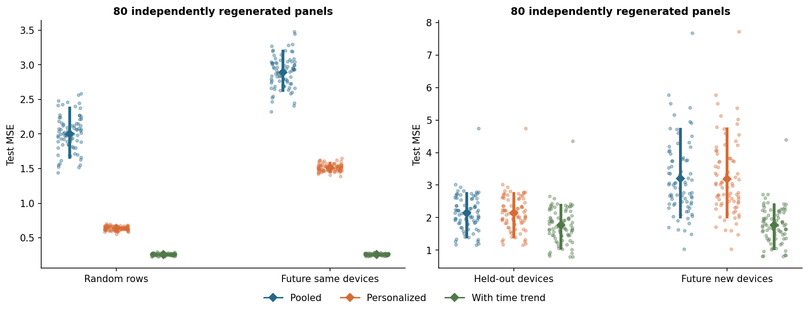
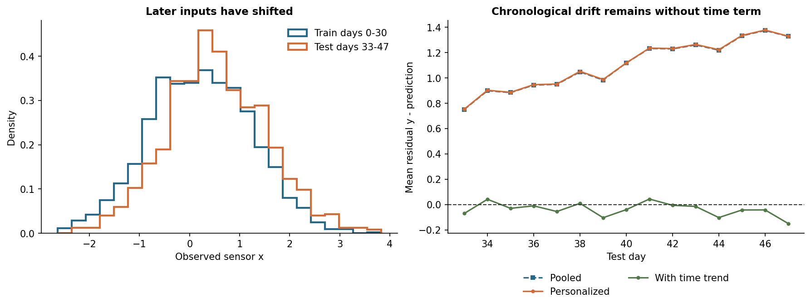
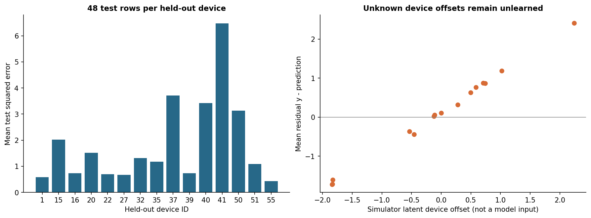
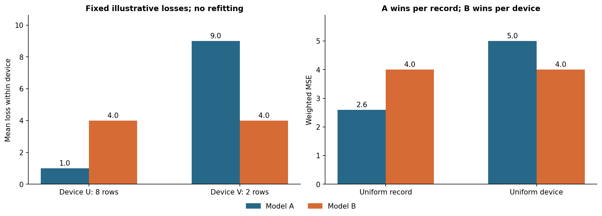
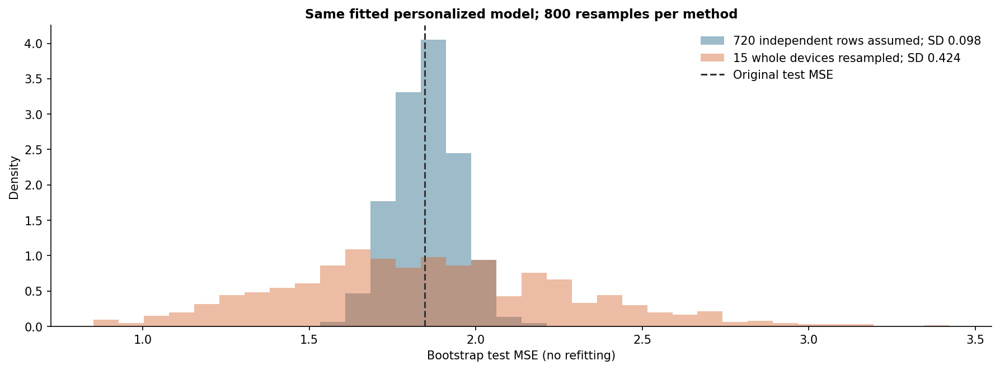
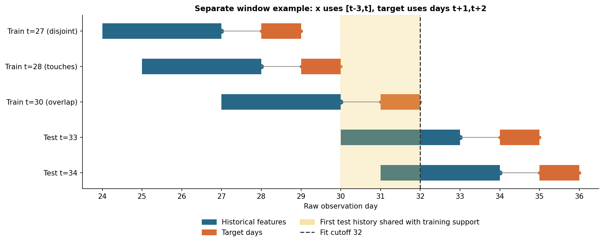

# 第050讲 数据划分与评价对象

## 1 随机切分到底在模拟什么

本讲的结论是：先说明模型将面对谁、何时作预测、当时能知道什么，再决定怎样划分。随机切分没有自动模拟未来；按组切分也不是总比随机切分“更严格所以更正确”。三种划分可能都计算无误，却回答不同问题。把不相同的问题放进同一排行榜，是一种比代码报错更难发现的错误。

直接先修为002任务定义与数据生成、007可重现实验、022抽样与极限定理、025区间估计与Bootstrap。我们会重新解释训练、测试、独立单位和条件期望。计算链使用一个带设备偏置的简单线性预测器；基础读者先做四行手算，矩阵形式可在学过029与040后回看，不影响理解划分原则。

本讲从同一份60台设备、48天的合成记录出发，建立随机记录、整台设备、按时间和组别加时间四份协议。所有常数、种子、模型、划分和重复次数在第一次看分数前固定。三份PDF、真实执行Notebook、原始生成抽样、划分索引和十张图共同构成一个可重跑实验。它不包含真实个人或设备记录，也不提供现实生产性能保证。

## 2 一行数据不是天然的独立样本

设第g台设备第t天的一行记录为 $(g,t,x_{gt},y_{gt})$。g标识设备，t标识预测日，x是当日能读取的传感器值，y是两天后才完成复核的目标测量。一张2880行的表可能只来自60台独立抽出的设备。设备之间独立，不代表同一台的48行也独立。

一个直观原因是设备的固定偏置。若设备A的读数长期偏高，它今天和明天的标签都可能偏高。训练中看过A的历史，就可能估计其偏置；完全没见过设备B时则没有这份信息。这不是模型“作弊”的充分条件。问题在于部署是否允许同一设备已有历史，以及历史标签是否在当时已经取得。

“独立单位”至少有三层需要区分：抽样时独立抽的是设备还是每天的记录；划分时哪些记录必须一起进同一集合；计算不确定性时重采样什么。三层往往关联，却不是只需填一次的字段。例如已知设备的未来预测可让同设备跨训练测试，但时间方向必须正确；对新设备的泛化，通常要把设备整组留出。

### 2.1 一个可以算清的相关例子

令去掉已知信号后的量为 $Z_{gt}=a_g+\varepsilon_{gt}$，其中设备效应方差为 $\tau^2$，测量噪声方差为 $\sigma^2$，不同设备及噪声独立。则同设备不同天的协方差是 $\tau^2$，单行方差是 $\tau^2+\sigma^2$，组内相关系数为

$$\rho=\frac{\tau^2}{\tau^2+\sigma^2}.$$

G组各有m行时，总均值既可写为G个组均值的平均，也可写成所有Gm行的平均。直接用独立随机项展开有

$$\operatorname{Var}(\bar Z)=\frac{\tau^2}{G}+\frac{\sigma^2}{Gm}=\frac{\tau^2+\sigma^2}{Gm}\{1+(m-1)\rho\}.$$

如果误当全部行独立，就漏掉大括号这个放大因子。以本机制 $\tau=1.2,\sigma=0.5,m=48$ 为例，ρ约0.8521，放大因子约41.05。对这个特定均值统计量，2880行的方差可对应约70.16个相同单行方差的独立观察。这个“有效样本量”不是所有MSE、模型参数或算法都适用的通用数，更不能直接拿去给任意指标套置信区间。

## 3 把评价目标写成一句可以核查的话

请先补全下面的句子：“在〔拟合时刻〕冻结模型，使用〔可用时限〕之前已经取得的信息，对〔目标总体〕中〔评价时段〕的记录进行预测，以〔损失〕和〔权重〕汇总。”不填写这些项目，一句“测试MSE为0.64”并不完整。

本讲的四个目标如下。随机和整组协议在整个观察期结束、最后标签已在第49天取得后拟合。时间和联合协议在第32天结束时拟合，之后固定模型，不随测试期间新标签更新。

|协议|训练中已有谁|评价谁与何时|主要用途|
|---|---|---|---|
|random 随机记录|60台设备的部分全期记录|同一批设备的留出全期记录|回顾性缺失记录插值|
|group 整组|45台设备的全部48天|另15台的同一日历期|同一时期新设备迁移|
|time 按时间|60台设备可在32日取得的标签|同设备33至47日|固定模型的向前预测|
|group_time 联合|45台设备的早期可用标签|另15台的33至47日|新设备的未来冷启动|

“新设备”在这里指训练从未使用其标签，也未估计专属偏置。联合协议即使文件里保存了留出设备早期记录，也主动不用它们，因为目标是无设备历史的冷启动。若部署实际上允许先收集一周校准数据，应另定义适应协议，不能把本讲冷启动结果当成适应后的性能。

给定训练数据D，未来某目标分布Q下的风险为 $R_Q(\hat f_D)=\mathbb E_{Z\sim Q}[\ell(Y,\hat f_D(X))\mid D]$。但已知设备的目标Q还要条件于设备历史；新设备的目标则要对独立抽出的设备效应再平均。省掉条件并写成一个笼统的“泛化误差”，容易把两个对象混在一起。

## 4 从随机切分到三种边界

随机切分把行索引打乱后拿出25%测试。只要记录确实是目标总体的近似独立样本、训练与测试可交换、可用信息条件相同，而且未发生测试参与选择，它可以是合适的设计。行顺序看起来杂乱不代表独立，设定random_state也不创造独立性。

整组切分先选设备，再把该设备全部记录放进测试。设备ID可以只是分组元数据，未必是模型输入；即便删掉ID列，设备指纹、稳定背景或重复测量仍可能让模型识别设备。因此“删除姓名列”不能代替按人划分。相反，若任务是已经登记的设备未来维护，完全留出设备可能回答了一个比业务更不同的问题。

按时间切分要求评价发生在训练决策之后，还要检查标签和特征的实际可用时刻。数据表里的“事件发生日期”不等于该字段被录入系统的日期。对一项月底结算的结果，即使事件发生在月中，月中预测时也不能读取月底才确定的最终值。

读图G1：哪两幅图允许同设备同时出现在训练与测试？这是否足以把两者都判为泄漏？为什么联合图中有两大片灰色而不是仅两天的缝隙？

## 5 可观察时间线决定训练是否真实可做

我们的目标y描述第t天状态，但需要两天复核，因此 `label_available_day=t+2`。当第32天结束时建模，合法训练行满足 $t+2\le32$，也就是 $t\le30$。第31、32天的x已经观察到，y却未到齐，这120行不能加入监督拟合。预测从第33天开始，模型对33至47日的每行读取当日x、设备ID以及日历日，不读取当日y。

这里是“提前冻结模型、到当天读x做预测”的服务过程，不是第32天一次性预测未来15天且提前知道那些天的传感器。后一种纯多步预测需要未来x可知或另有x预测模型；本讲没有验证它。任务中的预测时点必须如此具体。

|信息|何时可用|允许用于哪一步|
|---|---|---|
|设备ID与日历日t|预测发生时|划分元数据；当日预测输入|
|当日x|第t天预测之前|当日预测输入|
|第t天y|第t+2天复核完成|到达后才可用于拟合或评分|
|设备真实偏置a|仅模拟器知道|作者机制诊断，模型不得读取|
|真实条件均值μ|仅模拟器知道|独立噪声平均诊断，模型不得读取|
|测试标签与测试损失|锁定方案后评价时|报告，不能用于挑种子或模型|

读图G2：第30、31、32日三行分别能否在截止时训练？如果系统把y事后回填到旧日期列，程序只看事件日期会出现什么错误？

数据仓库常把后来修正的数据覆盖旧值。如果没有历史快照，即使筛选日期正确，也可能读取当时并不存在的最终版本。这是可用性审计，不是选用TimeSeriesSplit之后自动解决的问题。研究报告应说明特征版本、标注延迟、回填和冻结规则。

## 6 一份事前固定的设备生成机制

每份面板有60台设备，每台48天，t从0至47。独立生成

$$a_g\sim N(0,1.2^2),\quad u_{gt}\sim N(0,1),\quad\varepsilon_{gt}\sim N(0,0.5^2),$$

$$x_{gt}=u_{gt}+0.015t,\qquad y_{gt}=2+1.4x_{gt}+a_g+0.045t+\varepsilon_{gt}.$$

设备效应在这48天保持固定；输入平均随日期缓慢改变；在相同x下目标均值也随日期改变。这是用于说明重复单位、时间偏移和标签延迟的理想化机制。所有设备有等长记录、没有掉线、选择性标签、突发共同冲击或维修干预；现实中这些因素需要另行建模。

固定数据种子50017一次生成81份独立面板。第0份是正文逐项展示的实例，另外80份用于检查重复抽样差异。划分种子50053固定行与设备索引，所有面板复用同一组索引；Bootstrap种子50059只用于评价重采样。模型三种、alpha为1、截止32、预测开始33、800次Bootstrap均已事先写进protocol.json，未根据分数更改。

保存原始随机抽样比只写种子更可审计：draws.npz含每份面板的a、u、ε，panel.csv含第0份全部记录，splits.npz和split_membership.csv给出精确归属。模拟器知道μ不意味着模型知道μ。`fit`函数仅接收训练x、组、日期和y，改变测试标签不能改变已拟合系数。

## 7 三个简单预测器如何使用相同信息

Pooled模型为 $\hat y=b+wx$，所有设备共用一条直线。Personalized增加训练中见过的设备偏置：$\hat y=b+wx+v_g$。对于未知设备，预先规定 $v_g=0$，退回总体部分。Trend再加入可观察日期项 $q(t/47)$。除以47是预先固定的时间单位转换，不是从测试分布估计的标准化参数。

三个模型均最小化同一个约定下的岭目标。令设计行 $a_i$ 包含截距、x、可选设备指示列和可选日期列，θ为对应系数，P为对角矩阵，第一项0、其余1，则

$$J(\theta)=\frac1{2n}\|A\theta-y\|^2+\frac{\alpha}{2n}\theta^\top P\theta,\qquad \alpha=1.$$

截距不惩罚，其余系数均惩罚。所有设备指示列都保留，所以无惩罚时它们与截距线性相关；正惩罚使这里的增广问题有唯一解，不应随意再删一个设备列而沿用相同的正则解释。训练设备的取值集合只从训练组ID确定，未知测试ID映射为全零指示列。[OneHotEncoder官方约定](https://scikit-learn.org/1.8/modules/generated/sklearn.preprocessing.OneHotEncoder.html)。

目标整体除以2n不改变极小点，因而可与 sklearn 的“残差平方和加alpha乘系数平方和”对照。如果改为平均残差加同一个数值alpha的惩罚，相对惩罚会放大n倍。正则强度不能只看参数名就说相同。[Ridge官方目标](https://scikit-learn.org/1.8/modules/generated/sklearn.linear_model.Ridge.html)。

本讲把三个模型作为事先固定的教学探针同时报告，未根据测试分数宣布一个部署冠军。Trend与线性时间漂移的真实机制吻合，因而这是机制有利的正对照；其收益不能证明现实漂移必然线性、日历项总有效或已完成真实模型选择。

## 8 同一个四行实例的完整计算链

先用更小的手工数据看清训练算子。训练行H1、H2属于设备A，H3、H4属于B；H5、H6只作测试。这个纸笔表为精确算术单独构造，不是从主实验筛出的好结果。特征列依次为截距、x、A指示、B指示，模型仍是上一节的Personalized、alpha=1。

|行|设备|x|y|设计行|角色|
|---|---|---:|---:|---|---|
|H1|A|0|1|(1,0,1,0)|训练|
|H2|A|1|3|(1,1,1,0)|训练|
|H3|B|0|2|(1,0,0,1)|训练|
|H4|B|1|4|(1,1,0,1)|训练|
|H5|A|2|5|(1,2,1,0)|只评价|
|H6|C|2|7|(1,2,0,0)|只评价，未知设备|

初始化四个参数为0。每一行先求点积 $\hat y_i=a_i^\top\theta$，残差定义为 $r_i=\hat y_i-y_i$，单样本半平方损失 $\ell_i=r_i^2/2$。局部链式法则是 $\partial\ell_i/\partial r_i=r_i$，$\partial r_i/\partial\hat y_i=1$，$\partial\hat y_i/\partial\theta_j=a_{ij}$，因此 $\partial\ell_i/\partial\theta_j=r_i a_{ij}$。

|行|预测|残差|半平方损失|对b,w,vA,vB的局部导数|
|---|---:|---:|---:|---|
|H1|0|−1|1/2|(−1,0,−1,0)|
|H2|0|−3|9/2|(−3,−3,−3,0)|
|H3|0|−2|2|(−2,0,0,−2)|
|H4|0|−4|8|(−4,−4,0,−4)|

四行半平方损失相加为15，除以4得3.75。导数先按列求和得到(−10,−7,−4,−6)，再除以4得到 $(−5/2,−7/4,−1,−3/2)$。正则梯度为 $\alpha P\theta/n$，初始化为零，因此这一步不增加任何项。不能把四行导数已经取均值后再除4。

取学习率η=1/5，一次同步更新全部参数：

$$\theta^{(1)}=\theta^{(0)}-\eta\nabla J(\theta^{(0)})=(1/2,7/20,1/5,3/10).$$

“同步”表示四个新参数都使用同一个旧参数向量算出的梯度。先改b再重算w的梯度，会变成另一种算法。这里既没有逐样本更新，也没有让测试标签贡献梯度。

## 9 下一次前向与闭式求解也要核对

新预测依次为0.7、1.05、0.8、1.15。以H2为例，$0.5+0.35\times1+0.2=1.05$，残差−1.95，半平方损失为1.90125。全部四行如下。

|行|新预测|新残差|新半平方损失|
|---|---:|---:|---:|
|H1|0.70|−0.30|0.04500|
|H2|1.05|−1.95|1.90125|
|H3|0.80|−1.20|0.72000|
|H4|1.15|−2.85|4.06125|

半平方损失均值为1.681875。惩罚为 $(0.35^2+0.2^2+0.3^2)/8=0.0315625$，总目标 $J=1.7134375=5483/3200$。目标下降只是这一步优化的事实，不能据此得出测试或新设备风险必然下降。

H5的预测为 $0.5+0.35\times2+0.2=1.4$，H6为 $0.5+0.35\times2=1.2$。两个x相同却因设备历史不同而得到不同预测；H6没有专属系数，也不允许从其测试标签7反推一个偏置再说是冷启动性能。

读图G3：右侧1.7134375为何不等于下一次训练MSE？如果把惩罚忘掉，会少多少？H6设备未知时，为何不能读取标签补一个专属参数？

主实验不循环做梯度下降，而是求增广最小二乘：

$$\min_\theta\left\|\begin{bmatrix}A\\\sqrt\alpha P\end{bmatrix}\theta-\begin{bmatrix}y\\0\end{bmatrix}\right\|^2.$$

因为 $P^2=P$，下半块的平方正好是岭惩罚。代码用NumPy的lstsq，避免显式求逆；独立参照使用SciPy带列主元的QR和sklearn Ridge的SVD。纸笔表的精确最优解为 $(2,1,-1/3,1/3)$，目标7/24。一次GD尚未到最优，主实验则直接求解；两者共享模型与目标，不能把“一步学习率”误当主实验调参项。

## 10 四份实际划分的完整计数

随机划分有2160训练、720测试，训练和测试都出现60台设备，日期都覆盖0至47日。整组划分也有2160训练、720测试，但训练45台、测试15台，设备交集为空。它们的行数相同并不使目标相同。

时间划分训练60×31=1860行，测试60×15=900行，31与32日共120行未用。联合划分训练45×31=1395行，测试15×15=225行，剩余1260行未用；除标签延迟缝隙，还包括留出设备的早期记录与训练设备的晚期记录。全部行仍保存在原始数据里，没有删除困难样本。

对每一份划分先检查行索引不交叠，再根据目标检查设备是否应交叠、最大训练标签可用日、最小测试预测日。随机和整组的最大训练标签可用日为49，不可声称它们是在第32天做出的模型。时间和联合的最大值才是32。

在程序上按组拆分可用 `GroupShuffleSplit`，其test_size说的是组比例，不是行比例。组大小不等时，留出25%组不保证留出25%行。同一个API的多次划分之间也可能共享测试组，因此多次分数并不自动独立。本讲保存自己的固定索引，并另调用真实库核查语义，而不要求两个随机数实现产生完全相同的设备名单。[官方接口](https://scikit-learn.org/1.8/modules/generated/sklearn.model_selection.GroupShuffleSplit.html)。

## 11 看分数之前先看每一列的目标

第0份面板的测试MSE如下。MSE使用全平方损失，没有1/2；若y带物理单位，MSE为其平方单位。表中每一行比较的三个模型使用相同训练与测试索引，跨行则同时改变评价总体、训练信息和有时改变样本量。

|评价协议|Pooled|Personalized|Trend|
|---|---:|---:|---:|
|随机记录|1.751287|0.636795|0.243271|
|整组设备|1.852182|1.847585|1.450288|
|同设备未来|2.686598|1.496320|0.237188|
|新设备未来|2.920942|2.938758|1.461657|

随机中Personalized比Pooled好很多，是因为训练包含同设备的其他记录，能估计专属偏置。整组中测试设备专属系数全部为0，这个好处基本消失；同样的数据矩阵机制不代表模型知道未知设备的偏置。

时间中Personalized仍能利用设备历史，但未使用日期项，无法追上持续增加的目标基线。Trend明确使用可观察日历日，因此大幅改善。其第0份时间MSE甚至略低于随机MSE，直接说明“时间切分分数一定更差”不是定理。不能挑选这个反例后反向宣布时间划分更容易。

读图G4：联合协议里Personalized为何略差于Pooled？是否该删掉这个“不符合预期”的结果？Trend的时间分数低于随机，是否推翻必须尊重时间可用性的原则？

### 11.1 0.25噪声方差不是一次测试分数的硬下界

在模拟器里，μ为不含噪声的真实均值。固定拟合结果、当前测试x、日期和设备效应，只重新抽独立标签噪声，有

$$\mathbb E_{\varepsilon'}\frac1m\sum_i(\hat y_i-\mu_i-\varepsilon_i')^2=\frac1m\sum_i(\hat y_i-\mu_i)^2+0.25.$$

代码字段oracle_conditional_mse计算右侧。它是当前有限测试设计下，对新测量噪声取期望的诊断，不是把设备和未来所有环境也积分后的万能总体风险。第0份Trend在随机、时间协议的这一诊断分别约0.256850、0.258967；实际MSE约0.243271、0.237188，低于0.25完全可能来自有限测试噪声波动。不要因此宣称突破不可约噪声，也不要把已与含噪y比较的MSE再加0.25。

## 12 多份面板说明什么 不说明什么

另80份面板重新抽全部设备效应、输入噪声与标签噪声，每份重新拟合12个模型，总计960次。第0份不混入这80次汇总。划分索引不变意味着抽样位置相同，观察值独立重生成；这与拿同一张真实表反复shuffle不同。

|协议|Pooled平均MSE|Personalized平均MSE|Trend平均MSE|
|---|---:|---:|---:|
|随机记录|2.005754|0.636406|0.259169|
|整组设备|2.140700|2.140160|1.771121|
|同设备未来|2.892310|1.514119|0.259706|
|新设备未来|3.194207|3.193832|1.772735|

新设备未来的Personalized平均略优于Pooled，但80次中有38次更差；整组中有34次更差。Trend相对Personalized在联合任务仍有3次更差。所有运行完整保留，模型失败次数不是用最差几次删掉以后才算。当前未发生数值拟合失败；若发生，必须先报告失败输入与错误，不能静默降低重复次数。

读图G5：同设备未来Personalized的跨面板标准差约0.05158，均值MC标准误约0.00577；这两个数分别描述什么？为什么不能把图中12组相邻点当成彼此独立的实验？

同一份面板的不同模型和协议共享观察，比较应保留这种配对。四份协议还有不同训练量、不同测试量和不同目标，跨协议差异不能全归因于“泄漏造成多少分”。若要识别单一因素，应固定目标测试集、控制训练数量和可用信息，再另立消融。这里的核心是揭示不同任务，尚未做完所有因果归因。

## 13 分布偏移要分清改变了哪一部分

本机制中x的均值随t移动，所以训练与未来的输入分布不同；即便固定x，y的均值也有0.045t，因此不能简单称为“只有协变量偏移”。整组划分还改变设备身份：训练与测试抽自同一设备效应分布，但具体实现不同，没有测试组历史可用。

概念上，协变量偏移常指 $P_{\rm train}(X)\ne P_{\rm test}(X)$ 而 $P(Y\mid X)$ 保持；条件关系变化则改变后者。对于是否把t或g包含在X内，条件表达又会不同，所以讨论偏移时必须写清完整输入集。这里不声称从一张直方图就能检测或排除全部偏移。

读图G6：如果两段x直方图几乎重合，能否就宣布没有时间偏移？右图残差向上而不是向下，说明模型高估还是低估？

未知设备的困难还可以按组分解。整组测试15台设备、每台48行，部分设备的误差显著较高；右图对照模拟器真实a与平均残差，有助于解释未观察偏置。真实任务没有a这列诊断答案，只能寻找合理的可观察校准信息、外部验证和有界解释。

读图G7：能否把右图的a加入模型，然后仍宣称评估的是本讲同一个现实可实施冷启动任务？删去最高误差设备后平均会下降，这样能支持什么不同的结论？

## 14 行权重和设备权重选择不同总体

对测试设备g，令其样本数为 $m_g$、组内平均损失为 $L_g$。按行平均为

$$\hat R_{\rm row}=\frac{\sum_g m_g L_g}{\sum_g m_g};\qquad \hat R_{\rm group}=\frac1G\sum_gL_g.$$

第一项等价于从所有记录均匀抽一行，记录多的设备更常被抽到。第二项先均匀抽设备，再在该设备内平均，每台一票。没有一个定义天然永远正确；例如按每次服务损失计费和按每位使用者公平代表，可能需要不同报告。

一个十行手工例：设备U有8行、V有2行，模型A在两设备内平均损失为1和9，模型B都为4。A的行MSE为 $(8\times1+2\times9)/10=2.6$，B为4；A的设备平均为(1+9)/2=5，B仍为4。排名翻转来自评价权重，不是换算法或重算失败。

读图G9：设备V再采集8次重复测量，行权重如何改变？这些重复记录能自动使V的独立证据增加同样倍数吗？

主面板整组、时间、联合测试中每台记录数相同，因此两种平均恰好相等。随机测试中各设备被抽中的行数不全相同，所以Personalized的行MSE为0.636795，设备平均约0.631142。即使抽样前是平衡面板，划分后也可能改变权重。代码同时保留这两项，不能因为接近就说定义相同。

## 15 不确定性分析也要尊重单位

固定第0份整组协议拟合好的Personalized，只重采样测试损失，不重新训练。错误示范把720行当独立观察，每次抽720行有放回；组级方法则对15台设备有放回抽15次，每次保留选中设备的48行。这两者都做800次，固定Bootstrap种子50059。

行级结果的Bootstrap标准差约0.09779，组级约0.42365。按2.5%和97.5%经验分位取区间，行级约[1.66619,2.04261]，组级约[1.08589,2.72059]。同一个原始MSE1.847585，错误的独立单位会给出明显更窄的波动描述。

读图G8：橙色比蓝色宽，是否证明橙色区间已经有精确95%覆盖率？如果要评价重新采集训练设备再训练的整个算法，当前Bootstrap还缺哪一步？

组级方法匹配了本机制下不同设备独立、设备内相关的结构。但只有15个测试组，百分位区间的覆盖质量并未在这里验证；不能因为调用Bootstrap就宣布精确95%保证。它也只描述固定模型、固定日历设计下测试设备抽样的不确定性，不包括训练集波动、模型选择、未来漂移形式错误和共有冲击。

如果部署对象是固定的这15台设备，不打算推广到新设备总体，那么“再抽设备”的随机性是否符合问题也要另问。Bootstrap不是万能的不确定性开关，它需要与推断对象一起定义。组大小不等时，还必须在每次重采样后按原来选定的行或组权重汇总，不能混用。

## 16 时间窗口重叠必须画出原始支持

下面是单独的窗口例，不是主实验的即时目标：在t时刻，用过去四天 $[t-3,t]$ 的原始读数生成特征，标签是未来两天 $t+1,t+2$ 的某个汇总。该样本涉及的原始支持为 $[t-3,t+2]$，标签最早在t+2结束后才能得到。

在32日冻结、33日开始测试时，训练t≤30可满足标签可用性；但首个测试t=33的特征支持从30开始，因此与训练t=30涉及的27至32日有重叠。不能只检查“样本行日期不同”，就声称底层观察独立。

读图G10：若要求训练与测试底层支持严格无交集，最晚训练t应是多少？若目标只是合法的实时向前预测，重用已经观测到的历史x是否一定是泄漏？

若要求与首个测试支持 $[30,35]$ 严格不重叠，训练需 $t+2<30$，即t≤27。t=28的支持末端30仍相交。这里的“清除重叠”是为了某个独立块评价目标，可能丢弃额外信息并改变训练量，不保证提高分数。

但合法向前服务常常确实会复用过去已观测的历史特征。这种重叠本身不必构成不可实施的信息泄漏；仍会造成评估误差之间的依赖，影响区间计算。真正不能允许的是预测时读取尚未发生的特征、未到达的标签，或把相同待预测事件的答案通过另一窗口送回训练。必须分开“预测时可获得”和“统计上独立”两个问题。

`TimeSeriesSplit(gap=2)`里的2表示样本数。若直接在一天60条记录的面板上调用，它不是自动留两天；若数据按设备排序，得到的顺序甚至不是全局时间。课程的库核验先对48个日索引切分，检查后再映射回行。等间隔、标签延迟和窗口支持都要由研究者说明；API不会从列名猜出来。[官方时间切分接口](https://scikit-learn.org/1.8/modules/generated/sklearn.model_selection.TimeSeriesSplit.html)。

## 17 泄漏路径与目标错配不是同一个错误

第一类是明确的信息越界：把测试y放进特征；在所有y上计算设备目标均值；监督特征筛选先读全部标签；用截止后才完成的结果训练过去模型。即使行索引完全不相交，这些路径仍能将评价答案送进拟合。第052讲会系统实现训练内处理流水线，本讲先把边界画出来。

第二类是评价目标错配：随机留出同设备记录，却声称能预测未见过设备；在全期结束后回顾拟合，却把结果写成上线后未来预测。随机方案在回顾性插值问题中可以有意义，但其数字不能被重命名为另一个问题的证据。

第三类是评价集参与选择：看过四个协议分数后，只发布最好看的一个；不断换split seed直到提升显著；试很多模型后仍用同一测试分数作未受选择影响的结论。保存seed只记录了最后一次，不会消除选择历史。第051与053讲接着处理交叉验证、模型选择和预算。

研究中的数据泄漏是已被系统讨论的再现性风险；Kapoor与Narayanan提出应把数据来源、目标、处理步骤与泄漏检查明确记录。这里引用这一观点作为报告动机，不把其跨领域统计当成我们实验的结果。[作者预印本](https://arxiv.org/abs/2207.07048)。

## 18 怎样从划分走向可检验研究

首先明确部署单位与使用时点。再列原始事件、衍生窗口、特征取得、标签成熟和数据回填时间。随后确定行、设备、家庭、医院、区域或文档之间的关联，按真正会共享信息的单位画关系；仅有一个group列不代表已经覆盖全部依赖。

其次写训练算法和可用信息：是否使用设备历史、是否滚动重训、是否允许新设备校准、预处理在哪里fit、未知类别如何处理。按这个描述生成并保存索引。读到测试标签前固定主要指标、权重、比较和失败处理，最后才报告性能与不确定性。

Roberts等讨论了具有时间、空间和层级结构的数据划分：数据结构和预测任务共同决定验证设计，外推对象与留出方式要相称。本讲从这一方法论出发构造自己的设备模拟，没有复用其生态数据或把本例说成其结论的现实复现。[原论文作者机构副本](https://www.biom.uni-freiburg.de/mitarbeiter/dormann/roberts-et-al-2017-ecography.pdf/at_download/file)。

一个诚实的本讲陈述是：“我们在60设备×48天的预声明合成机制上，冻结第32日可取得标签训练的模型，对同设备第33至47日逐日读取x并预测，模型不滚动更新。Personalized的第0份测试MSE为1.496320；80次独立面板均值为1.514119。该任务允许既有设备历史，与未知设备未来的冷启动评价不同；线性漂移与完整标签是实验假设。”

想要进一步研究真实未来，需要合适来源的前瞻数据或保持可用性的回测；想说明跨地区迁移，需要地区层级的留出或外部验证。一个合理划分只让证据更接近问题，不会自动证明所有目标总体都被代表。便利样本、选择性标签和没有覆盖的使用情境仍要单独披露。

## 19 练习

E1. 对同一个人每周一次的记录，分别为“已登记者下周预测”和“从未见过的新用户预测”写一句完整评价目标与划分原则。

E2. 推导组随机截距例中总均值方差，算ρ与方差放大因子。解释为什么不能把所得有效样本量当所有模型指标的通用值。

E3. 第32天冻结时，第30、31、32天的标签分别是否可用于训练？若标签延迟改为5天，最晚训练日是多少？

E4. 用四行表逐项复核初始前向、局部导数、聚合梯度、同步更新和下一次预测，指出正则项从哪一步开始非零。

E5. 核算5483/3200与最优目标7/24；在最优参数下计算H5、H6的预测，说明未知组回退。

E6. 手算四份协议的训练、测试、未使用行数及设备交集。说明联合协议1260条未用记录的来源。

E7. 将第0份随机MSE0.636795写成不误导的结果句。若标题改成“新设备未来风险”，缺失了哪两种边界？

E8. 解释Trend时间MSE0.237188低于噪声方差0.25，以及oracle诊断约0.258967的含义。

E9. 为什么80次独立面板比同一张表重复shuffle提供不同证据？如何读标准差、均值MC标准误与10%至90%范围？

E10. 手算两设备权重例的排名翻转。说明主面板随机测试两种平均为何可能不相同。

E11. 根据图8说明按行Bootstrap的问题，并列出组级Bootstrap仍未包含的三类不确定性。

E12. 用窗口 $[t-3,t]$ 与目标日t+1,t+2推导标签合法截止与严格不重叠截止；解释为何两者不同。

E13. 同一受试者出现在两集合就一定泄漏吗？删去受试者ID列能否保证新受试者评价有效？分别给条件和反例。

E14. 一个作者先随机切分，再在全数据上按设备计算平均y作为特征。即使测试行没有直接加入训练，错误路径是什么？怎样修正？

E15. 一个面板每天60行，直接设TimeSeriesSplit的gap=2能否代表两天？如何用日期块构造恰当索引？

E16. 设计一个比较Personalized与Trend的现实验证方案，明确历史设备、新设备、重训频率、标签延迟、选择集和一次最终测试；不要利用本讲模拟器真值。

## 20 来源与核查范围

本讲文字推导、设备机制、手算、图和结果均为课程原创。主要可靠参照为scikit-learn 1.8的GroupShuffleSplit、TimeSeriesSplit、OneHotEncoder和Ridge官方文档，以及Roberts等2017年Ecography论文、Kapoor与Narayanan的泄漏研究。对应原文链接已在相关段落给出，sources.md与source-checks.json保留用途、日期和版本。

自查包括Fraction精确手算、SciPy带主元QR、sklearn独立编码与Ridge、全部960次拟合诊断、测试标签变更隔离、普通与优化模式、不同工作目录、新进程真实Notebook内核、数据和图像重建。数值自查证明本包计算与所述协议一致，不替代独立审阅，也不证明模拟假设符合某个实际应用。
