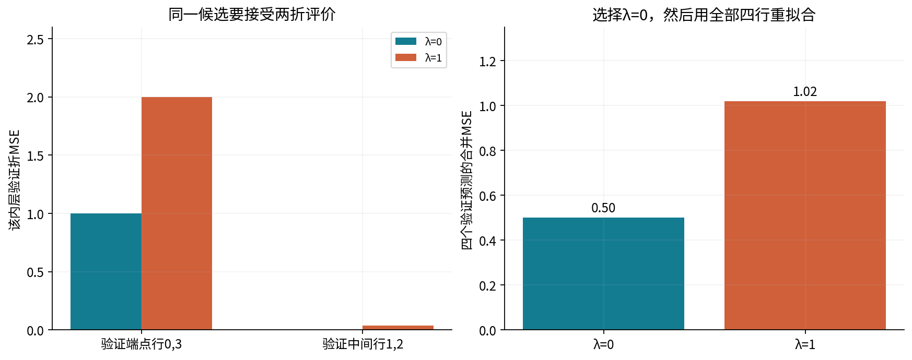
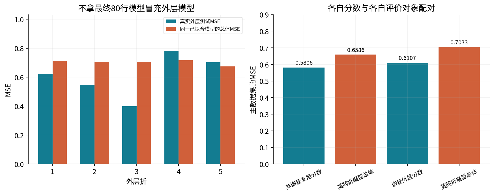
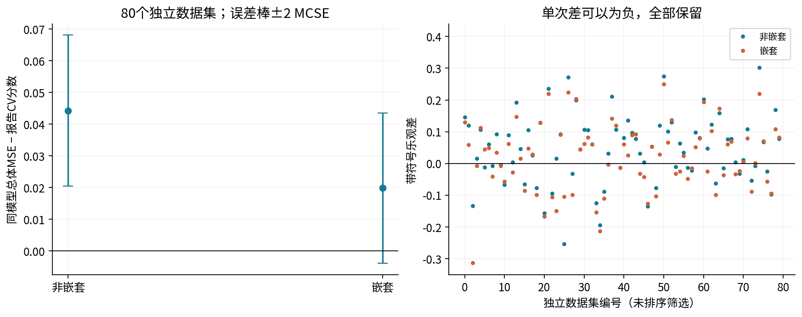

# 第051讲 实验手册

交叉验证与模型选择

你将实现内层选参、外层评价，保存每折索引，比较非嵌套复用分数与正确分层评价。重点是评价对象和数据流，不是选出一个最低的小数。全部数据是合成的，已知总体风险只作为诊断参照。

## 1. 文件和环境

保留完整单元。`lecture.pdf`提供推导，`answers.pdf`逐题解答。`data/protocol.json`固定候选、种子与折数；两份CSV保存主开发数据和80个重复开发数据集。独立最终测试在全数据选择已锁定后才由单独种子生成，所有测试行保留在结果JSON。

`models.py`拟合固定Legendre特征上的ridge；`folds.py`生成显式索引；`cross_validation.py`负责内层搜索与外层重拟合；`hand_example.py`保留纸笔链；`reference.py`使用独立SciPy/实际sklearn；`audit.py`核验科学计算和信息流。

使用Python3.12隔离环境，安装`requirements.txt`。数值依赖固定为NumPy2.3.5、SciPy1.17.0、scikit-learn1.8.0、Matplotlib3.10.8。

```bash
python3 -m venv .venv
. .venv/bin/activate
python -m pip install -r requirements.txt
```

PDF可直接阅读。重建PDF才需要`build-requirements.txt`、Node.js、MathJax3.2.2和NotoCJK字体，见README。

## 2. 先记录协议 再看结果

主数据80行，外层5折、内层4折、17个候选。每轮外层训练64行，内层每次训练48行、验证16行；选参后必须重新用64行拟合。常数候选不重复设置无意义的正则强度。

真函数为$1+0.8P_1-0.5P_2+0.3P_3$，噪声标准差0.8。主种子5105，重复数据5106，划分5107，最终测试5109。重复80份独立开发数据，不是只对同一份数据换80个分折种子。

每次CV分数都与其**同一批折训练模型**的精确总体风险比较，避免混入最终80行模型的训练量差异。正式选择函数不接收真系数和噪声方差。不要在看过结果后更换种子、候选或折数。

## 3. 完整运行

```bash
python experiment.py --out outputs/result.json
python audit.py --report outputs/result.json --out outputs/audit.json
python -O experiment.py --out outputs/result-optimized.json
python -O audit.py --report outputs/result-optimized.json --out outputs/audit-optimized.json
python plots.py --report outputs/result.json --directory outputs/figures
python generate_data.py --directory outputs/regenerated-data
```

数据与脚本可离线运行。脚本以自身位置定位默认数据，允许从其他工作目录调用绝对路径。输出放新目录，原始教学资产受保护。`audit.py`检查报告与默认协议、输入数据匹配，并重新使用独立方法核验，不能拿任意自定义结果当作已验证默认结果。

默认主数据非嵌套分数约0.580613，嵌套外层约0.610720；最终选中次数3、λ0.01。独立最终测试MSE约0.645599。80次平均非嵌套乐观差约0.044208，嵌套约0.019856；后者有约0.011844的MCSE，不能声称有限模拟已精确归零。

## 4. 任务A 四行内层选择与两次前向更新

用四行外层训练样本$(-2,-1),(-1,-1),(1,1),(2,3)$。第一内折验证索引0、3，第二内折验证1、2。候选λ为0、1。每次仅从两行内层训练样本计算

$$w=\frac{\sum x_iy_i}{\sum x_i^2+m\lambda}.$$

写出每个验证点的预测与平方损失，按所有四个验证预测合并MSE，选λ后重新用四行拟合，再计算两个外测点$(3,3),(4,4)$的损失。

另固定λ1，从w0做两步学习率0.1的整批梯度下降。每个阶段写出全部四行预测、残差、半平方损失、两个局部导数及平均梯度贡献；汇总后只加一次λw，再同步更新。这个轨迹解释拟合过程，不参与上一项超参数搜索。



验收值：候选CV分别1/2和51/50，选λ0；优化轨迹w为0、0.25、0.4125。请解释为什么轨迹固定λ1，却不推翻CV选λ0。

## 5. 任务B 跟踪原始行索引

读取主报告的`primary.nested.folds[0]`。找出外层训练和验证全局索引；再逐个读取该折`choice.selection.folds`，核对内层训练/验证索引全部属于外层训练，均与外层验证不相交。

每个内折同时记录局部索引与全局映射。例如内层“第3行”是当前64行子集的第3个位置，不一定是原80行的索引3。不要把一个子集的局部索引直接用在完整数据上。

```python
import json
r = json.load(open('outputs/result.json'))
f = r['primary']['nested']['folds'][0]
outer_test = set(f['validation_indices'])
outer_train = set(f['training_indices'])
for inner in f['choice']['selection']['folds']:
    used = set(inner['training_indices_global']) | set(inner['validation_indices_global'])
    if not used <= outer_train or used & outer_test:
        raise RuntimeError('Inner folds used outer-test rows')
```

## 6. 任务C 核对目标缩放和合并权重

本讲目标为平均半平方误差加λ/2乘非截距系数平方和。实际sklearn Ridge独立对照必须用`alpha=n_train*lambda`，而不是各层一直给同一个数值alpha。λ0.01在48/64/80行训练时分别对应0.48/0.64/0.8。

对于不等大小折，先累加验证SSE，再除以总验证行数。参考GridSearchCV使用负SSE作为scorer，取其折均值后乘折数/总行数，得到同一个合并MSE。默认等大小折时也与普通MSE平均一致。

核对主数据所有17个候选分数，不能只比较最后一个被选中候选；否则索引错位仍可能恰好“通过”。

## 7. 任务D 比较分数与同一模型的风险

提取主报告四个数：非嵌套最小CV、其被选候选五个折模型的平均总体风险、嵌套外层CV、其各自选中折模型的平均总体风险。分别计算差值，不能互相错配。

总体风险公式是噪声方差加各Legendre系数误差平方除以$2j+1$。它需要实验室真系数，只用于核验。用独立求积核对这个公式，不把oracle风险用于改选候选。



主数据嵌套带符号差比非嵌套还大。请留下这个结果，再查看80次重复；不能把“嵌套”当作单次绝对更准的标签。

## 8. 任务E 不确定性与反向结果

从80个完整重复中取两种乐观差，计算均值、跨数据集标准差、MCSE和负值数。非嵌套负值27次、嵌套34次。非嵌套CV比嵌套低73次，相同5次，高2次。



不要把五个重叠外层训练折当五个独立实验做简单t检验，也不要把80次重复随机切分同一数据误当成80份独立数据。本实验知道生成机制，所以能真正生成独立新样本。

## 9. 任务F 数据角色变换与最终封存测试

改变某个外层验证折的标签，只重新运行该折的训练子集选择，检查该轮选择的完整规范JSON字节不变。其他外层轮次可能把这些行作为训练，因此不能要求整套五轮选择都不变。

再改变诊断用真系数、噪声方差，不改观测x/y，确认所有选择不变。最后检查最终选择摘要在生成4000行独立测试数据前已锁定。测试结果只评价，不反馈调参。

最终测试误差的标准误是条件于当前固定模型的测试抽样不确定性；它不是再次收集开发样本并调参的整体不确定性。

## 10. Notebook与PDF重建

`nested_cross_validation.ipynb`保存真实执行输出。首格用标准库验证数据、算法和环境字节，之后才导入科学模块。请保留完整目录，并在副本中重执行：

```bash
python build_notebook.py
python execute_notebook.py nested_cross_validation.ipynb
PYTHON=python bash build_all.sh
```

全流程重建将新结果放在`outputs/`，需要额外PDF依赖。Notebook验证使用新Python进程中的InProcessKernel顺序运行，未声称测试浏览器或外部网络传输。stdout分块可不同，应连接同通道完整文本比较，而不是删掉输出；PNG逐字节核对。

## 11. 二十二道练习

1. 为什么用验证分数选参也属于学习？
2. 三折样本数3、2、2，MSE0、1、4，求合并MSE。
3. 默认80行外5内4中，各阶段训练/验证各有多少行？
4. 逐行计算纸笔例子λ0、λ1的两折预测和损失。
5. 选择后为什么重新拟合？最终w与纸笔外测MSE是多少？
6. 写出第0次前向四行的完整局部导数和平均梯度贡献。
7. 完成两次同步更新和第三次前向，列出目标与梯度。
8. 为什么正则项只加一次？验证MSE是否含正则项？
9. λ0.01对应48/64/80行的sklearn alpha分别是多少？
10. 内层局部索引和全局索引有什么区别？
11. 为什么每个外层折必须重新内层选参？
12. 推导已拟合Legendre多项式的总体MSE公式及其用途边界。
13. 主数据两种CV分数分别与哪个oracle对象配对？
14. 主数据嵌套乐观差更大是否推翻嵌套评价原则？
15. 从80次重复重算两种平均乐观差及MCSE。
16. 嵌套均值约1.68MCSE大于0，能得出什么、不能得出什么？
17. 非嵌套CV和嵌套CV有多少次反向与相同？为何保留？
18. 五个外层训练折共享75%行，能否说误差相关系数等于0.75？
19. 分层、分组、时间划分各防止哪类问题，又不防止什么？
20. 外层标签变换为什么只能要求该轮选择不变？
21. 嵌套CV结束后如何训练最终模型，为什么不能挑外折最好者？
22. 独立测试MSE、其条件标准误和最终模型总体风险分别是什么？

## 12. 学习记录

提交完整索引、候选表、手算链、各自风险配对、80次结果与不确定性解释。每幅图说明它支持什么、不能推出什么。扩展实验另存协议，不覆盖默认数据，不用修改种子掩盖反向结果。
