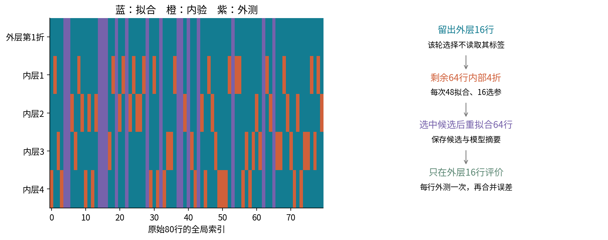
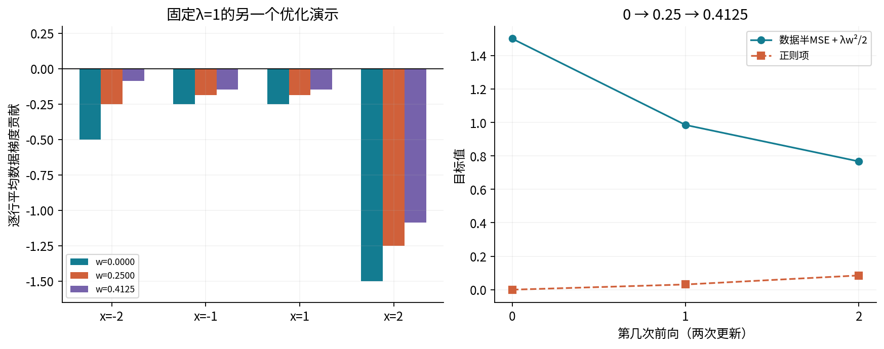
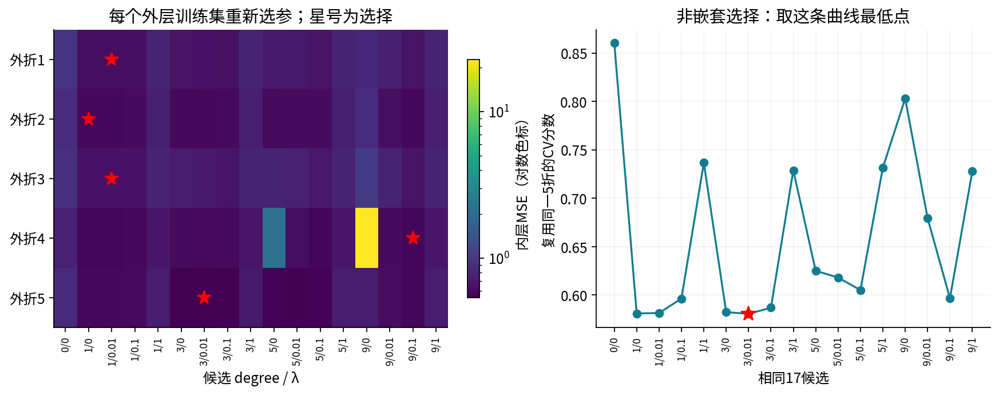
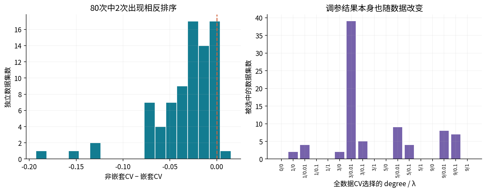
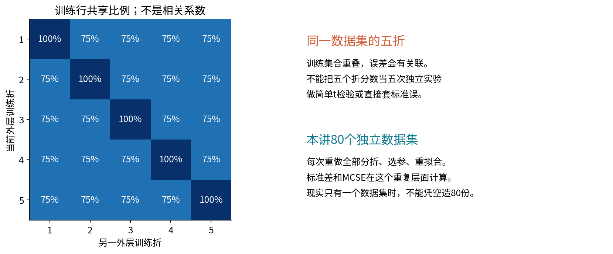
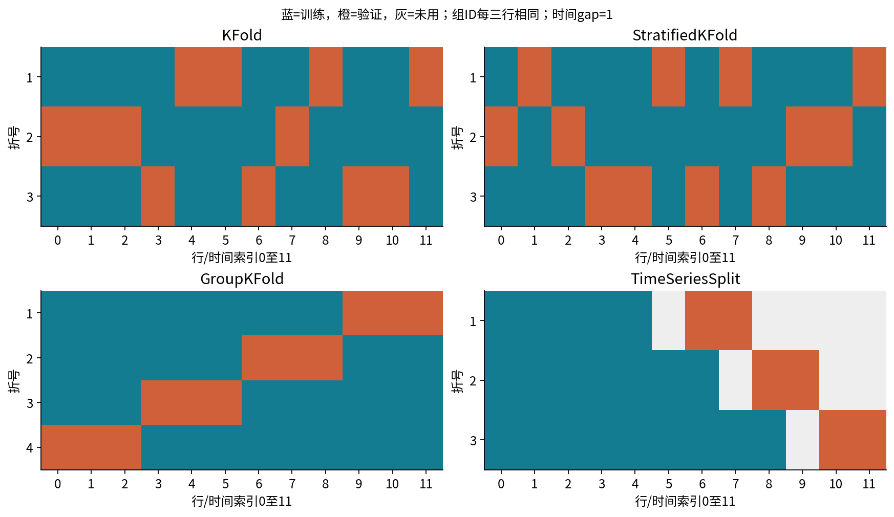
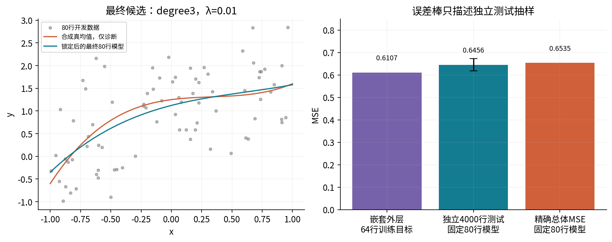

# 第051讲 交叉验证与模型选择

怎样评价包含调参在内的整个学习过程

**本讲目标。** 调参时已经看过的验证分数，往往不足以充当最终性能估计。我们会先用四行数据亲手完成内层选参，再用80行数据实现外层评价，最后在80个独立数据集上量化选择带来的乐观程度。讲义、实验手册和完整答案分开提供，Notebook保存实际执行输出。

直接先修025至026、048、050讲。需要会计算平均平方误差，理解训练、验证、测试的不同角色；不要求提前知道嵌套交叉验证。零基础读者先完成第3至5节，再读主实验。所有数据均为合成，已知真函数只用于核验评价对象，不进入候选选择。

## 1. 选模型和评价选出来的模型是两件事

模型参数如线性权重$w$，通常用训练样本拟合。超参数如多项式次数$d$与正则强度$\lambda$，控制我们允许模型怎么学习。比较若干$\lambda$的验证误差、选最低者，已经是一次利用标签的学习。

假如一个候选的真实表现固定为$R_j$，验证估计写作$\widehat R_j=R_j+\varepsilon_j$。即使每个估计单独没有偏差，选择$\arg\min_j\widehat R_j$也偏爱偶然得到负噪声的候选。最简单的期望关系是$E[\min_j\widehat R_j]\le\min_jE[\widehat R_j]$。它解释筛选倾向，不意味着每一份数据上都更乐观。

真实交叉验证还会重新训练模型，模型本身也随训练集变化，不能把这个简化式当成偏差大小的精确公式。本讲因此直接计算被评分的**同一批折训练模型**的总体风险，与其报告分数配对，而不是偷换为另一个训练量更大的最终模型。

## 2. 普通k折到底做了什么

将开发样本划分成$K$个互不重叠的验证折$V_1,\ldots,V_K$。第$k$次用其余样本$T_k$拟合，在$V_k$预测。每个样本恰好在一次验证中被预测，但它也会进入其他折的训练。

对于一个事先固定候选$\lambda$，本讲用合并样本的均方误差

$$\widehat R_{\rm CV}(\lambda)=\frac{\sum_{k=1}^K\sum_{i\in V_k}[y_i-\widehat f_{T_k,\lambda}(x_i)]^2}{\sum_k|V_k|}.$$

若各折一样大，这等于各折MSE的普通平均。若不一样大，应按验证样本数加权，才能使每行权重一致。三个折的样本数3、2、2，MSE为0、1、4时，合并MSE是$10/7$，不是$5/3$。两种平均对应不同加权对象，不能省略说明。

用这个CV分数选择候选，再把其最小值作为“最终评价”，就复用了同一批验证信息。本讲称它为非嵌套复用分数。它可以用于调参，但不自动成为没有选择偏差的评价。

## 3. 嵌套结构把整套选择放进训练过程

外层先留出一折，只用其余数据作内层CV选参。选出候选后，再用该外层的全部训练数据重拟合一次，最后才看外层留出标签。

默认80行、外层5折：每次64行外层训练、16行外层评价。内层4折在64行内部进行：每次48行拟合、16行验证。外层16行在该轮内层搜索中一直不可见。换一个外层训练集，必须重新执行内层选择，不能沿用看过全部数据的最优候选。

**读图问题。** 同一行在别的外层轮次作为训练数据，是否已经违规？没有：交叉验证本来重复利用数据，但每个样本作为外层测试时，它的标签不能进入该轮训练和调参。完成所有外层评分之后，再根据外层结果反复改候选集，则会在更高一层重新产生选择偏差。

## 4. 四行纸笔例子 先做内层选择

暂时使用简单的无截距模型$\widehat y=wx$，训练目标为

$$J(w)=\frac1{2m}\sum_{i=1}^m(wx_i-y_i)^2+\frac\lambda2w^2.$$

令导数为0可得$w=\sum x_iy_i/(\sum x_i^2+m\lambda)$。注意验证分数是新数据上的普通MSE，不把训练正则项也加到验证损失里。

四行外层训练数据按索引0至3为$(-2,-1),(-1,-1),(1,1),(2,3)$。候选$\lambda\in\{0,1\}$，内层第一折验证行0、3，第二折验证行1、2。

| λ | 内折 | 拟合行 | Σxy | Σx² | 训练m | 权重w | 验证MSE |
| --- | --- | --- | --- | --- | --- | --- | --- |
| 0.000000 | 1 | 1,2 | 2.000000 | 2.000000 | 2 | 1.000000 | 1.000000 |
| 0.000000 | 2 | 0,3 | 8.000000 | 8.000000 | 2 | 1.000000 | 0.000000 |
| 1.000000 | 1 | 1,2 | 2.000000 | 2.000000 | 2 | 0.500000 | 2.000000 |
| 1.000000 | 2 | 0,3 | 8.000000 | 8.000000 | 2 | 0.800000 | 0.040000 |

把每个验证样本再展开，才看得见分数来自哪里。

| λ | 内折 | 验证行 | x | y | 预测wx | 平方损失 |
| --- | --- | --- | --- | --- | --- | --- |
| 0.000000 | 1 | 0 | -2.0 | -1.0 | -2.000000 | 1.000000 |
| 0.000000 | 1 | 3 | 2.0 | 3.0 | 2.000000 | 1.000000 |
| 0.000000 | 2 | 1 | -1.0 | -1.0 | -1.000000 | 0.000000 |
| 0.000000 | 2 | 2 | 1.0 | 1.0 | 1.000000 | 0.000000 |
| 1.000000 | 1 | 0 | -2.0 | -1.0 | -1.000000 | 0.000000 |
| 1.000000 | 1 | 3 | 2.0 | 3.0 | 1.000000 | 4.000000 |
| 1.000000 | 2 | 1 | -1.0 | -1.0 | -0.800000 | 0.040000 |
| 1.000000 | 2 | 2 | 1.0 | 1.0 | 0.800000 | 0.040000 |

例如$\lambda=1$第一内折只用$x=-1,1$训练，$\sum xy=2,\sum x^2=2,m=2$，所以$w=2/(2+2)=1/2$。在验证$x=-2,2$处预测$-1,1$，与真实$-1,3$比较，平方损失是0和4，MSE为2。

第二内折用端点训练，$w=8/(8+2)=4/5$，中间两点的误差各为$1/25$。合并四个验证预测，$\lambda=1$得$51/50=1.02$；$\lambda=0$得$1/2=0.5$，因此选择$\lambda=0$。

选定后用四行重新拟合：$w=10/10=1$。此前未参与选择的两个纸笔外测点$(3,3),(4,4)$预测为3、4，MSE为0。这是事先设定的小算例，不是某个真实总体的泛化保证；两个零误差观测无法证明未来误差为零。

**读图问题。** 为什么不能把“第一折训练得到的$w$”直接当最终模型？该权重只看了两行，而重拟合应使用全部四行外层训练数据。外测标签即使改掉，内层选择与重拟合也应不变。

## 5. 同一四行的完整梯度链与两次同步更新

为了看清拟合发生了什么，我们另固定$\lambda=1$，在相同四行上从$w_0=0$做两步学习率0.1的梯度下降。这个演示不是重新调参，也没有用它替代上一节的闭式候选。

一行数据的链是$w\to\widehat y_i=wx_i\to e_i=\widehat y_i-y_i\to\ell_i=e_i^2/2$。局部导数$\partial\ell_i/\partial\widehat y_i=e_i$，$\partial\widehat y_i/\partial w=x_i$。所以每行对平均数据梯度贡献为$e_ix_i/4$，最后再统一加一次正则梯度$\lambda w$。

### 第0次前向 w=0.000000

| 行 | x即局部导数 | y | 预测 | e即局部导数 | 半平方损失 | 平均梯度贡献 |
| --- | --- | --- | --- | --- | --- | --- |
| 0 | -2.0 | -1.0 | -0.000000 | 1.000000 | 0.500000 | -0.500000 |
| 1 | -1.0 | -1.0 | -0.000000 | 1.000000 | 0.500000 | -0.250000 |
| 2 | 1.0 | 1.0 | 0.000000 | -1.000000 | 0.500000 | -0.250000 |
| 3 | 2.0 | 3.0 | 0.000000 | -3.000000 | 4.500000 | -1.500000 |

数据半MSE=1.500000000，正则项=0.000000000，总目标=1.500000000；数据梯度=-2.500000000，正则梯度=0.000000000，总梯度=-2.500000000。
整批同步更新：$w_{1}=0.000000-0.1\times(-2.500000)=0.250000$，再对全部四行执行新前向。

### 第1次前向 w=0.250000

| 行 | x即局部导数 | y | 预测 | e即局部导数 | 半平方损失 | 平均梯度贡献 |
| --- | --- | --- | --- | --- | --- | --- |
| 0 | -2.0 | -1.0 | -0.500000 | 0.500000 | 0.125000 | -0.250000 |
| 1 | -1.0 | -1.0 | -0.250000 | 0.750000 | 0.281250 | -0.187500 |
| 2 | 1.0 | 1.0 | 0.250000 | -0.750000 | 0.281250 | -0.187500 |
| 3 | 2.0 | 3.0 | 0.500000 | -2.500000 | 3.125000 | -1.250000 |

数据半MSE=0.953125000，正则项=0.031250000，总目标=0.984375000；数据梯度=-1.875000000，正则梯度=0.250000000，总梯度=-1.625000000。
整批同步更新：$w_{2}=0.250000-0.1\times(-1.625000)=0.412500$，再对全部四行执行新前向。

### 第2次前向 w=0.412500

| 行 | x即局部导数 | y | 预测 | e即局部导数 | 半平方损失 | 平均梯度贡献 |
| --- | --- | --- | --- | --- | --- | --- |
| 0 | -2.0 | -1.0 | -0.825000 | 0.175000 | 0.015313 | -0.087500 |
| 1 | -1.0 | -1.0 | -0.412500 | 0.587500 | 0.172578 | -0.146875 |
| 2 | 1.0 | 1.0 | 0.412500 | -0.587500 | 0.172578 | -0.146875 |
| 3 | 2.0 | 3.0 | 0.825000 | -2.175000 | 2.365312 | -1.087500 |

数据半MSE=0.681445312，正则项=0.085078125，总目标=0.766523437；数据梯度=-1.468750000，正则梯度=0.412500000，总梯度=-1.056250000。
闭式最优$w^*=10/(10+4)=5/7$，两步后的0.4125尚未达到最优。Hessian恒为$\sum x_i^2/4+\lambda=3.5>0$。第0次的四个梯度贡献$(-0.5,-0.25,-0.25,-1.5)$相加为$-2.5$，所以第一步是0.25。不要算完一行就偷偷改$w$，否则不再是同一次整批梯度。

**读图问题。** 第二次前向的数据梯度是−1.875，为什么总梯度是−1.625？因为还要加$\lambda w=0.25$。若误加四次正则梯度，会得到另一个目标。

## 6. 主实验的模型和事前协议

主实验$X\sim U[-1,1]$，$Y=f(X)+0.8\epsilon$，$\epsilon\sim N(0,1)$独立，真均值

$$f(x)=1+0.8P_1(x)-0.5P_2(x)+0.3P_3(x).$$

其中$P_0=1,P_1=x,P_2=(3x^2-1)/2,P_3=(5x^3-3x)/2$，更高项可按Legendre递推式生成。你可以先把它们理解为事先确定的特征。基函数不是从全部数据“学”出来的，因此这里没有全数据预处理；052讲将专门讨论需要fit的处理步骤。

17个候选包含常数模型，以及次数1、3、5、9分别搭配$\lambda=0,0.01,0.1,1$。常数项不惩罚。多项式模型用增广最小二乘求解，目标仍是平均半平方误差加$\lambda\|\theta_{1:d}\|^2/2$。

scikit-learn的Ridge使用平方误差和加$\alpha\|w\|^2$，因此独立对照必须设置$\alpha=m\lambda$。当$\lambda=0.01$时，48行内层训练用$\alpha=0.48$，64行重拟合用0.64，80行最终训练用0.8。直接把`alpha=.01`复制到每一层并不等于本讲声明的目标。

主数据种子5105，重复数据种子5106，划分种子5107，最后测试种子5109；默认80次独立数据集、每份80行。候选、种子、折数和误差定义在结果出现前固定，之后未按结果调整。

## 7. 每个外层折都重新选参

主数据集五个外层折的真实选择如下。完整全局索引、每个内折所有17个候选分数、主数据每个候选模型系数与验证预测，都保存在JSON与Notebook中。

| 外层折 | 选中次数d | λ | 重拟合样本数 | 外层MSE | 同一模型总体MSE |
| --- | --- | --- | --- | --- | --- |
| 1 | 1 | 0.01 | 64 | 0.623710 | 0.713398 |
| 2 | 1 | 0.0 | 64 | 0.545137 | 0.705863 |
| 3 | 1 | 0.01 | 64 | 0.398988 | 0.705321 |
| 4 | 9 | 0.1 | 64 | 0.782301 | 0.717521 |
| 5 | 3 | 0.01 | 64 | 0.703463 | 0.674552 |

外层第4折内层搜索中，高次未正则候选有很大误差，结果没有被删掉。这不是数值输出“太难看”就应换种子的理由。高次多项式在某些训练配置下会对区间边缘敏感；独立QR对照用于区分拟合真实不稳定与实现错误。

**读图问题。** 为什么五个星号不在同一列？每轮内层训练数据不同。选参变化本身属于被评价学习流程的随机性，不是必须消除的Bug。

## 8. Oracle总体风险只做实验室参照

因为$X$在$[-1,1]$均匀分布，Legendre基满足$E[P_j(X)P_k(X)]=0$（$j\ne k$），以及$E[P_j(X)^2]=1/(2j+1)$。将缺失的高次系数补0，对任意已拟合多项式，有

$$R(\widehat f)=0.8^2+\sum_j\frac{(\widehat\theta_j-\theta_j^*)^2}{2j+1}.$$

这是真实新响应的MSE，包含0.64噪声方差。这里的平方偏差是这一个固定函数相对真均值的积分误差，不是已经在训练集分布上平均后的bias-variance分解。

选择函数不接收真实系数或噪声方差。我们在参数已选定后才计算这个诊断值，并用独立高斯求积核对。真实任务通常不知道$\theta^*$，不能把本实验oracle公式当成现实中可直接取得的测试分数。

## 9. 分数应该与同一个模型对象配对

主数据非嵌套最小CV为0.580613，所选候选为次数3、$\lambda=0.01$；与它对应的五个64行折模型平均总体风险为0.658597。嵌套外层CV为0.610720，对应各折自己选出的模型平均总体风险为0.703331。

主数据两种评价都出现低于各自总体风险的数值，嵌套这一份的带符号差反而更大。没有必要把它修成预想中的顺序。嵌套的作用是让外层样本不参与该轮选择，不是保证每一份数据的估计误差都小于非嵌套。

在IID、风险可积、候选与流程预先固定且外层信息不反馈的条件下，对训练样本和外层新观测重复抽样，外层损失的期望对应这套外层训练规模的选择加重拟合程序。它不承诺条件于当前全部80行数据时误差差值恰好为0，也不等同于最终用80行训练的单个模型风险。

## 10. 80个独立数据集把单次偶然性显示出来

每份数据都重新分折、内层选择、外层重拟合和评价。定义带符号乐观差为“同一批被评分模型的总体MSE减报告CV分数”，正值表示分数偏低。我们不把负值裁成0。

| 对象 | 80次均值 | 跨数据集SD | 均值MCSE | 负值次数 |
| --- | --- | --- | --- | --- |
| 非嵌套乐观差 | 0.044208 | 0.106523 | 0.011910 | 27 |
| 嵌套乐观差 | 0.019856 | 0.105932 | 0.011844 | 34 |
| 非嵌套CV−嵌套CV | -0.033239 | 0.035174 | 0.003933 | 73 |

非嵌套平均乐观差约0.044208，嵌套约0.019856。嵌套均值约1.68个MCSE高于0，不能宣称本次模拟“证明它有系统偏差”，也不能改种子让它恰好归零。80次是有限实验，理论对象和抽样误差需要分开。

非嵌套乐观差有27次为负，嵌套有34次为负。两种CV分数比较则有73次非嵌套更低、5次相同、2次相反。主数据并不是重复平均的缩小版。

**读图问题。** 左图的“非嵌套CV减嵌套CV”和上一图的“总体风险减CV”是同一个量吗？不是。前者比较两种分数；后者各自与自己的真实对象配对，才用于讨论评价乐观差。

## 11. 为什么不能把五折当五个独立样本做检验

同一数据集的外层训练集大量重叠。默认每个训练集64行，不同两折共有48行，共享比例75%。这不代表误差相关系数恰为0.75，但足以说明它们不是五次互不相关的完整训练实验。

因此简单把五个外折MSE的标准差除以$\sqrt5$、再作普通独立样本t检验，并没有一般有效性保证。重复换随机划分也不等于获得新的独立观测，它仍在复用原样本。

本讲的$\mathrm{MCSE}=s/\sqrt{80}$来自80个独立生成的数据集，每次完整重做程序。它描述本次数值模拟均值的误差，不是告诉现实中只有一份数据的人可以虚构80份独立训练集。研究中若需要推断，应选与抽样单位、重采样设计和评价对象匹配的方法，并说明其条件。

## 12. 分层 分组 时间验证各自解决什么

KFold随机打散适合相应IID对象，不会自动处理重复人的记录。StratifiedKFold使分类标签比例在各折尽量接近，有助于避免稀有类别折内缺失；它没有消除群组依赖，也不能让未来数据出现在过去训练中。分层还会限制某些类别比例波动，因此不能把折间变化机械地当作完整抽样不确定性。

GroupKFold把同一组放在同一验证折，适合评估新组；但它并不自动尊重时间。TimeSeriesSplit沿顺序扩展训练集、使用之后的验证区间，`gap`留下中间未用记录。本例gap为1只是索引演示，不是所有任务的一天或万能安全距离。实际延迟、滑动窗口和标签可用时刻应参照050讲定义。

**读图问题。** 图中的随机KFold是否把同组拆开？GroupKFold是否可能用未来时间的组评价过去的组？对于“新设备的未来”任务，通常还需要联合约束，不能只凭某个分折器名字宣布正确。

嵌套验证的内层也要模拟相同的部署对象。若外层按组评新组、内层却把同组标签打散后调参，可能选择依赖同组信息的候选。时间任务的内层同样不能让未来流入过去。主数值实验是IID回归，因此没有把这四种索引演示的分数混在一起比较。

## 13. 最后怎样得到一个可交付的模型

嵌套CV结束后，不是从五个外折模型里挑外层分数最好的一只作为最终模型；那又用外层评价做了一次选择。应先明确完整学习流程，然后在全部开发数据上运行事先规定的选择方法，最后重拟合一次。

本讲在全部80行上用5折选择17个候选，再以选中候选拟合80行。选中次数3、$\lambda=0.01$。这套选择记录及最终模型的摘要在生成最后测试数据前冻结。然后才用独立种子5109生成4000行测试数据，只评价，不再调整候选。

最终模型的精确总体MSE为0.653491，独立测试MSE为0.645599，条件于这个固定模型的测试均值标准误约0.013965。测试误差棒只反映这4000个新响应的抽样变化，不包含重新收集训练集与重新调参的不确定性。

如果真实项目没有额外最终测试集，嵌套CV仍可用于评价既定选择程序，但需要把训练规模差异和估计不确定性说清。不能看了所有外层结果后不断改搜索空间，再继续把同一外层分数称为最终封存结果。

## 14. 代码中的数据角色和失误检查

`select_and_refit`只接收外层训练子集、候选、内层折数和种子，没有外层标签或oracle参数。每个内折保存局部索引和映射回原始数据的全局索引。保存局部索引而忘记其对应的是哪一个外层子集，是非常常见的泄漏来源。

独立审计实际改变某轮外层标签，确认该轮内层选择字节不变；改变oracle系数与噪声诊断，确认所有选择不变。最终测试不被传给选择接口。摘要帮助追踪状态，但它不能替代对代码实际读了哪些数据的检查。

数学参照包括Fraction纸笔计算、不同基函数实现与带主元QR、真实sklearn Ridge及GridSearchCV，以及独立求积的总体风险。主数据和80次重复的每个内外层候选分数都核对；科学实验普通与`-O`运行，新核Notebook顺序执行，数据与图可重建。

## 15. 输入范围和继续学习

这是有明确范围的教学代码：主实验$x\in[-1,1]$、有限响应绝对值不超过1000、多项式次数0至9、正则强度0至10，最小内层训练集必须足以拟合候选。拒绝重复/重叠或缺失索引、布尔值冒充数值和非有限输入；近秩亏或不可可靠表示的拟合会明确失败，不静默裁剪系数或删掉该次重复。

选择、训练与评价层级一旦分清，下一步就能审查每一步预处理应该在哪一层学习参数。052讲会处理插补、缩放、编码与Pipeline。请始终先问“这个统计量用了哪些行的标签或特征”，再谈调用哪个库函数。

## 16. 原始资料与本讲贡献

1. Cawley与Talbot（2010），[On Over-fitting in Model Selection and Subsequent Selection Bias in Performance Evaluation](https://jmlr.org/papers/v11/cawley10a.html)。核对将选择纳入模型训练过程的评价原则；本讲没有复现其数据集或复制其图。
2. [scikit-learn 1.8 嵌套与非嵌套CV示例](https://scikit-learn.org/1.8/auto_examples/model_selection/plot_nested_cross_validation_iris.html)。核对数据角色与搜索/评价层次，本讲使用自己生成的回归机制。
3. [Ridge接口](https://scikit-learn.org/1.8/modules/generated/sklearn.linear_model.Ridge.html)，核对正则目标的缩放；[GroupKFold](https://scikit-learn.org/1.8/modules/generated/sklearn.model_selection.GroupKFold.html)和[TimeSeriesSplit](https://scikit-learn.org/1.8/modules/generated/sklearn.model_selection.TimeSeriesSplit.html)，核对索引与gap语义。

核对日期2026-10-05。四行手算、两次梯度更新、Legendre合成机制、同模型oracle对照、80次独立重复及十图均为本讲重新制作。学完后应能解释：为什么“把调参也放进内层”比“多跑几次随机分折”更接近真正的问题？
