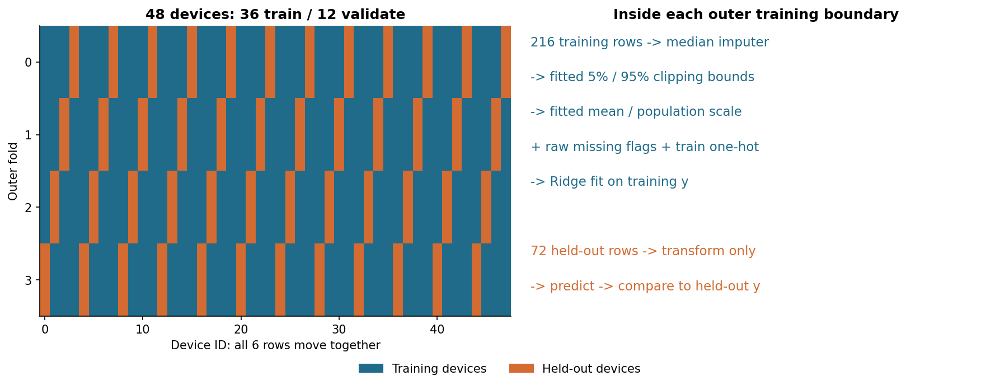
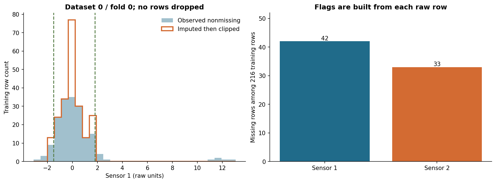
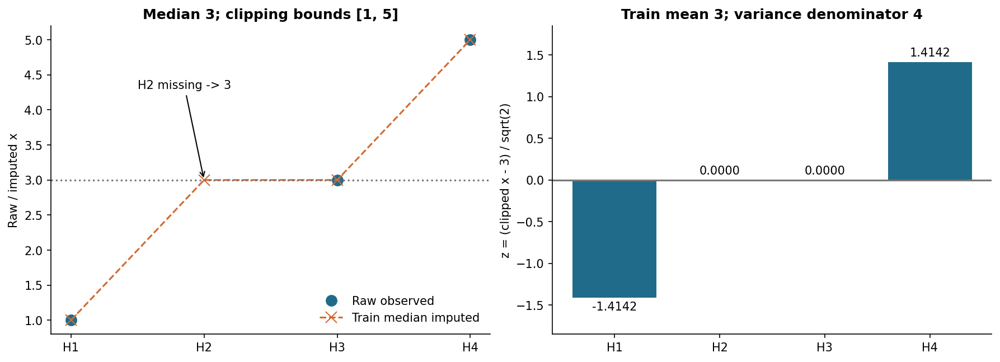
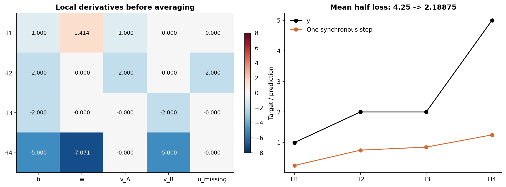
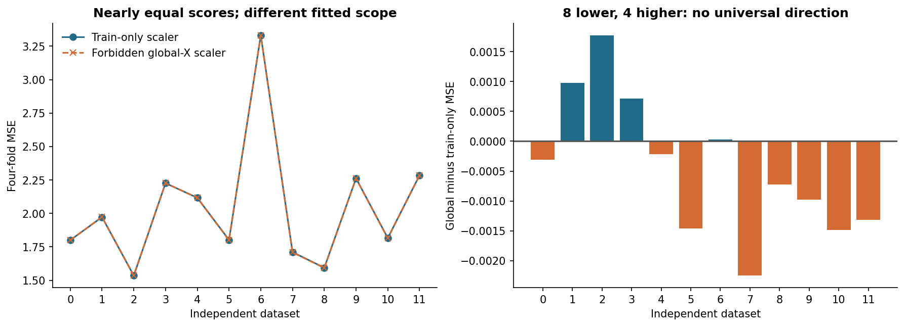
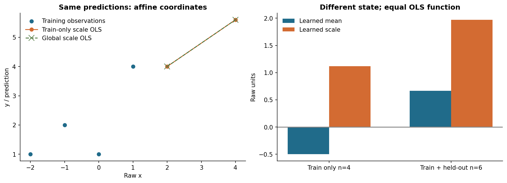
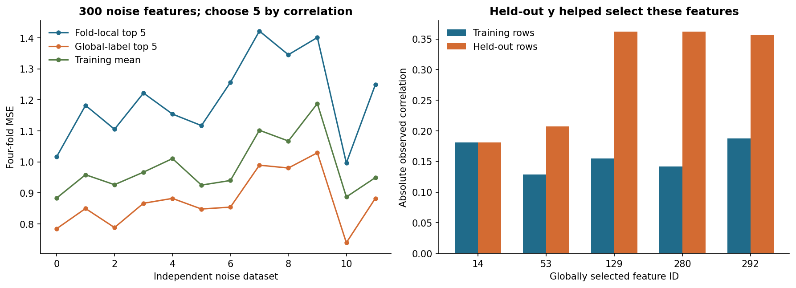
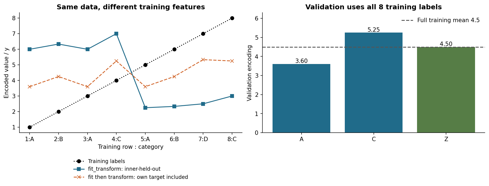
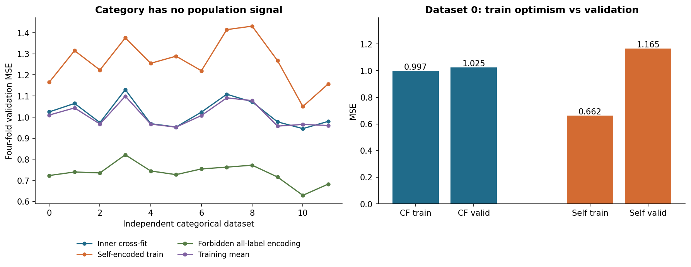
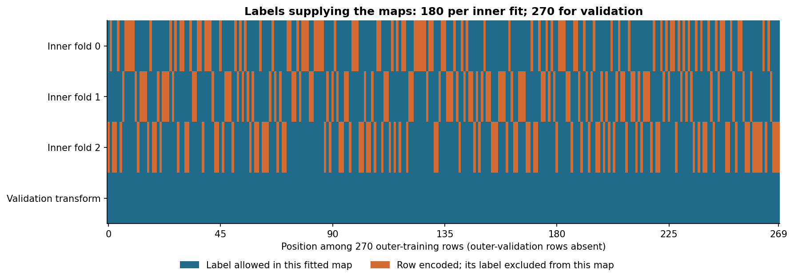

# 第052讲 无泄漏的数据处理流水线

## 1 参数不只藏在预测模型里

本讲的核心结论是：先确定当前拟合允许使用哪部分数据，再在这一边界内学习所有处理参数。中位数、异常值阈值、均值、标准差、类别词表、被选中的特征和类别目标均值，都是学习结果。把最后一个回归器放进交叉验证，却提前在全表计算这些量，并没有评价一条完整的训练算法。

直接先修为006读表清洗、050数据划分与评价对象、051交叉验证与模型选择。这里重新解释fit、transform和每折角色，基础读者先完成四行表，不必从一长串API开始。线性模型与梯度可联系029、032、040；本讲也给出逐行计算，不要求凭记忆补中间步骤。

我们做三个分开的合成实验：新设备的数值与类别流水线、纯噪声上的监督特征筛选、独立类别上的目标编码。它们回答不同机制问题，不能把跨实验分数差相加，称为“泄漏的统一影响”。还有一个预测完全不变的最小二乘对照：协议越界不保证分数提高，甚至不保证分数变化。

## 2 一次fit到底学习了什么

设本折训练索引为T，验证索引为V，二者不交叠。一个处理步骤从训练表学习状态 $s_T=\operatorname{fit}(X_T,y_T)$，再将允许输入x映射成 $z=\operatorname{transform}(x;s_T)$。无监督步骤不读y，但仍通过X学习状态。有监督步骤还读标签，因此必须追踪标签的来源。

例如按物理定义把摄氏度换为开尔文，不需要从样本学参数；按事先说明将传感器故障编码−999转成NaN也可作为固定规则。相反，看过全表直方图才决定截断最高1%，阈值与规则选择都依赖数据。不能把这种选择改名为“清洗”后排除在训练算法之外。

|步骤|拟合所得状态|验证时允许做什么|
|---|---|---|
|中位数插补|本折非缺值中位数|用同一中位数填缺值|
|分位数截断|本折上下分位点|按同一上下界截断|
|标准化|本折均值与尺度|减同一均值、除同一尺度|
|独热编码|本折类别及列顺序|按固定列编码，处理未知类别|
|监督筛选|本折X与y选出的列|保留相同列|
|目标编码|允许标签的计数、和、总体均值|查训练映射，未知类用训练回退|
|预测器|系数与截距|前向预测，不再拟合|

“验证时不fit”针对当前冻结的归纳式协议。如果任务事先允许利用整批无标签目标输入进行传导学习或域适应，可以另定义该算法，并按相同可用信息评价；不能在看到高分后，将意外的全表fit追认为已经声明的另一种任务。[官方常见错误说明](https://scikit-learn.org/1.8/common_pitfalls.html)。

## 3 外层边界和处理边界必须对齐

实验A有48台独立设备，每台6行，设备内共享未观测偏置。目标是同一观察制度下从未见过的新设备，不是未来时间预测。外层四折整设备留出，每折36台共216行训练，12台共72行验证。设备ID只做划分元数据，不输入预测器；站点S0至S3是预测时可观测类别。

每折从头创建Pipeline，只给它216行X和y。它拟合插补、截断、缩放与词表，再拟合Ridge。验证72行沿已冻结的步骤做transform和predict。不同折不能共用已经在其他折fit的状态，即使对象名称相同。



读图G1：站点S2同时在训练和验证出现，是否违反新设备目标？为何不能把设备的6行随意切开？如果部署改成既有设备下个月，这张图还足够吗？

051的嵌套验证仍然适用。若要选择插补法、截断分位点、编码平滑强度或正则强度，应在外层训练内部比较；每个内层训练折还要从头fit整个候选Pipeline。本讲所有常数事先固定，不用外层分数调参，也不声称另有一份未读过的最终现实测试集。

## 4 缺失不是取值为零的普通观察

令R=1表示某数值被观察到，R=0表示缺失。完整但不一定可见的数据分成已观测 $X_{\rm obs}$ 与缺失 $X_{\rm mis}$。缺失机制描述R的分布与这些值的关系；“随机”不是说空白在表上看起来杂乱。

MCAR即完全随机缺失，在所讨论变量集合下，缺失概率不依赖观测值或未观测值。例如与设备状态无关的随机丢包开关。MAR即随机缺失，给定足够的已观测信息后，缺失概率不再依赖缺失值本身。例如已记录的设备型号决定丢包率；必须说清型号确实已观测这个条件。

MNAR即非随机缺失，给定已观测信息后，缺失仍依赖未观测值。例如传感器只在真实读数超过饱和阈值时不返回数值，而没有其他观测完全解释这一关系。把空白填为整体中位数，可能抹掉系统性的高读数信息。

MAR的条件可写为 $P(R\mid X_{\rm obs},X_{\rm mis})=P(R\mid X_{\rm obs})$。它相对于所包含、当时可用的变量定义，不是数据集永久不变的标签。仅靠已观测数据通常不能区分MAR与MNAR；需要采集知识、外部信息和敏感性分析。模拟器知道缺失开关，不代表真实机制也可识别。参见[Rubin原始缺失数据论文](https://doi.org/10.1093/biomet/63.3.581)及[van Buuren作者教材的机制介绍](https://github.com/stefvanbuuren/fimdbook/blob/master/Rmd/01-introduction.Rmd)。

实验A两个数值列分别以0.18和0.12概率独立缺失，开关与数值、标签和设备效应独立，所以在本机制中是MCAR。我们未同时比较MAR与MNAR方法，也未证明中位数插补对它们无偏。训练无泄漏与缺失模型恰当是两个不同问题。

## 5 插补先学习一个值 再填每个空位

对列j，训练非缺行集合为 $O_{Tj}$。中位数 $m_{Tj}=\operatorname{median}\{x_{ij}:i\in O_{Tj}\}$ 只用这些训练观察。训练和验证缺值都用同一m，验证非缺值不参与重新估计。将验证也纳入中位数，会改变该折算法。

均值插补便于代数，却对极端读数敏感；中位数对少数极值更稳健，但不会恢复每行真实缺值。常数填补须说明单位与意义。近邻或迭代插补会学习更复杂的关系，仍必须训练内fit；复杂并不代表自动解决MNAR，单次填补也不意味着不确定性为零。

可增加缺失指示 $m_{ij}=\mathbf1\{x_{ij}\text{缺失}\}$，让模型区分“真实恰好等于中位数”和“值未知”。它来自原始输入，不读答案；是否有帮助依赖机制，在MCAR下不预先承诺改善。部署缺失流程改变时，指示与标签的关系也可能失效。

本包用MissingIndicator(features="all")为两列都留指示，即便训练某列没有缺失，验证首次缺失也有固定列。SimpleImputer设置keep_empty_features=True：训练全缺列保留并填0，不从验证借中位数。这是明确回退，0并非测量真值。[插补接口与全空列规则](https://scikit-learn.org/1.8/modules/generated/sklearn.impute.SimpleImputer.html)。

## 6 异常值阈值也是学习参数

极端值可能来自单位错误、故障、合法稀有状态或分布变化。仅因“看起来远”而删除，可能移除最需要预测的对象。物理不可能范围可以事先规定；分位点、均值加若干标准差或数据驱动的异常分数阈值，则依赖训练样本。

实验不删除行。在插补之后学习训练5%与95%分位点l和u，按 $c(x)=\min\{u,\max\{l,x\}\}$ 截断两边数值。次序是协议的一部分：分位点包含已经填入的训练中位数。先截断非缺值再插补一般不同，不能当作同一实现。

分位数用线性插值。将n个值排序为 $v_{(0)},\ldots,v_{(n-1)}$，计算a=(n−1)q，k为a向下取整。分位值在第k、k+1项间按a−k插值；整数位置直接取对应值。别人因而能从原始行复算阈值，而不只是相信某个API小数。



读图G2：两种直方图总计数为何不同？截到上界的点真实值就等于上界吗？若事后按验证残差删除最差设备，评价对象改成了什么？

截断可能减轻本模拟的正向测量污染，也会压平合法极端值，不保证提高泛化。全缺训练列填0后上下界均为0；验证即便出现7，也被截到0，因为训练没有支持估计该列关系。这一保守回退已经测试，其丢信息的局限也需披露。

## 7 缩放改变坐标 也可能改变惩罚

插补截断后数值记为v。训练均值为 $\mu_{Tj}=|T|^{-1}\sum_{i\in T}v_{ij}$，方差为 $s^2_{Tj}=|T|^{-1}\sum_{i\in T}(v_{ij}-\mu_{Tj})^2$。StandardScaler用分母n，即ddof=0，不是无偏样本方差的n−1。

取s为方差平方根，$z=(v-\mu_T)/s_T$。训练方差为0时，scale设为1避免除零。变换后训练均值0、方差1，不意味着验证也如此。分别把训练验证各自fit到0和1，会给同一原值两套坐标，破坏系数解释。[StandardScaler官方定义](https://scikit-learn.org/1.8/modules/generated/sklearn.preprocessing.StandardScaler.html)。

标准化不把任意分布变成正态，偏态、多峰和尾部形状仍可能存在。尺度影响距离与正则化：对标准化系数w施加相同平方惩罚，换成原单位后相当于与尺度相关的惩罚。因此需要查看完整目标，才能解释缩放统计的变化是否影响预测。

## 8 类别编码先固定含义与未知类策略

站点A、B、C是名义类别。写成0、1、2再用线性系数，会施加等距有序含义，通常无依据。训练词表为A、B时，独热编码A=(1,0)、B=(0,1)；handle_unknown="ignore"使新类别C=(0,0)。这只是明确输入规则，不是证明C与平均类别相同。

本讲保留全部独热列，使用带截距、正惩罚Ridge。独热列与截距线性相关，但对特征施加正惩罚可稳定求解。删去一个基准类会改变惩罚的参数化，不能仅因允许的线性函数类似就断言正则结果相同。词表来自训练，验证不新建列。

类别缺失可按事先规则转成不会与合法取值冲突的标记，例如__MISSING__，再作为类别学习，不能混淆真实字符串与空值。本实验站点本来不缺，审计覆盖未知站点；没有假装已验证所有None、NaN、字符串混合的清洗方案。[OneHotEncoder规则](https://scikit-learn.org/1.8/modules/generated/sklearn.preprocessing.OneHotEncoder.html)。

## 9 同一四行表从原值走到输入

纸笔例独立构造，不是从大实验挑出的子集。H1至H4训练，H5、H6只验证。为手算，此例预定训练最小最大值截断，即q=0、1；主实验用0.05、0.95。这里A、B为类型，不是外层分组的设备身份。

|行|原始x|类型|y|角色|
|---|---:|---|---:|---|
|H1|1|A|1|训练|
|H2|缺失|A|2|训练|
|H3|3|B|2|训练|
|H4|5|B|5|训练|
|H5|7|C|6|仅验证|
|H6|缺失|B|3|仅验证|

训练非缺值排序1、3、5，中位数3。填补后为(1,3,3,5)，上下界1、5，训练值都不变。均值(1+3+3+5)/4=3；离均差(−2,0,0,2)，平方和8，除4得方差2、尺度√2。

|行|插补后|截断后|标准化z|A指示|B指示|缺失m|
|---|---:|---:|---:|---:|---:|---:|
|H1|1|1|−√2|1|0|0|
|H2|3|3|0|1|0|1|
|H3|3|3|0|0|1|0|
|H4|5|5|√2|0|1|0|
|H5|7|5|√2|0|0|0|
|H6|3|3|0|0|1|1|

H5的7不参与训练上界，因而截到5；C不扩充词表。H2和H3都变成z=0，类型与缺失指示却不同。指示必须从原始x生成；填完再检测NaN会丢掉这份信息。



读图G3：若用H5一起估计尺度，哪些训练输入会改变？H2填3是否说明真实值是3？验证均值为何不要求为0？

## 10 前向 损失与局部导数逐行算

模型 $\hat y=b+wz+v_A I_A+v_B I_B+um$，参数顺序 $(b,w,v_A,v_B,u)$，设计行 $a_i=(1,z_i,I_{Ai},I_{Bi},m_i)$。纸笔例不加正则，只做一次平均半平方损失GD；主实验另用Ridge完整求解，不把这个学习率当主实验参数。

残差 $r_i=\hat y_i-y_i$，单行损失 $\ell_i=r_i^2/2$，目标 $J=\sum_i\ell_i/4$。链式法则：$\partial\ell_i/\partial r_i=r_i$，$\partial r_i/\partial\hat y_i=1$，$\partial\hat y_i/\partial\theta_j=a_{ij}$，故局部导数为 $r_i a_{ij}$。预处理统计已冻结，模型优化不对中位数、分位数求梯度。

初始化全0，预测全0。H1对w导数为(−1)×(−√2)=√2，符号必须由相乘得到。

|行|预测|残差|半平方损失|对b w vA vB u的局部导数|
|---|---:|---:|---:|---|
|H1|0|−1|1/2|(−1, √2, −1, 0, 0)|
|H2|0|−2|2|(−2, 0, −2, 0, −2)|
|H3|0|−2|2|(−2, 0, 0, −2, 0)|
|H4|0|−5|25/2|(−5, −5√2, 0, −5, 0)|

损失和17，平均17/4=4.25。导数按列求和(−10,−4√2,−3,−7,−2)，再除4：

$$\nabla J=(-5/2,-\sqrt2,-3/4,-7/4,-1/2).$$

H5、H6的y不能进入这个和。每行算完立即更新再处理下一行，则是另一种逐样本算法，不是本例的一次批量同步更新。

## 11 同步更新后再做下一前向

η=1/5，一次更新 $\theta^{(1)}=\theta^{(0)}-\eta\nabla J$，得到

$$\theta^{(1)}=(1/2,\sqrt2/5,3/20,7/20,1/10).$$

五个新参数都来自同一个旧向量。H1预测 $1/2+(\sqrt2/5)(-\sqrt2)+3/20=1/4$；H2为1/2+3/20+1/10=3/4；H3为1/2+7/20=17/20；H4为1/2+2/5+7/20=5/4。

|行|下一预测|下一残差|下一半平方损失|
|---|---:|---:|---:|
|H1|0.25|−0.75|0.28125|
|H2|0.75|−1.25|0.78125|
|H3|0.85|−1.15|0.66125|
|H4|1.25|−3.75|7.03125|

损失合计8.755，除4为2.18875=1751/800。H5用截断z=√2、未知类型全零，预测0.5+0.4=0.9；H6用训练中位数、B和缺失指示，预测0.5+0.35+0.1=0.95。验证标签只在之后评分，不改变预测。



读图G4：哪行给u贡献梯度？求和后为何只除4一次？先改b再重算w梯度，为何不再得到本表？

审计用Fraction及z=√2q、w=√2v关系保留精确有理数，再用中心有限差分在非零新参数核验全部五个梯度。两者检查不同路径，不能只把同段矩阵乘法运行两遍称为独立参照。

## 12 实际Pipeline怎样连接两类列

数值先走插补、截断、标准化；缺失指示从原始数值并行生成；类别走独热。ColumnTransformer按固定列选择拼接，Pipeline再训练Ridge。训练验证的列含义与顺序须保持一致。

```python
from experiment import make_pipeline
model = make_pipeline(alpha=15.0, lo=0.05, hi=0.95)
model.fit(X[train_rows], y[train_rows])
prediction = model.predict(X[valid_rows])
state = model['pre'].named_transformers_['num']
print(state['impute'].statistics_)
print(state['clip'].lower_, state['clip'].upper_)
print(state['scale'].mean_, state['scale'].var_)
```

实际目标 $\|Z_Tw+b\mathbf1-y_T\|^2+\alpha\|w\|^2$，α=15、截距不惩罚。它与纸笔一次无正则GD不是同一训练方案；小例用来理解处理后输入如何进入预测与导数。主实验用SVD，独立参照用手工处理矩阵及SciPy增广QR。

Pipeline捆绑步骤和fit范围，不会读懂研究协议。若传入全表，或全表目标编码后才送入Pipeline，泄漏已经发生；用错误随机行折替代设备折，它也不会自动改成GroupKFold。[Pipeline接口](https://scikit-learn.org/1.8/modules/generated/sklearn.pipeline.Pipeline.html)。

## 13 实验A仅改变缩放统计来源

种子52017首次运行前固定，12份数据各重新生成设备效应、潜在数值、站点、噪声、污染与缺失。两个潜在数值独立标准正态，设备效应标准差0.8，标签噪声标准差0.6。标签由未污染值产生：$y=1+1.5x_1^*-0.7x_2^*+0.3s+a_g+\varepsilon$。读数另以0.04概率加12，再按MCAR开关缺失。模型只见污染缺失后的数值与站点，星号真值与潜在效应只供机制说明。

正确路线所有处理train-only。错误路线仍只用训练拟合中位数、截断与词表，但把固定处理施于全288行后，让StandardScaler用训练加验证数值fit。Ridge仍只读216个训练标签。两条路线仅改变缩放fit范围，不把插补、截断、词表与标签污染同时改变。

先对每份数据平均四折MSE，再平均12份独立数据。正确均值2.037497，全局缩放2.037060，错误减正确约−0.000437。全局缩放8次稍低、4次更高，全部保留。方向和幅度是这次固定机制的观察，不是每种泄漏的必然规律。



读图G5：只看左图能否判断全表fit？4个正差能否使协议越界变正确？为何不能将48折当48次独立实验算标准误？

## 14 泄漏为何可能完全不改变分数

带截距、无惩罚、满列秩最小二乘，若仅作可逆仿射变换 $z=(x-\mu)/s$ 且s>0，则 $b+wz=(b-w\mu/s)+(w/s)x$。两个坐标中的直线一一对应，允许函数集合不变，精确求解后预测不变，除了数值舍入。

固定训练x=(−2,−1,0,1)、y=(1,2,1,4)，验证x=(2,4)。训练缩放与全表缩放给出不同均值尺度，却给相同预测4和5.6。这是事先固定且有代数依据的负对照，不是事后挑出的零差异种子。



读图G6：固定强度Ridge为何可能打破不变性？截断不是可逆变换，为何不能套同一证明？

信息路径是否符合协议，与路径改变造成多大分数影响，是不同问题。前者审计fit输入，后者看配对数值。不能因分数未提高就排除泄漏，也不能未经实验断言一次无监督越界必然产生巨大乐观。

## 15 实验B 监督选择把答案送进选列

B另生成200个独立样本、300个独立标准正态噪声特征，y也独立标准正态。总体X无预测信号。固定规则按f_regression选5列，再训练α=1的Ridge，不做其他处理。

正确路线每折150个训练样本选列、50个验证评分。错误路线先用全200行X和y选5列，再仅训练行拟合系数。虽然回归器没直接收到验证y，但列集合已包含答案信息。路径为验证y→筛选统计→列集合→训练矩阵→预测。

12份正确四折MSE均值1.205764，全标签选列0.874681，训练均值基线0.983907。错误版本在纯噪声上看似胜过基线，正确版本因拟合偶然相关而更差。12次错误分数都较低，仍只属于这个机制，不能要求每个泄漏例都同样明显。



读图G7：只将Ridge放进CV为何挡不住选列泄漏？无信号时MSE是否每次恰好1？删除最差的正确结果会改变哪个统计对象？

本例原创生成数据，未复制[官方特征选择泄漏示例](https://scikit-learn.org/1.8/common_pitfalls.html#data-leakage)的数字。

## 16 目标编码是监督估计器

高基数类别会产生很多独热列。目标编码以类别标签均值表示它，不是单纯字符串翻译。允许拟合行集合为S，类别c有n次、标签和q、S内总体均值μ、平滑m>0，使用

$$h_S(c)=\frac{q+m\mu}{n+m},\qquad n>0.$$

未见类别用μ。它是q/n与μ的加权平均，类别权重n/(n+m)；少见类别更向总体收缩。n、q、μ必须都来自同一个允许集合。即便类别和只用训练，μ若来自全表，验证标签仍进入每个编码。

训练行若用含自身y的映射，答案会影响自己的输入。单例类别在m=0时编码恰为y，m>0仍有自身成分。下游模型可能学到虚假的强相关，而新行没有自己的标签，训练与推理关系不同。增大平滑不自动解决这一问题。

在外层训练T内再分小折 $I_1,\ldots,I_K$，对I_k内行用 $h_{T\setminus I_k}$ 编码，称内部cross-fitting。随后还用完整T拟合 $h_T$，用于外层V及未来预测。两类编码刻意来自不同大小的标签集合。[官方目标编码说明](https://scikit-learn.org/1.8/modules/preprocessing.html#target-encoder)。

## 17 八行例把每份标签来源算出来

训练类别A、B、A、C、A、B、D、C，标签1至8。m=2，两内折不打乱，第一折留出1至4，第二折留出5至8。全训练均值4.5只用于最后完整映射，不用于内层折外编码。

为1至4编码，只用5至8的标签5、6、7、8，均值6.5。A只有5，编码(5+13)/3=6；B=(6+13)/3=19/3；C=(8+13)/3=7。前四行得到(6,19/3,6,7)，没有读取它们自己的1、2、3、4。

为5至8编码，只用1至4，均值2.5。A有1和3，编码(1+3+5)/4=9/4；B=(2+5)/3=7/3；D未见回退2.5；C=(4+5)/3=3。后四行得(9/4,7/3,5/2,3)。

|行|类别|y|用于编码的标签行|内部折外编码|完整训练映射|
|---|---|---:|---|---:|---:|
|1|A|1|5至8|6|3.6|
|2|B|2|5至8|6.333333|4.25|
|3|A|3|5至8|6|3.6|
|4|C|4|5至8|7|5.25|
|5|A|5|1至4|2.25|3.6|
|6|B|6|1至4|2.333333|4.25|
|7|D|7|1至4|2.5|5.333333|
|8|C|8|1至4|3|5.25|

完整训练A有n=3、q=9，得(9+9)/5=3.6；B的n=2、q=8，得17/4；C得21/4；D得16/3。验证A、C、Z编码为3.6、5.25、4.5，Z回退全训练均值；不能看Z的验证答案。



读图G8：行1标签改为100，会否改变它自己的折外编码？会否改变完整映射及另一内部折特征？为何不要求fit_transform与transform对同一训练行相等？

## 18 真实TargetEncoder两个方法不等价

scikit-learn1.8.0的TargetEncoder.fit_transform会内部cross-fit，fit(X,y).transform(X)不会，两者不能互换。前者还保存完整训练的encodings_与target_mean_给后续transform用，不是把未来行随机分给某个内部编码器。

```python
from sklearn.preprocessing import TargetEncoder
from sklearn.linear_model import Ridge
enc = TargetEncoder(target_type='continuous', smooth=5.0,
                    cv=3, shuffle=True, random_state=52043)
z_train = enc.fit_transform(X_train, y_train)
z_valid = enc.transform(X_valid)
model = Ridge(alpha=1.0, solver='svd').fit(z_train, y_train)
prediction = model.predict(z_valid)
```

显式continuous避免整数样式回归标签被自动判成分类。连续目标用KFold、分类用分层折；实际Pipeline在中间变换器训练阶段调用fit_transform，审计确实调用该Pipeline核验。[版本化API](https://scikit-learn.org/1.8/modules/generated/sklearn.preprocessing.TargetEncoder.html)。

该版本cv参数是整数，内层不会自动继承外层group或时间语义。外层GroupKFold仅排除了外层验证组，不保证内层整组留出；时间任务还需按每个预测时点限制标签。应实现并审计合适内部来源，不能传groups给外层便假定所有步骤都懂了。

实验C特意采用独立类别抽样、独立标签，无隐藏同类别效应，无时间目标。类别重复在此不代表同一个人重复测量，所以内部随机行折适用。不能直接搬到A的设备依赖或050的未来预测。

## 19 实验C分开三种编码问题

每份360个独立类别抽样来自120个可能值，y独立标准正态。外层270训练、90验证。正确路线在270行内三折编码，每个内部映射180个标签；验证查270行完整映射。m=5、内部seed52043、Ridge α=1都已固定。

第二路线只在270个外层训练标签上fit，再transform同样训练行，不cross-fit。这有自身标签污染与过拟合风险，但90个外层验证标签未进入拟合，所以外层评分仍可评价这个容易过拟合的算法，并非自动失效。

第三路线故意用全部360个标签先fit映射，再编码两边，直接读取验证答案，是外层标签泄漏。三路线共享X、y与外层索引，改变路径不同，必须分别解释。

12份平均验证MSE：cross-fit 1.018423，自编码1.263601，全标签编码0.733944，训练均值基线1.008078。自编码12次都较差；全标签编码12次都看似更好。cross-fit不保证胜过简单均值，本次只有2份优于均值基线；无信号时不应为复杂处理硬找胜利。



读图G9：自编码验证较差与全标签编码验证较好为何不矛盾？cross-fit略差于均值，要不要换seed直到获胜？

## 20 每行统计来源比高分更有诊断力

结果JSON保留C每折外层行号、内部fit与编码行号、每个训练行的折外编码和完整编码、验证编码与预测。A保留每折中位数、截断界、尺度、词表、fit行号。这直接回答“这个数字是谁的标签或读数算出来的”。



读图G10：某行没提供自身标签，能否证明所有外层验证标签都没被读？若全360行先fit_transform再外层CV，仍有何越界？

审计将验证标签整体加50：正确预测不变，全标签编码最大改变约23.214286。某训练行自己的y加10，自身折外特征不变，却可影响别的内部折特征。验证数值加100，本折训练中位数、截断和尺度不变。每项测试明确“应该不变什么”，不笼统要求所有输出不变。

独立参照用排序插值、计数求和、手工KFold置乱与SciPy QR，重建全部12×4折。目标编码最大差约2.22×10⁻¹⁶，A预测最大差约5.33×10⁻¹⁵。小差异支持实现与协议一致，不证明现实总体适配。

## 21 研究报告要写清什么

全表缩放是无标签输入的协议越界；全表监督筛选、目标均值是直接答案路径；全表删除异常还可能改变总体。训练验证各fit一次会改变坐标，不能叫“各自独立所以安全”。

先全表fit_transform再切分仍危险。即使TargetEncoder排除每行自身y，其内部训练集合仍可能含随后某外层验证折的其他标签。自身排除不等于外层隔离，外层边界必须包住内部cross-fit与预测器拟合。

报告至少有：预测单位与时点、允许输入、各fit来源、未知类与全缺列规则、调参层级、评价是否参与选择、失败和负结果。本讲仅预声明教学模拟，无科研pilot、现实业务验证或部署结论。

完成选择后，可以在全部允许开发集上重训完整流水线。目标编码最终训练特征仍经合适内部cross-fit，完整开发集映射留给未来transform。保存回归器也保存列定义、中位数、尺度、词表、版本与输入约束，避免训练服务不一致。

## 22 练习

E1. 列出插补、截断、缩放、独热、监督选择各自状态；比较温度单位换算与全表分位点截断。

E2. 给出相对已观测设备型号的MAR例子；型号未记录时为何不能照搬判断？空白模式能否证明MNAR不存在？

E3. 重算四行表中位数、上下界、均值方差和六行设计。H5、H6什么信息不得进入fit？

E4. 逐行求局部导数、聚合梯度、同步更新、下一前向、1751/800及两个验证预测。

E5. 解释全缺列、常数列与验证首次出现数值时的实现行为。

E6. 写一条正确Pipeline外层伪代码及一条仍泄漏的伪代码，标出越界位置。

E7. 证明OLS仿射缩放不变性，解释固定Ridge惩罚为何不同。

E8. 用A的12个配对差写不夸大的泄漏结论。

E9. 解释纯噪声选列怎样获得虚高成绩，以及均值基线的作用。

E10. 手算八行目标编码两内层均值、8个编码及验证A、C、Z。

E11. 比较fit_transform训练、fit后transform训练、transform验证的标签来源。

E12. 全表TargetEncoder.fit_transform之后GroupKFold，是否安全？给出路径与修正。

E13. 自编码未读外层标签但分数较差，是算法缺点还是外层评价失效？全标签编码为何不同？

E14. 部署缺失、未知类别、截断比例变化，应记录什么？是否必然性能下降？

E15. 为带标签延迟的设备时间任务写目标编码来源规则，解释随机内部折的风险。

E16. 写包含调参、全开发集重训、内部cross-fit和封存测试的流程。

## 23 来源与实现边界

小表、机制、数据、推导、图与程序均原创。sources.md与source-checks.json记录来源用途与核对范围，不复制外部实验数字。数值版本锁定NumPy2.3.5、SciPy1.17.0、scikit-learn1.8.0；Notebook在新进程真实IPython内核执行，未测试浏览器界面、外进程传输或全平台Conda求解。浮点末位与字体可跨平台变化，数值用容差、PDF重排后逐页目视。
