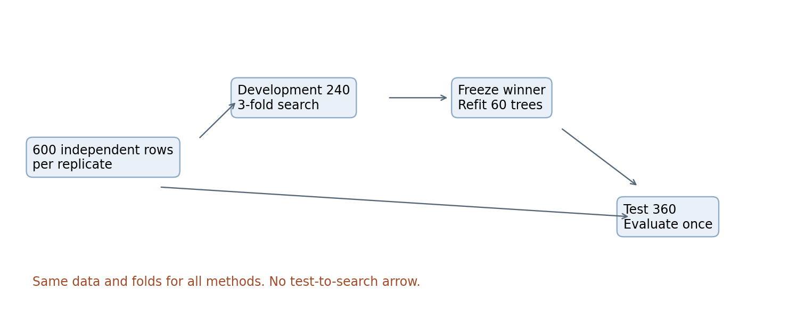
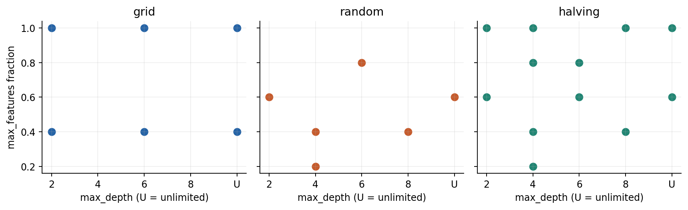
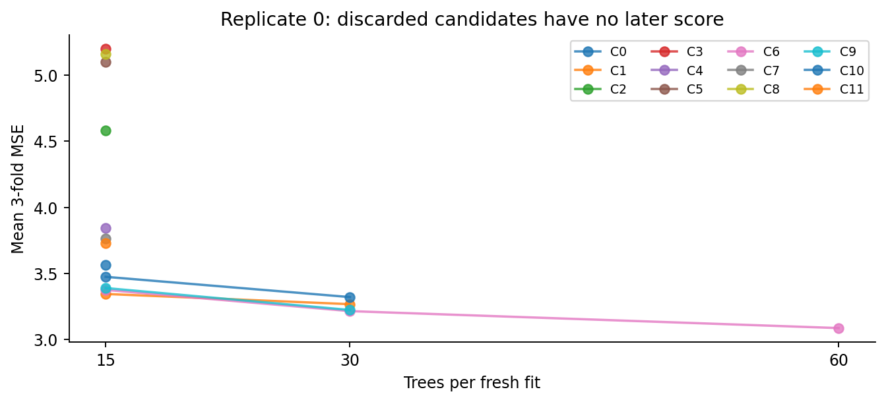
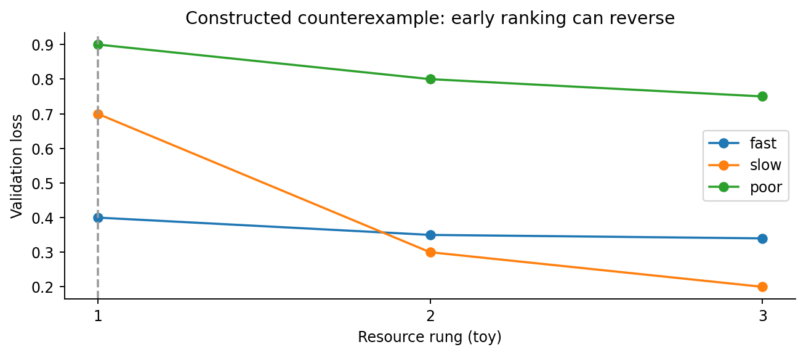
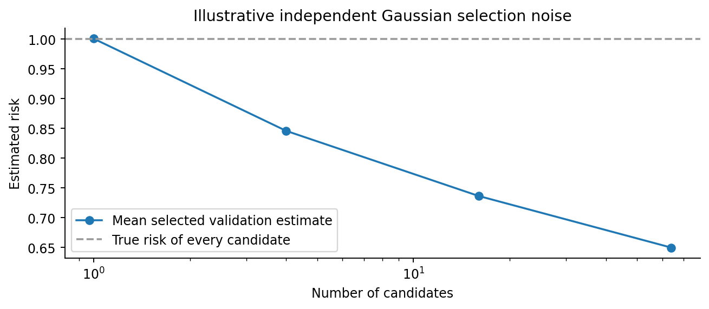
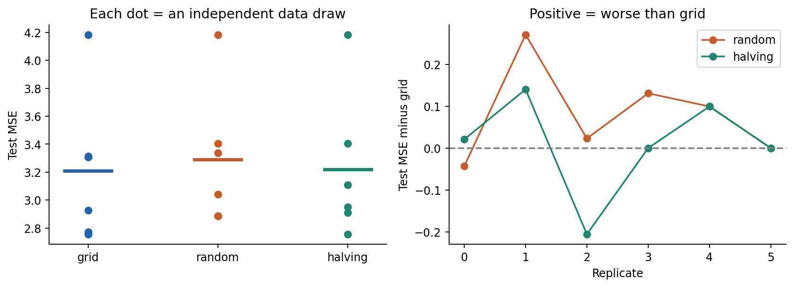
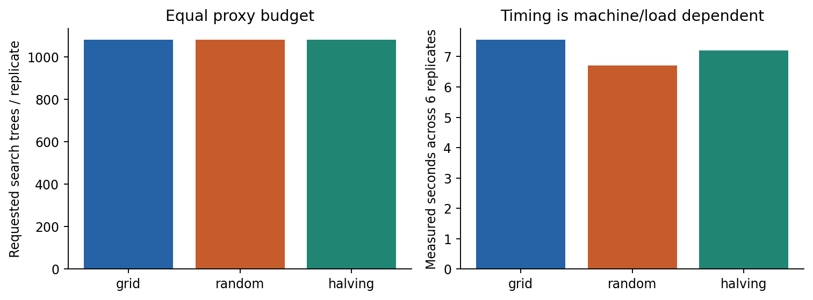

# 第053讲 调参与实验预算

## 1 比较的对象是一整套搜索流程

本讲回答：怎样在有限预算内比较算法而不偏袒某一方？结论是先固定数据权限、搜索空间、预算口径与选择规则，再比较最终流程。一个模型的测试分数既受模型族影响，也受试过多少设置、每次训练多久和选择噪声影响。给新方法多十倍机会，再把全部差异归因于模型结构，证据不足。

直接先修007可重现实验、026效应大小、051交叉验证和052流水线。你需要知道训练、验证、测试的职责以及均方误差。这里会重讲必要符号，补充树模型的最小工作原理；完整决策树与随机森林推导留在原目录058至060。本讲用森林作为可控的训练工作量载体，不改变课程顺序。

完成后应能独立写预算账本，手算一轮淘汰，解释为什么最低验证误差会偏乐观，并读懂一个没有“新方法全面胜出”的实验。本次六份合成数据上，网格平均测试MSE为3.209982，随机搜索3.290078，逐次淘汰3.219101。随机并未赢得这个小实验。它作为基线的价值不依赖每次都赢。

## 2 参数与超参数的边界

训练参数由一次拟合根据训练数据求出，如线性回归系数、树的分裂阈值和叶节点均值。超参数控制拟合过程，如正则强度、树最大深度或学习率。两者不是由字母决定：同一个量若被外层流程根据验证表现选择，就是该流程的可调设置。

记训练算法为A，超参数为λ，训练集为T，则模型为 $f_{\lambda,T}=A(T;\lambda)$。第k折验证损失为 $\widehat L_k(\lambda)$，K折平均为：

$$\widehat L_{\rm CV}(\lambda)=\frac1K\sum_{k=1}^{K}\widehat L_k(\lambda),\qquad \hat\lambda=\arg\min_{\lambda\in\Lambda_{\rm tried}}\widehat L_{\rm CV}(\lambda).$$

这里的最小化只覆盖实际尝试过的集合，不是整个数学空间。相同最小值如何处理也应预先确定。本实现按候选编号从小到大打破平局；不查看测试分数裁决。

搜索结束后，用全部开发集重新拟合选择出的设置，再做一次封存测试。交叉验证中每个候选的模型并不是最后交付模型。重新拟合的计算开销也必须计入完整流程，而不能从账本里消失。

## 3 先把数据权限画清楚

每份数据有600行独立样本。前240行是开发集，后三百六十行是测试集；这是生成前规定的索引规则，不是看到结果后挑的样本。开发集做固定三折，每折160行训练、80行验证。每种搜索用相同数据、折划分与可用标签。

读图G1：如果换学习率时看了一眼测试误差，图上增加了哪条不允许的信息箭头？如果最后重新拟合使用240行，为什么不能把测试行也加入？

开发集内部验证允许被反复用于模型选择，因此最低开发分数带选择偏差。测试集评价整个“划分、候选生成、排序、重新拟合”算法。本实验把三条预注册路线全部报告，没有按测试结果删路线；如果以后根据这些测试分数改搜索空间，这批数据就变成开发资料，新的确认需要新数据。

没有外部测试集时，可在051的外层交叉验证内完整运行本讲搜索。内层选择，外层评估；每个外层折都要重新生成允许的数据处理状态。不能先全数据调参再仅对最后模型做外层验证。

## 4 网格覆盖规则 随机搜索覆盖分布

假设两个超参数各列出a、b个值，笛卡尔积网格有ab个候选。再加c个第三参数，候选数变成abc。网格不是“只试两个列表的总长度”；它试每种组合。若四个参数各有10个值，便有10000个组合，三折训练需要30000次拟合。

随机搜索先定义一个采样分布，再抽B个候选。连续正则强度常横跨数量级，因此可令u在[a,b]均匀抽样，再令λ=10的u次方。均匀抽λ和均匀抽log λ不是同一个先验：前者更密集地花费机会在较大绝对值范围。类别参数则明确每一类的概率。

本讲所有搜索共享25种离散设置：最大深度2、4、6、8、无限制，特征抽样比例0.2、0.4、0.6、0.8、1.0。网格是预先选定的3×2子网格，共6种；随机搜索从25种中不放回抽6种；淘汰法从同一域不放回抽12种。所谓“同空间”指相同允许域，不表示它们实际访问相同点。

读图G2：为什么二维网格只能检查3种深度，而6次随机试验可能检查更多种深度？如果真正重要的是特征比例，结论还自动成立吗？

随机搜索在有效重要维度较少时可能更有效利用试验次数，这是Bergstra和Bengio研究的主要动机之一。[1] 但概率覆盖不保证命中关键窄区间；本实验的小网格恰好包含良好配置，也可能胜出。不能把一篇论文的经验结论改写成“随机总比网格强”。

## 5 把森林当实验载体前需要知道什么

回归树用一连串条件把输入空间划成区域。到达同一叶节点的训练标签用平均值预测。最小例子有四行x=(0,1,2,3)、y=(0,0,2,2)。不分裂时预测均值1，总平方误差为1+1+1+1=4。按x≤1.5分裂后，左叶均值0、右叶均值2，总平方误差0。

阈值和叶均值从训练数据学习。max_depth限制从根到叶能走多少层；它越大，允许的分割越精细，但不保证测试误差越小。min_samples_leaf=2规定每个叶子至少有两个训练样本，避免本实验靠单行叶完全记忆训练集。

随机森林拟合多棵有随机性的树。默认bootstrap=True时每棵树有放回抽取训练行；每个候选分裂只考虑部分特征，max_features控制这部分大小。回归输出是各树预测的平均。如果三棵树对新点预测1、2、3，森林预测就是2。对10列输入，比例0.4通常对应每次考虑4列；库在寻找有效分裂时可能检查更多特征，详见固定版本接口。[4]

n_estimators是树数量，也就是本讲资源r。15棵和60棵的平均有不同随机误差，但更多树不等于更深树，也不保证每个数据集上验证损失单调下降。我们没有证明树数是通用训练成本，只用它做透明、离散、可核对的近似口径。

## 6 预算单位必须带上限定词

可以限制墙钟时间、总CPU时间、GPU小时、总梯度更新、处理过的样本数、拟合次数或树数。它们回答不同问题。相同拟合次数不意味着相同训练量；相同树数不意味着相同时间，因为深树通常处理更多分裂，特征比例也影响成本。

本实验选择等“请求训练的树数”。一份数据每条搜索预算1080棵，最后全部开发集重拟合另加60棵，因此主要搜索加重拟合为1140棵。不同策略的实际拟合次数允许不同，但每一次都入账。墙钟时间被实测记录，仅作该机器和当时负载下的描述，不是另一个被严格控制的变量。

网格和随机各6个设置，每个60棵、三折：6×60×3=1080。淘汰法第一轮12×15×3=540，第二轮4×30×3=360，第三轮1×60×3=180，相加也是1080。第二轮第三轮从头拟合，不复用前轮树；因此必须计算每轮完整资源，而不是增量。

如果改成续训且严格复用同一模型的前15棵，第二轮新增15棵，第三轮新增30棵，则账本不同。不能使用“从头训练”的程序配“增量训练”的成本公式。库是否支持warm_start只是实现条件之一，折、随机种子和模型对象都还必须对应。

|路线|候选与资源|搜索拟合次数|请求树数|最终重拟合|
|---|---|---:|---:|---:|
|网格|6个，每个60棵|18|1080|60棵|
|随机|6个，每个60棵|18|1080|60棵|
|逐次淘汰|12个15棵，4个30棵，1个60棵|51|1080|60棵|

## 7 一轮逐次淘汰如何手算

Successive halving的核心是先给很多候选少量资源，再把更多资源给当前较好的候选。[2] 本讲是自写的三轮示教调度器，12→4→1候选，资源15→30→60；它并非声称与某个库默认的固定factor日程完全相同。

假设第一轮候选A、B、C、D的三折MSE分别为(1,2,3)、(2,2,2)、(1,1,1)、(4,3,2)。平均依次为2、2、1、3。若保留两个，则C首先留下，A和B平局按预先编号选择A。不能挑A最好的一折1与B的平均2比较，也不能事后把“按编号”改成“按测试分数”。

本实验实际保留前4，再保留前1。每轮只在同一资源水平的候选间排序。第一轮15棵的分数不能直接与第二轮30棵分数混在一起选全局最小，因为这些分数评价的是不同资源下的模型。

读图G3：为什么最后一轮只有一个点？既然不再与其他候选比较，为什么仍要记180棵成本？如果跳过末轮，应怎样重新声明协议？

末轮用于按最终资源评价留下者，虽不改变其身份，却仍实在消耗计算。本协议保留这一评估；也可预先设计省略末轮的另一协议，但它不再有相同预算账本。

## 8 早停与淘汰都需要警惕慢热者

单模型早停是在训练过程中观察验证指标，决定何时停止并恢复哪个检查点。跨配置淘汰是在多个设置之间分配资源。两者都利用验证反馈，都会把“何时停止”变成训练算法的一部分；测试集不能担当停止开关。

例如预先规定每轮检查验证损失，至少改善0.01才算进步，连续三轮没有足够改善就停止，并恢复最佳验证轮。需要同时记录检查频率、patience、最小改善量与恢复规则。只报告停止那一轮而不说明是否恢复最好权重，会让别人无法复现。

读图G4：怎样增加低资源筛选的可靠性？为什么“提高最小资源”仍不能保证绝不淘汰后来最优者？

可增加初始资源、保留更多候选、采用多个预算支架或记录完整学习曲线。但任何增加都有成本；搜索空间中学习速度差异大、资源与性能相关性弱时，过激淘汰尤其需要谨慎。本实验不另跑Hyperband，也不把示意曲线伪装成实证胜率。

## 9 验证最小值为什么会乐观

设某候选的验证估计为真实风险加噪声：$\widehat L_j=L_j+\varepsilon_j$。即使每个估计单独无偏，选择最小值的过程也倾向选到噪声偏低者。最简单反例是两个候选真实风险均为1，验证估计恰为0.8和1.2；选中0.8不等于真实风险变成0.8。

当全部候选真实风险相同，噪声独立同分布且均值0，所选最小噪声的期望通常小于0。尝试越多，看到偶然极小值的机会越大。实际候选共享折与训练数据，噪声相关；独立噪声模型仅是揭示机制的教学构造，不是实际CV误差的完整概率模型。[5]

读图G5：曲线下降能证明搜索在改善模型吗？为什么把10000次独立模拟当作10000个真实研究数据集不成立？

这也是为什么必须保存失败与所有已试配置。只展示最佳一次、不记录总尝试量，会隐藏选择机会。验证噪声大的小数据集上，增加调参次数可能主要优化估计误差，而不是目标总体风险。嵌套评价评估的是整个选择过程，不会神奇消除训练数据本身的有限样本困难。

## 10 Bayesian优化为何值得学 但不是免费智慧

网格和随机搜索通常不根据已得分数改变下一候选的位置。Bayesian优化用一个代理模型描述“超参数到验证损失”的关系，并估计尚未评估位置的不确定性；采集函数权衡已知表现好处与不确定但可能有改善处。[3]

以最小化损失为例，当前最好值为b，代理在新位置预测损失分布F。期望改善为 $\operatorname{EI}(\lambda)=E[\max\{b-F(\lambda),0\}]$。如果代理认为某处总是0.6，而b=0.5，改善为0；若另一处一半概率0.2、一半0.8，EI=(0.3+0)/2=0.15。这不是把不确定性直接当质量，而是计算可能改善的期望。

代理拟合、采集函数优化、并行等待也有成本。噪声、条件超参数、离散空间、预算改变和模型失配会影响效果。昂贵训练时，这些额外开销可能值得；非常便宜的模型未必如此。本讲只推导动机与两点例子，没有运行Bayesian优化，不给它捏造实验分数或“优于全部方法”的结论。

## 11 本次实验的完整生成机制

每份用独立固定种子5300至5305。X有10列独立标准正态输入，噪声ε也为独立标准正态。标签为：

$$y=2x_0+1.5(x_1^2-1)+x_0x_2+\varepsilon.$$

x0线性影响标签；x1的平方产生非线性；x0x2是交互；其余7列为噪声。减去1让平方项总体均值为0。独立噪声方差1意味着知道真实函数时其总体MSE为1，但有限测试集的实际MSE仍波动。本实验的森林并不直接知道公式。

候选域、折数、数据生成、资源与随机种子均记录在data/protocol.json。每次拟合都保存配置、资源、训练验证行号、预测值、MSE、状态、请求和完成树数、实测秒数。六份数据先各得到每种策略一个测试MSE；汇总以“独立数据份”为单位，而不是把共享训练数据的18个CV折当独立重复。

## 12 读结果时保留不漂亮的事实

|策略|测试MSE均值|六份间样本标准差|比grid差的份数|
|---|---:|---:|---:|
|grid|3.209982|0.537612|不适用|
|random|3.290078|0.490175|4/6|
|halving|3.219101|0.521244|3/6|

这里标准差描述独立模拟数据之间的变化，不是均值标准误，也不是总体胜率置信区间。六份同一机制的数据不能支撑跨真实任务的普遍排序。random有一份更好、一份相同，halving有一份更好、两份相同；所有负结果与平局都保留。

读图G6：若只报告random最好的一份，会丢掉什么？读图G7：为何右图时间重跑略变仍可算复现，而左图预算变化就不行？

无效max_features=0另做一次失败演示：请求15棵、完成0棵，记录异常与实际耗时，没有混进主要策略或偷偷重试。请求预算不代表已经完成工作；失败是否消耗预留预算与重试规则必须事先声明。本示教把它单独列账，主要搜索没有失败。

## 13 从报告走向可审计实验

experiment.py的choose只接收开发X与y；测试数据不在函数签名中。fit_record负责单次拟合并记录错误，不把失败改写成0损失。阶段排序将失败置于不可胜出的末尾；全部失败时明确停止，不能转而向测试集求救。正常主实验没有触发失败回退。

audit.py从保存的逐行预测重新手算522个搜索拟合的MSE，检查训练验证不交叠、每轮候选生存顺序、1080棵账本，独立重新拟合18个最终模型，并检查改写测试标签不会改变随机搜索选择。它还测试形状不符、NaN和未知方法三种常见错误。这些检查覆盖所声明协议，不冒充全部软件边界或所有现实数据问题的证明。

Notebook从当前数据重新调用数值实验、审计和绘图，输出不是粘贴旧JSON。实际执行使用新Python进程中的IPython内核，交付包含真实输出与七张实际重建图。网页Jupyter界面和外部socket传输不是本次验证范围。

## 14 自测与下一步

E1 参数与超参数为何取决于流程？E2 手算四参数各10值、三折的拟合次数。E3 解释log均匀采样覆盖。E4 重算三路线预算与续训反事实。E5 完成A至D淘汰例。E6 写一个早期排序反转例。E7 解释最低CV估计的偏差。E8 手算两点EI。E9 为什么树数与FLOPs不同？E10 设计一张含失败与重拟合的账本。E11 解释本次负结果。E12 何时需要新测试数据？完整答案在answers.pdf。

接下来的054讨论特征设计和维度问题：新增列既可能提供表达能力，也可能增加筛选机会和选择噪声。这里的预算原则继续有效，特征筛选本身也属于要被评价的训练算法。

## 15 原始来源与使用范围

[1] Bergstra与Bengio，2012，[Random Search for Hyper-Parameter Optimization](https://jmlr.org/papers/v13/bergstra12a.html)。支持随机搜索的动机；本文实验是独立示教，不复刻论文数据。

[2] Jamieson与Talwalkar，2016，[Non-stochastic Best Arm Identification and Hyperparameter Optimization](https://proceedings.mlr.press/v51/jamieson16.html)。支持逐次分配资源的思想；本包日程在正文明确给定。

[3] Snoek等，2012，[Practical Bayesian Optimization of Machine Learning Algorithms](https://papers.nips.cc/paper_files/paper/2012/hash/05311655a15b75fab86956663e1819cd-Abstract.html)。支持代理模型与自适应搜索动机；本讲未运行其算法。

[4] scikit-learn 1.8，[RandomForestRegressor](https://scikit-learn.org/1.8/modules/generated/sklearn.ensemble.RandomForestRegressor.html)及[调参说明](https://scikit-learn.org/1.8/modules/grid_search.html)。用于核对本包实际版本的API语义。

[5] Cawley与Talbot，2010，[On Over-fitting in Model Selection and Subsequent Selection Bias in Performance Evaluation](https://jmlr.org/papers/v11/cawley10a.html)。支持区分模型选择噪声与泛化估计的研究背景。
