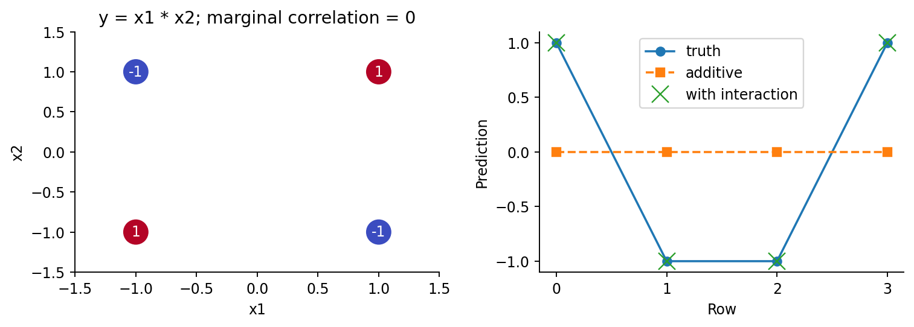
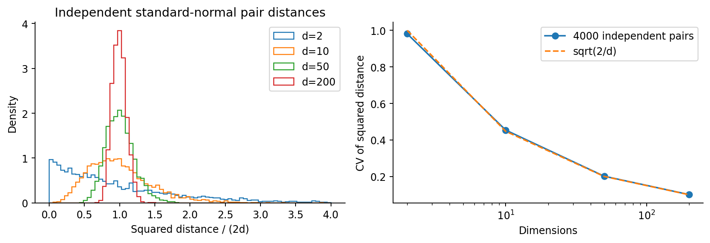
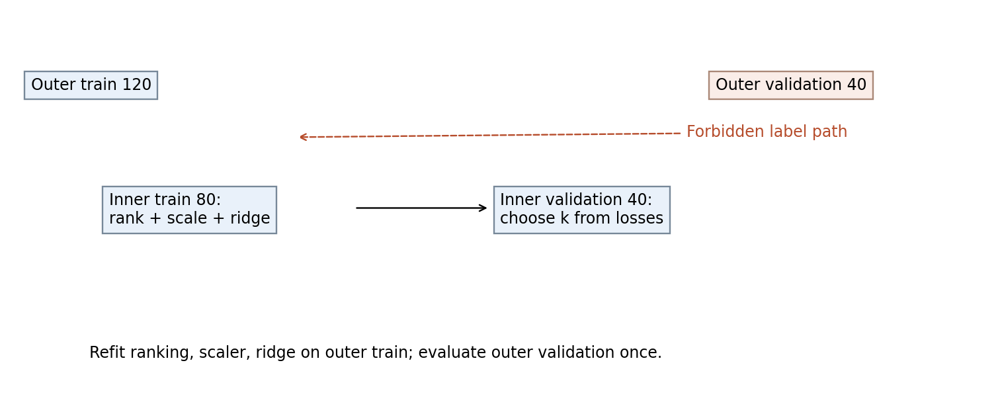
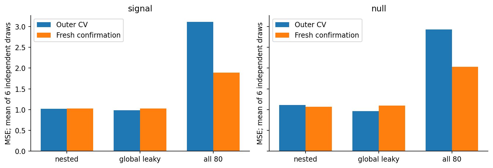
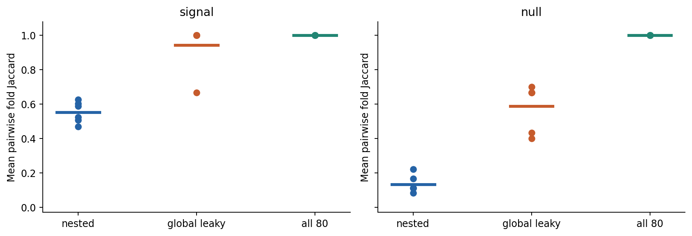
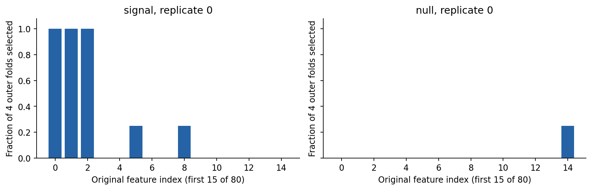

# 第054讲 特征设计与维度问题

## 1 一列数据同时改变信息与机会

本讲回答：多加特征为何有时更差，筛选又会制造什么偏差？结论是区分三个问题：新列是否包含预测时可用的信息，模型是否能利用这种表达，以及筛选流程是否在正确的数据边界内评价。列越多不自动更好，列越少也不自动更可信。

直接先修009向量内积与距离、012特征值与奇异值分解、048泛化误差与复杂度、052无泄漏流水线。涉及051嵌套验证时，本讲重新给出两层折的职责；线性模型只需理解“各列乘系数再相加”，不要求提前学习后续专门的降维章节。

实验包括四行交互例、独立高维距离模拟和两种信号机制中的嵌套筛选。我们不仅报告预测误差，也报告所选列的变化。一个重要反例是：全部80列的选择稳定性恒为1，却在本次数据上预测更差；稳定不是正确，更不是因果发现。

## 2 特征设计先问它在何时可用

特征映射把原始观察x转为模型输入φ(x)。例如将长度和宽度变为面积，或从时间戳提取星期几。固定数学映射不需要学参数，但设计的选择本身可能经过验证比较；若看过测试标签后才决定加哪一项，选择过程仍然越界。

要预测就诊时的后续结果，出院后的处置记录不可用；要预测新设备，设备ID往往不能提供可迁移关系。越复杂的特征不一定越危险，关键是信息时间线。训练时可计算不等于部署当时能得到。特征还需要单位、缺失含义和部署可计算性说明。

数学上，线性预测器可写为 $\hat y=b+\sum_{j=1}^{q}w_j\phi_j(x)$。它对系数w是线性的，但对原始x可以非线性。如果φ包含x²或x1x2，函数已经能表示弯曲与交互。不能仅凭模型名含“线性”就认为只能画一条原始坐标中的直线。

## 3 单列相关为零 仍可能决定答案

考虑四行等权数据：

|行|x1|x2|y=x1x2|
|---|---:|---:|---:|
|A|−1|−1|1|
|B|−1|1|−1|
|C|1|−1|−1|
|D|1|1|1|

x1、x2、y的均值都为0。x1与y乘积为(−1,1,−1,1)，和为0，所以样本协方差为0、相关系数为0。x2同理。但知道两列的乘积就精确知道y。按单列相关性阈值删除x1、x2，会删掉全部有用原料。

线性加性模型b+w1x1+w2x2的设计列彼此正交，且都与y正交，所以最小二乘得到b=w1=w2=0。四行预测全0，MSE=(1+1+1+1)/4=1。加一列z=x1x2后，令wz=1，其余为0，就能预测全部四行，MSE=0。

读图G1：为什么“相关为零”不能推出“条件上无用”？若四行中只观察到三行，完美训练拟合就能证明第四行吗？

例子说明表达能力与筛选准则必须相容。它不意味着应无条件生成所有交互：更多候选也带来更多估计参数、计算和偶然关系，需要合适的正则与验证。[1]

## 4 基函数扩展与维度账本

两列二次多项式的一个基为1、x1、x2、x1²、x1x2、x2²，共6列，去掉常数为5列。p列最多二次项含p个一次项、p个平方项及p(p−1)/2个两两交互，因此不含常数的列数为p+p(p+1)/2。

p=10时为10+55=65；p=80时为80+3240=3320。行数没有因列展开而增加。若只有160行，3320列的无正则拟合可能存在很多同样拟合训练数据的解；表达能力扩张同时增加估计难度，不能只看训练损失下降。

基函数不一定是多项式，也可用分段、周期的正弦余弦、物理无量纲量或事先定义的组合作为输入。每种都有归纳偏好。周期角度把0与2π视作同一点；简单整数编码可能把它们放得很远。先理解量的含义，再决定变换，而不是盲目堆列。

多项式对输入尺度敏感：1000的平方是1000000，而0.001的平方为0.000001。训练内标准化和惩罚会影响数值与实际函数偏好；若先缩放再展开，与展开再逐列缩放，一般是不同流程。应把顺序也写入Pipeline和研究协议。[3]

## 5 高维距离集中推导的条件

高维问题不等于“维度大就一定失败”。本节只分析独立各向同性正态噪声。令x、x′各为d维独立标准正态向量，每个坐标差zj=xj−x′j均值0、方差2。平方欧氏距离为 $S=\sum_{j=1}^{d}z_j^2$。

标准正态的四阶矩为3，故方差2的正态z有E[z²]=2、E[z⁴]=12，所以Var(z²)=12−2²=8。坐标独立时，均值与方差相加：

$$E[S]=2d,\qquad \operatorname{Var}(S)=8d,\qquad \frac{\operatorname{SD}(S)}{E[S]}=\sqrt{\frac2d}.$$

最后一个比值是变异系数，衡量相对均值的波动。均值本身随d增大，标准差也随平方根d增大，但相对波动下降。必须明确这是“平方距离”的变异系数，不要把公式直接当普通距离的精确公式。

读图G2：曲线变窄意味着原始距离变小吗？为什么若全部距离共享一个随机查询点，独立性的推导要重新检查？

当大量无关坐标共同贡献距离时，少数真正相关坐标的差别可能被淹没，近邻排序也可能受噪声主导。但本图并未训练近邻分类器，不是其准确率曲线。真实数据可能位于低维流形、有稀疏信号、相关结构或恰当表示；本推导的条件不自动适用。

## 6 三类筛选方法回答不同问题

Filter先用某种统计量给列评分，例如相关、方差或互信息；可以便宜地筛掉一部分列，但它未必适合下游模型或交互机制。Wrapper把列集合交给指定模型，用验证表现评价集合，例如顺序前向选择。Embedded在模型拟合中通过约束或惩罚形成选择，例如L1使部分系数为0。[1][2]

这三个名称描述选择如何与预测器结合，不决定是否泄漏。Filter若用全表标签评分，会泄漏；Wrapper若用外层测试比较子集，也会泄漏；Embedded即便只在训练内拟合，若正则强度在测试上挑，也仍泄漏。边界追踪比名称重要。

Wrapper的候选集合数可能非常大：p列任取子集有2的p次方种，包括空集。顺序前向法从空集开始逐步加入，但并不遍历所有组合，因此不保证全局最优。训练与验证成本需用053的账本，而不能把筛选算法当免费预处理。

## 7 筛选列与构造低维坐标不是一回事

特征选择保留原列的一个子集，便于对应原始测量。降维映射则构造新坐标，例如PCA取若干线性组合。p个原测量压成q个主成分后，即使q远小于p，实际部署可能仍需测量全部p列才能算这q个组合，因此计算维度减少不必然减少采集成本。

回忆012：将训练中心化矩阵写为 $X_c=U\Sigma V^\top$，取V的前q列构成Vq，新坐标为 $Z=X_cV_q$。PCA优先保留训练X中方差大的方向，不直接使用y。一个方差很小却与y高度相关的方向可能被丢弃。不能把“保留95%方差”说成“保留95%预测信息”。

PCA仍从训练X学习均值与方向；验证使用同一均值和Vq，不能在验证重算方向。若q由预测表现选择，也要在内层完成。本讲只用代数说明区别，不运行PCA，避免把未执行的方法列进实测结果。

## 8 同一160行有两层边界

主要实验每份360行、80列；前160为开发、后200为独立确认集。开发四折外层：120训练、40验证。对于需要选k的路线，每个外层训练120行再做三折内层：80训练、40验证。

在一个内层训练中，先用该80行X与y计算绝对Pearson相关排名，取前k列，再用这80行拟合StandardScaler和Ridge；在内层验证40行上计算MSE。比较k∈{2,5,15,40}的三折均值，最小者胜出，平局选较小k。

读图G3：虚线为何越界？内层验证已经选了k，为什么还要重新拟合120行？

随后用120行外层训练重新计算排名、缩放和Ridge，再评价40行外层验证。四折平均评估的是“内部选择k并重新筛选”的完整流程。只将Ridge放进交叉验证、提前固定全160行的排名，并没有评价一个无泄漏流程。

## 9 Pearson排名怎样从原始行得到

对某一列x和标签y，先分别减训练均值，得到a和b。相关为内积除以两个长度的乘积：

$$r(x,y)=\frac{\sum_i(x_i-\bar x)(y_i-\bar y)}{\sqrt{\sum_i(x_i-\bar x)^2}\sqrt{\sum_i(y_i-\bar y)^2}}.$$

例如x=(0,1,2)、y=(0,1,2)，均值都是1，中心化均为(−1,0,1)，分子2、分母√2×√2=2，相关1。若y=(2,1,0)，相关−1；绝对相关将这两种关系同等评分，因为回归系数可取正或负。

常数列长度为0，相关未定义。本实现明确将其分数设0，稳定按原列编号打破平局。这个规则避免除零，但不意味着常数列获得了统计上的相关0证据。若y也是常数，所有列同样按这个回退排序；通常应先检查任务是否有可学变化。

相关排名只度量边际线性关系，既可能漏掉第三节交互，也可能把代理变量与原因混淆。相关列彼此可替代时，轻微采样变化足以交换它们的顺序，不能据一次入选便宣称它是唯一机制。

## 10 数据机制和三个比较对象

signal机制：X有80列，先独立抽标准正态，再令x2=x0+0.08η，其中η独立标准正态。因此x2是x0的近似替代测量。标签y=2x0+1.5x1+ε。null机制：同样X结构，但y=ε，与全部X独立。两机制各6份独立数据，ε标准差均为1。

nested路线按第8节无泄漏选择。global_leaky路线故意在全部160行X和y上先排好列，外层和内层都复用这份排名，再选择k；这读取了外层验证标签。all_features路线不筛选、不选k，固定保留80列，但缩放和Ridge仍仅在相应训练内拟合。Ridge的alpha=1预先固定，未另外调它。

三者并不是计算预算相同的搜索比较，问题在于特征流程和评价边界。all_features既不选择子集也没有内层调k；不能将其成本与其他路线等同。这里没有暗称控制了053中的所有公平比较维度。

最终在全部160行上重新训练时，使用这160行标签计算最终排名是合法的。nested用内部重筛选的CV选择最终k；global_leaky在其内部CV复用160行排名，选择k的分数依然偏乐观，但从未读取200行确认集标签。确认误差因此能显示乐观内部评价是否转化为真正外推改善。

## 11 独立确认保留了什么反例

读图G4：蓝橙两柱的训练样本数一样吗？可以把差值全部称作泄漏量吗？

|机制与路线|外层MSE均值|独立确认MSE均值|
|---|---:|---:|
|signal nested|1.021937|1.025244|
|signal global_leaky|0.987023|1.025244|
|signal all_features|3.111984|1.894060|
|null nested|1.110172|1.070827|
|null global_leaky|0.962204|1.094461|
|null all_features|2.930717|2.031184|

signal的两种筛选最终结果完全相同：各份最终选择恰好一致，因此确认预测与误差相同。但有泄漏的外层评价仍更乐观。协议越界不保证最终模型不同；相同最终预测也不能为越界过程辩护。

null中任何真实预测信号都不存在。全局排名能抓到开发样本的偶然相关，使CV看起来更好；独立确认均值却没有更好。自然噪声总体方差1是理论参照，不是对每个有限测试集的精确数值要求。

all_features在本次固定alpha=1下更差，不证明高维数据永远不可用，也不证明对它认真调正则后仍如此。结论范围是本包固定模型与机制。正文保留这一限制，避免把参数选择不利造成的差异包装成维度的普遍定律。

## 12 稳定性怎么计算 又如何误读

对两个选择集合A、B，Jaccard相似度为 $J(A,B)=|A\cap B|/|A\cup B|$。例如A={0,1,4}、B={0,2,4}，交集{0,4}大小2，并集{0,1,2,4}大小4，所以J=1/2。本实现空集对空集定义1，但主实验k始终大于0。

每份有四个外层选择集合，形成4×3/2=6对，取J平均。训练集有重叠，因此这6对也不是6次独立实验；本讲用它描述该划分下的列稳定程度，不提供伪精确显著性检验。

读图G5：为什么null下全局泄漏也显得稳定？如果始终保留全部列，就能解决研究可重复性吗？

Jaccard受子集大小与特征总数影响，没有机会校正。不同k的比较尤其不能当成唯一排名依据。文献有考虑机会水平、抽样不确定性的更严格方法；本讲不声称实现Nogueira等提出的稳定性估计量。[4]

## 13 选择频率不是因果概率

读图G6：柱高0.75能解读为“这个变量有75%概率是真原因”吗？若只展示入选最频繁的列，为什么还应说明全部候选数量？

频率定义为四个训练划分中有几次选中，反映特定算法、样本和划分的行为。它不等于后验因果概率，不是独立复制研究的成功率。相关代理列、测量误差、群体变化都可能改变这一频率。研究报告应保留完整列名、预处理、排名和每折选择集合。

## 14 实现 验证和练习

experiment.py逐层显式保存训练/验证行号、每个k的内层分数、所选列、标准化状态、系数、预测与最终确认误差。audit.py用逐列内积独立复算Pearson排名，并用岭回归正规方程的独立线性求解器核对预测，不只重复同一库fit调用。常数列、形状错与NaN做通常失败检查。

Notebook从固定数据实际重新运行、审计和画图，不拼贴旧输出。数值实验无需网络、GPU或账号。PDF和Notebook的视觉检查覆盖实际输出，检查范围不含网页Jupyter界面或远程内核通信。

E1 定义预测时可用特征。E2 逐行证明交互表相关为0。E3 算10列与80列的二次项数量。E4 推导平方距离变异系数。E5 区分filter、wrapper、embedded。E6 为什么PCA不等于原列选择？E7 写出嵌套筛选每一步可用数据。E8 手算Pearson与常数列回退。E9 计算集合Jaccard。E10 解释两筛选最终相同的反例。E11 为什么稳定性不等于机制证据？E12 给出本实验允许和不允许的结论。完整解答及G1至G6、L1至L8见answers.pdf。

## 15 原始来源

[1] Guyon与Elisseeff，2003，[An Introduction to Variable and Feature Selection](https://www.jmlr.org/papers/v3/guyon03a.html)。筛选类型和问题背景。

[2] Ambroise与McLachlan，2002，[Selection bias in gene extraction on the basis of microarray gene-expression data](https://www.pnas.org/doi/10.1073/pnas.102102699)。在正确重采样边界内重新选择变量的研究动机。本包不是该论文实验的复制。

[3] scikit-learn 1.8，[PolynomialFeatures](https://scikit-learn.org/1.8/modules/generated/sklearn.preprocessing.PolynomialFeatures.html)与[特征选择概念说明](https://scikit-learn.org/stable/modules/feature_selection.html)。用于接口和术语参照；本包相关排序用显式代码实现。

[4] Nogueira、Sechidis与Brown，2018，[On the Stability of Feature Selection Algorithms](https://jmlr.org/papers/v18/17-514.html)。稳定性度量与机会校正问题。本文使用基础Jaccard，未实现论文完整推断方法。
