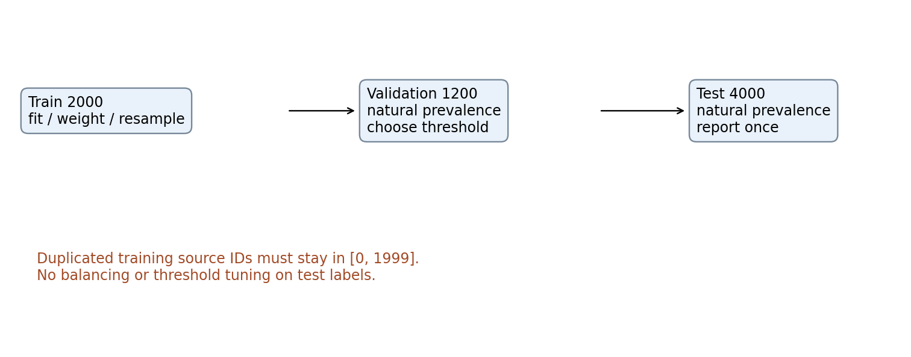
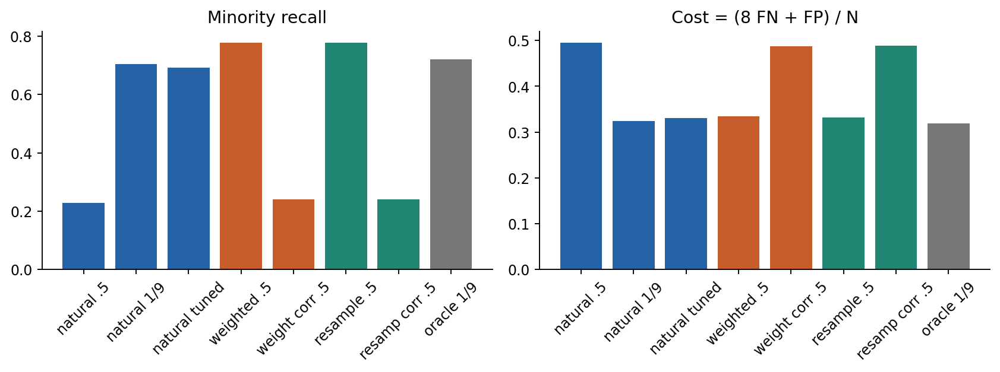
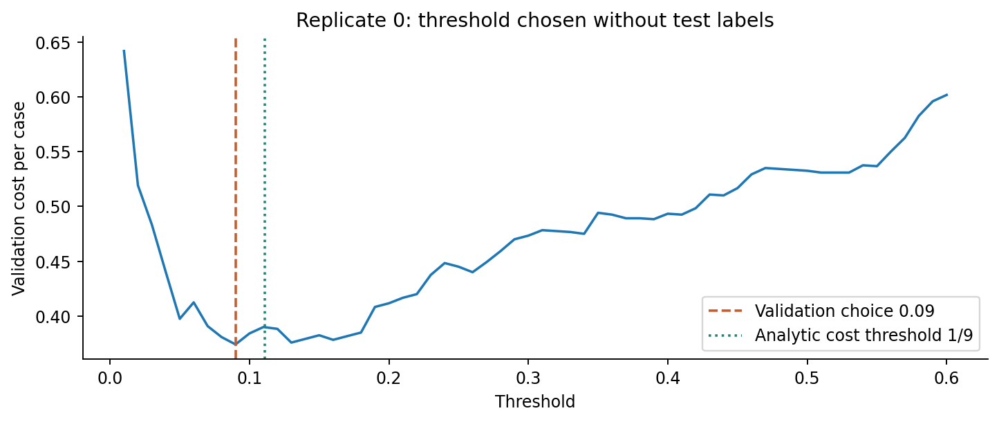
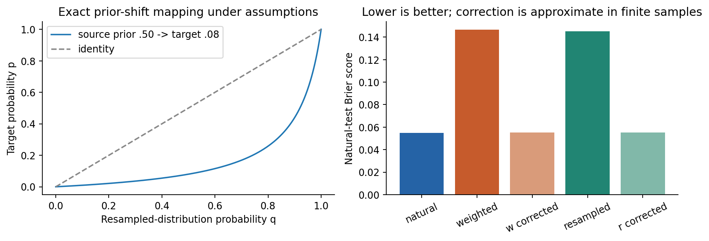
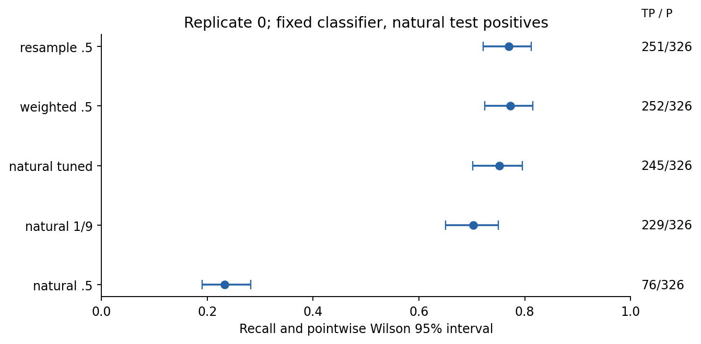
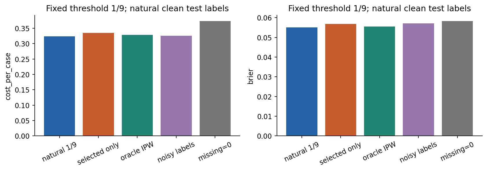
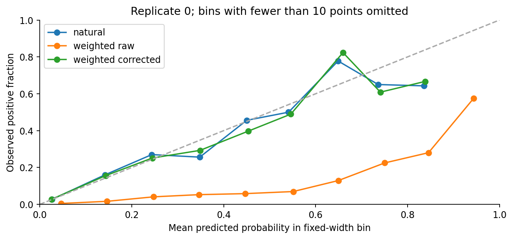

# 第055讲 不平衡与有偏标签

## 1 稀有类别不是一个统一故障

本讲回答：稀有类别和选择性标注怎样改变学习目标？首先区分总体中某类本来稀少、训练抽样改变了类别比例、标签被错误记录，以及部分对象根本没得到标签。它们可能同时存在，但修复办法和可识别条件不同。把少数类复制几次不会自动纠正选择性标注。

直接先修002任务与数据生成、018条件概率、045概率到决策、046分类评价、050数据划分、052流水线。这里重新推导代价阈值、加权后的概率含义和先验修正；实验全部为合成二分类，不构成真实高影响场景的部署建议。

你将比较权重、阈值和训练后过采样，同时始终保持测试分布自然。一个主要结论是：提高召回率、改善概率预测和降低误判成本是不同目标。另一个负结果是：验证集调出的阈值在本次测试上没有胜过理论1/9阈值。我们保留它，不更换种子寻找漂亮故事。

## 2 从混淆计数到真正要优化的量

令正类Y=1为少数类，概率π=P(Y=1)。TP是真正类被判正，FN是真正类被判负，FP是真负类被判正，TN是真负类被判负。召回率TP/(TP+FN)只看真正类；精确率TP/(TP+FP)看被判正对象；准确率(TP+TN)/N看所有对象。

若π=0.08，全部预测负类的总体准确率就有0.92，但召回率0。这并不自动说明准确率计算错，只说明它未必反映你关心的失败。不能因为类别稀少就宣布每一种指标都应最大化；应根据任务定义错误的后果和预测用途。[1]

ROC AUC比较正负样本的分数排序，AP即平均精确率，综合沿排序逐步提高召回时的精确率。它们不由单个分类阈值定义；AP尤其受目标类别比例影响。完整数值仍随每份结果保存，不以它们替代成本。

本讲预设漏判代价C_FN=8、误报代价C_FP=1，正确分类代价0。每例平均成本为(8FN+FP)/N。这是教学效用单位，不是货币或真实风险评估；比例在看数据前固定。不同代价下最优决策可能不同，不能在测试后选择最有利的一组成本来为方法辩护。

对于已正确校准的目标总体概率p=P(Y=1|x)，判正的条件期望成本为C_FP(1−p)，判负为C_FN p。判正较优要求：

$$C_{\rm FP}(1-p)\le C_{\rm FN}p\quad\Longleftrightarrow\quad p\ge\frac{C_{\rm FP}}{C_{\rm FP}+C_{\rm FN}}=\frac19.$$

比如p=0.2，判正成本0.8，判负1.6，选正；p=0.05，判正0.95，判负0.4，选负。0.5只对应对称误判代价等附加条件，不是所有二分类都天然正确的阈值。

## 3 数据生成和自然测试分布

六份独立数据用固定种子5500至5505，每份7200行，标签独立以0.08概率为1。给定Y，四列输入协方差均为单位矩阵。负类均值(0,0,0,0)，正类均值(1.4,0.8,0,0)，后两列为无用噪声。

前2000行训练，中间1200行验证，末4000行测试。每份测试正类数由自然Bernoulli抽样决定，不强制凑成320，更不平衡测试集。权重与复制仅作用于训练行；验证保留自然比例以选择成本阈值，测试最终评价所有预先声明路线。

读图G1：先复制少数类再随机划分，会怎样让同一原始样本同时进入训练和测试？为什么先划分后只复制训练能避免这条具体路径？

两个类条件正态密度的对数比为1.4x0+0.8x1−(1.4²+0.8²)/2，因此真实后验为：

$$p_*(x)=\sigma\!\left(\log\frac{0.08}{0.92}+1.4x_0+0.8x_1-1.3\right),\qquad \sigma(z)=\frac1{1+e^{-z}}.$$

oracle_cost使用这个生成器已知真概率及阈值1/9，是理论参照；现实中不可凭空知道。它的有限样本成本也有随机波动，不保证每一份数据都小于每个估计器。其他路线从训练样本拟合LogisticRegression，C=1、lbfgs、最多1000步，收敛警告会显式转为错误。[5]

## 4 先看完整结果 再拆解原因

natural_05、natural_cost、natural_tuned共用同一个自然训练模型，只分别用0.5、1/9和验证选择阈值。weighted_05使用类别平衡权重后的原始概率和0.5。两条corrected路线先做先验修正再用0.5。oversampled_05复制训练正例到与负例数量相同，拟合后直接用0.5。oracle不需要训练。

|路线|少数类召回均值|每例成本均值|Brier均值|
|---|---:|---:|---:|
|自然训练 阈值0.5|0.227909|0.495458|0.055035|
|自然训练 阈值1/9|0.703931|0.324083|0.055035|
|自然训练 验证阈值|0.690741|0.330958|0.055035|
|平衡权重 原始0.5|0.777470|0.335000|0.146593|
|平衡权重 修正后0.5|0.241408|0.487917|0.055130|
|训练过采样 原始0.5|0.777028|0.332167|0.145295|
|训练过采样 修正后0.5|0.240573|0.489042|0.055215|
|已知真概率 阈值1/9|0.720149|0.319458|0.054971|

读图G2：为什么weighted原始召回很高却Brier很差？为何corrected的Brier改善同时0.5阈值成本变高？

Brier是平均(p−y)²，评价概率与真实标签的平方差，越低越好。对同一概率只改阈值，不会改变Brier、ROC AUC或AP，因此natural前三条这些数完全一样。高召回不自动等于好概率，也不自动等于最低成本。

## 5 阈值选择也必须有验证边界

理论阈值1/9要求概率对应目标总体且代价正确。实际模型可能校准不佳，因此可在独立验证上选择阈值。我们预先固定60个候选0.01、0.02至0.60，计算每个(8FN+FP)/1200，取最小，平局取更小阈值。

读图G3：验证曲线最低点为什么不保证测试成本最低？如果你又根据测试曲线微调0.01，这一测试还封存吗？

本次natural_tuned平均成本0.330958，反而高于预定1/9的0.324083。有限验证样本产生选择噪声，候选网格也离散，结果完全可能如此。这不是要删掉的运行失败。真正的失败是错读测试、遗漏候选或把未收敛结果当有效值。

## 6 类别权重改变的是什么概率

二分类加权交叉熵在某个x处的总体期望为−w1 p log q−w0(1−p)log(1−q)。对q求导并令0：−w1p/q+w0(1−p)/(1−q)=0，得到：

$$q=\frac{w_1p}{w_1p+w_0(1-p)},\qquad \frac{q}{1-q}=\frac{w_1}{w_0}\frac{p}{1-p}.$$

这是无限表达能力且正确优化总体损失时的点态最优解；有限参数模型、正则和有限样本可能偏离。它说明加权后的输出q通常不再直接代表原总体p。若w1=9、w0=1、p=0.1，则q=0.9/(0.9+0.9)=0.5，不能把它解释为原总体风险50%。

本实验令每类总权重相同：w1=n/(2n1)、w0=n/(2n0)，因此平均权重1、比值n0/n1。它来自训练类别计数，不看验证测试。总体π约0.08时比值约11.5，原始q用0.5大致对应原概率阈值0.08；这和成本8比1所需1/9并不完全相同。

类别平衡权重是一个训练启发式，并不是由误判成本自动推导出的唯一正确设置。若代价权重恰设w1/w0=C_FN/C_FP，在理想条件下对q用0.5可对应相同Bayes决策；若同时再把原总体成本阈值套到加权q上，可能重复计入成本。

## 7 重采样和先验修正

随机过采样复制已有正例，不创造新的独立信息。我们保留全部训练负例，再从训练正例有放回抽n0个，使采样训练两类各n0行。每个抽样行保留原始source_id，因此可以检查重复是否只在训练边界内。验证和测试不复制、不平衡。

在理想的按类别抽样下，P(X|Y)不变而先验从πt变为πs。若q是采样分布的准确后验，则Bayes公式给出目标赔率：

$$\frac{p}{1-p}=\frac{q}{1-q}\frac{\pi_t/(1-\pi_t)}{\pi_s/(1-\pi_s)},\qquad p=\frac{a q}{1-q+a q},\quad a=\frac{\pi_t/(1-\pi_t)}{\pi_s/(1-\pi_s)}.$$

例如πs=0.5、πt=0.1、q=0.5，a=1/9，p=0.1。函数prior_correct用最后的有理式，避免q=0或1时计算log(0)；这两个端点仍映射到0、1。先验必须严格在0与1之间，错误输入会报异常。

读图G4：若正类不仅比例变了，输入分布也变了，单个赔率乘数还能保证正确吗？为什么实际修正不能读取测试正类比例？

本实验源先验为平衡后的0.5，目标先验使用原训练比例n1/n。对加权路线，这等价于按训练权重比反向变换。训练比例只是目标总体π的估计，不要求每份恰好0.08。随机复制还改变了有限样本条件分布和总权重，固定C下正则相对强度也会不同，所以weighted和oversampled不应被说成逐位等价。

先验修正适用于类条件不变的prior/label shift假设，并且需要有意义的源概率与可信目标先验。[2] 它不是任意covariate shift、概念变化或标签错误的万能修复。概率修正后，若目标是8比1成本，仍应对目标概率用1/9或合法验证阈值；本包corrected_05特意保持0.5，展示“好概率”和“成本适配决策”之间的区别。

## 8 少数类区间要用少数类分母

召回率的分母是测试真正类数P=TP+FN，不是全部N。即便测试4000行，少数类约320行，召回估计的有效二项分母也是约320。不能用4000计算区间后声称召回非常精确。

对固定训练结果和固定阈值，假设测试正例独立同分布，令r=TP/P、z=1.959964，Wilson95%区间为中心c加减半宽h：[6]

$$c=\frac{r+z^2/(2P)}{1+z^2/P},\qquad h=\frac{z\sqrt{r(1-r)/P+z^2/(4P^2)}}{1+z^2/P}.$$

例如20个正例找出16个，r=0.8，区间约[0.583983,0.919342]。它不是“真召回有95%概率位于这一个固定区间”的频率学派陈述，而是重复抽样下构造程序的近似覆盖含义。Wilson比简单r±1.96标准误在小计数和近边界时通常更稳，但不是精确覆盖保证。

读图G5：两条区间重叠能直接证明两方法完全没有差异吗？如果测试正例属于重复设备，应怎样调整独立性假设？

没有正例时，召回率和对应区间应报告无法估计，而不是随意写0或1。本实现返回None；这种测试集无法回答少数类召回问题，需改善评价设计。多方法配对比较应利用同一测试对象结构，不能只比较各自区间是否重叠。

## 9 有标签样本不一定代表总体

令S=1表示标签被观察。训练实际看到的往往是P(X,Y|S=1)，而目标是P(X,Y)。如果是否标注依赖真实Y或未观察因素，条件标签分布可能改变。未被标注不是负类；把空标签填0会把“未知”改写为“已知没有”。[3]

本模拟训练行的观察概率由X与Y共同决定：负类0.6；正类若x0<1则0.15，否则0.8。较难识别的正例更少被观察，因此仅用有标签子集可能产生偏差。我们另外保留生成器知道的真实标签，以便教学评价；现实中通常没有这份免费真相。

如果真实选择概率s(X,Y)已知且处处大于0，可对观察到的行加权1/s。因为给定X,Y时E[S/s(X,Y)]=1，所以E[S L/s]=E[L]，恢复目标损失期望。这里s最小0.15，不出现无限权重；较小s仍会增加估计方差。

oracle_ipw使用模拟器已知的s，不能理解为从真实未标注数据中自动识别了选择机制。尤其选择概率依赖缺失Y时，仅靠有标签样本和无标签X通常不足以识别它；需要额外采集、随机标注、领域假设或敏感性分析。若某区域s=0，纯逆概率加权无法凭空恢复从未观察的标签。

读图G6：为什么IPW改善不证明任何现实标注偏差都已解决？为什么把未标注填负类，即便准确率看起来不错，仍改变了学习目标？

## 10 标签翻转与概率失真

另一个独立对照保留全部训练行，但将真阳性以α=0.25概率写成负类、真阴性以β=0.02概率写成正类。假设翻转给定真实类别后与X独立，则观测正标签概率为：

$$q_{\rm noisy}(x)=(1-\alpha)p(x)+\beta(1-p(x))=\beta+(1-\alpha-\beta)p(x).$$

当p=0.1，观测q=0.02+0.73×0.1=0.093。只有α、β可信已知且1−α−β不为0，并正确估计q时，才可考虑反解；实际模型误差可能使反解越过[0,1]。不能从两个数字公式推出任意噪声标签都已自动修复。[4]

本次noisy_labels的平均Brier0.057163，高于自然模型0.055035；但其阈值1/9召回0.716106，高于自然同阈值0.703931。噪声可能改变决策边界与有限样本拟合，单项召回提高不证明标签更可靠，也不能据此声称噪声必有益。

读图G7：weighted曲线偏离对角线的方向说明原始q在自然测试上怎样失真？为什么只靠这张分箱图不能证明所有x条件下都已校准？

## 11 完整标签对照结果与边界

|训练标签制度|1/9阈值召回|每例成本|Brier|
|---|---:|---:|---:|
|完整自然标签|0.703931|0.324083|0.055035|
|只用被标注行|0.625186|0.335375|0.056769|
|已知机制逆概率权重|0.678945|0.328083|0.055460|
|类别条件翻转标签|0.716106|0.325625|0.057163|
|未标注一律填负类|0.496490|0.373792|0.058343|

所有数字是六份独立数据的均值，逐份计数、预测、区间和代价在结果JSON中。没有把六份数据混成一个假装固定模型的巨大二项区间，也没有对成本排序宣称显著性。预测概率、阈值、标签制度改变的是不同问题，不能只凭一列召回排序。

类别权重、重采样、噪声修正与标注逆概率权重有不同的推导目标。将它们都叫“平衡数据”会掩盖假设。只要在研究里明确目标总体、观察机制、标签含义与成本，再决定哪一项适用，就比盲目套一个balanced选项更可靠。

## 12 实现与练习

experiment.py保存训练计数、60个阈值的验证成本、过采样原始行号、模型系数、逐行测试概率、全部混淆计数和Wilson区间。audit.py独立重算72组主/标签对照指标，重建系数到概率的前向过程，核对只用验证选阈值、只在训练复制、先验修正及观察行来源。未收敛会抛异常，而非默默继续。

E1 区分稀有类、抽样偏差、缺失标签、错误标签。E2 推导8比1阈值。E3 手算加权p=0.1变q=0.5。E4 推导赔率修正并列假设。E5 为什么先复制后划分会泄漏？E6 为什么改阈值不改Brier与AUC？E7 手算Wilson16/20。E8 区分单模型区间与算法不确定性。E9 推导IPW期望。E10 手算噪声标签概率。E11 解释验证阈值不胜理论阈值。E12 写出修正概率后仍需选决策阈值的原因。完整E、G与L题答案见answers.pdf。

## 13 原始来源

[1] Elkan，2001，[The Foundations of Cost-Sensitive Learning](https://cseweb.ucsd.edu/~elkan/rescale.pdf)。代价敏感决策的理论背景。

[2] Saerens、Latinne与Decaestecker，2002，[Adjusting the Outputs of a Classifier to New a Priori Probabilities](https://pubmed.ncbi.nlm.nih.gov/11747533/)。类条件不变下的先验调整背景；本包使用已给定/训练估计先验的闭式赔率变换，未实现论文的迭代先验估计。

[3] Lakkaraju等，2017，[The Selective Labels Problem](https://pmc.ncbi.nlm.nih.gov/articles/PMC5958915/)。选择性标签与不可观测信息；本模拟不是论文数据复现。

[4] Natarajan等，2013，[Learning with Noisy Labels](https://papers.nips.cc/paper_files/paper/2013/hash/3871bd64012152bfb53fdf04b401193f-Abstract.html)。类别条件标签噪声背景；未运行其完整修正算法。

[5] scikit-learn 1.8，[LogisticRegression](https://scikit-learn.org/1.8/modules/generated/sklearn.linear_model.LogisticRegression.html)。权重、正则和优化接口。

[6] NIST统计手册，[比例置信区间](https://www.itl.nist.gov/div898/handbook/prc/section2/prc241.htm)。Wilson区间形式与使用背景。
