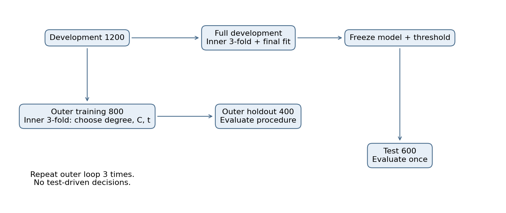
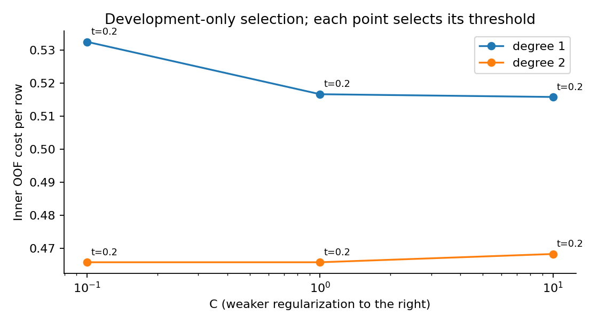
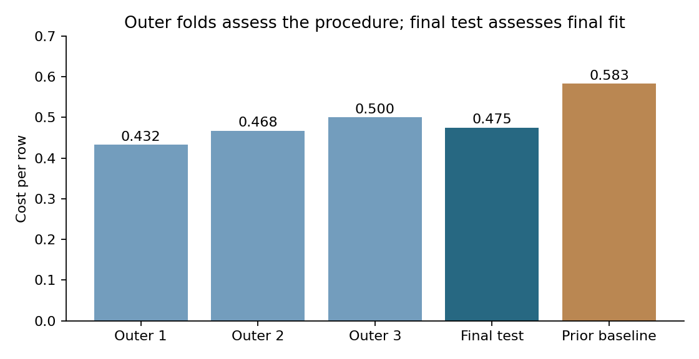
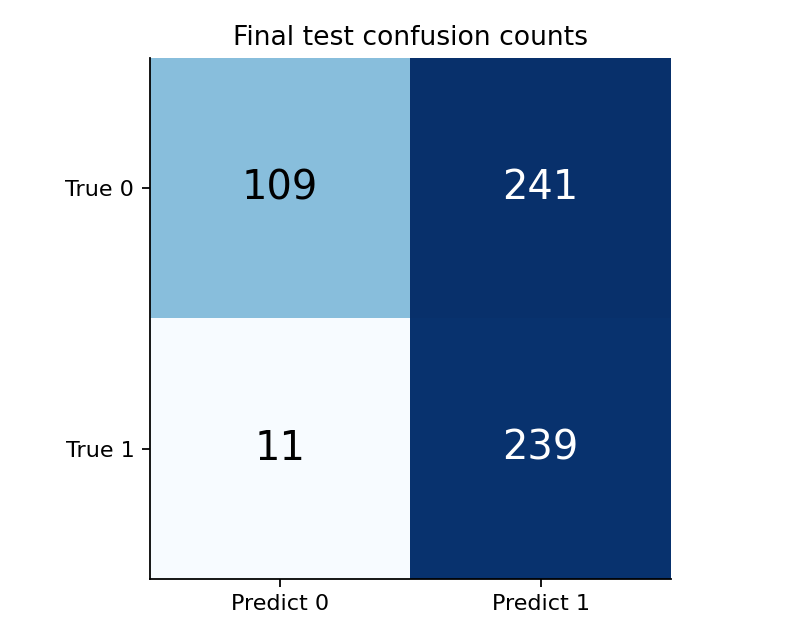
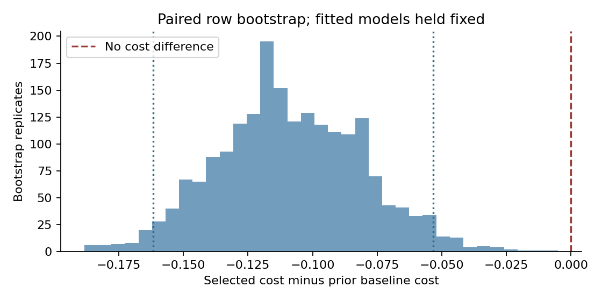
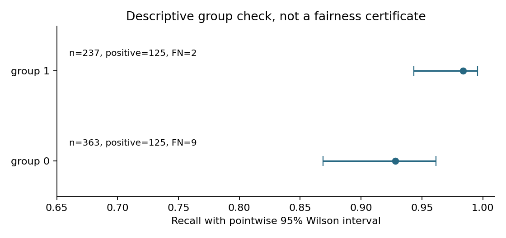

# 第056讲 可信分类阶段项目

## 1 要交付的不是一个最高分

本讲回答：怎样让一个分类结论经得住重新运行与质疑？我们把前面学过的划分、流水线、模型选择、概率评价、决策阈值和不确定性装进同一个可审查项目。目标是让别人能够从数据与固定规则出发，得到同一组预测，并指出结论在哪些条件下可能失效。

直接先修007、025至026、042至043、045至048、050至053、055。本讲仍重新解释关键接口：训练集决定模型参数，验证数据决定超参数和阈值，外层留出评价整个选择过程，最终测试评价冻结后的模型。读者不必把这些词的边界全凭记忆补齐。

项目研究对象是合成二分类总体，没有真实个人数据。每次漏判损失4个教学单位，每次误报损失1个单位，正确判断损失0。确认性问题预先固定为：所选流水线相对于仅使用开发集正类比例的基线，是否降低这一总体下的平均误判成本？准确率、AUC和分组召回是补充描述，不在测试后改成新的胜负标准。

本次最终平均成本0.475，基线0.583333，差为−0.108333；固定已拟合模型的配对bootstrap区间约为[−0.161667, −0.053333]。这个结论只涉及指定合成总体、指定成本和本次冻结模型。它不证明任何现实场景已经可部署，也不证明选择过程在所有重新采样训练集上都优于基线。

## 2 先把研究对象说清楚

数据共1800行。前1200行是开发集，末600行是测试集，顺序在独立抽样后固定。group以0.4概率取1，只用于预先指定的错误分析，不作为模型输入。三个输入中，x0均值随group增加0.7，x1是标准正态，x2是标准正态的40倍，且约8%随机缺失。真实条件概率由下式生成：

$$p_*(x,g)=\sigma(-1+1.2x_0-0.8x_1+1.2x_0x_1+0.3g),\qquad \sigma(z)=\frac{1}{1+e^{-z}}.$$

标签在给定特征后服从Bernoulli(p*)：抽一个0至1的均匀随机数，小于p*记1，否则记0。于是相同特征也可能有不同标签，模型不应被要求把所有标签记住。x2是无用但量纲很大的列；缺失机制在本例独立于标签，不代表现实缺失一定如此。

数据生成器知道group和真概率，学习者只看三个x列。因此即使二次特征能表达x0x1，也不应把估计器称为“已知正确的完整真模型”。这一区别影响对无法消除误差的理解。

目标总体是同一个生成机制产生的新独立行。group是子群标记，不是同一患者或同一设备的重复测量编号，所以本例可以用按行分层交叉验证。真实项目若多行来自同一实体，须把实体完整放在同一折；若预测未来，须用与时间方向相容的分割。选择分割方式是研究设计的一部分。

## 3 先算一笔决策账

概率p回答“Y=1的可能性”，阈值t决定“做哪一个判断”。记TP、FN、FP、TN分别为真正、漏判、误报、真负数量。我们的主指标为：

$$\widehat R(t)=\frac{4\,FN(t)+FP(t)}{N}.$$

五个样本的标签为(1,1,0,0,1)，概率为(0.1,0.2,0.3,0.0,0.9)。约定p≥t判1。当t=0.2时预测(0,1,1,0,1)，FN=1、FP=1，总成本5，平均成本1。等于阈值的第二行判为1；代码与手算必须使用同一个边界约定。

若p恰好是真实目标概率，则判1的期望成本是1−p，判0的期望成本是4p。比较两者得到1−p≤4p，即p≥0.2。这里的0.2源自成本，而不是“类别比例较低所以随便调低阈值”。实际模型概率可能有偏差，因此本项目允许从预先固定的0.1至0.5网格中选择阈值。[2]

仅使用先验的基线把开发集正类比例赋给每一行，再用0.2决策。基线既便宜又能暴露一种常见情况：当漏判很贵时，全部判1未必有很高成本。模型必须相对于这个清楚的参照取得改进，不能仅把自身0.5阈值当作唯一对手。

## 4 流水线里有哪些可学习的东西

每次拟合按顺序做四件事：从当前训练行估计x2中位数并填补；从这些填补后的训练行估计每列均值与标准差并标准化；生成一阶或二阶多项式列；拟合逻辑回归。二阶展开包括平方项与两两乘积，没有常数列，因为逻辑回归另有截距。

例如一列训练值为(1,3,缺失)，中位数是2，填补后均值2，标准差使用总体分母3，等于sqrt(2/3)。验证值5必须沿用这三个训练统计量，得到标准化值约3.674；不能把验证值放进均值后重新标准化。即使没有使用验证标签，那也改变了拟合所看到的分布。[3]

C是逻辑回归正则强度的倒数：较小C表示较强惩罚。本课不比较不同算法的全部可能版本，仅比较degree∈{1,2}与C∈{0.1,1,10}的6个固定候选。每个候选共享5个阈值，不为表现不佳的一方临时扩大搜索空间。

代码使用Pipeline把填补、缩放和模型绑定。每一个内层训练折都重新fit整个流水线。状态记录保存中位数、均值、尺度、幂次、系数与截距；审计脚本能独立前向算出每个折外概率，不依赖pickle或预先保存的指标。

## 5 两层验证各自回答什么

外层把1200行分为三份，每次留400行作为外层验证，另外800行进入内层三折。内层对每个候选收集每行恰好一次的折外概率，即OOF概率；该行的模型从未在该行上fit。把800个OOF概率合起来，计算五个阈值的成本，选择成本最低的组合。

平局规则同样属于协议：依次比较成本、degree、C、threshold，小者优先。选中以后用这800行重新fit所选流水线，使用已选阈值预测外层400行。三轮拼接出1200行外层OOF结果。内层最佳分数服务于选择，外层分数服务于评价整个学习程序；二者角色不同。[1]

一个容易漏掉的点是：内层阈值是在内层OOF概率上选的，但最终要应用于更大训练集重拟合后的模型。两个模型的概率尺度可能有差异，选择规则因此不是无误差的。外层过程把这一步也重复进去，能够评价这套重拟合做法的实际效果。

外层三个训练范围重叠，三个分数不是三个独立实验。不能把三折分数的标准差除以sqrt(3)就宣布得到了可靠总体置信区间。我们的外层结果用于过程诊断，最终bootstrap则明确限定为固定最终模型的测试抽样不确定性。

## 6 一次最终选择与测试

外层评价结束后，使用全部1200行开发数据做一次相同的内层选择。选中degree=2、C=0.1、t=0.2，内层选择成本0.465833。然后用全部开发集fit这个候选。此时模型、阈值、基线、主指标和分组方式都已经固定。

experiment.py先把开发阶段的全部状态序列化并计算SHA-256，再读取test.csv。摘要的作用是标识这一版开发决策，不是加密屏障或外部时间戳；熟悉代码的人仍能打开测试文件。诚实的边界来自程序顺序、审计和分析纪律，不能用“有哈希”代替预注册。

总拟合预算为3×(6×3+1)+(6×3+1)=76。阈值网格不重新训练模型，因此120次候选阈值评分不等于120次拟合。所有72个内层模型及4个重拟合状态都保存；本次没有失败拟合。运行失败应显式报错，不能删掉失败候选后继续称预算一致。

重新运行同一份固定代码来核验再现性，会再次计算同一个测试统计量；这不产生第二份独立证据。若看到测试后改变候选、阈值、数据生成器或主指标，就变成探索性后续分析。下一次确认性检验需要新的留出数据。

## 7 同一个结果可以同时好与不好

最终TP=239、FN=11、FP=241、TN=109。手算成本(4×11+241)/600=0.475；召回239/250=0.956；准确率348/600=0.58；精确率239/480≈0.497917。高召回并不意味着误报少，也不意味着预测为正时大概率正确。

基线在本次测试全部判1，成本350/600≈0.583333。新模型降低主指标，但仍误报了多数负类。若应用需要限制人工复核量或误报率，原来这个成本目标就不够，必须在新协议中明确限制，不能在已看测试后隐含改变任务。

Brier为平均(p−y)²，最终约0.179352；AUC约0.792251；AP约0.753150。它们分别提供概率误差或排序角度的描述。不能把三者中最好看的一项当成最初确认性问题的替代品。仅改变阈值不会改变Brier或AUC。

## 8 区间覆盖什么不确定性

对每个测试行先计算差值d_i=新模型损失−基线损失，再以相同行号有放回抽样。每一份bootstrap同时保留两种方法在同一对象上的比较，不能分别抽两个互不对应的样本表。

$$\widehat\Delta=\frac{1}{N}\sum_{i=1}^{N}d_i,\qquad \Delta_b^*=\frac{1}{N}\sum_{j=1}^{N}d_{I_{bj}}.$$

重复2000次，取2.5%和97.5%分位点，得到百分位区间。这里测试行按设计独立同分布，固定两套已拟合预测；若多行属于同一实体，就应考虑按实体重抽。区间不包含训练数据重抽、超参数重新选择、现实分布变化以及人为反复试验的不确定性。[4]

端点均小于0，满足本教学协议的条件性成功判据。区间不是“真值有95%概率落在这次区间里”的频率学派表述，也不是部署批准。它为一个明确问题提供有限证据，而不是替研究问题补上遗漏假设。

## 9 分组错误分析不等于公平认证

group在分析前就固定，因此不会从许多切片中挑一块最好看的子群。每组记录TP、FN、FP、TN、成本与召回。Wilson区间围绕成功次数TP及试验次数TP+FN计算；正类数较小的组通常区间更宽。

即使两组区间重叠，也不能推出召回完全相同；不重叠也不是完整的公平结论。本例没有检验多重比较、机会分配、目标合理性或因果机制。group也没有被输入模型，并不保证群体错误率相同，因为输入分布和条件关系仍可能不同。

## 10 可以推翻结论的检查

可信项目需要预先欢迎失败：训练与测试ID重叠；填补统计包含验证行；OOF一行被预测零次或两次；保存的参数无法重建概率；测试参与阈值搜索；基线或成本在结果后才更换。任一情况都应阻止将结果作为确认性证据。

本讲test_experiment.py核对72次内层训练统计、全部折外概率、120条阈值成本、全局平局规则、外层隔离、最终计数和分组指标。负面结果保留在同一个结果对象中：高召回同时有241个误报，最终成本也没有优于自己选出的内层成本。它们是研究解释的重要部分。

交付时应有数据字典、固定协议、基线、全部运行记录、可执行代码、实际执行Notebook和结论边界。仅交一张漂亮分数表无法回答“你到底尝试过什么”。本阶段项目到这里封口，后续算法课仍需继承同样的数据边界。

## 原始来源与阅读范围

[1] Cawley与Talbot，2010，On Over-fitting in Model Selection and Subsequent Selection Bias in Performance Evaluation，JMLR 11。用于模型选择方差与选择偏差动机。https://www.jmlr.org/papers/v11/cawley10a.html

[2] scikit-learn，Tuning the decision threshold for class prediction。用于概率与决策分离、阈值验证接口。https://scikit-learn.org/stable/modules/classification_threshold.html

[3] scikit-learn，Common pitfalls and recommended practices。用于预处理泄漏与Pipeline边界。https://scikit-learn.org/stable/common_pitfalls.html

[4] SciPy，scipy.stats.bootstrap。用于配对抽样含义与区间方法区分；本课自行实现百分位法，没有调用默认BCa。https://docs.scipy.org/doc/scipy/reference/generated/scipy.stats.bootstrap.html

所有实验、数值、图和教学推导为本项目原创。软件版本、实际访问记录和扩展来源见sources.md；链接可能更新，复现以本包锁定环境为准。
