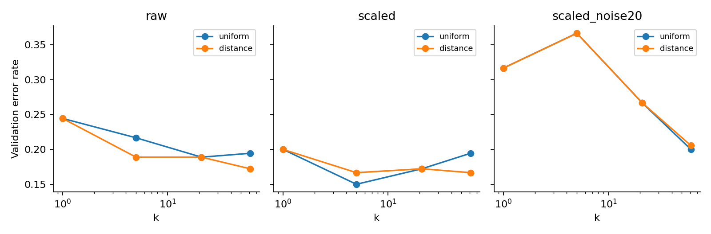
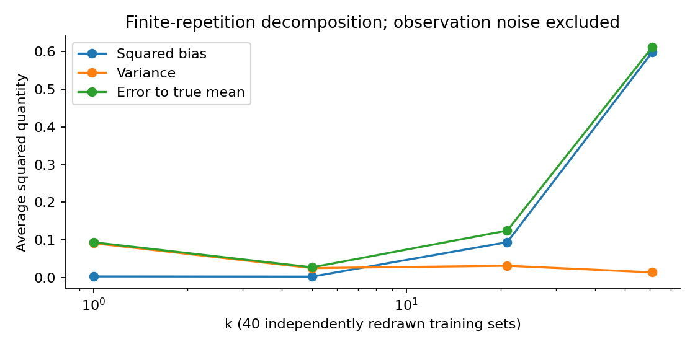

# 第057讲 最近邻与局部预测实验

这份实验让你验证三个问题：单位怎样改变相似性，邻居数量怎样改变预测，以及一个局部平均是否真的按公式实现。预计首次学习需90至150分钟；无需网络数据与GPU。先完成纸笔部分，再运行代码，最后打开answers.pdf核对。不要把修改后的探索结果覆盖交付的基准文件。

## 1 环境与文件

建议在Python3.12独立环境中运行：

```bash
python -m pip install -r requirements.txt
python experiment.py --out outputs/my-result.json
python test_experiment.py --report outputs/my-result.json
python plots.py --report outputs/my-result.json \
  --directory outputs/my-figures
python execute_notebook.py --out outputs/my-notebook.ipynb
```

requirements.txt锁定数值、绘图和Notebook依赖。已保存的experiment.ipynb包含真实执行输出。execute_notebook.py使用新的Python进程与真正IPython内核执行所有代码格；没有测试浏览器端Jupyter界面或跨进程socket传输。PDF重建还需build-requirements.txt、Node.js、npm install、系统Pango及Noto CJK字体，之后bash build_all.sh在outputs/rebuild保存结果。无需为了运行实验安装PDF工具链。

数据全部在data/draws.npz。X为900行二维特征，y是二分类标签，noise为900乘20噪声矩阵；xr、yr分别是380行回归输入与标签。数据字典详细说明单位和切分。generate_data.py默认生成到outputs/generated-data，可比较数组值；ZIP压缩文件或PDF本身的字节不是科学再现性的充分标准。

## 2 实验A 用四则运算审计邻居

已知训练位置0、2、5及标签0、4、10，查询位置1。

1. 写出全部距离和排序，分别求等权k为1、2、3时的预测。距离相同保留训练行顺序。
2. 求逆距离k为3时的归一化权重和预测。把所有位置及查询同时乘10，答案是否变化？解释原因。
3. 将标签改成0、1、1，分别求等权k为2和3的正类比例与分类。本包规则是严格大于0.5才预测1。
4. 训练输入改为0、0、2，标签0、1、1，查询0。逆距离k为3怎样避免除零？如果k改成1，训练行顺序是否重要？

验收应有具体数值，而非“调用库就一样”。随后运行以下代码，并在答案不同处先检查平局规则：

```python
from knn import KNN
m = KNN(3, 'distance', 'regression')
m.fit([[0.], [2.], [5.]], [0., 4., 10.])
print(m.neighbors([[1.]]))
print(m.predict([[1.]]))
```

## 3 实验B 看见尺度的影响

先在纸上考虑查询(0,0)，候选A=(2,0)、B=(0,1)。原单位下谁更近？把第二维乘40后谁更近？这一步没有改变对象本身，只改变编码单位。

读取数据，计算前360行X每列的均值和标准差，与experiment-result.json中scalers.scaled比较。用相同参数变换验证和测试，检查训练变换后均值约0、标准差约1。不要要求测试均值也精确为0，因为它没有重新fit。

打开图2与图3，回答：

- 为什么图3纵轴虽然写x1除以40，原始路线仍然受到40倍缩放影响？
- 原始等权路线和标准化等权路线分别选中哪个k？各错多少条测试数据？
- 标准化是不是在自动删除无用特征？用第三条路线回答。

验收：记录训练参数、两个错误数及一个清晰的坐标解释。若试验用全体900行fit缩放器，只能标为故意的泄漏负对照，不能替换正确报告。



## 4 实验C 亲手重算验证选择

对于每条classification记录，从candidates中读取4个validation_error。按“错误率较小，再按k较小”排序，检查第一名等于selected_k。随后读取test_probability和classification_test_y，用严格大于0.5生成类别，计算错误率。

```python
best = min(row['candidates'],
           key=lambda x: (x['validation_error'], x['k']))
```

解释原始逆距离路线为什么选61而不是21。解释标准化逆距离路线有多个验证分数并列时为什么选择5。把测试集删去或遮住时，你仍应能确定所有selected_k。这是“选择不依赖测试”的最低验收。

本包保留6条预定路线，并没有用测试选择最终部署路线。如果你想在6条中选一个，请先写出新的开发集选择协议，再申请一份全新的最终评估数据；合成生成器可以创建新种子，但不能把多种子中最好的一份当唯一测试。

## 5 实验D 回归与负结果

将regression中的全部验证MSE整理出来，只使用验证选k。画图4的四条等权曲线，并找出一个k=61明显抹平真函数的位置。报告等权与逆距离各自的selected_k和测试MSE。

需要解释：逆距离最佳验证分数更低，为何测试MSE却更高？这个现象否定的是“验证排名保证测试排名相同”的断言，不是否定验证方法本身。有限样本与模型选择都引入不确定性。

加做：用相同训练数据预测x=10、100、1000。等权k=5的邻居集合是否变化？逆距离预测是否仍是邻居标签的加权平均？把输出写到新文件并标注这是外推行为观察，不是本讲主测试的新成绩。

## 6 实验E 独立重算偏差方差

bias_variance里保存每个k的40乘101预测矩阵。先对重复维取均值，再计算平方偏差；用ddof=0对重复维计算方差；对全部重复和网格计算相对真实均值的MSE。验证平方偏差加方差与MSE之差小于$10^{-12}$。

不要把40条曲线简单拼成一条更长数据列求方差，那会混入不同x位置的函数变化。也不要拿训练标签的方差代替预测方差。



再故意改为ddof=1。对于k=5，方差变成原值的40/39，差值约0.000629。解释为何此时“偏差平方加方差”不能直接等于原MSE。最后说明0.09为什么不在本图误差里。

## 7 实验F 噪声维度与控制变量

固定k=21，保留同一信号、同一噪声矩阵前缀，重跑0、2、5、10、20个噪声维。记录错误率和第一条测试点最近距离除以中位距离。解释只改变一个条件的重要性。

回答两个边界问题：本图是否足以证明所有高维任务失败？这个单查询距离比是否代表全体测试点？若想扩展证据，可以预先决定统计所有查询的分位数与多个数据种子的误差分布，再生成新图，但不要用探索结果倒改本讲协议。

## 8 实验G 程序应该拒绝哪些输入

至少运行以下失败例：k=0、k=1.5、k=True、k大于训练行数、未fit便predict、含NaN的特征、分类标签为2、标签行数不一致、查询维度不一致。检查都给出清楚的ValueError。再用python -O test_experiment.py重跑，避免测试只依赖会被优化模式删除的assert语句。

随机库对照覆盖k=1、4、35，两种权重、分类概率和回归值，总计12项。为什么不能只用predict类别比较？因为概率可以算错而类别没变。为什么手算用例仍不可省？因为自写实现和参考调用可能共享相同的错误假设。

## 9 交付与自评

提交一页实验结论、运行命令与依赖版本、全部自算表、至少两张带解释的图、手算过程、非法输入日志，以及一条不支持原先直觉的结果。60分要求计算和运行正确；80分要求能解释选择与测试边界；100分要求区分训练集方差、预测方差、观测噪声，并说清楚一个真实任务为何适合或不适合当前距离。

不要将合成分数写成现实业务收益。完整参考答案说明计算过程；允许你给出不同且有证据的探索结果，但必须把探索和本讲预定实验分开报告。
