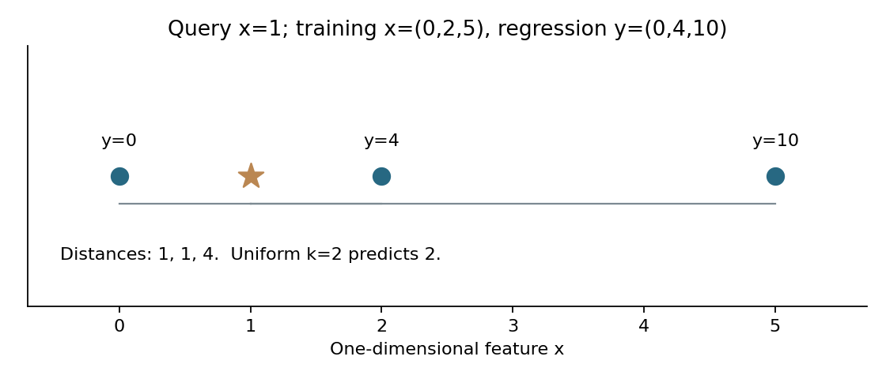
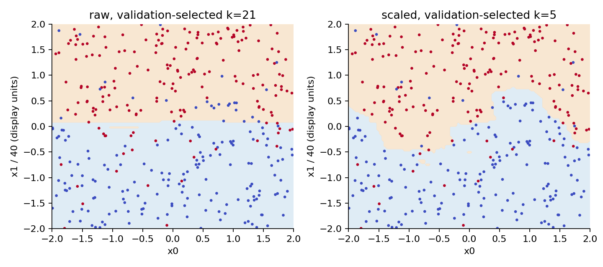
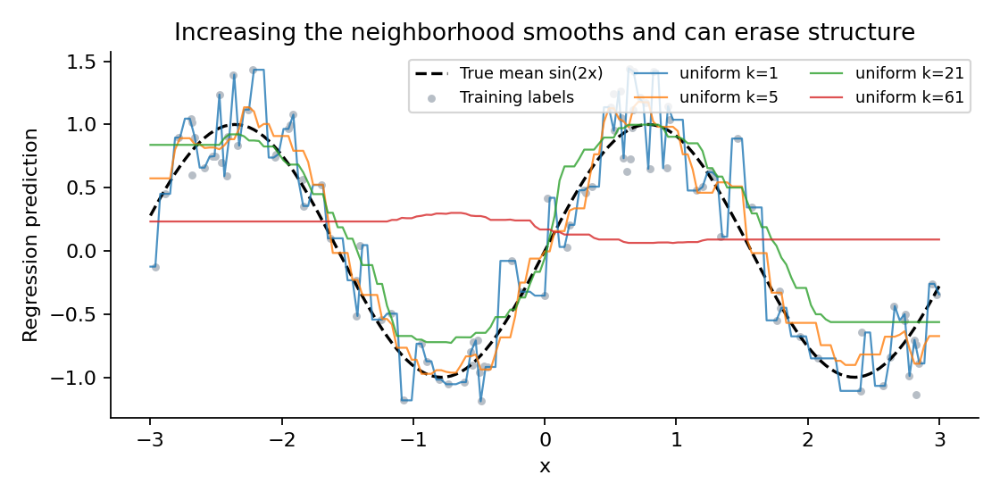
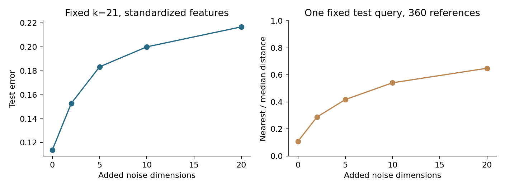

# 第057讲 最近邻与局部预测

本讲回答一个很直观的问题：如果一个新样本没有标签，能不能向最相似的旧样本借答案？答案是可以，但“相似”由特征、单位、距离和邻居个数共同决定。我们将从三条数据的手算，走到可执行的分类、回归和偏差方差实验，并逐项解释标准化、噪声维度、重复点与验证集怎样改变结论。

目录直接先修为第009、046、050至052、054讲；实现还会用到第005讲数组与第007讲可复现实验。实验使用原创合成数据，CPU即可离线运行。读完后应能独立写出一个小数据kNN，说明每个边界约定，复算图中一个点，并给出适用范围而不是只报最高准确率。

## 1 从找相似例子开始

设训练数据为$(x_i,y_i)$，其中$i=1,\ldots,n$。特征$x_i$是一行$d$个数；分类的$y_i$是类别，回归的$y_i$是连续量。查询点$x$只有特征。kNN先计算$x$与每个训练点的距离，再保留最近的$k$个训练行，最后投票或平均。这里$k$是我们在训练前后通过验证选择的超参数，不是拟合得到的一组回归系数。

例如训练位置为0、2、5，对应回归标签0、4、10，查询位置为1。距离依次为1、1、4。取最近两个标签，平均得到$(0+4)/2=2$。取三个标签并等权平均，得到$14/3$。两次计算都没有更新训练标签，差别来自我们允许“多远的经验”影响答案。

kNN常被叫作惰性学习：最简单的fit只是保存训练数据，主要计算放在预测时。这不等于没有训练过程或没有复杂度。决定特征、拟合缩放器、选择距离与$k$都属于学习方案；索引实现还会在fit时建搜索结构。训练数据本身也是模型的一部分，删除或泄露训练数据会影响模型。

## 2 把邻居集合写成可计算的定义

本讲只实现欧氏距离：

$$d(x,x_i)=\sqrt{\sum_{j=1}^{d}(x_j-x_{ij})^2}.$$

先算每一维差值，再平方、求和和开根号。为了找最近点，仅比较平方距离也能得到相同次序；为了逆距离加权，仍需真实距离。把距离按从小到大排序，前$k$个训练行的索引集合记为$N_k(x)$。合法条件是$1\leq k\leq n$。

**距离不是标签相似度。** 新样本的标签未知，所以找邻居时只能用预测时可获得的特征。把标签附加到特征、把未来信息作为输入、先查看测试标签再决定距离，都使离线分数失去原本含义。一个特征与任务是否相关，必须由领域知识和训练验证过程判断。

距离相同也要有约定。本实现采用稳定排序：同距点保持训练行顺序。如果第$k$和第$k+1$个点同距，只有前者进入集合。这使同一输入可复现，但交换训练行顺序可能改变边界处的答案。不能把这种实现细节误说成模型发现了真实差别。若应用需顺序无关的行为，应该定义“纳入所有边界同距点”等另一套规则，并重新验证。

## 3 同一个邻域怎样产生两种答案

### 3.1 分类是局部类别比例

本讲教学分类器支持标签0和1。等权邻域中的正类比例为：

$$\hat p(x)=\frac{1}{k}\sum_{i\in N_k(x)}y_i.$$

例如五个邻居的标签为1、1、0、1、0，正类比例是$3/5$，预测为1。实现明确使用$\hat p>0.5$预测1，等于0.5时预测0。偶数$k$可能产生票数平局；奇数$k$在等权二分类且每个邻居都纳入时不会有票数平局，但仍可能有距离平局。逆距离加权时，奇数$k$也不能保证加权票数不平局。

局部比例位于0到1之间，因此库接口称它为predict_proba。但“能输出比例”不保证校准。$k=1$只给出0或1，邻居标签中的随机误差会被完全继承。即使训练集独立同分布，有限样本、错误距离和分布变化也会使这个比例偏离真实条件概率。需要概率决策时，应继承前面关于校准和独立验证的要求。

### 3.2 回归是局部标签均值

等权回归把同一个公式用于连续标签：

$$\hat f(x)=\frac{1}{k}\sum_{i\in N_k(x)}y_i.$$

为什么平均有意义？对一个固定邻域，如果我们想用常数$a$代表这些标签，并最小化$\sum_i(y_i-a)^2$，对$a$求导后得到$2ka-2\sum_i y_i=0$，所以最优$a$就是均值。因此局部平均与平方损失相匹配。如果评价目标是绝对误差，局部中位数可能更合适，但那已经是另一个明确的模型方案。

### 3.3 让更近的点有更大权重

逆距离方案先令$w_i=1/d(x,x_i)$，再归一化：

$$\tilde w_i=\frac{w_i}{\sum_{\ell\in N_k(x)}w_\ell},\qquad
\hat f(x)=\sum_{i\in N_k(x)}\tilde w_i y_i.$$

分类也用这个加权均值来估计正类比例。图1的三个距离是1、1、4，归一化权重为$4/9,4/9,1/9$，回归预测为$26/9\approx2.8889$。不要把$1/d_i$直接乘标签后相加而忘记除权重和，否则答案会随距离单位整体改变。

如果距离恰好为0，直接取倒数会除零。本实现先选出$k$个邻居；只要其中存在零距离点，就只让这些零距离点等权投票，其他点权重归零。两个完全相同输入的标签分别为0和1，预测比例就是0.5，并按约定预测0。若重复点多于$k$，仍只使用选中的$k$个，因此重复和排序都应被审计。

## 4 标准化是在改变距离的含义

假设两个特征分别记录长度与质量。某维的数值范围是另一维的40倍，欧氏距离中的平方差可能被放大1600倍。这不是“该特征被证明更重要”，只是单位进入了模型。把米改为厘米也能改变邻居顺序，说明原始欧氏距离没有单位不变性。

常见做法是对每一列，用训练集均值和标准差变换：

$$z_j=\frac{x_j-\mu_j}{s_j},\quad
\mu_j=\frac1n\sum_i x_{ij},\quad
s_j^2=\frac1n\sum_i(x_{ij}-\mu_j)^2.$$

在变换后的空间用欧氏距离，相当于原空间中每维平方差除以$s_j^2$。它让训练集中波动尺度相近，但不会自动证明各维同等有用。无关噪声列也会获得单位尺度，相关列可能重复计算同一信息，极端异常值会影响均值和标准差。常数列在StandardScaler中使用尺度1，避免除零。

**只在训练行上fit。** 本实验分类前360行用于拟合缩放器，随后对验证180行和测试360行使用同一组参数。不能分别把验证或测试重新标准化到自己的均值，也不能用900行共同fit。前者改变了坐标系，后者把未来分布信息提前交给模型。交叉验证时，每个训练折都必须重新拟合缩放器。

本实验的潜在特征$u,v$独立均匀分布于$[-2,2]$；无噪声标签由$v>0.55\sin(2u)$决定，再以10%概率翻转。真正输入保存为$(u,40v)$。因此单位差异是故意制造、能够解释的，不能据此声称真实任务一律应标准化。

## 5 用验证选择邻域 不用测试挑赢家

分类数据固定为360行训练、180行验证、360行测试。每条预定路线分别比较$k\in\{1,5,21,61\}$，只按验证错误率选择$k$；相同时选较小$k$。选好后不重拟合训练加验证集合，仍保留原360行邻居，再统一报告封存测试。这减少“重拟合后邻居数量和缩放参数改变”对教学复算的干扰，实际工作也可以预先规定重拟合步骤。

三条路线为原始二维、标准化二维、标准化二维加20个独立噪声维；每条路线都比较等权和逆距离权重。六条路线在查看测试之前固定。这里报告全部路线是教学对照，不根据测试宣布一个今后部署的赢家。若需要最终选择路线和权重，应把这些也纳入开发集的搜索，并用新的未使用测试评估。

|路线|权重|验证选出的k|测试错误数 除以360|测试错误率|
|---|---|---:|---:|---:|
|原始二维|等权|21|65 / 360|0.18056|
|原始二维|逆距离|61|66 / 360|0.18333|
|标准化二维|等权|5|39 / 360|0.10833|
|标准化二维|逆距离|5|40 / 360|0.11111|
|标准化加20噪声维|等权|61|74 / 360|0.20556|
|标准化加20噪声维|逆距离|61|73 / 360|0.20278|

标准化二维在这次固定实验中减少了错误，添加无关维度又损害了表现。逆距离权重没有在所有路线胜过等权；“更精细”不等于更准。一个测试样本改变就会使错误率变化$1/360\approx0.00278$，所以39次和40次错误不能被夸大成稳定优劣。表中没有区间，也没有对多路线比较作显著性检验。

图3把“单位改变邻居”变成可见的区域。原始路线容易受纵向数值支配；标准化路线能更好保留弯曲边界。散点中仍有10%随机翻转，不能要求任何平滑边界穿过所有点。绘图是诊断模型行为，不是再次修改$k$的选模依据。

## 6 回归曲线为什么会变平

回归实验另生成380个独立样本，$x$均匀分布于$[-3,3]$，$y=\sin(2x)+\epsilon$，其中$\epsilon$均值为0、标准差为0.3。训练100行、验证80行、测试200行。这里只用一个特征，等比例缩放不会改变邻居次序，也不影响归一化逆距离权重，所以不另加标准化对照。

$k=1$的曲线随最近训练标签跳动，容易复制噪声；$k=61$平均了大范围的标签，曲线比较平，但弯曲结构也被冲淡。kNN回归不是一条全局多项式，也不天然连续。等权邻居集合在边界改变时，预测可以跳跃；逆距离只是另一种平滑方式，不应未经条件证明就称为处处光滑。

验证为等权选出$k=5$，测试MSE为0.111203；为逆距离选出$k=21$，测试MSE为0.126908。逆距离在验证上的最佳MSE约0.1137，低于等权最佳约0.1291，但测试次序相反。这是一个重要负结果：有限验证集上的较低误差不保证每一份测试都更好。不能因此用测试改回另一个$k$再把同一个测试分数当新证据。

在训练范围外，kNN没有外推趋势的机制。查询点远远向右移动，最近的$k$个训练点可能不再变化，等权预测随之固定；逆距离预测仍是训练标签的非负加权平均，因此不会超出邻居标签的最小最大值。若科学问题要求外推，必须单独检验，不能把局部插值图当成外推保证。

## 7 偏差和方差要跨训练集来定义

同一训练集内的训练误差，不是模型方差。要观察学习算法对数据抽样的敏感程度，我们独立生成40份训练集，每份80行，保持同一个真实函数和噪声标准差；在固定的101点网格上得到40条预测曲线。记第$r$次预测为$\hat f_r(x)$，均值为$\bar f(x)$。

在每个网格点，有限重复的平方误差恒等式为：

$$\frac1R\sum_r[\hat f_r(x)-f(x)]^2
=[\bar f(x)-f(x)]^2+
\frac1R\sum_r[\hat f_r(x)-\bar f(x)]^2.$$

证明只需在左式中加减$\bar f(x)$再展开。交叉项含有$\sum_r(\hat f_r-\bar f)=0$，所以消失。最后再对101个网格点取平均。这里方差必须用分母$R$，即ddof=0；若用无偏样本方差的$R-1$而不调整系数，恒等式不成立。

|k|有限重复平方偏差|有限重复方差|相对真实均值的MSE|
|---:|---:|---:|---:|
|1|0.002453|0.090841|0.093293|
|5|0.002064|0.024525|0.026589|
|21|0.093518|0.030750|0.124268|
|61|0.598287|0.013317|0.611604|

可以看到较大的邻域最终带来明显平方偏差，但方差并非每一步严格下降：从5到21反而增加。这既有有限重复估计波动，也有随机训练位置和局部平均行为的影响。偏差方差权衡描述趋势与机制，不是每个数据、每一对$k$都满足的单调定理。

这张表与上节测试MSE不是同一个量。上节比较含噪声的测试$y$，这里比较已知无噪声均值$f(x)$。对一个新的、独立的观测噪声，在期望上还要加$0.3^2=0.09$。不能直接把有限测试MSE减去0.09就宣布精确得到模型误差，因为有限样本还存在交叉项和抽样波动。40次重复也不是无穷总体期望，图中没有Monte Carlo误差区间。

## 8 为什么加更多特征可能更糟

我们保留同一组信号与同一份噪声矩阵的前缀，逐次加入0、2、5、10、20个独立噪声维。每次只在前360行拟合StandardScaler，并固定等权$k=21$，不为每个维数重新选$k$。这样对照的问题是“固定方案对增加无关维度有多敏感”，不是“各维数经过最佳调参后谁最好”。

错误率从0.11389增到0.21667；第一条查询的最近距离与中位距离之比从0.1095增到0.6489。对独立标准化噪声，两条独立样本每维差的平方期望约为2，$q$维就贡献约$2q$。信号只有少数维时，无关距离成分会稀释信号，让“最近”与“普通”不再那么悬殊。

这个实验提供机制示例，不证明所有高维数据都失败。实际数据可能位于低维结构、具有稀疏表示或有效的任务距离。维度数、样本量、噪声结构和距离设计必须一起看。PCA等降维也不能先看全部测试数据再fit；任何数据驱动变换都属于训练流程。

## 9 读懂实现与数值边界

knn.py把邻居索引、距离、权重、预测分别暴露出来。输入先转为有限二维浮点矩阵，检查标签长度、$k$的整数合法性和特征维数。本讲明确不实现缺失值距离；遇到NaN或无穷大就报错，提醒先在训练内拟合插补器。k不能是布尔值，因为Python里True虽然类似整数1，却不是这里想要的超参数输入。

逆距离实现不用直接计算极大倒数，而在非零距离行使用$d_{min}/d_i$再归一化。它与$1/d_i$归一化数学等价，且所有临时权重不超过1。若输入数值大到平方距离溢出，代码显式拒绝并要求重缩放，而不是让NaN悄悄产生一个类别。

每条查询先计算$n$个$d$维距离，再稳定全排序。当前教学实现单查询时间约$O(nd+n\log n)$，临时距离差矩阵约$O(nd)$；保存训练集需要$O(nd)$空间。并非所有kNN都必须全排序：只选前$k$可用部分选择，KD树和Ball树可利用空间结构，但高维或大$k$时加速可能下降。这里为透明性使用暴力方法，不把小例子的速度推广到大规模系统。

与scikit-learn的对照只在无距离平局的随机点上要求数值一致；距离平局时不同搜索算法、行顺序和浮点细节可能得到不同邻域。对照相同接口并不自动证明正确，本包同时保留手算例、非法输入测试、已保存结果重算和有限重复恒等式。

## 10 本讲能支持怎样的结论

你现在应能把一个kNN结果拆成五个可审计决定：输入特征及单位、训练行与缩放参数、距离及平局规则、$k$和权重的验证选择、测试指标及适用总体。本实验支持“在当前合成分布中，标准化减少了故意制造的尺度失衡；独立噪声维度损害固定方案；邻域平均产生可见偏差方差权衡”。它不支持“标准化永远改善”“距离加权永远更好”“高维必然失败”或“局部比例天然校准”。

继续学习树模型时，会看到另一种建立局部区域的方法：按特征阈值切分，而不是按查询点临时寻找邻居。完成独立实验和答案中的手算、负对照与边界测试后，再比较两种局部预测思想。

## 原始来源与阅读范围

本讲公式推导、实验数据、图和教学实现均为原创。2026-10-06核对scikit-learn官方文档的邻居算法、标准化接口、近邻分类示例与偏差方差示例；完整链接及具体核对范围见sources.md。官网stable版本可能高于实验锁定版本；本包实际使用requirements.txt列明的版本。不要将外部示例的数据或结论误认为本实验运行结果。
