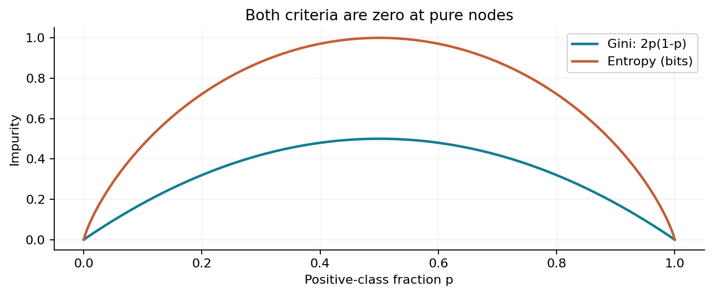
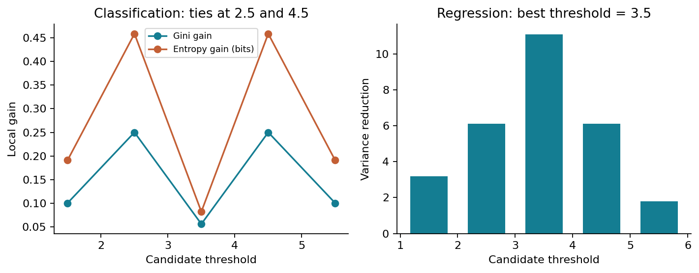
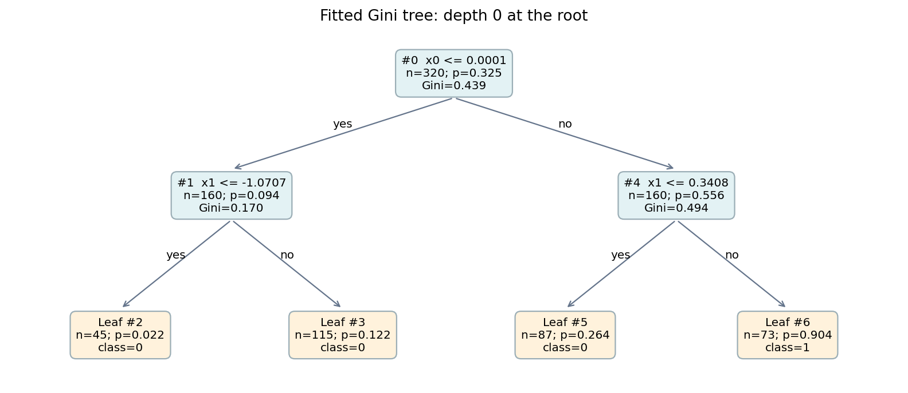
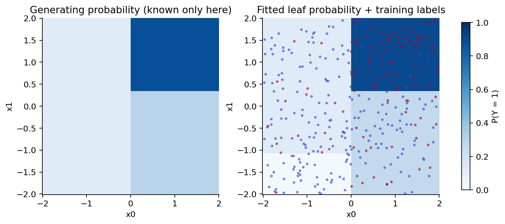
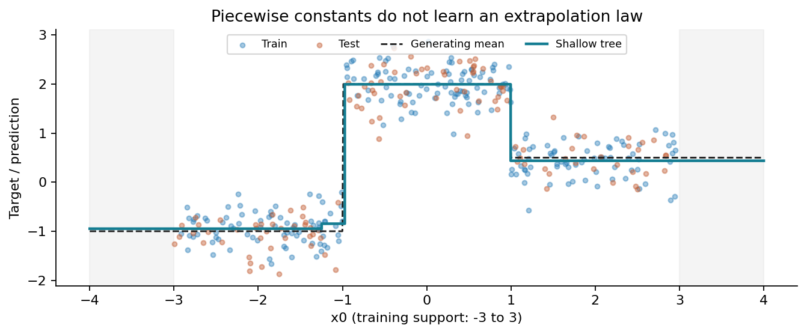
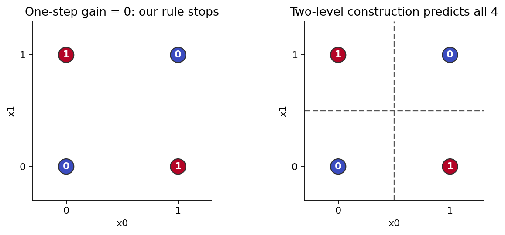

# 第058讲 决策树的分裂机制

## 1 从一句条件判断开始

假设输入有两列：温度和压力。我们可以写“温度不高于某个值，走左边；否则走右边”。在每一边再检查压力，最后返回一个数或类别。这样的程序人人都能读懂。机器学习问题在于：应该先检查哪一列？分界放在哪里？走到最后应该返回什么？决策树用训练数据回答这些问题。

本讲的目标不是调用一个函数画出漂亮的树，而是自己计算每个候选分裂、检查所有叶子、追踪边界样本，再与成熟库对照。读完应能解释：为什么回归叶子取均值，为什么分类节点要按样本数量加权，为什么当前最好的分裂不保证整棵树最好。

直接先修是019期望、028最小二乘、043信息论损失、046分类指标和050数据划分。这里仍从符号解释开始。我们只讨论数值特征、二叉分裂、二分类或单输出回归。浅树最大深度预先固定为2，根节点深度是0。复杂度选择与剪枝留到下一讲，不在本次测试结果出来后调整。

“容易解释”有具体含义：对某一个输入，可以明确说出模型经过哪些判断、用了哪个叶子的训练统计量。它不意味着这些判断揭示了真实因果机制，也不意味着叶子里的样本足够多、概率足够准确。

## 2 节点、分支和叶子各存什么

训练矩阵记为 $X\in\mathbb R^{n\times d}$，第 $i$ 行是一个对象，第 $j$ 列是一项输入。标签 $y_i$ 在分类时取0或1，在回归时是实数。树上的节点只处理到达自己的那部分训练行，记作集合 $S$，大小为 $n_S$。

一个候选分裂是特征编号与阈值组成的二元组 $(j,t)$。本讲约定等于阈值走左边：

$$S_L=\{i\in S:x_{ij}\leq t\},\qquad S_R=\{i\in S:x_{ij}>t\}.$$

左、右子集不能有交集，两者合起来必须恰好等于父集合。只要这里漏行或重复，后面的纯度、样本数和指标都会失去意义。一次合法分裂还要求两边都不为空，并满足预先固定的最小叶样本约束。

不再向下分裂的节点叫叶子。回归叶子保存到达这里的训练标签均值；二分类叶子保存正类频率 $\hat p$，概率向量按类别0、1排列为 $(1-\hat p,\hat p)$。若必须给类别，本讲取概率较大的类别，平局时取0。这是明确的接口约定，不是关于所有应用的最佳阈值建议。

预测时不再寻找相似训练行，也不重新计算候选阈值。新输入从根开始，每次只比较一个特征，直到叶子。所有返回值都来自训练阶段冻结的统计量；测试标签不会参与树路径或叶子概率的计算。

## 3 为什么只枚举相邻不同值之间

先看一列训练值1、2、3、4、5、6。阈值2.1、2.5、2.9把训练行分成完全相同的两组。在只比较训练损失时，没必要把这个连续区间里的每个实数都试一次。保留相邻不同观测值之间的一个代表即可，通常选中点。

因此本例候选阈值为1.5、2.5、3.5、4.5、5.5。若训练值为1、1、3、3，唯一非空分裂可以用2代表。相同的输入值必须一起走向同一边，不能因为排序后的行号不同把两个“1”分开。

一般有 $m$ 个不同值时，最多有 $m-1$ 个这种候选。对每列分别枚举，再排除不能满足最小叶样本数的候选。连续特征越多、可选阈值越多，搜索负担越大；这也说明“规则简单”不等于训练过程完全不用搜索。

实现中使用浮点数。直接算 $(a+b)/2$ 在两个大正数相加时可能溢出，所以代码先算 $a/2+b/2$。若舍入使结果不再属于 $[a,b)$，回退到左端值 $a$；配合“≤走左”，仍能正确分开两个不同的有限浮点数。这个极端处理保护分组语义，通常的教学数据仍使用普通中点。

## 4 回归叶子为什么取均值

假设当前叶子必须给每个输入同一个预测值 $c$。平方误差之和为：

$$L(c)=\sum_{i\in S}(y_i-c)^2.$$

对 $c$ 求导得到 $L'(c)=2\sum_{i\in S}(c-y_i)$。令导数为0，有 $n_Sc=\sum_i y_i$，所以最优值是叶内均值 $\bar y_S$。二阶导数是 $2n_S>0$，因此它确实是唯一最小值。

用一个手算核验：标签为1、2、2，均值为5/3。预测全部取5/3时，残差平方和为 $(1-5/3)^2+2(2-5/3)^2=2/3$。若错误地把中位数2当作平方误差的唯一最优解，平方误差和为1，比2/3更大。中位数适合绝对误差问题，这不是本讲的目标。[2]

我们把节点不纯度定义成平均平方误差：

$$I(S)=\frac{1}{n_S}\sum_{i\in S}(y_i-\bar y_S)^2.$$

它也是用分母 $n_S$ 计算的经验方差。这里不是在构造总体方差的无偏估计，所以不使用 $n_S-1$。单样本节点的不纯度是0，公式也能正常工作。

## 5 回归分裂究竟减少了什么

分裂以前，所有行用同一个父均值；分裂以后，两边各自用自己的均值。比较时必须按子节点包含的行数加权：

$$I_{\rm after}=\frac{n_L}{n_S}I(S_L)+\frac{n_R}{n_S}I(S_R),\qquad \Delta I=I(S)-I_{\rm after}.$$

最大化减少量 $\Delta I$ 与最小化分裂后的加权不纯度等价，因为同一个父节点的 $I(S)$ 对所有候选都一样。注意“同一个父节点”：不同深度节点的局部减少量若直接相比，代表的总训练行数可能不同。

现在沿着 $x=1,2,3,4,5,6$ 放置回归标签1、2、2、8、9、8。总均值是5，残差平方和68，父不纯度 $68/6=34/3$。阈值3.5把数据分成前后三行，两个均值为5/3与25/3；每一边的平均平方误差均为2/9。因此分裂后也是2/9，减少量为 $34/3-2/9=100/9$，约11.111111。

| 阈值 | 左/右样本数 | 分裂后平均平方误差 | 方差减少量 |
|---|---|---|---|
| 1.5 | 1 / 5 | 8.133333 | 3.200000 |
| 2.5 | 2 / 4 | 5.208333 | 6.125000 |
| 3.5 | 3 / 3 | 0.222222 | 11.111111 |
| 4.5 | 4 / 2 | 5.208333 | 6.125000 |
| 5.5 | 5 / 1 | 9.533333 | 1.800000 |

每个数字都有单位：若标签用米，平方误差和方差减少量用平方米。不要把它与后面无量纲的Gini或以bit表示的熵直接比大小。

还可以把分裂收益写成两个均值的差：

$$\Delta I=\frac{n_Ln_R}{n_S^2}(\bar y_L-\bar y_R)^2.$$

推导来自平方和分解：对子节点内的每一行，把 $y_i-\bar y_S$ 拆成 $y_i-\bar y_{L/R}$ 与 $\bar y_{L/R}-\bar y_S$。交叉项求和为0，因为子节点残差和为0。父平方和等于两边的组内平方和加组间平方和，除以 $n_S$ 就得到上式。收益非负也由此一目了然。

## 6 分类纯度先从频率出发

对分类节点，先数正负样本，而不是先寻找一条有哲理的规则。若节点有 $n_1$ 个正类、$n_0$ 个负类，那么 $\hat p=n_1/(n_0+n_1)$。完全同类时容易给出一致预测，正负各半时最混杂。

二分类Gini不纯度为：

$$I_G(S)=1-\hat p^2-(1-\hat p)^2=2\hat p(1-\hat p).$$

可以把它理解为：按节点经验类别频率独立抽两次类别，两次不一致的概率。两次都是1的概率为 $\hat p^2$，都是0的概率为 $(1-\hat p)^2$；用1减去二者即可。它在纯节点为0，在各半节点达到0.5。

另一种准则是二元熵。本讲使用以2为底的对数，因此单位为bit：

$$I_H(S)=-\hat p\log_2\hat p-(1-\hat p)\log_2(1-\hat p).$$

约定 $0\log_2 0=0$，这是极限意义上的连续延拓，不能直接让程序计算0乘以负无穷。纯节点熵为0，各半节点为1 bit。代码显式处理0和1的频率，避免无效数值。



Gini和熵可能给同一批候选不同排序。本讲手算与合成主实验中二者恰好选择相同的树，不据此宣称它们永远等价。学习一条机制时，“此例相同”与“一般定理”应当分开。

## 7 手推一次分类分裂

继续使用输入1至6，把分类标签改为0、0、1、0、1、1。父节点正负各3个，所以Gini为0.5，熵为1 bit。试阈值2.5：左边标签0、0，纯度为0；右边1、0、1、1，正类比例3/4，Gini为3/8。

分裂后的Gini是 $(2/6)\times0+(4/6)\times(3/8)=1/4$，减少量为1/4。右边熵约0.811278 bit，加权后约0.540852 bit，所以信息增益约0.459148 bit。

| 阈值 | 左/右正类数 | 加权Gini | Gini减少量 | 熵信息增益(bit) |
|---|---|---|---|---|
| 1.5 | 0 / 3 | 0.400000 | 0.100000 | 0.190875 |
| 2.5 | 0 / 3 | 0.250000 | 0.250000 | 0.459148 |
| 3.5 | 1 / 2 | 0.444444 | 0.055556 | 0.081704 |
| 4.5 | 1 / 2 | 0.250000 | 0.250000 | 0.459148 |
| 5.5 | 2 / 1 | 0.400000 | 0.100000 | 0.190875 |

阈值2.5和4.5并列最好。本实现按特征编号从小到大、阈值从小到大枚举；收益差不超过 $10^{-12}$ 时保留先遇到的候选，因此选择2.5。平局处理没有统计魔法，但如果没有写清它，重新运行或换库时很容易误把合法差异当成错误。



为什么不能简单平均两边的Gini？考虑10个样本，正负各5个。分裂A把2个负类单独放左边，右边有5正3负；加权Gini为0.375，不加权平均却是0.234375。分裂B两边各5个，分别是4正1负与1正4负，加权与不加权结果都为0.32。正确方法选B；不加权方法却错误偏爱A。一个小纯叶子不能代表一半的数据。

## 8 叶子概率与训练损失的联系

分类叶子取频率，不只是一个常识规则。固定一个含 $n_1$ 个1和 $n_0$ 个0的叶子，用常数概率 $p$ 预测，负对数似然是 $-n_1\log p-n_0\log(1-p)$。当两类都存在时，求导并令其为0得到 $p=n_1/(n_0+n_1)$。纯叶子的最优值在边界0或1。

把经验频率代回，并以2为底、除以叶子样本数，就得到叶子熵。因此整棵树的训练平均对数损失等于各叶子熵按样本数加权之和。若评价代码使用自然对数，要乘上 $\ln 2$ 换算，不能拿两个数直接判定实现不一致。[1]

对于只记录正类概率的Brier损失 $(p-y)^2$，在训练叶子内代入最优频率，平均损失是 $\hat p(1-\hat p)$，恰好是二分类Gini的一半。这里“一半”源自Brier只对一个正类概率计算。若把两类概率的平方误差相加，就等于Gini。

这些等式都是训练集内、固定叶子划分下的代数关系，不保证测试概率校准。一个只含1个正类的叶子会返回1，但我们并没有因此获得“所有未来对象都必然为正”的证据。分裂不断使用标签挑选区域，叶内频率也受到这种选择过程影响。

## 9 递归长树：局部最优如何接起来

从根节点开始，先算全部合法候选的加权不纯度，选当前收益最大的分裂，然后对子节点重复。这个过程叫递归：同一种操作再次作用于更小的子问题。它叫贪心，是因为决定当前分裂时没有枚举所有未来可能的整棵树。

本讲停止条件明确写在代码中：达到最大深度；样本不足以让两边都满足最小叶样本数；节点不纯度已经不大于数值容差；没有合法候选；或者最佳局部收益不超过 $10^{-12}$。深度2意味着一条路径至多比较两次，不意味着整棵树只含两个节点。

```python
split = best_split(X[ids], y[ids], criterion, min_samples_leaf)
if split is None or split['gain'] <= 1e-12:
    return leaf
left = X[ids, split['feature']] <= split['threshold']
grow(ids[left], depth + 1)
grow(ids[~left], depth + 1)
```

这是核心逻辑的说明片段，完整可执行版本在tree.py。每个节点还保存训练行号、样本数、均值或频率、不纯度和子节点编号。这些记录帮助别人独立检查树是怎样长出来的；成熟部署实现通常不会在每个节点重复保存全部训练行号。

局部收益要乘以节点占全训练集的比例，才能解释成整棵树训练目标的减少量。设内部节点集合为 $\mathcal I$、叶子集合为 $\mathcal L$，有：

$$I(S_{\rm root})-\sum_{\ell\in\mathcal L}\frac{n_\ell}{N}I(S_\ell)=\sum_{v\in\mathcal I}\frac{n_v}{N}\Delta I_v.$$

这是一种“逐层抵消”：父节点被拆开后，其子节点贡献在下一次拆分中又被替换。测试脚本核验这个等式。若漏乘权重，即使每个局部候选都算对，整棵树的收益解释仍会错。

## 10 合成分类实验：从规则到区域

固定随机种子58058，独立生成480个二维输入，每一列均匀分布于−2到2。前320行训练，后160行测试。真实正类概率为：当 $x_0\leq0$ 时0.12；其余区域中，$x_1\leq0.35$ 时0.30，否则0.88。标签按对应概率独立抽样，因此同一区域仍有随机正负标签。

训练程序只读x0、x1与训练标签，不读真实概率。最大深度2、最小叶样本12、Gini与熵两种机制演示在读测试文件前固定。两种结果同时报告，不在测试上选出“获胜准则”。训练多数类基线只使用训练集正类比例0.325，因此始终预测0。



四个叶子分别包含45、115、87、73个训练行，正类数为1、14、23、66，所以概率分别是1/45、14/115、23/87、66/73。每个概率都有可以追溯的分子与分母。最后一个叶子预测1，其余三个预测0。



测试准确率为0.768750，多数类基线为0.643750。这意味着160个测试对象中，浅树预测对123个，基线预测对103个。本次Gini与熵树的路径和预测相同；这只是当前有限样本结果。测试差异没有在这里变成现实部署结论，也没有承担跨数据集算法排名的任务。

程序在读取测试文件前，把训练所得模型、基线与固定协议序列化并计算摘要。这个哈希标识一组冻结内容，不是阻止读者打开测试CSV的技术屏障，也不是外部登记的预注册。真正的信息边界仍依赖清楚的流程和诚实的报告。[4]

## 11 回归实验：分段常数和外推

回归数据另有360行，输入均匀分布在−3到3。真实均值在 $x\leq-1$ 时为−1，在 $-1<x\leq1$ 时为2，在 $x>1$ 时为0.5；再叠加标准差0.35的独立高斯噪声。前240行训练，后120行测试。仍固定深度2和最小叶样本12。

学得的根阈值约−0.978069，右侧阈值约0.997704，接近但不等于生成分界−1和1。左侧还出现约−1.243577的一次小收益分裂。树看见的是有限样本的噪声标签，不会自动知道某次微小收益是信号还是抽样波动。



测试平均平方误差约0.146755，训练均值常数基线约1.831889。均值噪声的方差为0.1225，模型有限样本误差与分界误差会让一次测试MSE与这个数不同。不能要求每次实验都恰好等于噪声方差，也不能看到接近它就宣布达成了普遍最优。

树在有限个轴对齐区域里返回常数。在训练范围以外，新输入仍落到最左或最右路径，结果通常维持端部叶子值；它不会像线性模型那样沿斜率延伸。这里的生成均值确实分段常数，但在现实数据中，训练外的均值是否保持不变是额外假设。

## 12 贪心并不等于全局最优

看四个输入(0,0)、(0,1)、(1,0)、(1,1)，标签依次为0、1、1、0。它们构成XOR关系：两列不同则为1，相同则为0。按任一列先切，左右两边都仍然正负各半，立即Gini减少量都为0。



所以本实现停在根，返回正类概率0.5，按平局规则全部预测0，训练准确率0.5。然而一棵深度2的树可以完美分类：先问x0是否≤0.5，再在左右两边分别问x1是否≤0.5，给四片区域赋0、1、1、0。

这个例子证明的是“只接受立即正收益的贪心规则可能错过有用的后续分裂”。它不证明所有决策树实现都学不会XOR。有的库允许零收益分裂继续向下生长，可能在这个例子上得到完全正确的树。实现规则必须随结论一起写明。

即使允许零收益继续，逐节点贪心仍不等于枚举整棵树的全局优化。选择当前分界会改变下一层可见的数据，今天最好的第一步未必给明天留下最好的选项。

## 13 代码对照应该比较什么

tree.py使用float64、固定候选顺序与明确平局容差。scikit-learn树会把输入转成float32，并有自己的候选处理与平局行为。因此“代码正确”不能定义为所有可能输入上的阈值位串完全一致。[1]

本次用相同训练行、相同准则、相同深度和叶样本数拟合库模型，比较整个留出集上的预测。Gini、熵分类预测与叶子概率均一致；回归预测最大绝对差约 $1.11\times10^{-15}$，属于浮点求和级别。库根阈值也保存到结果里供查看。

精确边界另用一个可手算的模型：训练输入0和2，标签0和1，得到阈值1。对1左边最近的float64数、1本身、1右边最近的float64数，预测必须依次为0、0、1。这里使用np.nextafter产生相邻浮点数。不要把它们直接拿去检验库的float32边界，否则三个值可能先被转成同一个数。

库对照只是证据的一部分。独立审计还重算每个节点的全部合法候选、实际分组、叶子统计量、全树加权收益和每个测试预测。[3] 单独调用同一个预测函数两次，只能证明它重复了自己，不能证明计算定义正确。

## 14 范围、复杂度与容易忽略的失败

本教学实现逐候选重新建立布尔掩码并计算子节点损失。一个含m行、d列的节点，最多有约dm个候选，每个候选约花O(m)工作，所以朴素搜索约O(dm²)，再加排序成本。不能把成熟库经过优化的复杂度直接贴到这份代码上。预测每行沿路径前进，耗时随实际路径深度增长。

常见改进是排序后维护前缀计数、标签和与平方和，使得相邻候选的统计量可以增量更新。但平方和公式也可能发生大数相减的数值抵消。先建立可验证的简单实现，再改进性能，并保留同一组测试，是更稳妥的顺序。

本实现拒绝缺失值、无穷值、空矩阵、错误标签和特征列数不匹配。分类只接受0/1标签，回归方差发生数值溢出时明确报错。缺失值处理、类别特征、多输出和样本权重均不在这里的支持范围内；真实研究中应先明确所需语义，再使用合适的工具。

树在理想实数计算下只依赖每列的排序，因此正的线性缩放通常保留训练分组，不像距离模型那样受单位直接主导。但有限精度会影响几乎相等的值；对一般非线性单调变换，重新取中点还可能改变新样本在观测间隙中的路径。不要把“排序不变”夸大成“所有实现与所有新输入的预测绝对不变”。

## 15 研究解释的最后一道边界

路径“x0很大且x1很大，所以模型预测1”描述的是模型函数。它没有说“人为增加x0就会使真实结果变为1”。训练数据可能含共同原因、选择偏差、测量误差和代理变量；一条清晰的路径仍然可以承载错误的因果想象。

这里所有数据由公开的生成器原创合成，目的是隔离分裂机制。没有真人信息，没有现实任务的性能承诺。若把代码用于真实数据，至少要重新定义一行代表谁、预测发生何时、标签何时可得、训练与测试如何隔离，以及哪些错误会带来何种代价。

本讲的合格交付是：能把一个分裂的候选表算清楚；能把新样本逐步送到正确叶子；能说明每个概率的分子和分母；能用XOR指出局部搜索限制；能让独立测试在普通模式与优化模式都通过。它为下一讲的复杂度控制建立了可信的计算地基。

## 16 自测与阅读路线

先遮住答案，完成实验指南中的12题。至少手写一次回归方差分解和一次不等样本量加权；再运行Notebook，检查输出是否和正文数字对应；最后故意改坏一个报告值，看独立审计是否真的拒绝错误。

阅读依据与版本见sources.md。[1]是[官方树机制说明](https://scikit-learn.org/1.8/modules/tree.html)；[2]说明[回归器准则与叶值语义](https://scikit-learn.org/1.8/modules/generated/sklearn.tree.DecisionTreeRegressor.html)；[3]展示[结构数组和路径的检查方法](https://scikit-learn.org/1.8/auto_examples/tree/plot_unveil_tree_structure.html)；[4]说明[训练测试隔离](https://scikit-learn.org/1.8/common_pitfalls.html)。公式推导、合成例子、代码和图均为本讲自行编写，没有复制教材章节或外部实验结果。
