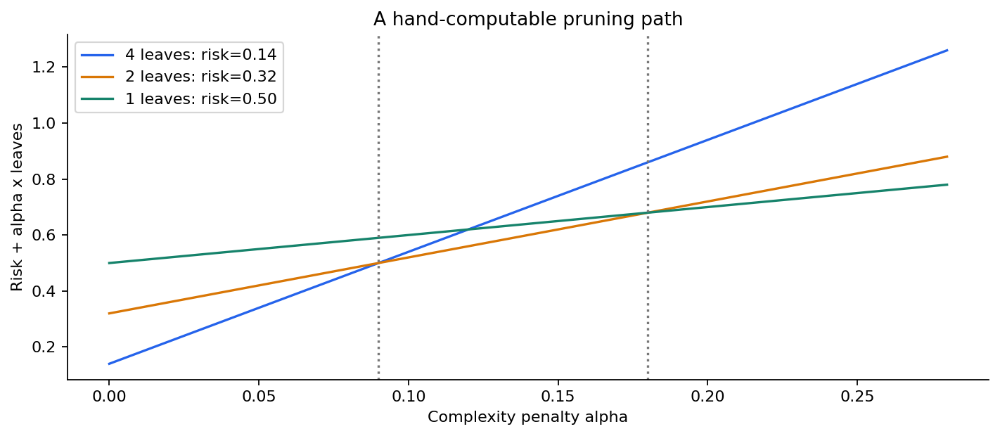
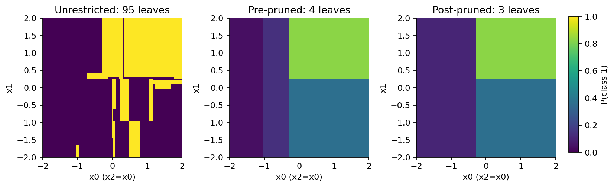

# 第059讲 实验指南

## 1 你要回答的问题

本实验检验三个具体问题：预剪枝与后剪枝如何改变同一份训练数据上的树；为什么路径必须在训练数据上生成、复杂度必须在验证数据上选择；小幅删行后，模型的结构和预测有多敏感。

预计用时约2至3小时，其中至少30分钟用于纸笔推导。先阅读lecture.md第1至8节，准备纸、计算器和能运行Python的环境。全部数据已经随包提供；主实验不下载数据，也不访问外部接口。真实科学数据应用需要另行设计，不能用本讲合成结果代替研究结论。

## 2 文件和数据地图

pruning.py实现可审计的最弱环节剪枝和导出模型预测；experiment.py负责按顺序训练、选择和最终评价；test_experiment.py独立检查风险、路径、选择与报告；plots.py生成6幅解释图。Notebook按教学顺序运行这些步骤，并嵌入输出。

train.csv有450行，validation.csv与test.csv各225行。row_id只用来追溯生成顺序，true_probability只用来解释合成总体；输入只有x0、x1、x2、x3。标签y为0或1。x2是x0的带噪声代理，x3是噪声特征。所有数据均为原创合成，不含真人资料。

先打开data/README.md，写下一行代表什么、划分是否独立、哪些列不得进入模型。这个小动作比直接运行fit更重要：如果把true_probability当特征，再漂亮的测试数字都在回答另一个问题。

## 3 安装与第一次运行

新环境可用environment.yml创建。已有Python3.12环境可按requirements.txt安装。PDF排版依赖单列在build-requirements.txt，数值实验不要求安装排版组件。

```bash
python experiment.py --out outputs/result.json
python test_experiment.py --report outputs/result.json --out outputs/test-result.json
python -O test_experiment.py --report outputs/result.json --out outputs/test-optimized.json
python plots.py --report outputs/result.json --directory outputs/figures
python execute_notebook.py --out outputs/fresh-kernel.ipynb
```

正常时，两次检查均显示passed和2751项。不要因为这一次在你的环境中不同就手动修改答案：先比较依赖版本、CSV哈希和错误信息。固定随机种子有助于复现，但不能取消软件版本、数值精度和平台差异。

PDF重建需要Node.js、MathJax、Markdown、WeasyPrint及中文字体。先按build-requirements.txt准备，再执行npm install和python build_pdf.py --directory outputs/pdf。发布版文件不会被默认命令覆盖；探索性结果都保存在outputs中。

## 4 纸笔站 手算四叶树

取100个样本，根正负各50。左边50个、正类10个；右边50个、正类40个。左侧两个叶子分别为40个中2正、10个中8正；右侧两个叶子分别为10个中2正、40个中38正。

先独立计算每个节点的正类频率、Gini和根归一化风险。用一个小表记录，不要先看答案。再计算左右分支与根节点的有效α，写下第一轮究竟剪哪里。完成第一次剪枝后重新计算根的有效α。

验收应得到4叶、2叶、1叶三个状态；风险0.14、0.32、0.50；临界α为0、0.09、0.18。若得到根在0.12处被剪，检查你是不是第一次算完以后没有更新子树叶数和风险。



## 5 程序站 检查路径的每一步

打开结果JSON的path。每一项有alpha、leaves、n_leaves、depth、risk、removed和candidates。leaves是导出树中的节点编号，不是类别，也不是原数据行号。removed记录本轮刚折叠的内部节点。

检查第一项95个叶子、最后一项只有节点0。选择任意中间一项，挑一个candidate，用它的子树当前叶子重新计算有效α。沿途要同时检查：后代是否已被父节点隐藏；节点风险是否除以根的450；分母是否为叶数减1。

把训练Gini风险和训练Brier放在一起，验证R(T)=2×训练Brier。这是二分类叶子概率取经验频率时的训练恒等式。它不意味着验证Brier必须等于某个训练Gini的一半。

## 6 选择站 先冻结再测试

找到choices。预剪枝选择最大深度2、最小叶样本1；后剪枝选择path索引34。检查这两项只依赖训练和验证数据。然后读experiment.py，找到第一次load('test')的位置，确认它出现在choices创建之后。

记录三个模型的测试准确率、Brier、深度和叶数。不要用测试Brier重新选α，不要因为预剪枝略好就删除后剪枝结果。若要探索另一个指标，请复制实验，建立新的验证选择流程，并把旧测试集承认成已被查看的数据。



## 7 稳定性站 比较同一组扰动

每次保留427/450个训练行，重复25次。三个策略使用相同的行集合，且超参数冻结。检查perturbation.row_sets，确认无放回且没有验证或测试行。把root_features、n_leaves和depths画成频数表，可以看到相同配置并不保证相同结构。

网格上的概率标准差与两两分类分歧回答不同问题。两个模型可以概率分别0.51和0.95，类别相同但概率变化很大；也可以0.49和0.51，概率差很小但类别不同。两种指标都要解释，不能只挑最有利的一项。

读图时保持同一色标。若每个子图自动设自己的色标，三幅图可能看起来同样明亮，却代表完全不同的数值范围。本讲脚本显式共享最大标准差。

## 8 故障站 审计是否真的有牙齿

将experiment-result.json复制到outputs/tampered.json，修改evaluation.post.brier为0。对这个副本运行test_experiment.py，应该报告失败并以非零状态退出。随后分别修改某条路径的risk、候选alpha或一个测试probability，核查这些改变也被拒绝。不要覆盖发布报告。

再用python -O运行同样的错误报告。它仍应失败，因为检查使用显式异常。若普通模式失败、优化模式反而通过，检查代码是否把关键逻辑写成assert。

有效测试也应拒绝空输入、列数错误、非有限输入和重叠终止节点。边界契约是实验的一部分：模型不能悄悄接受一批无法解释的输入，然后输出看似合理的数字。

## 9 练习 先独立完成

1. 深度不超过4的二叉树最多多少叶子？450行、最小叶样本15时最多多少叶子？两个限制同时存在时上界是多少？说明这些上界不保证可达到。
2. 为什么“最小分裂样本数10”不保证叶子至少10行？写一个具体反例，再说明最小叶样本3如何改变合法性。
3. 推导固定叶子频率估计的方差p(1−p)/m。为何不能不加限定地把它当成搜索后叶概率的置信区间？
4. 手算四叶树的各节点风险、三轮路径及临界α，特别解释根的0.12为什么不是实际剪枝点。
5. 在手算树上，α分别为0.05、0.10、0.20时选择哪棵树？α=0.09时，有哪些并列方案？
6. 推导训练R(T)=2×Brier。这个等式对任意新标签是否成立？给一个最小反例。
7. 假设把所有节点风险误写成未除N的总和。有效α会怎样变化？若保持旧α，惩罚相对强弱如何变化？
8. 说明预剪枝与后剪枝搜索的对象不同。为什么剪枝不能修正完整树的错误根分裂？
9. 两个验证候选的Brier完全相同，A有7叶、深度3，B有5叶、深度4。本讲选择哪个？如果仅在小数点后三位相同，应该直接当平局吗？
10. 25个模型中某网格点有10个预测1、15个预测0。随机抽两个不同模型，分类分歧概率多少？解释为什么2f(1−f)还少了一个修正。
11. 概率标准差很小能否证明准确率高？写一个稳定但错误的例子，再写一个类别稳定但概率不稳定的例子。
12. 某设备每天记录100行，同一设备的记录高度相关。如何划分训练验证测试？普通随机行划分为何可能使复杂度选择偏向不合适的树？

## 10 完成标准

提交手算过程、路径重算的一个中间状态、冻结参数说明、完整测试表、稳定性解释，以及至少两种篡改被拒绝的记录。最后写一段150至250字结论，包含观察、解释和限制。结论应能让没运行代码的人知道：你比较了什么，哪些数据用于选择，以及哪些结论尚未被证明。

答案不只是数字，见answers.md。遇到不同结果时先追查定义与版本，不要为了凑到答案而修改随机种子。探索可以改变设置，但必须另存、明确标注，并避免重复使用测试集作选择。
