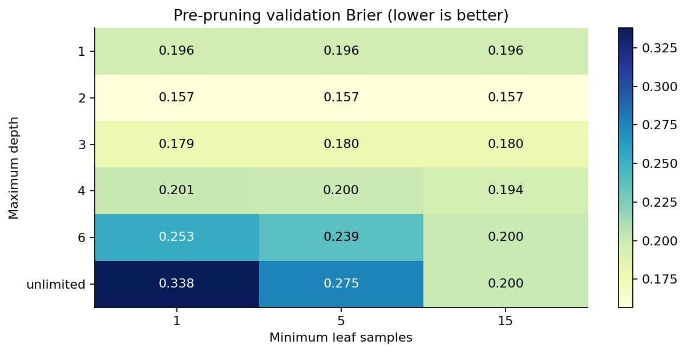
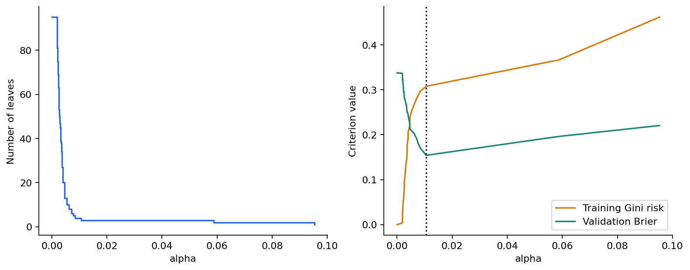
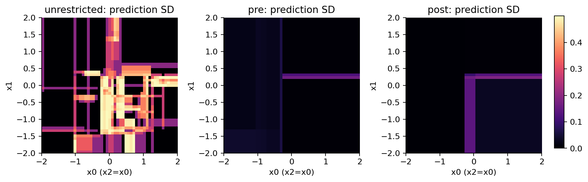
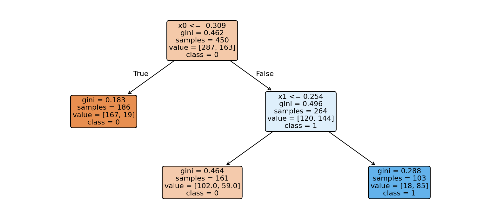

# 第059讲 树的复杂度与剪枝

## 1 一张越来越精细的地图

想象有人根据温度、压力等测量值判断一次实验会不会成功。开始时，他只画一条分界线；后来不断补充例外：“如果刚好落在这个小角落，就改判为成功。”最后，每个训练样本都有自己的小格子，过去的记录全部解释对了。问题是，明天一个新样本落到这些小格子里，这份规则还可靠吗？

第058讲解释了树怎样寻找分裂。本讲追问什么时候应该停止，以及已经长得太复杂时怎样退回来。训练纯度衡量模型对已有标签的迎合程度；泛化能力涉及未见对象。两者有关，却不能互相替代。本讲将把这句话变成一个可以重算、可以画图、可以故意破坏的实验。

读完以后，你应该能从样本数量说明一个叶子有多脆弱；手推代价复杂度剪枝的临界参数；只用训练数据建立路径，只用验证数据选树；最后在独立测试上报告结果。你还要能解释：剪枝通常减弱不稳定性，却没有让一条树路径变成因果证据。

直接先修是025偏差与方差、048概率评价、051交叉验证和058树的分裂。这里从二分类开始，标签为0或1，叶子输出训练正类频率。所有数据是原创合成数据，便于知道实验边界；没有真人信息或现实任务性能承诺。

## 2 树的大小有几种不同含义

根节点深度为0，每向下走一条边深度增加1。最大深度约束的是最远的一条路径，不是所有路径的平均长度。二叉树深度不超过d时，叶子最多有 $2^d$ 个，但实际树可以很不平衡，远远没有这么多叶子。

叶子数衡量输出多少块不同的区域。最小叶样本数衡量每块区域至少拥有多少训练证据。假设训练集有450行，要求每个叶子至少15行，那么叶子最多30个，因为这些叶子必须分割同一批450行。深度和叶样本约束可以同时使用；一个限制路径，一个限制每块区域的数据支持。

还有最小分裂样本数：一个节点至少拥有多少行，才被允许尝试继续分裂。它和最小叶样本数不同。例如节点有10行、允许10行以上分裂，但候选分裂可能把9行放一边、1行放另一边；若最小叶样本数是3，这个候选仍然非法。不能只看到一个参数里有“samples”就把二者混为一谈。[1]

颜色在本讲中承担固定含义：蓝色强调完整树或细分结构，橙色强调复杂度代价，绿色强调验证或保留下来的简化结构。它们帮助区分概念，不能代替图例和数字。

## 3 一个纯叶子究竟说明什么

若一个叶子只有一个正类训练样本，它会返回概率1。这里的1表示“这个训练区域内，已见样本的正类频率是1/1”，并不表示“未来事件绝对发生”。如果真实正类概率为0.6，只抽一个样本就观察到正类的概率仍有0.6。一个纯叶子可能来自非常有限的证据。

固定区域后，若叶中有m个独立同分布的伯努利标签，样本频率的方差是 $p(1-p)/m$。在p=0.5时，m=1对应方差0.25，m=25对应0.01。这个计算解释增加叶样本为何能稳定频率。实际树的区域也是用标签搜索出来的，所以不能把“固定区域”的抽样公式直接当成经过多次选择后的完整置信区间。

另一个危险是看训练概率的极端程度。一个完全长开的树可以让训练Brier损失降到0，因为每个训练标签都能落入同类叶子；在新数据上，错误且极端的概率会得到很重的惩罚。预测0.99而真实标签为0，Brier损失约0.9801；预测0.6时，损失是0.36。概率是否有用，需要拿未参与拟合的标签检验。

因此，本讲用验证Brier选择复杂度，而不是训练准确率。二分类Brier定义为 $(p-y)^2$ 的平均值，只计正类概率这一项。准确率仍报告，但它把概率0.51和0.99都转成类别1，无法完整反映概率质量。

## 4 预剪枝是在生长过程中限制选择

预剪枝并不是拿剪刀修改已经画好的树，而是给生长程序设置限制。最大深度、最小叶样本数、最小不纯度下降等条件，都可以让一条本来能继续细分的路径提前停止。这样通常节省计算，产物也容易解释。

代价是一次限制会改变后续可见的搜索空间。若第一步收益很小，但它打开了有用的下一步，过早停止可能错过后者。第058讲的XOR例子正说明这种局部障碍。预剪枝不是“找出全世界最好的小树”，而是在一个特定贪心生长程序中限制它能走多远。

本讲预先声明18组候选：最大深度1、2、3、4、6和不限，与最小叶样本1、5、15组合。每一棵树都只用同一份训练集拟合，在同一份验证集计算Brier。Brier完全相同时，优先叶子少、深度小的候选；仍然相同才选表中更早的一行。



这里的18不是神奇数字。它只是有限、事先写明、计算量可控的教学设计。真实研究中可以使用交叉验证；数据量小、群组相关或时间有顺序时，划分方式还要改变。不能在看过最终测试后继续添加候选，却把原测试集仍称为未见数据。

## 5 后剪枝比较整段分支是否值得保留

后剪枝先长出一棵较大的树，再考虑把某个内部节点连同所有后代替换为一个叶子。替换后，这个节点下所有输入共享该节点原有训练标签的均值或频率。这里不重新拟合新的分裂阈值，也不把被删掉的分支搬到另一处。

记完整树为 $T_0$，候选树T只能是它的根子树：可以删掉后代，但保留的节点必须连通到根。这是一个有边界的搜索问题。若完整树第一步就选错了特征，单纯剪枝无法创造另一条新的根分裂。

我们给一棵树两笔账：训练拟合风险R(T)，以及叶子数量 $|L(T)|$。本讲采用根样本数归一化的Gini风险：

$$R(T)=\sum_{\ell\in L(T)}\frac{n_\ell}{N}\,I_G(\ell),\qquad I_G(\ell)=2\hat p_\ell(1-\hat p_\ell).$$

N是整棵树的训练样本数，不能在每个子树内换一个分母。不然大分支和小分支的风险差会失去共同尺度。R(T)也不是错误分类比例；Gini惩罚的是类别混杂程度，即使多数类判断不变，概率和Gini也可能改变。

复杂度惩罚写成：

$$R_\alpha(T)=R(T)+\alpha|L(T)|,\qquad\alpha\geq0.$$

每增加一个叶子，就多支付α。α=0时只关心训练拟合；α很大时，增加叶子不划算，最后可能只剩一个根叶子。这里α的数值依赖风险的归一化和准则，不能把一个数据集里的α原封不动解释成另一个问题的普适标准。[2]

## 6 临界α从两笔账相等得到

设节点t下面当前有k个叶子，组成子树 $T_t$。保留它的局部代价是 $R(T_t)+\alpha k$；把它整个折成一个叶子的代价是 $R(t)+\alpha$。两者相等时：

$$R(t)+\alpha=R(T_t)+\alpha k,$$

$$\alpha_{\rm eff}(t)=\frac{R(t)-R(T_t)}{k-1}.$$

分子是删掉这段分支后增加的训练风险，分母是减少的叶子数。因此这个比值可读成“每省掉一个叶子要付出多少训练拟合”。最小的比值代表当前最不划算的细节，这就是最弱环节。

注意分母不是k。把k片叶子合成1片，只减少k−1片。节点本身的风险 $R(t)=n_tI_G(t)/N$ 也有根权重。两种常见错法，一种把分母写成k，另一种忘记 $n_t/N$，都会让路径在很小的例子上就偏离定义。

当α低于这个临界值，保留分支更便宜；高于它，折成一个叶子更便宜；恰好相等，两棵树在这个目标下并列最优。本讲在相等处采用较小的树，多个最弱环节并列时一起移除。数值实现用 $10^{-12}$ 的绝对容差处理计算舍入，不能把这种容差当成统计显著性。

## 7 手算一条完整剪枝路径

根节点有100行，正负各50。左节点50行，其中10个正类；右节点50行，其中40个正类。左节点继续分为40行中2正、10行中8正；右节点继续分为10行中2正、40行中38正。每个计数都与父节点相加一致。

四个叶子的Gini依次为0.095、0.32、0.32、0.095；乘以各自占根的比例0.4、0.1、0.1、0.4后，总风险为：

$$R(T_4)=0.038+0.032+0.032+0.038=0.14.$$

左节点若折成一个叶子，风险是 $0.5\times2(0.2)(0.8)=0.16$。原左子树风险0.07，所以临界α是 $(0.16-0.07)/(2-1)=0.09$。右节点完全对称，临界α也为0.09。

根节点若立刻折叠，风险0.5，当前临界α是 $(0.5-0.14)/(4-1)=0.12$。最弱环节不是根，而是左右两个分支。因此先在α=0.09同时折叠左右分支，得到两个叶子，总风险0.32。

剪完以后必须重算根。此时根下只剩两个叶子，临界值变成 $(0.5-0.32)/(2-1)=0.18$。如果还沿用初始的0.12，就会过早砍掉根分裂。这是剪枝路径为何需要迭代而不能一次排序结束的关键。


路径是4叶、2叶、1叶，风险0.14、0.32、0.50，临界值0、0.09、0.18。只剪左边或只剪右边得到的3叶树风险0.23，它们也合法，但在α=0.09之外不会严格优于图中的下包络；恰在该点，四种部分剪枝方案可并列。测试代码枚举了这个小树的全部五棵根子树核验结论。

## 8 从公式变成可审计的算法

pruning.py先从成熟库生长的树导出数组：左右子节点、分裂特征、阈值、训练样本数、Gini和正类频率。生长由库完成，本讲自己实现最弱环节路径、终止节点集合和预测。这样可以把注意力集中到剪枝机制，而不会误称整套树生长代码都是本讲从零编写。

当前树用一组终止节点表示。从根遍历时，一旦遇到终止节点，就不再访问其后代。每一轮只枚举仍可到达的内部节点，重新计算它下面当前的叶子、风险和有效α。选择最小值，将并列最弱分支折叠，再开始下一轮。

```python
collapsed = count[node] * impurity[node] / count[0]
current = sum(count[j] * impurity[j] for j in leaves) / count[0]
effective_alpha = (collapsed - current) / (len(leaves) - 1)
```

这三行说明定义，完整程序还处理可达性、相等值和根终止情形。父子节点若同时并列，先折叠父节点，子节点随后已不可达，不再单独处理。隐藏后代不是新的叶子；若把它们继续算进叶数，风险和复杂度会双重计数。

对一棵固定的有限树，反复处理最弱环节给出代价复杂度最优根子树的嵌套序列。这里的“最优”以这棵已长出的树和指定训练风险为前提，不是所有可能特征阈值组合上的全局最优，也不是对未来分布风险的保证。[2]

## 9 训练生成路径，验证选择路径

合成实验生成900行独立样本。前450行训练，随后225行验证，最后225行测试。四个输入中，x0和x1决定真实正类概率；x2是x0加小噪声的近似副本，x3是额外噪声。标签仍按对应概率随机抽样，不是一个可被无误识别的确定性规则。

真实概率分段为：x0≤−0.3时0.10；否则，若x1>0.25则0.82，其余为0.36。CSV含true_probability列，只用于解释合成总体，训练函数明确只读取x0至x3和y；它不是可被模型偷偷使用的第五个输入。

完整树长到95个叶子，深度11。它的训练叶子都是纯的，训练Gini风险0。我们用训练树形成37个路径状态，再为每个状态计算验证Brier。选择的是第35个状态，即从0开始编号34，α约0.010590696，3个叶子、深度2。



预剪枝的18组候选选择最大深度2、最小叶样本1，结果4个叶子。两条路线都只用验证集选择。本讲随后保留原训练集拟合的模型，不把训练集和验证集合并重训。这样路径节点、手工预测和最终测试结果可以一一追溯。

实际部署中可以在选好超参数后合并训练与验证重训，但要说明：样本数量变化后阈值、叶数和剪枝路径都可能改变；仍应保留独立测试。本文的“3叶子”是本次冻结模型的观察，不是这个α永远生成3叶树的保证。

## 10 打开测试集之前就写好报告方式

三个模型都要报告，不能在测试集上挑一个最好看的结果再隐去其余模型。常数基线使用训练正类频率，其概率也不能拿测试正类比例替代。

| 冻结模型 | 深度 | 叶子数 | 测试准确率 | 测试Brier |
|---|---:|---:|---:|---:|
| 不限复杂度 | 11 | 95 | 0.680000 | 0.320000 |
| 验证选择预剪枝 | 2 | 4 | 0.746667 | 0.163508 |
| 验证选择后剪枝 | 2 | 3 | 0.746667 | 0.164178 |
| 训练频率常数基线 | 0 | 1 | 0.608889 | 0.238978 |

预剪枝与后剪枝测试准确率相同，Brier略有差异。不能根据这一小差异宣称一种方法普遍优于另一种。它们在这个固定合成样本上的观察是：较小的树改善了测试概率误差，且少得多的叶子更易解释。


预测时，导出模型与库都先将输入转换成float32，再按“≤走左”比较。这是为了匹配生长器的数值语义。剪枝风险用float64累计；两种精度承担不同职责。我们在每两个相邻临界α之间取中点，与库的剪枝树比较全部测试概率，37个状态的最大差都是0。临界点附近的浮点平局另用精确小例子验证。

## 11 稳定性要用扰动实验观察

树的第一条分裂一变，后面所有节点拿到的数据也会变。即使只删掉少量训练行，某个几乎并列的候选也可能反超。x2是x0的近似副本，特别适合展示“很相似的输入可能竞争分裂位置”；它不代表模型发现了两个独立机制。

本讲另外做25次扰动，每次从450个训练行中无放回保留427行，即删掉约5.1%。三种策略使用同一批扰动行集合。预剪枝超参数和后剪枝α都冻结在原始验证选择结果，不在每个扰动样本上重新调参。这样观察的是“固定规则下训练样本轻微变化”的效应。

评价稳定性使用没有标签的51×51网格，仍固定x2=x0、x3=0。对每个网格位置，记录25个模型的概率标准差；再统计任意两棵模型类别预测不同的平均比例。后者是结构扰动引起的预测分歧，不是分类错误率，因为网格没有真实标签。



| 策略 | 网格平均概率方差 | 不同模型两两分类分歧率 |
|---|---:|---:|
| 不限复杂度 | 0.047088 | 0.098101 |
| 固定预剪枝参数 | 0.000917 | 0.004831 |
| 固定后剪枝α | 0.001668 | 0.027377 |

这个结果支持本实验中的复杂度控制降低了预测敏感性。它不能证明较稳定模型必然更准：一棵永远输出0.5的树非常稳定，也可能完全忽略有效信号。稳定性、预测风险和可解释性是互相关联但不同的观察维度。

## 12 为什么方差图不是置信区间

25次删行并不是从总体重新独立抽取25份完整研究样本；它们共享大部分原始数据。图中的标准差衡量指定扰动方案下模型输出的变化，既不是总体参数的标准误，也不是未来标签的不可约噪声。

同样，网格上的2601个位置不是2601名独立对象。相邻位置的树预测往往完全一样，或者一起跨过同一边界。不能把它们当成独立重复，随手计算一个很小的p值来证明剪枝有“显著优势”。

需要严肃比较算法时，应明确独立单位、重复抽样或外层验证方案、主指标、配对比较方法和调参流程。当前实验用来理解机制与检查实现；它的可信度来自每一步可重算，而不是样本量数字看上去很大。

## 13 看得懂一棵小树也要保留解释边界



例如某个节点使用x2，并不说明x2在科学机制上比x0重要。x2只是一个与x0高度相关的代理，有限训练样本可能使它暂时取得更好的分裂收益。改变测量装置、代理关系或输入分布，模型行为可能改变。

小树还可能保留很粗的偏差。若真实概率是平滑曲线，三块常数区域无法表达所有变化。剪枝不增加表达能力，而是用一部分训练拟合换取更少的自由度。对某些任务，这笔交换划算；对另一些任务，可能需要更多数据、不同特征或另一种模型。

叶样本数也不是自动的可靠性证书。100个高度相关的重复测量，不等于100个独立对象。若训练和验证把同一对象的不同记录分在两边，复杂度选择可以得到虚假的乐观结果。数据划分的独立性比树图看起来是否简洁更基础。[3]

## 14 独立检查究竟检查了什么

测试首先从训练标签重算每个节点的样本数和Gini，再枚举每个路径状态中的可达节点、终止叶子和有效α。每一行必须恰好到达一个终止叶子；每一次剪枝后叶数减少，训练风险不下降，有效α不下降。

测试还用另一段显式遍历代码重算所有验证概率，核对模型选择；然后重算全部测试指标和25次扰动。小树例子枚举所有合法根子树，证明这一次最弱环节结果与直接比较目标相同。纯类数据、空输入、非有限数、列数错误、超大float32输入、无效或重叠叶子集合都必须明确处理。

发布报告通过2751项显式检查，普通Python与python -O都执行同样的检查数量。这里没有用assert承担验收，因为优化模式可能移除assert。检查数量不是质量排名；重要的是它们覆盖不同定义，并且改坏结果真的会被发现。

读者可以复制结果JSON到outputs，把某个测试Brier改成0，再运行检查程序。正确的审计应该失败。若只是重新运行同一函数，然后把新结果覆盖旧结果，就永远不会发现原先的报告已经被改坏。

## 15 把结论带到自己的数据

首先写清预测对象、预测时点、可用输入和错误代价。其次确定独立划分单位；病人、设备、家庭或时间段可能比“行”更合适。然后限定超参数候选或内部交叉验证流程，封存最终测试集。

训练阶段可以追踪深度、叶数、最小叶样本、训练风险和验证指标；遇到极端小叶子，应检查它们是否只是在记住异常标签或采样噪声。选好模型后，保留它的训练数据版本、软件版本、参数和选择依据，再打开独立测试。

最后报告限制。一次较好的测试结果不能证明分布永远不变；一次稳定性改善不能证明因果解释成立；某个α选得很好，也不能让所有未来数据集沿用同一个值。树的优势是许多细节可以明确列出，所以更应该把这些细节写清。

本讲完整实验、12道练习和逐步答案见lab.md与answers.md。资料来源与访问记录见sources.md和source-checks.json。公式、计数例子、合成数据和代码为本讲原创；官方文档用于核对接口、准则和剪枝语义，而非作为性能结论的来源。

[1] [DecisionTreeClassifier官方参数](https://scikit-learn.org/1.8/modules/generated/sklearn.tree.DecisionTreeClassifier.html)。[2] [最小代价复杂度剪枝说明](https://scikit-learn.org/1.8/modules/tree.html#minimal-cost-complexity-pruning)。[3] [群组数据的交叉验证](https://scikit-learn.org/1.8/modules/cross_validation.html#cross-validation-iterators-for-grouped-data)。[4] [官方剪枝路径示例](https://scikit-learn.org/1.8/auto_examples/tree/plot_cost_complexity_pruning.html)。
