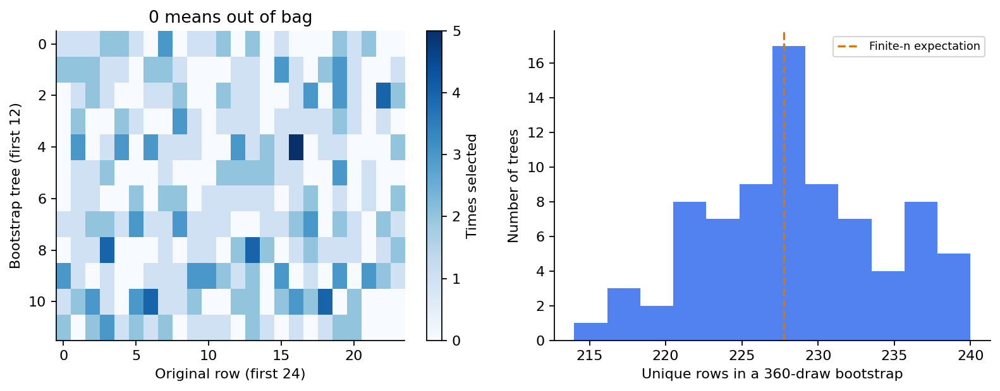
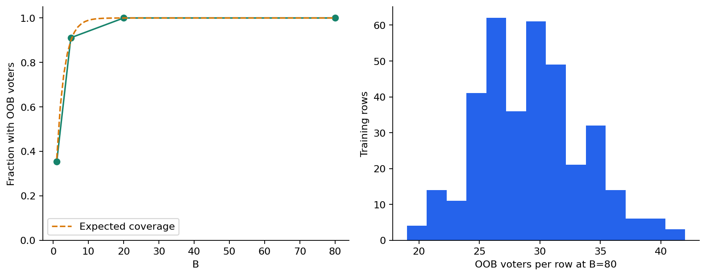

# 第060讲 实验指南

## 1 这次实验的目标

你将重建一个透明的bootstrap集成，追踪每棵树抽到哪些行，检查概率均值与OOB均值的分母，再比较m=1、3、8与B=1、5、20、80。最后要识别一个“行级OOB满分但新对象效果很差”的群组反例。

建议安排2至3小时，先做20分钟纸笔抽样与方差推导，再运行代码。全部CSV由原创生成器产生，不需联网下载。先读lecture.md第1至10节，并复习协方差与训练测试隔离。

## 2 安装与文件地图

用environment.yml创建Python3.12环境，或在已有环境按requirements.txt安装。bagging.py实现抽样、概率聚合和OOB；基树使用scikit-learn。experiment.py规定OOB选择先于测试读取；test_experiment.py负责独立重算。

```bash
python experiment.py --out outputs/result.json
python test_experiment.py --report outputs/result.json --out outputs/test-result.json
python -O test_experiment.py --report outputs/result.json --out outputs/test-optimized.json
python plots.py --report outputs/result.json --directory outputs/figures
python execute_notebook.py --out outputs/fresh-kernel.ipynb
```

预期普通与优化模式各通过859项检查。Notebook有逐步说明与6幅嵌入图。PDF重建需另外准备build-requirements.txt列出的Python和系统组件，再执行npm install和python build_pdf.py --directory outputs/pdf。默认输出不覆盖发布文件。

数值实验依赖与排版依赖分开，避免仅想研究bootstrap的读者也必须安装整套排版软件。作者验证了隔离Python环境，未另外创建全新Conda环境，详见verification.json。

## 3 抽样站 把每一票的资格查清

先不用代码，在纸上写A至E五行。三棵树分别使用A A C D D、B C C E E、A B B D E。为每棵树列出袋内行、袋外行和每行出现次数。再把表转置：逐行列出哪些树有资格给它OOB预测。

这个过程能暴露两个错误：把“没有走到这个叶子”误当作袋外；把一行在另一棵树袋外误当作对所有树袋外。袋外资格针对的是明确的一对“原始行、训练树”。

打开experiment-result.json中m=3的bootstrap_samples，选择第0棵树，用bincount数抽中次数。总计应为360；非零计数的个数是不同原始行数；等于0的编号就是袋外行。随后核对该树对这些行的预测，不能把所有训练行的拟合分数叫OOB。



## 4 平均站 检查软投票和硬投票

先手算三棵树概率0.49、0.49、0.99的两种聚合结果。之后取结果文件里的test_individual_probability，它的形状应为80×360。沿第0维平均得到每个测试行的集成概率；沿第1维平均只得到每棵树在所有测试对象上的平均概率，不能用于逐行预测。

用前1、5、20、80行树预测矩阵分别计算Brier，与curves核对。它们来自同一个80树集合的前缀。不要分别建立不同树数的新对象再期待它们与前缀逐项相同，因为随机数消费顺序也可能变化。

确认平均概率恰0.5时本实现判0。再检查只有类别0和只有类别1的极小训练数据，确保代码依据classes_对齐概率，而不是盲目索引第二列。

## 5 OOB站 缺少投票不能填零

从m=3、B=1开始看。覆盖率约0.352778，有些行的counts为0，相应probability为null。Brier只在有票行上计算，并且必须与覆盖率一起报告。填0会把“没有信息”变成“肯定是负类”，改变评价问题。

到B=5时覆盖率约0.911111，B=20和80时本次样本达到1。自行验证每个有票行的均值：对所有树筛选“这一行未被抽中”，把相应概率相加，再除以这一行自己的票数。不要除以B，也不要只检查袋外树数却仍把袋内概率加进去。



## 6 选择站 冻结特征数再读测试

检查experiment.py中selection出现的位置，它在第一次读取test.csv之前。最终m按80树满覆盖OOB Brier选择，候选只有1、3、8，选到3。测试曲线用于报告事先声明的比较，不能看完以后再把B改成一个新的“最优值”却仍声称测试未参与选择。

记录各m的单树平均Brier、集成Brier和描述性残差相关。解释为什么m=1相关最低却没有最低集成误差。注意相关系数是在固定测试行上的残差序列相关，不是固定x跨独立训练集重复的相关参数。

库随机森林也用80树、m=3、叶样本3，结果不要求与自建森林逐项相同。你应该核验的是把同一组库树概率自行平均能否恢复库预测，以及按库的实际bootstrap编号能否恢复库OOB。

## 7 群组站 拆穿一个漂亮的满分

group_train.csv含60个组，每组6行；组内输入和标签重复。group_test.csv来自另外60组。先确认两个文件group_id不交叉，再观察每组6行确实相同。不同组标签与输入独立，因此没有真实泛化信号。

行级OOB准确率为1.0，并不是因为模型学到了神秘规律。检查row_oob_sibling_fraction：约99.3753%的袋外行—树组合中，该树见过同组其他行。整组bootstrap则把对象编号作为抽样单位，只有全组都没被选中才允许OOB评价。

填写三种结果的准确率和Brier：行级OOB、整组OOB、新组测试。请明确最后两种也来自有限样本，不能因为数值不完全一样就宣布整组方法错误。新对象泛化问题的独立单位是组，不是重复测量行。

## 8 故障站 验证审计是否拒绝错误

复制报告到outputs/tampered.json。先把一个OOB票数增加1，再把一个集成测试概率改成0.99，最后把selection.max_features改成1。每次只改一项，分别运行普通与-O审计，应该明确失败。

另试对未fit模型预测、给出标签2、设置n_estimators=0或超过列数的max_features。程序应拒绝。只有一个训练样本时，OOB应保持缺失；这属于合法但不可评价的情况，而不是把缺失偷偷补成一个分数。

## 9 练习

1. n=5的一次bootstrap抽5次。推导某行未出现的概率和不同对象数量的期望，解释为什么不是精确36.8%与63.2%。
2. 在A A C D D、B C C E E、A B B D E三次抽样中，分别列出每行的袋外树集合。
3. 三个概率0.49、0.49、0.99的硬投票和软投票是什么？平均概率恰0.5时本讲如何处理？
4. 从一般协方差展开式推导等方差、等相关公式。若σ²=4、ρ=0.25，B=1、4、20以及趋于无穷时方差分别多少？
5. 给定训练数据的bootstrap随机数独立，为什么跨不同训练集的预测仍可能相关？为何跨测试行残差相关又是第三个对象？
6. 推导Brier的平均不等式，并说明它为什么不保证集成优于最好的一棵树。
7. 某行只有第2、第5棵树袋外，二者概率0.2、0.8，共有10棵树。OOB概率多少？若错误除以10得到什么？
8. 若某行一棵树袋外概率q=0.36，B=5时它至少有一票的概率多少？这个值是否保证每次实验恰好有同样比例的行被覆盖？
9. 为什么每节点特征子采样不同于每棵树永久选择一部分列？过小m可能损失什么？
10. 为什么用OOB反复调参后，获胜OOB分数不应当作完全未用过的最终测试分数？设计一个保留独立测试的流程。
11. 群组反例中，如果一行袋外，但同组另5行中的任意一行在训练里，能否用该树判断对新组的泛化？如何修改抽样和评价单位？
12. OOB与测试差异很大时，你会按什么顺序检查？至少包含覆盖率、分母、泄漏、调参和分布五类问题。

## 10 交付标准

提交五行手算表、方差推导、一个OOB行的逐树重算、m/B完整比较表、群组反例解释，以及三种篡改被拒绝的证据。写一个简短结论，区分数据中的观察、机制解释和未验证的泛化主张。

阅读answers.md核对过程。探索不同随机种子或不同树数应另存结果；不要覆盖发布数据，也不要把反复查看过的测试集继续当成全新测试。
