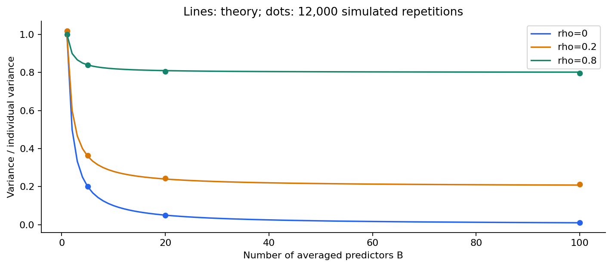
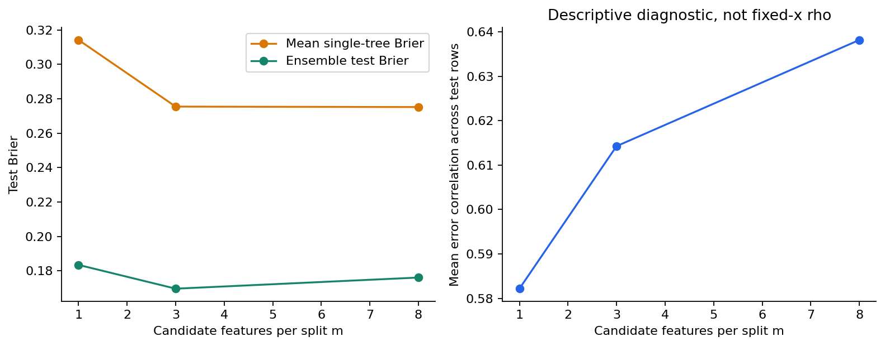
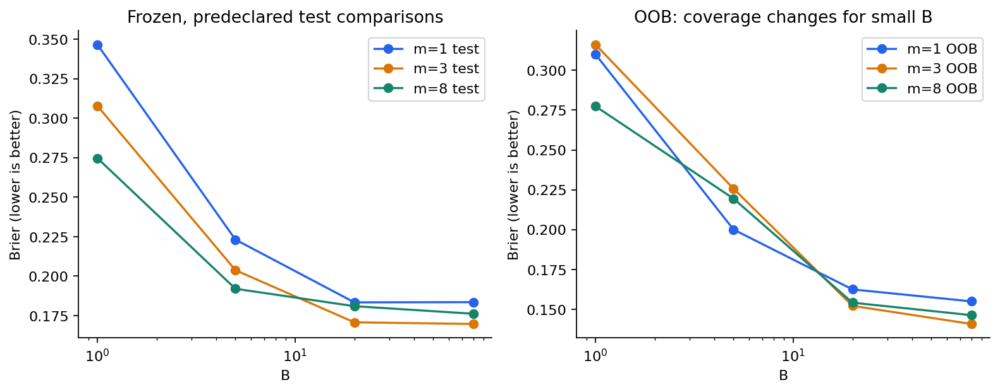
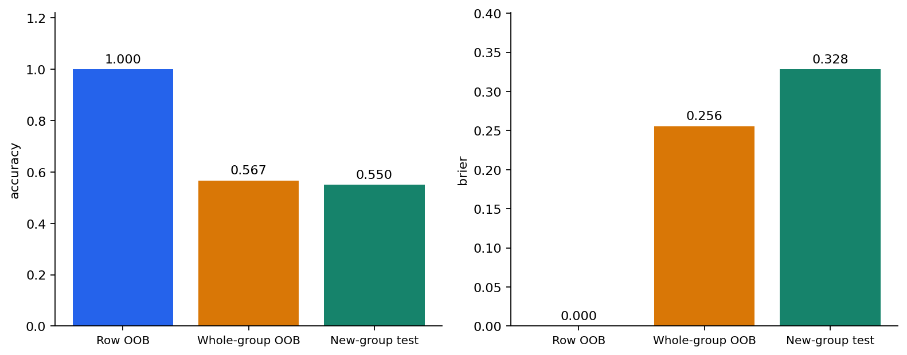

# 第060讲 Bagging与随机森林

## 1 让一群会摇摆的树一起预测

上一讲删掉少量训练行，一棵树的分裂位置和预测就可能改变。假如我们不急着选出其中一棵，而是让许多略有不同的树一起回答问题，会发生什么？只要它们的误差不是完全同步，平均有机会缓和某一棵树偶然走偏的影响。

这个想法很朴素，却有两个必须回答的问题。第一，手里只有一份训练数据，从哪里得到不同的树？第二，如果所有树都犯同样的错，增加数量为什么会有帮助？Bagging用重复抽样制造不同的训练版本；随机森林进一步让分裂时看到的候选特征有所不同。

本讲会从五行数据的抽样表开始，推导平均预测的方差，亲手实现bootstrap索引、概率聚合与袋外评价。随后比较特征数和树数，最后用一个同组重复测量的反例说明：没有被某棵树抽到的一行，仍可能通过它的“同伴”泄漏信息。

直接先修是021抽样、025偏差与方差、027协方差、051交叉验证、058至059决策树。这里的从零实现指集成机制，基学习器的树生长使用scikit-learn；不把调用库的部分包装成自行实现。主实验为原创合成二分类数据，所有图和数字都能离线重算。

## 2 有放回抽样不是复制一份数据

训练集有n行，编号0至n−1。一次bootstrap样本独立抽n次，每次都从这n个编号中等概率抽一个，抽完放回，所以同一行可能出现多次，另一行也可能一次都没有出现。抽样长度仍是n，不代表包含n个不同对象。

用五行A、B、C、D、E举例，一次结果可以是A、A、C、D、D。A和D各出现两次，C一次，B与E没有出现。将这个有重复的训练矩阵交给一棵树，相当于让本轮更重视A和D，而忽略B和E。下一棵树重新抽样，得到另一个版本。

Bagging是bootstrap aggregating的缩写：先bootstrap，再aggregate，也就是聚合。每棵树都可以独立训练；没有上一棵树把错例权重交给下一棵树的顺序依赖。第061讲的AdaBoost将是另一种机制，不能因为二者都有许多树就混为一谈。

本讲代码把全部抽样编号保存下来。一个抽样种子只能帮助复现，明确的编号还能让别人直接回答“第17棵树有没有见过第80行”。只保存最终准确率会丢掉这类重要证据。

## 3 为什么大约三分之一的行没有被抽到

固定一行i，一次抽样不选中它的概率为 $1-1/n$。n次抽样独立，因此它整轮都没有出现的概率是：

$$q_n=\left(1-\frac1n\right)^n.$$

n很大时，$q_n$ 趋近 $e^{-1}\approx0.3679$。因此被选中过至少一次的比例期望约为0.6321。用指标变量 $I_i$ 表示行i是否至少出现一次，则不同对象数U等于这些指标之和，所以：

$$\mathbb E[U]=\sum_{i=1}^n\mathbb E[I_i]=n(1-q_n).$$

这里使用期望可相加，不要求这些“有没有被抽到”的指标互相独立。它们实际上受总抽样次数限制，有依赖关系。

当n=5时，未抽中概率是(4/5)^5=0.32768，预计不同对象数3.3616。有限样本并不精确等于63.2%。本实验n=360，也使用精确有限n公式记录结果，不用一个四舍五入常数替代实际计算。

这些重复抽样不是凭空增加360个独立观测。原始证据仍只有那360行。它制造的是算法面对训练样本扰动时的不同响应，而不是新增实验对象。

## 4 聚合什么要先说清楚

回归树输出数值时，最常见做法是算术平均。二分类树可以先给类别再多数投票，也可以先给正类概率，再平均概率。本讲选择后者，写为：

$$\bar p(x)=\frac1B\sum_{b=1}^Bp_b(x),\qquad\hat y(x)=\mathbf1\{\bar p(x)>0.5\}.$$

B是树数。平均概率恰为0.5时，本讲判类别0，这与类别按0、1排列后的常见argmax平局约定一致。它不是所有应用的最佳决策阈值；代价不对称时需要另外在合适数据上决定阈值。

多数投票和平均概率可能不同。三棵树给正类概率0.49、0.49、0.99，硬投票有两票0，结果0；概率均值约0.656667，结果1。它们不是实现误差，而是聚合了不同的信息。本讲所有图表和Brier都基于概率平均。[1]

还有一个容易漏掉的边界：某次bootstrap可能只含一种类别。库的predict_proba这时只有一列。不能永远写“取第2列”，而要先检查classes_对应什么类；只有类别0时，正类概率应全为0；只有类别1时，应全为1。测试专门验证这两个情况。

## 5 从协方差推导平均的方差

固定一个输入x，考虑不同训练样本或随机化下得到的B个数值预测 $Z_1,\ldots,Z_B$。先不假设独立，平均的方差为：

$$\operatorname{Var}(\bar Z)=\frac1{B^2}\left[\sum_{b=1}^B\operatorname{Var}(Z_b)+2\sum_{b<c}\operatorname{Cov}(Z_b,Z_c)\right].$$

这个式子来自把平方展开，再用期望线性。它说明平均不能只看每棵树有多“摇摆”，还要看它们是否一起摇摆。若两棵树经常同时偏大、同时偏小，正协方差就会留下共同误差。

为了看清趋势，假设各预测方差都为 $\sigma^2$，任意两者相关系数都为ρ，那么协方差为 $\rho\sigma^2$。一共有B(B−1)/2对，所以：

$$\operatorname{Var}(\bar Z)=\sigma^2\left[\rho+\frac{1-\rho}{B}\right].$$

若ρ=0，方差为σ²/B；若ρ=1，方差仍是σ²；若ρ=0.2，B再大也只能让这个理想模型的方差接近0.2σ²。这里“接近下限”来自共同误差项，不是树数量还不够多。

例如σ²=1、ρ=0.2时，B=1、5、20、100分别得到1、0.36、0.24、0.208。把树数从1增到5带来明显变化，从20增到100的边际改善较小。这并不是训练时间的通用最优点，只是帮助理解收益递减。

## 6 “给定数据独立”与“误差相关”并不矛盾

有人会问：每棵树的bootstrap随机数独立，为什么还有相关性？关键在于我们在哪一层随机性上观察。

给定一份固定训练集，独立产生bootstrap和特征随机数，树的随机化可以条件独立。可是如果反复抽取整个原始训练集，再看同一x上的预测，不同树共享这一份原始训练数据中的偶然偏差。把原始训练集的随机性也计入以后，就会出现共同成分。

还有第三种常见诊断：固定已经训练好的许多树，在一批不同测试输入上比较它们的残差序列。两棵树可能都在同一类难样本上出错，于是这些序列相关。这个跨测试行的相关系数，与上一节固定x、跨训练重复的ρ不是同一个统计对象。

本讲结果保存的是第三种描述性诊断，字段名empirical_error_correlation。我们不会把它直接代入固定x公式，然后宣称精确预测了实际森林方差。讲清楚随机变量和条件，比记住一个漂亮公式更重要。

## 7 平均可以减少波动，却不会自动消除偏差

如果每棵树在一个区域都系统性低估真实概率，平均仍可能低估。共享错误的特征、错误的标签机制或不合适的数据划分，不会被80棵树投票修复。集成并不是“错误越多，平均以后就变正确”。

对于任意固定标签y，平方函数的凸性给出一个有用但有限的结论：

$$\left(\frac1B\sum_bp_b-y\right)^2\leq\frac1B\sum_b(p_b-y)^2.$$

也就是说，概率均值的Brier不超过这些树的平均Brier。这个不等式不需要树互相独立；对每一行都成立，所以对测试集平均也成立。但它没有说集成一定优于其中最好的一棵，更没有说一定优于一个完全不同的模型。

准确率含有0.5阈值，不是同一个凸损失。概率平均改善平均Brier，并不能直接推出每个输入的类别都变正确。对模型好坏的判断仍需要与任务一致的指标。

## 8 随机森林多加了一层特征随机化

普通树每次分裂通常检查所有d个输入特征。若有一个非常强的特征，多棵bootstrap树可能都在根部选它，形成相似结构。随机森林在每个节点随机挑选部分候选特征，再在候选中寻找较好分裂，让不同树有机会看到不同的切法。[2]

本讲d=8，考察每节点候选特征数m=1、3、8。m=8等于不做特征子采样，是本实现的纯Bagging条件；m=1或3加入随机森林式的节点特征随机化。注意不是每棵树从头到尾只保留固定的m列，也不是每个样本随机删掉m列。

成熟实现对“检查m个特征”还有一个实用边界：若抽到的候选无法形成合法分裂，搜索可能继续检查其他特征，以满足找到有效分割的条件。m是接口控制的候选规模，不宜理解成任何节点都绝对只读取m列。[2]

减小m常能降低相似性，也可能让每棵树更弱。如果只有一个强信号特征，某次分裂没抽到它，就可能暂时用噪声切分。目标是平衡基学习器能力和误差同步程度，而不是把相关性压到最低就结束。

## 9 袋外预测让没有见过这一行的树回答

对训练行i，定义 $\mathcal B_i$ 为没有抽到它的树编号集合。这些树的训练bootstrap不含第i行，可以用来形成袋外，也叫out-of-bag或OOB预测：

$$\hat p_i^{\rm OOB}=\frac{\sum_{b\in\mathcal B_i}p_b(x_i)}{|\mathcal B_i|}.$$

分母必须是这行实际拥有的袋外树数，不是总树数B。不同训练行的袋外树数不同。如果集合为空，预测应缺失，不能填0再把它当成模型输出。本讲结果用JSON的null记录缺失，并单独报告coverage，也就是有至少一个袋外投票的行比例。

五行例子中，第一棵抽A A C D D，第二棵抽B C C E E，第三棵抽A B B D E。A只能由第二棵评价，B只能由第一棵，C只能由第三棵，D只能由第二棵，E只能由第一棵。不能因为一行没有出现在某棵树的叶子里，就推断它袋外；必须检查它是否在整棵树的训练抽样中出现过。

这里每一行只有一票，非常不稳定。随着B增加，袋外票数期望为Bq_n。某行一张袋外票都没有的概率为 $(1-q_n)^B$，所以期望覆盖率为 $1-(1-q_n)^B$。它是随机期望，不保证有限实验恰好达到该比例。

## 10 OOB能做什么，又不能保证什么

在独立同分布行的合适设置中，OOB提供了一种利用训练集内部留出机制估计泛化表现的方法。它节省单独划出验证集的样本，但仍有几个条件：一行必须由没有训练过它的树评价，预处理不能偷偷利用全数据标签，独立单位必须正确。

OOB并不是一份完全独立、永远不会被使用的测试集。若反复比较很多特征数、深度、叶样本和特征工程，并挑OOB最好的方案，选择过程已经使用了这些标签。获胜OOB分数可能偏乐观，最后仍值得保留独立测试，尤其当研究要对外报告性能时。

本实验只在80树、m=1/3/8这三个事先声明的候选中，按OOB Brier选m；相同时选更小的m。80树时三个候选均满覆盖。选择完成以后才读取独立测试文件。B=1、5、20、80的曲线也是事先声明的教学比较，不在看完测试后决定一个新的最佳B。

有限树数下，每行OOB只用部分树，而最终预测用全部树；OOB模型的训练条件也略有差别。加上有限样本噪声，两者不会保证完全相等。把“很接近”或“差了一点”变成可解释的问题，比强迫它们数值一致更合理。[3]

## 11 主实验按什么机制生成

生成720个独立输入，每行8列。先生成独立标准正态，再令x2=x0加标准差0.3的噪声。标签概率为：

$$p(x)=\frac1{1+\exp[-(1.4x_0+1.8x_1-0.8x_0x_1)]}.$$

只让x0和x1直接决定概率，x2提供相关代理，其余为噪声。标签依概率抽样，所以即使知道真实p也不能保证每个标签都判对。前360行训练、后360行测试。CSV里的true_probability是教学真值，模型只读取x0至x7。

每个m都训练80棵树，最小叶样本固定3，树深度不单独限制。三个m使用完全相同的bootstrap编号和树随机种子，以便比较特征随机化。B较小时使用同一80树集合的前缀，不另外重新抽样，避免把“树数变化”和“换了另一组树”混在一起。

代码将索引、树种子、每棵树测试概率、OOB票数和概率完整保存。中间记录比只保存最终均值更占空间，但允许独立重算聚合、查找袋内泄漏，并验证每个图中的数字。

## 12 结果体现的是平衡而非单向规律

| 每节点候选特征m | 80树OOB Brier | 80树测试Brier | 测试准确率 | 描述性残差相关 |
|---:|---:|---:|---:|---:|
| 1 | 0.154854 | 0.183413 | 0.755556 | 0.582200 |
| 3 | 0.140659 | 0.169593 | 0.766667 | 0.614257 |
| 8 | 0.146194 | 0.176060 | 0.758333 | 0.638145 |

OOB选择m=3。单棵基线树的测试准确率0.700000，Brier0.266005。这里增加树并结合适度特征随机化改善了相对单棵树的测试结果，但m=1并没有最好。它虽然使残差序列相关性更低，也削弱了单棵树的能力。

这里的“单棵基线树”直接使用全部360个原始训练行；曲线中的B=1则使用第一份bootstrap样本。两棵树的训练数据与随机化不同，所以它们的分数不应强行相等。前缀比较始终固定在同一份80树集合内部。

对于m=3，B=1、5、20、80的测试Brier约0.307732、0.203670、0.170625、0.169593。大B使随机化平均更稳定，却不增加独立原始训练对象，也不自动消除共享偏差。把树加到无限多仍不能修正错误的数据问题。

## 13 与成熟随机森林对照的正确方式

同样设80棵树、m=3、最小叶样本3、bootstrap开启，库RandomForestClassifier的测试准确率为0.761111，Brier约0.169538。它与本讲简化森林数值接近，却不逐项相同。我们不据此声称它们使用了相同bootstrap或完全相同内部算法。

首先，随机种子的生成和消费顺序不同。其次，本讲显式复制抽到的训练行，库森林内部利用bootstrap出现次数作为样本权重；某些基于未加权样本数的停止条件可能因此表现不同。相同参数名不保证两个训练流程在每一个细节上等价。[4]

真正的实现核验应针对可比较的语义。本讲把库中每棵树的概率重新平均，结果与库总预测最大差0；又读取库每棵树的实际bootstrap编号，逐行重算OOB分母和均值，与库OOB概率最大差0。这里比较的是同一组库树的聚合，不把两组随机森林强行做位级匹配。

对于自建集成，独立测试重建每棵树、核对所有bootstrap索引和概率，再逐行只使用袋外树重算。这个过程同时检查“抽样是谁”“预测来自谁”和“平均除以谁”，三个环节少任何一个都可能掩盖错误。

## 14 群组反例 OOB也可能得到虚假的满分

现在换一个生成机制。训练数据有60个对象，每个对象重复测量6次，得到360行。一个对象的6行输入完全相同，标签也相同；不同对象的标签由独立公平硬币决定，与输入没有真实预测关系。测试集来自另外60个新对象，各自也重复6行。

如果按行bootstrap，一行虽然袋外，它的5个同组“兄弟”很可能已在训练样本里。深树只需记住这个对象的输入，就能准确回答袋外那一行。这并不是对新对象的泛化；模型见过与它几乎相同的对象记录。

本次统计全部10565个“树—袋外行”组合，其中10499个组合的树包含至少一行同组记录，比例约99.3753%。行级OOB准确率达到1.000000，Brier约0.000119；真正新组测试准确率只有0.550000，Brier约0.328315。

本讲还做整组bootstrap：每次抽60个对象编号，选中的对象带入其全部6行；只有完全未出现的对象才算袋外。它的OOB准确率约0.566667，Brier约0.255669，覆盖全部训练对象。它没有精确等于新组测试，因为样本有限、集成也不同，但明显拆穿了行级OOB的记忆优势。

## 15 评价单位决定结论的含义

如果部署目标就是预测已见设备的下一条几乎重复记录，行级留出的目标可能有一定意义，但仍要防止未来信息回流。若目标是新病人、新设备、新家庭或新地区，就必须让相应组完全隔离。不能把一种目标上的分数移用到另一种目标。

有时间关系时，简单按组仍可能不够。未来环境变化、标签延迟、全时期统计特征，都可能让过去看到了未来。评价方案要从预测发生时真正可用的信息出发，而不是由最方便调用的API决定。[5]

另外，重复6行不会把60个独立对象变成360个独立对象。本反例报告准确率便于直接观察，但若构建不确定性区间或显著性检验，应按独立组而非按行计算有效重复。精确到六位小数是复现记录的精度，不是结论有六位小数的统计把握。

## 16 代码结构和容易被忽略的边界

BootstrapEnsemble.fit检查有限非空二维输入与0/1标签，保存每棵树抽样和种子。individual_probabilities返回树数×样本数矩阵，predict_probability沿树维度平均。oob返回概率和票数，未获票处保留NaN，再在JSON中转换为null。

fit之前预测、树数不是正整数、特征数超过输入列数、标签不合法、空前缀和预测列数不符，都应明确报错。一个n=1的训练集，无论bootstrap多少次都会选中唯一一行，因此该行永远没有OOB票。正确行为是缺失，不能报出一个虚构的0准确率或1准确率。

简化实现为了审计保存很多中间概率，内存约随B×n和B×测试行数增长；实际部署通常流式累计，不保存每个中间数组。大规模训练还可并行，但必须保留随机数与数据版本的可复现记录。并行速度不改变统计定义。

当前独立测试通过859项显式检查，普通与-O模式都执行全部检查；另外核对协方差恒等式、Brier凸性边界、单类bootstrap和无OOB票样本。检查从原始数据和保存编号重建，不只相信报告中的总分。

## 17 研究中应该带走的判断顺序

先确认训练与评价单位独立，再确认输入在预测时可用；之后决定使用概率平均还是类别投票，确定主指标与调参流程。模型层面可以调整树数、候选特征数、叶样本数，但每次新增选择都消耗评价证据。

如果结果不好，先查是否有共享偏差、标签噪声、错误特征或分布变化。不要把“再加500棵树”当成自动解决方案。若OOB好而独立测试差，检查群组泄漏、选择次数、覆盖率、预处理和分布差异，而不是简单断言OOB失效。

本讲完成后，你应该能解释一个概率平均的分母、一个OOB缺失值、一个去相关与基学习器能力的权衡，以及一个近乎满分却没有真正泛化的反例。下一讲将改变训练组织方式：后面的学习器根据前面模型的表现继续构造，这就是提升方法的起点。

资料见sources.md。主要一手依据：[1] [BaggingClassifier概率聚合与OOB接口](https://scikit-learn.org/1.8/modules/generated/sklearn.ensemble.BaggingClassifier.html)；[2] [RandomForestClassifier](https://scikit-learn.org/1.8/modules/generated/sklearn.ensemble.RandomForestClassifier.html)与[Breiman原论文](https://www.stat.berkeley.edu/~breiman/randomforest2001.pdf)；[3] [OOB曲线官方示例](https://scikit-learn.org/1.8/auto_examples/ensemble/plot_ensemble_oob.html)；[4] [固定版本森林实现](https://github.com/scikit-learn/scikit-learn/blob/1.8.0/sklearn/ensemble/_forest.py)；[5] [群组验证说明](https://scikit-learn.org/1.8/modules/cross_validation.html#cross-validation-iterators-for-grouped-data)。公式推导、数据、图表和实验代码均为原创。
