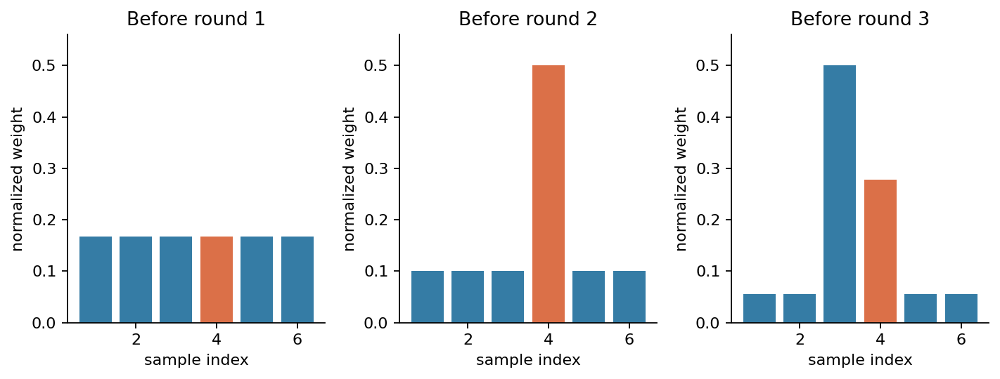
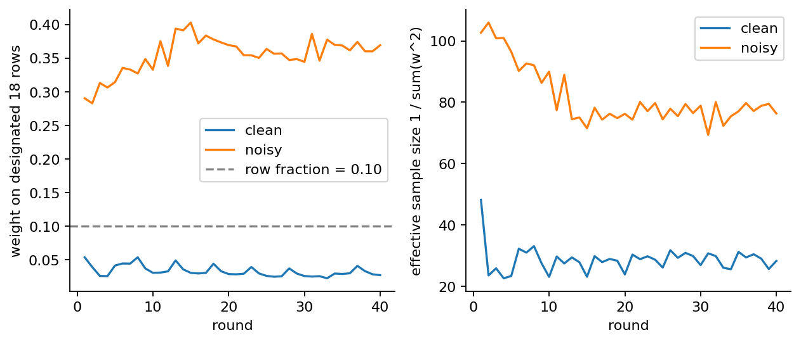

# 第061讲 AdaBoost实验手册

## 1 本次实验要交付什么

这个实验把二分类AdaBoost从纸笔计算推进到可审计代码。你会完成六行数据的两轮提升，运行一个从零实现，比较干净标签和10%训练标签翻转，并解释与成熟库结果不同的具体原因。最终提交不是一张准确率截图，而是一组能由别人重新运行并核对的文件。

开始前应知道：标签使用-1和+1，模型分数是多棵树桩的带权和，零分数判+1。样本权重表示训练目标对每行的关注量；它不是类别概率。正式配置固定40轮、学习率1，不允许看过测试曲线后改轮数再把新结果当成原方案。

建议按顺序保留五件东西：两轮手算表、实验JSON、普通和-O测试报告、实际执行过的Notebook、两段解释噪声与库差异的文字。全程可离线使用已随包冻结的数据；首次创建环境和安装依赖需要访问软件仓库。

目录里的lecture.pdf讲原理，answers.pdf解释习题；本手册本身给足命令、数据字典、操作步骤和成功判据，因此不必在多个文档之间来回找指令。完整实现位于adaboost.py，正式实验位于experiment.py，独立检查位于test_experiment.py。

## 2 环境与最小启动

建议为本讲建独立环境。已有Anaconda或Miniconda时，在解压后的061目录运行：

```bash
conda env create -f environment.yml
conda activate ml061
python experiment.py --out outputs/my-run/result.json
python test_experiment.py --report outputs/my-run/result.json --out outputs/my-run/tests.json
python -O test_experiment.py --report outputs/my-run/result.json --out outputs/my-run/tests-optimized.json
```

如果不用Conda，可在已有Python 3.12环境中运行python -m pip install -r requirements.txt。实验依赖与PDF依赖分开：不重建PDF时无需安装WeasyPrint或MathJax。确需重建时，再按build-requirements.txt和package.json安装构建依赖。

成功运行会写出JSON，而不是改写冻结的experiment-result.json。普通测试和-O测试都应显示status为passed、check_count为55。-O会移除Python的assert语句；本讲用显式异常检查，所以同样的检查不能因为优化模式而消失。

不要为了让测试通过而修改预期值。若浮点末位有差异，先核对Python、NumPy、sklearn版本，再看差异出现在指标、切点还是平局选择。正式版本记录在报告的versions字段中。

## 3 数据字典与隔离约定

|字段|含义|训练是否可用|
|---|---|---|
|id|带split前缀的唯一行号|只作追踪，不进模型|
|x0、x1|两个连续输入|是|
|y_clean|生成机制给出的干净类别|干净分支使用|
|y_noisy|训练集中18行被翻转后的类别|污染分支使用|
|flipped|该行是否被选作标签翻转|诊断专用，不进模型|

训练、验证、测试分别为180、120、240行。它们使用独立固定种子，生成代码保存在generate_data.py。验证与测试没有标签翻转，y_noisy与y_clean相同。污染实验只改变训练标签，两个分支使用同一批输入和同一组测试样本。

数据中的flipped列是教学中的“已知真相”。真实应用通常不知道哪些标签错了，因此不能把这个诊断变量当成部署时一定存在的特征。若把它交给模型，会改变问题，还可能引入严重泄漏。

生成数据的核验可以在新目录完成：

```bash
python generate_data.py --directory outputs/regenerated-data
python -c "from common import load_data; print({k: len(v['id']) for k,v in load_data().items()})"
```

每个CSV的摘要记录在data/generation.json。读取器同时检查摘要和固定生成器产生的字节。因此意外编辑数据后，单独更新摘要并不能让冻结实验继续运行。你可以另建明确标注的探索数据版本，但不要悄悄覆盖原实验。

## 4 先把两轮算完再看输出

在纸上写$x=(1,2,3,4,5,6)$与$y=(-1,-1,+1,-1,+1,+1)$，初始权重都是1/6。第一条规则在2.5切开，左负右正。先记录错分行，再求加权错误率，最后计算系数。不要先把程序输出抄到手算表里。

每轮至少写七列：旧权重、规则预测、是否错误、$y_ih_i$、乘法因子、归一化前权重、归一化后权重。检查新权重总和为1，再进入下一轮。

第一轮应只错第4行，$\epsilon_1=1/6$，$\alpha_1=\log5/2$。第二轮规则在4.5切开，只错第3行；第二轮错误率应是0.1，因为它按新权重计算。若你得到1/6，就仍在使用无权错误率。

现在运行一个最小片段，并逐项比较：

```python
import numpy as np
from adaboost import AdaBoost
X = np.arange(1, 7).reshape(-1, 1)
y = np.array([-1, -1, 1, -1, 1, 1])
model = AdaBoost(n_estimators=2).fit(X, y)
for row in model.history_:
    print(row['round'], row['error'], row['alpha'])
    print(row['weights_after'])
print(model.decision_function(X))
```

验收时，你需要解释第二轮后为什么仍错一行、错误行却换了；还要用间隔的负指数独立重算约0.447214的损失。仅核对分类结果不够，因为系数错一个共同倍数时，类别可能仍然一样。



## 5 读懂代码而不是只点运行

打开adaboost.py，按数据经过的顺序阅读。Stump.predict决定等于阈值走哪边；best_stump决定训练目标；fit决定权重和分数如何更新；decision_function返回实数分数；predict最后才把分数变成类别。

在best_stump里找出常数规则的位置。它们使常量特征和单类别情况有可解释的结果。在fit里找出no_edge和perfect_stump两种停止原因，分别写一句话说明为什么停止。不要把错误率0直接代入对数后接受无穷输出。

再找到logw变量。它保存的是权重的对数，updated先累加指数更新的指数部分，然后通过log-sum-exp归一化。用第一轮手算数据，把这段对数写法与普通乘法写法比较，应得到相同归一化权重。

代码中的learning_rate乘在系数上，不是乘在标签或最后分类结果上。把学习率改为0.5可以做额外探索，但要写入另一个输出目录，并明确这是新配置。此时最优$Z=2\sqrt{\epsilon(1-\epsilon)}$的闭式值不再适用于实际缩小后的系数。

## 6 运行冻结实验并解释噪声

执行experiment.py后，先看results.clean.metrics与results.noisy.metrics。这里训练准确率针对各自观测标签；验证与测试都针对干净标签。污染分支训练准确率约0.888889不能被误读为对干净训练标签的准确率。

|核验位置|应观察的数值|
|---|---:|
|干净分支测试准确率|0.9791666667|
|污染分支测试准确率|0.9166666667|
|污染分支最终翻转行权重总量|0.3692604884|
|干净分支最终同18行权重总量|0.0273721612|

这18行仅占训练行数10%。污染后其权重总量约36.93%，支持“翻转标签获得了更多关注”的解释。它不支持“任何高权重行都是错误标签”。你还应该检查正常边界样本、两个版本的间隔和最终区域图。

```bash
python plots.py --report outputs/my-run/result.json --directory outputs/my-run/figures
```

打开03_learning_curves.png和04_noise_concentration.png。分别说明训练目标和测试错误率使用哪一组标签，横轴0代表第几轮，以及曲线是否逐轮单调。对于有效样本数，解释为什么干净版本更小并不与污染行权重上升矛盾。



## 7 库对照与失败诊断

sklearn对照不是要求每个分数相同。先写下两项语义差异：本讲树桩选加权错分最少的阈值，库树选加权Gini改善的阈值；本讲系数是半对数，二类SAMME系数是完整对数。只在规则和错误率相同的前提下，两种归一化权重更新才等价。

若结果和冻结报告不同，按以下顺序检查：数据摘要和形状；标签编码；每轮错误率；首个分歧的阈值；系数约定；最后才看指标。不要用“随机性”笼统解释所有差异，本讲从零部分是确定性的，库随机种子也固定。

测试已包含错误维度、NaN、无穷、未拟合预测、零轮数、非法学习率、阈值等号、完美分类、无优势、常数标签，以及输出路径的符号链接和硬链接拒绝。你可以读测试代码学习怎样构造故障，不必破坏正式目录来证明它们存在。

保存报告后，测试会重新运行整个实验并逐项比较。故意把JSON中的一个准确率加0.1，测试应失败。只改一个摘要、或者同时改CSV与摘要，也应失败。这些是可复现完整性检查，不是对主动篡改全部源代码的全面安全系统。

## 8 Notebook与最终验收

```bash
python execute_notebook.py --out outputs/my-run/experiment.ipynb
bash build_all.sh
```

Notebook执行器在新Python进程中启动IPython内核，逐单元收集输出并保存；它不依赖你之前在交互界面里定义过的变量。默认build_all.sh把新结果放入outputs/rebuild，不覆盖课件里的冻结结果。若不需要PDF，可以只执行上面的数值、测试、图和Notebook命令。

最终说明应包含：采用什么数据与配置；手算和程序是否一致；55项检查是否在两种模式都通过；噪声对测试准确率和指定行权重有什么影响；为什么库分数不能直接与自写分数比较；这次单一合成实验有哪些不能外推的部分。

习题：1. 推导系数中的二分之一。2. 补齐两轮全部权重。3. 证明训练指数损失等于各轮Z之积。4. 解释错误率不变而损失下降。5. 写出学习率小于1时的真实Z。6. 解释完美规则和无优势的边界。7. 比较SAMME更新。8. 解读噪声行权重与有效样本数。9. 设计测试集泄漏反例。10. 给出能发现“忘了重新加权”的最小测试。详细解答见answers.pdf。
