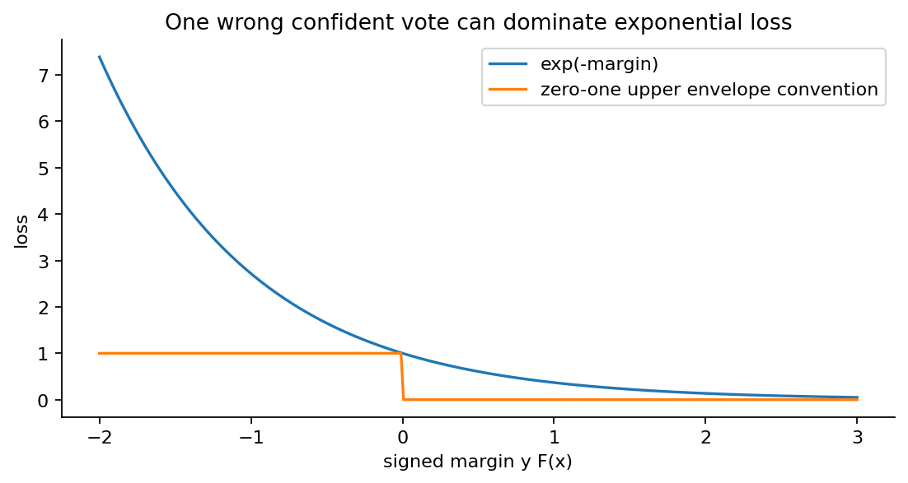
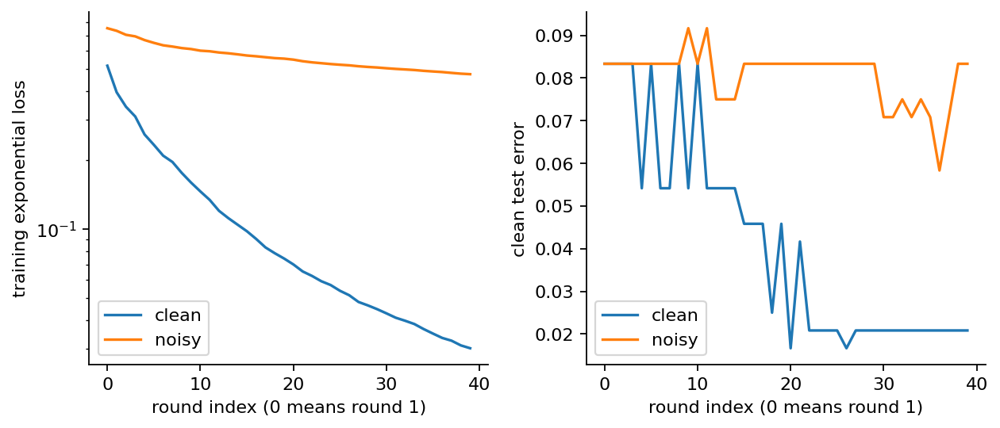
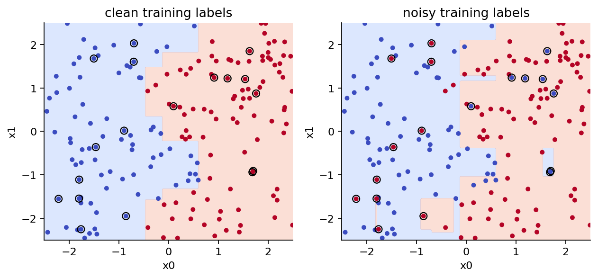
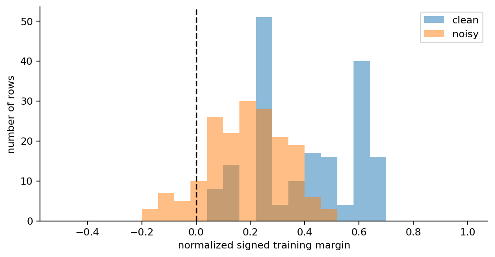

# 第061讲 AdaBoost与加性模型

## 1 从一条不够用的规则开始

一项检测任务有两个输入。第一条规则说：“第一列不大于某个阈值就判负类，否则判正类。”它容易检查，却会漏掉部分样本。我们可以再加一条规则，照顾第一条留下的困难区域。不过，这里有两个真正的问题：第二条规则应该怎样训练？两条规则意见不同时，谁的票更有分量？AdaBoost把这两件事联系到同一个损失函数上。

本讲研究二分类离散AdaBoost。所谓“离散”，是每个基学习器输出两个类别之一，而不是概率。我们会从指数损失推导每轮的样本权重、规则系数和归一化常数，再把六行数据完整手算两轮。最后用从零实现与原始合成数据考察标签翻转的影响。需要掌握的不是“错的样本权重变大”这句口号，而是为什么变大、相对谁变大、这会优化什么，以及它何时值得警惕。

直接先修为第023、032、042、045、058讲，涉及条件概率、梯度与优化、损失、分类和决策树。本讲仍逐一定义符号。读者只需能比较大小、求和，并愿意接受指数函数的导数等于自己。本文的实验固定40轮，使用数值特征和深度为1的规则，不涉及多分类、稀疏输入或生产级并行优化。

学习路线分三层。先弄清“分数”和“类别”的区别；再推导一轮更新；最后核验一串更新是否真的满足推导。实验里的准确率是有限样本上的观察，不能替代对算法条件的说明。也不能因为训练损失下降，就预先宣布测试表现一定改善。

## 2 加性模型到底加的是什么

第$i$行数据记为$(x_i,y_i)$，其中$x_i$是特征向量，$y_i\in\{-1,+1\}$。负类编码为$-1$，正类编码为$+1$。这个编码不是审美选择：它使“标签与预测符号相同”变成乘积为正，后面才能用一个公式同时处理两类。

第$m$轮训练出的规则记为$h_m(x)\in\{-1,+1\}$，其投票系数为$\alpha_m$。模型保存一个实数分数：

$$F_M(x)=\sum_{m=1}^{M}\alpha_mh_m(x).$$

分类时取分数的符号。本讲明确规定$F_M(x)=0$时判$+1$。分数2.4不是“240%的概率”，分数$-0.7$也不是非法输出。它们表示正负方向的合成证据，尚未经过任何概率校准。

“加性”意味着把多个函数的输出相加，不意味着原始输入必须线性。每一条树桩可以是阶梯函数，许多阶梯叠加后可以形成复杂的分段常数边界。另一方面，若始终使用单变量树桩，最终分数仍是各个单变量函数之和，因此不能任意表达所有特征交互。这也是基学习器选择的重要限制。

训练采用前向逐步方法：已经得到$F_{m-1}$后，保留旧规则，只寻找新规则$h_m$及系数$\alpha_m$。它没有重新联合优化之前所有阈值和系数，因此每步的最优不等于整套模型的全局最优。这个区别和第058讲树的贪心分裂相似。

现在考虑一次投票。若$\alpha_1=0.8$、$\alpha_2=1.1$，一个样本收到$h_1=+1$和$h_2=-1$，总分为$-0.3$，分类为负。模型没有把两票简单平均成平局；第二轮规则在当前加权问题上更可靠，因此获得更大的系数。

## 3 用间隔连接分类与损失

定义未归一化的有符号间隔：

$$m_i=y_iF(x_i).$$

当$m_i>0$时，分数符号与标签一致；当$m_i<0$时，分类错误；当$m_i=0$时，结果取决于约定的平局类别。为便于证明，上界可用$\mathbf1\{m_i\le0\}$把所有零间隔也计入，它至少覆盖实际错分事件。

只计“对或错”的0-1损失缺少平滑的变化信息。分数从$-5$改到$-0.1$，虽然已接近纠正，0-1损失仍是1。指数损失会看到这一变化：

$$\ell(y,F)=\exp(-yF),\qquad L(F)=\frac1n\sum_{i=1}^{n}\exp[-y_iF(x_i)].$$

当间隔为0时，损失为1；间隔为1时为$e^{-1}\approx0.368$；间隔为$-1$时为$e\approx2.718$。误判且非常自信的样本受到很大惩罚。这既解释了算法为什么关注困难样本，也埋下了对错误标签敏感的原因。图1同时画出指数曲线和将零间隔计入错误的阶梯上界。



逐行有$\mathbf1\{m_i\le0\}\le e^{-m_i}$，所以经验错分率不超过经验指数损失。这里的结论只涉及同一批训练样本；它没有声称未知测试样本的错误率也被这个训练数值直接控制。真正的泛化讨论还需要数据分布、假设类复杂度等条件。

另一种常见间隔定义是$y_iF(x_i)/\sum_m\alpha_m$。当系数都为正时，它位于$[-1,1]$，便于比较不同总投票强度的模型。未归一化间隔直接进入指数损失，归一化间隔用来比较投票结构；两者不能混写。

## 4 一轮优化为什么变成加权分类

现在固定旧模型$F_{m-1}$，尝试加上$\alpha h$。代入指数损失：

$$L(F_{m-1}+\alpha h)=\frac1n\sum_i e^{-y_iF_{m-1}(x_i)}e^{-\alpha y_ih(x_i)}.$$

前一项完全由旧模型决定，可以看成每行的“关注量”。把它归一化得到第$m$轮的样本权重：

$$w_i^{(m)}=\frac{e^{-y_iF_{m-1}(x_i)}}{\sum_j e^{-y_jF_{m-1}(x_j)}},\qquad \sum_iw_i^{(m)}=1.$$

它们不是新的标签，也没有修改训练行的输入；它们规定当前训练目标如何重视各行。初始模型$F_0=0$，因此所有指数项都是1，权重均为$1/n$。

对于离散规则，正确时$y_ih(x_i)=1$，错误时等于$-1$。定义当前规则的加权错误率：

$$\epsilon=\sum_iw_i^{(m)}\mathbf1\{h(x_i)\ne y_i\}.$$

正确行的总权重是$1-\epsilon$。因此除去一个与新规则无关的正因子，当前目标变成：

$$Z(\alpha,h)=(1-\epsilon)e^{-\alpha}+\epsilon e^{\alpha}.$$

当$\alpha>0$时，$e^{\alpha}>e^{-\alpha}$，所以较小的$\epsilon$给出较小的目标值。这就是“寻找加权分类错误率较小的规则”的来源。不是先凭直觉决定重加权，再事后发明一个公式；权重本身由旧模型在指数损失下的贡献导出。

注意，无权错误率与加权错误率可能排序相反。如果一条规则错2行，但那2行占总权重0.7，它比错4行且总权重只有0.2的规则更差。AdaBoost中的“弱”也不是简单指全程准确率刚过50%，而是希望每一轮相对于当轮权重有正的优势。

## 5 系数与归一化常数逐步推导

固定选中的规则，也就固定了$\epsilon$。对$Z$求导：

$$\frac{\partial Z}{\partial\alpha}=-(1-\epsilon)e^{-\alpha}+\epsilon e^{\alpha}.$$

令导数为零，将第一项移到另一边，再同乘$e^{\alpha}$，得到$\epsilon e^{2\alpha}=1-\epsilon$。当$0<\epsilon<1$时，取对数可得：

$$\alpha^*=\frac12\log\frac{1-\epsilon}{\epsilon}.$$

二阶导数为$(1-\epsilon)e^{-\alpha}+\epsilon e^{\alpha}>0$，所以这个驻点是严格最小值。错误率越小，系数越大；当$\epsilon=1/2$时系数为0；大于1/2时系数为负。若候选规则包含正反两种方向，翻转一个错误率大于1/2的规则会变成小于1/2。因此本讲枚举正反方向，只接收正系数规则。

将最优系数代回$Z$：

$$Z_m=2\sqrt{\epsilon_m(1-\epsilon_m)}.$$

当$0<\epsilon_m<1/2$时，$Z_m<1$，这轮会降低指数损失。若写成$\epsilon_m=1/2-\gamma_m$，则$Z_m=\sqrt{1-4\gamma_m^2}$。利用$1-u\le e^{-u}$，可得到训练错误上界随累计优势下降的结论，但前提是每轮确实有正优势。

标准更新后的权重为：

$$w_i^{(m+1)}=\frac{w_i^{(m)}e^{-\alpha_my_ih_m(x_i)}}{Z_m}.$$

错误行乘$e^{\alpha_m}$，正确行乘$e^{-\alpha_m}$，然后共同除以$Z_m$。一句“错误权重增加”容易漏掉两个要点：所有权重最后要归一化，而且错误行与正确行的相对倍数是$e^{2\alpha_m}$。

本讲还保留学习率参数$\nu\in(0,1]$，实际系数为$\nu\alpha^*$。这时仍按实际系数计算$Z$，不能继续把它机械写成$2\sqrt{\epsilon(1-\epsilon)}$；后者只在$\nu=1$且非完美规则时成立。正式比较实验固定$\nu=1$。

## 6 六个样本的第一轮手算

下面每一行只有一个输入，按数值顺序排列。树桩只能切一刀，并给切点两侧各一个类别。所有行初始权重相同。

|行号|$x$|标签$y$|第一条规则$h_1$|是否错分|
|---|---:|---:|---:|---|
|1|1|-1|-1|否|
|2|2|-1|-1|否|
|3|3|+1|+1|否|
|4|4|-1|+1|是|
|5|5|+1|+1|否|
|6|6|+1|+1|否|

第一条规则是$x\le2.5$时判$-1$，否则判$+1$。它只错第4行，所以$\epsilon_1=1/6$。规则$x\le4.5$时判负也只错1行；两者平局。本讲按阈值从小到大枚举，保留先遇到的2.5。平局约定必须记录，否则两份正确实现也可能从第一轮开始走不同路径。

$$\alpha_1=\frac12\log5\approx0.804719,\qquad Z_1=\frac{\sqrt5}{3}\approx0.745356.$$

正确行的未归一化权重为$(1/6)/\sqrt5$；错误行是$(1/6)\sqrt5$。共同除以$\sqrt5/3$后，正确行各为$1/10$，第4行为$1/2$。检查总和：五个0.1加一个0.5恰好等于1。

第一轮分数为$\alpha_1h_1$，训练错分率为$1/6$，指数损失为$Z_1$。第4行权重变成0.5，不表示它的标签有50%可信度；只表示下一轮加权目标的一半集中在这行。


从图2应读出一个动态过程：困难不是样本的固定身份。当前模型修改后，下一轮的困难行可能改变。如果程序把第一轮的错例永久标成“重要”，就没有实现AdaBoost的递推。

## 7 第二轮手算与整体预测

第二轮权重为$(.1,.1,.1,.5,.1,.1)$。现在选$x\le4.5$时判负、否则判正的规则$h_2$。它纠正第4行，只错第3行。当前加权错误率为0.1，而不是无权错误率$1/6$。

$$\epsilon_2=\frac1{10},\qquad\alpha_2=\frac12\log9=\log3\approx1.098612,\qquad Z_2=0.6.$$

对第二轮的正确行，权重乘$1/3$再除以0.6；错误行第3行乘3再除以0.6。结果为：

$$w^{(3)}=\left(\frac1{18},\frac1{18},\frac12,\frac5{18},\frac1{18},\frac1{18}\right).$$

第4行虽然这次判对，但仍保留$5/18$的权重，因为它在进入第二轮前已经很重。一次判对不会抹去旧模型造成的全部关注量。第3行现占一半，是下一轮最需关注的对象。

|行号|$h_1$|$h_2$|两轮分数$F_2$|最终类别|有符号间隔|
|---|---:|---:|---:|---:|---:|
|1、2|-1|-1|-1.903331|-1|1.903331|
|3|+1|-1|-0.293893|-1|-0.293893|
|4|+1|-1|-0.293893|-1|0.293893|
|5、6|+1|+1|1.903331|+1|1.903331|

两轮后仍然错1行，但错例从第4行移到了第3行。分类错误率没变，指数损失却从约0.745356降到：

$$L(F_2)=Z_1Z_2=\frac1{\sqrt5}\approx0.447214.$$

这是一个很重要的反例：代理损失下降，不要求每一轮0-1错误率严格下降。整体模型可能以提高许多正确样本的间隔，换取少数样本的暂时错分。反过来，看到准确率暂时不变，也不能据此断言梯度或权重更新没有工作。

你可以独立核验最后这个数字：把表中的六个间隔分别取负指数，再求平均，结果应与$Z_1Z_2$相同。实验和测试同时检查这两种计算路径，避免公式和代码共同抄错而不自知。

## 8 从零实现的接口与边界

文件adaboost.py实现完整训练循环，不调用sklearn。每个树桩保存特征编号、阈值和左侧类别，右侧取相反类别；额外允许恒为正或恒为负的常数规则。常数规则保证常量特征和单类别训练集有明确行为。

训练时，对每列的相邻不同值枚举切点，再枚举正反方向，计算加权0-1错误。相同值不能被分到两侧。等于阈值走左。实现选择较小的特征编号、较小的阈值及固定方向顺序来打破平局。这是教学版本，朴素搜索的代价较高，却便于把每个候选与纸笔计算对应起来。

核心递推可以缩写成以下代码。真正的文件还包括形状、有限数值、标签和参数检查。

```python
weights = np.exp(logw)
stump, error = best_stump(X, y, weights)
alpha = 0.5 * np.log((1 - error) / error)
prediction = stump.predict(X)
updated = logw - alpha * y * prediction
maximum = updated.max()
logZ = maximum + np.log(np.exp(updated - maximum).sum())
logw = updated - logZ
F += alpha * prediction
```

权重用对数保存，归一化时先减最大值再取指数。这种log-sum-exp写法降低了长乘法产生下溢的风险。它仍是浮点计算，而不是无限精度证明；极端多轮实验可能需要更严格的数值诊断。正式实验只用40轮。

若$\epsilon=0$，理论最优系数趋向正无穷。代码使用$10^{-15}$作为错误率下限，得到有限系数后立即停止，并记为perfect_stump。这是明确记录的工程约定，不能说公式在零点本来就有限。若最佳错误率达到$1/2$，记录no_edge并停止；若一条有用规则也没有，分数为0，按本讲平局策略预测正类。

输入含NaN或无穷会被拒绝；模型不擅自把缺失值当0。预测维数不匹配也会报错。所有验证使用显式异常，运行Python的-O选项不会把保护删掉。良好的算法实现既要在正常数据上正确，也要在不支持的输入上明确失败。

## 9 实验设计与库语义对照

原创数据有两个均匀分布在$[-2.5,2.5]$的特征，干净标签由$x_0+0.8\sin(2x_1)$的符号决定。训练180行、验证120行、测试240行，各自使用独立固定随机种子。噪声版本只翻转训练集中的18行标签，特征、验证集和测试集均保持不变。因此两种训练结果的差别能较清楚地与这次训练标签污染联系起来。

两个版本都用40轮树桩。这个轮数是实验方案的一部分，不是看到测试曲线后挑出来的。图中的测试逐轮曲线用于解释这次冻结实验；若把最低点拿来决定停止轮数，就会破坏封存测试的角色。真正的选择应在训练与验证层完成，然后只做一次最终测试。

库对照使用scikit-learn 1.8.0的AdaBoostClassifier和深度1决策树。这里有两处必须先说明的语义差异。第一，本讲树桩直接最小化加权错分率；库的决策树用加权Gini选择分裂，两者一般不等价。第二，二类SAMME的规则系数为$\log[(1-\epsilon)/\epsilon]$，是本讲半对数系数的2倍。[2][3]

两种权重写法可以等价：SAMME让正确行乘1、错误行乘$e^{2\alpha}$；本讲让正确行乘$e^{-\alpha}$、错误行乘$e^{\alpha}$。后一组全部乘$e^{\alpha}$就得到前一组，共同缩放在归一化后消失。但这只说明“同一条规则序列、同一错误率”时的权重等价，不说明不同分裂目标训练出的规则也相同，更不说明两个API返回的原始分数可以直接相减。

|训练标签|从零训练准确率|从零验证准确率|从零测试准确率|库测试准确率|
|---|---:|---:|---:|---:|
|干净|1.000000|1.000000|0.979167|0.983333|
|翻转10%|0.888889|0.916667|0.916667|0.929167|

这些是随附experiment-result.json的实际结果。干净训练的240个测试样本中错5个，污染训练错20个。差15个是一项明确观察，但它来自一个数据生成机制和一次固定划分，不能泛化为“所有任务加10%噪声都下降6.25个百分点”。

## 10 标签噪声怎样改变注意力



干净训练的最终指数损失约0.030078，污染训练约0.475375。噪声并没有让每轮优化失效：两个版本仍在减小各自观测标签对应的指数损失。问题在于污染版本优化的是错误标签参与定义的目标。模型无法凭“损失大”自动区分罕见但真实的样本与标错的样本。

追踪那18个指定行的总权重，可得到更直接的解释。在干净版本中，它们只是随机指定的普通训练行，最终总权重约0.027372；在污染版本中，它们的最终权重达到约0.369260，而它们只占行数的10%。这说明这批被翻转的标签吸收了明显更多的训练关注量。


权重有效样本数定义为$N_{\mathrm{eff}}=1/\sum_iw_i^2$。均匀权重时它等于$n$；若权重几乎全在一行，则接近1。这个数表达“当前加权目标分散到多少行”的程度，不是统计上新增或删掉了多少个真实观测。

本次干净版本最终有效样本数约28.32，污染版本约76.34。乍看与“噪声使权重集中”的直觉不一致，其实并不矛盾：干净数据后期可集中在少数困难边界行；污染数据可能把关注量分散到多个相互冲突的噪声行。要判断噪声影响，应看已知翻转行的权重质量、间隔、分类变化等联合证据，不能把一个集中度指标当成噪声探测器。

## 11 看边界也要看间隔



边界图把分数压缩成正负两个区域，适合看“哪里改判了”。它会丢掉分数幅度：一个点以0.001获正票和以5获正票，在图上颜色相同。间隔图补充这部分信息。



当所有训练样本已经分对，继续增加规则仍可能扩大部分间隔，因此训练指数损失还会下降。但是，边界附近的干净新样本可能同时受到不利变化，特别是在标签噪声或分布改变下。AdaBoost并没有一个“训练准确率达到100%就从此安全”的机制。

处理疑似异常标签时，合理步骤是回到数据定义和标注过程核查，而不是根据模型的高损失直接删除。真实少数群体、罕见病例或边界样本也可能难学。删除这些行可能掩盖系统弱点。验证集早停、降低学习率、控制基学习器复杂度等措施能限制拟合程度，但不能自动修复错误的业务标签。

本讲没有根据结果重新调参，也没有声称树桩是该数据的最优选择。它把算法行为拆开，使读者可以指出究竟是优化目标、基学习器能力、样本权重还是数据质量在影响结果。

## 12 把理解变成可检查的证据

独立测试从六行手算开始，核验两轮错误率、系数、权重、投票、指数损失及$\prod_mZ_m$恒等式；再用另一个穷举写法核对树桩最小加权错误。它还测试完美分类、无优势、常量特征、单类别、阈值等号、极大有限数、未拟合模型、错误维度以及非有限输入。

数据文件不仅有SHA-256摘要，读取时还与固定生成器重新产生的字节核对。测试故意同时改动CSV与摘要，仍应被拒绝。这保护的是本讲冻结数据与实现之间的对应关系，不是对恶意修改整个代码仓库的密码学防御。程序还重新运行实验，逐项核对保存的报告，并故意篡改准确率、系数和权重，验证报告检查会失败。

本讲正式测试在普通模式和-O模式各通过55项检查。阅读这个数字时，重点应是检查覆盖什么，以及失败会怎样表现；“55”本身不构成任何形式化证明。Notebook在新Python进程中的IPython内核执行，保存每个代码单元的输出；没有把浏览器界面或网络套接字传输当成已测试范围。

学习结束时，应能回答四个问题：为什么权重与旧间隔的负指数成比例？为什么系数有二分之一？为什么第二轮仍错一行却降低了目标？为什么翻转标签可能占据较大权重？如果能够把它们都连接到同一个$L(F)$上，就已经具备进入第062讲函数空间梯度提升的基础。

## 参考资料

[1] Freund Y, Schapire R E. A Decision-Theoretic Generalization of On-Line Learning and an Application to Boosting. Journal of Computer and System Sciences, 55(1), 119–139, 1997. 原论文的在线学习与提升框架；本讲的逐行数值例子为原创。作者论文全文：https://www.schapire.net/papers/FreundSc95.pdf 。

[2] scikit-learn 1.8.0. AdaBoostClassifier API. 参数、弱学习器与离散SAMME接口说明：https://scikit-learn.org/1.8/modules/generated/sklearn.ensemble.AdaBoostClassifier.html 。

[3] scikit-learn 1.8.0 source, sklearn/ensemble/_weight_boosting.py. 用于核对错误率、系数与样本权重更新的实现约定：https://github.com/scikit-learn/scikit-learn/blob/1.8.0/sklearn/ensemble/_weight_boosting.py 。

资料在线核验日期为2026-10-07。本文公式按明确的标签与分数约定自行推导；库版本固定为1.8.0，不能把滚动更新的stable文档视为冻结接口。
