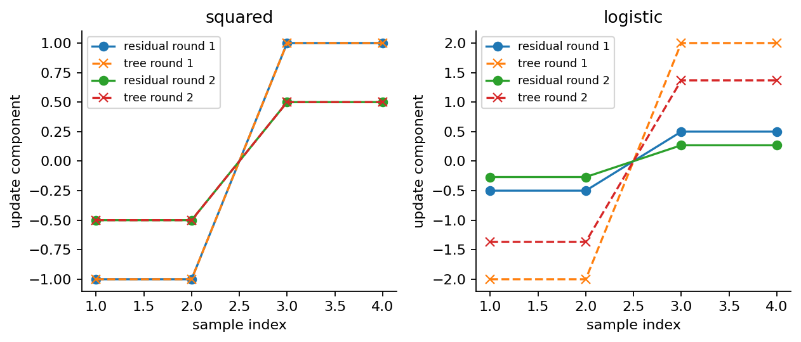
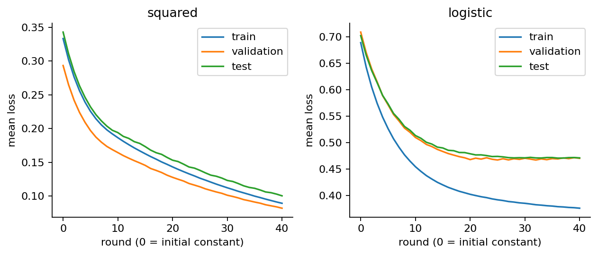

# 第062讲 梯度提升实验手册

## 1 先确定损失与分数的语言

本实验从零实现小型GBDT，分别处理连续值回归和二分类。关键验收不是“最后能预测”，而是每一轮的伪残差、树方向、步长、原始分数和真实损失都能对上。你还会用有限差分核验导数，并把40轮输出逐阶段与sklearn比较。

回归损失为半平方损失，报告中的数值等于通常MSE的一半。分类标签为0和1，模型原始分数F是完整logit，正类概率为sigmoid(F)。分类伪残差是y-p，既不是y-F，也不是对概率p求导得到的量。每次计算前先在纸上写清这三项约定。

正式实验用深度1回归树、最小叶样本数3、学习率0.1、40轮。树结构通过伪残差平方误差选择；分类叶值随后采用一步Newton修正。代码还提供gradient模式，用于区分纯一阶更新与Newton叶值，正式库对照采用后者。

需要提交两组两轮手算、一次冻结实验、两种模式的独立测试报告、执行过的Notebook，以及一段对学习率和验证曲线的解释。所有数据是随包可重建的原创合成数据，不需要下载外部数据集。

## 2 环境与运行入口

在062目录执行以下命令。若已有满足requirements.txt的独立Python环境，可跳过Conda创建步骤。

```bash
conda env create -f environment.yml
conda activate ml062
python experiment.py --out outputs/my-run/result.json
python test_experiment.py --report outputs/my-run/result.json --out outputs/my-run/tests.json
python -O test_experiment.py --report outputs/my-run/result.json --out outputs/my-run/tests-optimized.json
```

第一条实验命令会输出回归和分类的测试损失以及最大阶段差。测试脚本会重新计算实验，所以运行时间比读取JSON稍长。它不会只检查status文本，而会核验手算、有限差分、阶段累积、边界输入和报告内容。

PDF构建有单独的可选依赖，见build-requirements.txt与package.json。只做算法实验无需安装排版工具。首次安装需联网；完成环境与数据准备后，所有数值实验、Notebook和PDF均能在本地离线运行。

如出现ModuleNotFoundError，先确认当前python属于激活后的环境；如出现版本差异，查看报告versions字段。不要通过放宽所有误差容限或删掉失败测试来“修好”实验，应该先定位最早发生分歧的阶段。

## 3 数据字典与禁止泄漏的列

|字段|含义|使用方式|
|---|---|---|
|id|带split前缀的唯一行号|追踪和隔离检查|
|x|一个连续特征|两种模型的唯一输入|
|y_reg|含噪声连续标签|回归目标|
|y_class|按真实概率抽样得到的0/1标签|分类目标|
|true_mean|回归条件均值|只用于解释图|
|true_probability|分类条件正类概率|只用于解释图|

训练160行、验证100行、测试220行。每个split有独立固定种子。true_mean和true_probability在真实预测任务中通常未知，绝不能把它们加入X；否则模型得到的是生成答案的额外信息，实验问题已改变。

```bash
python generate_data.py --directory outputs/regenerated-data
python -c "from common import load_data; print({k: len(v['id']) for k,v in load_data().items()})"
```

读取器检查CSV摘要和固定生成器的原始字节。即使CSV与摘要同时被改动，也会拒绝。数据再现与模型再现是两层检查：先确定输入相同，再讨论算法输出的浮点容差。

## 4 手算并运行两轮回归

取X为1、2、3、4组成的一列，y为1、1、3、3。初始常数是训练均值2。学习率设0.5，最小叶样本数改为1，使这四行可以按2.5切开。

在纸上写初始预测、残差、树叶值、乘学习率后的修正和新预测。第一轮残差应为-1、-1、1、1；树拟合它们；新预测应为1.5、1.5、2.5、2.5。第二轮残差的幅度减半，继续更新后预测为1.25、1.25、2.75、2.75。

```python
import numpy as np
from gbdt import GBDT
X = np.arange(1, 5).reshape(-1, 1)
y = np.array([1., 1., 3., 3.])
model = GBDT('squared', n_estimators=2,
             learning_rate=.5, max_depth=1,
             min_samples_leaf=1).fit(X, y)
print(model.init_)
print(model.losses_)
for stage in model.history_:
    print(stage['pseudo_residual'], stage['direction'], stage['score'])
```

成功判据：初始与两轮后的半MSE为0.5、0.125、0.03125。若得到1、0.25、0.0625，你算的是MSE，需在报告中统一单位，不能把两种结果说成算法不同。若第二轮方向仍为最初的±1，则你没有重新计算残差。

## 5 同样四行换成分类

将标签改为0、0、1、1。初始正类比例0.5，初始logit为0。第一轮伪残差为±0.5，但Newton叶值是±2。学习率0.5使新logit为±1，而不是±0.25。

```python
from gbdt import sigmoid
labels = np.array([0., 0., 1., 1.])
newton = GBDT('logistic', 2, .5, 1, 1,
              logistic_update='newton').fit(X, labels)
first_order = GBDT('logistic', 1, .5, 1, 1,
                   logistic_update='gradient').fit(X, labels)
print(newton.losses_)
print(newton.predict_proba(X))
print(first_order.decision_function(X))
```

Newton模式初始与两轮损失约为0.693147、0.313262、0.170284。一阶模式第一轮logit为-0.25、-0.25、0.25、0.25。两者都依据y-p选择修正方向，但使用不同叶值尺度，不能把一种模式的输出当作另一种的标准答案。

请独立计算第二轮左叶：每行p约0.268941，残差约-0.268941，Hessian约0.196612。两行分子和除以分母和，叶值约-1.367879。再乘0.5加入旧分数-1，得到约-1.683940。



## 6 用有限差分问程序求的是哪一个导数

解析公式可能抄错，代码也可能与同一个错误公式一致。有限差分提供另一条检查路径：把某个训练行的原始分数F加上或减去很小的h，观察平均损失变化。

```python
from gbdt import loss, negative_gradient
F = np.array([-.7, .2, 1.1, -1.3])
h = 1e-5
numerical = []
for i in range(len(F)):
    plus, minus = F.copy(), F.copy()
    plus[i] += h
    minus[i] -= h
    # loss is a mean: multiply by n to recover a per-row derivative.
    value = -len(F) * (loss(labels, plus, 'logistic')
                      - loss(labels, minus, 'logistic')) / (2*h)
    numerical.append(value)
print(numerical)
print(negative_gradient(labels, F, 'logistic'))
```

应在约1e-8容差内一致。这里扰动的是logit，不是概率；平均损失只改变一行，所以需要乘样本数。h过大时截断误差明显，过小时舍入误差主导；不要认为无限缩小h就能无限提高精度。

如果把negative_gradient改成y-F，这个测试会立即失败，即使某些样本的最终类别碰巧没变。逐轮导数检查比最终准确率更容易抓住坐标系错误。

## 7 正式实验的逐轮核对

experiment.py分别训练回归与分类模型。它记录init、training_loss、history、stage_difference、metrics和curves。history每轮包含pseudo_residual、direction、step、score、loss和leaf_values。

对任意一轮，先从旧score重算残差；再用旧score加step乘direction重算新score；最后用原始损失函数重新算loss。分类时原始损失用logaddexp(0,F)-yF，不要先把概率四舍五入再算交叉熵。

|核验对象|冻结结果|
|---|---:|
|回归测试半MSE|0.1004308689|
|分类测试log-loss|0.4714541676|
|分类测试准确率|0.7772727273|
|回归最大训练阶段分数差|约2.22e-16|
|分类最大训练阶段分数差|约4.44e-16|

库对照显式使用相同深度、最小叶样本数、学习率、轮数和squared_error分裂准则。分类比较的是完整logit，两方都使用Newton叶值。若你改成gradient模式，不能再要求它与库的Newton结果逐轮相同。

## 8 学习率探索与图的阅读

```bash
python plots.py --report outputs/my-run/result.json --directory outputs/my-run/figures
```

图03显示不同轮数的回归阶梯；图04比较训练、验证和测试损失；图05连接logit和概率；图06只用训练与验证比较0.05、0.1和0.5的学习率。正式结果仍是预先固定的0.1与40轮，探索图不会悄悄替换正式配置。



解释时避免两句错误结论：“学习率越小一定越好”和“训练损失下降所以测试也应下降”。固定40轮下，小步长可能尚未充分拟合；训练方向由训练数据得到，验证集没有同样的下降保证。

如果需要实际选择轮数，应预先规定验证指标与平局处理。不能查看测试最低点后再称所选模型的测试结果为独立评估。图中真实均值与概率只用于理解这次合成机制，不参与正式模型选择。

## 9 边界、Notebook与交付

模型拒绝NaN、无穷、空输入、错误维度、非法学习率和没有两个类别的分类标签。回归允许常量目标；树深0得到常数叶；最小叶约束不足时不分裂。极端logit的概率计算应保持有限，概率两列和为1。

```bash
python execute_notebook.py --out outputs/my-run/experiment.ipynb
bash build_all.sh
```

Notebook在新进程的IPython内核按顺序执行并保存输出，避免依赖交互界面残留变量。build_all.sh默认在outputs/rebuild重建实验、普通与-O测试、图、Notebook和PDF。它不会把浏览器UI或套接字内核传输宣称为已验证。

最终报告应列出损失与logit约定，给出两组手算及有限差分结果，指出训练与测试差异，并说明本讲只实现小型确定性GBDT。独立测试的完整条目见test-result.json；不要只报告通过项数而省略检查覆盖了什么。另请完成answers.pdf中的十道配套练习，先独立作答再对照解析。
