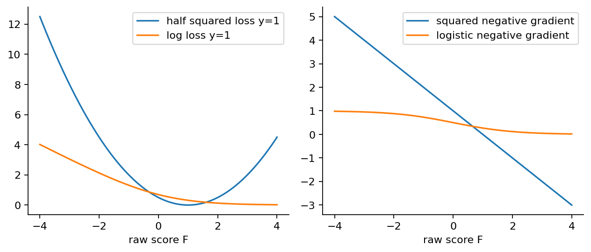
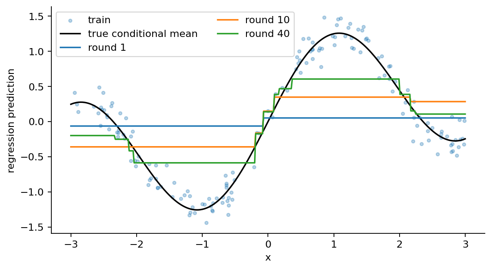
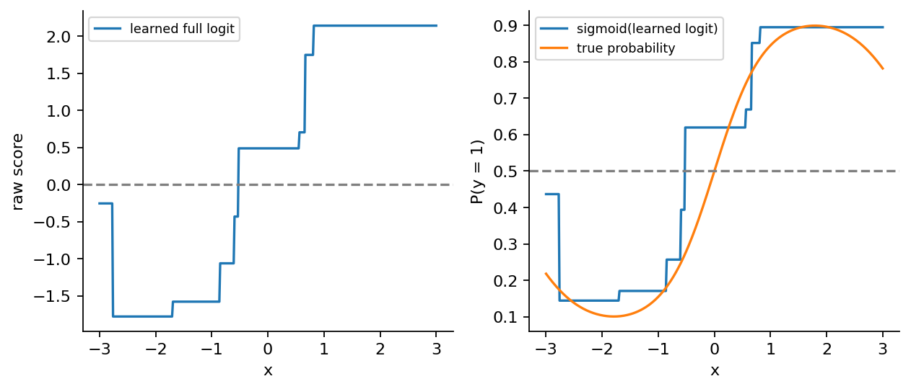
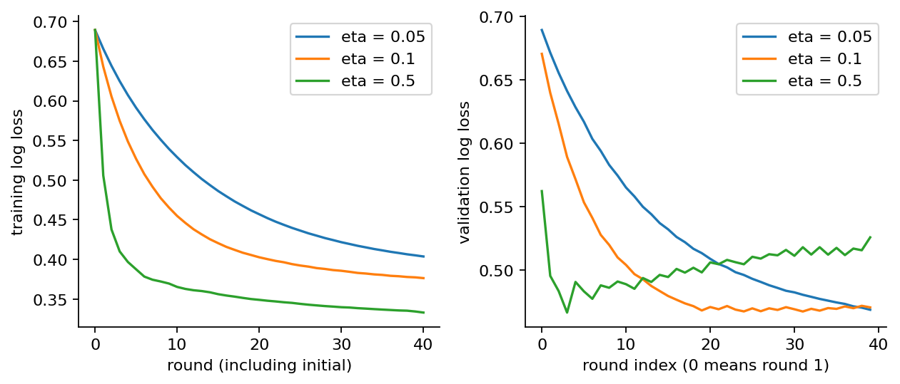

# 第062讲 梯度提升的函数视角

## 1 模型也可以一步步移动

上一讲把模型写成许多规则的加权和。AdaBoost的一轮训练由指数损失导出一组样本权重，再寻找分类规则。如果目标改成预测一个连续数，或直接优化二分类的对数损失，我们还应该怎样决定下一条规则？本讲把问题放回更基本的起点：当前模型在哪些训练输入上该上调，在哪些输入上该下调，各调多少？

梯度提升给出的答案是先对损失求导，得到每一行需要的局部修正方向，再训练一个小模型去近似这些方向。新模型的输出加入旧模型，形成下一轮预测。这里“小模型”使用回归树，即使最终任务是分类也一样，因为修正量本身是实数。

本讲直接先修为第014、028、032、042、058、061讲。我们会明确区分函数、函数在训练点上的数值向量、用于近似方向的树，以及最后输出给用户的预测。推导包括半平方损失与二分类log-loss，并完整计算两轮小例子。最后使用从零实现逐轮对照scikit-learn，而不是只比较最后一个指标。

本文的二分类标签改为$y\in\{0,1\}$，分数$F$定义为完整logit。上一讲使用$\{-1,+1\}$和指数损失下的投票分数，两种写法相关，却不能把导数照搬。若只记住“提升就是拟合$y-\hat y$”，就会在这个转换处最容易出错。

## 2 从参数空间到训练点上的函数值

普通梯度下降把参数$\theta$看成一个向量，沿着负梯度移动。梯度提升先暂时不规定模型的参数长什么样，而是关心它在训练集上的输出：

$$\mathbf F=\big(F(x_1),F(x_2),\ldots,F(x_n)\big).$$

经验风险是这些数的函数：

$$\mathcal R(F)=\frac1n\sum_{i=1}^{n}\ell\big(y_i,F(x_i)\big).$$

若把每个$F(x_i)$当成独立坐标，普通欧氏偏导为$\partial\mathcal R/\partial F(x_i)=(1/n)\partial\ell_i/\partial F(x_i)$。教科书的伪残差通常不写这个共同的$1/n$，因为它可以吸收到步长里；也可以在经验内积$\langle a,b\rangle_n=(1/n)\sum_i a_ib_i$下定义梯度，此时梯度分量恰是单样本损失的导数。

这句话解决一个常见困惑：为什么平均损失求导应该有$1/n$，代码里的残差却没有？它不是遗失了一个依赖样本的权重，而是采用了明确的尺度约定。若在别处改变损失的整体倍数，也必须同时检查步长或叶值计算，不能默认所有实现自动等价。

定义第$m$轮伪残差：

$$r_{im}=-\left.\frac{\partial\ell(y_i,F)}{\partial F}\right|_{F=F_{m-1}(x_i)}.$$

若我们只更新这$n$个数，能轻易把每行修正到合适方向，却不知道一个新输入$x$该怎样预测。于是要训练函数$h_m(x)$，让它在这些训练点上近似$r_{im}$。这个函数把有限的方向信息延伸到整个输入空间，这正是基学习器的作用。

## 3 为什么用回归树去拟合方向

常用步骤是求一个平方误差较小的方向模型：

$$h_m\approx\arg\min_{h\in\mathcal H}\sum_i\big(r_{im}-h(x_i)\big)^2.$$

这里的平方误差是“拟合伪残差”的辅助目标，不一定是原始预测任务的损失。原始任务即使用log-loss，回归树也可以按残差平方误差来选分裂。把这两个目标分开，才能解释为什么分类梯度提升里出现回归树。

若$h$是在固定叶区域上用残差均值构成的树，有$\sum_i r_ih_i=\sum_i h_i^2$。原因是每个叶子内$h_i$相同且等于残差均值，逐叶求和即可。因此只要方向不是全零，原始风险沿$h$的方向导数是负的，足够小的一步会降低风险。这里“足够小”很重要；局部下降方向不保证任意大的步长都安全。

回归树通过阈值把输入空间分成区域。同一叶子的行共享一个修正量。这使方向比逐行自由调整更受约束，也提供一定的平滑与泛化能力。树越深，区域越碎，能拟合的局部方向越复杂，同时更可能跟随噪声。树深与提升轮数控制不同维度的复杂度，不能简单互相替代。

本讲的正式比较只用深度1的树，每轮一刀，最小叶样本数为3。实现支持更深的树，测试会覆盖深度0和深度2；但对照实验锁定相同配置，避免把算法差异与模型容量差异混在一起。



## 4 平方损失让伪残差等于普通残差

先选择半平方损失：

$$\ell(y,F)=\frac12(y-F)^2.$$

求导时把$y$当常数。外层平方给出$2(y-F)$，内层$y-F$对$F$的导数为$-1$，再乘前面的$1/2$，得到$\partial\ell/\partial F=F-y$。所以负梯度正是：

$$r=y-F.$$

“拟合残差”在此不是比喻，而是导数的直接结果。若损失写成$(y-F)^2$而没有二分之一，负梯度是$2(y-F)$。最优预测函数不变，但相同数值步长下的更新大小会变。因此本讲报告的回归损失是半MSE，乘2才能与通常的MSE比较。

初始模型取最佳常数。最小化$\sum_i(y_i-c)^2/2$，一阶条件为$\sum_i(c-y_i)=0$，得到$c=\bar y$。这只使用训练标签；不能把验证或测试标签的均值放进初始化。

在固定叶子$R$里，如果当前残差为$r_i$，寻找一个常数修正$\gamma$以最小化$\sum_{i\in R}(r_i-\gamma)^2/2$，解是叶内残差均值。因此，拟合残差的回归树叶值已经是该叶的平方损失最优修正，无需再另做一次Newton校正。

加入学习率$\nu$后的更新为：

$$F_m(x)=F_{m-1}(x)+\nu h_m(x),\qquad0<\nu\le1.$$

学习率缩小本轮修正，让多轮逐步调整取代一次大修正。它不是“乘完最终模型就结束”：下一轮残差会依赖已经缩小的当前模型，因此小学习率多轮通常不等价于大模型最后再统一乘一个数。

## 5 四个样本的两轮回归

取$x=(1,2,3,4)$、$y=(1,1,3,3)$，树深为1、最小叶样本数为1、学习率$\nu=1/2$。标签平均数为2，所以初始预测全为2，残差为$(-1,-1,1,1)$，初始半MSE为$1/2$。

第一棵树在2.5处切开，左叶值$-1$，右叶值$+1$。树能精确拟合本轮残差，但学习率只允许走一半。新预测为$(1.5,1.5,2.5,2.5)$，新残差为$(-.5,-.5,.5,.5)$。每行残差平方为$1/4$，所以半MSE为$1/8=0.125$。

第二棵树仍在2.5处切开，但叶值已变成$-.5$和$+.5$。再次走一半，新预测为$(1.25,1.25,2.75,2.75)$，半MSE为$1/32=0.03125$。

|时点|左两行预测|右两行预测|左叶新增值|半MSE|
|---|---:|---:|---:|---:|
|初始|2.000|2.000|无|0.50000|
|第一轮后|1.500|2.500|-0.500|0.12500|
|第二轮后|1.250|2.750|-0.250|0.03125|

表里的“新增值”已经乘学习率，和树文件保存的原始叶值要区分。第一棵树保存$-1$，加入模型的是$-0.5$；第二棵树保存$-0.5$，加入的是$-0.25$。把学习率乘两次是常见实现错误。

若在第二轮继续拟合原标签$(1,1,3,3)$，会再学出一棵“预测标签”的树，而不是修正剩余误差的树。简单叠加这类树会重复加上已经解释的部分。正确实现每轮都先依据$F_{m-1}$重新计算目标。


## 6 分类时先说清楚对谁求导

对二分类，$y\in\{0,1\}$，设$p=P(y=1\mid x)$。单样本对数损失为：

$$\ell(y,p)=-y\log p-(1-y)\log(1-p).$$

如果直接对$p$求导，得到：

$$\frac{\partial\ell}{\partial p}=-\frac{y}{p}+\frac{1-y}{1-p}=\frac{p-y}{p(1-p)}.$$

这不是$p-y$。但是本讲的模型输出不是$p$，而是完整logit：

$$F=\log\frac{p}{1-p},\qquad p=\sigma(F)=\frac1{1+e^{-F}}.$$

Sigmoid把任意实数分数映射到0与1之间；它的导数为$dp/dF=p(1-p)$。通过链式法则，刚才分母恰好抵消：

$$\frac{\partial\ell}{\partial F}=\frac{\partial\ell}{\partial p}\frac{\partial p}{\partial F}=p-y,\qquad r=y-p.$$

所以分类伪残差是标签减当前概率，而不是标签减logit。假设$y=1$且$F=2$，概率约0.880797，正确负梯度约0.119203。若机械使用$y-F=-1$，会让一个应继续提高正类概率的样本反而降低分数，方向完全错了。

也不能说$y-p$是“对概率的负梯度”。对概率的负梯度是$(y-p)/[p(1-p)]$。这两种方向对应不同坐标系，数值尺度与边界行为不同。解释一个提升算法时，必须同时交代标签编码、损失表达式、模型输出和求导变量。

把$p=\sigma(F)$代入原式，可以得到原始分数上的等价损失：

$$\ell(y,F)=\log(1+e^F)-yF.$$

代码使用np.logaddexp(0,F)计算第一项，避免直接计算$e^F$在大正数处溢出。Sigmoid也分别处理正负分数。数值稳定写法应与解析公式等价，而不是改变所优化的任务。

## 7 初始logit与两种叶值更新

假设初始分数是常数$c$，令训练正类比例为$\bar y$。常数风险的一阶条件是$\sum_i[\sigma(c)-y_i]=0$，故$\sigma(c)=\bar y$，得到：

$$F_0=\log\frac{\bar y}{1-\bar y}.$$

若训练集全是0或全是1，理论最优常数趋向无穷。本讲教学实现明确要求二分类训练集同时出现两个类别，并拒绝单类别输入。这个限制与上一讲允许单类别常数分类的接口不同，要按任务查清楚，不能统一猜测。

最朴素的梯度提升直接用树拟合$y-p$，叶值是叶内伪残差均值，再乘学习率。这是有效的一阶更新，文件gbdt.py通过logistic_update='gradient'提供该模式。它有助于看清“拟合方向”本身。

常用的另一种做法先用伪残差找树的结构，再在每个叶子里优化原始log-loss的修正值。对叶区域$R$定义$Q(\gamma)=\sum_{i\in R}\ell(y_i,F_i+\gamma)$。在$\gamma=0$处：

$$Q'(0)=\sum_{i\in R}(p_i-y_i),\qquad Q''(0)=\sum_{i\in R}p_i(1-p_i).$$

用二阶泰勒近似并最小化二次式，得到一步Newton修正：

$$\gamma_R=-\frac{Q'(0)}{Q''(0)}=\frac{\sum_{i\in R}(y_i-p_i)}{\sum_{i\in R}p_i(1-p_i)}.$$

它一般不等于残差均值，也一般不是叶内log-loss的精确全局最小值；它是一次局部二阶近似。正式实验采用这个叶值约定，以便与scikit-learn的传统GradientBoostingClassifier对齐。[3] 树结构仍由残差平方误差确定，Newton只替换最终叶值。

若分母极小，直接相除会产生过大的数。教学实现当叶内Hessian和不大于$10^{-12}$时取零修正，并额外使用回溯检查实际损失。这个阈值比库的内部阈值保守，因此极端饱和输入下不承诺逐位一致；正式数据远离该边界，对照将验证实际是否一致。

## 8 两轮logistic手算

仍取$x=(1,2,3,4)$，这次标签为$(0,0,1,1)$。正类比例为1/2，初始logit为0，所有概率为1/2。初始对数损失为$\log2\approx0.693147$。学习率仍为1/2。

第一轮伪残差是$(-.5,-.5,.5,.5)$。树在2.5处分裂。左叶的残差和为$-1$，Hessian和为$2\times.25=.5$，Newton叶值为$-2$；右叶同理为$+2$。乘学习率后，分数为$(-1,-1,1,1)$。

左侧正类概率为$\sigma(-1)\approx0.268941$，右侧为$\sigma(1)\approx0.731059$。每行都分对，但概率尚不极端。第一轮损失为$\log(1+e^{-1})\approx0.313262$。

第二轮左叶每行残差为$-0.268941$，右叶为$+0.268941$。每行Hessian约为0.196612。左叶Newton值为：

$$\gamma_L=\frac{-2(0.268941)}{2(0.196612)}\approx-1.367879,$$

右叶为相反数。新分数绝对值为$1+0.5\times1.367879=1.683940$，损失约0.170284。原始得分增加，错误类别的概率减少，分类结果仍然全对；log-loss却继续改善。

|时点|左侧logit|右侧logit|左侧正类概率|平均log-loss|
|---|---:|---:|---:|---:|
|初始|0|0|0.500000|0.693147|
|第一轮后|-1|1|0.268941|0.313262|
|第二轮后|-1.683940|1.683940|0.156574|0.170284|

对比一阶模式：第一轮树叶值仅为$\pm.5$，乘学习率后logit是$\pm.25$，并不会得到$\pm1$。若代码号称只做一阶残差拟合，却报告Newton版本的手算值，就是把两个算法混在一起。本讲测试分别核验两种模式，不让它们只靠相同名字混过去。

## 9 从零代码的一轮究竟做了什么

每轮的顺序很重要：冻结当前原始分数；计算全部伪残差；训练回归树的结构；必要时按旧分数计算Newton叶值；预测整棵新树；乘学习率并检查真实损失；最后更新模型。不能在更新某个叶子后，马上用已经改变的分数去计算另一个叶子的导数，这会变成另一个不一致的流程。

```python
residual = negative_gradient(y, F, loss_kind)
tree = RegressionTree(depth, minimum_leaf).fit(X, residual)
if loss_kind == 'logistic':
    p = sigmoid(F)
    for leaf in tree.leaves_:
        index = leaf.indices
        leaf.value = residual[index].sum() / (p[index]*(1-p[index])).sum()
direction = tree.predict(X)
F_new = F + learning_rate * direction
```

这段缩写省略了极小分母和回溯保护，完整实现保存在gbdt.py。每轮记录伪残差、方向、实际步长、更新后分数和损失。这样，一个最终准确率相同但中间导数错误的实现，也能被逐轮测试发现。

回溯从配置学习率开始。若新损失非有限或比旧损失高出数值容差，就把步长减半，最多尝试40次；失败则显式报错。正常正式实验未触发减半，所有步长仍是0.1。这个保护确保本讲的实际下降契约，却不是所有梯度提升库的默认行为。

树实现枚举每个特征的相邻不同值切点，比较子叶残差平方和，递归构造子树。等于阈值走左，叶内预测用均值。若没有合法且改善足够明显的分裂，就保留常数叶。最小叶样本数约束、最大深度、平局顺序和数值容差全部属于算法的可复现细节。

为保持教学代码可读，搜索没有采用高效直方图、缓存排序或并行化。它适用于小型实验，不应被当成大规模GBDT训练器。理解朴素版后再学习工程优化，才能辨认哪些优化保留了目标、哪些改变了候选集合或分裂近似。

## 10 原创数据与逐轮库对照

回归实验令$x$均匀分布于$[-3,3]$，条件均值为$\sin(1.6x)+0.25x$，再加标准差0.16的独立高斯噪声。分类实验使用真实概率$\sigma(1.6\sin x+0.35x)$，再按Bernoulli分布抽取标签。因此分类数据即使没有人工标错，也有本质随机性；单个标签不能等同于真实概率。

训练160行、验证100行、测试220行，各自固定独立随机种子。真实均值和真实概率只用于解释图形，不进入拟合或调参。正式配置固定40轮、学习率0.1、最大深度1、最小叶样本数3。库的分裂准则显式设为squared_error，随机种子固定为62。



对照不仅计算测试指标，还比较每一轮的训练原始分数。回归比较staged_predict；分类比较staged_decision_function，而不是把分类概率与原始logit相减。每轮树的分裂和叶值在这份非退化数据上对齐，最大训练阶段差分别约$2.22\times10^{-16}$和$4.44\times10^{-16}$。

|损失|初始训练损失|最终训练损失|验证损失|测试损失|
|---|---:|---:|---:|---:|
|半平方损失|0.333428|0.089393|0.082090|0.100431|
|log-loss|0.689314|0.376348|0.470665|0.471454|

回归测试MSE是表中0.100431的两倍，约0.200862。分类测试准确率为0.777273，即220行中171行正确。两种指标表达不同方面：准确率只看阈值后的类别，log-loss还评价概率分配给真实类别的程度。

库对照是非常有力的实现检查，却不是数学证明。两份程序可能共享概念误解，也可能在平局、浮点精度、极小Hessian或特殊输入上有不同约定。因此我们先用独立手算与有限差分测试建立基准，再把库对照作为另一条证据。

## 11 学习率与训练下降的边界


训练损失非增是算法内部的一项可检查性质。验证损失没有同样保证，因为新树的方向来自训练样本；测试损失更没有保证。如果验证曲线先降后升，可能意味着继续拟合训练波动开始损害泛化。用预先定义的验证规则选择轮数属于模型选择，不能把测试最低点当成同样合法的选择依据。

小学习率通常需要更多轮才能达到同样训练拟合程度，但它不是无条件改进：轮数预算太少时可能欠拟合，计算成本也会提高。本讲在图6比较0.05、0.1和0.5，只展示训练与验证曲线，不再根据测试表现挑赢家。



概率位于0与1之间，并不自动意味着概率校准良好。在一组预测为0.8的真实案例中，是否约80%为正，需要另外的校准评估。图5能解释这份已知生成机制中的偏差，却不能取代实际应用的独立验证。



本讲没有加入随机子采样、特征采样或额外正则项，也没有比较现代直方图提升库。先掌握“原始损失定义方向，树近似方向，学习率控制实际步伐”这个结构，再加其他机制才容易分清作用来源。

## 12 和AdaBoost放在同一张概念地图上

AdaBoost同样是前向加性建模。指数损失的负梯度含有$y\exp(-yF)$，其中指数因子对应上一讲的样本关注量。但不能把所有boosting都描述为“把错分样本权重调大”：平方损失下需要的是连续残差，logistic下需要的是对logit的导数，既有正方向也有负方向，还携带幅度信息。

GBDT也不是“每棵树预测上一棵树的错误”。伪残差针对的是当前全部旧树相加后的$F_{m-1}$。若只用最后一棵树计算误差，会忘记已经累积的模型，破坏推导与实现的一致性。

分类时，回归树输出可以是负数或大于1的数，因为它预测的是分数修正。只有把整个原始分数经过Sigmoid后才得到概率。若把每棵树的叶值都限制到$[0,1]$，模型就无法按这里的方式向负方向修正。

另一种混淆来自半logit约定。一些文献对$y\in\{-1,+1\}$使用$P(y=1\mid x)=1/[1+\exp(-2F)]$，此时$F$是半logit，导数和Newton系数会出现因子2。本讲始终用完整logit与0/1标签。读不同资料时，先写出概率与分数的链接关系，再比较公式，远比只看符号名称可靠。

## 13 用独立证据检查每一轮

测试首先手算两个四行例子，核验初始化、伪残差、树叶值、乘学习率后的分数及每轮损失。第二层使用中心有限差分：逐个扰动一个原始分数，测量平均损失变化，再乘样本数恢复单样本导数。它直接检查“对F求导”的含义，能发现把$y-F$错用于logistic的错误。

第三层从初始常数出发，利用记录的方向与步长独立累加，逐轮核对分数和损失。第四层比较库的每一阶段原始分数。边界层则覆盖常量特征、常量回归目标、深度0、最小叶约束、阈值等号、概率和为1、极端logit、单类别分类拒绝、未拟合、维数错配和无效参数。

冻结数据检查会拒绝被改动的CSV，即使同时把摘要改成新值；报告检查会拒绝被改动的指标、伪残差与步长。普通模式和-O模式必须给出相同通过项，不依赖可能被优化器移除的assert语句。完整检查清单保存在test-result.json，数值报告保存在experiment-result.json。

学完后，不妨用一句话复述算法：从训练损失对当前原始分数的负导数出发，用受限回归树建立可用于新输入的修正函数，再以明确的步长加到旧模型。只要能逐个解释“损失、原始分数、导数、树、步长”，就不会被“残差学习”这类缩写掩盖关键约定。

## 参考资料

[1] Friedman J H. Greedy Function Approximation A Gradient Boosting Machine. Annals of Statistics, 29(5), 1189–1232, 2001. 正式发表记录：https://doi.org/10.1214/aos/1013203451 。本次实际读取的作者论文预印本镜像：https://www.cse.iitb.ac.in/~soumen/readings/papers/Friedman1999GreedyFuncApprox.pdf ，重点核对Algorithm 1和平方损失部分。预印本分页与正式版不同。

[2] scikit-learn 1.8.0. GradientBoostingRegressor及GradientBoostingClassifier API。https://scikit-learn.org/1.8/modules/generated/sklearn.ensemble.GradientBoostingRegressor.html ；https://scikit-learn.org/1.8/modules/generated/sklearn.ensemble.GradientBoostingClassifier.html 。

[3] scikit-learn 1.8.0 source, sklearn/ensemble/_gb.py. 核对二分类Newton叶值及完整logit约定：https://github.com/scikit-learn/scikit-learn/blob/1.8.0/sklearn/ensemble/_gb.py 。

资料核验日期为2026-10-07。原始数据、手算例子、图和逐轮实验均在本课程中独立制作；引用用于明确方法来源和库接口，不替代随附的可执行核验。
