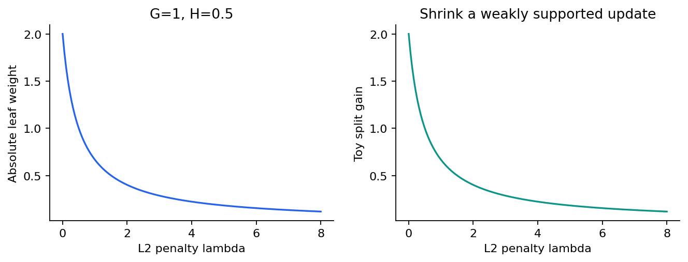
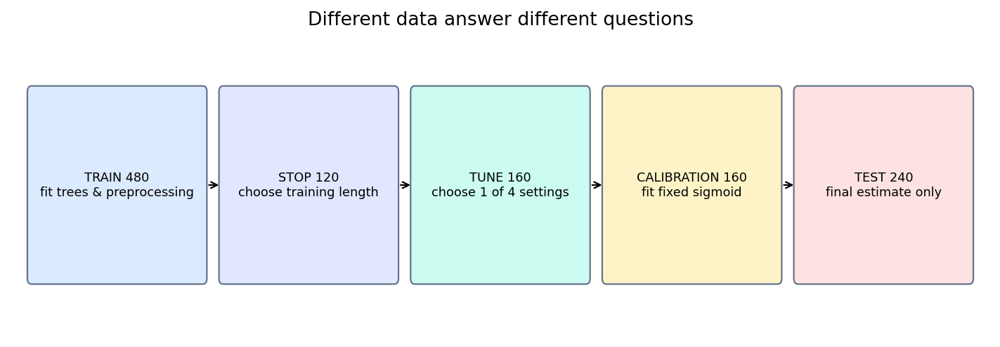
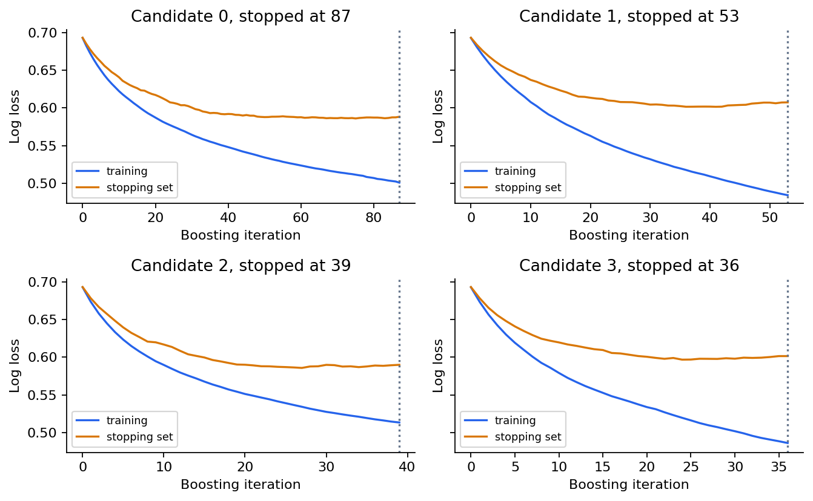
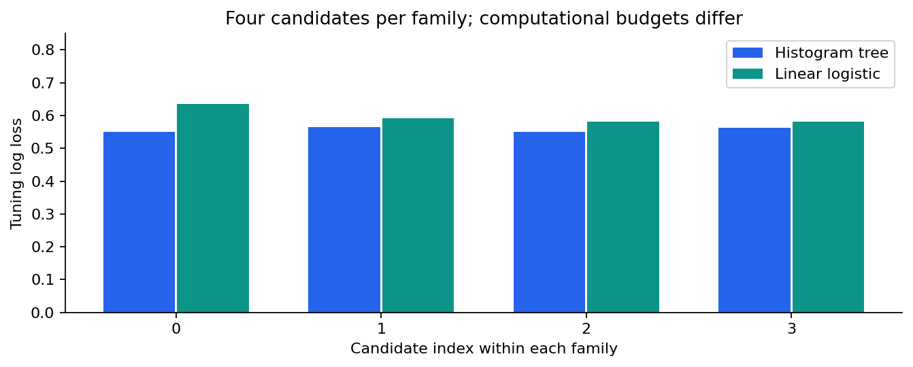
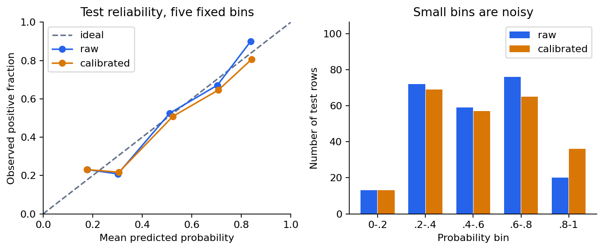
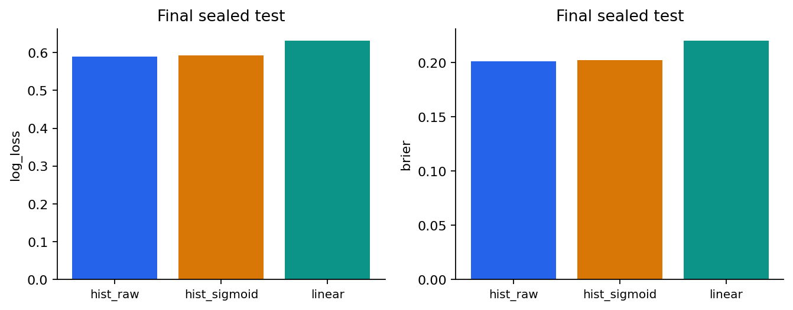

# 第063讲 提升树的实际训练

## 1 从会推导走到可信的表格基线

上一讲说明了梯度提升如何逐轮修正预测。本讲面对更接近研究现场的问题：拿到一张有连续数、有类别、有缺失的表，怎样训练一套结果值得相信的提升树？目标不是记住一组“最好参数”，而是把损失、实现、数据划分、计算预算和最后的结论接成一条能复核的链。

我们选用scikit-learn 1.8.0的HistGradientBoostingClassifier。它是一种主流的直方图提升树实现，安装简单，支持本讲需要的缺失与类别特征。选择它不意味着它在所有任务上优于其他实现。本讲不进行多个提升库的速度排行榜；我们把它与一个经过同样四组候选搜索的逻辑回归基线比较，明确写出计算预算并不相等。

直接先修为第039、051至053、055、062讲。读完后，你应该能算一个叶子的Newton更新，解释为什么类别编号不能自动当成大小关系，安排独立的早停、调参和校准数据，并在校准没有改善时诚实地保留这个结果。所有实验数据均为原创合成样本，不是现实业务数据；它的用途是暴露方法差异，而非证明现实收益。

## 2 一次更新要同时看方向和曲率

仍然令二分类标签$y\in\{0,1\}$，模型原始分数为$F$，概率为$p=\sigma(F)=1/(1+e^{-F})$。单样本对数损失也可以写成数值上方便的形式：

$$\ell(y,F)=\log(1+e^F)-yF.$$

在当前分数附近添加一个小修正$f$，Taylor二阶近似为：

$$\ell(y,F+f)\approx\ell(y,F)+gf+\frac12hf^2,$$

其中$g=\partial\ell/\partial F=p-y$告诉我们向哪里改，$h=\partial^2\ell/\partial F^2=p(1-p)$描述局部曲率。$g$可以正也可以负；二分类log-loss的$h$非负。这里是对原始分数求导，不是对概率求导。若换成别的损失，要重新核对导数、曲率以及损失是否被取了平均。

一个叶子里的样本共享新增值$w$。设叶内梯度和为$G=\sum_i g_i$，曲率和为$H=\sum_i h_i$，对叶值加惩罚$\lambda w^2/2$，去掉不依赖$w$的常数后得到：

$$Q(w)=Gw+\frac12(H+\lambda)w^2.$$

对$w$求导等于$G+(H+\lambda)w$。在$H+\lambda>0$时，导数为零给出唯一极小点：

$$w^*=-\frac{G}{H+\lambda},\qquad Q(w^*)=-\frac12\frac{G^2}{H+\lambda}.$$

这个式子可以逐字解释。分子累加叶内希望修正的方向；分母把曲率与正则化放在一起，避免支持不足的叶子产生过大的变化。若$H=0$且$\lambda=0$，公式没有定义，不能靠默默除零继续训练。极端logit可能使浮点曲率趋近零，成熟实现还会有最小曲率、最小叶样本等限制。

学习率$\nu$通常在叶值确定后缩小加入模型的更新，即$F_{new}=F+\nu w^*$。L2正则化改变叶子的Newton最优值，学习率则缩小整轮贡献。二者都会让更新小一些，却不是可以互换的同一个旋钮。

## 3 分裂增益可以完整手算

把父叶分成左右两叶，以最优二次目标的下降量评价候选分裂。若另外对多增加一个叶子收取$\gamma$，则一个常用的教学写法为：

$$\operatorname{Gain}=\frac12\left[\frac{G_L^2}{H_L+\lambda}+\frac{G_R^2}{H_R+\lambda}-\frac{(G_L+G_R)^2}{H_L+H_R+\lambda}\right]-\gamma.$$

注意父叶分母只加一次$\lambda$。把左右分母相加会多算一个正则项。这是理论演示的目标约定；不同库会改变损失或增益的倍数，甚至没有同名的$\gamma$参数，不能把这个公式当成每个库内部逐行完全相同的实现。

取四个样本，当前分数都为0，标签依次为$(0,0,1,1)$。因为$p=1/2$，梯度是$(1/2,1/2,-1/2,-1/2)$，Hessian都是$1/4$。父叶$G=0,H=1$，所以保持不动。如果一个分裂把前两个样本放左边、后两个放右边，则$G_L=1,H_L=1/2,G_R=-1,H_R=1/2$。

当$\lambda=0$，左叶$w_L=-2$，右叶$w_R=2$，增益为$\frac12(2+2)=2$。当$\lambda=1$，叶值变成$\mp2/3$，增益变成$2/3$。如果此时$\gamma=0.8$，净增益小于0，按这个目标就不该分裂。若再取学习率0.1，真正加到分数上的变化是$\mp1/15$，不要再把学习率乘到已经缩过的预测上。



## 4 直方图近似省下了什么

连续特征可能有几百、几千甚至几百万个不同值。若在每个节点都考虑所有不同取值之间的切分，会很昂贵。直方图方法先把连续数映射到有限个桶，在桶中累计梯度和Hessian，再在桶边界上搜索分裂。候选阈值减少了，某些运算也能用更紧凑的整数表示。

这个过程近似了候选阈值集合，不意味着它把整棵树替换成普通频数图。桶中的关键统计量包括损失的导数。桶越少，训练可能更快，却可能错过精细阈值；桶越多，也不保证小样本任务必然更好。本讲固定max_bins=63，让比较重点放在学习率、叶子上限和L2上。

特征分桶应从训练数据学习。若先把训练、验证和测试混在一起学习分位点，即使没有使用测试标签，也让建模流程看到了封存输入的分布。本讲把原始训练数组传入fit，由估计器在训练阶段建立分桶规则。外部验证数组只参与早停评分。

树深与叶子数也不完全等价。深度限制最远路径长度，叶子数限制最终区域数量。一棵不平衡树可以只有少量叶子却很深。比较不同库时，应同时记录生长策略、叶子约束、每叶最小样本或曲率、分桶方式，而非只对齐名叫depth的参数。

## 5 缺失值本身可能携带信息

本讲的x2有约18%的缺失，用NaN明确表示。缺失并非数值0；把它填成0会让模型把“未知”与“真的为0”混在一起。直方图提升树支持学习缺失值在分裂时向哪边走，因此本实验不为它预先插补。对照的逻辑回归不接受NaN，于是使用训练集拟合的均值插补，并增加缺失指示列。

我们故意让缺失标志在生成机制中影响正类概率。这使“缺失是否有信息”成为能观察的问题，也说明缺失处理不是一个机械的数据清扫步骤。在真实场景中，信息可能来自检测流程、客户操作或采集策略变化，部署时如果缺失机制变了，训练时有用的模式也可能失效。

不能因为算法能接收NaN，就不做数据审查。应分清无法测量、不适用、设备坏了和被遮盖等不同原因；这些情况是否应合并成一种缺失，需要任务背景。无穷大也不是缺失值的通用替代，错误的单位和未来字段仍然会造成问题。

## 6 类别编号不是大小关系

类别列category取0、1、2，只是三种来源的编号。这里1不是0与2之间的“中间程度”。如果把它当成连续数，只允许按阈值分裂，就给类别加上了人为顺序。原生类别处理可以寻找类别子集，而不是只寻找编号阈值；本讲显式传入categorical_features=[False,False,True]，避免依赖NumPy数组无法提供的category类型信息。

对照逻辑回归使用one-hot编码。一个类别一列，系数表示相对效应，不把类别编号解释成距离。编码器只在训练集fit，遇到未知类别按预先设定的规则处理。本讲还在提升树上执行“未知编号9”和“缺失类别NaN”的相同输入探针，核对该版本把未知类别按缺失处理的实际输出。

高基数类别需要额外谨慎。把身份证式的唯一编号当类别可能记住样本；target encoding如果使用同一行标签生成特征，会形成直接泄漏。即使库支持类别列，也不等于这些统计编码与时序边界已经自动安全。样本是谁、预测发生在什么时候，仍然是第一道检查。

## 7 五份数据对应五个决定

本讲把1160个样本分成训练480、早停120、调参160、校准160、测试240。数量不是通用配方，小样本下也可采用嵌套交叉验证或交叉拟合；这里多分一份数据是为了让每个标签的用途清清楚楚。



训练集拟合树、插补值、标准化参数和编码词表。早停集决定每个候选模型训练到什么时候。调参集比较四个候选配置。校准集只给已经选定的提升树拟合一个固定形式的sigmoid映射。测试集估计这套已经锁定的流程的表现。

如果用同一份验证集同时早停又选四个配置，并不自动等于使用测试集，但这份验证集承受了更多选择，其最好分数往往更乐观。把它再拿来报告最终泛化性能就更不合适。这里拆分早停与调参，是一种透明、易教学的控制方式，不声称它在有限样本下方差最小。

代码为了核验文件完整性，会读取所有CSV的字节和ID；这与利用测试标签计算训练参数不同。训练与选择函数只接收各自允许的数组，测试指标在选择和校准完成后计算。安全检查可以检查文件身份，但不能把“只是看看测试效果”当成重新设计搜索空间的理由。

## 8 早停的最后一轮不一定是曲线最低点

本实验max_iter=150、n_iter_no_change=12、tol=1e-5，并显式提供X_val和y_val。1.8.0文档规定了外部早停数据的接口；因此validation_fraction=None在这里不表示拿训练损失替代外部验证损失。接口在旧版本中可能不同，不能只复制参数名字。

早停依据一段窗口是否仍有足够改善来停止，保存的n_iter_是实际训练轮数。不要未经核对就声称所有提升库都会回滚到历史最低验证损失那一轮。本讲没有自行回滚，也没有用测试集选轮数；最终模型就是fit返回的模型。图中的竖线标记停止轮数，读者可以自己观察最低点与停止点是否一致。



早停集的曲线也有噪声。只有120行时，一两条较难样本就可能改变某个局部最低点。耐心值与容忍度缓解偶然波动，却不是统计显著性检验。若真实研究要比较方法，应重复划分或在预先锁定的评估设计下给出不确定性，而非把一条曲线当成必然规律。

## 9 默认值与公平预算必须分别核对

我们的默认值审计来自实际安装类的get_params，而不是凭记忆填写。1.8.0中默认learning_rate为0.1、max_iter为100、max_leaf_nodes为31、min_samples_leaf为20，默认early_stopping为auto。正式实验显式覆盖关键参数：轮数上限150、最小叶样本12、分桶63、早停True，以及明确的类别掩码。

四个提升树候选分别使用学习率0.05或0.1、7或15个最大叶子和不同L2强度。这是预先列出的四组组合，不是三个轴的完整笛卡尔积。线性基线搜索C为0.01、0.1、1、10，预处理完全相同于自己的训练管线。两个模型家族都使用四次调参机会，但每次训练成本差异很大，因此报告只声称候选次数相同。



报告还记录每次fit耗时与实际提升轮数。耗时受机器、线程、缓存和运行负载影响，不能要求它在另一台机器逐位相等。数值预测应在合理容差内复现；资源结果应带硬件与测量约定解读。测试特意跳过精确耗时比较，同时复算每个数值指标和全部候选曲线。

## 10 好的排序不等于好的概率

AUC考察正负样本的相对排序。log-loss和Brier分数则会在意概率数值。若所有0.9预测中只有六成是真的正类，即使排序不错，概率也可能过于自信。校准希望把已有分数映射到更接近频率的概率，而不重新训练树结构。

本讲固定校准形式$q=\sigma(aF+b)$，用独立校准集拟合$a,b$。代码使用C=1000000的逻辑回归近似弱正则的sigmoid拟合。这个步骤不是把测试概率“修到看起来更好”，也不是保证指标一定上升。有限校准集本身有估计误差；原模型若已经适合目标分布，额外映射还可能略微损害表现。



本次实际运行，未校准树测试log-loss为0.588754，sigmoid校准后为0.591923，略有变差；Brier从0.201192变为0.202511。AUC同为0.754411，因为本次拟合的映射保持排序。线性基线log-loss为0.631331，AUC为0.699569。这些是一次固定合成样本的结果，不是显著性结论，也不是更换数据后的保证。

既然校准稍差，为什么还保留？因为方法的评估问题正是“预先固定的校准流程在独立测试上表现如何”。看完测试结果再取消校准、重新选样本或者改C，会把测试变成新的验证集。可以把观察作为下一次研究假设，但下一次结论需要新的评估资源。



## 11 代码阅读从数据流开始

generate_data.py定义生成机制和固定种子，data/generation.json保存CSV摘要。common.load_data不仅检查摘要，还把当前字节与生成器重新得到的字节比较，因此同时篡改CSV和摘要也不会悄悄通过。experiment.run先构造每个数据角色，逐候选fit，只根据tune_log_loss选索引，最后才计算test字段。

最值得逐行读的一小段是：

```python
# 只用早停数据决定这个候选训练多久
model.fit(X_train, y_train, X_val=X_stop, y_val=y_stop)
# 只用调参数据决定保留哪个候选
loss = log_loss(y_tune, model.predict_proba(X_tune)[:, 1])
# 选择完成后，校准器才接触独立校准集
calibrator.fit(score_calibration.reshape(-1, 1), y_calibration)
```

变量名表达的是权限而非装饰。若一个辅助函数悄悄把test与train拼起来做预处理，上面的外观再整齐也无法挽救结论。正式项目应审查函数输入、fit调用位置、随机划分的生成时间以及调参日志。

本讲测试包含导数有限差分、手算叶值、逐候选曲线长度、测试指标重算、未知类别探针、数据篡改拒绝和完整新运行对照。普通与-O模式都使用显式异常检查，不依赖会被优化模式删除的assert。Notebook在一个新Python进程的真实IPython内核执行，保存数值与嵌入图；浏览器界面和外部套接字内核传输不在本次验证范围内。

## 12 练习与研究边界

先不看答案，完成以下问题。题目中的理论量与库参数要分开回答。

1. 四样本手算中，求$\lambda=2$时的左右叶值与增益。若学习率0.1，实际新增分数是多少？
2. 把所有单样本损失乘2而保持数值$\lambda$不变，叶值会完全不变吗？写出新公式。
3. 为什么父叶分母不是$H_L+H_R+2\lambda$？
4. 同一类别映射成0、1、2与20、10、30，何时会改变普通数值树的假设？怎样避免？
5. validation_fraction=None与显式X_val同时出现是否矛盾？本讲如何核对？
6. 设计一份表，逐项写出插补、分桶、早停、选择、校准和报告分别能使用哪份数据。
7. 四候选对四候选是否足以称为公平算力比较？还应报告什么？
8. 复算一个非空可靠性桶的均值概率与正例比例，为什么小桶不宜过度解释？
9. 校准后的测试损失较大，能否依据这个测试结果改回未校准模型再称其为预先锁定方案？
10. 提出一个针对真实表格任务的后续研究，但明确哪些变量必须事先锁定，哪些新数据用于评估。

本讲走完了提升树从目标到实验报告的链条。下一讲进入最大间隔分类，模型形状会改变，今天建立的数据权限、预算透明和封存评估原则仍然适用。

## 资料与核验范围

实现接口、默认值与外部早停：scikit-learn 1.8.0 HistGradientBoostingClassifier官方API；概率校准概念：scikit-learn 1.8.0 calibration用户指南；二阶叶值与分裂目标：XGBoost官方Introduction to Boosted Trees教程。这里的手算、合成数据设计、实验叙述与图为本课程原创组织。完整URL、核验日期和使用边界见sources.md；未将XGBoost的目标符号误称为本实验的逐行内部实现。
