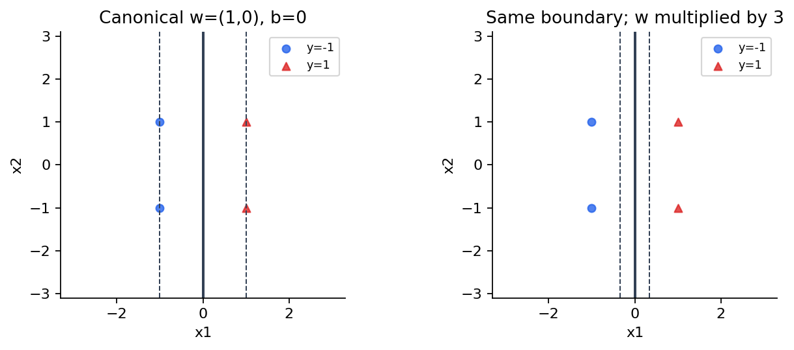
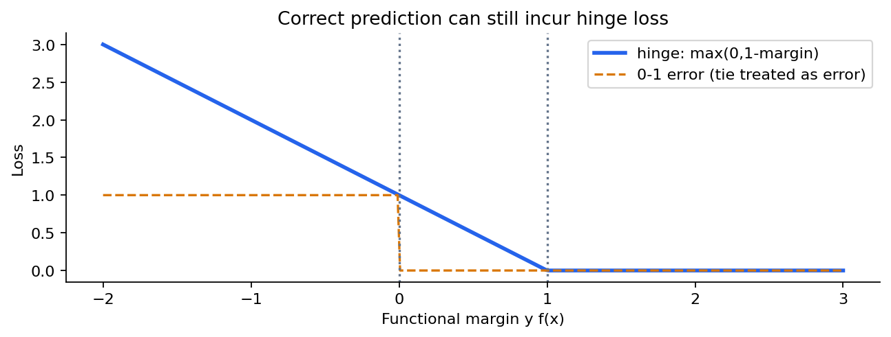
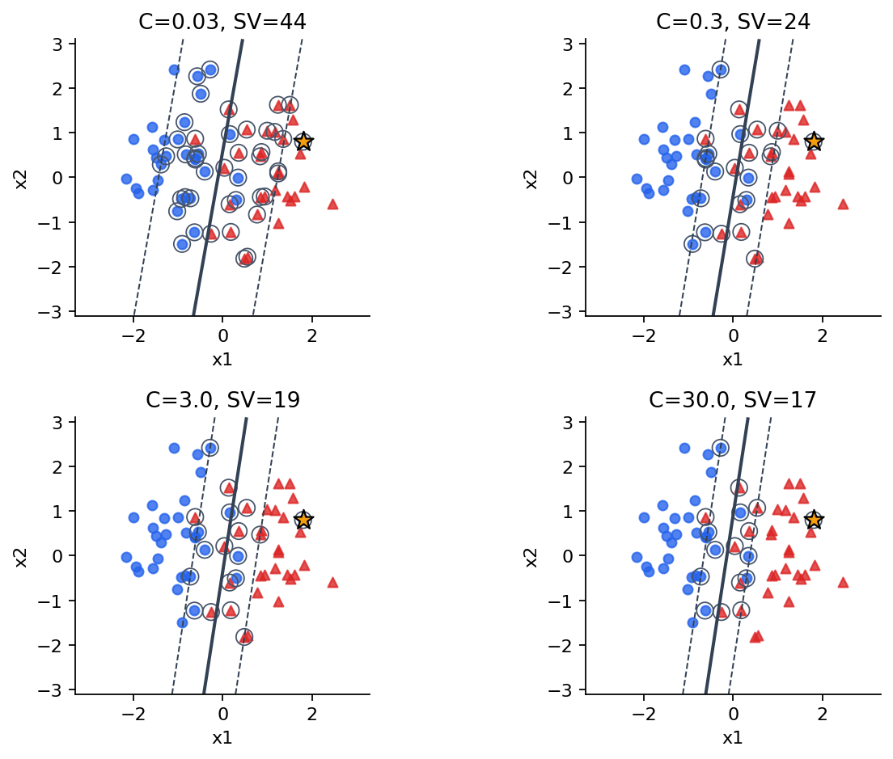
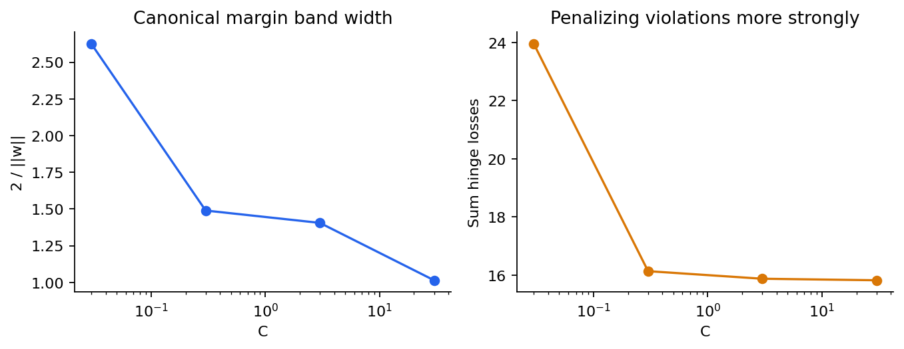
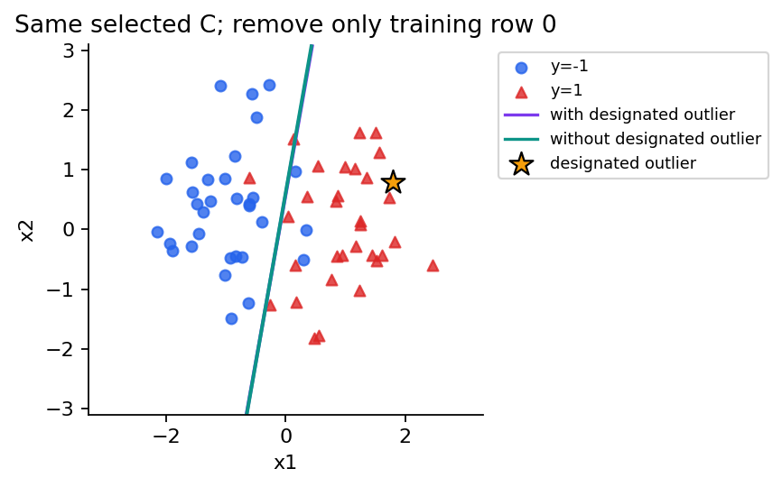
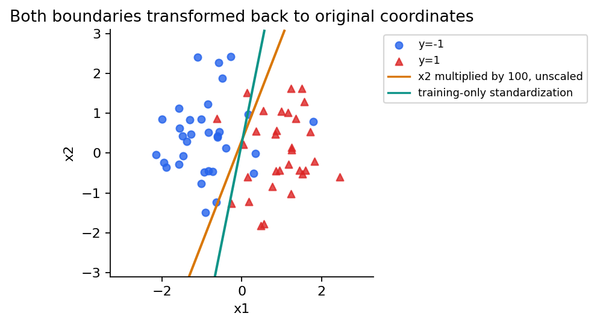

# 第064讲 最大间隔与软间隔

## 1 一条分对的直线还不够

设平面上有两类点，左边多数是蓝色负类，右边多数是红色正类。很多直线都能把有限的训练点分开。如果只问“训练准确率是否100%”，它们可能并列；如果测量有一点扰动，贴着某个训练点走的直线却可能立即把它分错。最大间隔的想法，是在特征空间的几何度量已经确定之后，选择离训练样本更远的分隔边界。

这里的“远”必须定义，不能直接把分类器输出的一个大数当成距离。本讲先推导点到超平面的距离，再说明为什么固定函数间隔为1是一种规范化。随后面对有噪声、重叠和异常点的数据，引入松弛变量与hinge损失，得到软间隔支持向量机。直接先修为第009、016、037、042、048讲。

实验使用原创二维合成数据，包含一个预先指定的异常训练点。我们用scikit-learn的线性核SVC训练四组C，并独立用SciPy求解原始约束优化问题。两条计算路线得到一致目标，才有理由相信公式、代码与库接口说的是同一个问题。下一讲再推对偶与核技巧，本讲先把几何与原始目标讲清楚。

## 2 从分数到函数间隔

令标签$y_i\in\{-1,+1\}$，线性分数为$f(x)=w^Tx+b$。$w$是法向量，决定边界朝向；$b$决定偏移。分类边界是$f(x)=0$，分数为正时预测正类，为负时预测负类。恰好为0需要另定平局规则，不能把数学边界的零测度直觉当成程序契约。

将分数乘上真实标签，得到样本的函数间隔：

$$m_i=y_i(w^Tx_i+b).$$

若$m_i>0$，样本在正确一侧；若$m_i<0$，样本被分错；等于0则恰在边界。这个记号把两类样本的“方向正确”合并成了同一个正数条件。正类希望分数正，负类希望分数负，乘标签后两者都希望乘积大。

但$m_i$不是几何距离。把$w,b$同时乘3，边界没有移动，所有非零预测符号也不变，函数间隔却全变成原来的3倍。若直接最大化它，程序只需不断放大参数，无法表达真正更稳健的边界。必须去掉这种任意尺度。

## 3 几何距离为什么除以法向量长度

取点$x$，设它沿单位法向量$u=w/\|w\|$移动距离$t$后恰好到达边界，则边界点为$x-tu$。代入$w^T(x-tu)+b=0$，得到：

$$w^Tx+b-t\frac{w^Tw}{\|w\|}=0,\qquad t=\frac{w^Tx+b}{\|w\|}.$$

因此到超平面的无符号距离是$|w^Tx+b|/\|w\|$；带上标签，朝正确一侧的几何间隔为：

$$\gamma_i=\frac{y_i(w^Tx_i+b)}{\|w\|}.$$

这个量在把$w,b$同时乘任意正数时保持不变。负数会交换两侧的标签意义，所以讨论尺度等价时通常要求乘数为正。$w=0$时没有有效法向量，上面的距离公式不成立，代码必须拒绝这种输入。



图中的虚线提醒我们：$f=\pm1$只有在特定规范下才是训练样本支持的边缘线。任意放大参数之后，这两条数值等高线不再自动穿过最近样本。不能只画两条虚线便宣称已经找到最大间隔。

## 4 硬间隔问题从规范化得到

假定训练数据线性可分，且我们已有一个把所有样本严格分对的$w,b$。此时最小函数间隔是正数，可以把参数缩放，使最小函数间隔恰好为1。于是每个样本满足$y_i(w^Tx_i+b)\ge1$，最近样本到边界的距离为$1/\|w\|$。

最大化最小几何间隔等价于最小化$\|w\|$，再等价于最小化便于求导的$\|w\|^2/2$。得到硬间隔原始问题：

$$\min_{w,b}\frac12\|w\|^2\quad\text{s.t.}\quad y_i(w^Tx_i+b)\ge1\quad\forall i.$$

偏置$b$在这里不受惩罚，它只平移边界。目标是凸二次函数，约束是线性不等式，因此这是凸优化问题。凸性保证没有更差的局部极小值陷阱，但并不保证约束总有可行解。两类重叠或同一输入有相反标签时，硬间隔根本不可行。

半间隔为$1/\|w\|$，两条规范边缘平面之间的总宽度为$2/\|w\|$。资料中有时把“margin”用于半宽，有时用于全宽；比较数字之前要先核对约定。本讲报告字段canonical_half_width与canonical_full_width明确区分这两个量。

## 5 四个点的最大间隔可以证明出来

负类取$(-1,-1),(-1,1)$，正类取$(1,-1),(1,1)$。直观上边界应是竖直的$x_1=0$，取$w=(1,0),b=0$。所有函数间隔都等于1，目标是$1/2$，半宽为1，总宽为2。

还需要证明没有更优直线。把位于$x_2=1$的正负样本约束相加，得到$2w_1\ge2$，所以$w_1\ge1$。因而$\|w\|^2=w_1^2+w_2^2\ge1$。我们给出的$w=(1,0)$恰达到下界，所以是最优法向量。代回四个约束可得$b=0$。

这个证明比只让库画出一条竖线更有价值：它告诉我们最优目标的下界从哪来，也提供了独立测试。实验中用很大的C在这个可分小例子上运行软间隔SVC，实际得到同样的解；但“取一个大C”本身不是一般硬间隔可行性证明。

假如增加一个与正类同坐标却标成负类的样本，约束会同时要求$f(x)\ge1$与$f(x)\le-1$，矛盾立刻出现。真正的数据通常不如此整齐，测量误差和标签噪声使“每行都必须离边界足够远”过于苛刻。

## 6 松弛变量允许哪种违反

为每个样本增加非负松弛变量$\xi_i$，把约束放宽为：

$$y_i(w^Tx_i+b)\ge1-\xi_i,\qquad\xi_i\ge0.$$

同时在目标中惩罚松弛量，避免把所有$\xi_i$无限放大：

$$\min_{w,b,\xi}\frac12\|w\|^2+C\sum_{i=1}^n\xi_i\quad\text{s.t. 上述约束},\qquad C>0.$$

$0<\xi_i<1$表示样本还在正确一侧，但没有达到规范间隔；$\xi_i=1$允许样本落在边界；$\xi_i>1$允许它落到错误一侧。这里说的是最小可行松弛量的解释，任意人为选大的松弛量当然可能高估实际违反程度。

为什么最优时会取最小可行值？固定$w,b$后，约束要求$\xi_i\ge\max(0,1-m_i)$，而目标对$\xi_i$以正斜率C增长。多加一点松弛没有任何好处，所以最优必取：

$$\xi_i^*=\max(0,1-m_i).$$

消去松弛变量，就得到正则化hinge损失的形式：

$$J(w,b)=\frac12\|w\|^2+C\sum_i\max\{0,1-y_i(w^Tx_i+b)\}.$$

这是同一个优化问题的两种表达。前者便于使用光滑目标加线性约束的通用求解器，后者便于理解损失和使用次梯度。不要把hinge偷偷换成平方hinge再声称求解的是完全相同目标。

## 7 hinge关心分对之后还够不够远

令$m=yf(x)$。当$m\ge1$时，hinge为0；当$0<m<1$时，预测已正确但仍有正损失；当$m<0$时，损失大于1。这样它不仅奖励正确符号，也要求一定的分数余量。



手算三个样本，函数间隔分别为1.4、0.4、负0.2，则最小松弛为0、0.6、1.2，合计1.8。若$\|w\|^2=4,C=0.5$，目标值是$4/2+0.5\times1.8=2.9$。准确率只区分谁落在错误侧，不能重建这个目标。

hinge在$m=1$处不可微，左右导数不同；这不意味着无法优化。可以使用次梯度，或像本实验那样用显式松弛变量把它变成约束二次规划。选择求解方式之前，应先明确要优化的数学对象。

## 8 C衡量违反约束有多贵

增大C表示在本讲目标约定下更重视减少松弛总量，通常愿意接受更大的$\|w\|$和更窄的规范间隔带。减小C则更愿意保留小范数，即使一些训练点进入间隔甚至被分错。不能把C直接读成“正则化越大”：在这里C越大，相对正则作用反而越弱。

另一个常见写法是$\lambda\|w\|^2/2+(1/n)\sum_i\operatorname{hinge}_i$。把本讲目标除以$Cn$，可得$\lambda=1/(Cn)$。因此当样本数n变化时，固定C不等价于固定这个平均损失写法里的$\lambda$。复制全部训练样本一遍，会使相同C下损失和翻倍。

有限样本下，C变大并不保证测试准确率单调上升。模型更努力满足训练约束，可能开始响应噪声或异常标签。某些样本是否是支持向量也可能改变，支持向量数量并非一个普适单调复杂度定理。



本次C取0.03、0.3、3、30。验证准确率分别是0.9375、0.925、0.925、0.9375。预先规定并列时取候选顺序最前者，所以选择C=0.03；没有因测试更好而偏向另一个候选。最终封存测试准确率为0.95，这是160行上的一次估计。



## 9 异常点与软间隔的妥协

本讲train-0000位于$(1.8,0.8)$却标为负类，落在多数正类的区域。它是生成协议中事先指定的异常点，不是看完模型错例后临时删掉的样本。我们保持选定C不变，额外拟合一个仅移除该行的模型，以展示边界变化。



软间隔允许为这个点支付松弛代价，以换取整体更平稳的边界。这并不是宣称异常点总可以忽略。某个罕见样本可能是重要少数群体、真实边界变化或标签错误，是否删除需要数据来源证据和任务目标。算法损失只能表达你给它的权衡，不能代替事实审查。

本讲也没有以“删掉之后测试更高”为理由决定清洗规则。诊断只观察几何，并且diagnostics_used_for_selection字段为false。现实项目若需要按异常分数清洗，应把规则拟合在训练阶段，并在独立验证设计中比较完整流程。

## 10 特征单位决定了什么叫远

若x1以米计、x2以厘米计，同样的数字距离未必代表相同物理改变。线性SVM惩罚$w_1^2+w_2^2$，因此把一个特征乘100会改变达到同一预测函数所需的参数长度。若$x_2'=100x_2$，为保持预测函数不变须令$w_2'=w_2/100$，其平方惩罚缩小10000倍。于是优化器对这个方向的代价发生了变化。

StandardScaler使用训练集均值与标准差，把每列转为近似零均值和单位标准差。它是一种明确的度量选择，并不自动等于物理上最合理的距离。如果某个特征的尺度有领域意义，应考虑领域驱动的变换；如果用了标准化，必须只fit训练数据，并把相同变换应用于验证与测试。



本次诊断在改变单位但不标准化时验证准确率为0.9125，训练集标准化后为0.9375。这里只比较预定诊断，不把其结果用于正式候选选择，也没有报告诊断模型的测试分数。标准化改变的是几何度量，不能简单称为“纠正一个必错模型”。

## 11 数值求解怎样核对数学

margin.solve_primal把未知量排成$z=(w_1,w_2,b,\xi_1,\ldots,\xi_n)$。目标函数返回$\|w\|^2/2+C\sum\xi_i$，显式梯度是$(w_1,w_2,0,C,\ldots,C)$。每行线性约束写成$y_iw^Tx_i+y_ib+\xi_i-1\ge0$，松弛变量另外受非负边界限制。

```python
# A的一行表示一个训练样本的间隔约束
A = np.c_[y[:, None] * X, y, np.eye(n)]
# z0使用w=0、b=0、全部xi=1，是可行起点
z0 = np.r_[np.zeros(d + 1), np.ones(n)]
```

SLSQP是通用数值优化器，本讲小样本足以透明检验；它不是替代成熟大规模SVM求解器的性能实现。程序检查success标志之后，还显式检查最大约束违反、松弛与hinge的一致性，并与SVC的原始目标和训练分数对照。单独看到success=True并不能证明整个实验正确。

本次独立原始求解与线性SVC的目标差约$1.67\times10^{-10}$，最大训练分数差约$1.09\times10^{-8}$。这是非常好的数值核对，但本讲尚未以对偶间隙给出另一种最优性证据；下一讲补上这一环。正常与-O测试也会从头重跑实验，检查手算几何、C权衡、数据篡改和报告篡改。

## 12 距离不能直接当作概率

若一个点的几何间隔是2，意思是在当前特征度量下它到边界的带符号距离为2，不是正类概率2，也不是“98%置信度”。换一个特征缩放或数据总体，距离含义就会改变。SVM本身的分数和概率之间没有无需假设的自动换算。

如果任务需要概率，可在独立数据上校准，并像上一讲那样明确数据角色。不能在训练集把大间隔点视为必然正确，再给它们人为设定接近1的概率。良好分类边界、良好概率估计和分布漂移下的可靠性是不同的评估问题。

另一个边界是模型形式。本讲只用线性边界，若真实类别呈环形或异或结构，调再多C也不能给直线增加曲率。下一讲用对偶表达把内积替换为合法核，才能在明确数学条件下进入非线性边界。

## 13 练习与完成标准

1. 给定$w=(3,4),b=-2,x=(2,1),y=1$，计算分数、函数间隔、几何间隔与最小松弛。
2. 把w与b同时乘5，重新计算这些量。哪些保持不变，为什么？
3. 证明四点手算的最小目标为1/2，并解释哪一步使用了可分性。
4. 函数间隔为1.4、0.4、负0.2时，求hinge和；令C=0.5且范数平方4，求目标。
5. 当两行输入完全相同、标签相反时，硬间隔是否可行？软间隔是否可行？
6. 把整个训练集复制一遍，若想保持本讲目标的同一最优解，应如何改变C？
7. 为什么不能把LinearSVC默认输出直接与本讲SVC当成同一目标对照？
8. 将标准化空间的参数还原成原坐标参数，推导对应公式。
9. 某样本被模型分对但hinge为0.7，它在什么区域？几何距离是不是0.3？
10. 根据本讲实际结果，给出一句不夸大效果的结论，并提出一项下一步的独立检验。

完成标准是能够从距离推到硬间隔，再从松弛推到hinge；能用手算和两个求解路线复核同一目标；知道异常点、单位与C共同影响边界，而间隔不自动等于概率。

## 一级资料

scikit-learn 1.8.0 SVM用户指南与SVC API用于核对损失、截距与支持向量接口；SciPy 1.17.0 SLSQP文档用于核对约束求解器的返回值和容差；LIBSVM原始论文提供实现背景。具体URL与核验日期见sources.md。几何推导、手算、数据与图由本课程独立组织。
