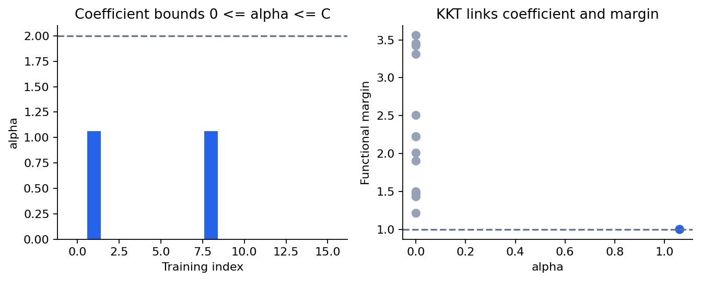
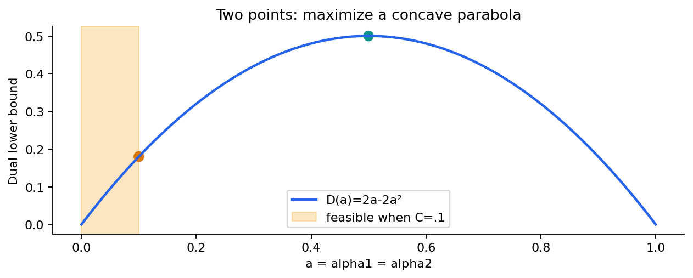
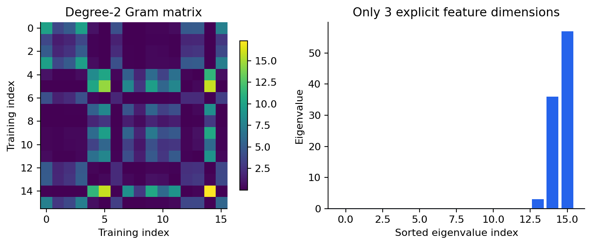
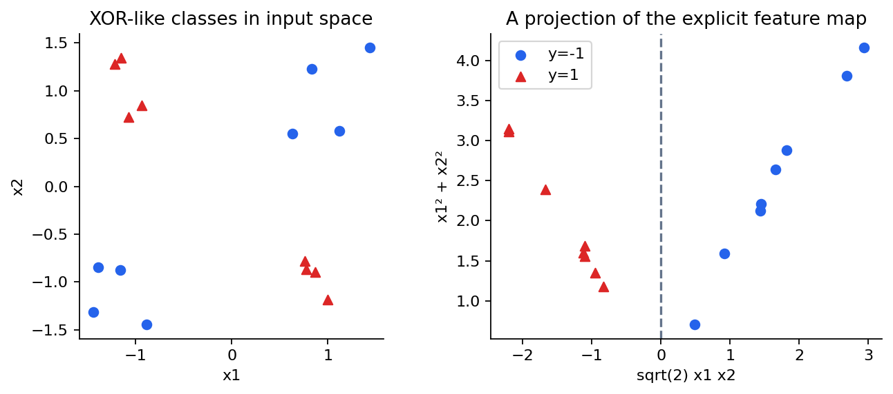
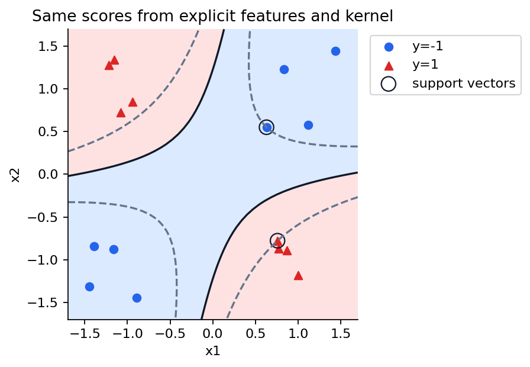
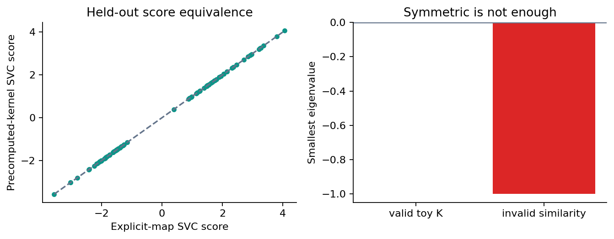

# 第065讲 对偶与核技巧

## 1 为什么要换一组未知量

上一讲在参数w、偏置b和松弛xi上求软间隔解。现在想象每个样本有上百万维特征：如果目标与预测只需要某种内积，我们能否跳过显式构造这些维度？回答这个问题之前，必须先知道为什么最优w能够由训练样本表示，以及换变量之后是否仍在解同一个优化问题。

本讲从拉格朗日乘子出发，按顺序推弱对偶、强对偶的条件、SVM对偶、KKT条件和偏置恢复，最后才进入核技巧。直接先修是第010、012、016、064讲。重点不是背一张乘子公式表，而是能从约束符号逐步推到可核验的数值结果。

实验包含三个层次：两个点的解析解；所有乘子都到上界时的偏置区间；二维异或型数据上，显式三维特征与对应二次核的四条实现路线。数据均为原创合成，C和核预先固定，测试只用于实现等价性和一次预测评估，不进行调参。

## 2 把约束写成统一方向

上一讲的原始问题为：

$$P^*=\min_{w,b,\xi}\frac12\|w\|^2+C\sum_i\xi_i$$

$$\text{s.t.}\quad1-\xi_i-y_i(w^Tx_i+b)\le0,\qquad-\xi_i\le0.$$

统一写成“小于等于0”，是为了明确乘子的符号。给第一组约束乘子$\alpha_i\ge0$，第二组乘子$\mu_i\ge0$，构造拉格朗日函数：

$$L=\frac12\|w\|^2+C\sum_i\xi_i+\sum_i\alpha_i\big[1-\xi_i-y_i(w^Tx_i+b)\big]-\sum_i\mu_i\xi_i.$$

这里不是给原问题随意加上一个罚函数。乘子暂时固定，随后我们会对原变量取下确界，得到原最优值的下界；再挑选最紧的这种下界。这个方向关系决定了为什么对偶是最大化，也决定了误写一个负号会破坏什么。

## 3 弱对偶是一个简单的不等式链

对任何原始可行的$w,b,\xi$，每个约束函数都小于等于0；乘子非负，所以乘子项之和也小于等于0。因此固定乘子时，有$L(w,b,\xi,\alpha,\mu)\le P(w,b,\xi)$。

再令$q(\alpha,\mu)=\inf_{w,b,\xi}L$，则下确界不会大于任何一次具体取值，于是：

$$q(\alpha,\mu)\le L(w,b,\xi,\alpha,\mu)\le P(w,b,\xi).$$

这对每一个原始可行点都成立，故$q(\alpha,\mu)\le P^*$。在合法乘子中最大化q，得到对偶最优值$D^*\le P^*$，称为弱对偶。它不要求原问题凸，也不声称两个最优值必然相等。

一个原始可行解提供上界，一个对偶可行解提供下界。若两者相差很小，最优值只能夹在狭窄区间里。这比“两个求解器都说成功”更直接地解释了对偶间隙为何能用于验收。但必须先检查可行性，两个任意数相减很小没有意义。

## 4 逐个消去原变量

先把L按变量整理。与w有关的是$\|w\|^2/2-w^T\sum_i\alpha_i y_i x_i$，对w求导并令0，得到：

$$w=\sum_i\alpha_i y_i x_i.$$

这一步给出关键表示：最优法向量位于训练向量的线性张成空间。它不是预先假设，而是拉格朗日函数驻点条件的结果。对b而言，L中的线性系数为$-\sum_i\alpha_i y_i$。若该系数非零，b可沿某个方向趋向无穷，让L趋向负无穷。要得到有意义的有限下界，必须有：

$$\sum_i\alpha_i y_i=0.$$

同样，在已经把非负约束放进L之后，对xi取下确界时把它作为无约束实变量。其线性系数为$C-\alpha_i-\mu_i$，有限下界要求$C-\alpha_i-\mu_i=0$。结合$\alpha_i,\mu_i\ge0$，得到$0\le\alpha_i\le C$。

最后把w的最优值代回，二次项与线性项合并成负的一半范数平方：

$$D(\alpha)=\sum_i\alpha_i-\frac12\sum_{i,j}\alpha_i\alpha_jy_iy_jx_i^Tx_j.$$

因此对偶问题是最大化D，约束为$0\le\alpha_i\le C$和$y^T\alpha=0$。它有n个主要未知量，而原问题有d+n+1个未知量；但n也可能很大，所以换到对偶不是免费加速的保证。

## 5 为什么这次可以得到强对偶

只说“问题是凸的”还不够谨慎。一般凸问题若缺少适当的约束资格条件，强对偶也可能失败。一个常用充分条件是Slater条件：凸问题存在满足所有非仿射不等式严格不等号、并满足仿射等式的合适内部点。对本讲更简单地检查所有不等式严格成立就足够。

在有限训练数据、C>0的软间隔问题中，取w=0、b=0、每个xi=2，则第一组约束为1-2=-1<0，第二组为-2<0。目标是凸二次加线性，约束仿射，存在这个严格可行点；因此强对偶成立，最优原始值与最优对偶值相等。

这段论证不依赖数据线性可分。软间隔允许松弛，正是严格可行点容易构造的原因。硬间隔要另查可行性与条件，不能拿这里的xi=2去证明一个根本不允许xi的模型。C也必须按本讲假设为正有限数。

在本设置中，KKT条件既是最优解应满足的条件，也足以核验全局最优性。我们不把它推广成“任何非凸问题满足KKT就全局最优”的错误口号。

## 6 KKT把代数与支持向量接起来

本问题的条件可以分四组阅读。第一组是原始可行性：xi非负，且$m_i+\xi_i\ge1$。第二组是对偶可行性：alpha和mu非负。第三组是刚才的驻点关系：w为带标签训练向量的加权和，$y^T\alpha=0$，且$\mu_i=C-\alpha_i$。

第四组是互补松弛：

$$\alpha_i\big(m_i-1+\xi_i\big)=0,\qquad(C-\alpha_i)\xi_i=0.$$

乘积为0意味着相关乘子和约束余量不能同时严格为正。由它们可读出三种情况：若alpha=0，则在最优解中xi=0，因而m≥1；若0<alpha<C，则xi=0且m=1；若alpha=C，则m=1-xi≤1。最后一种包括在间隔内的正确点、边界点、错分点，也可能恰好在m=1上。

不要把逆命题随意加强。m=1的点在退化问题中可能具有alpha=0，也可能处于上界；不是每个画在边缘线上的点都必须有严格内部乘子。本讲用alpha大于数值容差来定义实现中的支持向量，其对预测函数有非零贡献。

## 7 两个点让整个对偶变成抛物线

令$x_1=-1,y_1=-1$，$x_2=1,y_2=1$，C=1。等式约束为$-\alpha_1+\alpha_2=0$，因此两者都等于a。w恢复公式给出$w=a(-1)(-1)+a(1)(1)=2a$。

代入对偶目标，得到$D(a)=2a-2a^2$，约束$0\le a\le1$。求导为2-4a，令0得到a=1/2；二阶导数为负4，确为最大值。于是w=1，任选一个内部支持向量可得b=0。对偶值为1/2，原始值也为1/2，两个点的松弛都是0。

一般C下，a*=min(C,1/2)。因此C很小时两个样本都成为上界支持向量，即使它们仍然被正确分类，也会处在规范间隔内部。这个例子把C、支持向量状态和软间隔代价连在一起，避免只凭散点图猜测。

## 8 偏置恢复有一个不能跳过的边界情况

通常先算不含偏置的$g_i=\sum_j\alpha_jy_jK_{ij}$。若存在0<alpha_i<C的支持向量，KKT给出$m_i=y_i(g_i+b)=1$，因此$b=y_i-g_i$。实践中对多个内部支持向量的候选b取平均，并报告离散程度，以检查数值误差。

如果所有alpha都在0或C上，不能对一个空集合求平均，也不能随便挑一个上界支持向量硬套m=1。应根据不等式形成b的允许区间：alpha=0的正类要求b≥1-g，负类要求b≤-1-g；alpha=C的正类要求b≤1-g，负类要求b≥-1-g。

把所有下界取最大、所有上界取最小，就得到合法区间。若区间为空且超过数值容差，应怀疑乘子还不够准确或实现有错。有限非空区间可选中点；区间中的多个b可能对应同样的最优目标，这不是程序失效，而是解的非唯一性。

两点例取C=0.1时，alpha=(0.1,0.1)、w=0.2，不含偏置的g=(-0.2,0.2)。负类上界点要求b≥-0.8，正类上界点要求b≤0.8，所以b∈[-0.8,0.8]。取b=0，两行函数间隔均0.2，松弛均0.8，原始值为0.5×0.2²+0.1×1.6=0.18，对偶值也是0.18。

随包代码专门包含这个无内部支持向量的实验。数值测试还检查区间内不同b的原始目标相同。只在“恰好总有内部点”的数据上通过测试，无法发现这一类偏置恢复错误。

## 9 内积换成核之前先检查合法性

对偶只通过$x_i^Tx_j$使用输入。若某个特征映射phi把x送到更高维空间，我们可以在那个空间解同样的线性SVM；对偶中只需$\phi(x_i)^T\phi(x_j)$。定义$k(x,z)=\langle\phi(x),\phi(z)\rangle$，这个直接返回内积的函数叫核。

训练Gram矩阵为$K_{ij}=k(x_i,x_j)$。若它来自真实内积，就必须对称，而且对任意实向量c都有：

$$c^TKc=\left\|\sum_i c_i\phi(x_i)\right\|^2\ge0.$$

这就是半正定性，简称PSD。正定比半正定更强，本讲无需每个特征方向都独立。重复样本、有限维特征或线性依赖都可能产生零特征值，只要没有真实的负二次型即可。

一个函数要在整个定义域上成为这种合法核，需要对任意有限样本集合都产生对称PSD Gram矩阵。只对当前训练集算一次特征值非负，不能证明它在所有输入上合法；不过找到一个负特征值的反例，就足以否定这个候选函数的普遍PSD性。

例如矩阵[[1,2],[2,1]]对称、元素都正，却有特征值3和负1。取c=(1,-1)，二次型是负2，不可能等于某个向量范数平方。因此“越相似数越大”的直觉不足以保证它是合法核。

## 10 一个能逐项展开的二次核

对二维输入$x=(x_1,x_2)$，选$k(x,z)=(x^Tz)^2$。展开：

$$(x_1z_1+x_2z_2)^2=x_1^2z_1^2+2x_1x_2z_1z_2+x_2^2z_2^2.$$

令$\phi(x)=(x_1^2,\sqrt2 x_1x_2,x_2^2)$，则恰有$k(x,z)=\phi(x)^T\phi(z)$。中间的sqrt2不能漏掉，否则内积的交叉项系数会从2变成1，得到的是另一个核。

这个显式映射也直接证明核合法，而不是仅凭某次特征值检查。Gram的秩最多为3，样本数超过3时出现近零特征值非常正常。浮点计算中零附近可能出现极小负数，应结合矩阵尺度设容差，不能把每个-1e-15都当成严重非法核，也不能把-1随手裁成0冒充原方法。

异或型数据中，两坐标同号为负类，异号为正类。原平面中的两类分布在交错象限，单条直线无法按这个总体规则分开；特征$x_1x_2$直接表达了符号交互。核技巧没有创造新的标签，它把一个预设的非线性表征嵌入内积计算。

## 11 核SVM的预测还需要训练样本

求得alpha和b后，新点z的预测分数为：

$$f(z)=\sum_i\alpha_i y_i k(x_i,z)+b.$$

alpha为0的项不贡献分数，因此预测可以只保留支持向量。要注意库可能直接保存alpha_i y_i，而不是裸alpha；再次乘y会把标签乘两遍。scikit-learn二分类SVC的dual_coef_带符号，阅读实现时必须查清约定。

训练时预计算核矩阵形状是n_train×n_train；预测时形状是n_new×n_train，列顺序必须与拟合时的训练样本顺序一致。把测试与测试之间的核矩阵传给predict，可能维度碰巧相同却语义完全错误。

核化也没有消除计算代价。完整Gram需要二次存储，通用二次规划可能很贵；测试预测还需与支持向量计算核。下一讲比较核、尺度与近似方法的实际预算。本讲只用16行训练样本，是为了把所有矩阵、条件和数值都公开核验。

## 12 四条实现路线怎样互相检查

第一条路线用SLSQP直接最大化核对偶，再用KKT恢复偏置。第二条路线对显式phi用原始松弛问题求解。第三条路线在显式phi上用线性SVC。第四条路线用预计算Gram的SVC，并额外核对原生poly核，设置degree=2、gamma=1、coef0=0，确保恰好对应齐次二次核。

所有路线固定C=2，不进行选择；训练16行、validation24行、test80行。验证与测试用于确认分数等价，不用于挑选哪个映射更漂亮。若修改gamma或coef0，必须重新写出相应phi或明确这已是不同实验。

实际运行中，自写对偶的原始值约1.061602211689，对偶值约1.061602211689，间隙约1.69e-14；另行原始求解与对偶目标差约1.02e-13。显式SVC与预计算核SVC在测试分数上的最大差约1.78e-15，自写对偶与显式SVC差约8.96e-8。测试准确率1.0，但这只是本讲有意构造的简单无噪声交互任务，不能用来宣称现实泛化已经解决。

检查程序独立重算对偶目标、重构w、检查等式与盒约束、两组互补乘积、原始可行性和完整新运行。若只有准确率一致，仍可能藏着偏置、缩放或核系数错误；分数级一致性是更严格的验证。

## 13 练习与下一步

1. 用一句不等式链解释为什么合法乘子给原始最优值提供下界。
2. 逐项推导b与xi的有限下确界条件，说明alpha上界C从哪里来。
3. 为软间隔原始问题构造严格可行点，并说清强对偶还用到了什么假设。
4. 两点问题在C=0.25时求alpha、w、偏置区间、原始与对偶目标。
5. 为什么不能从alpha=C直接断言该点一定被分错？
6. 若没有内部支持向量，如何从四种标签/边界组合恢复b？
7. 手算x=(1,2)、z=(3,4)的二次核，并用phi内积重算。
8. 用c=(1,-1)证明[[1,2],[2,1]]不能是内积Gram。
9. n_train=16、n_test=80时，训练和预测的预计算核形状各是多少？列顺序为什么重要？
10. 一个核在本次样本上的Gram为PSD，是否已经证明它在整个输入空间合法？

本讲完成的是从原始约束到对偶证据，再到合法内积替换的完整逻辑。下一讲将选择不同核、尺度和正则化，同时正视存储与预测代价。

## 一级资料与阅读边界

Boyd与Vandenberghe的Convex Optimization第五章用于核对弱/强对偶、Slater与KKT条件；LIBSVM原始论文用于C-SVC对偶与实现背景；scikit-learn1.8.0文档用于SVC参数和预计算核接口；Cornell机器学习课程讲义用于核的PSD判据背景。所有推导、例子、代码与图由本课程独立组织，完整URL与实际核验日期见sources.md。
