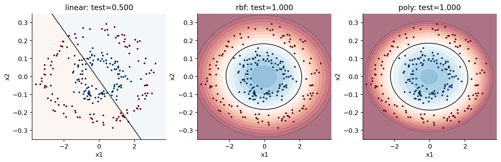
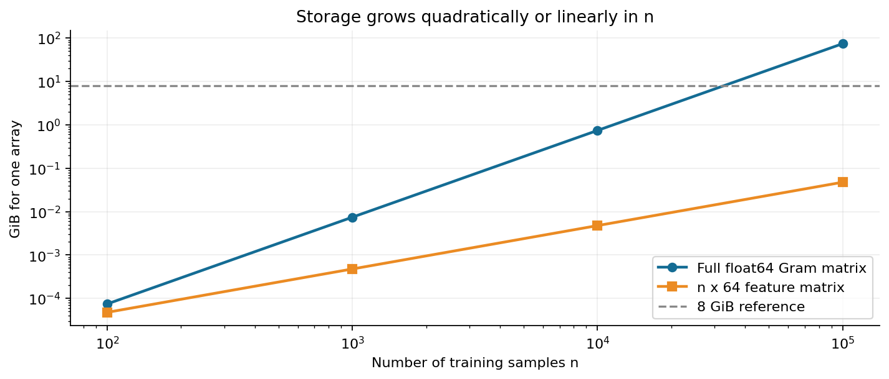

# 第066讲 核方法实验手册

## 1 要完成的实验

本手册可以独立使用。你将运行一个固定种子的双环分类实验，在相同9次验证预算下比较线性、RBF和多项式模型；逐项检查二点核岭手算；保存支持向量数量、预测延迟原始观测和不同口径的存储量；最后观察Nyström与随机傅里叶特征的近似误差。

成功标准不是“出现一张好看的图”，而是数据来源一致、验证选择没有查看测试标签、从零计算与库相符、普通及优化Python均通过显式测试，且你能准确解释性能数字的口径。

## 2 环境和运行方式

运行实验不需要联网，不需要GPU。首次安装软件需联网。推荐Python 3.12，随包的requirements.txt固定NumPy 2.3.5、SciPy 1.17.0、scikit-learn 1.8.0、Matplotlib 3.10.8、nbformat 5.11.1、nbclient 0.11.0、ipykernel 7.4.0、pandas 2.2.3。实验使用threadpoolctl，它随scikit-learn依赖安装。

进入本讲目录后，选用一种环境方式。不要把两个方式混在同一目录里反复安装。

```bash
conda env create -f environment.yml
conda activate ml066
```

或使用独立虚拟环境：

```bash
python3.12 -m venv .venv
. .venv/bin/activate
python -m pip install -r requirements.txt
```

下面命令都在本讲目录执行。实验结果写入outputs，不覆盖冻结的参考结果。

```bash
python experiment.py --out outputs/my-run/result.json
python test_experiment.py --report outputs/my-run/result.json --out outputs/my-run/tests.json
python -O test_experiment.py --report outputs/my-run/result.json --out outputs/my-run/tests-O.json
python plots.py --report outputs/my-run/result.json --directory outputs/my-run/figures
python execute_notebook.py --out outputs/my-run/experiment.ipynb
```

最后两个测试报告的status必须为passed，检查数量相同。测试不用assert，因而-O模式不会悄悄关闭验证。报告里的python_optimized在普通模式为false，在-O模式为true。

## 3 数据字典与来源审计

数据位于data/train.csv、validation.csv和test.csv。它们都是本讲原创合成数据，没有外部下载、隐私信息或隐藏标签修订。

| 字段 | 类型与含义 | 使用边界 |
| --- | --- | --- |
| id | 全单元唯一行标识 | 不作为特征 |
| x1 | 第一坐标 人为放大3倍 | 数值特征 |
| x2 | 第二坐标 人为缩小为0.25倍 | 数值特征 |
| y | 0表示外环 1表示内环 | 分类目标 |

训练240条、验证120条、测试120条；各份类别均衡。角度均匀抽样，半径围绕1或0.43并叠加标准差0.09的高斯扰动。随机种子66021，CSV保留12位小数，后续训练读取这些冻结字节而不是未舍入的生成器数组。

```bash
python generate_data.py --directory outputs/generated-data
```

该命令生成可逐字节比较的数据副本。load_data既核对generation.json记录的SHA-256，也将CSV与固定生成器的预期字节比较。因此同时修改CSV和摘要也会被拒绝。这个机制用于保护本讲固定实验，不是一般数据真实性认证；若研究新数据，应建立新的来源记录和新实验协议。

## 4 先独立验证一个核值

在Python或Notebook里执行：

```python
import numpy as np
from kernels import rbf
X = np.array([[-0.5], [0.5]])
K = rbf(X, X, gamma=np.log(2))
print(K)
```

应得到对角为1、非对角为0.5的二乘二矩阵。然后把gamma翻倍。距离为1处原来的0.5应变为0.25。不要先拿测试集准确率判断这个函数是否正确；最小数值实例更容易定位实现错误。

kernels.py的rbf使用两两平方距离，输出行对应第一个输入矩阵的样本、列对应第二个输入矩阵的样本。输入需要是二维数组，单特征两样本应写成形状(2,1)，而不是形状(2,)的一维列表。

## 5 运行核岭手算对照

```python
from kernels import krr_fit, krr_predict
model = krr_fit(X, [1.0, -1.0], alpha=0.5,
                gamma=np.log(2))
print(model['coefficient'])
print(krr_predict(model, [[-0.5], [0.0], [0.5]]))
```

预期系数为[1,-1]，三个预测为[0.5,0,-0.5]。正则化目标采用未平均平方误差，训练预测不精确穿过标签是正常现象。experiment-result.json的hand_krr同时保存Gram矩阵、系数、查询点、从零与库预测，以及最大误差。

若误差明显超过浮点舍入，先核对alpha是否误用了平均损失中的lambda；再核对gamma与长度尺度换算；最后核对交叉矩阵的行列顺序。不要为了让测试通过而直接把库结果复制进从零模型。

## 6 阅读公平搜索记录

每个模型族的trials长度必须为9。每行记录参数、验证预测、验证准确率、拟合秒数和标准化均值。best_trial是验证准确率最高的第一个索引。最终预测在重新拟合360条训练加验证数据后生成。

可用如下代码检查模型选择，而不是只查看最终分数：

```python
import json
from pathlib import Path
r = json.loads(Path('experiment-result.json').read_text())
for name, row in r['models'].items():
    selected = row['trials'][row['best_trial']]
    print(name, selected['params'],
          selected['validation_accuracy'],
          row['test_accuracy'], row['support_vectors'])
```

冻结结果中，线性选C等于0.0001，RBF选C等于1且gamma等于0.1，多项式选C等于0.1且次数2。测试准确率依次为0.5、1、1。RBF与多项式支持向量分别为100和95。线性的该字段为null，含义是不适用。

标准化均值在每次验证拟合时应与240条训练输入均值相等；最终refit_scaler_mean应与训练加验证360条均值相等。测试程序逐候选检查这个条件。由于候选使用同一训练集，均值重复并非错误。



## 7 资源记录的正确读法

single_latency对应一条查询，batch_latency对应120条查询。每种先预热3次，再计时15次，报告milliseconds原始数组、median_ms、q25_ms与q75_ms。四分位间距反映本次重复测量的离散程度，不是跨机器误差条。

selected_prediction_arrays_bytes只计算指定ndarray的存储，serialized_pipeline_bytes计算Python pickle序列化后的字节数量。程序只在内存中序列化，不读取不可信pickle。不要把其中任一字段标为进程峰值RSS。若必须报告峰值内存，应另设计隔离进程测量，明确基线、峰值、原生库分配及采样粒度。

storage字段给出理论的完整float64 Gram矩阵与64维特征矩阵大小。SVC的64MiB核缓存不表示它分配了整个Gram矩阵；理论估算只用于认识规模边界。



## 8 核近似的重现实验

近似部分使用训练集前160条，并在这160条上拟合标准化。核固定gamma等于1。每种方法使用8、16、32、64维特征，每个配置运行种子0至4，保存5个相对Frobenius误差。

这部分不调分类器，不使用测试标签，也不比较任务准确率。m相同只是特征数量相同，并不是变换时间或内存都相同。若要扩展为部署比较，须把特征变换与线性模型一起纳入管线、验证预算和预测计时。

冻结结果中64维Nyström误差均值约0.003312，RFF约0.390778。个别种子不必随着m严格下降，误差大于1也不违反定义，因为分子可以大于原矩阵范数。图里的误差线为5个种子的样本标准差。

## 9 Notebook和PDF怎样重建

experiment.ipynb保留实际执行的代码、输出和所有六张图。execute_notebook.py在新的Python进程中启动真实IPython InProcessKernel，按顺序执行代码单元并保存输出；它不依赖浏览器界面，也不声称已验证外部socket内核传输。每个代码单元若产生异常，执行器报错，不能把部分输出当成成功。

PDF构建另需build-requirements.txt中的Markdown与WeasyPrint、package.json中的MathJax 3.2.2，以及系统Pango、Noto Sans/Serif CJK与DejaVu Sans Mono字体。

```bash
python -m pip install -r build-requirements.txt
npm install
python build_pdf.py --directory outputs/rebuilt-pdf
```

build_pdf使用本地MathJax生成公式SVG后排版，不在构建时访问网络。PDF来自随包Markdown和冻结figures目录；重新跑实验产生的计时不同，不会自动改写教材中的本次观测。若要出版新的数值版本，应先明确更新文本与图，再重建并逐页检查。

已装好所有构建依赖时可运行bash build_all.sh，全部输出写入outputs/rebuild。PYTHON_BIN可指定已有环境的解释器，NODE_PATH可指定外置MathJax安装目录。环境安装命令是供学习者重现使用，包内构建脚本不自动安装任何软件。

## 10 验收清单和故障排查

- 数据三份互不重叠且与固定生成器一致；篡改数据或数据加摘要均被拒绝。
- 从零核值、KRR系数和预测与独立手算及库对照一致。
- 每族恰为9次验证拟合，选择仅用验证，最终另重训一次。
- 延迟保留原始重复观测，数组大小与序列化大小不冒充峰值内存。
- 普通与-O模式检查全部通过，报告篡改和不安全输出路径被拒绝。
- Notebook执行计数连续，无error输出，六张图都嵌入。

出现维度错误时先打印X.shape。出现核溢出时先检查多项式次数与输入量级。出现结果不同时先看版本、数据字节和候选列表，计时不同本来就是预期现象。出现中文PDF方框时检查CJK字体，不要据此修改实验数据。ConvergenceWarning被设置为错误，不能在未收敛情况下悄悄保存漂亮结果。

## 11 扩展任务

在不改冻结数据与报告的前提下，另建实验目录，尝试不同噪声强度、样本量或高维噪声特征。事先规定比较指标、预算与测试划分，写出什么结果会让你放弃核模型。完成后至少报告一个不支持“核一定更好”的情况。先写协议、后看结果，是本实验最重要的迁移能力。
