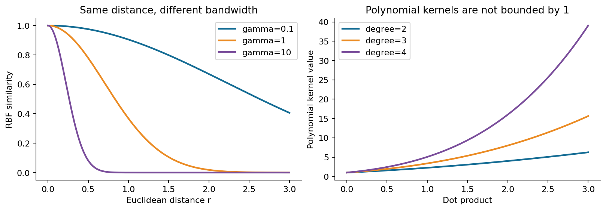
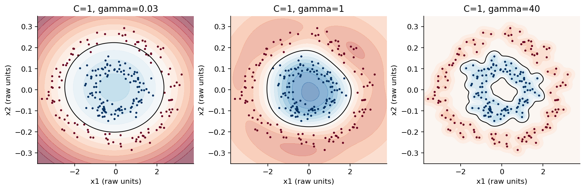
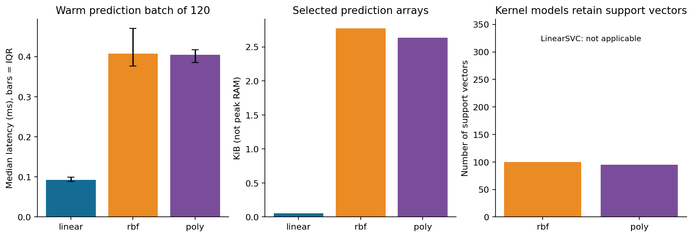
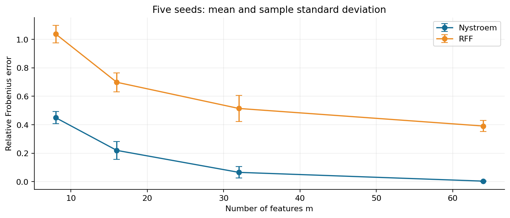

# 第066讲 核方法的选择与代价

## 1 一条弯曲边界到底花了什么

假设一组点围成大圆，另一组点围成小圆。我们想根据位置判断一个新点属于哪一组。直线不能把内环和外环分开，而距离中心的平方可以：把二维坐标变成包含平方项的新特征后，一条平面就能表达圆形边界。第065讲介绍的核技巧，使我们不必先列出所有新特征，也能计算那个空间里的内积。

但“省掉显式展开”不等于“省掉所有计算”。输入单位改变会改变距离，带宽会改变两个点的影响范围，正则化会决定模型多愿意追随训练样本。训练时还可能要处理一个样本数平方规模的核矩阵，预测时可能要保留很多训练样本。核、尺度、正则化和资源预算必须一起决定。

本讲直接先修为第039、051、053至054、065讲。读完后，你应能算出一个小核岭回归模型，说明RBF与多项式核表达了什么假设，设计同等验证预算的比较，并区分核矩阵大小、模型数组大小、序列化大小与实际内存峰值。本文数据全部为原创合成数据，不涉及真实个人信息。

## 2 先把对象的形状写清楚

设训练输入为$X\in\mathbb R^{n\times d}$。这里$n$是样本数，$d$是每条样本的原始特征数。第$i$行是向量$x_i$。核函数$k(x,z)$接收两个输入，输出一个标量。核矩阵或Gram矩阵则是把全部两两核值放在一起：

$$K_{ij}=k(x_i,x_j),\qquad K\in\mathbb R^{n\times n}.$$

若有$q$个待预测输入，交叉核矩阵$K_{*X}$有$q$行、$n$列。不要因为训练矩阵是方阵，就把测试时的矩阵也写成方阵。代码中的许多“能运行但答案错了”的问题，都来自转置方向没有按对象含义核对。

一个合法的实值核应使任意有限输入集合得到对称半正定矩阵。半正定表示任意系数向量$c$都满足$c^\top Kc\geq0$。它保证这些数可以解释为某个特征空间里的内积。这里“相似度”只是直觉；合法核不要求每个元素都在0到1之间，也不要求每个元素非负。

本讲提供从零RBF、多项式核和核岭求解器。测试除了对照库，还检查对称性、特征值和手算数值。有限几个矩阵通过检查不能证明一个任意新函数总是合法核；本讲使用已有理论保证的核族，数值检查负责发现实现错误。

## 3 RBF核把距离变成影响范围

RBF是径向基函数核的常用简称。我们使用高斯形式：

$$k(x,z)=\exp\big(-\gamma\lVert x-z\rVert^2\big)=\exp\left(-\frac{\lVert x-z\rVert^2}{2\ell^2}\right),\qquad \gamma=\frac1{2\ell^2}.$$

$\gamma$和$\ell$表达同一件事，但方向相反：$\gamma$越大，长度尺度$\ell$越小。距离不为零时，较大的$\gamma$让相似度更快衰减，因此一个样本只强烈影响附近很小的区域。较小的$\gamma$使更远的点仍相似。距离为0时，任何正$\gamma$下核值都等于1。

用一个可心算的例子理解带宽。若两点距离为1，$\gamma=\log 2$时核值为$1/2$；若距离翻倍为2，平方距离变成4，核值成为$1/16$，并不是$1/4$。指数里面是平方距离，这一点比背诵“越远越不相似”更有用。

当$\gamma$极小，很多不同点都非常相似，核矩阵接近全1矩阵，模型可能难以区分局部结构；当$\gamma$极大，不同训练点近乎互不相似，核矩阵接近单位阵，模型可以形成非常局部的响应。是否过拟合仍取决于正则化和数据分布，不能只凭$\gamma$一个数下结论。

## 4 输入尺度是模型假设的一部分

若第一维用米，第二维用毫米，直接计算欧氏距离会让毫米这一维的数值变化更占优势。把同一物理量从米换成厘米，相差100倍的坐标会在平方距离中放大为10000倍。数据的几何关系是否合理，必须先于调参讨论。

标准化用训练集均值$\mu_j$和标准差$s_j$把特征变成$\tilde x_j=(x_j-\mu_j)/s_j$。这并不是纯粹“方便计算”的无害操作，而是重新定义各方向的距离权重：

$$\lVert\tilde x-\tilde z\rVert^2=\sum_{j=1}^{d}\frac{(x_j-z_j)^2}{s_j^2}.$$

如果某维波动主要是噪声，自动缩放到单位方差也不一定合适；业务量纲、测量误差和领域知识可能要求不同权重。我们先用标准化作为可复现基线，再通过严格的验证比较其他选择。

本讲双环数据故意把第一维乘3、第二维乘0.25。同一组已选RBF参数，使用标准化管线的测试准确率为1.0000，不标准化的预先规定诊断对照为0.7667。这个结果说明输入单位有实际影响，不能推出“标准化对所有任务都有益”。该诊断没有额外调参，不参加三个模型族的公平搜索排名。

验证阶段，均值与标准差只能用训练集拟合。即使标准化不看标签，也不能提前把验证或测试输入分布加入拟合。最终参数选好后，可以按预先协议在训练加验证集上重新拟合整条管线，但测试数据始终不参与。

## 5 多项式核表达全局交互

多项式核采用：

$$k(x,z)=(\gamma x^\top z+c_0)^p.$$

本讲要求正整数次数$p$、非负$\gamma$和$c_0$，以使用标准的半正定构造。若$p=2$、$\gamma=1$、$c_0=0$，对二维输入展开：

$$ (x_1z_1+x_2z_2)^2=x_1^2z_1^2+2x_1x_2z_1z_2+x_2^2z_2^2.$$

因此可取特征映射$\phi(x)=(x_1^2,\sqrt2x_1x_2,x_2^2)$。中间的$\sqrt2$不是装饰：两个特征内积相乘时，必须恢复系数2。若$c_0>0$，展开还会包含较低阶项；齐次核与非齐次核所含的特征不同。

RBF强调局部距离，多项式核强调坐标的乘积与全局交互。高次数可能在远处急剧放大，即使训练区域边界看起来很好，也应检查域外行为、数值范围与稳定性。我们实现里检测核值溢出；“模型输出一个数”不代表该数在训练范围外有可靠含义。

## 6 正则化与核带宽必须共同选择

核SVM的决策函数可以写成$f(x)=\sum_{i\in SV}\alpha_i y_i k(x_i,x)+b$。集合$SV$包含支持向量，$C$控制对间隔违例的惩罚强度。较大的$C$通常更不愿容忍训练违例，但它并不独立决定曲线有多弯，因为核本身决定可表达的相似关系。

想象把每个样本的影响范围缩小后，仍使用很强的正则化。模型也许没有足够自由度把每个训练点包起来。反过来，即使$C$很大，极宽的RBF核也未必能分开复杂结构。因此应比较$(C,\gamma)$组合，而不是先用全数据定一个“最佳带宽”，然后只报告$C$的验证结果。

不同库或不同目标的正则化参数不能按名称直接互换。SVM中的$C$越大通常正则化越弱；核岭回归中的$\alpha$越大正则化越强。即便都叫alpha，目标是否除以样本数也会改变参数数值。本讲下一节专门固定这个约定。

## 7 从岭回归推到核岭回归

核岭回归KRR仍然预测连续值。设特征空间中的函数为$f(x)=\langle w,\phi(x)\rangle$，暂不另设截距，优化未平均的平方误差与范数惩罚：

$$J(w)=\sum_{i=1}^{n}(y_i-f(x_i))^2+\alpha\lVert w\rVert^2,\qquad\alpha>0.$$

为什么答案只需训练点对应的特征向量？把$w$拆成训练特征张成空间中的分量与其正交分量。正交分量和每个$\phi(x_i)$的内积都为0，所以不能改善任何训练预测，却会增加范数惩罚。一个最优解不需要它。这就是本讲所需的有限样本表示思想。

令$w=\sum_i a_i\phi(x_i)$，训练预测是$Ka$，范数平方是$a^\top Ka$，得到：

$$J(a)=(y-Ka)^\top(y-Ka)+\alpha a^\top Ka.$$

求导为$2K(Ka-y)+2\alpha Ka$。取满足下面线性方程的$a$，导数一定为0：

$$(K+\alpha I)a=y,\qquad\widehat f(X_*)=K_{*X}a.$$

若$K$奇异，不能从导数方程中随意“约掉K”。但$K+\alpha I$在$\alpha>0$时正定，以上解仍给出有效最优函数；不同系数表示若只相差$K$的零空间分量，不改变函数在相关特征空间中的表现。代码用Cholesky分解和线性方程求解，不显式求逆。

若另一份教材使用$(1/n)\sum_i(y_i-f_i)^2+\lambda\lVert w\rVert^2$，两边乘$n$后才可对照，故本讲$\alpha=n\lambda$。忘记这个$n$，会在改变样本量时无意改变正则化含义。scikit-learn的KernelRidge接口与本讲未平均目标的alpha约定对齐；我们用实际数值对照验证。[KernelRidge 1.8.0接口](https://scikit-learn.org/1.8/modules/generated/sklearn.kernel_ridge.KernelRidge.html)

### 一个完整的二点手算

取$x_1=-0.5$、$x_2=0.5$，目标$y=(1,-1)^\top$，RBF参数$\gamma=\log2$，正则化$\alpha=0.5$。由于两点距离为1：

$$K=\begin{pmatrix}1&1/2\\1/2&1\end{pmatrix},\quad K+\alpha I=\begin{pmatrix}3/2&1/2\\1/2&3/2\end{pmatrix}.$$

把$a=(1,-1)^\top$代入，左边第一行为$1.5-0.5=1$，第二行为$0.5-1.5=-1$，正好等于目标。因此系数就是$(1,-1)$。训练点的预测却是$Ka=(0.5,-0.5)^\top$，并不等于原目标。正则化主动牺牲一部分拟合来限制函数范数。

中点$x_*=0$到两个训练点距离相同，所以两项核值相同，乘上相反系数后恰好抵消，预测为0。实际从零程序与KernelRidge都输出$[0.5,0,-0.5]$。这个例子同时展示了核矩阵、正则化、求解和新点预测，不能只检查最后一个均方误差。

## 8 同等验证预算究竟怎样执行

实验固定三份互不重叠数据：训练240条、验证120条、测试120条，类别各占一半。三个模型族各有9个候选，每个候选只拟合一次训练集并评估同一个验证集。线性基线使用LinearSVC；RBF和多项式使用SVC。前者和后者的损失与求解实现不同，因此这是实用模型族比较，不声称实验只改变核而固定了其余一切。[SVC接口](https://scikit-learn.org/1.8/modules/generated/sklearn.svm.SVC.html)

- 线性：$C=10^{-4},10^{-3},\ldots,10^4$，共9个候选。
- RBF：$C\in\{0.1,1,10\}$与$\gamma\in\{0.1,1,10\}$，共9个组合。
- 多项式：$C\in\{0.1,1,10\}$与$p\in\{2,3,4\}$，固定$\gamma=0.5,c_0=1$，共9个组合。

选出每族验证准确率最高的候选，同分时取预先枚举的第一个。计时和测试表现不参与同分处理。之后每族在训练加验证的360条上重训一次，再评估封存测试集。每族9次验证拟合加1次最终拟合，完整候选结果保存在JSON中。

“同等预算”在这里精确定义为相同候选数、相同划分与评价次数，不是相同墙钟时间，也不保证三个搜索空间同样容易找到好参数。若业务约束是每个模型只能训练十分钟，应该另设时间预算实验。固定一次划分也无法估计所有数据抽样不确定性；严肃模型选择应根据任务使用重复划分或嵌套交叉验证。

| 模型族 | 验证选中配置 | 验证准确率 | 最终测试准确率 | 支持向量 |
| --- | --- | --- | --- | --- |
| LinearSVC | C等于0.0001 | 0.5333 | 0.5000 | 不适用 |
| RBF SVC | C等于1 gamma等于0.1 | 1.0000 | 1.0000 | 100 |
| 多项式SVC | C等于0.1 degree等于2 | 1.0000 | 1.0000 | 95 |

## 9 预测开销不能只看特征维数

显式线性模型保存一个$d$维权重向量和截距。一次预测主要是向量内积。核SVM要与支持向量计算核值，常见成本约随$n_{SV}d$增长，此外还有核函数本身的计算。支持向量很少时推理可能较快；若大部分训练点成为支持向量，模型保存量和预测开销都会增加。

核岭回归一般不是稀疏表示，通常要保留所有训练输入与$n$个系数。它具有容易写出的线性求解公式，不意味着每个任务上都更快，更不意味着部署时无需训练数据。库文档对KRR与SVR的比较也强调了稀疏性的区别；本讲不复制其特定机器的倍数结论。[核岭回归说明](https://scikit-learn.org/stable/modules/kernel_ridge.html)

我们对每个模型先预热3次，再分别测单样本和120样本批次各15次，记录全部观测、中央值和四分位数。BLAS线程限制为1，但宿主机可能有其他负载。因此冻结结果中的批预测中央值约为线性0.093毫秒、RBF 0.408毫秒、多项式0.405毫秒，只是本次环境的观测，不能当作跨设备性能保证。单样本延迟与批平均每条成本不是同一个量。

数组计数只包含选定的预测相关ndarray：标准化均值与尺度，以及模型权重或支持向量、对偶系数、支持索引与截距。本次分别是56、2840、2700字节。序列化整个管线约1015、5150、4971字节。两者都不是进程峰值内存，忽略了Python对象开销、求解器工作区、其他数组和库本身。明确标注口径比给出一个没有定义的“内存大小”更重要。

## 10 为什么完整核矩阵会成为瓶颈

若保存一个float64的$n\times n$矩阵，每个元素8字节，总共$8n^2$字节。样本数增加10倍，矩阵元素数量增加100倍。十万样本对应约74.51GiB，仅这一个矩阵就超过许多机器的内存。GiB的换算使用$2^{30}$字节，不能和十进制GB混写。

这是完整稠密矩阵的存储估算，不等于每个核算法都一定一次分配整个矩阵。SVC通常使用缓存和分解策略，缓存可设上限；本讲指定64MiB缓存。KRR的稠密精确解则常需要矩阵分解，标准Cholesky时间随$n^3$增长。具体算法、稀疏结构与迭代求解会改变实现成本，不能把一个公式当成所有核方法的精确运行时间。

## 11 用近似特征换取规模

Nyström方法先挑$m$个代表输入作为landmarks。令$C=K(X,Z)$是$n\times m$矩阵，$W=K(Z,Z)$是$m\times m$矩阵，近似写为$K\approx CW^{\dagger}C^\top$。符号$\dagger$表示伪逆。通过分解$W$可以构造显式特征，使这些特征的内积近似原核；代表点的选择与小特征值处理会影响误差和稳定性。

随机傅里叶特征RFF对平移不变RBF核使用随机频率。对$k(x,z)=\exp(-\gamma\lVert x-z\rVert^2)$，取$\omega_j\sim\mathcal N(0,2\gamma I)$、$b_j$在$[0,2\pi]$均匀分布，并定义：

$$\phi_j(x)=\sqrt{\frac2m}\cos(\omega_j^\top x+b_j).$$

对随机抽样取期望时，$\phi(x)^\top\phi(z)$对应目标核；有限$m$时有近似误差。此后可以在$m$维特征上训练线性模型。RFF频率不依赖训练坐标的具体取值，Nyström的landmarks来自训练输入。若在交叉验证中使用Nyström，代表点也必须在每折训练部分选取。[官方核近似说明](https://scikit-learn.org/stable/modules/kernel_approximation.html)

本实验只比较训练集前160条的固定RBF Gram矩阵，不用测试标签。每种近似、每个$m$运行5个随机种子，报告相对Frobenius误差$\lVert K-\Phi\Phi^\top\rVert_F/\lVert K\rVert_F$。Frobenius范数就是所有元素平方求和再开方，因而该量衡量矩阵整体相对偏差，而非分类错误率。

当$m=8$时，Nyström平均误差约0.4494，RFF约1.0378；到$m=64$时分别约0.0033与0.3908。在这个低维、小样本、特定尺度的问题里，Nyström更精确。这不证明它在相同时间预算下必胜，因为相同特征数并不代表相同变换成本，而且更低的核近似误差未必转化为更低的任务误差。五个种子的误差线是样本标准差，不是置信区间。

## 12 怎样形成一个可审查的选择结论

从一个合理的线性基线开始，先检查特征单位和训练管线。再给核模型明示的验证预算，同时选核参数和正则化。选择之后才打开测试评估，并把预测延迟与存储口径放在同一份报告中。若资源成本成为瓶颈，尝试近似特征时也要重新验证任务指标，不只是检查漂亮的核矩阵热图。

本次证据支持的结论很具体：在给定双环数据、固定搜索范围和相同9次验证预算下，核模型有效表达了非线性结构，而线性基线未能做到；核模型保留更多预测状态，批预测也更慢。结论不覆盖高维稀疏文本、分布变化、不同硬件和未经试验的样本规模。

继续学习Gaussian过程时，你会再次遇见$K+\text{对角项}$，但用途会增加：除了预测均值，还要表达对未知函数的概率分布。相似的矩阵代数不等于完全相同的建模解释。本讲先把核选择和成本说清楚，下一讲再研究不确定性从哪里来、又不能保证什么。

## 练习

1. 两点距离由1变为2，RBF核值原为1/2，新的核值是多少？写出gamma。
2. 把所有坐标同时乘10，怎样改gamma可保持RBF核不变？只放大一维又如何？
3. 取$\gamma=1,c_0=0$，展开二维齐次二次核，并写出含正确缩放系数的显式特征。
4. 用本讲二点例子验证核岭系数与三个查询点预测，并解释训练误差为什么不为零。
5. 若目标采用平均平方误差，样本数为200、lambda为0.01，应向本讲求解器传入多大alpha？
6. 50000样本的一个float64完整Gram矩阵是多少GiB？64维特征矩阵呢？
7. 每族候选数相同为什么仍不等于所有意义上的公平？至少给出三种预算口径。
8. 为什么支持向量数不能代替真实延迟？为什么序列化文件大小不能写成峰值内存？
9. 近似核误差更低是否保证测试准确率更高？给出检查流程。
10. 假设你看完测试集后增加了一个gamma候选，新的最佳测试分数还能当封存评估吗？设计补救方案。

## 资料与复核

教材公式与原创手算使用标准线性代数推导；代码接口按scikit-learn 1.8.0冻结，2026年10月7日重新检索一级资料并实际对照。Nyström的原始工作为Williams与Seeger的[论文记录](https://papers.nips.cc/paper_files/paper/2000/hash/19de10adbaa1b2ee13f77f679fa1483a-Abstract.html)，RFF原始工作为Rahimi与Recht的[论文](https://papers.nips.cc/paper_files/paper/2007/file/013a006f03dbc5392effeb8f18fda755-Paper.pdf)。本讲图表、数据、实验结果及文字解释均为重新制作，未复用来源图表。完整检索范围见sources.md与source-checks.json。
