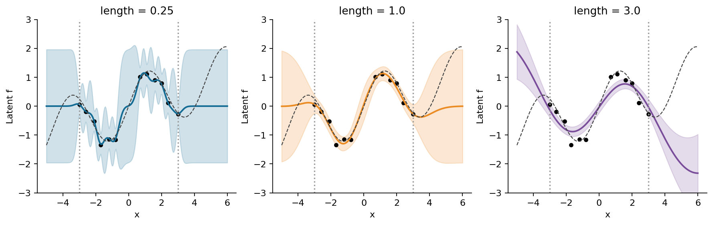
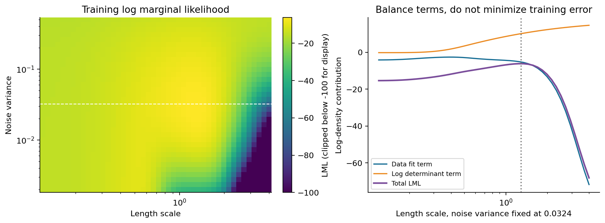

# 第067讲 Gaussian过程实验手册

## 1 实验目标和验收证据

本手册从零运行GP回归，不要求先打开讲义。目标有四个：手算一个二点后验；用Cholesky实现与sklearn比较完整均值和协方差；区分物理噪声、jitter、alpha与WhiteKernel；通过长度尺度、噪声和外推实验检查概率区间的适用边界。

成功证据包括冻结CSV、可再生数据、真实数值报告、普通与-O显式测试报告、带执行输出及七张嵌入图的Notebook，以及可重新构建的PDF。图上的95%带都指模型条件下的点态区间，不能把它们描述成一切模型误差的保证。

## 2 创建环境

实验使用CPU，核心计算规模为12条训练观测。固定Python 3.12及随包requirements.txt中的NumPy 2.3.5、SciPy 1.17.0、scikit-learn 1.8.0、Matplotlib 3.10.8和Notebook依赖。首次安装需联网，已经安装后的实验与PDF构建没有网络请求。

```bash
conda env create -f environment.yml
conda activate ml067
```

不使用Conda时可改用：

```bash
python3.12 -m venv .venv
. .venv/bin/activate
python -m pip install -r requirements.txt
```

进入本讲目录后运行：

```bash
python experiment.py --out outputs/my-run/result.json
python test_experiment.py --report outputs/my-run/result.json --out outputs/my-run/tests.json
python -O test_experiment.py --report outputs/my-run/result.json --out outputs/my-run/tests-O.json
python plots.py --report outputs/my-run/result.json --directory outputs/my-run/figures
python execute_notebook.py --out outputs/my-run/experiment.ipynb
```

所有输出放在新目录，保留冻结参考文件不变。若使用其他解释器或库版本，先记录变化，再讨论差异；不要悄悄换版本后要求所有字节完全一致。

## 3 数据字典和评估边界

三份CSV均为原创合成数据，随机种子67021。潜在函数为sin(1.35x)加0.18x，测量噪声独立且标准差为0.18。CSV固定12位小数，实验读取这些文件。

| 字段 | 含义 | 能否用于拟合 |
| --- | --- | --- |
| id | 全单元唯一行标识 | 否 |
| x | 一维输入坐标 | train中的x可以 |
| f_true | 无噪声潜在真函数 | 仅评估与作图 |
| y | f_true加独立测量噪声 | 只用train中的y |

train有12条，输入在[-3,3]且中间存在缺口；interpolation有121条均匀网格；extrapolation有121条，输入在[3.2,6]。后两份的真值与观测不进入核拟合和超参数选择。插值与外推各自的网格点不是独立数据重复。

```bash
python generate_data.py --directory outputs/generated-data
```

加载函数既核对SHA-256，也与生成器预期字节比对，修改CSV加上同步修改摘要仍被拒绝。想研究不同生成机制时应复制方案到独立实验，不篡改本讲固定验收数据。

## 4 手工构造二点后验

用两个输入-1与1、两个观测1与-1、信号方差1、噪声方差0.25。长度尺度选sqrt(2/log2)，使训练点间核值正好0.5。

```python
import numpy as np
from gaussian_process import fit, predict
X = np.array([[-1.0], [1.0]])
y = np.array([1.0, -1.0])
ell = np.sqrt(2 / np.log(2))
model = fit(X, y, length_scale=ell,
            noise_variance=0.25, jitter=0.0)
mean, covariance = predict(model, [[0.0]])
print(model['C'])
print(model['a'])
print(mean, covariance)
```

C应为对角1.25、非对角0.5；求解系数应为[4/3,-4/3]；中点均值为0，允许约1e-16舍入；潜在方差应为0.1918779643582316。若调用predict(model, [[0.0]], observation=True)，均值不变，方差应为0.4418779643582316。

这个API返回协方差，不是标准差。要画区间应先对对角元素开平方，再乘1.96。不要把方差直接当作上下边界的距离。

## 5 对齐库参数后再比较

```python
from sklearn.gaussian_process import GaussianProcessRegressor
from sklearn.gaussian_process.kernels import RBF
library = GaussianProcessRegressor(
    kernel=RBF(ell, length_scale_bounds='fixed'),
    alpha=0.25, optimizer=None, normalize_y=False)
library.fit(X, y)
mu_lib, cov_lib = library.predict([[0.0]], return_cov=True)
print(mu_lib, cov_lib)
```

optimizer=None保证参数不被重新学习；normalize_y=False保证目标没有被重新中心化或缩放；alpha=0.25是方差，不是标准差。若设normalize_y=True，训练目标及其尺度处理会改变对照问题，必须重新推导和检查噪声的单位。

完整实验的五组机制对照使用241个查询点，同时比较均值向量、完整协方差矩阵和LML。最大差统一要求小于1e-8，本次均值差约1.16e-11、协方差差约1.15e-13、LML差约5.94e-10。误差最大的一组涉及低噪声下的数值敏感性，不必要求所有结果逐位相同。

## 6 长度尺度和物理噪声实验

variants中的五行分别为短尺度0.25、参考尺度1、长尺度3、噪声方差0.0001、噪声方差0.36。前三行固定噪声0.0324，后两行固定长度尺度1。每行都保留网格均值、潜在方差、训练LML及插值与外推评估。

首先只看前三行，比较改变核尺度带来的曲线和区间变化；再把参考行与最后两行比较，隔离噪声假设的作用。一次改两个参数就无法把现象直接归因于其中之一。



reference行的插值RMSE约0.08698、外推RMSE约1.22429。long length行的外推RMSE约2.81047。评估函数只把f_true用于事后比较，不把它作为训练目标传入模型。

## 7 alpha与WhiteKernel的专门检查

若RBF核的训练alpha含0.0324物理噪声加1e-10 jitter，库返回的预测协方差对应RBF潜在过程。换成RBF加固定WhiteKernel(0.0324)，并让alpha只含1e-10 jitter，训练协方差相同，而新点预测对角会多0.0324。

report的noise_api保存均值差以及预测方差差的最小值、最大值。应观察均值差近似0、所有对角差均近似0.0324。这是接口语义对照，不是两个模型表现孰优孰劣的竞赛。

如果你的方差相差恰好0.0324，先检查是潜在预测还是观测预测。不要直接提高数值容差，更不要两边都任意加噪声直到相等。

## 8 让数值问题真实发生一次

程序构造重复输入[0,0,1]且目标为[0.2,0.2,0.7]。在零噪声、零jitter时核矩阵奇异，Cholesky应抛出异常。显式设置jitter为1e-10后，记录条件数与有限系数检查。

jitter_check里的singular_without_jitter_failed必须为true。这项测试证明测试确实执行了失败路径，而不是只保存了一个“应该会失败”的文字说明。实现没有静默自适应加jitter；失败后应由调用者选择新值并写入报告。

物理噪声改变模型对观测的信任，jitter改变数值求解的扰动。两者都进入训练矩阵对角，但解释不同。在观测预测中只额外加入物理噪声，代码会专门核验这一点。

## 9 阅读边际似然实验

lml_grid记录46乘35个训练LML，横向长度尺度为0.12至4，纵向噪声方差为0.002至0.5。数组未截断；图为了显示，仅把低于-100的色值压到-100。不能用图像色条反推所有精确LML数值。

固定噪声0.0324时，fixed_noise_parts逐长度尺度存储数据项、log determinant项、常数项。三项相加就是LML。optimized另记录从预设起点和两个重启点学习到的长度尺度约1.28243，及LML约-6.16236。

所有这些选择都只使用训练观测。若你根据外推RMSE再选择另一个核，必须另设新评估协议，不能继续称原外推集为未见测试。



## 10 区间比例的阅读限制

latent_pointwise_95_fraction表示固定评估网格中，f_true落入潜在点态95%带的比例。observed_pointwise_95_fraction表示这一批模拟带噪y落入观测带的比例。二者目标不同，不能互换。

本次固定真函数不是GP先验的随机样本，网格点之间也不是独立重复。即使恰有95%的网格点落入带内，也不能由此证明未来每个个体、每个子群或整条曲线具有95%覆盖。反过来，明显低包含率能提示核或噪声假设失配。

要研究覆盖，需要另外设计重复抽样实验，明确数据生成、拟合方式、超参数是否固定、区间目标与评价单位。在本讲任务中，不应为了“达到95%”而直接乘大区间宽度后继续宣称原模型已校准。

## 11 重建Notebook和PDF

Notebook由新Python进程中的真实IPython InProcessKernel实际执行。七张PNG都嵌入输出，可离线阅读。浏览器界面及外部socket内核传输未列为已验证。execute_notebook检测任何error输出并中止，不允许伪造执行计数掩盖失败。

PDF构建依赖Markdown、WeasyPrint、本地MathJax 3.2.2、系统Pango及Noto CJK字体。

```bash
python -m pip install -r build-requirements.txt
npm install
python build_pdf.py --directory outputs/rebuilt-pdf
```

PDF由Markdown和冻结figures排版，不会自动把一次探索实验写进教材。完整命令bash build_all.sh在outputs/rebuild重跑实验、双模式测试、图、Notebook和PDF。PYTHON_BIN与NODE_PATH可指向现有外置环境；脚本不会安装软件，也不会覆盖冻结结果。

## 12 最终检查

- 数据字节与生成器一致，真函数字段未参与拟合。
- 手算后验及LML正确，完整库对照误差小于1e-8。
- 噪声标准差与方差分开，alpha与WhiteKernel语义分开。
- 重复输入无噪声无jitter的失败路径实际运行，稳定化参数明示。
- 普通与-O显式检查数相同且全部通过，篡改报告被拒绝。
- 区间标注为点态、条件于模型，理论成本不伪装为实测时间。
- Notebook无异常且七张图嵌入，三份PDF逐页可读。

最后写一段80至150字的结论，至少包含一条本次模型有效的证据和一条它失败或尚未验证的边界。仅写“GP可以给出不确定性”还不够，你需要说明这个不确定性依赖什么。
