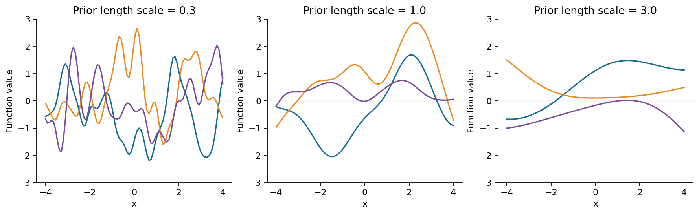
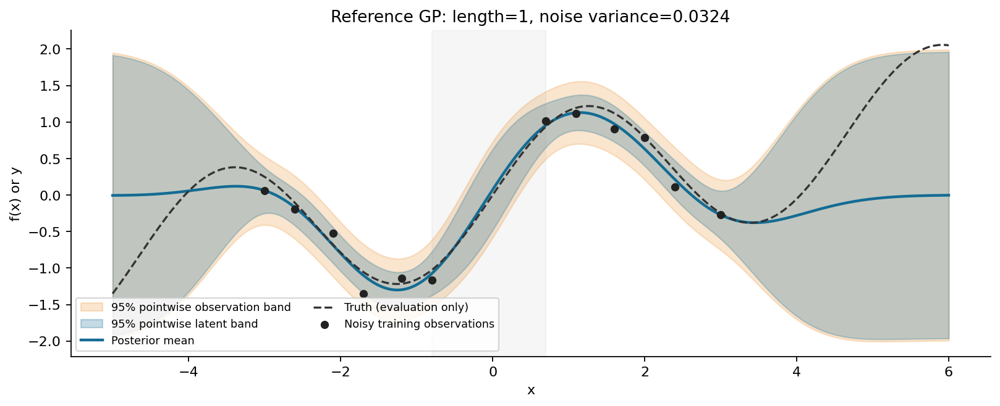
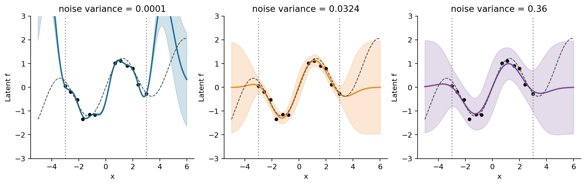
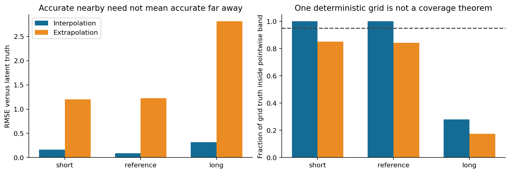
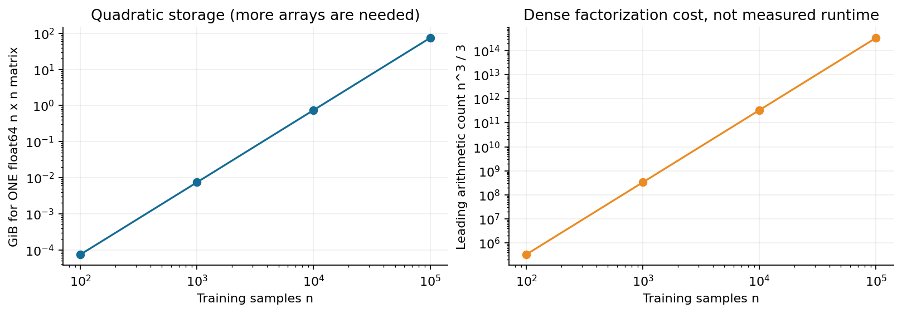

# 第067讲 Gaussian过程回归

## 1 预测一条曲线也要说明哪里不确定

有12次带噪测量，我们想预测尚未测量位置的数值。一条平滑曲线可以给出答案，但不能单凭曲线形状知道它在哪些地方可信。如果训练点之间有一段空白，或者查询点远离所有观测，模型应怎样表达自己的不确定性？Gaussian过程回归从“对未知函数的可能形状建立分布”开始回答。

Gaussian即高斯，也称正态。Gaussian过程简称GP。本讲不是让你一次想象无穷多个随机变量，而是从有限几个输入点的联合高斯分布出发：先规定这些位置上的函数值如何一起变化，再在观测到部分带噪数值后计算剩余位置的条件分布。

本讲直接先修为第012、021、024至025、029、065讲。我们会重新解释均值、协方差、条件分布及矩阵维度，完整手算二点GP，并用从零Cholesky实现逐个比较库的均值、完整协方差和边际似然。你还会看到：一个模型给出很窄的区间，并不表示它考虑了所有可能的错误。

## 2 从一个随机数到一组相关随机数

一维高斯分布$z\sim\mathcal N(\mu,\sigma^2)$用均值描述中心，用方差描述不确定程度。二维时，除了各自方差，还要说明两个量怎样一起偏离均值。协方差为正表示倾向于同向变化，为负表示倾向于反向变化，为零表示不相关；一般情况下，不相关不一定独立，但联合高斯变量满足这一特殊性质。

对$n$个位置$x_1,\ldots,x_n$，把未知函数值堆成向量$f=(f(x_1),\ldots,f(x_n))^\top$。GP要求任意有限位置集合对应一个联合高斯：

$$f\sim\mathcal N(m_X,K_{XX}),\qquad (m_X)_i=m(x_i),\quad(K_{XX})_{ij}=k(x_i,x_j).$$

$m(x)$是先验均值函数，$k(x,z)$是协方差核。GP不是把每个点独立地套一个正态分布；非对角协方差让一个位置的信息可以影响另一个位置。核还必须保证任意有限Gram矩阵半正定，否则就可能出现“某个线性组合的方差为负”的矛盾。

我们主要采用零均值$m(x)=0$和信号方差为1的RBF核。零均值不表示真实函数永远为零，而是没有数据影响的位置将回到这个先验中心。若问题存在明确趋势，应考虑非零均值、趋势核或其他结构；本讲故意使用带趋势真函数，观察简单假设外推时的限制。

## 3 核就是对函数形状的假设

RBF协方差写成：

$$k(x,z)=\sigma_f^2\exp\left(-\frac{\lVert x-z\rVert^2}{2\ell^2}\right).$$

$\sigma_f^2$控制函数值的先验方差，$\ell$控制距离多远仍保持相关。本讲固定$\sigma_f^2=1$以便把长度尺度和噪声作用分开。小$\ell$允许函数较快变化，大$\ell$偏好缓慢变化。它们是函数分布的假设，不能仅凭“曲线越光滑越科学”选择。

给出一组有限输入后，先计算$K$，再从$\mathcal N(0,K)$抽样，就得到这组位置上的随机函数值。把相邻点连起来可画出样本曲线，但计算对象仍是有限向量。图1每个面板用相同数量的网格点和三次随机样本，不表示只有三条可能函数。

## 4 观测值与潜在函数值不是同一个量

传感器测到的$y_i$通常并非无噪声真值。我们假设：

$$y_i=f(x_i)+\varepsilon_i,\qquad\varepsilon_i\sim\mathcal N(0,\sigma_n^2),$$

并假设各次测量噪声独立，也独立于潜在函数。于是训练观测向量的协方差是：

$$C=K_{XX}+\sigma_n^2I.$$

为什么只加在对角？因为不同测量的噪声独立，协方差为0；每个观测自己的噪声方差为$\sigma_n^2$。如果同一输入位置被重复测量，两次读数也具有不同的独立噪声。因此这里的白噪声指示符应按观测索引理解，不能把“坐标相同”直接当成“同一次噪声实现”。

本讲生成器使用噪声标准差0.18，因此方差为$0.18^2=0.0324$。把0.18直接传给期望方差的参数，会把噪声水平设得过大。标准差和方差的单位也不同：前者与目标值同单位，后者是目标单位的平方。

## 5 联合分布里有哪些矩阵

现在有$q$个待预测输入$X_*$。训练观测$y$和这些位置的潜在函数值$f_*$组成联合向量：

$$\begin{pmatrix}y\\f_*\end{pmatrix}\sim\mathcal N\left(\begin{pmatrix}m_X\\m_*\end{pmatrix},\begin{pmatrix}C&K_{X*}\\K_{*X}&K_{**}\end{pmatrix}\right).$$

$C$为$n\times n$，$K_{X*}$为$n\times q$，$K_{*X}=K_{X*}^\top$为$q\times n$，$K_{**}$为$q\times q$。交叉块里不加测量噪声，因为训练噪声与待预测的潜在函数独立。$K_{**}$里也暂不加测试测量噪声，因为此处求的是$f_*$。

设$\widetilde y=y-m_X$。条件分布公式给出：

$$f_*\mid X,y,X_*\sim\mathcal N(\mu_*,\Sigma_*),$$

$$\mu_*=m_*+K_{*X}C^{-1}\widetilde y,$$

$$\Sigma_*=K_{**}-K_{*X}C^{-1}K_{X*}.$$

均值是先验中心加上由观测推动的修正，修正量通过交叉协方差传播。协方差是先验不确定性减去观测提供的信息。矩阵乘法也可作维度验算：$q\times n$乘$n\times n$再乘$n\times q$，最终一定是$q\times q$。

### 不死记公式的一种推法

在零均值情形，定义$u=f_*-K_{*X}C^{-1}y$。计算它和$y$的协方差：$\operatorname{Cov}(u,y)=K_{*X}-K_{*X}C^{-1}C=0$。因为$u$与$y$仍联合高斯，所以二者独立。

因此给定$y$后，$u$的分布保持原样，而$f_*=K_{*X}C^{-1}y+u$。第一项已是确定向量，成为条件均值；直接展开$u$的协方差便得到上式的$\Sigma_*$。这个推导说明了为什么“减去信息项”合理，也说明联合高斯假设在何处被真正使用。公式可对照GPML第2章式2.22至2.24。[GPML回归章节](https://gaussianprocess.org/gpml/chapters/RW2.pdf)

## 6 二点GP的完整手算

取训练输入$x_1=-1,x_2=1$，观测$y=(1,-1)^\top$。选择$\ell=\sqrt{2/\log2}\approx1.6986436$、信号方差1、噪声方差$1/4$。两训练点距离为2，核值正好为$1/2$：

$$K=\begin{pmatrix}1&1/2\\1/2&1\end{pmatrix},\qquad C=\begin{pmatrix}5/4&1/2\\1/2&5/4\end{pmatrix}.$$

行列式为$25/16-1/4=21/16$，于是：

$$C^{-1}=\frac{16}{21}\begin{pmatrix}5/4&-1/2\\-1/2&5/4\end{pmatrix},\qquad C^{-1}y=\begin{pmatrix}4/3\\-4/3\end{pmatrix}.$$

对中点$x_*=0$，与每个训练点的核值均为$a=2^{-1/4}\approx0.8408964$。于是均值为$a(4/3)+a(-4/3)=0$。这不是“没学到东西”，而是两侧观测在对称假设下正好抵消。

向量$(1,1)^\top$是$C$的特征向量，对应特征值$7/4$。所以$C^{-1}(a,a)^\top=(4a/7,4a/7)^\top$，潜在方差为：

$$v_*=1-\frac{8a^2}{7}=1-\frac{8}{7\sqrt2}\approx0.1918779644.$$

若问题是预测中点下一次带噪测量，则$y_*=f_*+\varepsilon_*$，需要再加一次独立物理噪声方差，得到$0.4418779644$。两者均值相同，方差不同。实际从零实现与sklearn的潜在均值、方差逐项一致；程序只因浮点舍入输出约$2.7\times10^{-17}$的均值。

这个例子最值得检查的不是小数位数，而是三个决定：训练对角加了噪声，交叉核没有加噪声，预测潜在函数时没有再加噪声。多数“我与库差一个固定数”的问题就藏在这里。

## 7 Cholesky让公式变成可靠代码

公式写$C^{-1}$，实现不应真的先形成完整逆矩阵。对正定$C$做Cholesky分解$C=LL^\top$，$L$为下三角矩阵。先解$La=y$，再解$L^\top\alpha=a$，得到$\alpha=C^{-1}y$。预测均值为$K_{*X}\alpha$。

再解$LV=K_{X*}$，后验协方差写成$K_{**}-V^\top V$。这样复用同一个分解，数值与计算效率都更合适。本讲实现保留完整协方差与库比较，图上的阴影只使用其对角元素。只比较标准差向量会漏掉查询点之间相关结构的错误。

### 噪声与jitter的目的不同

重复输入、极长长度尺度或浮点舍入可能让矩阵难以分解。jitter是在训练协方差对角加上的很小数值项$\delta I$，用于稳定求解。噪声方差描述物理观测的不确定性；jitter描述实现为稳定而做的扰动。本讲标准实验使用$\delta=10^{-10}$，手算用$\delta=0$以保留精确分数。

训练时实际分解$K+(\sigma_n^2+\delta)I$，但预测下一次测量时只加物理噪声$\sigma_n^2$，不再把数值jitter解释为新测量误差。若必须把jitter加到很大才可运行，应检查输入、核参数和条件数，而不是悄悄把它当成已知噪声。

三条输入$[0,0,1]$在零噪声、零jitter时产生严格奇异核矩阵，本次Cholesky确实失败。显式加$10^{-10}$后得到有限解。程序不自动增加jitter，也不吞掉异常，因此实验记录能说明它实际解了哪个问题。

后验对角有时会出现舍入级负数。代码仅允许尺度相关的$10^{-10}$容差内负值裁为0，更大的负值立即报错。不能把任何负方差都截断为0，再声称模型非常自信。

## 8 图上的两条区间带分别回答什么

对一个固定查询点，若模型与超参数固定，潜在函数的条件标准差为$s_f=\sqrt{v_*}$。常用的约95%点态区间为$\mu_*\pm1.96s_f$。下一次观测的标准差是$s_y=\sqrt{v_*+\sigma_n^2}$，所以观测区间更宽。

“点态”指每个单独位置的条件概率，不等于整条连续曲线同时落在所有阴影内的概率。若画241个点，也不能直接说“整条函数有95%概率在带内”。若长度尺度和噪声是从数据估计出来的，通常的插入式区间还没有积分掉超参数不确定性。

对于固定输入、核超参数与噪声，后验协方差公式不含观测值$y$。把所有目标都乘100而不改变这些假设，后验均值会改变，方差却不变。若代码重新优化超参数，方差可间接变化；这与固定超参数公式是不同的问题。该性质说明：GP方差衡量模型内的不确定性，未自动识别所有偏离模型假设的信号。

## 9 长度尺度和噪声怎样改变结论

原创训练数据共有12个输入，范围为$[-3,3]$，中间$(-0.8,0.7)$没有观测。生成函数是$\sin(1.35x)+0.18x$，噪声标准差0.18。该真函数只供评估与作图，拟合代码只读取训练的$x$和$y$。插值评估用$[-3,3]$的121点，外推评估用$[3.2,6]$的121点。

固定噪声方差0.0324，比较长度尺度0.25、1、3。短尺度允许快速变化，但训练缺口处难以从远处借信息；长尺度把明显曲折解释得过于平滑，可能输出既错误又很窄的区间。

固定长度尺度1，再把噪声方差改为0.0001、0.0324、0.36。很小的噪声要求函数几乎穿过每个观测，可能把测量扰动解释成函数起伏，并给出过窄区间。大噪声让模型愿意忽略一些目标差异，但也可能抹掉真实结构。不能单纯因为某条曲线最贴黑点就认为其噪声估计最好。

## 10 边际似然为什么不等于训练误差

GP把潜在训练函数值积分掉后，训练观测服从$\mathcal N(0,C)$。对数边际似然为：

$$\log p(y\mid X,\theta)=-\frac12y^\top C^{-1}y-\frac12\log|C|-\frac n2\log(2\pi).$$

$\theta$表示长度尺度、信号方差、噪声等超参数。第一项考察当前协方差下观测向量有多难解释；第二项来自概率密度归一化，与允许的数据变化体积有关；第三项是固定样本量下的常数。第二项常被称为复杂度项，但它本身可正可负，不能误读为永远非负、随某个参数严格单调的普通正则化惩罚。

如果只追求训练插值，容易把噪声压得很小，得到极尖锐的拟合。边际似然同时考虑整个观测向量在模型分布下的密度，而不只是残差。然而最大化边际似然仍是模型内选择，不证明核族正确，也不保证找到了全局最优。[GPML超参数章节](https://gaussianprocess.org/gpml/chapters/RW5.pdf)

利用$C=LL^\top$，有$\log|C|=2\sum_i\log L_{ii}$，因此无需显式求行列式或逆。二点手算中，数据项为$-4/3$，行列式项为$-\tfrac12\log(21/16)$，常数为$-\log(2\pi)$，合计约$-3.3071772575$。从零程序与库一致。

实验绘制46个长度尺度与35个噪声方差组成的训练边际似然网格，再单独固定物理噪声0.0324，只优化长度尺度。sklearn从预设起点及两个额外随机起点搜索，得到长度尺度约1.28243、LML约-6.16236。网格仅作解释，优化结果与评估标签无关；多起点也不构成全局最优证明。

## 11 与sklearn对照时必须对齐的约定

本讲固定normalize_y为False、零均值、RBF信号方差1。手算与五组机制实验都设optimizer为None，不允许库偷偷改变你刚手算的核参数。训练对角的alpha设为物理噪声方差加jitter。实际241个查询点完整比较中，均值最大差约$1.16\times10^{-11}$、协方差最大差约$1.15\times10^{-13}$、LML最大差约$5.94\times10^{-10}$，验收容差统一为$10^{-8}$。

alpha与WhiteKernel的区别尤其重要。仅使用RBF并把训练噪声传入alpha时，predict返回的是该核对应潜在过程的协方差，不会自动给新点加训练alpha。若用RBF加WhiteKernel作为核，返回的测试对角包含WhiteKernel噪声。两种方式可给出相同训练协方差与预测均值，却有不同测试方差。[GaussianProcessRegressor 1.8.0接口](https://scikit-learn.org/1.8/modules/generated/sklearn.gaussian_process.GaussianProcessRegressor.html)

本次对照用RBF加alpha等于0.0324加jitter，与RBF加固定WhiteKernel等于0.0324且alpha仅为jitter比较。预测均值差为0，测试方差差恒为0.0324。不要先使用含WhiteKernel的预测标准差，再无条件加一次噪声，那会重复计算。同样，训练时同时把同一份物理噪声放进alpha和WhiteKernel也会重复计算。

## 12 外推和区间可信度的诚实报告

| 固定长度尺度 | 插值真函数RMSE | 外推真函数RMSE | 外推网格真值落入潜在95%带的比例 |
| --- | --- | --- | --- |
| 0.25 | 0.1623 | 1.1996 | 0.8512 |
| 1 | 0.0870 | 1.2243 | 0.8430 |
| 3 | 0.3149 | 2.8105 | 0.1736 |

这张表中的比例是一次确定真函数、固定网格的点态区间包含率。网格相邻点相关，真函数也不是从当前GP先验随机抽来的，因此不能把它当成独立伯努利试验、给出普通二项置信区间，或声称已验证频率学95%覆盖。它适合暴露失配，不适合证明普遍覆盖定理。

在零均值RBF模型里，远离所有训练点时交叉核趋近0，预测均值趋近0，潜在方差趋近先验方差1。真实函数若含持续增长趋势，回到0可能越来越错。方差回到1只说明模型回到了自己的先验，不说明它已经为一切未知机制留出足够空间。

若要检验覆盖性质，应设计重复数据生成、明确目标是潜在函数还是未来观测，并在模型正确与失配两种条件下报告。若要改进外推，应先讨论领域结构，再比较均值函数、周期核、趋势项或其他候选，不能看完同一外推集后反复修改模型，再把它叫作未见评估。

## 13 稠密精确GP的计算边界

标准稠密GP需要存储多个$n\times n$相关数组，单个float64矩阵就是$8n^2$字节。Cholesky主要运算量约$n^3/3$，所以样本数翻倍，主要分解量约变8倍。一次超参数优化通常要重复分解许多次，成本不止最后一次拟合。

若已有分解，计算一个查询点的均值需要交叉核与系数相乘；方差还涉及三角求解，通常比只给均值更贵。计算$q$个点的完整协方差还要形成$q\times q$输出，因此查询网格也可能造成显著内存压力。图7画的是理论数组大小与运算量，不是伪装成实测的时间曲线。

大样本问题常需稀疏、诱导点、结构化核或其他近似。引入近似后既要看均值误差，也要检查方差是否仍有你想赋予它的含义。本讲只验证小样本稠密精确回归，不把这一实现包装为大规模GP系统。

## 练习

1. 三个训练点、两个查询点时，写出联合协方差各块的形状。
2. 为什么训练协方差加噪声而交叉块不加？同一输入的两次测量怎样处理？
3. 重做二点手算的逆矩阵、均值、潜在方差与观测方差。
4. 噪声标准差为0.3时应加多少对角量？数值jitter需要加到未来观测方差吗？
5. 固定核参数时把y全部取反，后验均值与协方差怎样变化？若再优化参数呢？
6. 用Cholesky对角写出log determinant，并计算二点例子的LML三项。
7. 为什么含WhiteKernel的预测不能再无条件加一次noise variance？
8. 长度尺度很大且噪声很小，为什么可能错误而自信？用图与数值解释。
9. 一条曲线上95%的网格点落在带内，能推出未来每个个体有95%保证吗？
10. n由1000增为10000，一个矩阵的存储和主导分解运算分别增加多少倍？
11. 设计一个不泄漏评估集的GP外推比较，写明均值假设、核候选、选择准则与停止条件。

## 资料与复核

2026年10月7日重新读取GPML作者网站的第2章与第5章，以及scikit-learn官方文档。本讲推导、手算、数据与图均重新制作。当前stable文档可能随版本改变，实验接口冻结在1.8.0；完整来源记录、版本与实际运行证据随单元提供。GP的介绍与核类型可进一步参看[官方用户指南](https://scikit-learn.org/stable/modules/gaussian_process.html)。
