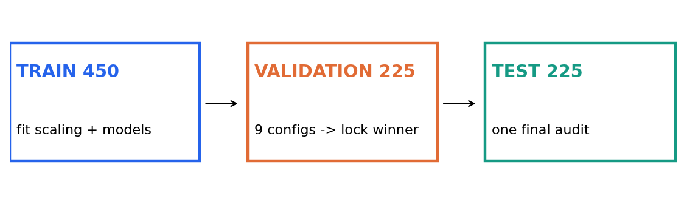
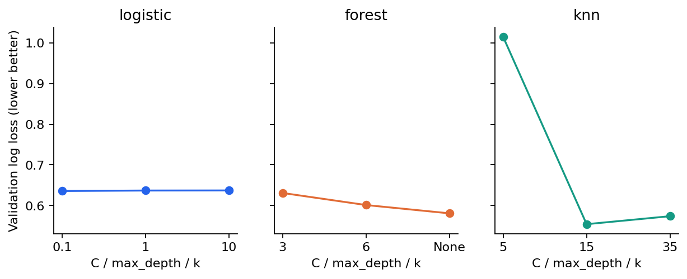
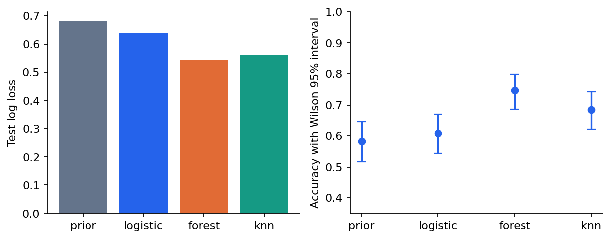
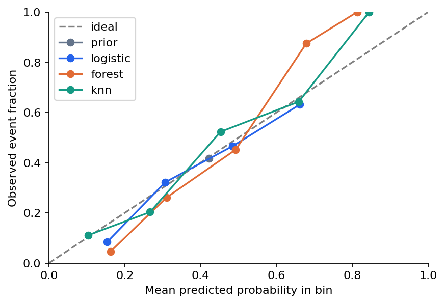
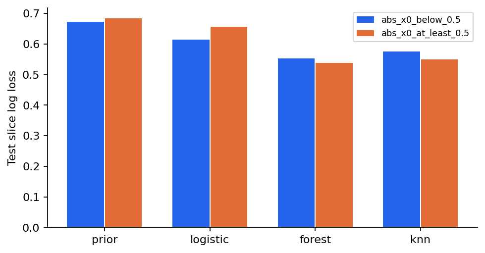
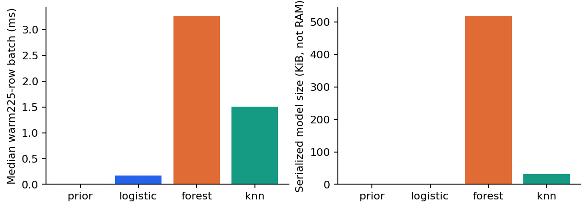

# 第068讲 经典方法比较项目

## 1 这次要交付一个可复核的选择理由

假设我们要为工厂的模拟质检系统估计产品出现异常的概率。每件产品有六个传感器读数，标签1表示发生异常，0表示未发生。部署者关心的不只是“猜对几件”，还包括概率是否可信、一次预测等多久、模型需要保存多少数据，以及工程师能否解释某项输入怎样影响结果。

到这里，你已经学过多种经典方法。最容易犯的错误是分别运行几个模型，摘出最好看的数字，然后宣布其中一个方法最强。这样的比较常常没有回答三个问题：数据是不是同一批？调参机会是不是一样多？最后的测试答案是否已经影响了选择？本讲的目标是把这些问题写成别人可以重跑的协议。

直接先修为第025至026、050至053讲。方法部分还用到逻辑回归、随机森林和近邻的有关章节；不必为了本项目复习全部算法。你会比较一个常数概率基线和三个合理候选，固定搜索预算，保存每一行验证结果，再检查区间、校准、失败样本和成本。最终的结论刻意保留一个不完美事实：验证集选中的方法未必在测试集上排名第一。

## 2 先定义任务再决定怎么算好

一行数据对应一件独立生成的模拟产品，预测时六项传感器值全部可用。目标是二分类概率，不是因果效应，也不是带时间依赖的真实生产数据。所有样本均为原创合成数据，不含个人信息。我们可以因此公开完整生成器和真概率，但模型训练只能使用六列输入与标签；真概率专用于事后理解错误。

设输入向量为 $x_i\in\mathbb R^6$，标签为 $y_i\in\{0,1\}$，模型预测 $p_i=P(y_i=1\mid x_i)$。模拟机制为：

$$s_i=1.6x_{i0}x_{i1}+0.9x_{i2}-0.6,\qquad p_i^*=\frac{1}{1+\exp(-s_i)},\qquad y_i\sim\operatorname{Bernoulli}(p_i^*).$$

$x_0x_1$是交互项：一个传感器的影响会随另一个传感器的符号改变。逻辑回归仅接收原始六列，不额外添加这个乘积，因此存在有意保留的模型失配。随机森林和近邻能够表达某些非线性关系，但可能更昂贵、更不稳定。真机制已知不代表可以把它偷偷变成某个候选的专属特征。

本任务使用独立同分布样本，因此随机拆分合理。若实际产品来自同一机器的连续时间段，随机打散可能泄漏未来或同组信息，必须重新设计按时间或设备分组的拆分。这里的结果不能直接迁移成真实工厂的部署建议。

## 3 一条不可倒流的数据路线

900行由固定种子68021生成，再用生成器内独立的固定随机排列分成450行训练、225行验证、225行测试。三个CSV保存固定样本ID。改变文件顺序不应成为随手尝试更好分数的办法；本单元甚至会核对CSV与生成器是否逐字节一致。

训练集负责学习参数。例如标准化需要均值与标准差，这两个量也必须仅从训练集估计。验证集负责比较超参数。测试集负责估计锁定流程对未见样本的表现。官方交叉验证文档说明了这种信息分工以及Pipeline避免预处理泄漏的用途。[scikit-learn 交叉验证](https://scikit-learn.org/1.8/modules/cross_validation.html)

本讲只做一次训练与验证划分，以便初学者逐项核查。它不等于嵌套交叉验证：验证集的偶然性仍会影响选中的方案。若数据很少或需要更稳健的研究结论，应事先设计重复或嵌套评估，并把额外预算纳入所有方法。

## 4 把公平变成看得见的预算

常数基线使用训练集的异常比例，任何输入都输出同一概率。它没有超参数搜索，用来回答“复杂模型是否真的比只知道基准发生率更有价值”。三个候选方法族分别获得三个配置：

| 方法族 | 预先固定的三个配置 | 学到什么 | 主要约束 |
| --- | --- | --- | --- |
| 逻辑回归 | C为0.1、1、10 | 标准化后的线性对数几率 | 原始列无法直接表示乘积关系 |
| 随机森林 | 最大深度3、6、不限制 | 80棵树的平均概率 | 每叶最少5行，单线程，固定种子 |
| K近邻 | 邻居数5、15、35 | 标准化空间的局部标签比例 | 需保存训练样本，距离受无关列影响 |

每族三次拟合是“配置次数相同”，不是“总计算时间相同”。森林一次拟合可能远比逻辑回归昂贵。研究项目可以选择相同墙钟时间、相同硬件预算或相同搜索次数；关键是事前说明采用哪一种，不能把几种公平定义混为一谈。

我们用验证对数损失最小决定每族代表和整体方案；精确相等时按配置名称排序，避免隐藏的人为取舍。所有模型用同一批训练和验证ID，概率转类别的阈值固定为0.5。本讲选定后不再合并训练与验证重训，这样测试对象就是当时比较过的拟合模型。若改为重训，应预先声明，并重新测量最终模型成本。

## 5 两个样本就能手算概率误差

对数损失使用自然对数。对一个样本，真实标签为1时损失为 $-\log p$；为0时损失为 $-\log(1-p)$。统一写法为：

$$\ell(y,p)=-y\log p-(1-y)\log(1-p),\qquad L=\frac1n\sum_{i=1}^n\ell(y_i,p_i).$$

取两个样本 $y=(1,0)$、$p=(0.8,0.3)$。第一个损失为 $-\log0.8\approx0.223144$，第二个为 $-\log0.7\approx0.356675$，平均约0.289909。两个类别都猜对了，但若把概率改成0.51和0.49，准确率不变，对数损失会变大，因为模型没有给正确结果足够的概率。

Brier分数是概率平方误差：

$$B=\frac1n\sum_i(p_i-y_i)^2=\frac{(0.8-1)^2+(0.3-0)^2}{2}=0.065.$$

两者均越低越好，但惩罚形状不同。对数损失对自信的错误特别敏感。如果真实标签为1而模型输出0，数学损失为无穷。浮点实现把概率裁剪到机器精度附近，是数值保护，不是允许忽略这些错误。近邻在邻居少时较容易输出0或1；本次5近邻验证损失高达1.015321，正好提醒我们不要只看分类边界。

准确率只统计阈值后是否正确。ROC AUC衡量排序区分能力。它们回答不同问题，不能看哪个指标最好就临时改主指标。若部署成本关心漏报，应在看测试集之前选择相应的效用函数或阈值。

## 6 实际搜索出现了什么

本次逻辑回归最优C为0.1，验证损失0.635715；森林最优深度为不限制，损失0.580677；近邻最优k为15，损失0.554036。因此在查看测试结果之前，我们锁定15近邻。这个选择程序只接受训练和验证数组，函数接口中没有测试参数。

在测试集上，常数基线、逻辑回归、森林、近邻的对数损失分别为0.679605、0.639666、0.544137、0.560582。森林的测试数字更低，但我们不能因此把“此前选定15近邻”改写为“此前选定森林”。研究报告应同时保留选择记录和最终审计结果。若据此提出下一轮研究，必须使用新的评估预算，而不是把已看过的测试集重新称为封存集。

## 7 区间需要说清楚在重复什么

一个点估计不足以表达有限样本的波动。准确率是225次“预测正确”事件的比例。本讲使用Wilson区间，而不是直接写 $\hat p\pm1.96\sqrt{\hat p(1-\hat p)/n}$；后者在极端比例或样本少时容易不合理。

设成功比例为 $\hat p$、样本量为 $n$、$z=1.959964$。Wilson中心与半宽为：

$$c=\frac{\hat p+z^2/(2n)}{1+z^2/n},\qquad h=\frac{z\sqrt{\hat p(1-\hat p)/n+z^2/(4n^2)}}{1+z^2/n}.$$

报告区间为 $[c-h,c+h]$。例如15近邻准确率为0.684444，区间约为[0.621056,0.741640]。这不是“模型有95%概率落在这个已固定区间里”的频率学解释；它表示在相应抽样条件下，构造区间的方法具有近似的长期覆盖性质。

比较两个方法时，应保留样本配对关系。第i件产品对两个模型同时容易或同时困难，不能把它们当成两个无关测试集。令：

$$d_i=\ell(y_i,p_i^{A})-\ell(y_i,p_i^{B}),\qquad\bar d=\frac1n\sum_i d_i.$$

每次bootstrap抽225个样本索引，允许重复，再同时取这批索引对应的两组预测。我们重复1200次，用均值差的2.5%和97.5%分位数构成描述性百分位区间。负值表示A的对数损失较低。固定拟合模型的配对bootstrap并没有重新做选参，因此不能声称覆盖了整个建模流程的不确定性。

![图4 配对差值及bootstrap区间。横轴是某方法减去逻辑回归的逐样本对数损失平均值；虚线为零。森林约为-0.095529，区间[-0.125021,-0.066213]；近邻约为-0.079084，区间[-0.120335,-0.038278]。这支持本任务上两者优于该线性基线的描述，不支持通用算法排名。](figures/05_paired_intervals.png)

## 8 概率校准不能只看一个小数

把预测落在[0.6,0.8)的样本放在一起。如果这些样本的平均预测为0.70，实际异常比例却只有0.45，就说明这一组概率偏高。可靠性图把每个非空概率箱的平均预测放在横轴，实际发生率放在纵轴；理想情况接近对角线。每个点有多少样本同样重要，五个样本形成的偏差比五百个样本更不稳定。

本讲记录五箱ECE，计算每箱绝对校准差的样本数加权平均。常数基线ECE约0.004444，很小，但它的AUC仅为0.5。这是一个重要反例：单看ECE会把没有个体区分能力的模型误当成优胜者。ECE也受箱数、边界与测试样本量影响，不能把细微差别当作确定结论。

本讲只评估校准，没有额外拟合校准器。若想用Platt缩放或保序回归（isotonic regression）修正概率，必须为校准留出数据或采用严格交叉拟合，不能拿当前测试标签训练修正函数。[scikit-learn 概率校准](https://scikit-learn.org/1.8/modules/calibration.html)

## 9 失败样本让数字变得可解释

我们事先定义两个切片：$|x_0|<0.5$与$|x_0|\ge0.5$。当第一个传感器接近零时，乘积项倾向较弱；远离零时，非线性关系可能更明显。切片由输入决定，不按哪个模型出错来挑选。每片都报告样本数，两个切片完整覆盖测试集。

另一个视角是逐行检查损失最大的12件产品。15近邻对case_0266给出0.066667，实际标签为1，损失2.708050。但生成器真概率也只有0.160580。这件产品的确发生了相对少见的结果，不能仅因为预测错了就断定数据坏了。case_0748的真概率约0.472888，模型却只给0.133333，更值得检查邻域与无关特征影响。

这些真概率只在合成实验中可知。真实应用往往只有一次标签实现，无法替每个错误准确划分“不可约噪声”和“模型偏差”。我们的结论应保留这种可观察性边界。

## 10 成本和解释是模型选择的一部分

训练耗时记录每个配置的实际拟合墙钟时间。预测耗时先预热一次，再对同一225行批次计时9次，报告中位数。序列化大小使用pickle协议5计算保存模型的字节数。它不是峰值内存，也不是加载时间，更不等于手机上的响应速度。

逻辑回归的六个标准化系数约为0.082、0.048、0.663、-0.042、-0.060、-0.117。在其他标准化输入固定的模型内，系数给出对数几率变化方向。它们不是因果效应，也不能解释未进入模型的交互机制。森林由多棵树构成，近邻依赖周围训练例子，各自需要不同的解释方式。解释要求必须来自任务，不能自动等同于“参数少就永远合适”。

## 11 怎样写出诚实的项目结论

一个合格的结论可以这样写：在900行原创独立模拟数据、固定450/225/225拆分和每族三配置预算下，15近邻以验证对数损失0.554036被选中。它的测试损失为0.560582，优于常数与本次线性基线；森林测试损失更低，但没有据此追改此前的选择。非线性候选的优势符合数据中的乘积结构，仍需结合预测成本、解释需求和更多独立任务再作部署判断。

这个结论没有宣称所有近邻方法胜过所有树模型，也没有把一次测试结果说成可靠性保证。可复核性来自一组互相一致的记录：固定数据、完整搜索、事前主指标、明确选择时刻、逐样本预测与成本说明。

## 12 练习与离开本讲前的检查

1. 重算两个样本的对数损失和Brier分数，并解释准确率为何看不出概率差别。
2. 为什么常数基线的ECE很小，却不是本任务的理想模型？
3. 若森林测试排名第一，什么操作会构成测试集泄漏？怎样开启下一轮研究？
4. 解释配对bootstrap为什么必须同时重采样两组预测。
5. 如果部署只能保存很小的模型，而且解释要求严格，你需要补充哪些证据？
6. 本次每族三个配置能否称为相同算力预算？给出更准确的说法。

当你能把模型选择理由连接到任务、预算、数据隔离和失败分析，而不是只引用一个最好分数，就完成了这一阶段的比较项目。下一讲将开始无监督学习中的降维问题。
