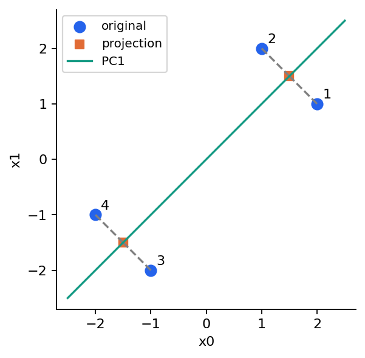
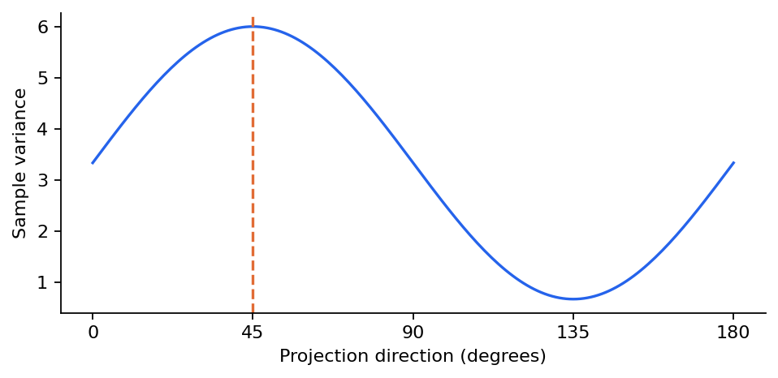
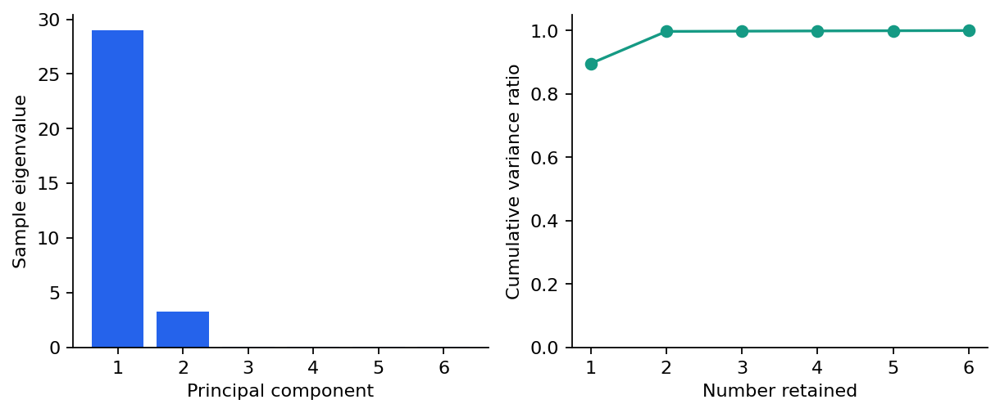
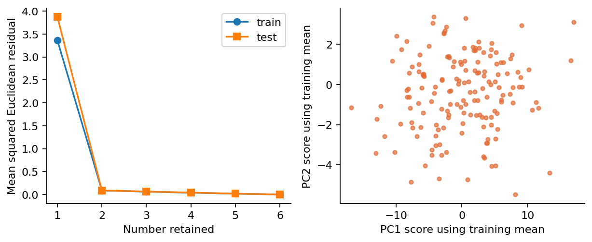
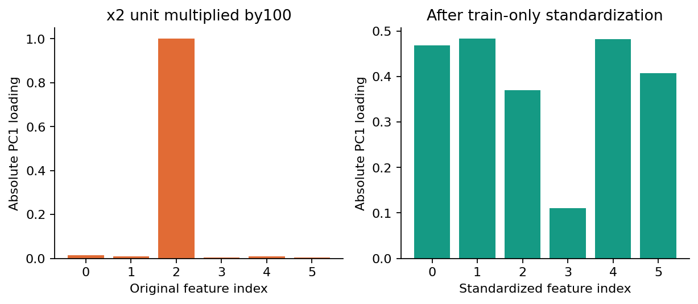
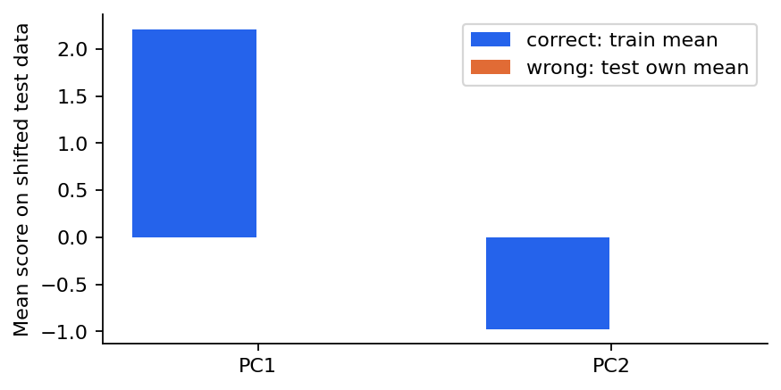
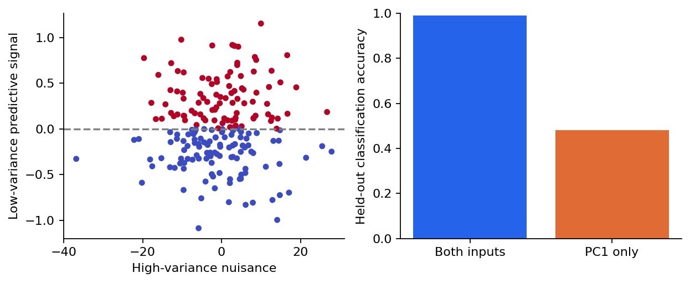

# 第069讲 主成分分析的推导

## 1 把一团六维数据压成两个数

假设每个实验样本都有六个测量值，其中几列强烈相关。我们想用两个新坐标概括样本，又希望能从这两个数大致还原原来的六个值。问题不是简单删掉四列，而是寻找两个合适的方向，再记录每个样本沿这两个方向的位置。

主成分分析简称PCA，英文为principal component analysis。它找到一组互相正交的线性方向，按训练数据在这些方向上的方差从大到小排序。在相同欧氏距离度量下，保留前k个方向也等价于使训练集的平方重构误差最小。这两个看起来不同的目标，本讲会从几何和代数两条路线连起来。

先修是第007、012、021、029讲的数组、矩阵、协方差和线性模型。我们会重新交代每个矩阵的形状，手算四个二维点，使用SVD从零实现，再与库核对。最后一个反例尤其重要：保留99.843%的输入方差，预测准确率仍可能只有48%。PCA保留的是某种几何信息，不能自动保证保留任务需要的信息。

## 2 行是样本列是特征

设训练矩阵 $X\in\mathbb R^{n\times d}$，n行是样本，d列是特征。本讲行向量表示一个样本。先计算各列训练均值 $\mu\in\mathbb R^d$，得到中心化矩阵：

$$\mu=\frac1n\sum_{i=1}^n x_i,\qquad X_c=X-\mathbf1\mu^\top.$$

这里把 $x_i$ 写成列向量便于公式；它的转置是矩阵X的第i行。$\mathbf1$为n维全1列向量，所以 $\mathbf1\mu^\top$是每行都等于均值的n×d矩阵。中心化后每列样本均值为零。

为什么要减均值？如果一组点围绕(10,-3)形成很薄的斜长云团，我们希望保留云团内部的变化，而不是把“离坐标原点很远”误当成主要变化。不中心化的低秩SVD寻找穿过原点的子空间；PCA寻找穿过训练均值的仿射子空间，两者一般不同。

样本协方差矩阵定义为：

$$S=\frac{X_c^\top X_c}{n-1}\in\mathbb R^{d\times d}.$$

对角元素是各特征样本方差，非对角元素是两列共同变化的协方差。本讲统一使用n-1分母；若你使用n分母，主轴不变，但特征值与重构公式中的系数会改变。写清分母能避免许多“差一点点”的核验错误。

## 3 先找一条最有变化的轴

取单位方向 $v\in\mathbb R^d$，满足 $v^\top v=1$。中心化样本投影到这条轴上的坐标为 $z_i=v^\top(x_i-\mu)$。所有坐标组成 $z=X_cv\in\mathbb R^n$。由于中心化，z的均值也是0，因此其样本方差为：

$$\operatorname{Var}(z)=\frac{z^\top z}{n-1}=v^\top Sv.$$

单位长度约束很重要。不约束v的长度，把v乘以100就能让投影方差乘以10000，问题会失去意义。PCA第一主轴解的是：

$$\max_{v^\top v=1}v^\top Sv.$$

用拉格朗日乘子写 $\mathcal L(v,\lambda)=v^\top Sv-\lambda(v^\top v-1)$。因为S对称，对v求导得到 $2Sv-2\lambda v=0$，所以最优候选满足 $Sv=\lambda v$，即v是协方差矩阵的特征向量。

仅得到特征向量还不够，哪一个最大？将任意单位v展开为正交特征向量 $v=\sum_j a_jq_j$，其中 $\sum_j a_j^2=1$。则 $v^\top Sv=\sum_j\lambda_ja_j^2$，这是特征值的加权平均，不会超过最大特征值。取最大特征值对应方向即可达到上界。第二轴再要求与第一轴正交，依此类推。

## 4 四个二维点的完整手算

取四个点(2,1)、(1,2)、(-1,-2)、(-2,-1)。两列均值都为0，所以无需再移动原点。计算平方和与交叉乘积：第一列平方和为10，第二列也是10，乘积和为8。因此：

$$S=\frac13\begin{pmatrix}10&8\\8&10\end{pmatrix}.$$

向量(1,1)乘S得到(6,6)，向量(1,-1)乘S得到(2/3,-2/3)。归一化后：

$$v_1=\frac1{\sqrt2}(1,1)^\top,\quad\lambda_1=6,\qquad v_2=\frac1{\sqrt2}(1,-1)^\top,\quad\lambda_2=\frac23.$$

第一点沿第一轴的分数为 $(2+1)/\sqrt2=3/\sqrt2$。第二点相同；第三、第四点为 $-3/\sqrt2$。第一点只保留一个分数再重构：

$$\hat x_1=v_1\frac3{\sqrt2}=(1.5,1.5)^\top.$$

其残差为(0.5,-0.5)，平方长度0.5。四个样本的平方残差都为0.5，因此总平方误差SSE为2，平均每样本平方距离为0.5。保留方差比例为 $6/(6+2/3)=0.9$，即90%。注意保留90%方差不等于每个坐标都能恢复90%的小数位。

## 5 为什么最大方差等价于最小重构误差

把前k个单位正交主轴作为列放入 $V_k\in\mathbb R^{d\times k}$，满足 $V_k^\top V_k=I_k$。低维分数和重构分别是：

$$Z=X_cV_k,\qquad\hat X=ZV_k^\top+\mathbf1\mu^\top.$$

Z为n×k，重构回到n×d。$P=V_kV_k^\top$是d×d正交投影矩阵，满足 $P^\top=P$和 $P^2=P$。每个中心化样本被拆成落在子空间内的部分和与之垂直的残差。根据勾股定理，总平方长度等于保留长度加丢失长度。

用Frobenius范数把所有行一起写出来：

$$\lVert X_c-X_cP\rVert_F^2=\lVert X_c\rVert_F^2-\lVert X_cV_k\rVert_F^2.$$

Frobenius范数平方就是矩阵所有元素平方和。右边第一项与选择方向无关，所以残差最小等价于保留的平方长度最大。又有：

$$\lVert X_cV_k\rVert_F^2=(n-1)\operatorname{tr}(V_k^\top SV_k).$$

trace即对角线之和，它等于各保留坐标的样本方差总和。选择最大的k个协方差特征值就最大化该和。于是：

$$\operatorname{SSE}_{k}=(n-1)\sum_{j>k}\lambda_j.$$

手算例子n=4、丢弃特征值2/3，右边为3×2/3=2，与几何残差完全一致。平均每样本平方距离是SSE/n，因此等于 $(n-1)/n$乘以丢弃特征值之和，不能忘记这个比例。若再除以d，才是每个标量元素的均方误差；本讲图表没有这样做。

## 6 用SVD实现而不显式形成协方差

中心化矩阵的奇异值分解为 $X_c=U\Sigma V^\top$。U与V的列正交，$\Sigma$的非负对角元素为奇异值 $s_1\ge s_2\ge\cdots$。代入协方差：

$$S=\frac1{n-1}V\Sigma^\top\Sigma V^\top.$$

因此右奇异向量就是主轴，特征值为 $\lambda_j=s_j^2/(n-1)$。程序可以直接对X_c做SVD，取V的前k列，无需先形成d×d协方差矩阵。显式计算 $X_c^\top X_c$还会平方非零奇异值的比值，使病态数据的数值问题更突出。

NumPy返回U、奇异值向量s和V的转置vt。pca.py中的components保存vt的前k行，形状k×d，恰好是上面 $V_k^\top$。因此代码中transform为(X-mean)@components.T，inverse_transform为Z@components+mean。这里的“逆变换”在k<d时只是重构，并不能恢复已经丢弃的信息。[NumPy SVD文档](https://numpy.org/doc/stable/reference/generated/numpy.linalg.svd.html)

本单元也提供eigh路线，直接分解对称协方差矩阵作交叉验证。eigh返回的特征值默认升序，必须重新降序排列并同步重排向量。两种路线应产生相同的投影子空间。[NumPy eigh文档](https://numpy.org/doc/stable/reference/generated/numpy.linalg.eigh.html)

## 7 不要把符号差异当成错误

若v是特征向量，-v也是。一个实现把第一轴画向右上，另一个实现画向左下，二者可以完全正确。分数也会同时变号，重构中的两次符号抵消。我们优先比较投影矩阵 $VV^\top$或最终重构，而不是机械要求每个主轴元素都相同。

更微妙的情况是特征值重复。若某个二维特征子空间的两个特征值相同，子空间内任何正交旋转都同样最优，单个轴不唯一。如果截断k恰好切过一个重复特征值组，甚至最优k维子空间也可能不唯一。此时比较目标值与允许的空间关系比逐元素比较更合适。

pca.py为了便于阅读，把每根轴绝对值最大的元素约定为非负。这是一种展示约定，不改变数学答案，也不能消除重复特征值的所有不唯一性。

## 8 六维真实执行实验

我们生成480个六维样本，其中320行用于拟合，160行只用于投影与重构评价。数据由两个潜在方向线性组合，再加小幅独立噪声和非零均值得到。它是原创合成实验，结构已知，有助于判断PCA是否恢复了预期的低维空间。

只留一维时，训练平均平方重构距离为3.360424，测试为3.871974；保留两维时分别降至0.088192与0.088299。保留全部六维后残差约为浮点舍入量级。测试残差不是协方差谱公式直接保证的数值，因为测试样本没有参与拟合；它需实际计算。

与scikit-learn的full SVD PCA相比，投影矩阵与前两特征值最大差为0，测试重构最大差约3.6×10⁻¹⁵；eigh投影矩阵差约1.0×10⁻¹⁵。这些是本版本、本数据的浮点核验结果，不要求任何机器上最后一位都完全相同。[scikit-learn PCA API](https://scikit-learn.org/1.8/modules/generated/sklearn.decomposition.PCA.html)

## 9 单位改变会改变问题

PCA使用欧氏平方距离。如果一列以米表示，另一列以毫米表示，数值尺度会明显影响协方差。将第三列乘100，虽然没有新增物理信息，未经缩放的第一主轴却可能主要指向第三列。

标准化把各列调整到训练方差相近，适合希望各特征按相对变化获得相近权重的情形。但若一列原本只有极小的测量噪声，标准化可能把它放大得与真正信号同样重要。应根据测量单位、噪声与目标决定是否缩放，而不是背诵“PCA前必须标准化”。scikit-learn的PCA会中心化，但不会自动按列缩放。[PCA方法说明](https://scikit-learn.org/1.8/modules/decomposition.html#pca)

标准化与白化也不同。标准化发生在原始特征空间；白化发生在主成分分数空间，进一步将保留分数按特征值缩放到单位方差。本讲不做白化，以免混淆“正交方向”与“相同方差”两个概念。

## 10 新样本必须继续使用训练坐标系

PCA虽然不使用标签，也是一种从数据学习出来的变换。训练均值与主轴必须只在训练数据fit。新样本应使用同一个训练均值进行中心化，再乘训练主轴。如果每一批测试数据都减去自己的均值，就改变了坐标系，并可能遮住真实的分布漂移。

另一个实测对照是中心化与未中心化的二维重构。训练集中心化PCA的总SSE为28.221553，而直接对非零均值X做秩2 SVD的SSE为1020.797258。两者优化的允许空间不同，这不是SVD失效，而是问题设定不同。

## 11 高方差不等于高预测信息

第二个数据集有两个输入。第一列是标准差约10的无关变化，第二列是标准差约0.4的小幅信号；标签完全由第二列是否大于0决定。400行训练、200行测试，PCA仍只在训练集拟合。

使用两个原始输入并在训练集标准化后拟合逻辑回归，测试准确率为0.99；只保留原始单位下的第一主成分，再标准化这个分数并拟合同类分类器，准确率为0.48。这个实验不是说PCA总会损害预测，而是证明方差保留比例不能替代监督任务的独立验证。

若降维用于压缩传感器信号，重构误差可能就是正确目标；若用于异常识别或分类，低方差方向也许恰恰最重要。选择k时必须回到任务。如果按照下游标签表现选k，就需要验证集，并将PCA与下游模型放在同一隔离流程中。

## 12 从数学契约到代码验收

本讲从零实现接受有限二维矩阵，至少两行训练样本，保留维数满足 $1\le k\le\min(n-1,d)$。常数数据的总方差为0，解释方差比例设为0向量而不是产生NaN；这种数据不存在有信息的主轴。缺失值不在本讲范围内，输入NaN时明确拒绝。

测试对k=1至6逐一检查正交性、分数均值、残差与主轴正交、SSE谱恒等式及库重构。同时检查平移不变性、轴符号翻转不变性、全维重构、常数输入与非法维度，普通和-O均执行109项显式检查。数值正确性来自相互独立的契约，不仅是一句“与库差不多”。

## 13 练习与结论

1. 重算四点协方差、两根主轴与90%方差比例。
2. 为什么SSE为2，而丢弃特征值只有2/3？
3. 用形状说明components与公式中V的转置关系。
4. 如果两个库输出的第一主轴恰好相反，应比较什么？
5. 为什么不能按测试集自身均值重新中心化？
6. 保留99%以上方差后分类失败，是否推翻了PCA的数学最优性？

PCA将“保留变化”和“近似重构”连接成一个线性代数问题。它的最优性带有明确条件：训练数据、选定单位、欧氏平方距离、线性正交子空间。离开这些条件，尤其进入预测或因果解释任务时，必须重新选择证据。
