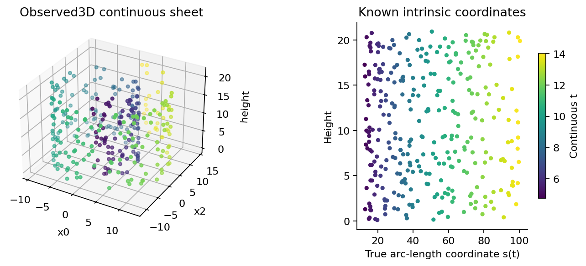
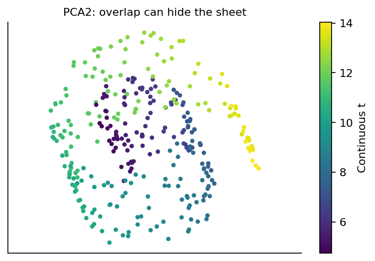
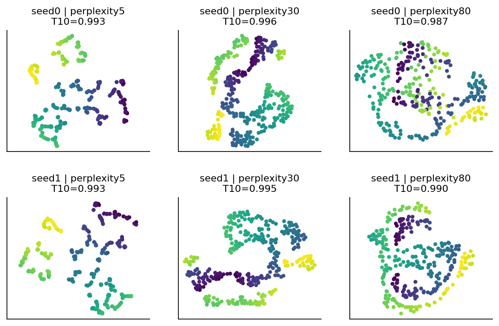
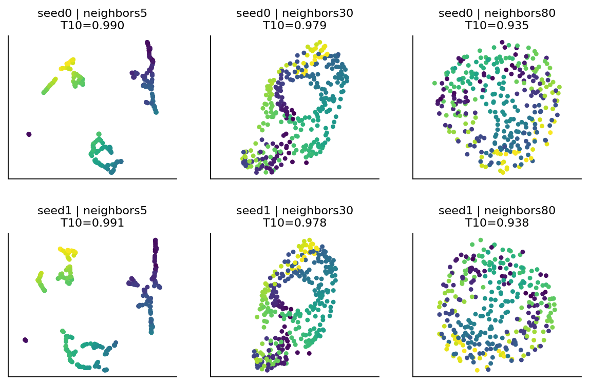
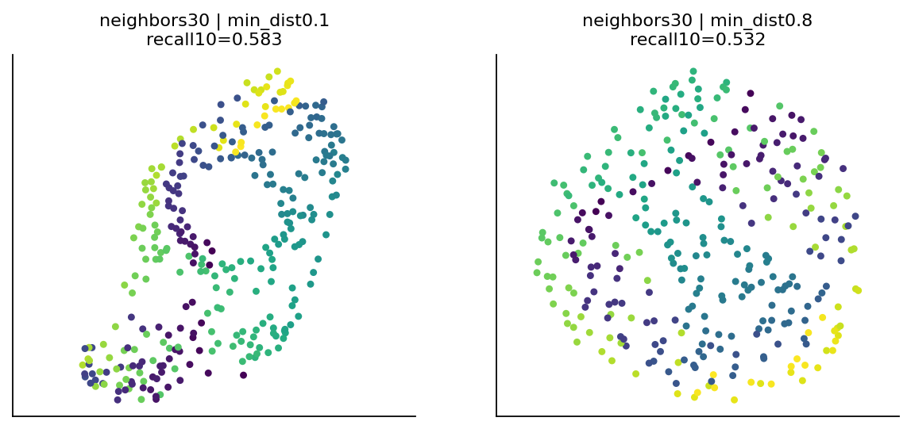
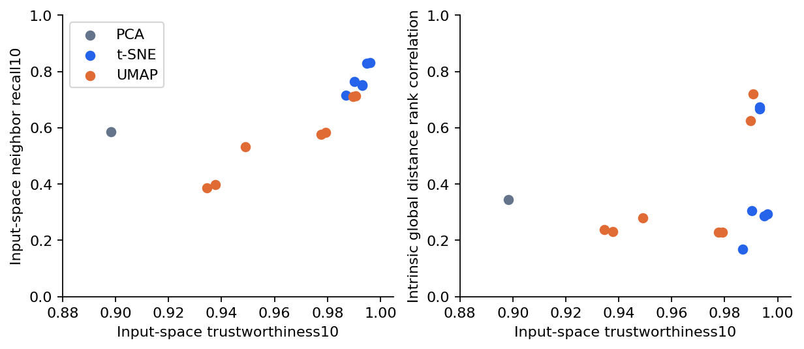
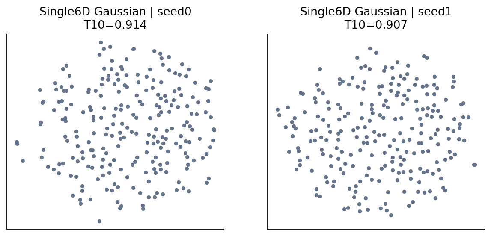

# 第070讲 流形与可视化的边界

## 1 一张漂亮的二维图能证明什么

把高维样本画成二维散点图，经常会看到条带、岛屿或分开的团块。人很容易把这些形状解释成真实类别，把两个团块的间隔解释成群体差异，把团块面积解释成原始数据的多样性。但降维算法本身也会改变距离、密度和空隙，我们必须知道图是怎样被制造出来的。

本讲沿用第069讲的PCA，再研究t-SNE与UMAP。目标不是选出最好看的图，而是区分局部邻域、全局距离和已知生成结构。我们会固定一张连续卷曲表面，改变参数和随机种子，直接测量邻域保持；还会把一个没有预设混合簇的Gaussian点云交给同样算法，作为视觉推断的负对照。

直接先修为第009、019、043、054、057、069讲。你需要知道欧氏距离、近邻、概率与PCA的基本思路；本讲会重新解释图、流形和邻域指标。所有算法只看观测坐标，图上颜色用来审计已知结构，不作为算法输入。

## 2 卷起来的纸有几维

一张平纸可以用两个数定位：沿纸的横向位置与纵向位置。将它卷成瑞士卷形状后，每个点在空间中需要三个坐标描述，但纸面上的移动仍只有两个自由方向。我们把这种在局部看起来像低维平面、整体可以弯曲的结构称为流形。流形假设是关于数据结构的假设，不是所有数据集天然满足的定理。

本讲合成表面由两个连续变量t与h生成：

$$x(t,h)=(t\cos t,\ h,\ t\sin t),\qquad 1.5\pi\le t\le4.5\pi,\quad0\le h\le21.$$

t控制卷曲位置，h控制高度。我们独立均匀抽取这两个参数，共320点。它是一张连续表面，没有预先分配的类别。t均匀不等于沿纸面弧长均匀，较大t处每单位t走过的表面距离更长，因此不同颜色区域的采样密度也不能直接用二维图面积解释。

## 3 近在空间与近在纸面不是同一件事

卷曲的不同层在三维空间中可能靠得很近，但沿纸面从一层走到另一层仍很远。三维直线距离称为这里的环境空间距离；限制在表面上走的最短距离是内在距离。这两种距离回答不同问题，不能在指标中悄悄替换。

沿t方向的速度为：

$$\left\lVert\frac{\partial x}{\partial t}\right\rVert=\sqrt{1+t^2},\qquad s(t)=\frac12\left(t\sqrt{1+t^2}+\operatorname{asinh}t\right).$$

因为h方向与t方向正交，换成(s,h)后，表面上的长度度量成为普通二维欧氏长度。矩形参数域内两点的表面最短距离等于它们(s,h)坐标的欧氏距离。这里能得到这个真值，是因为生成器已知；真实科研数据通常没有这样的免费答案。

算法接收的是三维x，默认使用环境空间欧氏距离。评价时，我们一方面检查它是否保留输入的近邻，另一方面用已知(s,h)检查是否恢复表面的内在结构。一个方法可以很好地保留输入近邻，却仍不能恢复整张纸的全局形状。

## 4 PCA为什么会把不同层叠起来

PCA寻找一张线性平面，优化全体样本的平方重构。它没有能力把一张卷起来的纸非线性展开。把表面投影到二维时，原本位于不同卷曲层的点可能重叠；相邻颜色也可能被放在难以解读的位置。

低维表示没有一种统一的“保真”。保留全局线性方差、保留附近样本、保留表面距离、方便后续预测，可能是不同甚至互相竞争的目标。先说清楚要保存什么，再讨论哪个算法合适。

## 5 t-SNE把附近关系变成概率

t-SNE先把输入距离转成每个点的邻居概率。对固定点i，附近点j得到较大概率：

$$p_{j\mid i}=\frac{\exp(-\lVert x_i-x_j\rVert^2/(2\sigma_i^2))}{\sum_{k\ne i}\exp(-\lVert x_i-x_k\rVert^2/(2\sigma_i^2))},\qquad p_{i\mid i}=0.$$

每个点有自己的尺度 $\sigma_i$。算法调节该尺度，让邻居分布达到给定的perplexity。它可理解为平滑的有效邻居数，不是必须保留的精确k个邻居，也不是簇数。将两个方向的条件概率对称化得到 $p_{ij}=(p_{j\mid i}+p_{i\mid j})/(2n)$。

在二维位置 $z_i$ 上，t-SNE使用较重尾的Student t相似度：

$$q_{ij}=\frac{(1+\lVert z_i-z_j\rVert^2)^{-1}}{\sum_{k\ne l}(1+\lVert z_k-z_l\rVert^2)^{-1}},\qquad q_{ii}=0.$$

优化目标是 $\mathrm{KL}(P\Vert Q)=\sum_{i\ne j}p_{ij}\log(p_{ij}/q_{ij})$。原空间概率大的相邻点若被放得太远，会受到明显惩罚；二维较重尾分布缓解许多点挤在中心的困难。目标没有直接要求所有远距离都按同一比例保留，因此二维团块间距不能当作原始空间的精确尺子。[原作者论文](https://lvdmaaten.github.io/publications/papers/JMLR_2008.pdf)

本讲使用exact计算、随机初始化、750次最大迭代，perplexity取5、30、80，种子0与1，六个配置全部保留。exact意为相似度/梯度路线不采用Barnes-Hut近似，不表示找到全局最优；目标仍是非凸的。原始标签或颜色均不参与拟合。

## 6 UMAP先构建有权近邻图

UMAP也从局部近邻开始，但其表示与目标不同。它对各点的局部距离尺度进行调整，把近邻连成带权图；一条边的权重可以理解为两点属于局部邻域关系的程度。将有向关系组合后，在低维中安排点，使这些局部连边关系得到较好的保留。

用 $w_{ij}$表示高维图权重，$v_{ij}$表示低维相似度，一种帮助理解的交叉熵写法为：

$$-\sum_{i<j}\left[w_{ij}\log v_{ij}+(1-w_{ij})\log(1-v_{ij})\right].$$

第一部分把有强连接的点拉近，第二部分对没有强连接的点提供排斥。本式是目标层面的直观表达；实际实现使用稀疏图与随机优化、负采样等计算办法，不会朴素地在每轮完整枚举所有非边。它与t-SNE全局归一化成概率分布的KL目标不能当成同一个公式。[UMAP工作原理](https://umap-learn.readthedocs.io/en/latest/how_umap_works.html)

n_neighbors控制建立局部结构时参考的邻居范围。min_dist影响低维布局中允许点聚得多紧；它不是原数据的最小物理距离，也不是簇间距阈值。本讲比较n_neighbors为5、30、80，min_dist固定0.1，种子0与1；再单独把n_neighbors=30、种子0时的min_dist改为0.8。[UMAP参数说明](https://umap-learn.readthedocs.io/en/latest/parameters.html)

“n_neighbors更大更重视较大尺度”是一种参数作用方向，不保证任何给定数据的全局距离相关系数必然改善。有限采样、跨层短路与非凸优化都可能改变结果。模型假设要由实际指标与原空间核验支持。

## 7 怎样测量邻域真的保留了多少

先选择固定k=10。对每个点，在原输入空间找10个最近邻，在二维图找10个最近邻，排除点自身。两组集合的交集大小除以10，再对所有点平均，得到本讲的邻域重合比例：

$$R_k=\frac1n\sum_i\frac{|N_k^X(i)\cap N_k^Z(i)|}{k}.$$

R=1表示每个点的k近邻集合都完全保留。它只数重合，不区分错误邻居原来是第11近还是第300近。trustworthiness即邻域可信度会进一步惩罚“从原来很远的位置被带进二维近邻”的点。

设 $r_X(i,j)$为j在i的原空间邻居排名，最近邻排名1。令 $U_k(i)=N_k^Z(i)\setminus N_k^X(i)$为二维新增的邻居，则：

$$T_k=1-\frac{2}{nk(2n-3k-1)}\sum_i\sum_{j\in U_k(i)}(r_X(i,j)-k).$$

本讲限制 $1\le k<n/2$，与库的输入约束一致。T接近1表示新增错误近邻的排名惩罚较小，不表示几乎所有近邻都一样。我们从零实现排名公式，并逐项与scikit-learn核对。[trustworthiness API](https://scikit-learn.org/1.8/modules/generated/sklearn.manifold.trustworthiness.html)

### 四点手算一个反例

原始一维位置为(0,1,3,7)，映射后变为(0,3,1,7)，点ID保持原顺序。取k=1。原空间最近邻ID依次为(1,0,1,2)，二维最近邻ID依次为(2,2,0,1)，因此四个点都没有保留最近邻，R=0。

但每个新邻居在原空间恰好排第2，惩罚各为2-1=1，总惩罚4。分母为4×1×(8-3-1)=16，于是T=1-2×4/16=0.5。这个例子说明两个指标的量表不同；不能把T=0.95翻译成“95%的近邻被保留”。

## 8 参数与种子怎样改变图

种子0、perplexity30的t-SNE输入空间可信度约0.9962，10近邻重合比例约0.8325。但它与真实表面全体两点距离的Spearman相关仅约0.2931。这个对照直接展示：局部指标很高，全局展开仍可能严重失真。perplexity5时这个内在全局相关约0.6741，但局部重合比例降至0.7519，说明指标之间存在具体取舍。

在当前稀疏采样的卷曲表面上，UMAP种子0、5邻居时T10约0.9897，原空间邻域重合约0.7109；80邻居时分别约0.9345与0.3859。这不意味着80邻居在所有数据都更差，而是表明更大的环境空间邻域可能跨越卷曲层，改变要保留的关系。

两个种子只是一次有限稳定性检查。两图相似不能证明算法稳定，明显不同也不自动意味着其中一张错误。要先除去无意义的旋转、翻转与整体尺度，再比较邻域、跨种子指标分布以及具体研究结论是否保持。

## 9 远距离要另作评价

我们对所有无序样本对计算距离，然后比较原空间或真实表面距离与二维距离的Spearman秩相关。它衡量距离排序是否大体一致，对统一缩放不敏感；它不是等距误差，也不会自动保证局部邻域或拓扑完全正确。

请特别区分“输入三维直线距离”和“表面内在距离”。PCA的输入全局距离相关约0.8085，而内在全局相关仅约0.3453。一个方法可能善于保留观测直线距离，却不善于展开表面。报告只写“距离相关0.8”而不说明哪种距离，会隐藏最重要的假设。

所有这些指标都在同一批参与映射的点上计算，所以是探索性表示诊断，不是未见样本泛化成绩。本讲没有虚构训练与测试划分。若任务是把新病人、新图像或新设备数据映射进来，必须另设训练/验证设计，并说明算法是否提供可靠的样本外变换。

## 10 用负对照抵抗看图编故事

第二个数据集是240个六维标准Gaussian独立样本，来自一个单峰分布，没有预设的混合类别。我们用相同perplexity30和两个随机种子的t-SNE映射它，保留全部点和结果。

负对照不要求每次都生成明显假簇，也不是证明所有可视化团块都虚假。它提醒我们：有限采样与布局算法足以制造局部空隙，因此“看起来分开”不能作为聚类、病理分型或社会分组的唯一证据。真实研究应检查批次效应、输入缩放、缺失值处理、标签是否泄漏，以及结论在原空间和独立样本上是否成立。

## 11 复现需要固定哪些东西

数据生成种子为70021。PCA固定full SVD；t-SNE固定exact路线、随机初始化、750次最大迭代与自动学习率；UMAP固定350轮、单线程、种子与参数。报告保存全部14组卷曲表面坐标，以及两组Gaussian对照坐标，不仅保存PNG。

UMAP首次运行可能包含Numba即时编译时间，因此本讲记录的fit_seconds只是本次执行证据，不能直接据此做算法速度排行榜。固定随机种子有助于当前版本与执行配置的复现，但跨版本、硬件或并行设置的差异仍需重验。[UMAP复现说明](https://umap-learn.readthedocs.io/en/latest/reproducibility.html)

scikit-learn本讲的t-SNE没有提供一般的新样本transform接口；UMAP提供相应接口，但本实验没有评估样本外变换。不要将这两个能力混为一谈，也不要把二维坐标当作具有统一物理单位的测量值。

## 12 练习与结论

1. 解释环境空间近邻和表面近邻为何可能不同。
2. 重算四点例子的R1与T1，说明两个数为什么不相等。
3. perplexity、n_neighbors和min_dist分别控制什么，为什么都不是簇数？
4. T10约0.996而内在全局距离相关约0.293，是否矛盾？
5. 同一团点在一张图上很大、另一张图上很小，能否推断原始群体方差变化？
6. 为一个新的二维分群结论设计原空间检查与负对照。

降维图最有价值的用途是发现值得进一步核验的问题。它能帮助我们提出局部邻域、异常点和连续变化的假设；真正的解释仍需要原空间证据、参数稳定性、任务知识和独立验证。
