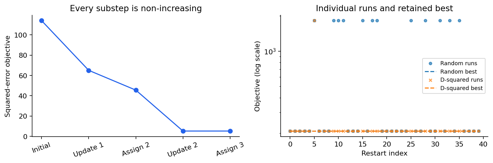
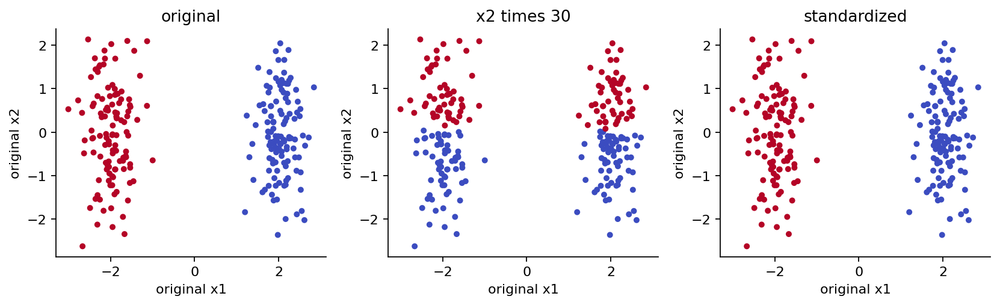

# 第071课实验 K均值的下降与失败

## 实验目标与交付

本实验把算法正确性与模型适用性分开检查。你要交付五点手算表、一份能逐步核对的目标日志、一组初始化结果、尺度与环形反例解释，以及普通模式和优化模式的测试报告。不要用一张好看的散点图代替数值证据。

预计需要120至180分钟。先完成讲义中平方误差与均值的推导。只需CPU，无需外部数据、账号或网络下载数据。data目录中全部CSV由固定随机种子产生；generated_group列只为解释构造，不得进入fit。实验脚本读取数据前同时检查散列与重新生成的字节，避免改动数据后沿用旧结论。

## 1 建立可复现环境

在本单元目录中建立 Python 3.12 环境。已有可用环境时先检查版本，不必重复安装。

```bash
python -m venv .venv
source .venv/bin/activate
python -m pip install -r requirements.txt
python experiment.py --out outputs/rebuild/result.json
python test_experiment.py --report outputs/rebuild/result.json \
  --out outputs/rebuild/test-result.json
python -O test_experiment.py --report outputs/rebuild/result.json \
  --out outputs/rebuild/test-result-optimized.json
```

Windows可在PowerShell使用 .venv\Scripts\Activate.ps1，或直接调用 .venv\Scripts\python.exe。若当前策略禁止激活脚本，直接调用该解释器即可，不必修改系统安全策略。

结果写到outputs，不覆盖随课冻结报告。完整重建含绘图、Notebook和PDF，可执行build_all.sh；PDF还需build-requirements.txt、Node.js、package.json中的MathJax、Pango与Noto CJK字体。实验本体不依赖PDF环境。若只读教材，可直接打开lecture.pdf、lab.pdf和answers.pdf。

## 2 数据卡与观察纪律

| 文件 | 行数 | 构造 | 要回答的问题 |
|---|---:|---|---|
| restarts.csv | 200 | 窄矩形四角的四团点 | 同一K会停在不同稳定解吗 |
| scale.csv | 240 | 第1列分离 第2列随机波动 | 改单位怎样改变分组 |
| rings.csv | 360 | 两条带轻微噪声的同心环 | 一个均值能代表一整圈吗 |

每行包含id、x1、x2、generated_group。id用于追踪观测，不进入距离。前三项实验拟合只取x1与x2。种子7101控制数据生成，种子71控制初始化序列，两者不同。需要区分数据随机性与算法随机性。

先画未着色散点图，再根据研究目的写下一句话：你希望原型表达什么？例如“用两个代表位置降低重构误差”和“找出内外环”是不同任务。若未先说清楚目的，后面对成功失败的解释容易偷换标准。

## 3 实验A 手算并逐项对照

不运行代码，先对 $0,2,3,10,11$ 与初始中心 $0,3$ 完成以下工作。

1. 写出每个样本到两个中心的平方距离，求初始目标。
2. 固定分配更新均值，求固定旧分配的目标。
3. 使用新中心重新分配，求此时目标。
4. 再求两个新均值及目标；用边界位置验证分配稳定。
5. 将你的步骤和history的before、after_update、after_assign对应，不要只比较最后一个数。

```python
import numpy as np
from kmeans import fit
X = np.array([0, 2, 3, 10, 11], dtype=float)[:, None]
model = fit(X, 2, init=[[0], [3]], n_init=1)
for row in model['history']:
    print(row['iteration'], row['before'],
          row['after_update'], row['after_assign'])
```

检查点：矩阵形状是5乘1；初始中心形状是2乘1；日志允许出现相等的相邻目标。若手算是114而代码不是，先核对平方与未平方距离、行列方向和初始化，再修改程序。



## 4 实验B 从零实现与独立测试

先遮住kmeans.py中的lloyd函数，用讲义公式写自己的版本。不要调用scikit-learn替代核心循环。参考实现中每一块代码都对应一个数学判断：验证形状、计算距离、argmin分配、计数、非空均值更新、空中心重置、重新分配、记录日志、停止判断。

对每行日志检查 after_update 不大于 before，after_assign 不大于 after_update，容差可用 $10^{-8}$。此外直接用 $\sum_i\|x_i-C[z_i]\|^2$ 重构目标。仅检查日志自己下降是不够的：错误程序可以把日志硬编码成下降序列。

再对最终非空簇检查中心是否等于该簇样本均值，对返回labels检查是否等于predict。将max_iter设为1，解释为什么一个模型可以返回合法最近中心标签，却尚未满足最终均值条件。本课测试明确检查这种提前停止时的converged标志。

在同一个初始中心数组下，调用scikit-learn的KMeans，显式指定n_init=1、algorithm='lloyd'、tol=1e-12和足够的max_iter。比较目标和分区，不能直接要求簇编号相同。若两套实现使用各自的k-means++，相同随机种子也不能保证同一起点。

## 5 实验C 重启与较差稳定解

在restarts数据上设 $K=2$，分别运行40次random和40次基础k-means++。保留每次目标，而不只保存最小值。

```python
from common import load_data
d = load_data()['restarts']
X = np.c_[d['x1'], d['x2']]
a = fit(X, 2, init='random', n_init=40, seed=71)
b = fit(X, 2, init='k-means++', n_init=40, seed=71)
print(min(a['restart_inertias']), max(a['restart_inertias']))
```

画最好与最差的分组，中心用叉号。解释哪一种分法承担了更大的水平距离，为什么均值更新仍可能稳定。再把n_init从3变成15，核对前3项完全相同、最佳值不增。写清楚这个结论依赖相同候选前缀。

验收不仅看程序运行，还要用几何原因解释两个目标层级。即使40次都得到相同值，也只能说明本次重启没有发现更好解，不能证明全局最优；本课冻结数据实际包含两种明显的稳定解。

## 6 实验D 空簇与重复点

使用 $0,0,1,10$ 和初始中心 $0,0,10$。在第一次分配后记录每簇计数，标出空簇编号。检查空中心移动前后固定旧labels的贡献是否仍为0，并说明为什么选择“残差最大点”只是恢复活跃中心的启发式，而不是单调性的必要条件。

然后输入四个完全相同的二维点，要求3个中心。检查无NaN、有限目标、最终effective_k为1。不要通过给样本任意改标签来伪造3个具有几何差异的簇。

增加两个错误输入：带NaN的矩阵，以及 $K>n$。要求清楚抛出异常。测试必须在python -O下仍然执行，因此验收不采用会被优化模式删除的assert语句。

## 7 实验E 尺度与非凸形状

对scale数据进行三次拟合：原始坐标、第2列乘30、将乘30后的每列标准化。三张结果图必须全部画回原始坐标，否则横纵比例变化会掩盖分组变化。写出第2列贡献乘900的代数说明。

对rings数据使用 $K=2$。先预测算法会按内外环分还是大致按两侧分，再运行检验。解释为何两个中心的超平面分界不能表示“内圆区域以外而外圆以内”的环状成员关系。尝试增加K只能展示更细的原型覆盖，不能直接宣称恢复了两个环的类别。



## 8 交付清单与评分标准

满分100：手算与两步推导25分，核心实现及空簇证明25分，重启对照15分，尺度与环形解释20分，可复现和失败检查15分。能调用库但不能解释手算，或能输出图但不能复算目标，都不满足核心要求。

交付中包含：运行环境版本、数据摘要、手算表、两组重启分布、3张尺度图、环形图、空簇日志、普通和-O报告、以及100至200字的结论。结论必须区分优化成功与研究意义，不用“真实类别已被自动发现”概括实验。

Notebook已执行并嵌入图像，可以直接阅读输出；重新执行时运行全部单元，避免保留旧变量后只运行末尾。execute_notebook.py在独立进程内启动真实IPython内核执行单元，报告不会声称检验了Jupyter浏览器或外部套接字通信。

## 9 排错顺序

目标上升时先核对记录时刻，再检查是否混用了旧标签与新中心、是否对平方距离又平方一次、是否把均值算成总和。出现NaN时先看空簇和输入缺失，不能简单把NaN替换为0。目标对得上但分组奇怪时，先检查尺度与形状假设，不要继续增加重启数期待修复一个错误的距离定义。

PDF缺字属于渲染环境问题，不是数值实验失败；确认安装Noto CJK字体。MathJax报错时检查完整公式分隔符和Node依赖。结果目录内有重新构建文件，随课根目录的冻结报告可作为比较基准。
