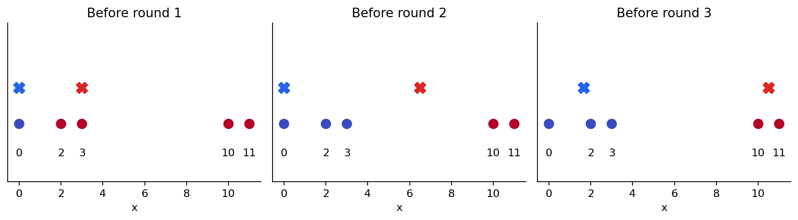
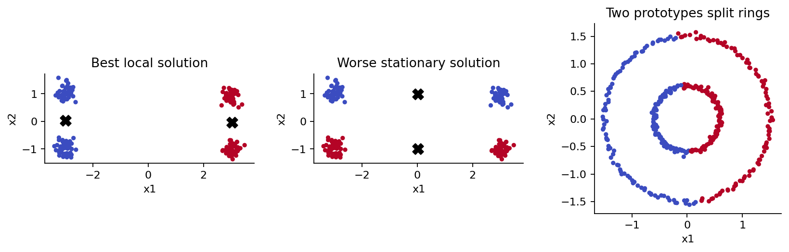
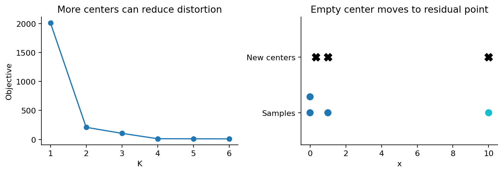

# 第071课 K均值与原型学习

## 本课要回答的问题

没有标签时，怎样用少量代表点概括样本？本课把这个问题明确成一个可计算的任务：给定 $n$ 个向量和一个事先指定的 $K$，寻找 $K$ 个原型，使每个样本到其最近原型的平方距离之和尽量小。这样得到的是一种有损表示，也可以作为探索性分组。它本身并不证明世界上恰好存在 $K$ 个自然类别。

你将独立推导分配与更新两步，手算两轮，写出带重启和空簇日志的算法，并用反例解释为什么“目标下降”和“发现真实结构”是两个不同判断。本课直接先修为第009、019、029、032、069课。需要会向量距离、均值、简单求导和矩阵形状；本课重新解释用到的记号。建议先读讲义，再完成实验，最后看答案。

## 1 从一张数据表开始

设每行是一件待描述的对象，每列是一项数值特征。$X\in\mathbb R^{n\times d}$ 表示数据，$x_i\in\mathbb R^d$ 表示第 $i$ 个样本。中心矩阵 $C\in\mathbb R^{K\times d}$ 的第 $j$ 行为 $\mu_j$。分配变量 $z_i\in\{1,\ldots,K\}$ 记录样本使用哪个原型。代码采用从 0 开始的簇编号，数学使用从 1 开始的编号；编号本身没有大小意义。

原型不必是观测过的真实对象。例如两个温度序列的平均向量可能从未实际出现，却能作为压缩代表。训练后可存储中心和每个样本的中心编号，再用 $\mu_{z_i}$ 近似重构 $x_i$。若应用要求代表必须是一件真实商品或一位真实受试者，均值原型可能不合适，需要另行定义以实际样本为代表的 medoid 问题。

一个重要的建模步骤发生在算法之前：决定哪些列可以比较、单位是什么、缺失值怎样处理。将邮政编码直接当作欧氏坐标，或把类别编号 1、2、3 当作等间距连续量，距离计算虽能运行，却未必描述你关心的相似性。

## 2 平方距离目标究竟奖励什么

K-means 的目标为

$$
J(z,C)=\sum_{i=1}^{n}\|x_i-\mu_{z_i}\|_2^2.
$$

将每个样本自动交给最近中心后，也可写成

$$
F(C)=\sum_{i=1}^{n}\min_{1\le j\le K}\|x_i-\mu_j\|_2^2.
$$

两种写法分别突出显式分配与中心搜索。平方距离并非距离本身：距离翻倍，损失变成四倍；一个远离主要数据的点可能显著拉动中心。$J$ 是总和，除以 $n$ 得到平均失真，不改变同一数据集上的最优中心。不同样本量或不同单位下的总和不能直接当作同一种质量分数比较。

为什么不用普通距离之和？因为损失选择决定原型。一个一维簇若最小化平方误差，解是均值；若最小化绝对误差，解通常是中位数。把距离改成其他函数以后仍机械套用均值更新，会破坏优化依据。K-means 中的“means”不是名字上的装饰，而是平方欧氏距离的数学结果。

## 3 第一步 固定中心选择最近者

当中心不动时，每项 $\|x_i-\mu_{z_i}\|^2$ 只依赖自己的 $z_i$，不同样本之间没有分配约束。因此可以逐个选择

$$
z_i^{(t+1)}\in\arg\min_j\|x_i-\mu_j^{(t)}\|^2.
$$

对任意旧分配，逐项都有新距离不超过旧距离，相加便得到

$$
J(z^{(t+1)},C^{(t)})\le J(z^{(t)},C^{(t)}).
$$

平方根单调，所以比较平方距离和比较欧氏距离给出相同最近中心。我们省掉平方根以减少运算。若两个中心距离相同，任意一个都是该步最优解，但必须写明平局规则。本课用最小中心编号，使同一输入可重现。不要把簇编号改变误认成分组改变。

中心之间的决策边界来自等距条件。对中心 $a,b$ 展开平方并消去 $x^Tx$，可得

$$
2(\mu_b-\mu_a)^T x=\|\mu_b\|^2-\|\mu_a\|^2.
$$

这是一条超平面。每个中心的 Voronoi 区域是若干半空间的交，因此是凸的。即使训练点不铺满该区域，算法对新点的分配仍有这种几何偏好。

## 4 第二步 固定分配求均值

设第 $j$ 个非空簇的索引集合为 $S_j$，大小为 $n_j$，样本均值为 $\bar x_j$。把每个偏差拆成两段：

$$
x_i-\mu=(x_i-\bar x_j)+(\bar x_j-\mu).
$$

平方后求和，中间的交叉项为零，因为 $\sum_{i\in S_j}(x_i-\bar x_j)=0$。因此

$$
\sum_{i\in S_j}\|x_i-\mu\|^2
=\sum_{i\in S_j}\|x_i-\bar x_j\|^2+n_j\|\mu-\bar x_j\|^2.
$$

右侧第一项不随 $\mu$ 变化，第二项非负，且恰在 $\mu=\bar x_j$ 时为零。这给出均值更新，并且不需要先会多元求导。若用求导验证，同一结论来自

$$
\nabla_\mu\sum_{i\in S_j}\|x_i-\mu\|^2
=2n_j\mu-2\sum_{i\in S_j}x_i=0.
$$

对非空簇，Hessian 为 $2n_jI$，正定，所以均值是固定分配下唯一的最小值。注意限定词：这不是整个 K-means 问题的唯一解，因为改变分配可能得到另一组更好的中心。

## 5 两步为什么下降 又为什么不保证全局最优

把两条不等式串起来：

$$
J(z^{(t+1)},C^{(t+1)})
\le J(z^{(t+1)},C^{(t)})
\le J(z^{(t)},C^{(t)}).
$$

这就是 Lloyd 交替优化的单调不增性质。若一步已经达到相应子问题的最优解，可以持平，不必严格下降。目标有零这个下界，目标值序列因此收敛；仅凭这句话不能推导有限步达到全局最优。对无退化情形、确定平局规则和精确更新，有限的分配状态有助于理解算法为何通常停止；重复点、空簇、数值容差则需要实现规则。

最直观的障碍是两个变量块都各自满意，却共同卡在一个较差的分组。四团样本在窄矩形的四角，$K=2$ 时，按左右分通常优于按上下分；某些初始化却会收敛到上下分。此时把一个中心轻微移动没有帮助，要改变分组结构才能显著改善。本课称之为较差的稳定解；不需要把所有退化稳定点都严格归类为局部极小。

## 6 用五个数手算两轮

数据为 $0,2,3,10,11$，取 $K=2$，初始中心为 $0,3$。先对两个中心列出平方距离：

| 样本 | 到 0 的平方距离 | 到 3 的平方距离 | 初始分配 |
|---|---:|---:|---|
| 0 | 0 | 9 | 第1簇 |
| 2 | 4 | 1 | 第2簇 |
| 3 | 9 | 0 | 第2簇 |
| 10 | 100 | 49 | 第2簇 |
| 11 | 121 | 64 | 第2簇 |

初始目标是 $0+1+0+49+64=114$。第一轮更新保持上述分配，把中心改为 $0$ 和 $(2+3+10+11)/4=6.5$。此时固定旧分配的目标为 $20.25+12.25+12.25+20.25=65$。

重新分配时，中点边界为 $3.25$，故 $0,2,3$ 进入第1簇，$10,11$ 进入第2簇。仍用中心 $0,6.5$，目标是 $0+4+9+12.25+20.25=45.5$。这是第二轮分配的结果，还没执行第二轮均值更新。

第二轮更新得到 $\mu_1=5/3$、$\mu_2=10.5$。目标为

$$
J=\left(\frac{25}{9}+\frac{1}{9}+\frac{16}{9}\right)+\frac14+\frac14=\frac{31}{6}\approx5.166667.
$$

新边界是 $73/12\approx6.0833$，分配不再改变。本课实现还记录一次不改变中心的确认轮，所以日志有三行；这不代表手算少做了一轮。阅读任何迭代日志前，应先问“一轮”记录的是分配前、更新后还是两步之后。

## 7 初始化与多次重启

随机初始化从数据中选择 $K$ 行作为中心。它便宜，但可能把多个中心放在同一团。一次运行不能说明初始化是否可靠。多次重启的做法是独立初始化、各自运行至停止，然后在相同数据、相同尺度、相同 $K$ 下选择目标最小的候选。

本课让第 $r$ 次运行使用 seed 加 $r$。将重启数从3改为15时，前3个候选完全保留。因此“当前最佳值”随预算不增是选择规则的必然结果，而不是关于未知全局最优的保证。若换了随机数调用顺序，两个预算未必拥有相同候选前缀，不能据此强行要求同样性质。

k-means++ 使用距离加权的播种。先随机选一个样本；设 $D_i$ 为 $x_i$ 到已选中心的最近距离，下一中心按

$$
P(i)=\frac{D_i^2}{\sum_{\ell=1}^{n}D_\ell^2}
$$

抽样。离现有原型远的样本得到更高机会。分母为零说明现有中心已覆盖所有不同位置；实现必须处理重复点，不能产生 NaN。原始方法有期望近似保证，但不能把它说成“每次都找到全局最优”。本课实现基础 D² 抽样；scikit-learn 使用带局部候选试探的 greedy k-means++，相同种子也不意味着两者得到同一初始中心。[1][2]

本课40次随机重启的最小目标为208.587739，最大为1817.571731，确实出现明显不同的稳定解。D² 播种的40次运行也没有消灭所有较差解。实验不是要证明某一初始化永远更好，而是展示应该保留运行分布、最好值和停止信息。

## 8 空簇不是可以忽略的除零警告

假设两个初始中心重合，平局时所有相关样本被交给编号较小的中心，另一个簇就可能为空。计算空数组均值会得到 NaN，这会沿着距离矩阵传播，最终使看似正常的标签毫无意义。必须在均值更新前检查每簇计数。

本课策略是：非空簇更新为均值；空簇中心移到旧分配中残差较大的观测点；暂时不改变任何旧分配，然后正常重新分配。固定旧分配时，空中心没有贡献，移动它不改变该目标；其他中心的均值更新不增；随后的最近分配仍不增。由此可把空簇处理放进同一个下降证明，而不是只凭经验认为不会出错。

数据 $0,0,1,10$，初始中心 $0,0,10$ 会产生一个空簇。处理后中心可到达 $0,1,10$，目标为0。相反，四个完全相同的二维点，即使请求 $K=3$，按本课平局规则也只有一个实际非空簇。算法记录 effective_k=1。它不伪造不同类别，也不承诺每个中心都有样本。

另一种可行策略是保留空中心不动，它也保持两步证明，但可能长期浪费一个中心。若采用强行移走某个非空簇样本的方法，需要重新检查重分配和均值更新的顺序，不能直接沿用旧证明。

## 9 单位变化会改变研究问题

欧氏平方距离为 $\sum_q(x_q-y_q)^2$。把第2列乘30之后，该列的贡献乘900。这等价于改动特征权重，并不是无害的显示单位变化。在本课数据中，左右两个生成群体在第1列上分离；第2列是与群体无关的波动。放大第2列后，K-means 会主要沿这项波动划分。

标准化常用 $x'_{iq}=(x_{iq}-\bar x_q)/s_q$，于是标准化距离等价于原坐标下 $\sum_q(x_{iq}-x_{\ell q})^2/s_q^2$。这把每列方差调到相近尺度，同时也做出了“按标准差衡量变化”的建模选择。它不自动知道哪些变量有科学意义；若一个低方差变量主要是测量误差，标准化甚至会放大误差。常数列需要显式处理，因为其标准差为0。

如果你要给未来样本分配原型，必须复用训练时保存的均值、标准差和中心，不能在每个新批次重新标准化。若预处理参与后续预测评估，还需要遵守训练集拟合、验证集变换的边界。无监督不等于所有数据使用方式都没有泄漏问题。

## 10 球状偏好应怎样理解

“球状偏好”不是说每个输出簇严格是球，而是平方欧氏距离和单一均值对紧凑、近似各向同性的团块更友好。Voronoi 区域可是不规则凸多面体，也可向无穷延伸。多个尺度、拉长椭圆、不同密度和大小严重不平衡的群体都可能使目标最小化与人的结构期待不一致。

同心环是一个直接反例。每个环的均值都接近原点，两个均值不足以表示“离原点近的一圈”和“离原点远的一圈”的非凸成员关系。目标为了减小平方误差，通常把空间切成两侧，每一侧同时含内环和外环。这不是优化器报错：它恰好说明原型与距离的假设不适合该分组目标。下一课会改变分组机制。

还应区分“离群点”和“另一簇”。标准 K-means 总会把每个点分给一个中心，距离极大的点也不例外。一个异常观测若拉走一个中心，目标可能下降，却损害主要群体的表示。是否保留异常、修改损失或另建噪声模型，要由测量过程和研究目的决定。

## 11 怎样选K才不把优化当作发现

当允许增加中心时，理论最优的平方误差不会增大：旧解加一个重复中心已经是合法候选。所以“$K=6$ 的训练失真比 $K=2$ 小”不能独自支持有六个自然类别。有限重启的近似最优值可能存在算法波动，尤其不能把每个小拐点都解读成真实边界。

本课只要求报告压缩预算、目标、初始化和假设，完整的聚类验证留给后续单元。若应用是把连续空间压缩成十个原型，$K=10$ 可以来自存储预算；若应用是探索疾病亚型，则还需要独立证据、稳定性和研究设计。不能把预算选择转换成分类学结论。

## 12 代码接口与复杂度

本课 kmeans.py 将距离、播种、单次 Lloyd 和重启选择分开。fit 返回 centers、labels、inertia、history、converged、effective_k 以及全部重启目标。predict 只做最近中心分配。代码检查输入为非空二维有限矩阵，检查 $1\le K\le n$、正整数迭代数，并拒绝平方距离溢出。检查使用显式异常，因此 python -O 不会取消这些防线。

每次分配约需 $O(nKd)$ 运算，均值更新约需 $O(nd)$，$T$ 轮、$R$ 次重启约为 $O(RTnKd)$。这是给定轮数的工作量表达，不是最坏情况下迭代轮数的常数保证。教学广播实现暂存 $n\times K\times d$ 的差分张量，内存可能比最终 $n\times K$ 距离矩阵大得多。$n=10^4,K=20,d=50$ 时，float64 差分临时数组约80 MB，而距离数组约1.6 MB，尚未计算其他数组。大数据应分块计算、使用成熟实现或按任务选择 mini-batch 变体。

停止时还要检查结果含义。本课只有分配不变且中心变化足够小时才报 converged=true。达到 max_iter 时仍返回最近中心标签和可核对的目标，但 converged=false；此时中心未必恰等于最终标签的簇均值。不能把“函数返回了”写成“已经收敛”。

## 13 本课的可检验结论

完成后应能在没有软件帮助时推导均值更新、逐项证明分配不增，写出五点手算的每个目标，并解释空簇策略为什么不破坏证明。你还应能够读懂一次失败：是尺度选错、几何假设不合适、初始化较差，还是代码没有处理退化输入。

实验中的生成标签只用来解释人工数据怎样构造，不参与拟合，不用它反复挑参数后再宣称发现了结构。每个图和报告都能从冻结数据重建。最后保留一句明确结论：K-means 给出的是指定度量和原型预算下的一组表示，不是自然类别的自动证明。

## 参考资料

[1] scikit-learn 官方 KMeans API，核对初始化、n_init、停止参数和输出字段。https://scikit-learn.org/stable/modules/generated/sklearn.cluster.KMeans.html

[2] Arthur 与 Vassilvitskii，2007，k-means++ The Advantages of Careful Seeding，作者公开论文。https://theory.stanford.edu/~sergei/papers/kMeansPP-soda.pdf

[3] scikit-learn 官方聚类指南，K-means 几何假设、局部解与运行方式。https://scikit-learn.org/stable/modules/clustering.html#k-means

资料于2026-10-08核验；本课实际执行版本见 requirements.txt。文中的手算、下降分解及合成反例由随附代码独立复算，不依赖网页中的示例输出。
