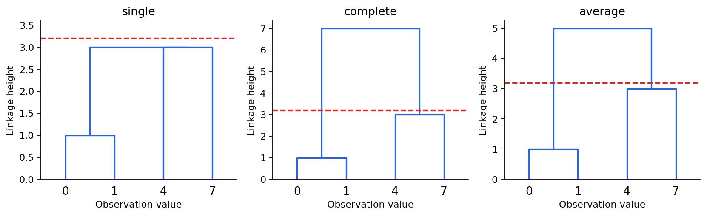
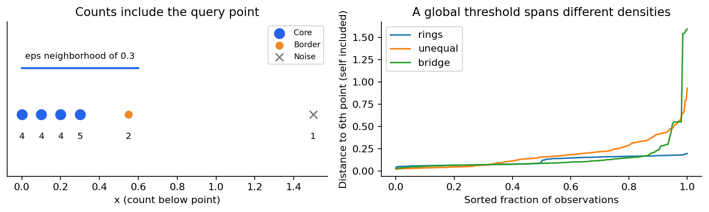
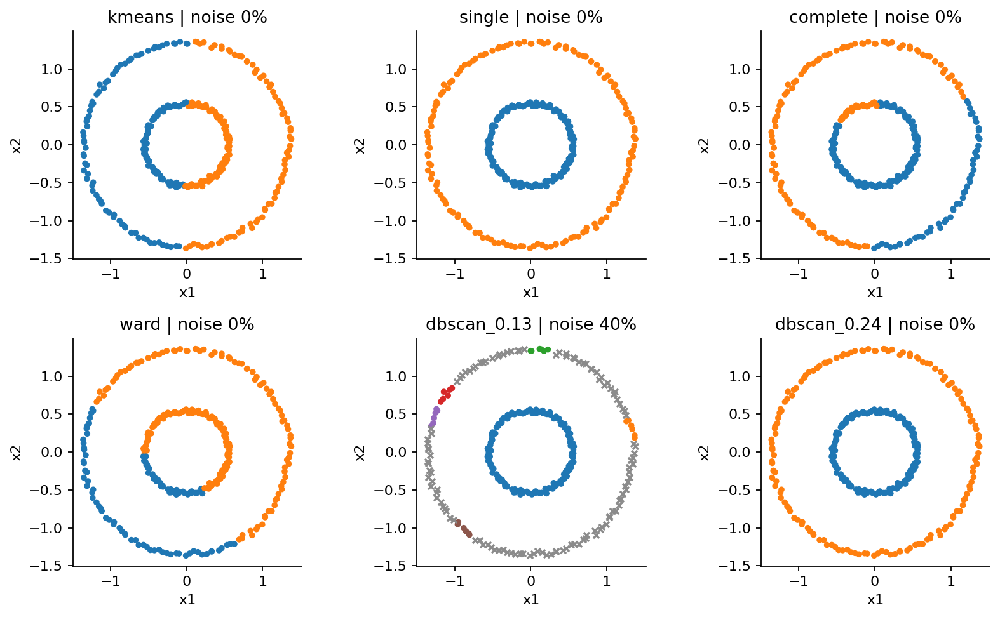
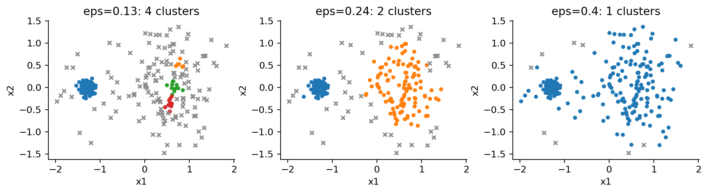
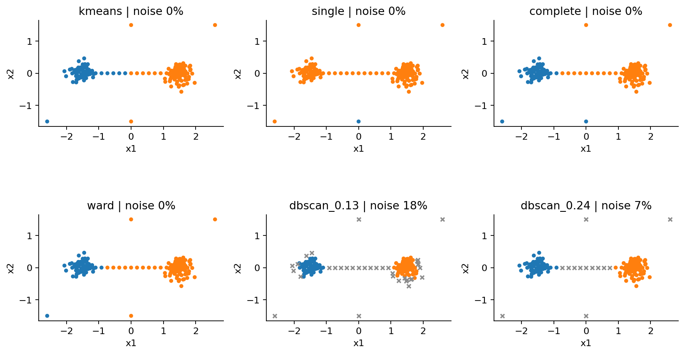

# 第072课 密度与层次聚类

## 本课要解决的问题

一条弯曲的带、一对同心环、几团疏密不同的点，以及夹在它们之间的少量杂点，未必适合用均值中心描述。本课学习两种不同的分组机制：层次聚类记录从小组到大组的合并顺序；DBSCAN依据局部邻域密度和连接关系组织样本，并允许一些样本暂不属于任何簇。

我们会推导常见linkage、读懂树状图、手算核心点和边界点，写出小规模可审计实现，再在环形、不同密度与桥接噪声上比较成功和失败。目的不是挑出一个永远获胜的方法，而是把结果与距离、合并规则、密度阈值联系起来。直接先修是第009、057、071课；完整聚类验证另有专门单元，本课只做机制对照。

## 1 先把相似性的定义固定下来

仍用 $x_i\in\mathbb R^d$ 表示样本，$d(x_i,x_j)$ 表示距离。本课采用欧氏距离，数据两维具有相同的人工单位，不额外标准化。真实数据若各列量纲不同，必须先决定变换与权重。方法名字变了，不会免除距离的建模责任。

欧氏距离满足非负、对称、同点为零和三角不等式。许多算法可以接受预计算距离，但“传入了方阵”并不证明该方阵合法。还要检查有限性、对称性、对角线、距离含义以及算法是否要求欧氏几何。尤其Ward方法不能随意配上余弦或其他非欧氏距离，再沿用方差解释。[1]

我们区分两层问题：样本之间的距离是怎样量出来的；一组样本与另一组样本的距离又怎样定义。后者就是linkage。选择不同linkage，即使所有样本距离完全相同，也可能得到不同树和不同切分。

## 2 凝聚层次聚类从单点开始

凝聚算法起初把每个样本视为独立簇。每一步找当前最相近的两个簇，合并成一个新簇，再更新它与其他簇的距离。经过 $n-1$ 次合并只剩一个簇。所有中间状态形成嵌套结构：一个较早形成的簇不会在后面被拆开。

这给出一种可解释的记录，但也带来贪心限制。早期若因为噪声错误地连在一起，后面不能撤销。层次结构意味着“按照本规则得到的合并历史”，并不自动等于物种进化树、疾病谱系或因果树。

设两个簇为 $A,B$。三种常见linkage为

$$
d_{\mathrm{single}}(A,B)=\min_{a\in A,b\in B}d(a,b),
$$

$$
d_{\mathrm{complete}}(A,B)=\max_{a\in A,b\in B}d(a,b),
$$

$$
d_{\mathrm{average}}(A,B)=\frac{1}{|A||B|}\sum_{a\in A}\sum_{b\in B}d(a,b).
$$

single只需一对近邻就允许合并，因此可以沿弯曲结构逐步连接，也容易出现链化。complete在意最远的跨簇点，通常形成更紧凑的团，但可能把一条长曲线切开。average平均所有跨簇样本对，在两者之间折中，却不是两簇中心的距离。average与weighted也不同：前者按样本对平均，后者对先前两个子簇的距离等权平均，簇大小不等时结果会不同。[1]

## 3 四个点足以看懂linkage

取一维样本0、1、4、7。最小距离是0与1之间的1，所以先得到簇 $A=\{0,1\}$。它与单点4的距离分别是：single为3，complete为4，average为3.5；单点4与7的距离是3。

本课程序对平局按当前簇ID排序，故三种方法接下来都合并4与7，得到 $B=\{4,7\}$。single的第二步存在距离3的平局；其他合法平局规则可能先合并 $A$ 与4。不能把这类等距次序差别立刻判断成实现错误。

最终，两个二点簇之间有四个跨簇距离4、7、3、6。因此最终合并高度为：

| 规则 | 计算 | 最终高度 |
|---|---|---:|
| single | 最小的跨簇距离 | 3 |
| complete | 最大的跨簇距离 | 7 |
| average | 四个距离之和除以4 | 5 |

相同原始数据在不同linkage下产生不同纵轴高度，这就是为什么不能把树状图上的“5”笼统称为两个群体的真实距离。应明确它是哪个规则下的合并代价。

## 4 Ward合并与平方误差的连接

Ward不直接使用一对最近或最远样本，而是选择使簇内平方误差增量最小的合并。令 $a=|A|,b=|B|$，均值分别为 $\mu_A,\mu_B$，合并均值为

$$
\mu_{A\cup B}=\frac{a\mu_A+b\mu_B}{a+b}.
$$

利用上一课的均值平方分解，合并前后误差之差为

$$
\Delta(A,B)=a\|\mu_A-\mu_{A\cup B}\|^2+b\|\mu_B-\mu_{A\cup B}\|^2.
$$

代入 $\mu_A-\mu_{A\cup B}=\frac{b}{a+b}(\mu_A-\mu_B)$ 及另一项，得到

$$
\Delta(A,B)=\frac{ab}{a+b}\|\mu_A-\mu_B\|^2.
$$

这个增量同时考虑中心距离与簇大小。同样的中心距离，把两个大簇合并通常比合并两个小簇付出更大平方误差。它与K-means都重视紧凑度，但优化路线不同：K-means可重新分配单个点，Ward只做不可撤销的整簇合并。

还要辨别软件纵轴约定。SciPy的Ward linkage高度为 $\sqrt{2\Delta}$，不是直接显示 $\Delta$。两个单点的Ward高度因此等于它们的欧氏距离。报告纵轴为“合并代价”时，应说明实现与单位，不能把不同库或不同linkage的纵轴直接混着解释。

## 5 怎样读树状图 怎样切树

树状图底部叶子代表样本，竖线接到横线的高度表示合并发生的linkage值。叶子左右顺序通常可在不改变树结构的情况下翻转，横向接近不一定表示原空间更接近。图宽是排版结果，不是第三个数值变量。

在高度 $h$ 画一条水平线，把所有尚未在该高度以下相连的分支视为不同簇，得到基于距离阈值的切分。也可指定恰好 $K$ 组，保留 $n-K$ 次合并。但当多次合并高度完全相同，精确K切法可能在同一高度的平局中任选一种次序，未必对应一条严格分隔各高度的水平线。

四点single树在高度3同时发生后两次合并：高度低于3时可能还是三组，高于3时已是一组；无法用严格水平高度获得稳定的两组区间。本课cut_k仍可在两次合并后留下两组，因为它按显式顺序截断。把“maxclust参数希望最多K组”和“恰好K组”混用，是常见接口误读。

切树依据可以是物理距离阈值、研究分辨率、可承受的组数预算，或另外设计的验证方案。只挑一条让图好看的横线，再给每组取意义重大的名字，不能构成研究依据。数据没有结构时，算法也会画出一棵完整树。

## 6 密度方法从邻域计数开始

DBSCAN用两个参数描述局部稠密程度：邻域半径 $\varepsilon>0$ 和最小样本数 $m$。闭邻域定义为

$$
N_\varepsilon(p)=\{q:d(p,q)\le\varepsilon\}.
$$

本课与scikit-learn API一致，计数包含查询点自己。若 $|N_\varepsilon(p)|\ge m$，点 $p$ 是核心点。一个非核心点若位于至少一个核心点的邻域中，称为边界点；不满足这两者则标为噪声。[2]

这些身份依赖 $\varepsilon$、$m$、距离和当前样本集合。噪声并非“无价值数据”，也不自动等于测量错误。它只是当前密度规则没有接纳的点。真实的小群体、稀疏群体、边缘观测都可能被标为噪声。

固定半径提高m会要求更多邻居；固定m减小半径也更难成为核心点。m=1时每个点都核心，DBSCAN退化为半径邻接图的连通分量，此时不再具有通常期待的局部密度过滤能力。重复样本按观测次数计数，若数据导入意外重复，密度会被虚增。

## 7 密度可达为何有方向

若 $q\in N_\varepsilon(p)$ 且 $p$ 是核心点，称 $q$ 从 $p$ 直接密度可达。这里出发点必须核心，抵达点可以是边界点。如果 $q$ 非核心，就不能从 $q$ 按同样规则继续向外扩展。因此直接密度可达一般不对称。[3]

若存在一串点 $p=p_1,p_2,\ldots,p_r=q$，每一步 $p_{i+1}$ 都从 $p_i$ 直接密度可达，则称 $q$ 从 $p$ 密度可达。除最后一点外，链上的点需要能继续扩展，即是核心点。两点如果都从某个点 $o$ 密度可达，则它们密度相连。边界点本身不能把两个核心团接成一团，这是密度方法与普通邻接连通的关键差别。

一个易于编程的等价视角是：先只保留核心点及其半径内的边，求核心图连通分量；再把邻接核心分量的非核心点加作边界，剩余为噪声。多个核心分量不相交，但一个边界点可能同时挨着两个核心分量。此时边界归属可能随扫描顺序而变。本课选择编号最小的邻接分量，并显式记录歧义边界点；它不会通过这个边界把两个核心分量合并。

## 8 六个点手算DBSCAN

取 $0,0.1,0.2,0.3,0.55,1.5$，令 $\varepsilon=0.3,m=4$。从每个点向左右检查闭区间半径0.3内的样本，计数如下。

| 点 | 邻域计数含自身 | 身份 | 原因 |
|---|---:|---|---|
| 0 | 4 | 核心 | 包含0到0.3的四点 |
| 0.1 | 4 | 核心 | 包含同样四点 |
| 0.2 | 4 | 核心 | 尚未够到0.55 |
| 0.3 | 5 | 核心 | 还包含0.55 |
| 0.55 | 2 | 边界 | 自己及核心点0.3 |
| 1.5 | 1 | 噪声 | 只有自己 |

四个核心点组成一个连通分量，0.55作为边界进入该簇，1.5保持噪声。尽管0.55到0的距离超过eps，它们仍可在同一个簇中。因此eps不是簇直径上限。邻域半径控制的是局部步长，而不是整个簇的最大跨度。

## 9 环形结构为何能被接起来

本课rings数据由两个各150点的环组成，半径为0.55和1.35，叠加轻微坐标噪声。K-means的两个中心难以描述内外关系；single linkage可以沿同一环的短边连接；DBSCAN则沿核心点链连接。它们都不要求簇是凸集。

但是“同一个环”也可能在参数下不够密。本实验每个环点数相同，外环周长更长，因此相邻间距更大。m=6、eps=0.10时，内环150点形成一簇，外环全部被标为噪声；eps=0.13时外环只出现少数小密团；eps=0.24时两个完整环都被恢复，且无噪声。这说明不相交的环也可以具有不同线密度，不能只凭外形判断参数。

complete、average和Ward在本例切成两组时未恢复完整内外环。它们的跨簇紧凑度目标倾向把长弯曲结构拆开。single在干净环上成功，不表示它对噪声同样稳健。下一实验故意加入连接两团的稀疏链。

## 10 不同密度让一个阈值左右为难

unequal数据含100个紧密点、130个松散点以及35个均匀背景点。数据生成标签只供事后解释。我们固定m=6，比较eps为0.13、0.24、0.40三个半径，不依据隐藏标签挑选一个“最佳”参数后再宣称独立验证。

eps=0.13时得到4簇，噪声比例约51.7%；100个紧密点全部保留，130个松散点中有103个被当成噪声。eps=0.24时得到2簇，噪声比例约19.6%；但仍漏掉24个松散点，也接纳一些背景点。eps=0.40时只剩1簇，噪声降至约3.4%，因为更宽的邻域把两团和许多背景点接在一起。

因此噪声比例越低不等于越好；簇数等于预期也不等于成员正确。一个全局eps及m隐含全局密度尺度假设。OPTICS和HDBSCAN等方法尝试考察多个尺度，但它们也需要参数、度量和解释，本课只指出这个方向，不把新方法当成免除研究设计的答案。[4]

## 11 稀疏桥如何暴露single linkage的弱点

bridge数据由左右各90个紧密点、两团之间13个稀疏桥点及4个远处杂点构成。single linkage只看一对最近点，桥上的短距离足以把左右团串起来。把整棵树切成2簇时，结果是196点的大簇和1点的小簇；主要左右群体已经被连在同一个大簇内。

DBSCAN的区别不是它拒绝所有桥点，而是桥的中间点不足以成为核心，不能连续扩展。eps=0.24时两个簇各92点，13点保持噪声。每侧90个生成点全部被接纳，同时各接纳2个桥点作边界；“正确识别噪声”也不能说成完全无误。complete、average、Ward强制给每个点分组，较可能保留两个主要团，但会把远处杂点也分给它们。

若继续增大eps或降低m，桥上点也可能成为核心，DBSCAN最终同样合并。这是规则导致的结果，不是某个算法名称提供永久防噪保证。

## 12 最近邻距离图能提供什么证据

对每个点计算到第m个点的距离，其中自己占第1位，再把这些距离排序，可观察局部密度尺度。图中明显弯折可以作为探索eps的线索；它不是唯一正确阈值的证明。异密度数据可能出现多段变化，高维距离集中、重复点和噪声也可能使拐点难以解释。

报告时应写出m是否含自身、距离如何计算、尝试哪些半径以及哪些判断事先确定。若用生成标签查看误分，那是教学诊断；在真实无标签任务中通常没有同样的真值。不要把这两种证据混为一谈。

## 13 实现与复杂度必须分开陈述

教学DBSCAN先计算全部成对距离，空间为 $O(n^2)$，距离计算时间为 $O(n^2d)$；核心图遍历和边界归属还会扫描邻接关系。本课直接广播还会产生 $n\times n\times d$ 临时差分，所以实际峰值内存高于一个距离矩阵。低维空间索引和稀疏邻域在合适数据上可降低代价，但不能承诺所有DBSCAN运行都是 $O(n\log n)$。高维、过大的eps或大量邻居会使优势消失。[2][3]

scikit-learn实现会批量计算邻域，最坏情况下内存为二次量级；原始算法可按需查询并以线性级存储工作。讨论复杂度必须指明实现与数据条件，不能把论文中的某一索引假设套到所有库调用上。

教学凝聚实现每次枚举所有簇对，并重新查看跨簇距离块。每一步全部块的元素数在 $O(n^2)$ 内，共 $n-1$ 步，故约为 $O(n^3)$ 时间，加上初始 $O(n^2d)$ 距离计算；距离矩阵和候选表需要 $O(n^2)$ 空间。SciPy对single使用最小生成树优化，对complete、average、weighted和Ward使用最近邻链算法，其这些实现的时间和空间均为 $O(n^2)$。[1]

一个float64的 $10000\times10000$ 距离矩阵约800 MB；$100000\times100000$ 已约80 GB。压缩上三角只减少常数，不改变二次增长。不能因为200行教学数据几乎瞬间完成，就承诺十万行数据也可以直接使用同一代码。

## 14 本课的报告边界

报告中要分别写：度量与预处理、linkage或密度参数、树的切分依据、簇大小、噪声比例、歧义边界规则、运行规模和失败案例。簇编号只起标识作用，跨算法比较应看哪些点同组及哪些点被拒绝，不能直接比较整数标签是否逐项相同。

本课不把噪声点合并为一个真实“噪声类别”。代码在对照实现时单独比较噪声集合；结果表中的负1只是拒绝标记。对生成背景点计算被接纳数量，是利用已知人工构造检验机制，不能直接推广为真实测量异常的识别率。

最重要的判断是条件句：在指定距离、尺度与密度条件下，某种连接或合并机制能表达某种结构；条件不满足时，它会以可解释的方式失败。给树状图切一刀或让DBSCAN输出两簇，都不是结构真实性的最终证据。

## 参考资料

[1] SciPy官方linkage文档，链接定义、Z矩阵、Ward欧氏条件与实现复杂度。https://docs.scipy.org/doc/scipy/reference/generated/scipy.cluster.hierarchy.linkage.html

[2] scikit-learn官方DBSCAN API，含自身的min_samples、eps与最坏内存。https://scikit-learn.org/stable/modules/generated/sklearn.cluster.DBSCAN.html

[3] Ester、Kriegel、Sander、Xu，1996，A Density-Based Algorithm for Discovering Clusters in Large Spatial Databases with Noise，AAAI原始论文。https://cdn.aaai.org/KDD/1996/KDD96-037.pdf

[4] scikit-learn官方聚类指南，层次、DBSCAN及多尺度方法。https://scikit-learn.org/stable/modules/clustering.html

资料于2026-10-08核验。实际数值使用requirements.txt固定版本；所有实验表述均由随课数据和代码生成。网页版API版本可能继续更新，故代码显式指定关键参数。
