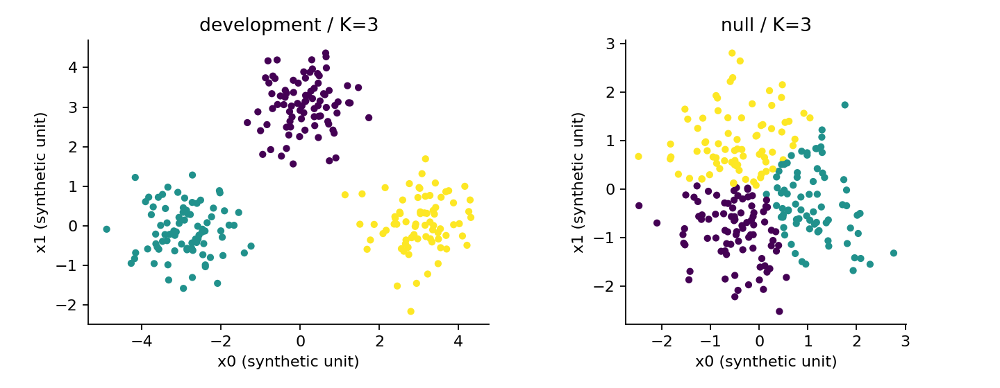
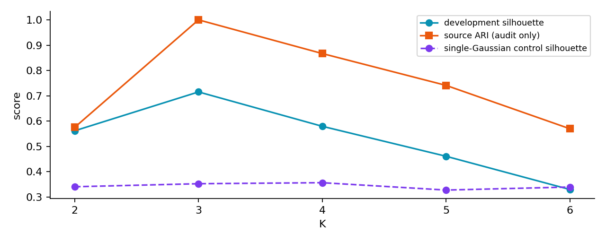
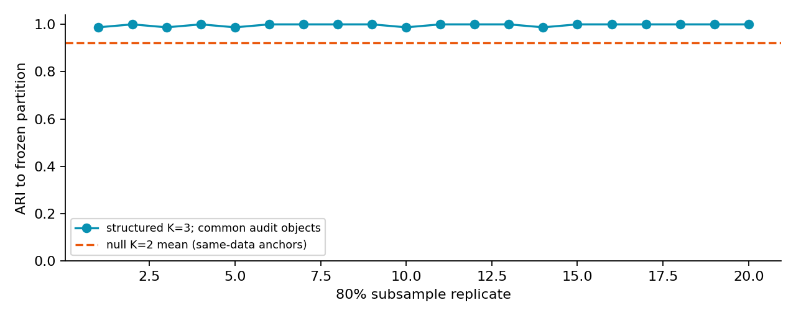
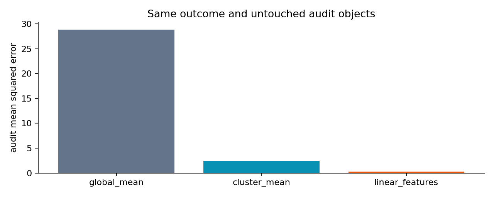

# 第073课 聚类结果的验证

## 1 从“算法总会分组”到“我们有什么证据”

第071课的K均值在给定K之后一定尝试找K个中心；第072课的层次算法一定生成合并树。即使输入是一团随机点，也会出现颜色不同的组。于是本课的核心问题是：**没有标准答案时，怎样避免把任何分组都说成发现？** 我们把“图好看”“分组可重复”“符合外部定义”“对实际任务有用”拆成四种可以检查的主张。

想象把零件的两项传感器读数用于分组。工程师可能关心分组后能否安排不同维护周期，数学家可能关心点之间是否紧凑，另一位研究者关心能否恢复已知生产来源。这些目标未必一致。按照距离形成的组可以很紧凑，却没有不同故障风险；真实来源也可能在读数空间重叠。评价之前必须先写明要支持哪种主张。

本课直接先修为第025–026、050、070–072课。这里仍重新定义用到的概率、计数和距离。数据每行是一件人工对象，x0、x1是两个同单位的读数，source在三来源数据中是生成器记录的来源编号；null中的source是与坐标独立的占位编号，不是真实簇标签。outcome是模拟的连续响应。**只有x0、x1输入聚类**；source只审计，outcome只用于事先定义的下游预测。

> 蓝色重点：聚类验证是一组证据的组织方法。一个分数回答一个特定问题，不是“存在自然类别”的通行证。

## 2 一张验证地图

内部指标只需要坐标与拟合标签，考察模型形成的几何结构。外部指标还需要另一个分组标准，比较两个对象划分。稳定性指标还需要一个明确的扰动机制，考察小幅改变输入后结果是否保持。下游验证还需要独立任务和评价数据，考察使用分组是否改善实际结果。

| 证据 | 实际提问 | 不能直接回答 |
|---|---|---|
| 轮廓系数 | 本点离自己组是否比别组更近 | 组是否有业务或因果含义 |
| 调整兰德指数ARI | 两种对象划分的一致性超出何种随机基线 | 参考分组是否唯一正确 |
| 重采样稳定性 | 指定扰动下划分是否保持 | 稳定划分是否真实或有用 |
| 下游误差 | 冻结任务中分组是否帮助预测 | 是否发现了真实生成机制 |

这张表也解释为什么没有标签不等于没有验证。没有可信外部标准时，外部指标应写“不适用”，不能凭空制造真值；其余证据仍可谨慎积累。相反，有人工标注也不应省略标签来源和测量误差。参考类别是人做出的某种定义，不一定与距离算法的目标吻合。

## 3 轮廓系数先看一个点

设第i个点为 $x_i$，所属簇为 $C_i$。$|C_i|$是簇内对象个数。欧氏距离 $d(x_i,x_j)$ 是两点之间的直线长度。对非单点簇，定义

$$a(i)=\frac{1}{|C_i|-1}\sum_{j\in C_i,j\ne i}d(x_i,x_j).$$

a是到本簇其他点的平均距离，分母减1是因为不把自身零距离算入。对于每一个别的簇C，先算到该簇全部点的平均距离，再选最小者：

$$b(i)=\min_{C\ne C_i}\frac{1}{|C|}\sum_{j\in C}d(x_i,x_j).$$

最后用更大的那个距离统一尺度：

$$s(i)=\frac{b(i)-a(i)}{\max\{a(i),b(i)\}}.$$

当a小而b大，分子为正并接近分母，s接近1；当两种距离差不多，s接近0；当本簇反而比另一个簇更远，s为负。这是一个**对当前划分和当前距离的相对评价**，不表示概率。s=0.8不能解释为“80%可能分对了”。

单点簇没有本簇其他成员，所以不能机械代入a=0获得1分。本课遵从常用实现约定，将单点簇的s设为0。全部点一组时没有其他簇；每点各一组时没有普通簇内关系。因此整体指标要求簇数位于2到n−1之间。若所有相关距离都是0，也设为0以避免零除。[1]

## 4 四个点手算与单位检验

取一维点0、1、5、6，划分为{0,1}与{5,6}。对点0，a=1，到另一簇距离是5与6，故b=5.5，s=1−1/5.5≈0.8182。对点1，a=1，b=(4+5)/2=4.5，s≈0.7778。另两个点对称，整体均值约0.7980。

把所有坐标统一乘8，a和b同时乘8，分子分母消去8，轮廓分数不变。但仅把x0列乘8，几何形状改变，分数通常会变。这区分了“整体换单位”与“改变某一特征的相对权重”。本课数据两个坐标同人工单位，因此不做标准化；真实任务需要先说明距离和尺度。

为什么总体平均还不够？如果大簇有200个高分点，小簇只有5个负分点，平均值可能掩盖小簇问题。报告时应同时看各簇大小、分数分布、负分点和原空间示意图。一个平均值也不告诉你边界是否经过高密度区域，尤其细长或弯曲结构可能被轮廓指标不公平地评价。

## 5 ARI如何绕过簇编号

把同一划分的标签从{0,0,1,1}改成{7,7,3,3}，对象关系没有改变。逐项比较标签数值却会得到全错。因此外部评价关注“两个对象是否同组”，不关心组名。兰德思想是枚举所有无序对象对；n个对象共有 $M=\binom n2=n(n-1)/2$ 对。

令外部分组为U，拟合分组为V。列联表中的 $n_{uv}$ 表示同时在U的第u组和V的第v组的对象数；行和为 $a_u$，列和为 $b_v$。函数 $\binom m2=m(m-1)/2$ 表示从m个对象中选两个。于是两个分组都把对象对判为同组的数量为

$$T=\sum_{u,v}\binom{n_{uv}}2,\quad A=\sum_u\binom{a_u}2,\quad B=\sum_v\binom{b_v}2.$$

A是U中的同组对数，B是V中的同组对数。若固定双方各簇大小，随机打乱对象身份，则某个U同组对落入V同组关系的概率为B/M，期望共同同组数为 $E=AB/M$。**随机调整依赖这个固定边际的随机模型**，不是对所有可能的“无结构”都统一校正。

$$\mathrm{ARI}=\frac{T-E}{(A+B)/2-E}.$$

相同划分通常给1；随机独立划分的期望接近0；负数表示比这套随机基线更不一致。ARI不是0到1之间的准确率，也不是显著性检验的p值。本课对于两种划分都退化为全一组或全单点等相同划分的零分母情况，采用ARI=1的标准约定。[1]

## 6 ARI的负分不神秘

用四个对象，U={0,0,1,1}，V={0,1,0,1}。列联表为两个乘两个，四格全是1，因此T=0；A=B=2，M=6，E=2/3。分母是2−2/3=4/3，分子是−2/3，ARI=−1/2。

这不是“负一半对象分错”，因为ARI的单位不是对象。它说，在固定每组两个对象的随机参考下，这两个划分的共同同组对比期望还少。用四个对象的手算能够防止一种常见误读：看到负分就把它截成0，从而丢失真实的不一致信息。

当source是人工生成来源时，ARI有明确解释。但真实数据中，来源与观测群形未必一一对应。例如两个工厂生产的合格零件可能完全混合；同一工厂可能包含两个设备状态。ARI较低可能意味着算法没有恢复来源，也可能说明来源并非当前几何分组目标。必须先指定问题。

## 7 稳定性是一次完整的实验

“换一个种子结果一样”主要考察优化初始化，不等于对采样变化稳健。本课先在完整开发集拟合冻结模型，然后每次不放回抽取80%的开发对象，重新拟合20次。每个模型都为**同一组审计对象**分配簇，用ARI与冻结模型的划分比较。对齐对象身份之后才有比较意义。

为什么不直接比较两个80%子样本的标签数组？它们的对象未必相同，数组第十行可能分别是两件不同零件。正确方法可以在共同对象交集上比较，也可以像本课这样使用同一组锚点。K均值具有最近中心的新样本分配规则，所以后者可行；DBSCAN等方法未必自带同样的预测接口，需要另外说明映射规则。

本课的“20次”是20个扰动结果的描述，不是20个独立真实人群。它们大量重用同一开发数据，不能把20个ARI当作独立样本，机械计算极窄的总体置信区间。重采样方案要与目标变化相符：跨医院任务应评估医院差异，时间漂移任务应保留时间顺序，不能只随机打散所有行。

## 8 一个稳定的错误解释

本课单高斯负对照在K=2时也产生约0.92的平均稳定性。圆形点云的有限样本略有长轴，K均值会稳定地沿某个方向切开。这个结果是可重复的算法行为，却不是生成器存在两个来源的证据。你甚至可以把一个连续温度轴稳定切成“高温组”和“低温组”；稳定性不能自行使切点变成自然种类。

负对照应保留哪些属性？本课只使用一个预先指定的标准高斯作为易解释示范，没有匹配真实数据的所有边际、相关性和采样机制。因此不能用“真实分数超过这一次负对照”宣称统计显著。若要形成检验，应事先定义零假设、生成许多符合它的对照，并把整条调参流程都应用于每份对照。只对真实数据挑最佳K，而对对照只测一个K，会使比较偏向真实数据。

另一个陷阱是单组分区对任何重采样都稳定。如果把所有对象放在一组，两个划分的ARI可为1，但没有形成任何有区分力的摘要。稳定性必须与非退化结构、任务价值和合理的模型复杂度一起解释。

## 9 下游任务把“有用”写成可反驳的主张

本课的outcome按 $y=2x_0-x_1+\epsilon$ 生成，其中噪声 $\epsilon$ 均值为0、标准差0.5。开发集用于三种预测规则：所有对象预测同一个开发均值；按开发簇分别学习一个响应均值；用两个连续读数拟合线性回归。审计集仅用来测一次均方误差，不重新学习簇均值或回归系数。

$$\mathrm{MSE}=\frac1m\sum_{i=1}^m(y_i-\hat y_i)^2.$$

m是审计对象数，帽子表示模型预测。固定数据中，全局均值MSE约28.887，分组均值约2.419，线性特征约0.254。分组确实保留了一部分有用信息，但把连续坐标压成簇编号也丢失了组内变化。因此“优于无信息均值”不等于“是最合适的任务表示”。

如果下游目的是干预，预测误差改善也不能证明按簇采取不同措施有效。措施本身改变结果，需要另外设计实验或因果分析。第076课起将接触图模型语言，但本课先把证据边界说清楚：观测分组、预测用途和因果解释是不同层次。

## 10 从冻结流程到学习练习

程序先扫描K=2到6的开发集轮廓均值，选定K；外部标签、审计结果和下游误差不参与这个选择。我们公开了所有结果，所以今后若你反复据此改数据或算法，这份审计集就变成开发反馈，不能继续称它完全未见的最终测试。课件的可重复性与真实研究的封存性要分开理解。

实验中应先预测四点轮廓值和交叉划分ARI，再运行脚本。检查普通测试与`python -O`优化模式都通过，因为关键检验使用显式异常而不是会被优化删除的assert语句。最后用Notebook依次查看完整数据、冻结报告与四幅图。

练习一：完整写出四点轮廓均值，并说明为何单点簇不是1分。练习二：用列联表推导ARI=−0.5。练习三：设计一种高稳定性但无离散生成类别的数据。练习四：说明为何使用审计outcome重估簇均值会泄漏。练习五：把“发现三个真实群体”改写成当前实验实际支持的报告句。详细答案见独立答案册；不要只交一个分数。

## 来源与继续阅读

[1] [scikit-learn官方聚类评价文档](https://scikit-learn.org/stable/modules/clustering.html#clustering-performance-evaluation)，核对轮廓、ARI定义、标签置换与指标限制。本文手算、数据、实现、负对照与下游设计均为原创教学构造。来源核验详情见sources.md和source-checks.json。
