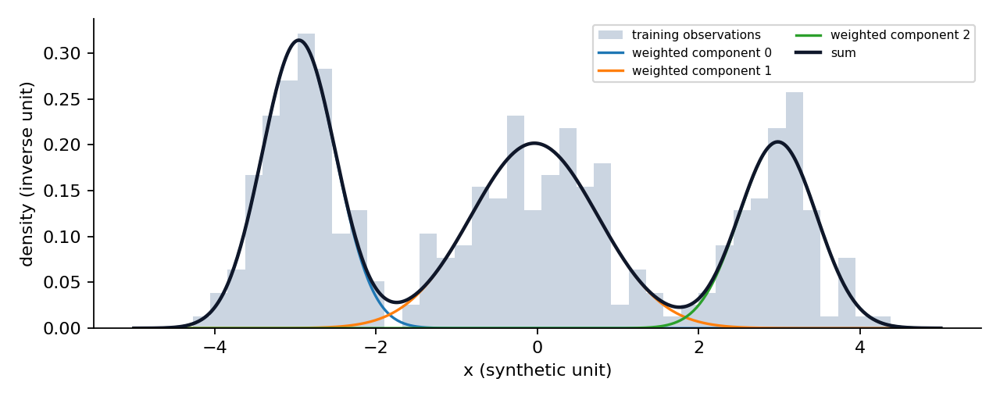
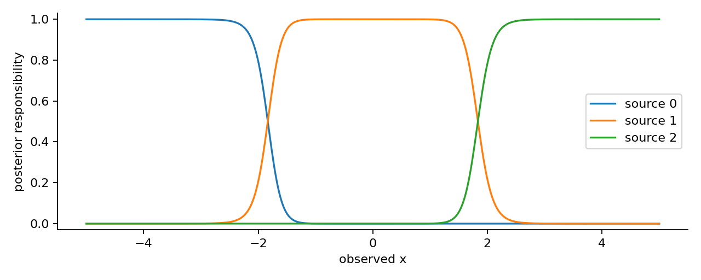
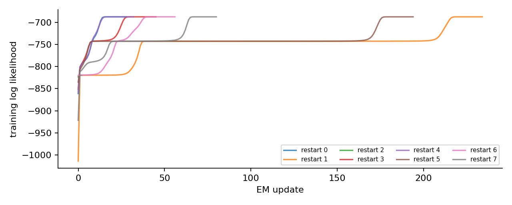

# 第074课 混合模型与EM算法

## 1 看见测量值，看不见来源

上一讲讨论怎样验证分组。本讲再往生成机制走一步：假设每个样本由某个来源产生，但来源编号没有被观察到，我们能否只根据测量值估计每个来源的分布？这不是先把点硬切开再拟合，而是允许同一个点对不同来源保留不同程度的不确定性。

设一家工厂的三台仪器测量同一种物理量。每台仪器有不同偏移和噪声，我们只拿到混在一起的读数，没有仪器编号。一个读数靠近第一台的典型输出，就更可能来自第一台；但两台仪器的输出有重叠，无法对每条记录确定无疑。这种“先选来源，再从来源分布抽值”的故事称为混合模型。

本课按大纲承接第016、019、021、023–024、071课，重新解释概率密度、条件概率、对数与期望。实验从一维Gaussian混合开始，便于手算；正文再给出多维协方差形式。全部数据为原创合成测量，无真实业务或个人字段。

> 蓝色重点：隐变量不是已经知道但故意遮住的答案。真实使用时，我们通常永远无法直接观测每点的来源，只能在模型假设下计算条件分布。

## 2 从生成故事写出联合分布

用x表示一个连续读数，z表示来源编号，取值1到K。每个来源的混合权重为 $\pi_k$，满足 $\pi_k>0$ 且 $\sum_k\pi_k=1$。先按这些概率抽来源z=k，再从均值 $\mu_k$、方差 $v_k$ 的正态分布抽x。

方差表示平方偏离均值的平均程度，单位是读数单位的平方。标准差是方差的平方根，才与读数同单位。一维正态密度为

$$\mathcal N(x\mid\mu,v)=\frac{1}{\sqrt{2\pi v}}\exp\left[-\frac{(x-\mu)^2}{2v}\right].$$

公式中的圆周率π与混合权重 $\pi_k$ 不是同一角色；带下标的是权重。密度不是单点概率。连续变量恰好等于某值的概率为0，区间概率由密度曲线面积给出；密度可以大于1，且其数值随单位改变。

联合分布将“选来源”和“在来源中抽值”相乘：

$$p(x,z=k\mid\theta)=\pi_k\mathcal N(x\mid\mu_k,v_k).$$

θ把全部权重、均值、方差打包为参数。我们没观察z，所以把可能来源加起来：

$$p(x\mid\theta)=\sum_{k=1}^K\pi_k\mathcal N(x\mid\mu_k,v_k).$$

一个混合分布不要求图上一定有K个峰。两个均值很近的成分可形成单峰；一个复杂分布也可能需要多个成分近似同一现象。“成分数”不能不经检验就解释为真实群体数。[1]

## 3 为什么直接求均值行不通

若来源已知，只需分别计算各组均值和方差。来源未知时，每个点究竟进入哪一组也要估计。但如果先凭猜测硬分组，边界附近的不确定性被丢掉，会影响下一轮参数。

独立样本 $x_1,\ldots,x_n$ 的观测对数似然为

$$\ell(\theta)=\sum_{i=1}^n\log\left[\sum_{k=1}^K\pi_k\mathcal N(x_i\mid\mu_k,v_k)\right].$$

独立性使联合密度相乘；对数把乘积变为和，避免很小的数相乘造成下溢。难点是“先求和，再取对数”，不同成分参数被绑在一起。不能将它擅自改成各成分对数之和，那会改变模型。

EM把问题拆成两个互相支持的步骤：给定当前参数，用每点来自各成分的概率作为软权重；给定这些软权重，再更新各成分的参数。E是expectation，即条件期望；M是maximization，即最大化。它不是两个神秘按钮，而是一条有目标依据的循环。

## 4 E步：每点如何分配责任

贝叶斯条件概率给出责任度：

$$r_{ik}=p(z_i=k\mid x_i,\theta^{(t)})=\frac{\pi_k^{(t)}\mathcal N(x_i\mid\mu_k^{(t)},v_k^{(t)})}{\sum_j\pi_j^{(t)}\mathcal N(x_i\mid\mu_j^{(t)},v_j^{(t)})}.$$

t表示当前迭代次数，i表示样本行，k表示成分列。r是n×K矩阵，每行非负且和为1。数值0.8表示在当前参数和生成假设下，该点属于某成分的后验概率，不是经过外部验证的分类准确率。

责任度同时受均值距离、方差与混合权重影响。离一个宽分布中心较近并不保证更高责任：宽分布把概率质量铺开，峰值也降低。更常见的来源拥有较大先验权重，但特别不符合它的读数仍可能归于少见来源。

实际程序先计算对数联合密度a，再用logsumexp计算 $\log\sum_k e^{a_k}$。实现可先减去最大a以避免指数上溢。最后取exp(a−归一化项)得到责任。极端读数即便普通密度都下溢为0，对数空间仍能给出有限对数似然。

## 5 M步：把软权重当作分数样本数

有效成分大小为 $N_k=\sum_i r_{ik}$，它可以不是整数。权重更新为 $\pi_k^{(t+1)}=N_k/n$，平均更新为

$$\mu_k^{(t+1)}=\frac{\sum_i r_{ik}x_i}{N_k},\qquad v_k^{(t+1)}=\frac{\sum_i r_{ik}(x_i-\mu_k^{(t+1)})^2}{N_k}.$$

权重较大的点更能拉动该成分的均值。方差围绕**新均值**计算；若误用旧均值，不再是同一个精确M步。分母是有效计数N_k，不是N_k−1，因为这里最大化似然而非构造无偏样本方差估计。

为什么加权均值是解？固定责任度后，与均值有关的目标等价于最小化 $\sum_i r_{ik}(x_i-\mu)^2$。对μ求导得到 $-2\sum_i r_{ik}(x_i-\mu)$，令其为零得到加权均值。即便暂不熟悉导数，也可像第071课一样做加权平方分解，非负的偏移项在加权均值处最小。

若某N_k数值上极接近0，直接除法会不稳定。本课显式报错并要求换初始化，不静默重设成分；重设虽然工程上常见，却不自动继承同一个似然不降证明。

## 6 三点手算一轮

取x=−1、0、1，初始两成分权重各0.5，均值−1和1，方差都为1。对x=−1，两成分除公共常数外的密度比例是1比exp(−2)，所以第一成分责任为 $1/(1+e^{-2})\approx0.880797$。中点x=0对两成分完全对称，各为0.5；x=1交换责任。

第一成分有效数为0.880797+0.5+0.119203=1.5；加权和为−0.880797+0+0.119203=−0.761594，因此新均值约−0.507729。第二成分对称为0.507729；两者新方差都约0.408877，新权重仍0.5。

观测对数似然从约−4.389254增加到−3.549215。负数变得“不那么负”仍然是增加。不能比较似然绝对值大小；如果误把负对数似然当似然，也会把正确更新说成下降。

这一轮的动态心智模型是：两边的点多数支持近成分，中点同时支持两边；中点把两个中心拉向内部；新的方差相应收紧。下一轮的责任又会改变，因而循环继续。EM没有把中点的来源确定下来，而是持续更新不确定性。

## 7 Jensen下界为何能支撑不下降

对任意正的分布q_i(k)，将每点似然改写为

$$\log p(x_i\mid\theta)=\log\sum_k q_i(k)\frac{p(x_i,z_i=k\mid\theta)}{q_i(k)}.$$

对数是凹函数：先取加权平均再取对数，不小于先取对数再加权平均。这就是Jensen不等式。相加得到下界

$$\mathcal F(q,\theta)=\sum_{i,k}q_i(k)\log p(x_i,z_i=k\mid\theta)-\sum_{i,k}q_i(k)\log q_i(k)\le\ell(\theta).$$

第二项是q的熵，衡量分布展开程度。约定0log0=0。更精确的等式为

$$\ell(\theta)=\mathcal F(q,\theta)+\sum_i\mathrm{KL}\big(q_i\Vert p(z_i\mid x_i,\theta)\big).$$

KL是两个分布之间的非负差异量，在二者相同时为0。E步把q设为旧参数的真实后验，使下界在旧参数处接触目标。M步固定q，选择使下界不降低的新参数。于是

$$\ell(\theta^{(t+1)})\ge\mathcal F(q^{(t)},\theta^{(t+1)})\ge\mathcal F(q^{(t)},\theta^{(t)})=\ell(\theta^{(t)}).$$

这条链清楚标出条件：E步准确计算旧后验；M步至少不降低同一可行域内的下界；目标定义不变；运算足够准确。近似E步、随意重置空成分、另加惩罚后仍检查原始目标，都不能无条件套用这条保证。[2]

## 8 从一维方差走向多维协方差

多维x是d个读数组成的列向量，均值μ也是d维。协方差矩阵Σ的对角线是各列方差，非对角项描述两列共同波动。正定性确保每个非零方向都有正方差，密度合法且可求逆。转置符号T把行与列交换；$\Sigma^{-1}$表示逆矩阵，在这里用于按协方差尺度校正距离；$|\Sigma|$是行列式，其平方根控制等密度椭球的体积尺度。多维Gaussian密度包含 $|\Sigma|^{-1/2}$ 和二次型 $(x-\mu)^T\Sigma^{-1}(x-\mu)$。

M步的协方差更新是

$$\Sigma_k^{(t+1)}=\frac1{N_k}\sum_i r_{ik}(x_i-\mu_k^{(t+1)})(x_i-\mu_k^{(t+1)})^T.$$

两个括号外积形成d×d矩阵。full协方差允许椭圆转动，diagonal只保留各轴方差，spherical让各方向方差相同，tied让不同成分共享协方差。这些是不同统计假设，不仅是加速开关。本课代码一维时full、diagonal、spherical都化成每成分一个方差；tied仍要求所有成分共享同一个方差，与本实现不同。因此不能声称实验已经比较多维协方差族。

K均值可以从相等、固定并趋近于0的球形方差与相等权重的混合模型极限理解：责任趋向最近中心的硬分配。一般EM不是“K均值加上概率字样”，因为权重、尺度和重叠都会改变分配与目标。

## 9 不下降不等于全局最优

似然曲线一直增加，最多告诉我们这条路径朝更好的目标值移动。非凸目标可有不同驻点；有些对称初始化会永远保留对称性。本课一个重启把三个初始均值全设为0，初始方差与权重也相同，因此E步对每个成分给相同责任，M步又给相同参数。三个成分一直重叠成同一个Gaussian。

训练对数似然约−687.092的解优于约−819.551的对称解，但有限次重启并不能证明已找到全局最优。训练目标选出best_run，再在另生成的audit数据上报告平均对数密度；不能依据audit结果选重启还把它叫未见最终评估。

成分标签也可以整体交换。若把每个成分的权重、均值、方差一起排列，观测密度完全一样。这是同一个解释的重命名，不是两种新科学发现。第075课会把这个现象推广到连续潜因子的旋转自由度。

## 10 方差塌缩与约束的真实含义

设一个成分均值恰好放在某个观测x_i，令其方差v趋近0，则该点密度按 $1/\sqrt v$ 增长。其他成分仍可给其余观测正密度，于是总对数似然可以无界增长。并非只要似然更高就更有意义。

![图4 三点[0,2,4]的两成分模型，其中一个均值固定在0并逐步缩小方差，另一个均值为3、方差1。训练似然沿塌缩路径持续增加；这不是对总体分布的合理恢复。](figures/04_collapse.png)

本课将一维方差限定为 $v_k\ge10^{-4}$。固定责任度与新均值后，无约束最优方差若小于下限，就取下限，即max(加权方差,下限)。这是一维固定可行域的精确约束M步，旧参数也满足同一约束，因此仍可用前面的不降链。它与任意“更新完统一加一个常数”不是同一个操作。

下限阻止无界塌缩，却引入尺度选择，也不保证成分有物理意义。改变单位要同步改变方差下限；若所有x乘10，方差量纲应乘100。真实应用可使用更明确的先验、惩罚或协方差结构，但此时须重新声明优化的是哪个目标。

## 11 实验与自测路线

先完成三点手算，再在Notebook运行责任度与M步。随后跑八次重启，检查每步真实似然差、终止条件、方差和权重。最后用固定塌缩路径解释为何实验采用约束。程序包含与scikit-learn独立实现的密度对照，不能把两份代码都不报错当成数学证明。

练习：推导中点责任为0.5的条件；说明加权方差为什么用新均值；写出Jensen不降链每个不等号的理由；解释对称初始化为何无法自行打破对称；构造标签交换并检验密度不变；说明方差下限改变后的声明边界。实验册给步骤，答案册给逐项推理。

## 来源与继续阅读

[1] [scikit-learn官方Gaussian混合文档](https://scikit-learn.org/stable/modules/mixture.html)，用于核对协方差选项、接口和奇异性风险。[2] [Dempster、Laird、Rubin（1977）原论文出版页](https://doi.org/10.1111/j.2517-6161.1977.tb01600.x)，EM的原始研究出处。本课三点推导、约束解释、数据与对照代码为原创教学实现。sources.md区分实际可读来源与仅元数据核验的出处。
