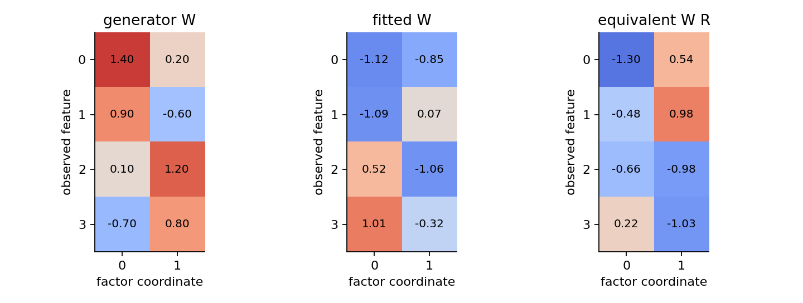
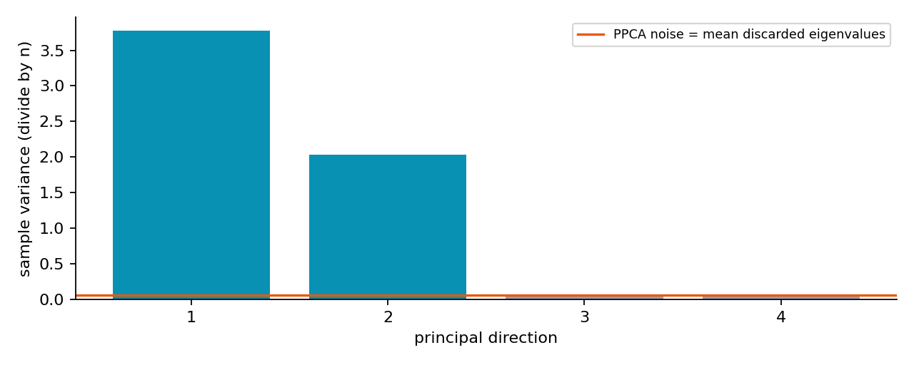
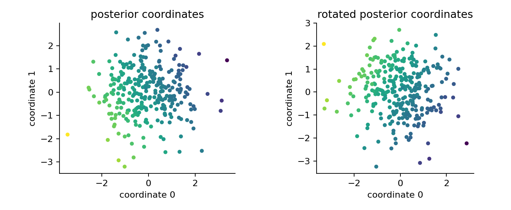
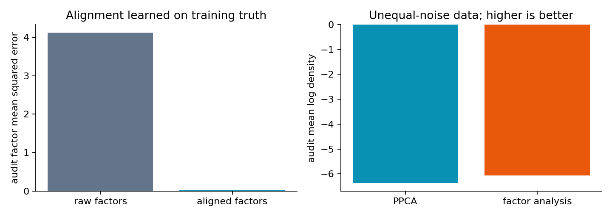

# 第075课 隐变量与可识别性

## 1 拟合很好，解释为什么仍可能不唯一

第074课的Gaussian混合允许来源标签整体交换：成分1与成分2一起重命名，观测密度不变。本讲把问题推进到连续的隐因素。一个模型能很好地重构数据，是否说明它找到了唯一、真实、可命名的因素？答案取决于数据与模型能否把不同参数区分开，而不只取决于误差大小。

想象四个传感器都受两个未直接观测的环境状态影响。我们希望从读数恢复两个共同变化方向。一个方向可能被命名为“温度效应”，另一个为“湿度效应”。但如果把两个方向旋转混合，再同步调整传感器载荷，所有可观察读数可能完全不变。此时仅凭这张表，模型没有依据决定哪一组坐标名称才是真实的。

本课承接第012、021、024、069、074课，重新定义矩阵形状、协方差、正交旋转、观测似然与后验均值。你不需要预先熟悉因子分析软件。我们先写生成过程，再亲手构造等价参数，最后检验哪些量可以恢复、哪些量需要额外假设。

> 蓝色重点：可识别性是“不同参数是否导致不同观测分布”的问题。优化成功、预测准确、样本很多，都不能自动消除模型本来就允许的等价解释。

## 2 线性隐因素的生成过程

一个对象的观测向量x有d个坐标，潜因子z有q个坐标，通常q<d。设

$$z\sim\mathcal N(0,I_q),\qquad x=\mu+Wz+\epsilon,\qquad \epsilon\sim\mathcal N(0,\Psi).$$

μ是d维平均读数，W是d×q的载荷矩阵，ε是d维测量噪声。I_q是q×q单位矩阵：对角为1，其余为0，表示每个潜因子方差为1、彼此不相关。在Gaussian假设下，不相关还意味着独立。z与ε也假设独立。

W第j行第k列表示第k个因子增加一单位时，第j个观测均值改变多少。它同时带着观测和潜因子的单位约定。式子Wz用每个因子值对一列载荷加权，再相加得到全部传感器信号。行不是因子，列不是样本；先写形状可避免转置错误。

本课d=4、q=2。数据中x0到x3是观测，z0与z1是生成器保存的审计真值。拟合程序只读取x列；真实z仅用于事后展示“对齐前后恢复误差”的区别。真实应用通常没有这样的额外真值，因此不能照搬它作验证捷径。

## 3 把看不见的z积掉之后看见什么

上标T表示转置，即交换矩阵的行与列；后面上标−1表示逆矩阵，在线性方程可唯一解时用来反向求解；代码会直接求解方程。因为z与噪声均值为0，观测均值是μ。协方差描述两个坐标一起偏高或偏低的平均程度。利用独立性和 $E[zz^T]=I_q$，得到

$$\operatorname{Cov}(x)=WI_qW^T+\Psi=WW^T+\Psi.$$

线性Gaussian模型的观测分布完全由均值与协方差决定：

$$x\sim\mathcal N(\mu,C),\qquad C=WW^T+\Psi.$$

这里“积分掉”不是把z当成0，而是把它所有可能值及概率都纳入，保留它导致的额外观测波动。若只代z=0，会错误地得到x=μ+ε，漏掉WW^T的共同结构。

当Ψ是对角矩阵、每个观测有自己的噪声方差时，这个模型是经典因子分析的形式；当 $\Psi=\sigma^2I_d$，各方向同方差，得到概率PCA（PPCA）。后者是更强的噪声假设，也因此有清楚的闭式解。[1][2]

## 4 用二维旋转制造一个等价模型

令R是q×q正交矩阵，满足 $RR^T=R^TR=I_q$。二维旋转一个角度θ的例子为

$$R=\begin{pmatrix}\cos\theta&-\sin\theta\\\sin\theta&\cos\theta\end{pmatrix}.$$

将载荷改为 $W'=WR$，则

$$W'W'^T=WRR^TW^T=WW^T.$$

因此μ、Ψ固定时，所有x的观测密度完全相同。若同步定义 $z'=R^Tz$，也有 $W'z'=WRR^Tz=Wz$，每个对象的无噪声信号不变。标准正态在正交旋转下分布保持，所以两种参数同属原来的模型族。

这不是“两个数恰好差不多”的数值现象，而是对任意观测数据成立的代数等价。收集更多相同类型的x也无法区分W与WR。如果先验或其他假设同样旋转对称，贝叶斯计算也不会凭空制造唯一方向。

## 5 尺度、符号、置换和旋转不是同一件事

将某列W乘−1，并将对应z乘−1，信号不变；交换两列并同步交换因子坐标也不变。二者都是正交变换的特例。任意角度旋转则把多个因素混合，比单纯重命名更深地影响语义。

尺度变换需额外留意先验。若将W的一列乘2、对应z除2，乘积仍相同，但原先标准正态z的方差由1变为1/4。**固定潜因子协方差为I时，任意缩放不是同模型内的自由变换。** 它之所以能保持观测分布，是在同时允许改变潜因子协方差时。

更一般地，设可逆矩阵A，令W'=WA，潜因子协方差改为 $A^{-1}A^{-T}$，则 $W'\operatorname{Cov}(z')W'^T=WW^T$。本课代码分别验证标准正态条件下的正交旋转，以及改变潜协方差后的尺度等价，避免把二者混称为同一种不识别。

## 6 PCA子空间与PPCA闭式解

将训练每列减去样本均值，组成中心化矩阵。样本协方差的极大似然形式是

$$S=\frac1n\sum_i(x_i-\bar x)(x_i-\bar x)^T.$$

这里分母n，而常见无偏协方差估计用n−1。本课讨论Gaussian似然最大化，采用n；与其他软件核对时必须确认这一约定。将S分解为正交特征方向U和特征值λ，按从大到小排序。λ_j是数据沿第j个主方向的方差。

给定q<d且残余方差为正，PPCA的极大似然解可写为

$$\hat\sigma^2=\frac1{d-q}\sum_{j=q+1}^d\lambda_j,\qquad \hat W=U_q(\Lambda_q-\hat\sigma^2I_q)^{1/2}R.$$

U_q保留前q个方向，Λ_q是它们特征值组成的对角矩阵，平方根逐个作用于对角元素；R是任意正交矩阵。式子可从Gaussian协方差似然理解：前q个方向的模型总方差匹配对应λ，剩余方向共享同一噪声方差，只能用它们的平均来拟合。[1]

为什么先减噪声再开平方？W列的平方长度贡献信号方差，加上σ²才是观测总方差。直接用sqrt(λ)会把噪声也当成潜信号。本课选择R=I作为一种计算约定，但这不是数据证实了唯一因素方向。

## 7 后验均值为何不是普通PCA分数

给定一个观测x，我们希望估计对应的z。Gaussian条件分布给出后验均值

$$E[z\mid x]=(W^TW+\sigma^2I_q)^{-1}W^T(x-\mu).$$

后验协方差是 $\sigma^2(W^TW+\sigma^2I_q)^{-1}$。这说明即使W已知，含噪读数也不能完全确定潜因子。代码用线性方程求解而非显式求逆，减少不必要的数值误差。

普通PCA分数是 $U_q^T(x-\mu)$，它只是几何投影的坐标；PPCA后验还根据噪声与载荷缩放。将后验均值乘W再加μ，得到无噪声信号的条件均值。对第j个主方向，重构因子是 $1-\sigma^2/\lambda_j$，比普通PCA的1更小，因此出现收缩。

收缩可能更适合估计无噪声信号，但不保证对已经含噪的同一观测有更低平方重构误差。PCA投影最小化固定q维子空间内的观测距离，PPCA优化概率分布，目标不同。看到PPCA重构误差略大，不能立即判定实现错误。

## 8 旋转会改变分数，不改变可观测预测

代码每行保存一个对象的潜因子分数，因此行向量约定下，W'=WR对应的分数变为Z'=ZR。列向量公式是z'=R^Tz；两者转置后完全一致。混淆这两个约定是常见转置错误。

本批实验旋转前后协方差最大差约4.44×10⁻¹⁶，重构最大差约1.33×10⁻¹⁵，对数密度最大差约1.24×10⁻¹⁴。这些是浮点误差级别，不是新的统计差异。我们也直接测试行分数的ZR关系，而不只看两张图外形相似。

若你对拟合W的第一列命名为“热量”、旋转后的第一列命名为“压力”，这两种解释无法靠相同的观测似然判决。需要额外测量、实验干预、领域约束或可辩护的先验。漂亮载荷热图不是语义验证。

## 9 恢复评价应该比较什么

直接把估计分数与真实z逐列相减，会把符号、顺序和旋转差异都算成错误。合成实验中可以在训练真值上拟合一个正交对齐R，再冻结它用于审计数据。Procrustes对齐选择使两个分数矩阵平方差最小的正交变换；它不会改变潜空间内的欧氏距离。

本课原始审计因子MSE约4.124，对齐后约0.02381。差异主要来自坐标约定，而不是前者完全没学到结构、后者突然恢复了机制。对齐用到了真实潜因子，所以它只是合成数据审计工具；现实数据没有z时不能执行同样验证。即便对齐后仍有误差，也是噪声与估计不确定性的自然结果。

另一个不受基变换影响的量是子空间投影矩阵 $P=QQ^T$，其中Q是W列空间的一组正交基。比较两个P的矩阵元素平方和再开方，可评价是否恢复同一子空间。实现用奇异值分解（SVD）按数值秩取基，避免秩亏时QR产生额外任意方向。零载荷矩阵的真实列空间是仅包含零向量的子空间，其投影矩阵应全零。

## 10 噪声假设改变后，因子分析为何可能更合适

PPCA假定每个观测的测量噪声相同。若第一个传感器很精确而第四个很嘈杂，模型可能把高噪声方向错当成共同信号。因子分析允许Ψ对角上各有独立方差，能表达不同观测可靠性，但参数更多，也有额外估计和可识别性问题。[2]

本课第二组数据仍由同一W生成，四列噪声标准差改为0.1、0.4、0.8、1.2。PPCA与因子分析各自在600个训练对象上拟合，再在300个独立审计对象上算平均对数密度。固定数据中，因子分析约−6.064，PPCA约−6.369，前者更高，符合其噪声模型更贴近生成器的预期。

但因子分析估计的各噪声方差并未精确等于真值。d=4、q=2的自由参数关系尤其提醒我们，良好密度不能自动保证唯一分解。只固定正交旋转自由度，并不解决所有因子分析中的额外不唯一。本课把这作为真实结果的限制，而不是隐藏估计误差。

## 11 约束能选择解释，未必证明解释

固定某个载荷为正可以消除符号自由度；规定三角形载荷结构可选择一种坐标规范；稀疏载荷可以鼓励较少交叉影响；非Gaussian独立性、已知锚点或干预数据也可能带来额外识别条件。但这些约束各有前提，不能把“我写进模型的命名方式”当成“数据独立发现的事实”。

区分两种用途：为了让每次运行结果容易比较，可采用明确的坐标约定；为了宣称一个因子对应某个机制，需要额外验证这个约定是否与真实世界一致。前者是报告与计算便利，后者是科学问题。即便约束使数值解唯一，它也可能唯一地得到一个错误机制。

下一讲开始学习概率图模型的语言。图能表达我们假设哪些变量直接依赖哪些变量，但图中一个隐节点同样不会因被画出来就自动具有唯一可验证语义。保持本讲的可识别性问题，能帮助你更谨慎地阅读后续模型。

## 12 自测路线与来源

完成以下练习后再看答案：证明WR保持协方差；区分固定标准正态先验与允许潜协方差变化时的尺度自由度；手算二维旋转；解释PPCA噪声为何取舍弃特征值平均；说明后验重构为何可能比PCA观测重构误差大；设计防止审计真值泄漏的对齐方案。

[1] [Tipping与Bishop的PPCA原论文页面](https://www.microsoft.com/en-us/research/publication/probabilistic-principal-component-analysis/)，用于核对PPCA与PCA的概率联系。[2] [scikit-learn官方FactorAnalysis文档](https://scikit-learn.org/stable/modules/generated/sklearn.decomposition.FactorAnalysis.html)，用于核对对角噪声、载荷形状与接口。数据、等价变换证明、恢复度量与对照实验均为原创教学内容；核验记录见sources.md。
