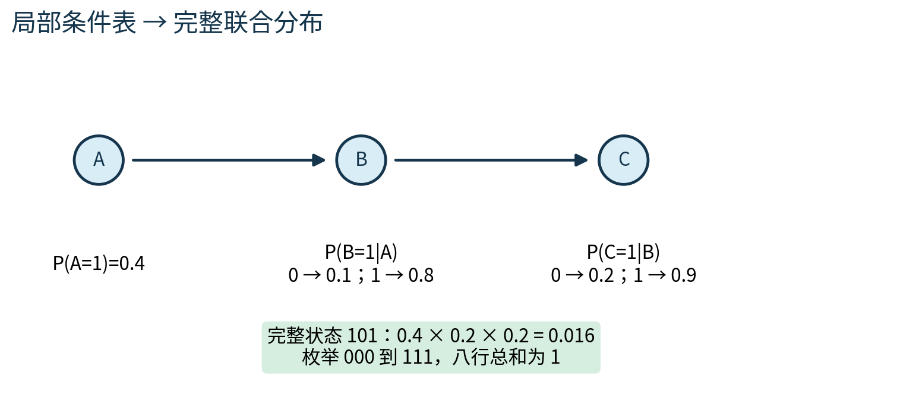
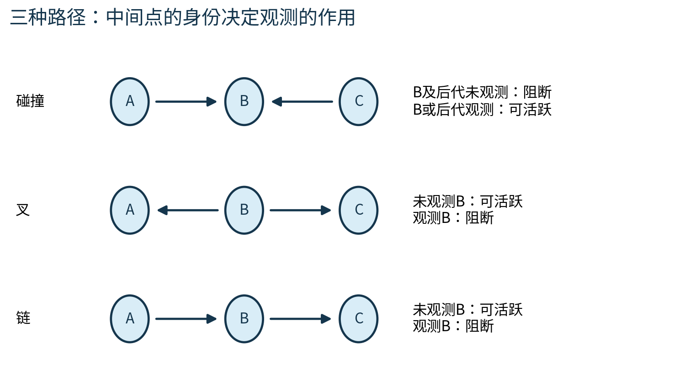
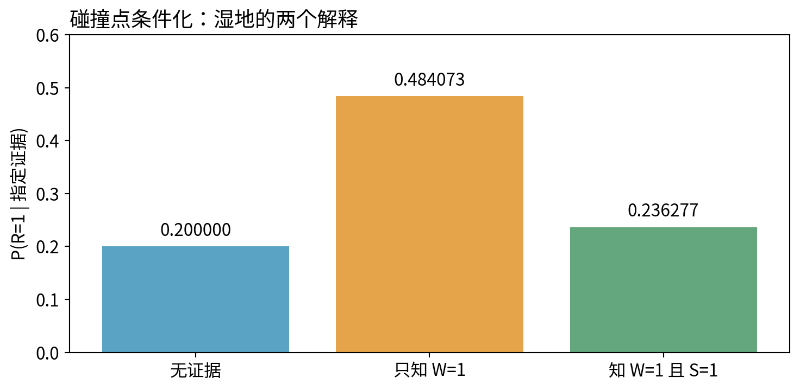
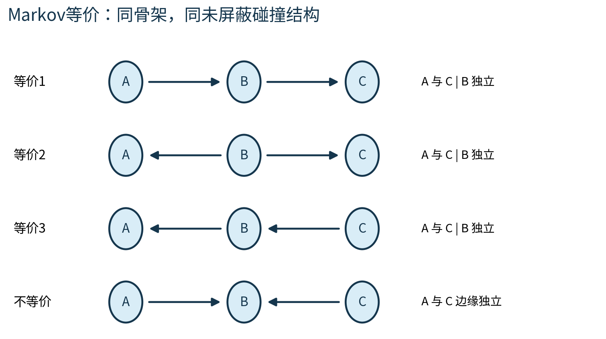
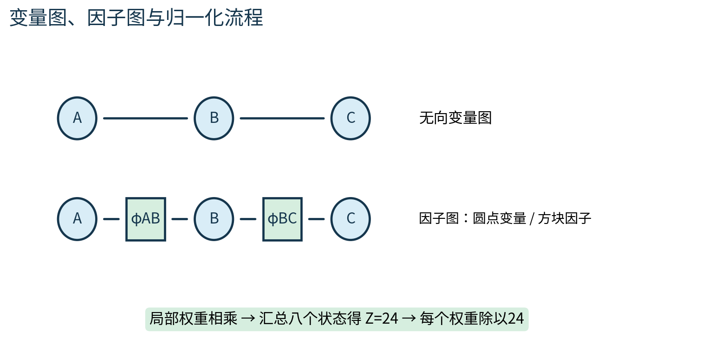

# 第076课 概率图模型的语言

本课主线：先写清“哪些状态、各占多少概率”，再用图压缩这张表。图是一组可检查的建模约束；箭头本身并不提供因果证据。

## 1 从八行表走向三个局部问题

前两讲讨论混合模型与隐变量。本课把“分布如何拆成小块”变成一套语言。直接先修按既定目录为第018至019、021、023至024课。即使暂时忘了概率公式，也可从以下二元例子重新开始；不需要矩阵运算或微积分。

设A表示人工设备是否处于高负荷，B表示是否发热，C表示告警是否亮。每个变量只取0或1：0表示否，1表示是。大写字母指尚未知晓的变量，小写a、b、c指某次具体取值。一次完整状态如(A=1,B=0,C=1)是一种可能世界。联合概率P(A=a,B=b,C=c)给这整个世界分配非负数；八种世界的概率必须加为1。

这不是八条实际观测记录，而是模型对八种可能性的完整列举。若有n个二元变量，完整表有2的n次方行，扣除总和为1的限制后有2的n次方减1个自由数。十个变量就有1024行。我们希望利用合理的独立假设减少填写量，同时保留可回答联合问题的能力。

先约定P(A=1)=0.4；P(B=1|A=0)=0.1，P(B=1|A=1)=0.8；P(C=1|B=0)=0.2，P(C=1|B=1)=0.9。竖线“|”读作“在已知……时”。这些数是原创教学参数，不是设备可靠性调查。

## 2 DAG把链式法则中的条件缩短

DAG是directed acyclic graph的缩写，中文为有向无环图。点代表变量；箭头的起点是终点的父节点；沿箭头走不能回到出发点。父节点可有多个。祖先是沿箭头走若干步能够到达该点的节点，父节点只是距离一步的祖先，二者不能混用。

概率链式法则总允许写成P(A,B,C)=P(A)P(B|A)P(C|A,B)。A→B→C额外假设：给定B以后，再知道A不会改变C的分布，即P(C|A,B)=P(C|B)。因此

$$P(A,B,C)=P(A)P(B\mid A)P(C\mid B).$$

一般形式是对每个变量取“本变量给定其父节点”的条件概率，然后全部相乘。[1] 条件概率表简称CPD或CPT；本课只存P(变量=1)，P(变量=0)由1减去该数得到。父状态不同，必须分别填行；每一行的两个状态概率之和是1，不是整张条件表之和为1。

例如(A=1,B=0,C=1)的概率为0.4×(1-0.8)×0.2=0.016。(A=0,B=1,C=1)的概率为0.6×0.1×0.9=0.054。按八种状态逐个乘，最后总和为1。为何不需要额外归一化？先对末端C求和，P(C=0|B)+P(C=1|B)=1；再对B求和，最后对A求和，每一步都得到1。无环性使这种从末端往前的删除可以完成。

若在A→B→A这样的环上随便相乘两张条件表，不会自动得到总和为1的联合分布。并非任何画着箭头的图都能直接套贝叶斯网络公式。

生成一个模拟样本时，可以先抽A，再按A所在行抽B，最后按B所在行抽C。这是模型定义的一种生成顺序；能这样生成并不意味着现实设备的干预机制已被证明。观察分布的分解方向与现实因果方向是不同层面的主张。

## 3 什么才叫条件独立

A与C在给定B后条件独立，记作A ⟂ C | B，意思是：对每个概率大于0的B取值，在该小群体内部，知道A不会再改变C的概率。等价地，P(A,C|B)=P(A|B)P(C|B)。概率为0的条件事件不能直接拿来作除数。

本例P(B=1)=0.4×0.8+0.6×0.1=0.38。P(C=1)=0.38×0.9+0.62×0.2=0.466；P(A=1,C=1)=0.4×(0.8×0.9+0.2×0.2)=0.304。0.304不等于0.4×0.466=0.1864，所以A和C边缘上并不独立。缺少A与C的直接边，并不允许把它们当成完全无关。

## 4 三种局部结构改变信息能否通过

把路径看成一条“证据能否改变另一端判断”的通道，是有用的动态心智模型。它不表示真的有某种粒子在边上流动。路径先忽略箭头朝向寻找，随后再用箭头判断每个中间点属于哪种结构。

链A→B→C中，未观测B时通道可活跃；观测B后被阻断。叉形A←B→C中，B是共同父节点，未观测时两端可能一起随B改变；固定B后，这种共同变化来源被控制。这里的“可能”很关键：某些特殊参数可使两端本来就独立，图不会强制每条允许的关联都非零。

碰撞形A→B←C恰好相反：两支箭头撞向中间的B。B未被观测且其后代也未被观测时，这条路径阻断；观测B或其任一后代后，路径可以活跃。碰撞点是相对于当前路径的身份，同一个节点在另一条路径上可能不是碰撞点。

为什么碰撞结构这么特别？假设R是下雨、S是洒水器开启、W是地面湿。模型先让R与S独立，再由两者一起决定W。没看地面时，知道洒水器开启不改变雨的先验概率。但已经知道地面湿时，洒水器提供了一个解释，于是雨所需承担的解释份额可能下降，这称为解释消除。它来自对同一结果作条件化，而不是两种原因发生了物理对抗。

初学者常问：多知道一点信息怎么会制造相关？因为条件化会重新挑选所讨论的世界。只保留“地面湿”的世界后，原来独立的两个解释在被保留的世界里可能互相补偿。

## 5 八行湿地模型给出可核验的解释消除

现在设P(R=1)=0.2，P(S=1)=0.3。W=1的条件概率如下。表中00、01、10、11均按(R,S)顺序，不按代码里边的书写顺序。

| R | S | P(W=1 \| R,S) | 解释 |
|---:|---:|---:|---|
| 0 | 0 | 0.01 | 两者都没有时仍有少量其他湿地来源 |
| 0 | 1 | 0.80 | 只有洒水器时通常湿 |
| 1 | 0 | 0.90 | 只有雨时通常湿 |
| 1 | 1 | 0.99 | 两者都存在时几乎总湿 |

四种(R,S)先验概率依次为0.56、0.24、0.14、0.06。与最后一列的湿地概率相乘，得到0.0056、0.192、0.126、0.0594。因此P(W=1)=0.383。雨且湿的概率为0.126+0.0594=0.1854，故P(R=1|W=1)=0.1854/0.383，约0.484073。

再知道S=1时，只留下(R,S)为(0,1)或(1,1)的湿世界；雨的后验变成0.0594/(0.192+0.0594)，约0.236277。它低于只知道湿时的0.484073，但仍高于原先0.2，不能笼统说“洒水器完全排除了下雨”。不同参数也可能产生其他数值模式，本例只是一个严格计算的机制示范。

## 6 d-separation是一套路径检验规则

d-separation译作d分离。给定证据集合Z，如果X与Y之间每条路径都被阻断，就称X、Y被Z d分离。检查一条路径时，逐个看中间点：非碰撞点只要在Z中就阻断；碰撞点只有自己或后代在Z中才允许通过。路径必须每个中间点都允许通过才活跃。只有一条活跃路径也足以让“已被d分离”的结论失败。[1]

例如R→W←S，另有W→D，D表示湿度传感器报警。只观测D也可能打开R与S之间经W的路径。反之，在A→B→D以及A→C→D组成的菱形里，只观测B不能阻断经C的另一条路径；必须同时观测B与C，才能阻断这两条通道。实验专门覆盖这两种易漏情况。

## 7 图保证的独立与参数巧合不同

若一个分布按照DAG分解，那么图上d分离得出的独立关系在这个分布里成立。但是“不被d分离”只意味着图不保证独立，不能直接断言实际数表一定相关。考虑A→B，却令P(B=1|A=0)=P(B=1|A=1)=0.3。此时箭头存在，B的数值分布却根本不随A变化，A与B依然独立。

如果一个分布除图保证的独立外没有额外独立，称它对该图忠实。忠实性是额外性质，不能从“这是DAG”自动得到。实验把数值独立残差与d分离分别计算：残差检查具体参数，路径规则检查整类分布的结构保证。两者应当有这样的方向关系，而非被强行做成完全相同。

## 8 Markov等价为什么挡住因果方向识别

A→B→C、A←B→C和A←B←C都有同一无向骨架A-B-C，并且没有未屏蔽碰撞结构。未屏蔽指碰撞点的两个父节点之间没有直接边。DAG的Markov等价判据是骨架相同且未屏蔽碰撞结构相同；等价图蕴含相同的d分离关系。[1]

如何用同一个联合分布写出反向链？先从原表算P(C)，再算P(B|C)，最后算P(A|B)。例如P(A=1|B=1)=0.32/0.38，约0.842105；P(A=1|B=0)=0.08/0.62，约0.129032。将这些重新计算的条件表代入P(C)P(B|C)P(A|B)，可以逐行重建原来八行联合表。代码得到最大误差约5.55乘10的负17次方，是浮点舍入级差异。

如果只是把箭头反过来，却继续使用原来的条件数表，通常不会得到同一个分布。图结构与参数必须配套。两个图也不因为Markov等价就表达相同干预结论；本课没有引入足以从观测数据识别因果的额外假设。

“图上A指向B，所以操纵A一定改变B”超出了本课概率模型的证据。要作因果主张，还需明确干预语义、遗漏变量和研究设计等条件。

## 9 无向图先给兼容分数，再统一归一化

某些问题更容易用“哪些状态彼此相容”描述。无向链A-B-C不规定生成方向，而给两个局部非负势函数。势函数φ读作phi，输入相关变量的状态，输出一个权重；它不要求每行加为1，也不必须小于1。[2]

本例φAB在A=B时取3，否则取1；φBC在B=C时取2，否则取1。完整状态的未归一化权重为φAB(a,b)φBC(b,c)。000的权重是6，001是3，010是1，011是2，100是2，101是1，110是3，111是6。八个权重加起来是24。因此

$$P(a,b,c)=\frac{\phi_{AB}(a,b)\phi_{BC}(b,c)}{Z},\qquad Z=24.$$

Z叫归一化常数或配分函数。它对本次固定参数的所有状态相同，但参数改变时通常也改变。000的概率是6/24=0.25；权重6本身不能报告为概率600%。如果所有状态权重都为0，Z=0，便无法定义概率分布。

无向图中的团，是任意两点都相连的节点集合。一般可对团设置非负因子，再将乘积除以Z。因子不一定全是两两关系；三元因子可能无法分拆成三张二元表。图只是变量节点时，三角形也未说明具体用了哪几张因子，因子图能把这件事显式画出来。

因子图有两类节点：圆点是变量，方块是因子。变量只与包含自己的因子相连，不直接连另一个变量。它可以表示DAG的条件表乘积，也可以表示无向模型的势函数乘积。因此“因子图”描述分解形式，不自动等于某种因果模型。

## 10 无向分离、Markov性质与正性边界

在无向图中，若删除证据节点集合Z后，X与Y之间再没有路径，则Z将两者分离；相应的因子化分布满足X ⟂ Y | Z。链A-B-C里固定B后，剩余关于A和C的权重分别来自φAB和φBC，条件归一化常数也可拆成两边和的乘积，所以二者条件独立。

具体取B=0，A=0与1的权重比是3:1，因此P(A=0|B=0)=3/4；C=0与1的权重比是2:1，因此P(C=0|B=0)=2/3。联合条件概率P(A=0,C=0|B=0)=6/(6+3+2+1)=1/2，恰好等于(3/4)×(2/3)。注意分母12只汇总B=0的四行，而不是原来的24。

无向图的局部Markov性质说，给定某节点的所有邻居，该节点与图中其余节点条件独立。成对Markov性质说，不相邻的两点在给定其他全部节点后独立。全局Markov性质说，任何由集合Z分开的两个节点集合都条件独立。它们的条件集合不可省略。

对严格正的离散分布，即每个完整状态概率都大于0，标准等价结果将这些Markov条件和按团因子化联系起来。若分布含零，不能毫无条件地套用“成对独立就必可因子化”的反向推论。当前模型的所有势都正，因此没有零支持集的复杂性；后续遇到硬约束时需要重新审查。[2]

DAG检查碰撞点和后代；无向图检查删去证据后的连通性。两套规则有不同前提，不能把有向图箭头擦掉就直接按无向规则推全部独立关系。

## 11 软件怎样让定义落地

`joint_from_bn`逐行枚举状态，再读取每个节点的条件概率相乘。`probability`按事件过滤完整状态求和。`ci_residual`在每个正概率条件层检查P(x,y|z)与P(x|z)P(y|z)的最大差值。最大差接近0是这张有限表的数值证据，不是来自有限样本的统计显著性检验。

`d_separated`枚举简单路径，使用证据的祖先集合判定碰撞点是否打开。此实现适合四五个节点教学，路径数在大图上可迅速增长；它没有宣称线性时间。`equivalence_signature`用骨架和未屏蔽碰撞三元组比较等价。新参数可导致额外独立，但不会改写图的结构签名。

## 12 练习、研究边界与下一步

完成lab前，先用纸笔完成以下题；answers提供逐步推导。

1. 写出P(A=1,B=1,C=0)，再算P(B=1)，解释为何两者不是同一种查询。
2. 在A→B→C中，证明给定B时A与C独立，并指出哪些条件层不能直接除。
3. 重新计算湿地模型中的P(R=1|W=1,S=0)。与已知S=1对照，解释变化。
4. R→W←S且W→D，只观测D时R与S是否被d分离？为什么不能只查看W是否观测？
5. 将链A→B→C改成A←B→C。应保留什么，重新计算什么，才能保持同一联合分布？
6. 对无向链计算P(A=1,C=1|B=1)。若把φAB全部乘10，分布会改变吗？
7. 图上有边但数值仍独立的反例，推翻了哪一个错误逆命题？
8. 若只给一张三元因子ψ(A,B,C)，如何画因子图？能否未经证明替换成三张两两因子？

本课建立的是可检查的分布表示。它没有从数据学习图，没有评估预测性能，也没有验证真实设备或天气机制。我们刻意使用小型人工表，使每个声明都能穷举核验。实际建模时应记录变量含义、状态定义、数据生成时序、局部表来源、独立假设以及零概率约束；图画得简洁不等于假设正确。

下一课第077课沿既定目录讨论精确概率推断：图和参数已经给定时，如何把大量重复乘加变成局部消元和消息传递。

## 参考与阅读说明

[1] Stanford CS228课程笔记，[Bayesian networks](https://ermongroup.github.io/cs228-notes/representation/directed/)，用于核对分解、d-separation与Markov等价定义。本课特别使用“图允许依赖”而非“图必然导致依赖”的表述，并区分父节点与全部祖先。

[2] Stanford CS228课程笔记，[Markov random fields](https://ermongroup.github.io/cs228-notes/representation/undirected/)，用于核对势函数、配分函数与图分离。正文例子、表格、图与代码为本课程原创。
