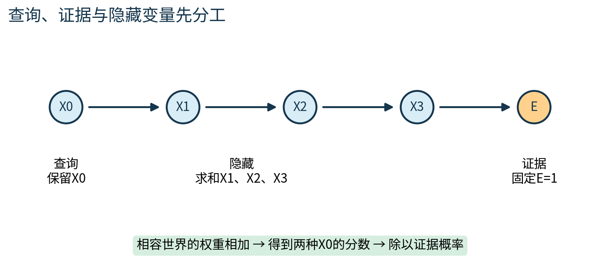
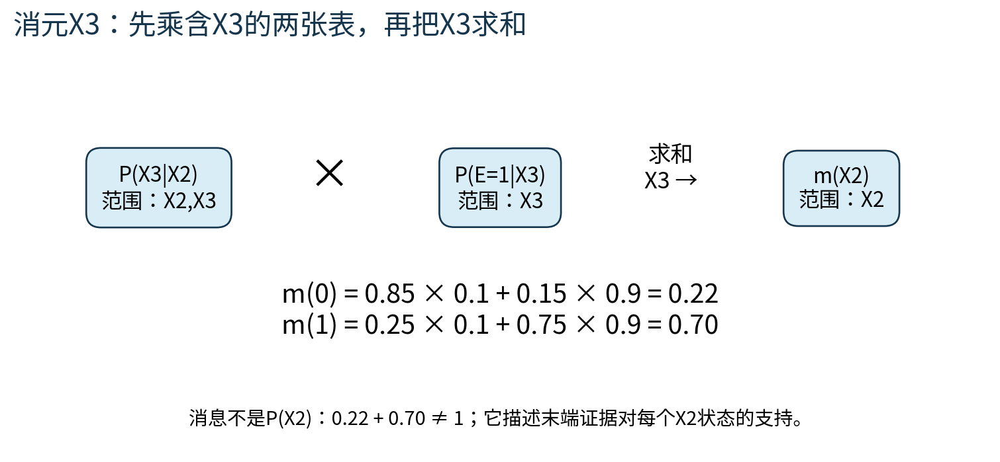
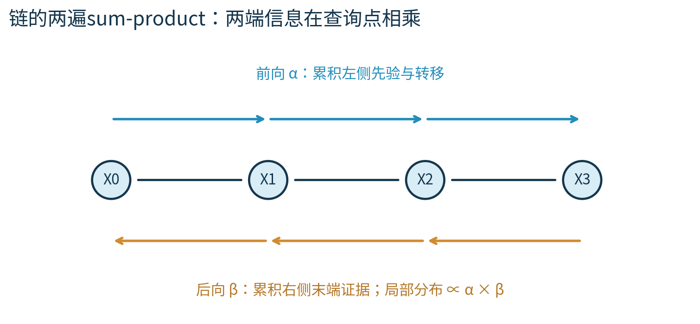
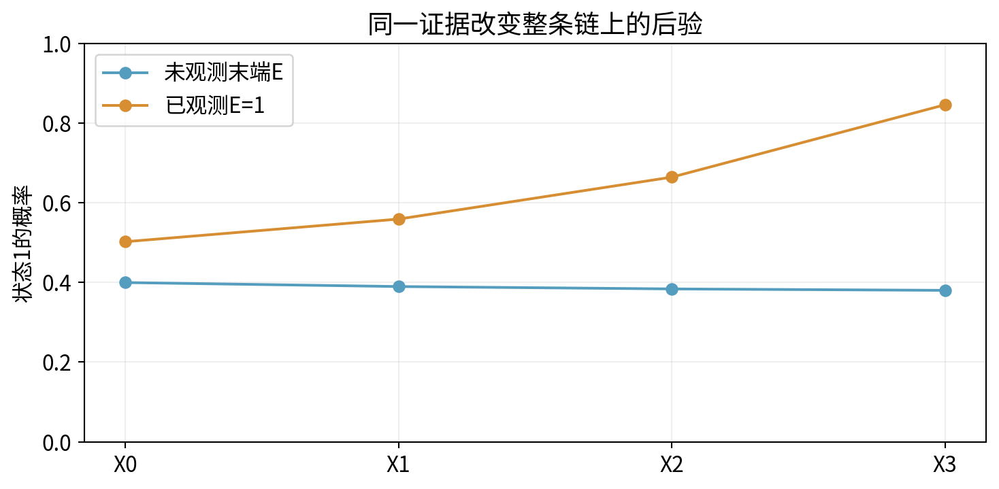
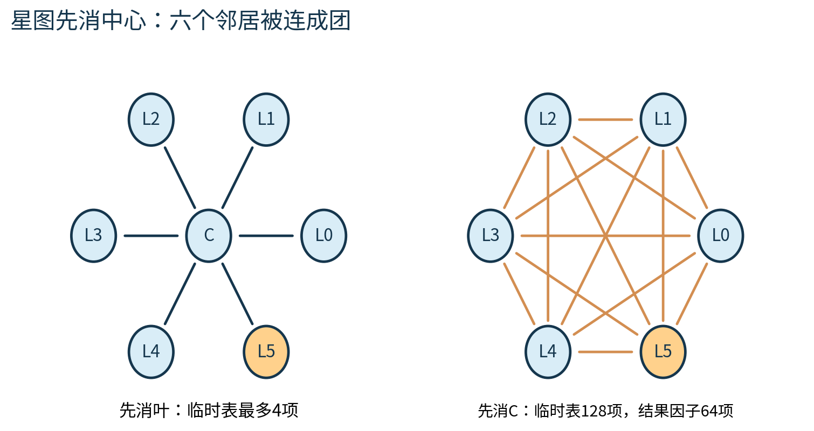

# 第077课 精确概率推断

<div class="callout">本课主线：图与参数已经给定。先定义要保留、要固定、要求和的变量，再把同一批乘加按更省空间的顺序完成。精确指数学目标不变，浮点运算仍有舍入误差。</div>

## 1 从“表示分布”走到“回答问题”

第076课学会把联合分布拆成局部因子。本课按既定大纲承接第019、021、076课，讨论给定一部分观测后，如何计算其余变量的边缘与后验。推断与学习先分开：推断使用已给定参数回答未知状态的问题；参数学习使用数据调整参数。这里不拟合模型，不用测试集调参，不把算出的后验当成现实设备已经验证过的风险。

延续人工设备的例子，X0、X1、X2、X3表示连续四个时刻的状态，每个只取0低负荷、1高负荷。E是末端指示器，0表示灭，1表示亮。下标0到3只是时间位置，没有实际秒数单位。我们观测E=1，想知道初始状态X0=1的概率，以及其余三个状态的后验。

模型为X0→X1→X2→X3→E。查询变量是最后要保留并报告分布的变量，例如X0；证据变量已观测，必须固定，例如E=1；隐藏变量在这次查询中既未观测也不打算报告，必须对其所有状态求和，例如X1、X2、X3。隐藏在这里是查询角色，不意味着永远不可测。



<div class="page-break"></div>

## 2 把概率参数逐格读清楚

先验P(X0=0)=0.6、P(X0=1)=0.4。每个相邻时刻使用同一转移表T；行是前一时刻状态，列是后一时刻状态。这里“转移”是模型定义的条件概率，不要求读者已会矩阵乘法。

| 前一状态 | 后一状态0 | 后一状态1 | 行和 |
|---:|---:|---:|---:|
| 0 | 0.85 | 0.15 | 1 |
| 1 | 0.25 | 0.75 | 1 |

末端P(E=1|X3=0)=0.1、P(E=1|X3=1)=0.9。它们属于不同条件行，不需要加为1。每行的另一个E状态由1减去该行数得到。给定末端证据后的两个数[0.1,0.9]是关于X3的似然：不同X3状态对同一证据E=1的支持程度。即使这两个数碰巧和为1，也不能因此称它们为X3的后验。

完整联合概率为

$$P(x_0,x_1,x_2,x_3,e)=P(x_0)\prod_{i=1}^{3}T(x_{i-1},x_i)P(e\mid x_3).$$

乘积符号Π读作“把i=1、2、3对应的三项全部相乘”。例如全部状态为1且E=1时，概率为0.4×0.75×0.75×0.75×0.9=0.151875。一次完整世界包含五个二元值，所以完整表有32行；固定E=1后，留下16行相容世界。

## 3 穷举是可信的起点

先把X0=0的八个相容世界权重相加，得到q(0)；把X0=1的另外八个相容世界相加，得到q(1)。q不是归一化后验，它等于P(X0=x0,E=1)。两者之和是P(E=1)，后验则是q(x0)除以这个共同分母。

本课穷举结果为q(0)=0.20112，q(1)=0.2032，总和0.40432。因此P(X0=1|E=1)=0.2032/0.40432，约0.502572220。这条初始高负荷后验高于先验0.4，但远低于末端高负荷后验，因为中间多次转移削弱了末端证据对早期状态的约束。

穷举能清楚反映定义，也便于发现错误。然而n个二元未知状态有2的n次方个组合。即使局部表很小，重复枚举仍会为大量世界反复计算相同子表达式。下一步的目标是复用这些重复计算，而不是换一个近似目标。[1]

<div class="page-break"></div>

## 4 变量消元来自小学分配律

分配律a×b+a×c=a×(b+c)是变量消元的代数基础。若某个因子不含正在求和的变量，就能移到该求和符号之外。固定E=1后，先消X3，把它涉及的两张表相乘再求和：

$$m_3(x_2)=\sum_{x_3\in\{0,1\}}T(x_2,x_3)P(E=1\mid x_3).$$

Σ读作“对所有列出的状态相加”。m3不是新随机变量，而是一张只剩X2的两行数表。对于X2=0，两个分支是0.85×0.1和0.15×0.9，所以m3(0)=0.22；对于X2=1，得到0.25×0.1+0.75×0.9=0.70。



接着消X2：m2(0)=0.85×0.22+0.15×0.70=0.292；m2(1)=0.25×0.22+0.75×0.70=0.58。最后消X1：m1(0)=0.85×0.292+0.15×0.58=0.3352；m1(1)=0.25×0.292+0.75×0.58=0.508。乘先验得到q(0)=0.6×0.3352=0.20112，q(1)=0.4×0.508=0.2032，与穷举完全相同。

<div class="warning">必须先将所有含当前变量的因子相乘，再对该变量求和。一般来说，(Σx f(x))(Σx g(x))不等于Σx f(x)g(x)。提前把两张表分别求和，会错误组合不同x对应的分支。</div>

<div class="page-break"></div>

## 5 因子的范围比数组外形更重要

因子是把一组状态映射为非负数的函数；范围scope列出它依赖哪些变量。T(X2,X3)的范围是(X2,X3)，固定证据后的末端似然范围是(X3)，消去X3后得到m3(X2)。一个空范围因子是常数，仍可能保存证据质量或归一化常数，不能随便丢掉。

两张表的“第0轴”可能代表不同变量。例如f的范围是(A,B)，g的范围是(B,A)，它们相乘时必须按变量名对齐。f(1,0)应乘g(0,1)，而不是机械乘同一坐标的g(1,0)。本课用字典实现，每个键按scope顺序存0/1元组；乘法通过变量名读取，速度不追求最快，但每一步都能手审。

一次变量消元按以下循环执行。先收集所有含待消变量V的因子，叫作V的桶；桶外因子完全不动。将桶中因子相乘，得到临时联合范围；对V两种状态求和，产生范围更小的新因子；把它放回工作列表。最后只剩查询变量与常数因子，全部相乘并归一化。

```python
bucket = [f for f in work if variable in f.scope]  # 收集确实含V的局部表。
combined = multiply(bucket)  # 按变量名对齐，把这些表相乘。
reduced = sum_out(combined, variable)  # 只对V求和，保留其余轴。
work.append(reduced)  # 用新表总结V，不再展开它的历史状态。
```

完整函数还会先移除桶中旧表，验证消元顺序刚好覆盖所有隐藏变量，并拒绝未知查询、非法证据和重复变量。这里摘出四行只为显示主因果过程，不能直接替代完整函数。`eliminate`返回后验、未归一化质量和trace；trace记录每步临时范围与条目数。

默认按变量名排序只是确定性教学约定，并非聪明的优化算法。查询X0时，默认顺序X1、X2、X3会短暂形成三个变量的表；手工顺序X3、X2、X1最多只需两变量表。两者答案相同，但空间不同。`order`参数允许显式比较；不能根据变量名排序就声称选到了最优顺序。

<div class="callout">何时归一化？本实现保留原始质量，最后一次归一化，所以能报告P(E=1)。若中途把每张消息都归一化，后验可以保持正确，但必须累计被除去的尺度才能恢复证据概率。</div>

<div class="page-break"></div>

## 6 sum-product把消元结果当作可复用消息

链是一棵树。树上任意两点只有一条路径，因此从一个方向汇来的消息可以总结那一侧的全部信息，而不会从另一条回路把同一证据重复算进来。sum-product中文为和积算法；“积”把独立分解的局部因子组合，“和”消去不再报告的变量。[2]

本课前向量αi(xi)表示在尚未加入末端证据时，第i个状态的边缘概率。α0=[0.6,0.4]；随后每次把上一状态的两种分支相加：

$$\alpha_i(x_i)=\sum_{x_{i-1}}\alpha_{i-1}(x_{i-1})T(x_{i-1},x_i).$$

例如α1(1)=0.6×0.15+0.4×0.75=0.39，α1(0)=0.61。再前进两步得到α2=[0.616,0.384]、α3=[0.6196,0.3804]。由于本例只有末端一个观测，这些前向量恰好归一化；在更一般的逐时观测模型中，未缩放前向量通常不是每步和为1。

后向量βi(xi)表示给定当前状态时，右侧末端证据E=1的概率。β3=[0.1,0.9]；往左递推βi(xi)=Σxi+1 T(xi,xi+1)βi+1(xi+1)。第4节的m3、m2、m1正是β2、β1、β0，数值分别为[0.22,0.70]、[0.292,0.58]、[0.3352,0.508]。



<div class="page-break"></div>

## 7 在每个查询点组合两侧信息

前向量已经汇总当前点左侧的状态与先验；后向量已经汇总当前点右侧的证据。两者相乘给出P(Xi=xi,E=1)。因此对每个i都有

$$P(X_i=x_i\mid E=1)=\frac{\alpha_i(x_i)\beta_i(x_i)}{\sum_{x_i}\alpha_i(x_i)\beta_i(x_i)}.$$

分母在本课未缩放实现中应对所有位置相同，都是0.40432。对于X2=1，分子为0.384×0.70=0.2688，除以0.40432得0.664819945。对于X3=1，分子为0.3804×0.9=0.34236，后验约0.846755046。



为什么不把X0的消元过程完整重复四次？可以，但会重复计算大量相同子问题。前向和后向各跑一遍，就能用每个点两侧的缓存消息得到整条链所有边缘。若n个节点各有k种状态，链上每步需要枚举k×k种转移，整体约O(nk²)乘加。本课k=2，记录全部前后向向量需O(nk)空间；只求单个末端边缘时可只保留当前向量。

树上的一般消息表达也遵守相同原则：变量到因子的消息，是其他相邻因子发来消息的乘积；因子到变量的消息，是局部因子乘其余变量来信，再对其余变量求和。空乘积定义为1，对应尚无其他证据的叶子。消息的接收者不能立即被当作发送者自己的输入，否则会把刚收到的同一份信息原路重复记账。

本实验`chain_sum_product`是链特例，独立写出前后向递推，不调用变量消元作为捷径。它与穷举、消元三方对照，才有机会发现三种实现之间的错误，而不是同一函数换三个名字互相验证。

<div class="page-break"></div>

## 8 消元顺序、填边与树宽

看一张星图：中心C连接六个叶子L0至L5，查询L5。中心先验[0.6,0.4]，每条边在中心与叶同态时给权重3、异态时给权重1。它是无向势模型，边势每行和为4，并非概率转移表。

先消L0至L4时，每一步只把一张(C,Li)表折叠为关于C的表，临时最多4项。最后消C，仍只用(C,L5)四项。若先消C，就要把C和六个叶子同时保留在乘积中，临时范围有7个二元变量，含128项；求和C以后剩六个叶子的64项因子。后续逐个叶子消元，再慢慢缩小。



消元时把当前变量尚未消去的邻居相互连接，这些新增连接叫填边。给定顺序的诱导宽度w，是各步仍存活邻居数的最大值；临时乘积最多涉及w+1个变量。对每变量最多k个状态的普通稠密表运算，主要代价随k的w+1次方增长，还要乘图规模及实现相关因子。这里测的是表条目数，不是完整程序实际内存字节或精确运行时间。[1]

图的树宽是所有消元顺序诱导宽度的最小值。因此这张树的树宽为1，先消叶的顺序宽度也是1；先消中心的坏顺序宽度为6，但不能因此把原星图的树宽写成6。查询变量保留到最后、证据先固定，均会影响本次具体的消元规模。

两个顺序都得到P(L5=1)=0.45，Z=4096。答案一致并不代表成本相同；变量个数相同也不代表任何图结构的代价相同。链和稠密团在消元时产生的最大范围可能完全不同。

<div class="page-break"></div>

## 9 精确算法也有清楚的使用边界

树上和积消息两遍完成是精确推断。一般有环因子图直接反复传同样的局部消息，称为loopy belief propagation；它可能不收敛，即使收敛也不保证精确。把有环图变为团树可恢复一种精确计算组织，但较大的团会带来指数增长。这里介绍这个边界，不把链实现冒充通用有环精确消息引擎。[2]

如果证据概率为0，后验的分母就是0，本实现明确报错。若模型给证据极小但非零概率，长串浮点乘积可能下溢为0；本课短链未缩放实现不解决所有此类数值问题。长链需逐步缩放并记录尺度，或转到对数域，用稳定的log-sum-exp求和。把非常小的概率简单替换为任意固定值，会改变模型，不能仍称原模型的精确推断。

相同道理，近似采样误差、模型错设误差和浮点舍入误差是不同来源。三个精确实现结果相符，证明的是本课有限例子的算法交叉一致性，不代表人工转移表在真实设备中准确。是否使用准确模型，仍需另行研究设计与数据验证。

## 10 练习与完成标准

1. 计算P(X0=1,X1=0,X2=0,X3=1,E=1)，并区分它与X0后验。
2. 手算m3、m2、m1和q，说明每次剩下哪个变量。
3. 用f(0)=1,f(1)=2,g(0)=3,g(1)=4说明“各自先求和”为什么错。
4. 为什么消息[0.22,0.70]的和不必为1？若把它归一化，怎样保留证据概率所需信息？
5. 从α1与β1重算P(X1=1|E=1)，同时核对分母。
6. 说明星图两种顺序的临时表、结果表、诱导宽度及树宽各是多少。
7. 将任一因子整张乘7，归一化后验和Z分别怎样改变？
8. 为什么推断成功不是参数学习成功？为什么有环图消息“收敛”也不是精确性的证明？

完成标准是：能从概率定义独立推出一个手算答案；能画出消元后新表的范围；能用穷举验证所有边缘；能解释至少一种正确失败和一种计算爆炸。本课实验与答案分别放在lab和answers中。

## 参考

[1] Stanford CS228课程笔记：[Variable Elimination](https://ermongroup.github.io/cs228-notes/inference/ve/)，核对分配律、消元顺序及诱导宽度。

[2] Stanford CS228课程笔记：[Junction Tree Algorithm](https://ermongroup.github.io/cs228-notes/inference/jt/)，核对树消息与精确性边界。教学参数、手算、机制图和代码由本课程原创。
