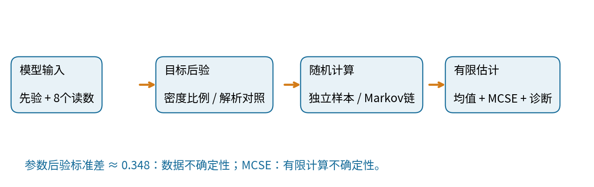
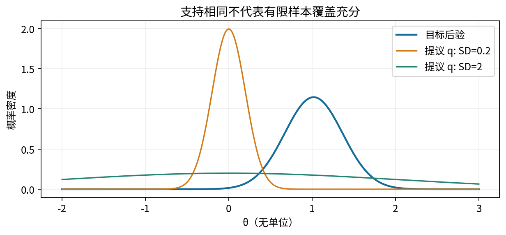
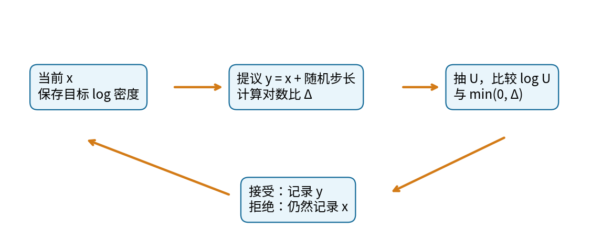
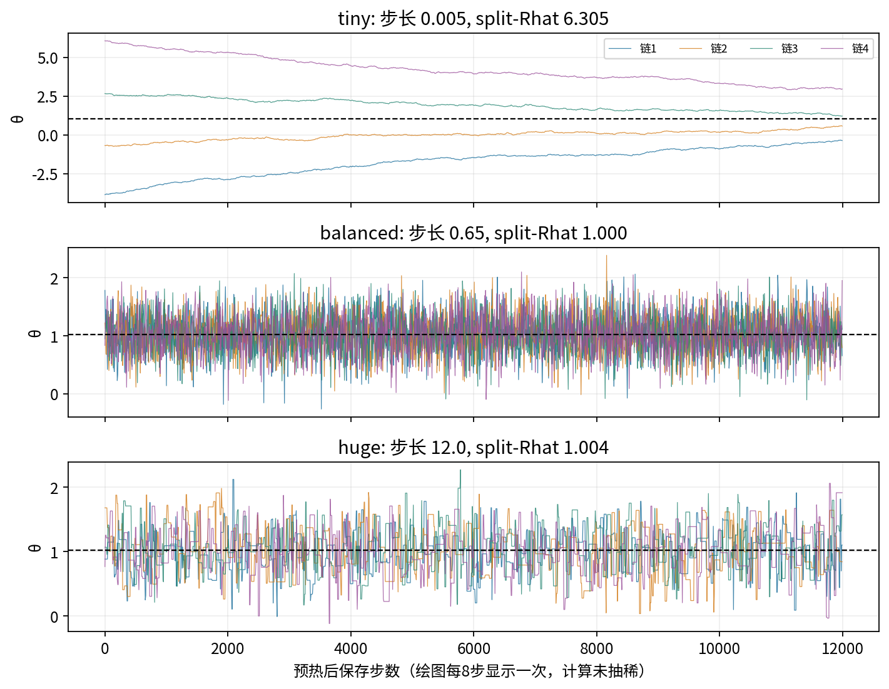
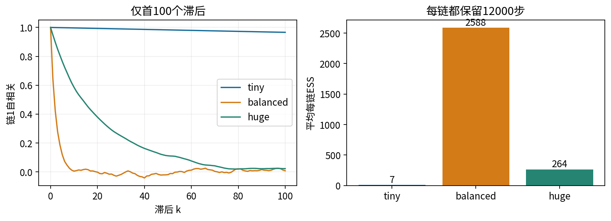

# 第078课 Monte Carlo与MCMC

主线：先说明要积分的量，再制造合适的随机样本，最后检查误差与探索是否充分。样本数量、目标分布、有效信息量是三件不同的事。采样过程中的箭头表示算法状态更新，不自动表示现实世界的因果关系。

## 1 为什么“写出了后验”还没有算出答案

第077课通过求和消去离散隐藏变量，得到了精确边缘。若未知参数是连续数，求和就变成积分；若参数很多，即使每个方向只放100个网格点，10维也需要100的10次方个点。此时写出后验密度的公式，并不等于已经知道后验均值、可信区间或预测概率。本讲承接019、021–022、024和076，先从独立抽样理解Monte Carlo，再进入制造相关样本的Markov chain Monte Carlo，简称MCMC。

想象一台仪器反复测量同一个未知水平θ，得到八个读数：0.8、1.2、0.9、1.4、1.1、0.7、1.3、1.0。读数是为教学固定编写的无单位数据，不是真实设备实验。模型设每个读数在给定θ后独立，噪声标准差为1；先验认为θ服从均值0、标准差2的正态分布。这里的θ是固定但未知的总体位置，后验随机性表达对它的不确定性，不能理解为设备每次测量都会重新抽一个θ。

我们要回答两个不同问题：“θ大致是多少？”对应后验均值；“我们的数值计算还有多大误差？”对应Monte Carlo标准误。后验标准差描述参数不确定性，Monte Carlo标准误描述有限样本算法误差。增加计算量能减少后一种误差，却不会凭空增加八个读数提供的信息。

## 2 用随机平均代替积分

先暂时离开后验。计算0到1之间x²曲线下的面积，精确答案是1/3。若U均匀落在0到1，每个小区间被抽到的概率等于其长度，因此U²的期望等于这块面积。抽N个独立U，把平方求平均，就是Monte Carlo估计：

$$I=\int_0^1 x^2\,dx=E[U^2],\qquad \widehat I_N=\frac{1}{N}\sum_{i=1}^N U_i^2.$$

积分符号表示连续累加；E表示按给定分布加权的平均；帽子表示有限数据算出的估计，不是精确未知量；下标i标记第几次独立抽样。大数定律解释样本平均在适当条件下接近期望，但不承诺某一次增加N后误差必然变小。随机误差会上下起伏。

对于独立同分布且方差有限的函数值h(U)，平均值的方差是单个函数值方差除以N。用样本标准差s估计单点波动，就得到标准误s/√N。若想把标准误减半，通常需要把N增加到四倍，不是两倍。高维下Monte Carlo的这一基本N的平方根规律不直接随维度改变，但函数的方差、如何抽样以及罕见区域的探索可能随维度急剧恶化。

本课固定种子抽20000个U，面积估计为0.32936，标准误约0.00209，距离1/3约1.90个标准误。这不是算法故障；只看一次结果是否“很接近”不能检验随机程序。重复独立种子，比较误差分布与理论标准误，才是更好的验证办法。课堂中保留解析答案，是为了能检查实现，而不是因为简单积分必须用抽样。

## 3 为什么后验归一化常数麻烦

后验密度可以写成似然乘先验再除以证据Z。似然说明某个θ对现有读数的支持程度；先验表示观测前对θ的模型约束。Z把所有θ处的未归一化密度积分起来，使总面积等于1：

$$\pi(\theta)=\frac{\widetilde\pi(\theta)}{Z},\qquad Z=\int\widetilde\pi(\theta)\,d\theta,\qquad E_\pi[h]=\int h(\theta)\pi(\theta)\,d\theta.$$

波浪号π表示还没有归一化的目标；π是不带波浪号的目标密度。密度本身可以超过1，只要积分为1；它不是某个精确实数点的概率。h可以是θ本身、θ²，或“θ大于1.5”的指示函数。相同样本可以估计多个函数，但每个函数的相关性与有效样本量可能不同。

本例恰有解析答案。把先验和似然中的平方项展开，θ²系数是n/σ²+1/τ²，θ的一次项系数是Σy/σ²。完成平方后得到：

$$v=\left(\frac{n}{\sigma^2}+\frac{1}{\tau^2}\right)^{-1},\qquad m=v\frac{\sum_i y_i}{\sigma^2},\qquad \theta\mid y\sim N(m,v).$$

n=8是读数数目，σ=1是已知观测噪声标准差，τ=2是先验标准差；N(m,v)中第二个参数是方差，不是标准差。Σy=8.4，故v=1/8.25=0.121212，m=8.4/8.25=1.018182。后验标准差√v≈0.348155。我们故意用能精确求解的模型检验采样器，再把方法推广到无法解析的模型。

## 4 重要性采样：抽不到目标时，先抽一个容易的分布

假设容易从提议分布q抽样，却不容易直接从π抽样。只要π有质量的地方q也为正，可以乘上密度比补偿抽样频率。直观地说，q过度访问的地方权重小，q很少访问却对目标很重要的地方权重大。不是把稀有样本删除，而是修正它代表的目标质量。

$$E_\pi[h]=E_q\!\left[h(X)\frac{\pi(X)}{q(X)}\right].$$

若Z未知，则先算未归一化权重wᵢ=π̃(xᵢ)/q(xᵢ)，再除以总权重，得到自归一化估计。它是两个随机平均的比值，有限N一般有偏，但在合适可积条件下仍可一致。分母不能因为形式像平均就被当成无误差常数。

$$\bar w_i=\frac{w_i}{\sum_jw_j},\quad \widehat\mu=\sum_i\bar w_i h(x_i),\quad N_{\mathrm{weight}}=\frac{1}{\sum_i\bar w_i^2}.$$

最后一个量是权重集中度的诊断：所有权重相等时等于N，只有一个样本拿走全部权重时等于1。它不是时间序列MCMC的ESS，也不是覆盖了所有重要区域的证明。若提议分布根本没抽到一个重要峰，观测到的权重仍可能看起来很均匀。

本课使用均值0的正态提议。当提议标准差是2，12000个样本给出的均值约1.01499，权重ESS约2573；当提议标准差只有0.2，样本集中在0附近，权重ESS约28，估计只有0.6044，严重偏离解析值。两个提议理论上都在整条实线上为正，但“支持覆盖”不等于有限计算下尾部访问充分。重要性权重有有限二阶矩等条件还关系到常规标准误是否适用。

## 5 Markov链：让下一步只依赖当前状态

独立抽样每次重新开始；Markov链保留一个当前状态x，用转移规则K(x,·)产生下一个状态。Markov性质指给定当前状态后，更早历史不再额外改变下一步的条件分布。它不表示相邻样本独立，也不表示状态在现实中有因果影响。我们是在设计计算工具。

如果当前分布是π，转移一次后分布仍为π，就称π是该链的平稳或不变分布。离散情形写为π(y)=Σx π(x)K(x,y)。这只是“从π出发就留在π”，并没有说明从任意起点都会到达π。例如永远不移动的链，让任何分布都平稳，但从一个点出发永远只看到那个点。

详细平衡是一条方便的充分条件：π(x)K(x,y)=π(y)K(y,x)，即在平稳状态下，任意两点之间的双向概率流相等。对x求和并利用每行转移概率和为1，就得到π(y)。详细平衡不是平稳性的必要条件；有些非可逆算法也保持正确目标。

有限离散链中，不可约保证状态之间最终能相互到达，非周期避免只能按固定节拍访问；合适的不可约、非周期条件给出唯一平稳分布及从起点的收敛。连续状态需要用更严格的正Harris常返等条件表述；不能把有限链定理原样照搬。遍历平均收敛与有可用的中心极限定理又不是同一强度的结论。本课正态目标及正态随机游走是良好的教学场景，仍用诊断检查有限运行。

正确的平稳分布是算法设计要求；有限时间混合充分是实际运行要求。证明前者不能替代检查后者，画出好看的轨迹也不能反过来证明转移核写对了。

## 6 Metropolis–Hastings接受规则从哪里来

当前状态为x，先从q(y|x)提出候选y。若完全接受，提议本身未必以π为平稳分布。MH增加一次接受/拒绝，使用：

$$a(x,y)=\min\left(1,\frac{\widetilde\pi(y)q(x\mid y)}{\widetilde\pi(x)q(y\mid x)}\right).$$

分子包含从候选回到当前的反向提议密度，分母包含正向提议密度。Z在π(y)/π(x)中抵消，所以只需能计算未归一化目标。目标密度较高的点也不总是无条件接受：当提议不对称时，还必须看提议比。对称正态随机游走q(y|x)=N(x,s²)满足两方向相等，才可只保留目标密度比。

证明只需比较不同状态之间的流量。π(x)q(y|x)a(x,y)等于π(x)q(y|x)和π(y)q(x|y)两者较小值，交换x、y后不变。因此不同状态满足详细平衡；被拒绝的概率放在原状态自循环，不破坏平衡。这里s是提议步长标准差，和观测噪声σ、后验标准差√v是三个不同量。

实际实现用对数比较：先计算差Δ=logπ̃(y)−logπ̃(x)，再取一个0到1均匀随机数U；当logU<min(0,Δ)时接受。这避免先计算极小密度变成0，也避免指数溢出。例如Δ=−2时，接受概率是exp(−2)≈0.1353；不是“低密度一概拒绝”，否则样本会向峰顶挤压，变成不正确的优化程序。

最常见的错误是只保存接受的点。停留次数恰好是目标分布需要的权重，删除重复点会改变被访问位置的相对频率。另一种错误是每步把随机种子重设为同一值，这会重复相同随机数；本实现每条链创建一次随机数生成器，然后持续消耗其状态。

## 7 步长为何同时影响接受率与有效信息

步长太小，候选与当前很相似，通常被接受，看似“成功率很高”。但链穿过后验主体需要大量细碎步子，初始位置影响久久不消失。步长太大，候选经常落到后验几乎没有质量的地方，多数被拒绝；链长时间停在旧位置。两端都会导致相邻样本相关，独立信息远少于保存行数。

实验使用四个相距很远的起点−5、−1、3、7，每链先运行2000步作为预热，再保留12000步。步长0.005的接受率高达95%–98%，却得到split-Rhat≈6.305；步长0.65接受率约52%–53%，各链充分交叠；步长12的接受率只有约3%–4%，轨迹出现长平台。这里0.65只是对本模型的教学选择，不是所有模型的通用最佳步长。

预热丢弃初始阶段，是减少初值偏差的一种做法，不会自动使剩余样本平稳。我们刻意保留过小步长这一失败案例：预热2000步远远不够，但不偷偷延长预热去美化图。诊断不合格时必须报告失败、改善参数化或转移方式、再独立运行，不能仅报告一个合并均值。

## 8 从自相关到ESS和Monte Carlo标准误

自相关ρₖ表示相隔k步的同一个函数值在多大程度上同步变化。若链已平稳，函数值方差有限，并满足相关可求和及适当中心极限定理条件，样本均值方差近似为：

$$\operatorname{Var}(\bar h)\approx\frac{\sigma_h^2}{N}\left(1+2\sum_{k=1}^{\infty}\rho_k\right),\qquad N_{\mathrm{eff}}=\frac{N}{1+2\sum_{k=1}^{\infty}\rho_k}.$$

σh²是目标下h的方差。括号中称积分自相关时间，解释相关性如何放大均值误差。它来自展开所有样本对的协方差：不仅每个点自身有方差，不同时间点也共同贡献。ESS是“若有这么多个独立样本，均值误差大致相同”的等效数目，并不是筛出了一组真的独立样本。

无限滞后不可能直接计算，远距离经验自相关也很嘈杂。本实现使用FFT计算ACF，将ρ₁+ρ₂、ρ₃+ρ₄等成对相加，在首个非正对停止，且最多检查1000个滞后。它是便于检查的教学近似；不等于Stan采用的rank-normalized多链ESS，也不充分处理重尾、负相关增益或尾部概率。为避免夸大，本实现把ESS上界截为原长度；某些负相关链理论ESS可以超过N。

合理步长组每链ESS约2463–2741，四链合并均值1.02177，解析值1.01818。把48000行误当独立时标准误约0.00158；按各链方差除ESS并组合，得到约0.00340，超过前者两倍。对于不混合的tiny组，所谓MCSE连前提都不可靠，不能拿一个较大的数字给偏差提供“合格区间”。

## 9 多链诊断在比较什么

单条链可能在局部小区域内看起来很稳定，因此从分散起点运行多条链。经典Rhat把链内波动与链间均值差异比较；split版本先把每条链切成前后两半，使缓慢漂移更容易暴露。设切分后有M条链，每条长度n，W是各链样本方差的平均，B是各链均值方差乘n：

$$\widehat V=\frac{n-1}{n}W+\frac{B}{n},\qquad \widehat R=\sqrt{\widehat V/W}.$$

若链间差异比链内波动大，Rhat会大于1。它接近1只表示被检查的量在这些链之间相容，不能保证所有峰都访问过。如果所有链从同一峰附近开始并一起漏掉远处峰，可能得到虚假的安心。本代码返回的是经典split-Rhat，文中明确标注；研究分析更应同时考虑秩归一化、折叠Rhat、bulk/tail ESS及不同参数函数。

还应区别“统计诊断”和“程序测试”。轨迹检查有限运行；解析后验对照检查采样目标；单元测试检查输入拒绝、拒绝状态保存、同种子复现与条件分布。三类证据互相补充，任何一类都不能独自证明现实模型适用。

## 10 Gibbs采样把大更新拆成条件更新

如果每个变量在给定其余变量时都容易采样，可以轮流更新它们。考虑均值为零、两维边缘方差均为1、相关系数为ρ的二元正态。其完整条件分布是：

$$X\mid Y=y\sim N(\rho y,1-\rho^2),\qquad Y\mid X=x\sim N(\rho x,1-\rho^2).$$

先用当前y抽新x，再用刚抽到的新x抽新y，一整轮记录一次状态。这就是系统扫描Gibbs。每次单坐标更新保持联合目标不变，因此一轮组合仍保持目标；整轮组合一般不必满足详细平衡。若错误地同时用两个旧值并行更新，通常不再是这里定义的Gibbs，不能假定仍正确。

当ρ=0.2，条件方差接近1，每轮可以大幅探索；当ρ=0.95，目标呈狭长斜椭圆，沿坐标方向的条件范围很窄，每次只能慢慢沿椭圆移动。实验同样保留20000轮，X的ESS从约18471降到951。这说明Gibbs即使每一步都“接受”，也可能混合很慢。重参数化、成块更新等方法可以改善几何，但本课不把后续高级方法当作已学会的前提。

## 11 如何使用以及何时停止相信结果

当模型后验无法解析、但能计算未归一化密度时，MH提供通用入口；当完整条件易抽样时，Gibbs可利用结构；当有覆盖良好的提议且权重不退化时，重要性采样可能更直接。小维解析或网格答案仍是首选对照，不该为展示复杂技术而舍弃简单正确方法。

一份合格报告至少说明目标分布与函数、链数和起点、预热与保留长度、提议和种子、轨迹与ACF、逐参数/函数诊断、MCSE以及失败案例。不要把可信区间写成算法误差区间；不要用固定“接受率标准”代替完整诊断；不要把抽稀当成修复不混合的魔法。抽稀可能减少存储和后续处理成本，但丢弃已计算状态通常不提高每单位计算的有效信息。

本讲实践终点不是“我获得了48000个样本”，而是“我知道这些样本来自哪个目标；在一个有精确答案的测试里验证了程序；用相关性和多链证据限制了有限运行的可信范围”。下一讲用优化而非随机链近似后验，将带来另一类误差：即使优化完全收敛，近似分布族也可能系统性低估不确定性。

## 12 练习与验收

1. 手算八个读数的后验均值和方差，说明方差与标准差的区别。
2. 证明MH的不同状态之间满足详细平衡；解释为什么拒绝仍要存样本。
3. 若后验样本标准差0.35，N=10000，ESS=400，分别计算天真的标准误与相关修正标准误。
4. 解释为何tiny组高接受率与较长样本数不能证明计算可靠。
5. 推导二元正态Gibbs的两条条件分布，并说明ρ接近1的影响。
6. 运行三个步长、四链对照；修改一个设置，预先写预测，再用轨迹、ESS与解析误差检验。
7. 解释重要性采样权重ESS和MCMC时间相关ESS的区别，各给出一个诊断不能发现的失败情形。

## 参考与来源边界

[1] Hastings, W. K. (1970), Monte Carlo sampling methods using Markov chains and their applications, DOI:10.1093/biomet/57.1.97，核对MH目标与接受机制。

[2] Stan Reference Manual, Posterior Analysis：https://mc-stan.org/docs/reference-manual/analysis.html，核对MCSE、ESS与多链诊断的概念。代码是本课教学实现，不是Stan诊断的复刻。

以上数学推导、数据、图示与代码为本课原创说明；网站动态内容及本次核验范围见sources.md。整个实验离线，无模型API费用。
