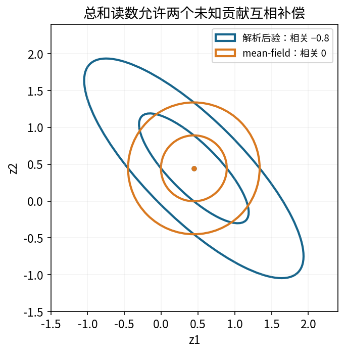
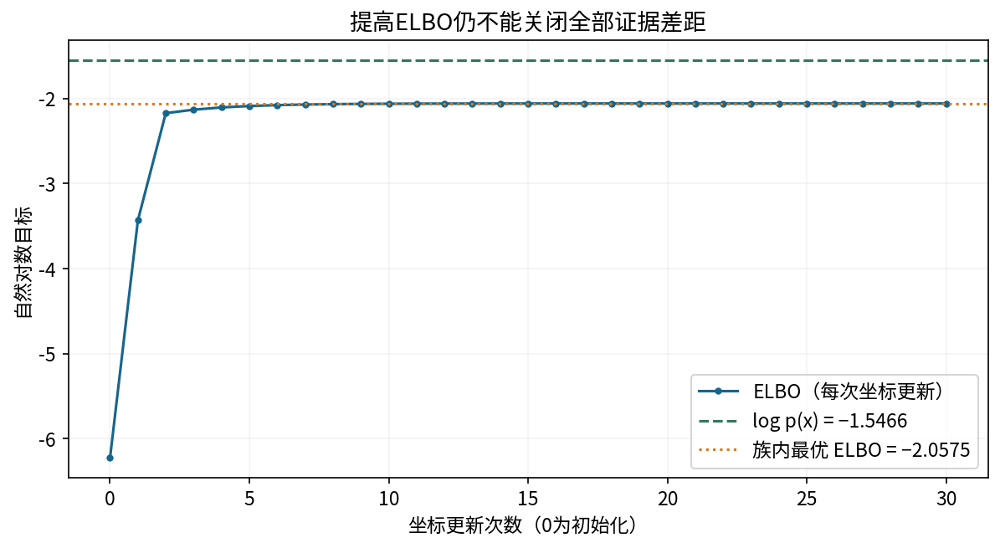
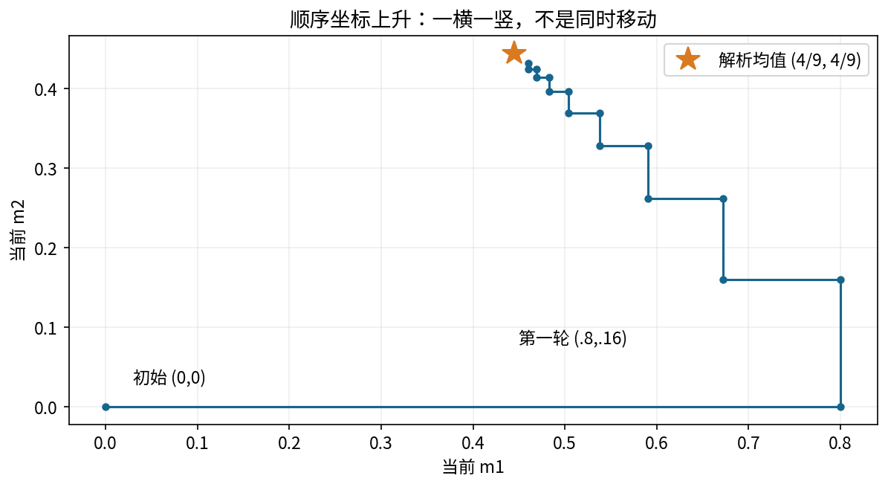
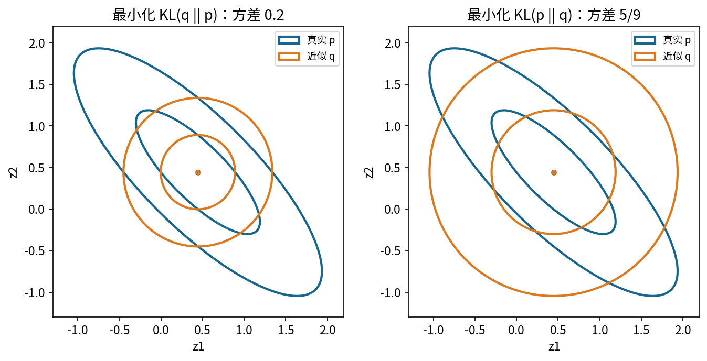
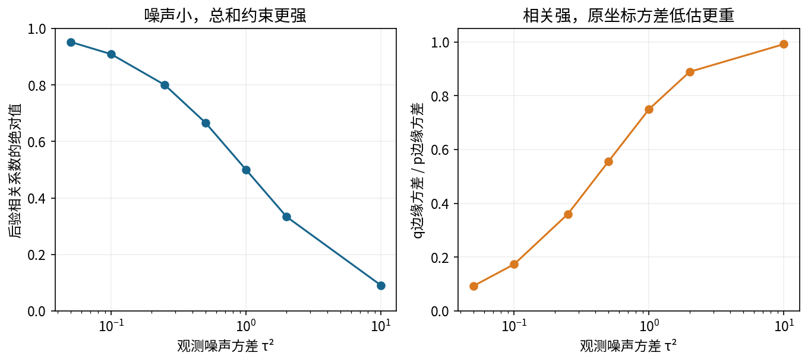

# 第079课 变分推断与ELBO

主线：先观察两个隐变量怎样因同一条测量而互相补偿，再把后验近似变成可计算的优化问题。本课始终保留一个解析答案，分别检查目标值、均值、方差和相关性。目标收敛只回答优化进展，不能单独回答近似是否可信。

## 1 一条读数怎样让两个未知量相关

直接先修为第016、019、023至024、043、074、076课。需要理解期望、方差、高斯密度、梯度和隐变量；矩阵步骤均在本讲展开。第077课讨论精确推断，第078课讨论采样近似，本课换一种策略：不先生成大量样本，而是在一族容易计算的分布中挑选一个最合适的成员。这里的“学习”是调整近似分布参数，模型的观测噪声和先验均已固定，不是在估计这些模型参数。

设两个未知贡献为z₁和z₂，例如两种人工信号对同一个传感器读数的贡献。先验把它们分别设为均值0、方差1的独立高斯变量。传感器只能测到两者的和，并加入方差0.25的高斯噪声。实际看到读数x=1。由于z₁偏大时z₂可以偏小，观测之后两者会产生负相关。这种“互相补偿”是后验的性质，不与先验独立矛盾。

注意观测1不是要求z₁+z₂严格等于1，噪声允许偏离；先验又会把过大的正负贡献拉回零附近。后验最终同时平衡读数吻合程度和先验合理程度。若把两者直接各设为0.5，就只给出一个点，完全丢掉了读数背后仍有多种分解的事实。我们要保留的是整个概率分布。

## 2 将生成过程翻译成完整密度

模型写为下式，符号N表示高斯分布，第二个参数是方差而不是标准差。噪声标准差为0.5。

$$z_1,z_2\overset{ind}{\sim}\mathcal N(0,1),\qquad x\mid z_1,z_2\sim\mathcal N(z_1+z_2,\tau^2),\qquad \tau^2=\frac14.$$

联合密度是先验与似然的乘积。取自然对数以后，乘积变成和；只看依赖z的部分，可写为

$$\log p(x,z)=C-\frac12(z_1^2+z_2^2)-\frac{1}{2\tau^2}(x-z_1-z_2)^2.$$

C代表对当前z不变的项，但如果要算绝对ELBO或证据，C必须完整保留。这里先临时隐藏它是为了看清形状。连续密度不是“恰好等于这个数值的概率”，密度可以超过1，其对数也可以为正；不能拿离散概率必须小于等于1的直觉否定密度计算。

把x=1和τ²=1/4代入，展开平方得到z₁²与z₂²各有总系数5，交叉项系数8，一次项系数8。因此负二次型为−(5z₁²+8z₁z₂+5z₂²−8z₁−8z₂)/2。交叉项正说明同时取很大同号值会使总和偏离观测。这个展开是随后所有解析结果的起点，值得先在纸上算一次。

## 3 先做出真值，再谈近似

令z为列向量，Λ读作Lambda，表示精度矩阵，即协方差矩阵的逆。h称自然参数中的线性项。由上一节得到

$$\Lambda=\begin{pmatrix}5&4\\4&5\end{pmatrix},\qquad h=\begin{pmatrix}4\\4\end{pmatrix},\qquad \log p(z\mid x)=C'-\tfrac12z^T\Lambda z+h^Tz.$$

上标T表示转置，使列向量变成行向量。配方就是把二次式改写成(z−μ)ᵀΛ(z−μ)，线性项要求Λμ=h。解两个联立方程5μ₁+4μ₂=4与4μ₁+5μ₂=4，先相减得μ₁=μ₂，再相加得每个均值为4/9。

二乘二矩阵求逆给出精确后验：

$$p(z\mid x)=\mathcal N(\mu,\Sigma),\quad\mu=\begin{pmatrix}4/9\\4/9\end{pmatrix},\quad\Sigma=\Lambda^{-1}=\frac19\begin{pmatrix}5&-4\\-4&5\end{pmatrix}.$$

两个边缘方差都是5/9，协方差是−4/9，相关系数是(−4/9)/(5/9)=−0.8。协方差不是相关系数；前者带有两变量单位的乘积，后者无量纲。倾斜椭圆代表允许一个上升、另一个下降的组合，椭圆的中心并不代表全部不确定性。

读数的边缘生成分布为x~N(0,2+τ²)=N(0,9/4)。因此对数证据log p(x=1)约为−1.546625864。证据是给定模型生成这次读数的密度；它既不是待拟合参数，也不是近似分布q的函数。本例能解析计算证据，纯粹为了验收。一般VI中正是它不好算，才需要下面的可计算目标。

## 4 可计算分布族具体限制了什么

选择mean-field，即平均场因子分解：q(z)=q₁(z₁)q₂(z₂)。本例使用一维高斯因子，qⱼ=N(mⱼ,vⱼ)，其中vⱼ>0。m是近似均值，v是近似方差；μ和Σ保留给真实后验。请不要把这两套记号混写，否则很容易把答案当作算法的输入。

因子分解声明在q下面两个变量独立，所以q的协方差矩阵必定是diag(v₁,v₂)，非对角线固定为0。它并没有声明真实后验独立。本例真实协方差是−4/9，因此无论迭代多少次，只要仍处在这个族中，就不可能把真实联合分布完全恢复。近似族是先设的“形状限制”，不是优化成功以后自动消失的限制。

为什么愿意做这种限制？因为熵、期望以及每个因子的更新会更简单。更高维情况下，独立高斯只要存d个均值和d个方差；完整高斯还要存约d²/2个协方差参数。省下存储与计算可能非常有价值，但必须明确购买这种便利付出的代价。也可把若干强相关变量放在同一块中形成块平均场，它比完全独立更灵活，却需要较大的局部计算。

## 5 KL方向决定谁负责提出检验点

两个分布的KL散度定义为

$$\mathrm{KL}(q\Vert p)=\mathbb E_q\!\left[\log\frac{q(z)}{p(z\mid x)}\right]=\int q(z)\log\frac{q(z)}{p(z\mid x)}\,dz.$$

期望下标q非常重要：检验点由q提出。q把大量质量放到p很小的区域会付出较大代价；若q根本没有覆盖p某处，那个区域也不会直接在q期望中频繁出现。调换两个分布后，检验点改由p提出，目标就不同了。KL通常不对称，也不满足距离应有的三角不等式，所以它不是普通几何距离。

在支持条件成立时KL非负，且当两个密度几乎处处相等时为0。如果q在p为0的地方分配正质量，KL(q||p)可能无穷大。对于本课所有正定高斯，两者在整个实空间密度为正，不会遇到这个支持问题，但数值程序仍必须拒绝非正定协方差与非有限值。

“反向KL会寻找某个峰”只是常见直觉，不能当成适用于任何分布族的定理。当前目标只有一个高斯峰，完全不需要多峰故事也能展示方向差异。本讲在第11节对相同独立高斯族分别求解两种方向，直接比较其方差，而不用一句口号代替计算。[1]

## 6 ELBO由一个恒等式而来

后验满足p(z|x)=p(x,z)/p(x)。把它代入KL定义，注意log p(x)对z是常数，便得到

$$\mathrm{KL}(q\Vert p)=\mathbb E_q\log q(z)-\mathbb E_q\log p(x,z)+\log p(x).$$

把前两项移到另一边，定义证据下界，即ELBO：

$$\mathcal L(q)=\mathbb E_q\log p(x,z)-\mathbb E_q\log q(z),\qquad \log p(x)=\mathcal L(q)+\mathrm{KL}(q\Vert p).$$

ELBO是Evidence Lower BOund的缩写。因为KL非负，L(q)不超过log p(x)。固定数据和模型时，证据不随q变化，所以最大化L严格等价于最小化KL(q||p)。这不是“希望近似成立”的经验关系，而是相应积分存在时的代数恒等式。

第二项负的E_q log q称微分熵H(q)。它衡量连续分布的扩散程度，但与离散熵不同，微分熵可以为负，也会随单位变化。ELBO的第一项鼓励q在联合密度大的地方放质量，熵项阻止它无代价地收缩成一个点。这两个作用共同决定最优分布，而不是只把均值放到最大后验点。

一个重要限定是“固定模型”。如果同时改变观测噪声、模型结构或数据预处理，证据也会改变，不能再说任意ELBO提升都只是在减少同一个后验近似误差。跨模型比较时，不同近似族的下界松紧可能不同，也可能改变模型排序。本课把模型固定，就是为了把这个混杂因素拿走。

## 7 从积分到可以逐项核算的ELBO

对本例独立高斯q，有E zⱼ=mⱼ、E zⱼ²=mⱼ²+vⱼ。由于q内独立，E(z₁z₂)=m₁m₂。于是读数残差平方的期望为

$$\mathbb E_q(1-z_1-z_2)^2=(1-m_1-m_2)^2+v_1+v_2.$$

这一式很容易漏掉方差项。把随机量的期望代回平方，只得到均值残差平方，会漏掉随机量本身的波动。一般恒等式E Y²=(E Y)²+Var(Y)在这里直接发挥作用。如果q允许相关性，还须加2Cov_q(z₁,z₂)；本课因子族把这一项强制设为0。

把高斯标准化常数全部放回，得到可以不用解析后验直接计算的目标：

$$\begin{aligned}\mathcal L={}&-\log(2\pi)-\tfrac12(m_1^2+m_2^2+v_1+v_2)\\&-\tfrac12\log(2\pi\tau^2)-\frac{(1-m_1-m_2)^2+v_1+v_2}{2\tau^2}\\&+\log(2\pi e)+\tfrac12\log(v_1v_2).\end{aligned}$$

前两项是先验期望对数密度，中间两项是似然期望对数密度，最后两项是二维独立高斯的熵。代码elbo函数按这三个部分独立计算。另一个函数计算高斯KL，第三条路线计算证据；只有三条路线独立实现再比较，恒等式检验才不是自己证明自己。

这里自然对数单位为nat。若换成以2为底的对数，所有相关目标应统一换算，不能只改某一个公式。ELBO为负完全正常；重要的是在同一完整定义下比较大小，而不是追求它变为正数。

## 8 坐标更新为什么有闭式答案

坐标上升一次只优化一个因子，其他因子固定。对一般mean-field分解，将含qⱼ的目标整理，可得到

$$\log q_j^*(z_j)=\mathbb E_{q_{-j}}[\log p(x,z)]+\text{constant}.$$

q₋ⱼ表示除了第j个因子以外的乘积。常数由归一化决定。理解这个式子可以从变分问题退回熟悉的KL：令rⱼ正比于右侧期望的指数，关于qⱼ的ELBO等于一个不随qⱼ变化的数减去KL(qⱼ||rⱼ)。因此最优点就是qⱼ=rⱼ，不需要猜测更新规则。[1]

对二次高斯联合，把除z₁外的变量取期望后，仅剩−5z₁²/2+(4−4m₂)z₁。再次配方，得到

$$m_1\leftarrow\frac{4-4m_2}{5},\quad v_1\leftarrow\frac15;\qquad m_2\leftarrow\frac{4-4m_1}{5},\quad v_2\leftarrow\frac15.$$

箭头表示覆盖旧值。更新m₂时使用本轮刚更新的m₁，这叫顺序坐标更新。它与同时用两个旧值的同步更新不同，虽然本例两者都能研究收敛，但不能把一个算法的轨迹套到另一个算法上。代码每更新一个坐标就记录一次目标，便于看见局部动作与目标变化之间的联系。

方差一步就到1/5，并不意味着整个后验已经求好；均值还要在两个因子之间反复传递影响。一般d维高斯精度Λ、线性项h时，规则为mⱼ=(hⱼ−Σₖ≠ⱼΛⱼₖmₖ)/Λⱼⱼ以及vⱼ=1/Λⱼⱼ。本课代码实现这个一般形式，二维模型只是最容易手算的检验例。

## 9 亲手追踪两轮，再理解停止条件

从m₁=m₂=0、v₁=v₂=1开始。第一步更新第一个因子，m₁=0.8、v₁=0.2，另一个因子暂不动。第二步使用新m₁，得到m₂=0.8−0.8×0.8=0.16、v₂=0.2。第一轮结束时的均值是(0.8,0.16)，两者还不相同，因为坐标更新顺序暂时打破了对称性。

第二轮得到m₁=0.672、m₂=0.2624。第三轮得到m₁=0.59008、m₂=0.327936。它们逐渐靠近(4/9,4/9)。消去本轮m₁可得m₂的新值=0.16+0.64×m₂旧值，因此第二个均值的误差每轮缩小到0.64倍。这是当前模型的明确收敛速率，不能推广成所有VI都有线性收敛。

实验停止规则是整轮后均值与方差的最大绝对变化小于10⁻¹²，且设置最大轮数防止无期限运行。返回值明确包含converged字段；用尽轮数而未达到容差必须报告未收敛。由于这里是绝对容差，若变量单位改变，应重新考虑尺度或改用相对误差。容差是工程选择，不能被误写成严格数学上的等于。

本例60轮满足停止条件，最大均值绝对误差约1.3×10⁻¹²。ELBO可能因浮点舍入出现约10⁻¹⁵的负增量，所以测试给出很小的容许范围，而不会要求每一位都精确非降。反过来，如果出现10⁻²级下降，不能用“浮点误差”随意解释，必须检查更新次序、方差和常数。

## 10 优化误差消失后，近似误差仍在

最优均值恰好等于真实均值，但近似方差只有1/5，真实边缘方差是5/9。两者比值为0.36，近似方差低估64%；标准差比值是0.6，标准差低估40%。方差和标准差的百分比不能混用。q的协方差为0，也没有恢复真实的−4/9。

对两个d维高斯，KL(q||p)可解析写为

$$\frac12\left[\operatorname{tr}(\Sigma^{-1}D)+(m-\mu)^T\Sigma^{-1}(m-\mu)-d+\log\frac{\det\Sigma}{\det D}\right],$$

其中D是q的协方差，tr读作迹，即对角线元素之和，det是行列式。独立高斯族中对m求导给Λ(m−μ)=0，所以m=μ；对每个vⱼ求导给Λⱼⱼ−1/vⱼ=0，所以vⱼ=1/Λⱼⱼ。这同时证明本例坐标算法最后找到的就是族内最优解。

代入本例，最小KL约0.510825624，最优ELBO约−2.057451487，与证据之间始终留下0.510825624。这段差距不会因为再迭代一万轮而消失。它来自族限制，不是迭代器“还不够努力”。若把近似族扩成完整高斯，本例真实后验就在族中，理想最优KL才可能到0。

一般可把当前KL拆为族内最小KL加上超出最小值的部分。前者叫近似族误差，后者叫优化误差，两者均非负。它们仍不同于“模型与真实世界不符”的模型误差。本课模型完全人工设定，解析真值只证明算法相对于这个模型的偏差，不能保证现实传感器服从高斯关系。

## 11 换一个KL方向，方差为何改变

保持同一个独立高斯族，却改为最小化KL(p||q)。因为现在期望在真实后验p下，每个独立因子的对数密度只依赖对应边缘。对mⱼ和vⱼ分别求导，最优点变成mⱼ=E_p zⱼ、vⱼ=Var_p zⱼ。因此正向目标会匹配真实边缘方差5/9，但仍然没有非零协方差。

两个方向都给出均值4/9，却产生不同方差：KL(q||p)给0.2，KL(p||q)给约0.5556。这正说明“均值一样”不足以判断两个近似是否一样。图中两种轴对齐轮廓也都无法沿倾斜方向伸长；一个更窄，一个覆盖真实边缘更充分，各自优化了不同代价。

为什么普通VI偏爱前一个方向？ELBO去掉了未知证据，而且期望在自己能够采样或积分的q下。后一个方向要求真实后验p下的期望，往往正是原推断问题难以获得的量。当前解析例子能轻松比较两个方向，不能据此声称一般问题只要把KL符号换一下就能同样便宜地求解。

## 12 不确定性偏差要按具体问题检查

最容易产生误导的结论是“mean-field把所有不确定性都低估”。本例确实低估每个原始坐标的边缘方差，但考虑总和s=z₁+z₂，真实方差为5/9+5/9−8/9=2/9，q下却为1/5+1/5=2/5。总和方向的方差反而被高估80%，因为丢掉了原本抵消波动的负协方差。

再看差值d=z₁−z₂，真实方差为5/9+5/9+8/9=2，q下还是2/5，低估80%。相同近似对两个业务问题可以朝相反方向失真。新读数x_new=z₁+z₂+新噪声的预测方差，还要加独立噪声1/4，精确值17/36约0.4722，近似值0.65。预测层面的偏差不能只看参数边缘方差。[3]

一般线性函数aᵀz的方差是aᵀΣa；相关项通过a的符号和大小改变最终结果。实际应用应围绕最终要报告的量进行检查，例如总风险、差异、排名或者未来观测，而不是只展示某个参数的漂亮直方图。特别是在需要可靠区间的任务中，遗漏相关性会改变决策边界，必须明确说明。

## 13 对照实验怎样隔离因子族限制

实验另设独立后验对照：把单个总和传感器改为两个独立传感器，各自只观察一个潜变量，观测向量为(1,−1)，噪声协方差为0.25乘单位阵。此时精度为对角矩阵5I，解析后验本来就独立。mean-field能得到均值(0.8,−0.8)、方差(0.2,0.2)，KL在舍入精度内为0。

这个对照排除了“程序总会制造一个非零KL”的可能，也表明限制是否有害取决于目标后验几何。另一方面，即使独立对照通过，也不足以证明任意高维模型、非高斯目标或随机优化都正确。测试覆盖范围与结论适用范围必须对应，不能把小例通过扩大为通用算法认证。

噪声扫描只改变τ²，固定先验、观测和近似族。随着噪声减小，两者总和受约束更强，互相补偿更明显，相关系数靠近−1。真实边缘仍有各贡献无法分开的不确定性，独立近似却越缩越窄。这个机制解释了图5的曲线，不应将曲线读作“数据越准确，任何参数都能被准确识别”。总和被测得很准，不代表两部分各自可识别得很准。

## 14 使用情境、方法选择与边界

当后验期望需要快速反复更新、数据规模大、潜变量多，且最终使用的统计量经验证足够稳定时，VI可能是有用选择。可先用简单族快速探索，再用更灵活的族、重参数化、块结构或可靠采样对关键结论交叉检查。这里的“可能”由任务决定，不能仅凭某种算法较快就宣布它更适合所有科研问题。

对需要尾部概率、多个分离模态、强相关或精细区间的任务，单一独立高斯特别值得警惕。更多迭代通常只能改善优化误差，扩展近似族才有机会改善结构限制。重新参数化也可能把强相关方向旋转成接近独立的坐标，但必须把结果正确变回原单位；同一个“平均场”标签在不同坐标系下可以代表不同近似族。

实际软件还可能用随机梯度、蒙特卡洛估计ELBO、自动微分和约束变换。随机估计的曲线不必每一步单调，不同运行还会有随机优化差异；本课的确定性闭式坐标上升不代表这些实现细节。Stan文档区分meanfield与fullrank高斯近似，本讲仅借此建立术语对应，没有运行Stan，也不声称复刻其ADVI算法。[2]

## 15 自测与复现路线

完成本讲后，应能不看代码推导两次坐标更新，解释为什么均值恢复而方差没有恢复，写出ELBO与KL的恒等式，并说清楚期望下标。先阅读实验册，自己填写解析矩阵与前两轮轨迹，再运行代码核验。答案册给出完整过程，但应在自己尝试后使用。

练习1：展开联合对数密度，求μ、Σ和证据。练习2：从ELBO对m₁和v₁求导，得到更新并判断极值。练习3：算两轮顺序更新，解释同时更新为何不同。练习4：分别求两个KL方向的独立高斯最优方差。练习5：求总和、差值与新读数的精确和近似方差。练习6：设计一个区分优化误差与族限制的实验。练习7：指出“ELBO增大说明真实后验已恢复”的错误，并给出更合格的报告。

## 16 从二维例子推到一般线性高斯模型

把单个读数推广为观测向量x，潜变量推广为d维向量z。先验均值为m₀、协方差为S₀，测量矩阵为A，噪声协方差为R。模型写成z~N(m₀,S₀)、x|z~N(Az,R)。A的每一行说明某个读数由哪些潜变量怎样线性组合而成；A的列数必须等于潜变量维数，行数必须等于读数个数。

联合对数密度里与z有关的两项，是先验偏差的加权平方和观测残差的加权平方。协方差越小的方向，其逆矩阵对应的惩罚越大，所以精度可以理解为某个方向被约束的强弱。但非对角精度也参与耦合，不能只按单个对角线解释所有联合几何。

$$\log p(x,z)=C-\tfrac12(z-m_0)^TS_0^{-1}(z-m_0)-\tfrac12(x-Az)^TR^{-1}(x-Az).$$

展开第二个平方时，z的二次项为zᵀAᵀR⁻¹Az，一次项为−2zᵀAᵀR⁻¹x。加上先验部分后，精度Λ=S₀⁻¹+AᵀR⁻¹A，线性项h=S₀⁻¹m₀+AᵀR⁻¹x。于是仍解Λμ=h，并令Σ=Λ⁻¹。程序通过线性方程求解计算这些量，避免先构造一个不必要的数值逆再去乘向量。

为什么要求协方差正定？任意非零向量a对应线性组合aᵀz，其方差aᵀSa应该严格为正，才能有普通满维高斯密度。如果协方差只有半正定，分布可能挤在低维平面上，需要不同的密度表示；本课接口没有实现这种退化情形，因此明确拒绝它，而不使用伪逆悄悄改变模型。矩阵看起来元素都正也不保证正定，反之合法协方差可以有负的非对角元素。

## 17 期望二次型中的迹从何而来

一般ELBO中会出现E_q[(x−Az)ᵀR⁻¹(x−Az)]。令z=m+δ，δ的期望为0、协方差为D。把残差拆成x−Am−Aδ，展开以后两个交叉项因Eδ=0而消失，留下均值残差平方，加上E[δᵀAᵀR⁻¹Aδ]。

若令B=AᵀR⁻¹A，最后一项逐元素等于ΣᵢΣⱼBᵢⱼE(δᵢδⱼ)。协方差定义使E(δᵢδⱼ)=Dᵢⱼ，因此它可以写成tr(BD)，也等于tr(R⁻¹ADAᵀ)。代码采用后一个形式。这个迹项不是额外惩罚，而是把潜变量波动传播到观测残差之后得到的真实期望。

同理，先验偏差的期望二次型拆为(m−m₀)ᵀS₀⁻¹(m−m₀)+tr(S₀⁻¹D)。高斯熵为[d(1+log 2π)+log detD]/2。这样就得到支持完整q协方差的ELBO函数，独立q只是D取对角矩阵的特例。测试用一个带非零协方差的候选q核对恒等式，正是为了防止程序暗中只在对角情况下正确。

## 18 条件方差与边缘方差不是同一件事

本例真实条件分布p(z₁|z₂,x)的方差是1/5，而边缘p(z₁|x)的方差是5/9。前者把另一个贡献z₂当成已知固定值，后者把它的所有可能都积分进去。知道更多信息通常会减少相应的不确定性；在这个高斯例子中，额外未知量的波动正是两种方差之间的差别。

坐标mean-field用其他因子的均值进入更新，其最优方差落在精度对角线倒数1/5上，所以形状更接近“邻居被固定”时的宽度。它没有同时保留邻居与当前变量沿倾斜方向共同移动的空间。这个条件与边缘的比较，比只说“VI偏窄”更能解释为什么偏窄发生。

但q₁并不就等于任意固定z₂下的真实条件分布，因为条件均值随固定的z₂改变，而q₁使用迭代得到的m₂。只有在特定固定值等于该邻居均值时，两者形式才对应。不要把一种用于理解更新的类比升级成“mean-field就是精确条件分布”的普遍等式。

## 19 误差报告中的量纲与决策尺度

本例两个潜变量都用无量纲人工单位，绝对均值误差10⁻¹⁰已经很小。若现实参数单位改成百万个计数，相同数值容差的工程意义会改变；若一个坐标天然在10⁻⁶附近，另一个在10⁶附近，只报最大绝对误差也会遮盖前者的相对问题。实际报告可同时提供绝对误差、相对误差以及按真实后验标准差缩放的均值差。

不确定性也应围绕决策尺度评价。假设最后关心的是总和是否超过某个阈值，只报两个边缘的方差可能不足够；应比较总和分布或相应尾部概率。若关心两贡献谁更大，则差值分布更直接。两个问题使用同一后验，却沿不同方向读取它的信息，因此可以受同一个近似以不同方式影响。

最后，解析真值下可测的KL是一种全分布指标，但现实中真实KL常不可直接计算。此时更需要设计针对最终统计量的验证，例如小规模可靠采样、可解析特例、后验预测检查与敏感性分析。任何单个诊断都不是万能证书；把模型假设、优化状态、近似限制与应用需求放到一起，才形成完整的推断判断。

## 来源与原创说明

[1] Blei、Kucukelbir、McAuliffe，2017，Variational Inference: A Review for Statisticians。仅核对KL、ELBO及坐标上升定义；本讲传感器模型、数值推导、实验和图均为原创。[作者公开PDF](https://www.cs.columbia.edu/~blei/papers/BleiKucukelbirMcAuliffe2017.pdf)。

[2] Stan官方文档，ADVI for Variational Inference。用于核对meanfield与fullrank选项，不作为本课实现或运行结果来源。[官方文档](https://mc-stan.org/docs/cmdstan-guide/variational_config.html)。

[3] 本例关于线性组合方差可能高估的结论由第12节矩阵运算独立证明，不依赖“VI必定低估一切方差”的经验口号。源链接核验日期为2026-10-10，完整核验范围见sources.md。

学习检查：请合上讲义，用自己的话区分“独立先验”“独立后验”和“独立近似族”。本例只有第一项和第三项成立，第二项不成立。再说明为什么模型只测到总和，却仍不能唯一知道两个贡献各是多少。若能够从生成过程、后验几何和协方差公式三条路线给出相同解释，便真正连接了现象、机制与计算，而不只是记住了一个更新式。最后写下你将如何检查一个没有解析真值的新问题，至少包括优化状态、近似族敏感性和最终统计量三个方面。
