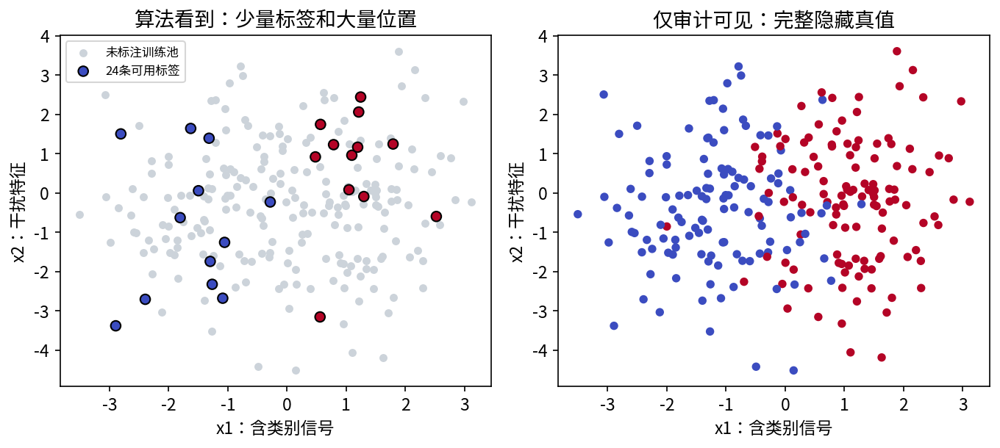
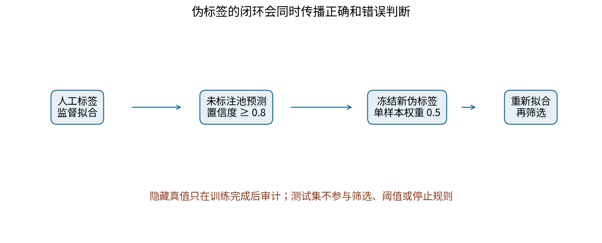
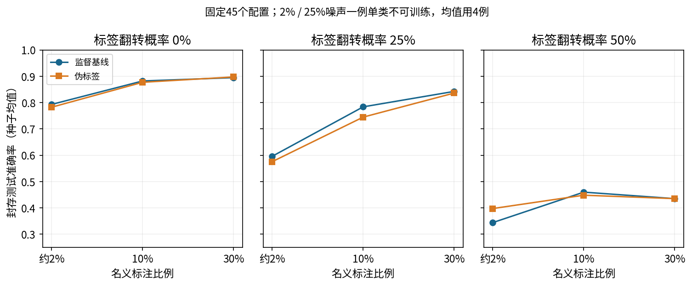
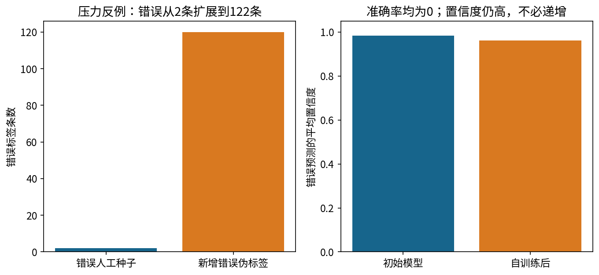
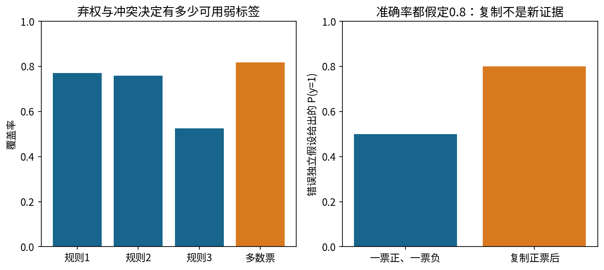

# 第080课 半监督与弱监督学习

主线：一条预测怎样变成下一轮的训练标签？什么时候它提供有效约束，什么时候它只把原来的错误复制得更多？本课把标签数量、标签可靠性、未标注分布和验证权限分开控制，既展示方法，也保留失败结果。

## 1 先追踪一个标签怎样产生

直接先修为第043、048、050、052、055、074课。假设要识别人工二维点属于类别0还是类别1。你拥有240个训练候选点的位置，却只有其中少数点经过人工标注。另有100个独立验证点和600个独立测试点。未标注点并不是没有真实类别，而是训练过程没有权限看到它们的类别。

先用少量人工标签训练一个分类器，对其余点作预测。若某个未标注点被预测为类别1，模型给出的概率为0.93，你决定暂时把它写成标签1，放回训练集合。下轮模型会被鼓励继续把它判为1。若第一次判断正确，这可能帮助稳定边界；若第一次判断错误，新的训练目标会奖励错误，而不会自动发现它。

这就是伪标签闭环的动态过程：预测、筛选、形成暂定标签、重训、再预测。关键问题不是“增加了多少行”，而是新增行究竟含有多少独立的新信息。模型自己的判断不能凭重复写进数据表就变成新的人工事实。它带来的有效信息主要来自未标注输入的分布结构，以及我们事先施加的平滑或边界偏好。

## 2 三种标签处境与自监督的区别

监督学习使用任务相关的输入与可靠目标标签，例如人工确认的类别。半监督学习使用少量带标签样本，加上较多没有该任务标签的输入。弱监督则使用不完全、粗粒度或存在系统性错误的监督信号，例如关键词规则、知识库匹配、多人意见或旧系统输出。半监督强调标签是否缺失，弱监督强调现有信号的质量和形式，两者可以同时出现。

自监督通常从数据自身构造预测任务，例如遮住一句话中的词再预测、恢复图像缺失部分，或让同一对象的两个视图表示接近。其训练目标由构造过程提供，不要求每个样本都有人工任务类别。自监督预训练之后可以再进行监督微调，也可以与半监督训练结合，但“用了无标签输入”不足以把任何方法都称为自监督。

本课实现的是二分类逻辑回归上的简单伪标签自训练，以及独立的弱标签聚合示例。它没有深度增强一致性、教师模型滑动平均或复杂生成标签模型。阅读FixMatch等方法时，可以把置信筛选作为共同概念，但不能将本课代码称为FixMatch复现；完整方法还有它自己的训练结构和数据增强设计。[1]

## 3 为什么无标签输入原则上可能没有帮助

分类目标是条件分布p(y|x)，未标注数据主要告诉我们输入分布p(x)。仅知道输入在哪里密集，不足以唯一确定它们属于哪个类别。同一团输入可以整体属于类别0，也可以整体属于类别1，甚至内部按某个未观察规则分开。除非额外假设把输入结构与类别结构联系起来，否则大量无标签数据不能自动解决这个不确定性。

做一个思想实验：两个世界有完全相同的二维点位置，但右边一团在世界甲是类别1，在世界乙是类别0。未标注点无法区分这两个世界。只有标签或任务知识能确定类别语义。聚类算法给簇编号0和1也不提供这种语义，因为簇编号可以整体交换而不改变聚类结构。

因此半监督方法所获得的帮助总带有条件。它可能通过输入分布找到合理的分隔位置、让同一局部区域预测更稳定，或者为表征学习提供额外结构。若这些结构与真正类别无关，额外约束反而可能损害监督信号。本课保留多个负改进配置，目的正是让“可能有帮助”保持可检验，而不预设方法一定胜出。

## 4 三条常见假设，逐条说明失效方式

平滑假设说，在任务相关的距离下，靠近的输入倾向有相似标签。这里“任务相关”不可省略：图片像素接近未必语义相同，文本字面相近也可能一个肯定、一个否定。特征尺度若错误，原本无关的变量可能主导距离，使平滑约束沿着错误方向传播。

聚类假设说，同一高密度区域的样本倾向属于同类。它不是“一个类别只能有一个簇”，同一类可以有多个模式。若一个密集群体内部同时包含两类，强行把整团设为同类就会错。低密度分隔假设则希望决策边界穿过输入稀疏处，避免把高密度区域切开；它与聚类直觉有关，但仍是一种结构偏好，不是由无标签数据直接证明的事实。

考虑医疗图像的扫描仪差异：输入可以按设备形成明显两团，但真正目标可能是疾病状态。按密度团块传播标签可能学会设备而非疾病。这个例子说明结构假设必须由任务知识和独立验证支持，不能从一幅漂亮散点图中自动获得。图上相隔很远只告诉你表示不同，未必告诉你类别不同。

## 5 监督基线必须先建立

本课输入为二维向量x，分类器使用线性分数s=b+wᵀx，再经sigmoid函数得到类别1概率：

$$p_\theta(y=1\mid x)=\sigma(s)=\frac{1}{1+e^{-s}},\qquad \theta=(b,w).$$

b为截距，w为两个特征的权重。标签y只能为0或1。一个样本的交叉熵为−y log p−(1−y)log(1−p)。若真实标签为1，模型给p越小，损失越大；若标签被错误翻为0，这个损失就会鼓励相反方向。算法只会优化交给它的标签，不会知道哪些标签来自真实目标、哪些来自错误人工或自身猜测。

监督目标采用加权平均损失加L2惩罚，截距不惩罚：

$$J(\theta)=\frac{\sum_i a_i\,\ell(y_i,p_\theta(x_i))}{\sum_i a_i}+\frac{\lambda}{2}\lVert w\rVert^2.$$

监督基线全部aᵢ=1，正则化λ=0.05。使用同一个分类器、同一组人工标签和同一正则化，再添加伪标签，才能较清楚地比较新增步骤的作用。若给半监督方法更大的模型、更久训练或额外调参，却不给监督基线同样资源，改进来源就混在一起了。

## 6 伪标签不是概率本身

对未标注点u，模型输出类别1概率p。硬伪标签为p大于或等于0.5时取1，否则取0；置信度为max(p,1−p)。本课阈值τ=0.8，只接纳置信度达到阈值的点。p=0.81对应伪标签1，p=0.19对应伪标签0，两者置信度相同；p=0.51则不被接纳。

$$\hat y(u)=\mathbb 1[p_\theta(u)\ge 1/2],\qquad c(u)=\max(p_\theta(u),1-p_\theta(u)),\qquad S=\{u:c(u)\ge\tau\}.$$

指示函数1[条件]在条件成立时为1，否则为0。软标签可以直接保留概率向量而不硬化，本课采用硬标签，便于追踪错误如何进入损失。把0.81变成标签1等于把不确定判断当作一个训练目标；因此尤其需要权重、筛选和验证限制，而不是把硬化过程当作信息准确度提升。

阈值0.8仅表示模型报告的数值。若模型校准不良，它不保证被选样本中80%正确。即使整体校准尚可，被选子集、少数类或分布外样本也可能表现不同。必须用有权限的人工验证标签估计真实错误率，不能直接把平均置信度当成准确率。

## 7 更新循环中每个集合怎样变化

初始人工集合L保持不变，未标注集合U只提供输入。第一轮预测U，选出满足阈值且从未接纳过的点，将其当前硬预测固定下来。接下来把人工样本权重设为1、新旧已接纳伪标签权重都设为0.5，重新拟合逻辑回归。然后用新模型预测尚未接纳的点，继续下一轮，最多5轮。

已接纳点不能每一轮重复追加，否则同一条预测会因被多次复制而获得越来越大权重。当前实现固定最初接纳的标签，也不在每轮重写它；这是一个明确的教学策略，不代表所有自训练系统都如此。若采用重标记、撤销伪标签或动态权重，需要把这些规则纳入算法定义并重新验证。

当某轮没有新点满足阈值，循环正常停止。没有新增点不是异常，也不是需要降低阈值才能“让实验成功”的理由。如果因为高噪声导致模型几乎所有概率都接近0.5，保持监督基线可能正是当前筛选规则的结果。只有预先允许的验证流程能支持阈值更改，不能看见测试分数不理想就临时放宽条件。

## 8 权重0.5为什么仍可能淹没人工标签

很多人看到每个伪标签只给半权重，就认为错误风险被大幅控制。请算一个总量：若有4个人工标签、120个伪标签，人工总权重4，伪标签总权重60，后者占总数据权重的60/64，即93.75%。单条权重较低，不等于整个伪标签集合影响较小。

在本课目标中，所有权重先除以总和，因此未标注点越多，人工标签在平均损失中的相对贡献可能越低。不同论文可能分别对人工损失和伪标签损失取平均，再用额外系数组合；那与这里的归一化不是同一个目标。复现实验时应抄清分母，不能只看“伪标签权重0.5”这几个字。

这也是为什么半监督比较必须报告实际接纳数量、总权重和每轮错误数。只报告未标注池大小无法说明有多少点真正进入训练；只报告平均准确率又会遗漏模型是通过哪些暂定标签改变边界的。可解释的日志应连接算法动作与最后结果，而不是只留下一个最终分数。

## 9 错误自我强化有多种可观测形式

错误自我强化不一定表现为每轮准确率都下降。它可以表现为一个错误标签被扩展到许多邻近点、错误边界变得难以纠正、模型在错误区域保持很高置信度，或者少数类持续缺乏被接纳的机会。因此应预先定义观测指标，而不要把“曲线没变更差”误判为没有错误传播。

本课压力反例故意把两个种子标签整体翻转。输入分别为−1.2与1.2，真实规则是正数为类别1，交给训练的标签却是1与0。未标注点位于负侧60个、正侧60个。初始模型学到相反方向，并且对这些远离边界的点非常自信，阈值0.8不能把它们挡住。

最终120个伪标签全部错误，原来的两个错误人工标签变成122个错误训练目标。测试准确率从0保持为0，错误平均置信度从约0.984下降到约0.963，仍然很高。置信度并没有增加，因此我们不把它描述为“越来越自信”；这里证明的是错误标签规模扩张和错误决策持续存在。正则化、输入幅度和权重归一化都可能影响置信度方向。

## 10 实验怎样同时控制标签数量和噪声

合成训练池有240点，类别平衡，第一维带类别信号，第二维是更分散的干扰特征。对每个固定种子，生成独立训练池、验证集和测试集。名义标注比例为2%、10%、30%，按类别分层抽样并保证每类至少2条，因此最小档实际只有4条，占1.67%；另两档为24与72条。名义比例与实际数量都应报告。

标签噪声使用独立伯努利翻转：每条已标注样本以η概率把0变1或1变0，η取0、0.25、0.5。η是生成概率，不保证当前小样本恰好有25%或50%错误。实际翻转比例也写进结果文件。尤其只有4条标签时，几次偶然翻转就可能让所有观察标签变成同一类。

本协议在一组2%标注、25%噪声的种子中确实出现单类观察标签，逻辑回归训练要求两类，因此明确记录single_observed_class并跳过这一不可训练配置，不重新抽样制造可用结果。该格汇总使用4个有效种子，其他格使用5个。报告缺失原因与分母，才能避免选择性展示。

## 11 如何读懂冻结结果而不挑最好的一格

总共3种比例×3种噪声×5个种子，共45个预定配置，44个正常训练。10%标注、无噪声时，监督平均准确率约0.8823，伪标签约0.8773，差−0.0050；10%标注、25%噪声时，分别约0.7840与0.7450，差−0.0390。30%标注、无噪声时，约0.8950提高到0.8977，但提高幅度很小。

2%标注、50%噪声格中，伪标签平均准确率反而高于监督约0.0533，但跨种子差值标准差约0.1079，模型整体仍很不可靠。不能从这一个格推出“严重噪声有助于半监督”。30%标注、50%噪声时，没有点被置信筛选接纳，两个方法输出完全相同。空接纳的伪标签错误率记为null，不能填0暗示标签全对。

所有超参数在测试前写定，没有根据测试集挑选阈值、轮数或最好的种子。验证集被保留但本次固定实验不调参，测试只用于协议冻结后的最终审计。结果是当前数据生成过程与当前简单算法的行为，不是半监督领域所有方法的排名，也不是对真实任务的性能保证。

## 12 验证权限比多跑几次更重要

教学合成数据能看到隐藏真值，是因为我们同时扮演数据生成者和审计者。训练器self_train的函数接口没有y_u、测试标签或验证标签参数，只收到L的可用标签与U的输入。实验脚本训练结束后，才用隐藏真值计算新伪标签错误数。这样从接口上减少不小心泄漏答案的机会。

本课分层抽样利用合成真值来构造平衡的标注预算，属于受控模拟设计。现实中若尚不知道所有人的类别，就不能免费实施相同的按真值分层抽样；需要实际标注、已有抽样框或明确假设。必须把这种模拟便利写出来，不能把它伪装成实际部署可获得的信息。

在真实项目中，模型选择需要独立人工验证集。用模型产生的伪标签评价模型，可能奖励它重复自己的判断；用训练时同一批弱规则评价聚合结果，也可能只测到一致性。最终测试标签应独立、质量可审计，且不反复用于筛选方法。时间、主体和近重复数据划分也应延续前面课程的泄漏规则。

## 13 弱标签从哪里来，弃权为什么重要

弱监督把任务知识写成规则函数λⱼ(x)。规则可以输出类别0、类别1，或特殊值−1表示弃权。弃权不等于负类：它只表示该规则在这个输入上没有足够信息。例如“出现退款关键词就判投诉”应在没有关键词时弃权，而不是自动判定非投诉。

本课第一条规则看信号特征x1，只有绝对值大于0.6才按符号投票；第二条规则看x1+0.7x2，同样设置灰区；第三条规则只看干扰特征x2，绝对值大于1才投票。第三条规则故意不可靠，提醒我们规则写得清晰并不代表与目标有关。

将N个样本与M条规则排成N×M标签矩阵。覆盖率是某规则或聚合器实际给出标签的比例；冲突率是同一行同时出现0票与1票的比例；重叠表示多条规则在同一行投票。覆盖、冲突、准确率是三件事，覆盖高可能伴随错误多，冲突少也可能因为所有规则共同重复一个偏差。[2]

## 14 从多数票走到带可靠性的聚合

最简单聚合是数0票和1票，多的一类胜出，平票或全部弃权则继续弃权。这种策略无需估计规则准确率，但把所有规则当作同样可靠。如果一条准确规则与三条复制的错误规则相冲突，多数票仍会被复制数量压倒；规则数量不等于独立证据数量。

为了理解概率聚合，先作一组强假设：给定真实类别后，各规则输出条件独立；每条规则对两类有相同准确率aⱼ；类别先验为π；弃权机制不额外提供类别信息。对未弃权规则，正确输出概率aⱼ、错误输出概率1−aⱼ。贝叶斯公式给出后验赔率等于先验赔率乘各规则似然比。

$$\log\frac{P(y=1\mid\lambda)}{P(y=0\mid\lambda)}=\log\frac{\pi}{1-\pi}+\sum_{j:\lambda_j\ne-1}(2\lambda_j-1)\log\frac{a_j}{1-a_j}.$$

π=1/2时先验对数赔率为0。规则输出1贡献正权重，输出0贡献负权重，弃权贡献0。最后用sigmoid把对数赔率变回概率。这个推导说明可靠规则应有更大权重，也说明模型的概率含义依赖那些强假设，而不是由“用了贝叶斯”四个字保证正确。

## 15 复制同一规则为何制造虚假确定性

假设两条规则准确率均给定为0.8，一条投1、一条投0，且先验平衡。正票贡献log4，负票贡献−log4，后验对数赔率为0，概率为0.5。现在把正票规则原样复制一遍，仍错误地把三列当成条件独立，合计对数赔率变为log4，概率立即变为0.8。

没有收集任何新信息，只增加一列副本，概率却从0.5涨到0.8。这是重复计算相关证据。正确建模应承认副本由原规则确定，不再额外贡献独立似然；如果不知道依赖结构，至少应去除明显重复、按来源分组，并用独立金标准样本检验校准。

实际弱标签可能部分相关，例如两个关键词规则共享词表，多个供应商沿用同一个上游数据库，几个人工标注者共同看过同一提示。相关性不只发生在代码完全相同的时候。所有规则一致也可能只是共同犯错，因此从一致程度推断准确度需要可识别性条件、足够的独立来源和方向锚点，不能无条件从无标签输出中恢复真实准确率。[2]

## 16 本课聚合实验实际证明了什么

在种子7的240点训练池上，多数票覆盖率约0.8167，覆盖样本准确率约0.8622，冲突率约0.1792。规则1的覆盖准确率约0.9568，规则2约0.8681，规则3约0.5635。这些准确率来自教学隐藏真值审计，不是聚合训练器提前知道的数字，也不能直接当作对外部署时已知可靠性。

概率聚合演示刻意给规则准确率都设0.8，只用来展示条件独立公式及重复列问题。它没有从未标注数据学习准确率，没有实现Snorkel标签模型，也不声称这些真实规则满足对称错误或独立假设。对9个规则1与规则2都投票却冲突的点，两票模型置信度为0.5，复制规则1后变成0.8，直接复现上一节手算。

若进一步拿聚合软标签训练终端分类器，还要分开评估标签模型与终端模型。前者研究弱来源怎样融合，后者研究如何从输入学习可泛化预测。终端模型有时能推广到规则未覆盖区域，但也可能学习规则偏差。需要独立人工测试，不能只用终端模型对聚合标签的拟合率证明成功。

## 17 概率、损失与错误强化的数学连接

对逻辑回归单个样本，交叉熵对线性分数s的导数是p−y。假设模型最初错误地给某个真实0类样本p=0.9，并生成硬伪标签ŷ=1。导数变成0.9−1=−0.1，梯度下降会增加s，从而进一步支持类别1。若用真实标签0，导数应为0.9，更新方向相反。这里明确展示了同一输入因标签来源改变而产生相反训练作用。

这不保证每个样本概率在整轮重训后必定上升，因为所有样本共享参数，正则化和其他样本的梯度会同时作用。压力实验置信度略降就是一个提醒：单样本梯度直觉解释推动方向，整模型净效应还要实际测量。严谨的机制解释应区分局部导数和最终系统结果。

提高阈值通常减少被接纳的点，也可能降低错误率，但没有普遍单调保证。某种系统性偏差可以让错误点恰好最自信，导致阈值越高越偏向它们。类别不平衡还可能让多数类大量入选、少数类很少入选，从而形成反馈。适当方法包括按类审计覆盖率、独立概率校准、谨慎调节总损失权重，以及在验证下降时回退。

## 18 从实验迁移到真实项目的决策步骤

先问未标注池与未来测试输入是否来自同一总体。如果来自不同时间、设备、用户群或采集渠道，输入分布变化可能破坏结构假设。再问人工标签是否覆盖关键类别与边界区域；极少且有偏的种子难以告诉模型哪些区域应该归入哪个类别。然后检查特征表示是否把任务相关相似性保留下来，不相关距离会把错误传播得更平滑。

建立可靠监督基线后，预留足够独立标注用于验证与最终测试。先固定小范围阈值和权重候选，再用验证选择；测试只检查最终冻结方案。报告标签预算时把验证和测试的人工成本一起算入，不能把这些标签当作免费资源，让半监督看起来只用了极少标注。

弱监督任务应列出每条规则的来源、适用范围、弃权条件和可能共享的偏差。规则设计者看过的数据也算开发数据，不能反复用测试错误来写新规则却仍称测试封存。适合先做弱监督的场景往往是有明确可程序化知识、覆盖足够、人工标签昂贵但仍能建立独立评估；不适合把完全未知的类别语义交给一堆相关规则自行决定。

当研究结果需要高可信度时，应报告失败条件而非只给平均提升：噪声升高后如何变化、未标注池偏移后是否崩溃、少数类有没有受损、规则复制会不会虚增置信度、人工检查的成本是否值得。增加数据规模不能替代这些审查，标签来源与假设才决定新增数据在统计意义上提供了什么。

## 19 训练实现、数值边界与学习练习

核心代码用稳定sigmoid避免大正负分数导致指数溢出，用logaddexp直接计算逻辑损失，不先取极接近0或1的概率再取对数。Newton法通过梯度和Hessian寻找下降方向，回溯步长验证目标不增；如果未收敛，调用者明确停止并报告。优化器正确收敛仍不证明标签正确，这与第079课的“优化成功不等于近似成功”形成呼应。

练习1：对p=0.81、0.19、0.51分别求伪标签、置信度和接纳结果。练习2：人工4条、伪标签120条、权重0.5时求总影响比例。练习3：解释为什么阈值0.8不能保证80%正确。练习4：根据压力例区分错误扩张与置信度增长。练习5：推导弱标签后验对数赔率，并手算复制正票的结果。练习6：解释某格只有4个有效种子的原因以及正确报告方式。练习7：设计一个不看测试答案的阈值选择过程。实验册给出操作，答案册给出逐题推导。

## 来源与阅读边界

[1] Sohn等，2020，FixMatch: Simplifying Semi-Supervised Learning with Consistency and Confidence。用于核对置信筛选与一致性的背景，不作为本课简化算法的实现声明。[原始论文](https://papers.nips.cc/paper/2020/file/06964dce9addb1c5cb5d6e3d9838f733-Paper.pdf)。

[2] Ratner等，2016，Data Programming: Creating Large Training Sets, Quickly。用于核对程序化弱标签、噪声与冲突问题；本课聚合器仅为给定准确率的公式演示。[会议原文](https://proceedings.neurips.cc/paper_files/paper/2016/hash/6709e8d64a5f47269ed5cea9f625f7ab-Abstract.html)。

[3] Snorkel官方教程，Intro to Labeling Functions。用于核对标签函数、弃权和聚合工作流。[官方教程](https://snorkelproject.org/use-cases/01-spam-tutorial/)。本讲全部数据、代码、数值、压力例及五幅图均为原创，来源核验日期2026-10-10。
