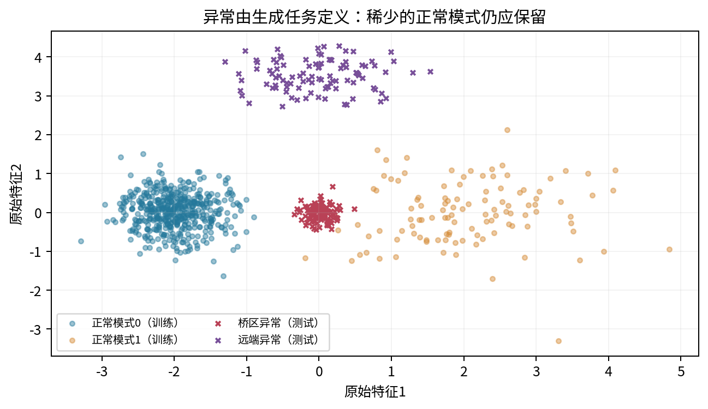
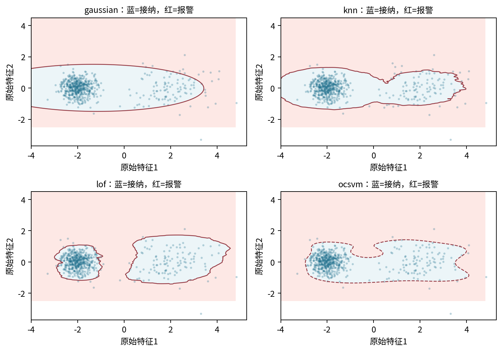
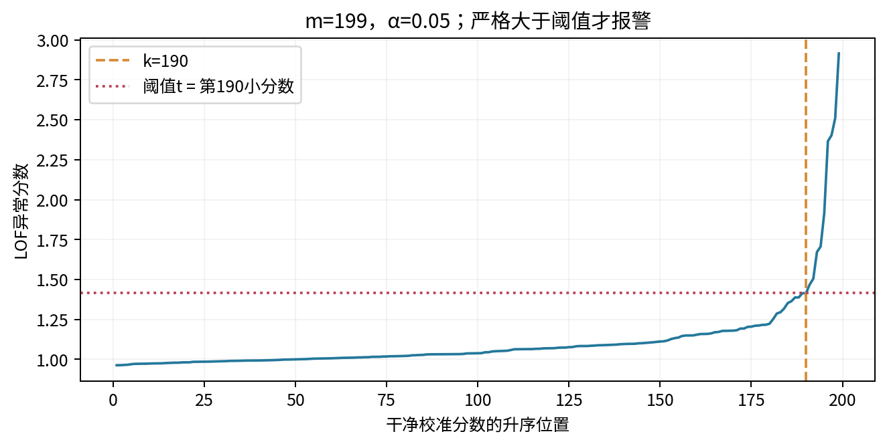
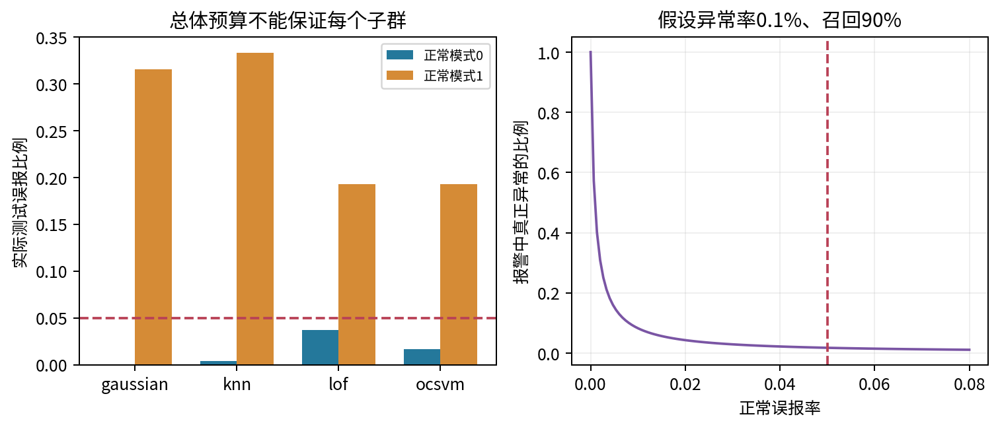
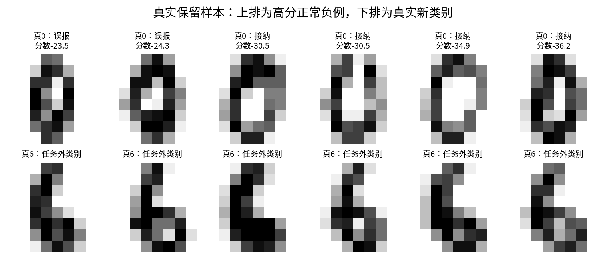

# 第081课 异常检测与密度估计

核心问题：罕见、低密度和有害是否是同一件事？本课把“正常参照是什么”“分数怎样产生”“报警阈值由谁决定”“误报消耗多少资源”连成一条可审计的链。先理解机制，再看公式，最后用可控异常与真实正常负例检验边界。

直接先修：019、023、047、050、057、067、072、074。你需要知道条件概率、训练与测试分离、欧氏距离及高斯分布。本课不要求读者已经部署过监控系统，也不把模型输出直接当作处罚、诊断或安全结论。

## 1 先把“异常”改写成一个具体问题

假设一台设备每分钟记录两个数：振动强度与温度。常见运行方式有两种，一种集中而稳定，另一种使用较少、变化较大。如果我们只看第一种方式，第二种很容易显得奇怪；但只要它是允许的工作方式，就应属于正常。另一方面，一个损坏传感器可能持续输出平均值，这些数非常常见，却没有提供可信测量。出现少不代表错误，出现多也不代表安全。

因此，开始建模前要写清楚参照总体、观测单位和后续行动。参照总体可以是经过核验的正常设备时段；观测单位可以是一分钟、一整次作业或一台机器；行动可以是排队复核而非立即停机。本课的“异常”只表示相对指定正常分布不寻常。是否有害需要任务标签、领域知识和后续调查，不能从几何距离自动推出。

用分类术语表达时，把正常记为负类，把需发现的新模式记为正类。真实负例就是实际收集到、按任务定义应被接纳的正常观测，不是随手生成的随机噪声。误报是正常负例被报警，漏报是任务正例没有被发现。标签方向如果反过来，召回率和误报率都会被错误解读，所以每份结果表都应附上正负类定义。

## 2 新颖性检测与离群检测的训练条件不同

新颖性检测先拿到可信的正常训练集，学习“熟悉世界”的形状，再给从未参与拟合的新点评分。离群检测则面对已经混有可疑观测的训练集，希望同时定位离群点与拟合正常结构。二者都可用于异常筛查，但对训练数据的承诺不同，不能只因为都叫异常检测就交换接口。[1]

考虑十个可疑点集中在远离正常区的位置。对新颖性检测而言，它们再密集也仍然远离正常参考样本。对在混合数据上重拟合的局部方法而言，它们互相成为邻居，可能被视为一个正常小群。训练污染因此改变了问题本身。我们不能简单说“局部密度方法总能发现成团异常”，也不能把污染比例当成已经观测到的事实。

本课主实验明确采用新颖性设置：二维合成训练只有正常样本，真实数据训练只有数字0。额外污染实验把独立生成的桥区样本加入合成训练，研究假设破坏后的表现。污染样本不是从测试集中搬来的，测试异常始终不进入拟合。主实验与污染实验是两项事先声明的对照，不以测试结果为理由反复修改污染设计。

## 3 连续密度不是单个样本的概率

对连续变量，单个精确点的概率通常为零。概率密度p(x)描述单位体积内概率质量的集中程度；落在区域A的概率要对密度在A上积分。密度可以大于1，因为它带有“每单位体积”的量纲。若把厘米换成米，数值密度会变化，不能把两个不同坐标系统中的原始密度直接相比较。

一维变量X的密度为p_X，令Y=aX，且a不为零，则p_Y(y)=p_X(y/a)/|a|。多维线性可逆变换要除以雅可比行列式的绝对值。若同一模型、同一固定可逆变换作用于所有样本，对数密度差一个常数，排序可以不变；若改了特征、模型族或数据处理规则，就不能轻率认为仍等价。

异常分数是人为选择的排序量。本课统一约定s(x)越大越异常。密度方法可用s(x)=-log p(x)，距离方法可直接用远近，边界方法可取正常度的负值。这里的负对数是为了把很小的密度变成可加、易算的数；它不是经过概率校准的“异常发生概率”。分数5不能解释成50%风险，LOF值2也不能解释成有害概率翻倍。

## 4 从椭圆形正常区推导高斯分数

若正常样本近似一个椭圆云团，可用均值向量μ表示中心，用协方差矩阵Σ表示每个方向的变化。x、μ各有d个坐标，Σ是d乘d矩阵。单高斯负对数密度为

$$s_G(x)=\frac12\left[d\log(2\pi)+\log|\Sigma|+(x-\mu)^\top\Sigma^{-1}(x-\mu)\right].$$

符号|Σ|是行列式；上标T表示转置，负一次方表示逆矩阵。最后一项是平方马氏距离：沿本来波动很大的方向移动一点，惩罚较小；沿本来很稳定的方向移动同样距离，惩罚较大。前两项与x无关，但决定完整密度的归一化。只在同一固定Σ内排序时，它们才可以从排序计算中省略。

程序先在正常训练集上计算均值，再用除以n的经验协方差，最后加λI。I是单位矩阵，λ=0.02是事先固定的正则强度。加λI使本来零方差或高度相关的方向也能稳定求解。它修改了模型，所以结果不能被称为未经正则的精确最大似然估计。对于64维数字图像，小样本与恒定背景像素使这项保护尤其必要。

实际实现不直接计算Σ的逆，而是做Cholesky分解Σ=LL的转置，再求解Lz=x-μ，用z的平方和得到马氏距离。三角求解通常更稳定，也容易用独立的SciPy高斯密度实现核验。算法仍必须拒绝空矩阵、非有限值和特征数不一致；不能用会被优化解释器删除的assert充当输入验证。

## 5 一个高斯为什么会接纳两团之间的空白

图1的主要正常模式在左侧，较宽、较稀少的正常模式在右侧。单高斯必须用一个中心和一个椭圆同时概括它们，因而可能把中间没有正常样本的桥区也纳入。此时错误不是阈值排序反了，而是模型族表达能力不足：一个椭圆无法表达“左一团、右一团、中央空”的几何结构。

这说明提高训练似然或放宽协方差并不能自动解决语义异常。我们可以换成混合模型，但新增分量也会带来初始化、退化、模型选择与小群解释问题。第074与082课将继续处理这些问题。本课保留单高斯作为有解释力的失败基线，因为一个失败机制清楚的基线比一个只给总分的复杂方法更有教学价值。

密度与典型性也不能混为一谈。对于高维标准高斯，原点的点密度最大，但多数样本的半径接近维数平方根，而不是挤在原点。概率质量还要乘上对应壳层的体积。因此，“高密度就是最典型”“低密度就是有害”都遗漏了空间体积或任务语义。我们不要求本课解决所有高维异常，只要求报告所选分数具体衡量了什么。

## 6 邻居距离给出局部尺度

记r_k(x)为新点x到正常训练集中第k近邻的距离。附近正常样本多，收集k个邻居只需小半径；附近样本少，需要更大半径。如果维度为d，粗略密度估计为k除以n、单位球体积V_d和半径的d次方之积：

$$\widehat p(x)\approx\frac{k}{nV_dr_k(x)^d}.$$

这只是理解距离与密度关系的局部近似，需要局部密度变化不太快、距离有意义等条件。本课不把该式输出当成已经严格归一化的完整概率密度，而直接把r_k当异常排序分数。k小意味着更局部但波动大；k大意味着更平滑，却可能越过不同正常模式之间的边界。固定k=20是教学方案，不是任何数据集的通用最优值。

训练样本给自己当邻居会得到零距离，因此训练分数和新样本分数的语义不完全相同。本课的KNNRadius只设计给新点评分，不拿训练分数校准阈值。它按256行分块计算距离，再用partition取第k小值。这样避免一次创建过大的距离矩阵，但距离计算仍随训练规模增长，不应把这段教学实现当作大规模近邻索引。

## 7 LOF比较“我”与“我附近的人”

纯邻居半径可能把一个合法的稀疏群整体判成异常。局部离群因子LOF多问一步：这个点的密度，是否显著低于它的邻居的密度？如果整片区域都较稀疏，但相互之间尺度类似，局部相对比较可能比全局阈值更公平；如果一个点靠近密集群却自身缺少支持，它的LOF可能明显大于1。[2]

先为训练参考点o计算第k邻距离d_k(o)。新点x到邻居o的可达距离取两者较大值，避免个别非常近的距离把密度估得无限大：

$$\operatorname{reach}_k(x,o)=\max\{d_k(o),\|x-o\|\},\qquad
\operatorname{lrd}_k(x)=\left[\frac1k\sum_{o\in N_k(x)}\operatorname{reach}_k(x,o)\right]^{-1}.$$

N_k(x)是k个邻居的集合，lrd称局部可达密度，实质上是平均可达距离的倒数。LOF再计算邻居密度相对于当前点密度的平均比值：

$$\operatorname{LOF}_k(x)=\frac1k\sum_{o\in N_k(x)}\frac{\operatorname{lrd}_k(o)}{\operatorname{lrd}_k(x)}.$$

大致为1表示局部尺度相似；大于1表示当前点更稀疏。它仍不是概率。边界、小样本、不同群体比例与距离集中都会影响结果，也没有每个正常子群误报相同的保证。实际库还要处理重复点和数值稳定，本课使用经过维护的实现，同时用手算与接口检查理解它的含义。

scikit-learn默认LOF用于训练集内离群检测。要给后续新点评分，必须在拟合前设置novelty=True。此时score_samples只能用于未参加拟合的数据，不应拿同一训练行来假装新颖性评价。库返回的是正常度方向，本课显式取负，让四种方法都遵守“越大越异常”。相同符号约定是跨方法实验的一项必要验收。

## 8 One-class方法学习边界，不必估计完整密度

密度方法问“这个位置有多少概率质量密度”，one-class方法更接近问“哪些区域应被接受为参考分布的支持区域”。核一类支持向量机把样本映射到特征空间，尝试用一个边界包住大部分参考样本，同时允许少量违反边界的点。它不需要提供所有可能异常的代表性训练样本。[3]

其常见原始目标可以写为

$$\min_{w,\rho,\xi}\ \frac12\|w\|^2+\frac1{\nu n}\sum_{i=1}^{n}\xi_i-\rho,
\quad w^\top\phi(x_i)\ge\rho-\xi_i,\quad\xi_i\ge0.$$

w决定特征空间中的方向，ρ是边界位置，ξ_i是第i个训练样本的松弛量，ν在0与1之间控制约束折中，φ是由核隐式表示的特征映射。第一项防止边界过度复杂，第二项惩罚违反，减去ρ鼓励把分界推开。先理解这些角色，比死背求解器公式更重要。

本课使用RBF核，其相似度为exp(-γ乘两点平方距离)。γ大时相似性衰减快，边界可更曲折；γ小时不同位置更容易被视作相近。ν对训练错误比例与支持向量比例有理论关系，但它不是未来误报率的直接承诺。我们仍需独立正常校准集。不能把ν=0.05写成“部署后正好5%误报”，也不能把库默认的decision_function零点当作业务预算已被验证。

## 9 从分数到动作，中间还差一个阈值

给定评分函数s和阈值t，我们采用s(x)>t时报警。提高t会减少报警，通常同时减少误报和召回。分数排序与决策阈值应分开评价：一个模型可能排序很好，但为了极低误报预算，只有少数异常能越过阈值；另一个模型可能在高误报区域表现不错，却没有实际运行价值。

训练集决定评分函数，干净校准集决定正常分数尾部，测试集只用于最后报告性能。若先看测试异常，再挑一个召回最高的阈值，测试集已经参与选择，后续分数就偏乐观。即使没有把测试标签传入fit，只要人看过结果后反复改规则，也属于选择信息进入了流程。

本课所有超参数固定，四种方法均完整报告，不以测试表现宣布最终部署选型。若真实项目必须选一个方法，应另留开发数据或用嵌套验证，选择结束后再用未触碰的干净校准集生成阈值。反复使用同一校准集筛选几十个方法，再报告其中最好者的单模型保证，同样需要额外控制选择影响。

## 10 次序统计量校准：手算一条有限样本规则

设有m个独立正常校准分数，把它们由小到大排为s_(1)到s_(m)。目标边际误报率为α，本课使用

$$k=\left\lceil(m+1)(1-\alpha)\right\rceil,\qquad
 t=s_{(k)}.$$

尖括号样的上取整符号表示向上取最近整数。当k大于m时，定义阈值为正无穷，这意味着有限分数均不报警。不是程序坏了，而是样本太少，无法在不附加分布假设的情况下支持如此严格的预算。对m=199、α=0.05，k=190，因此取第190小的正常分数。

为什么公式里是m+1？把未来一个正常分数与m个校准分数一起考虑，在固定评分函数且这些正常样本可交换的条件下，未来点在m+1个位置中的秩均匀。严格大于第k个校准分数，对应最多m+1-k个高秩位置，因此误报概率不超过(m+1-k)/(m+1)，也就不超过α。并列分数使用严格大于会更保守。[4]

这是关于随机校准集与新正常点的边际保证，不是对当前这一份校准集条件下真实误报率的逐次保证，也不是每一天、每台设备或每个子群的保证。它需要正常校准点与未来正常点具有可交换性。发生时间漂移、重复个体依赖或选择偏差时，秩均匀论证可能失效，不能只保留公式而删除条件。

## 11 误报预算要换算成实际工作量

假设每天有N条观测，真正异常比例为π，正常误报率为f，异常召回率为r。预计误报数约为N(1-π)f，预计真报警数约为Nπr。这里N是观测量，π是基率，f与r是条件比例；相乘得到的是期望工作量，不是每天固定会出现的整数。

若N=10000、π=0.001、f=0.05、r=0.9，则大约499.5个误报对应9个真报警，报警精确率约为9除以508.5，即1.77%。召回90%听起来很高，但复核队列里绝大多数仍是误报。这不是贝叶斯公式出错，而是少见异常遇到大量正常流量的必然结果。

所以“5%预算”在本课只是便于看机制的预声明数值，绝非实际系统推荐值。生产环境可能只能承受每天十个误报，必须把容量换算成允许的f，并核对校准样本量是否足够。还需考虑重复报警去重、分组告警、复核时长以及漏报成本。阈值不是纯算法超参数，它把统计模型接到了资源与责任上。

## 12 评价指标各自回答什么

误报率FP除以正常测试数，回答正常流程被打扰的比例；召回率TP除以异常测试数，回答指定异常机制被发现多少。AUROC衡量一对随机异常与正常的排序能力，不对应某个固定阈值。平均精确率强调高分端的查准查全变化，但受测试异常比例影响，不能把人为平衡测试集的平均精确率直接解释为真实报警队列的纯度。

本课同时报告原始计数与比例，并给正常误报率的Wilson近似95%区间。区间用于提示有限测试样本的噪声，不是前节校准保证的另一个名字。43个正常测试数字中零误报仍有相当宽的上界，因此“0/43”不能改写为“误报风险为零”。只有同时写分子、分母和不确定性，读者才能判断证据规模。

还应按异常机制拆召回，按正常模式拆误报。合成实验中，单高斯发现全部远端异常，却一个桥区异常也没发现，总召回仍有50%。如果只看这个平均值，就会错过模型接纳中央空白的关键机制。相似地，总误报6%可能由某个稀少正常群承担31.6%的误报，整体达标与局部公平性是不同问题。

## 13 读懂本次合成实验，而不追逐冠军

合成正常训练600行、干净校准199行、正常测试300行，异常测试200行，其中桥区与远端各100行。所有随机数由固定种子81021产生，原始数组及生成哈希可重建。标准化器只在600个正常训练样本上拟合，再原样作用于其他集合；这避免测试分布影响距离单位。

实测单高斯误报18/300、召回100/200；邻居半径误报20/300、召回101/200；LOF误报20/300、召回199/200；一类支持向量机误报15/300、召回105/200。测试误报有的高于5%并不立即否定有限样本边际论证，因为一次随机测试比例存在波动，且保证不是当前固定校准集的条件上界。

这组结果支持一个限定结论：在当前二维机制、固定超参数和样本量下，局部相对密度更容易发现桥区异常。它不支持“LOF全面优于其他异常检测器”。改变正常群间距、邻居数、维数、异常类型或训练污染，都可能改变结果。研究者应解释差异在哪里出现，再提出独立的新实验，而不是从一次排行榜推断普遍规律。

## 14 污染实验解释为什么“自动估计污染率”危险

污染对照另生成67个桥区点，并加入600个正常训练点，总污染占67/667，约10.0%。这批数据并不与异常测试共享行。四种模型按相同预声明超参数重拟合，仍只用原来的干净校准集合校准，但必须重新打分：模型变了，原阈值的量纲与尾部关系也变了，不能机械沿用旧t。

污染可以让原本陌生的桥区变成熟悉区域。局部方法可能给污染群提供彼此支持，高斯可能改变中心或协方差，一类边界也会移动。这里的污染实验旨在研究训练假设破坏，不是教我们把所有高分点删掉后就宣布数据干净。删点规则如果由模型自身决定，可能把少数正常模式一起消除，造成自我强化。

实际项目中，contamination常常只是控制训练阈值的参数或经验假设，不是模型测量出来的真实坏样本比例。它既不告诉你某个高分点有害，也不保证未来误报不超过同一个数。本课绕开默认分类阈值，显式使用独立正常校准，正是为了把这种混淆暴露出来。

## 15 真实负例审计：数字0也有很多写法

真实实验使用scikit-learn随包Digits，它保存1797个8乘8手写数字图像，每个像素是0到16的整数。来源为UCI光学手写数字数据的测试部分；课程把这份历史数据重新分为自己的训练、校准与测试，不能把这些新划分冒称为UCI原始评估协议。[5][6]

任务预先规定数字0为允许类别，数字6为新颖类别。178个真实0被打乱后分为训练90、校准45、测试43；181个真实6只作异常测试。像素统一除以16是预先固定的单位转换，不从任何集合估计均值或方差。四种方法均未用数字6拟合、选超参数或校准阈值。

45个正常校准点在α=0.05时取第44小分数，对应边际上界2/46，约4.35%。实测高斯误报2/43、召回181/181；LOF误报0/43、召回180/181。这是一个相对容易、特定类别对的任务。真实负例中一些0笔画位置、闭合程度不同，模型会把它们打高分。它们是正常多样性的证据，不应被称作坏数据然后悄悄删除。

## 16 真实结果的边界要主动写出来

我们没有当前设备部署数据，没有书写者分组标识，也没有跨摄像头、跨国家或跨年份测试。这份数据的多个图像可能共享书写习惯，简单随机分割不能保证未来用户级泛化。二维合成机制完全独立同分布，但真实数字只有一个历史样本集合，两者的证据强度与适用条件不同。

数字6被设为新颖类是一种任务定义，并不意味着它在现实中罕见或危险。若系统以后允许数字6，应该修改正常定义与参考数据，而不是把检测到6当成成功。若未来出现模糊的0、其他数字、旋转或噪声，本课测试没有自动覆盖。测试外机制需要新数据、新评估，不能靠现有AUROC1.0作保证。

有标注异常且标签代表部署目标时，监督分类器可能更合适；只有正常参考而异常种类不断变化时，新颖性方法更有价值；训练集无法保证干净时，应明确转入离群检测或鲁棒估计，并调查清洗标签的来源。方法选择先服从数据条件，再考虑算法名字。

## 17 从课堂算法走向可靠系统

运行中先检查输入格式与单位，再打分，最后应用冻结阈值。缺失字段、无穷值、图片尺寸改变都应触发明确的数据质量错误，不应默默得到“正常”。分数分布突然漂移时，先核查数据管线与参照总体，不能自动把阈值抬高来消除报警。抬高阈值可能掩盖真正的系统变化。

更新参考模型与阈值应有版本号、数据时间范围和回滚方案。若人工只审核高分报警，就只能观察被选择样本的标签；由此估计总体召回或低分区错误会产生选择偏差。应保留适当的独立抽查机制。对代价高或影响人的决定，需要复核、申诉与任务授权，异常分数本身不应直接决定惩罚。

本课代码把评分、校准、评价分成独立函数，正是为了让这些职责不在一个fit_predict调用里消失。15项测试覆盖高斯参考、邻居手算、秩边界、并列分数、极小校准集、输入拒绝、真实划分和“改变测试异常不能改变阈值”。这些测试不能证明所有统计假设成立，但能防止一批可避免的实现与协议错误。

## 18 自测题与迁移练习

1. 用自己的话区分罕见、低密度、新颖与有害，并各给一个反例。
2. 对正常校准分数1、2、3、4、5和α=0.34手算k、t以及分数4与5的报警结果。
3. 为什么m=9、α=0.05只能给出正无穷阈值？需要怎样改变证据或目标才有非平凡规则？
4. 假设每天两万条观测、异常率0.2%、召回80%、误报0.5%，计算真报警、误报和精确率。
5. 解释单高斯漏掉桥区异常的原因，并说明为何增加混合分量不是免验证的修复。
6. 分别说明邻居半径与LOF对稀疏正常群的可能行为，指出LOF仍会失败的条件。
7. 为什么不能把ν或contamination直接写成未来误报率？
8. 从真实正常图像中选一个高分0，写出观察到的形态差异与不能推出的语义结论。
9. 设计一项不污染当前测试集的新实验，检验你的方法在正常分布漂移后是否仍守住预算。

结课底线：每个报警都应能追溯到正常定义、评分方向、训练版本、干净校准数据与决策预算。任何一个环节不清楚，都不应仅凭高AUROC或漂亮边界图声称异常检测已经可信。

## 参考入口

[1] scikit-learn，新颖性与离群检测用户指南。[2] scikit-learn，LocalOutlierFactor接口及LOF机制说明。[3] scikit-learn，OneClassSVM接口。[4] Angelopoulos与Bates，共形预测导论，有限样本秩校准思想。[5] scikit-learn，load_digits数据说明。[6] Alpaydin与Kaynak，UCI Optical Recognition of Handwritten Digits，CC BY 4.0。可点击链接与实际核验范围见sources.md；推导、数据划分与实验叙述为课程原创。
