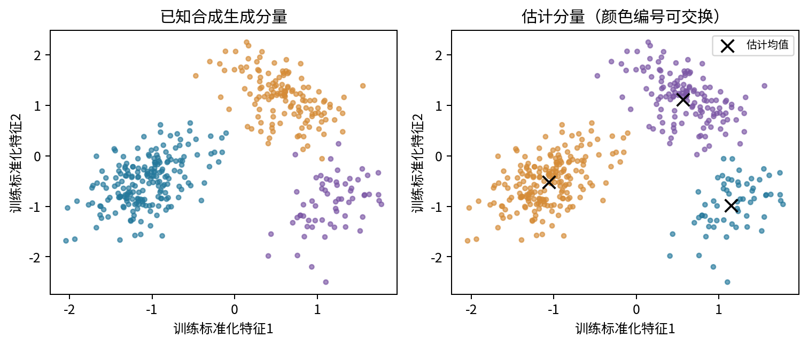
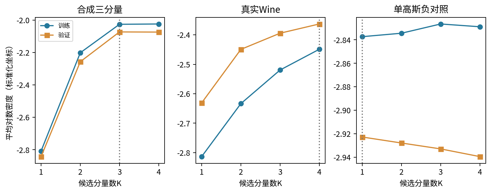
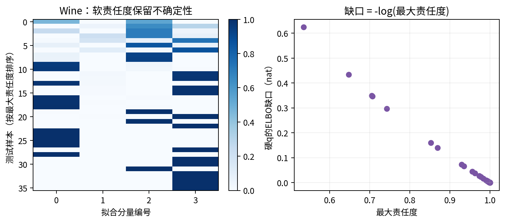
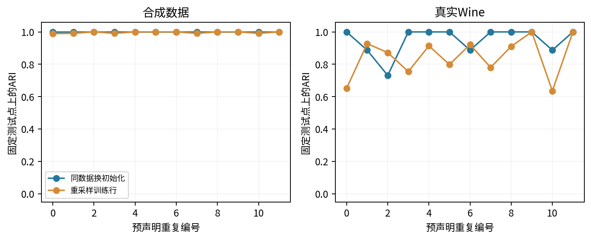
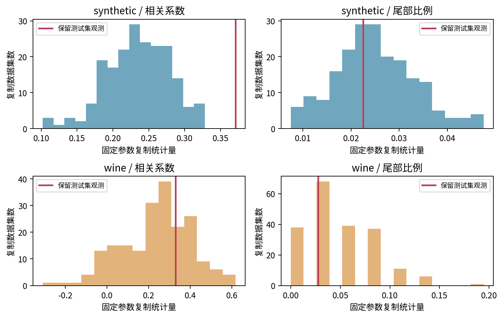

# 第082课 概率与隐结构阶段项目

项目问题：一个高斯混合模型给出的隐结构，究竟在哪些层面值得相信？我们用同一条研究流程连接合成真值恢复、真实Wine数据、单高斯负对照、精确责任度核验、硬近似误差、稳定性及固定参数预测复制检查。答案可以有亮点，也必须容纳失败与未识别的部分。

直接先修：007、025至026、050至051；本项目按选题补修073、074、075及077的相关内容。不要求先修全部概率推断算法。本课不新增一个炫目的模型，而是把已经学过的工具变成一份可复核的小型研究报告。

## 1 把“发现结构”拆成可以失败的命题

一张彩色散点图很容易让人觉得看到了类别。但“算法分成三组”“有三个统计密度分量”“现实中存在三种生成机制”是三个不同命题。算法可以按要求把一团数据分成三组；多个高斯也可以只是用来逼近一个弯曲分布；即使拟合密度真的需要三项，也还需要领域证据才可赋予每项机制含义。

本项目把大问题拆成四个层次。第一，概率计算是否实现正确，包括密度归一化、责任度和数值稳定。第二，在已知生成真值的合成世界中，模型能否恢复我们明确定义的参数和划分。第三，在没有隐结构真值的真实数据中，模型对未参与训练的数据有没有预测能力。第四，改变初始化、训练样本或复制数据后，结论是否稳定，以及哪些统计特征解释得不好。

每一层都要指定能推翻自己的观察。例如独立密度实现与库结果不一致会推翻实现正确性；匹配后的均值偏离真值会削弱参数恢复；验证与测试似然不佳会削弱预测；重采样后划分大变会削弱结构稳定性。把成功标准写在看结果之前，负面结果才不必被隐藏，也不至于一遇到失败就换一套指标。

## 2 研究对象与三个互补世界

第一个世界由我们自己定义：二维三分量高斯混合。先抽取一个隐藏类别Z，再从该类别的高斯分布抽取观测X。因为生成程序保存了Z、均值、协方差和权重，我们可以检查恢复误差，而不仅是看图。训练600、验证200、测试400行彼此独立，固定随机种子82021保证可重复。

第二个世界是Wine真实历史数据，共178个酒样，原始数据有13个化学特征与品种来源标签。本项目在看结果前固定只用酒精与黄酮两个特征，按原始行号随机划分106个训练、36个验证和36个测试。标签只在最终外部审计出现，未参与标准化、拟合、分量数选择与阈值设计。[1][2]

第三个世界是无混合的二维标准高斯，使用相同600、200、400的划分。这是负对照：如果方法无论输入什么都宣布“发现多群”，我们就应怀疑选择过程。当前负对照选中一个分量是有用证据，但一次结果不能证明选择器永远不多分。若要估计误发现频率，需要预先计划许多独立重复，而不是只保存最符合期待的种子。

## 3 让数据职责成为研究设计的一部分

训练集负责估计参数，验证集负责在预声明候选K=1、2、3、4之间选择，测试集负责一次保留评价。所有标准化参数只从训练集得到。我们明确不在选完K后把验证集并回去重拟合，这样冻结模型的来源更加简单；若以后需要重拟合，必须重新记录模型版本并保持测试职责不变。

对每个特征，用训练均值和训练标准差作线性标准化。这样酒精与黄酮的数值尺度可比较，协方差正则强度也有清楚的坐标语境。验证与测试都使用同一变换。原始坐标和标准化坐标的密度相差雅可比项，本课所有似然表统一报告标准化坐标上的平均对数密度，不能与其他单位下的值直接排名。

标签封存是一个信息约束，而不是“训练函数没有y参数”就完成了。若先看品种颜色，再选择最容易把颜色分开的两个特征、K或随机种子，标签已经通过人进入建模。本项目预声明两列与候选集合，外部ARI仅作为冻结结果的对照，不能反向驱动同一次实验的改动。新想法可以产生新实验，但要诚实更换验证协议。

## 4 从生成机制写出混合密度

设隐藏变量Z取1至K的整数，权重π_k表示选择第k个分量的概率，必须为正且总和为1。给定Z=k，二维观测X来自均值μ_k、协方差Σ_k的高斯。先把不同隐藏状态的联合密度相加，就得到观测密度：

$$p_\theta(x)=\sum_{k=1}^{K}\pi_k\,\mathcal N(x\mid\mu_k,\Sigma_k).$$

θ是所有权重、均值与协方差的统称。求和符号说明我们不知道当前观测由哪项产生，因此把每种可能的权重都纳入。它不是先给样本硬分一类再只算那一项。即使最后为了展示画出颜色，密度计算仍必须保留所有分量贡献。

二维全协方差矩阵包含两个方差和一个独立协方差，允许椭圆旋转。K个二维全协方差高斯的自由参数数目为K乘以五再加K减一，即6K-1。这个计数用于理解复杂度和BIC；本课实际选型依据是验证平均对数密度，BIC只作附加记录，不把两个标准混合成事后挑选有利答案的工具。[3]

## 5 对数似然衡量密度预测，不等于真结构恢复

训练目标为所有训练观测对数密度之和。因为独立样本的联合密度相乘，取对数后变成相加。除以样本数得到平均对数密度，方便不同大小数据集报告；同一个数据集上二者的最优参数相同。

$$\ell(\theta)=\sum_{i=1}^{n}\log\left[\sum_{k=1}^{K}\pi_k\mathcal N(x_i\mid\mu_k,\Sigma_k)\right].$$

外层对样本i求和，内层对隐藏状态k求和，顺序不能随便交换。一个模型可能用额外分量修补尾部或局部偏斜而提高密度预测，却不对应更多现实类别。训练目标更高还可能来自过拟合，尤其当一个分量围住极少数样本并把协方差缩得很小时。

本项目使用reg_covar=0.03，在每个估计协方差的对角线上加入固定正数，避免无限尖峰与奇异求逆。此时我们报告的是该正则化算法得到的模型，不声称找到无约束似然的全局最大值。正则强度在标准化坐标中定义，换特征单位或维数时不能不加说明地沿用其含义。

## 6 责任度是给定参数后的离散后验

观察到x_i后，第k个分量对它的责任度为

$$r_{ik}=P(Z_i=k\mid x_i,\theta)=\frac{\pi_k\mathcal N(x_i\mid\mu_k,\Sigma_k)}{\sum_{j=1}^{K}\pi_j\mathcal N(x_i\mid\mu_j,\Sigma_j)}.$$

分子是该分量对观测的联合支持，分母是所有分量支持之和，因此每个样本那一行责任度加起来为1。分量的先验权重π_k大，不代表每个x都更可能属于它；观测位置与协方差同样参与判断。接近两个分量交界时，责任度可能分散，这正是硬颜色图容易隐藏的信息。

在给定θ时，有限K的求和可以精确完成，所以主GMM路线不需要MCMC或连续变分算法来计算Z的后验。这里“精确”针对给定模型的离散求和，不代表参数θ本身没有估计误差，也不代表模型结构正确。把这个责任度称为完整贝叶斯后验是不准确的，因为我们并没有为θ求后验分布。

EM的E步用当前参数计算这些责任度，M步用软权重重新估计权重、均值与协方差。它可能到达不同局部解；多个初始化有助于减少坏局部解，但没有全局最优证明。候选模型用5次初始化，稳定性诊断另用单次初始化多种子，以显式暴露优化敏感性，而不是把多次尝试中不喜欢的结果删除。[4]

## 7 独立实现为什么使用log-sum-exp

若x离所有分量都很远，直接计算各高斯密度可能下溢为0，随后责任度出现0除以0。我们先计算a_k=log π_k+log N_k(x)，再用log-sum-exp得到总对数密度：

$$\log\sum_k e^{a_k}=a_{\max}+\log\sum_k e^{a_k-a_{\max}}.$$

a_max是这些数的最大值。减去它后所有指数输入都不大于0，至少有一项为1，计算更稳定。责任度由exp(a_k减去总对数密度)得到。对一个极端远尾点，普通密度可能不可表示，但对数密度和归一化责任度仍可保持有限。

独立函数log_joint和responsibilities不调用库的私有高斯计算路径，而通过Cholesky分解计算每项，再与GaussianMixture的score_samples和predict_proba对照。独立并不意味着完全无依赖：NumPy和SciPy仍承担线性代数与基础函数。我们同时加入手算单分量、标签置换、非正定协方差拒绝和极端尾部测试，使对照不只停留在“同一个函数调用两遍”。

## 8 可识别性：交换标签不会改变观测世界

若同时交换混合权重、均值和协方差的编号，所有观测密度保持不变。例如把原来的分量1叫作3，把3叫作1，只是改名。两个运行得到不同的颜色或编号，因此不构成科学分歧；只有在允许这种置换后仍有差异，才可能反映估计或优化变化。

对于合成真值恢复，我们用匈牙利算法寻找估计均值与真均值的一一匹配，使总平方距离最小，再报告匹配后的均方根距离。这个步骤只在估计K等于真K时有明确一一对应意义。若选出不同K，程序返回“不能强制匹配”，而不是偷偷复制或合并分量制造一个漂亮误差。

更深的限制是，两个分量若参数相同，它们的权重如何分配不可从观测区分；分量高度重叠时，有限样本很难精确恢复；过多分量也可用不同方式近似同一个密度。一般可识别性结论需要条件，不能把“只差标签”当成所有真实数据的默认保证。对于Wine，我们没有真正的高斯分量标签，因此不能计算所谓真实均值恢复误差。

## 9 选择K：预测准则与科学解释分开

每个候选模型只在训练集拟合，在验证集上计算平均对数密度，选择最高者；若完全相等，取较小K。这是一条在观察结果之前写好的规则。训练BIC同时存入结果，供读者比较复杂度惩罚，但它不参与最终选K。验证集小也会使选择不稳定，因此“选中”不是“证明”。

本次合成数据选K=3，验证平均对数密度约-2.07249，K=4约-2.07349，差距很小。虽然恰好选到真实分量数，这个微小差异不应被描述为确定证据。测试集上模型平均对数密度约-1.99578，已知真模型约-1.95863，两者差异反映有限样本估计、正则化与偶然测试组成等因素。

Wine选择K=4，而训练BIC更偏好K=2，这不是代码一定出错，而是两个准则衡量方式不同且数据很小。我们应如实报告分歧，再讨论验证噪声与密度逼近目的，不应事后挑出与三个品种标签一致的K=3作为“发现”。单高斯负对照选择K=1，为流程不会机械输出多个群提供一项有限证据。

## 10 合成真值恢复是必要的起点，不是现实结论

合成测试集的ARI约0.98455，匹配后的标准化均值均方根距离约0.07760。ARI是经过随机一致性调整的划分相似度，等于1表示两种划分完全一致且不受标签编号交换影响。它检查样本之间是否同组，不检查均值、协方差或概率校准，因此本项目还同时报告参数误差与测试密度。

真模型也可能不能从x无误恢复抽到的Z，因为不同高斯支持区域重叠。隐藏来源是随机变量，观测相似不意味着来源相同。若研究问题是恢复生成标签，必须认识到某些样本具有不可约的不确定性。把所有剩余错误归因于优化器会混淆数据机制与计算误差。

合成实验的优势是控制机制与知道真值，弱点是它可能太像模型假设。我们故意选择模型族匹配的三高斯世界，用于验证链条能工作，但不能由此推断真实化学分布一定是高斯混合。更有挑战的后续实验可以加入偏斜、重尾、弯曲流形或测量误差；这些都应作为新的预声明机制，而不是在当前测试集上反复挑选好看的变体。

## 11 用一个可精确核验的近似展示推断误差

完整责任度保留每个分量的概率，硬近似q则只把最大责任度的分量设为1，其余设为0。这种近似计算便宜、展示方便，却把边界不确定性压没了。为了量化损失，我们不用口头说“硬分配差一点”，而是计算同一模型内的变分下界缺口。

对任意离散q，证据下界为E_q[log p(x,Z)]加上q的熵。硬q只有一个状态，因此熵为零，下界就是最大log联合密度。精确对数证据减去这个下界恰好等于

$$\log p_\theta(x)-\operatorname{ELBO}(q_{\rm hard})
 =-\log\max_k r_k(x)
 =\operatorname{KL}(q_{\rm hard}\|r).$$

KL是从近似q到精确离散后验r的相对熵，单位为自然对数单位nat。若最大责任度为0.5，缺口为log2，约0.693；若为0.99，缺口约0.01005。注意方向不能反过来：r若在多个分量有正质量，而q把其中一些设为零，则KL(r||q)可能无穷。

这是一项真正的近似误差对照，但只涉及给定拟合参数后的离散Z。它不涵盖参数后验近似、模型选择不确定性或EM优化误差。把不同误差来源分开，才能知道下一步该改模型、改估计还是改推断方法。当前合成平均缺口约0.00926，Wine约0.07537，说明后者的硬分配丢失了更多分量不确定性。

## 12 目标接近不代表所有后验问题都接近

两个模型的平均对数密度可能几乎相同，却在某些边界点上给出不同责任度。平均目标可以由多数容易样本主导，而你关心的可能恰好是少数模糊样本。同样，平均硬近似缺口很小，也不能保证每个样本的缺口都小。因此程序同时输出最大责任度低于0.8的比例，并保留整张责任度图。

熵H(r)=-Σ r_k log r_k描述单个样本的分量不确定性。它在单一分量概率为1时为零，在K个分量等概率时为log K。熵只描述当前模型内部的不确定性，不包括模型完全错设时的无知。一个错误而自信的模型仍可能给出接近零的熵，所以“责任度很尖”不是可信发现的充分条件。

此外，分量数量改变时熵的上界也改变，不能不加解释地把不同K的平均熵直接当作谁更好。低熵可能来自分量分得更开，也可能来自不合理的过度自信。我们把熵、密度、真值恢复和稳定性并列，而不是将它们压成一个缺乏解释的总分。

## 13 重启稳定性与重采样稳定性回答不同问题

重启稳定性固定同一训练样本，只改变EM初始化种子。它主要观察优化地形对结果的影响。重采样稳定性在训练集中有放回抽取同样数量的行，再重新拟合，观察有限样本扰动引起的变化。后者同时含有样本与优化变化，因此不能简单把两条曲线差值命名为纯粹的某一种误差。

每个重复都在同一组固定测试点上预测，再与参考模型划分计算ARI。若直接比较不同重采样训练行上的标签，就会把不同对象当同一对象，得到没有意义的稳定性指标。我们保留12个预声明种子，不丢掉低ARI运行，也不把这种诊断当成又一次选择测试最优模型的机会。

Wine同训练不同初始化的最低ARI约0.731；重采样最低约0.635，最高为1。合成数据重采样ARI大多接近1。这个差异提示，在当前特征、样本量与K下，Wine结构解释对有限样本更加敏感。它不意味着所有真实数据都不稳定，也不意味着合成世界已经恢复所有统计特征。稳定性是证据的一条维度，不是终点。

## 14 固定参数预测复制检查怎样做

拟合模型后，从估计的混合分布反复生成与测试集大小相同的数据集。每份复制数据都计算两项预先声明的统计量：两个标准化特征的相关系数，以及至少一个坐标绝对值超过2的样本比例。前者检查线性关联，后者检查边缘尾部质量，二者不能覆盖全部分布特征。

生成200份复制数据，得到这两项统计量的经验分布，再把保留测试集的真实统计量画进去。若观测值落在复制分布很不常见的位置，就提示模型没有解释好该特征。代码报告复制统计量的2.5%与97.5%分位区间，并给相对复制中位数的描述性尾部比例，使用加一修正避免报告机械零值。

这些尾部比例不是经过完整选择校正的显著性检验p值；区间也不是参数可信区间。统计量是预声明的，但模型经过训练与选择，复制次数有限，实际数据可能有依赖。我们使用它定位差异，随后设计新实验，不把它当成“模型通过所有检验”的证书。

## 15 为什么它不是完整后验预测检查

主GMM路线只拟合一个参数点估计θ帽，并从p(x新|θ帽)抽样。完整贝叶斯后验预测应把参数后验的不确定性也积分进去：

$$p(x_{\rm new}\mid D)=\int p(x_{\rm new}\mid\theta)\,p(\theta\mid D)\,d\theta.$$

D代表用于贝叶斯更新的数据，p(θ|D)是参数后验。积分意味着不同可能参数都贡献新数据预测。我们的EM点估计没有提供这个参数分布，所以不能把固定参数复制包装成完整后验预测。重采样的模型集合也不是自动等于贝叶斯后验样本，因为它的生成规则、概率含义与先验都不同。

完整后验预测可能给出更宽的复制统计量变化，但也不是保证修复错设；若模型族缺少真实机制，积分再精确也无法凭空补上。第078与079课的近似推断工具可以用于扩展这个项目，但必须先定义参数先验、目标后验、采样或变分诊断与额外计算预算，不能只是把名词替换成“贝叶斯”就升级结论。

## 15.1 一个真正完成参数积分的共轭基准

为了不只停留在术语区分，本项目另外对单高斯负对照的原始第一维完成一个解析可验的贝叶斯预测实验。这里模型明确为Y_i给定θ独立服从N(θ,1)，观测噪声方差1来自已知合成机制；先验θ服从N(0,4)。这是一项单独的标量模型，不把Wine或主GMM参数假装成已完成贝叶斯推断。

设训练样本量n、训练观测和为Σy_i，则后验仍为高斯，后验方差v_n和均值m_n为

$$v_n=(n+1/4)^{-1},\qquad m_n=v_n\sum_{i=1}^{n}y_i.$$

先验均值为零，所以均值分子中没有额外先验项。训练600行后，m_n约-0.02305，v_n约0.001666。每一份完整后验预测复制先从N(m_n,v_n)抽取一个θ，再让整份400行复制数据共享该θ。固定参数对照则所有复制都固定θ=m_n，只重新抽观测噪声。程序真实生成5000份数据集，分别计算复制样本均值。

为什么要共享θ？同一总体的400个观测受同一个未知均值影响。由全方差公式，复制均值的完整预测方差为v_n+1/400，固定参数版本只有1/400。若错误地为每行重新独立抽θ，则会把参数不确定性除以400，得到另一个不符合模型的数据生成过程。

本次完整预测均值方差解析值约0.004166，固定参数为0.0025，比值约1.66639；蒙特卡洛估计约0.004294与0.002591。完整95%预测均值区间约[-0.14955,0.10345]，固定版本约[-0.12105,0.07495]，保留测试均值约-0.00329落在两者内。这里真正展示了参数不确定性如何扩大整份新数据的预测变化，而不是仅把bootstrap或点估计复制改名。

这项共轭基准可核验“先抽参数、再抽数据”的机制，但不能修复主GMM中的参数后验缺失。两者在结果JSON中使用不同字段、在Notebook分开执行，报告也必须区分。若把该标量成功外推成GMM完整后验预测已完成，就再次越过了证据边界。

## 16 本次复制检查揭露了什么

合成模型虽然ARI约0.985、均值恢复较好，但测试相关系数约0.37091，固定参数复制的95%区间约0.13922至0.31449，观测值在区间之外。尾部比例0.0225则落在复制区间0.0100至0.0425之内。不同证据同时成立：大部分分组正确，不代表这一份拟合模型解释了每个保留统计量。

这个相关差异可能来自有限训练估计、有限测试抽样、权重与协方差误差或固定参数检查未计入参数不确定性。当前证据不能唯一归因。因为真机制已知，我们可以在新的实验中重复许多独立数据集，比较真参数与拟合参数复制分布，逐项拆解。当前报告先把差异保留下来，不修改种子使红线回到区间内。

Wine测试相关系数约0.32963、尾部比例约0.02778，都落在对应复制区间中。样本只有36行，区间很宽，检验辨别能力有限。这只能说两项统计量未显示明显冲突，不能说真实分布被证明为四高斯混合，更不能证明四个现实生成类型。通过一个宽松检查与具有强证据是两种不同状态。

## 17 真实标签很一致，为什么仍不能宣布发现真类别

本次Wine测试集外部品种ARI为1，看起来十分漂亮。但选中模型有四个分量，36个测试点只占用了其中三个，计数分别为11、0、10、15。一个分量在测试集中没有成为最大责任度类别，并不意味着它没有密度贡献；也不意味着全体178行或未来酒样都会恰好分成三个品种。

真实标签是已有品种来源的外部分类信息，不是“每个观测由哪一个高斯产生”的真值。ARI为1只表示这36点的硬划分与标签分组一致，允许编号交换。它不证明每个高斯分量对应一个唯一品种，更不证明品种是造成两项化学测量差异的唯一机制。有限样本、特征选择和历史数据范围限制仍然存在。

同一批真实数据的bootstrap ARI最低约0.635，也提醒我们漂亮的单次标签一致性可以与结构不稳定并存。我们不因此删除ARI，而是把它放到恰当位置：一个保留样本上的外部一致性结果，与密度预测、优化敏感性及复制检查共同阅读。报告的可信度来自这些相互约束，不来自最亮眼的一个数字。

## 18 研究边界与适用场景

Wine数据来自有限地区与品种的历史化学测量，不能代表当前所有葡萄酒或测量仪器。我们只用两项特征，丢弃其他信息是为了让推导与图形可解释，不是声称这两项足以完成所有识别任务。当前随机分割没有时间、产地批次或生产商外部测试，因此不能宣称跨产区泛化或因果识别。

高斯混合适合用作平滑密度逼近、软分组、缺失潜在来源的探索与后续假设生成。若目标是预测已知品种标签，应比较监督基线并使用适合该任务的评价；若目标是找真实化学机制，需要结合实验设计、测量误差与领域知识；若目标是概率推断，需要明确是否只求Z还是也求θ的后验。一个项目应围绕一个主问题，不应借同一张图承诺所有目标。

## 19 可以审计的研究交付物

数据文件保留合成Z、参数真值、真实数据原始行号及选取特征。generation.json记录字节数与SHA256，方便确认重建一致。experiment-result.json保存候选目标、最终K、测试值、恢复误差、责任度误差、每个稳定性重复与复制检查，不只留下摘要。所有数字来自实际运行，没有手填结果。

17项单元测试在普通及优化解释器下执行，覆盖独立高斯密度、标签交换不变性、极端远尾、硬q缺口恒等式、匹配、非法参数、划分互斥、标签不参与选择、复制可重复和采样矩等。Notebook从新的Python进程按顺序执行，每个代码单元保留真实输出。执行方式与未测试的系统边界会写在verification.json，不把脚本运行冒称成浏览器交互验证。

## 20 结课问题：把结论写到证据够得着的地方

1. 写出本项目一个实现命题、一个恢复命题与一个真实数据命题，各给一个可反驳观察。
2. 说明标准化和标签封存为何都是验证协议的一部分。
3. 用两个分量的简单数值手算责任度，再交换编号，检查密度与含义怎样变化。
4. 推导硬q缺口等于负对数最大责任度，指出它没覆盖哪几类误差。
5. 为何合成ARI高而相关复制检查失败可以同时成立？
6. 为何Wine选K=4、测试品种ARI=1、bootstrap不稳定没有逻辑矛盾？
7. 完整后验预测与本项目固定参数复制差在哪一步？增加一次bootstrap是否自动补上？
8. 为一个新的重尾合成世界写出预声明实验，包含负对照、停止条件与失败解释。

阶段项目的完成标志不是获得一个漂亮故事，而是让他人能重建你的数据、重跑计算、找到不支持你结论的结果，并看清哪些问题仍需新证据。对隐结构保持这种克制，才有可能把探索推进成可信研究。

## 参考入口

[1] UCI Wine数据说明与CC BY 4.0许可。[2] scikit-learn的load_wine接口。[3] scikit-learn高斯混合模型用户指南。[4] GaussianMixture公开接口和协方差正则参数。完整链接与核验记录见sources.md；实验、图形、解释与审计流程均为课程原创。
