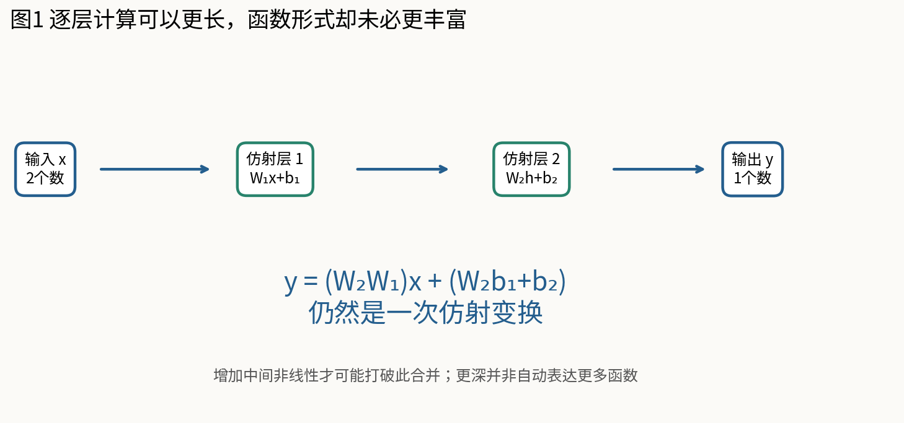
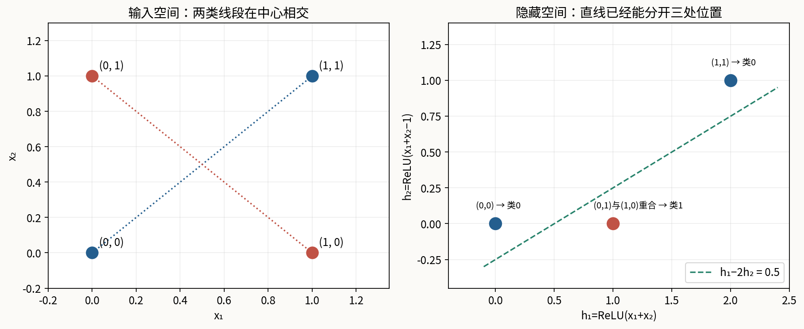
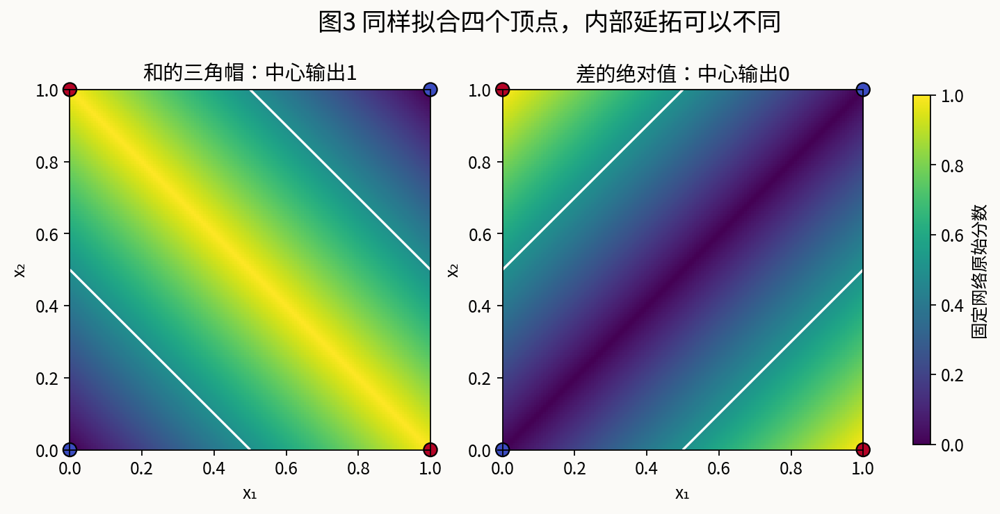
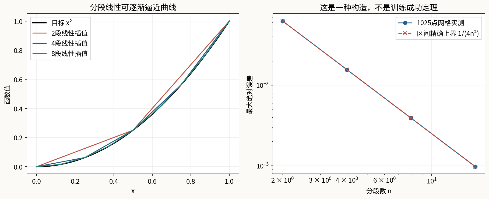

# 第083课 多层感知机与表示能力

本课问题：为什么把线性层叠得很深仍不够，非线性到底改变了什么？我们先证明一个模型做不到，再亲手构造一个能做到的模型，最后检查“做得到”与“学得会、用得好”之间还隔着哪些问题。

直接先修：010、014、032、042至043、048。需要会向量点积、矩阵乘法、二分类直线边界与基本模型评估。不需要先会反向传播。本课所有主实验只用Python标准库，权重明确固定；训练算法从后续课程开始。读完应能手算一个小网络的每个中间量、证明XOR不可由单条直线分类，并解释参数数量与函数复杂度为什么不同。

## 1 从“一个打分器”走向“先改表示，再打分”

设一个简单设备有两个开关，输入$x_1,x_2$各取0或1。只打开一个开关时报警，两个都关或两个都开时不报警。这样的规则叫异或，英文缩写XOR。它不是“只要有开关打开就报警”的或运算，也不是“两个都打开才报警”的与运算。先把四种输入完整写下：$(0,0)$的标签是0，$(0,1)$是1，$(1,0)$是1，$(1,1)$是0。

以前的线性分类器直接计算原始输入的加权和，再与阈值比较。现在增加一个步骤：先把输入变成新的特征$h$，再让最后一层对$h$打分。隐藏层的作用可以理解为“产生下一步计算需要的表示”。这里的隐藏不是保密，也不表示我们不能看到它；意思是训练数据通常只给输入和最终标签，没有给每一层应该输出什么的逐点标准答案。

对报警装置而言，一个有用的中间量是打开的开关总数$s=x_1+x_2$。它取0、1、2。标签为1的情况恰好在中间，两端为0。仅有总数的线性打分仍不够，但如果再加入“总数超过1多少”这一项，就能把两端压下去。这将是本课固定网络的构造线索，而不是训练程序偶然找到的一组神秘数字。

## 2 神经元首先是一条可以手算的公式

一个具有$d$个输入的仿射单元计算

$$z=\sum_{i=1}^{d}w_i x_i+b.$$

$x_i$是输入，$w_i$决定该输入对当前单元的作用，$b$是偏置。偏置让截距不必为零。严格说，含非零偏置的映射称为仿射映射，不是保持原点的线性映射；机器学习里口语说“线性层”时常把偏置也包括进去。需要做数学证明时，区分这两个词可以避免无意漏掉常数项。

例如输入$(2,-1)$，权重$(1,2)$，偏置$0.5$，则$z=1\times2+2\times(-1)+0.5=0.5$。如果另一单元的权重为$(-1,3)$，偏置为$-2$，它得到$-2-3-2=-7$。两单元看的是同一份输入，但它们问的是不同的线性问题。多个单元并排放置形成一层，这一层输出一个向量。

“神经元”只是计算单元的名称。本课不把它当作真实生物神经元的精确模型，也不需要以生物比喻证明算法正确性。对程序而言，最重要的是输入输出形状、函数定义、数值范围和参数如何参与计算。把这些写清楚，比记住一张有很多圆圈的网络图更可靠。

## 3 矩阵形状是计算的语法

本课单个样本采用列向量约定：$x\in\mathbb R^{d_{\rm in}}$，$W\in\mathbb R^{d_{\rm out}\times d_{\rm in}}$，$b\in\mathbb R^{d_{\rm out}}$，计算$z=Wx+b$。矩阵的每一行对应一个输出单元，每一列对应一个输入特征。代码的weights就是“输出行、输入列”的嵌套列表。

例如二输入、三输出的矩阵有三行两列，不是两行三列。乘法先让每行与长度为2的输入作点积，得到三个数字，再分别加三个偏置。若偏置长度只有2，程序应该报错，而不是悄悄少算一个单元。因此实现使用显式形状检查；Python的zip默认遇到较短序列会截断，不能把这种语言行为当成数学上的容错。

后续批量实现常把每个样本放在矩阵的一行。此时$X\in\mathbb R^{B\times d_{\rm in}}$，若保存$A\in\mathbb R^{d_{\rm in}\times d_{\rm out}}$，则$Z=XA+b$，且$A=W^\top$。两种约定表示同一函数，只是存储和书写方向不同。框架的Linear也可能内部保存输出乘输入形状而在计算时转置；读接口不能只看变量叫W就猜方向。[1]

## 4 多叠几层仿射变换，会发生什么

先考虑没有激活函数的两层网络：第一层$h=W_1x+b_1$，第二层$y=W_2h+b_2$。把第一层代入第二层，逐项分配乘法：

$$y=W_2(W_1x+b_1)+b_2=(W_2W_1)x+(W_2b_1+b_2).$$

定义$W_*=W_2W_1$与$b_*=W_2b_1+b_2$，整个网络又成为$y=W_*x+b_*$。中间层可能包含很多单元，执行时也确实作了更多乘加，但输入到输出的函数形式仍是一次仿射映射。同样的代入可以一直进行，因此任意有限层纯仿射网络都能合并成一层。

手算一个具体例子：$W_1=\begin{pmatrix}1&2\\3&4\end{pmatrix}$，$b_1=(5,6)^\top$，$W_2=(7,8)$，$b_2=9$。合并权重第一项为$7\times1+8\times3=31$，第二项为$7\times2+8\times4=46$；合并偏置为$7\times5+8\times6+9=92$。输入$(1,0)$先得到$(6,9)$再得到123；合并公式得到$31+92=123$。

## 5 “函数等价”仍有值得保留的细节

如果中间宽度很窄，还可能限制最终矩阵的秩。比如输入与输出都为10维，中间只有1维，那么$W_2W_1$的秩至多为1，不能表示所有10乘10矩阵。这说明增加一个瓶颈线性层有时会缩小函数集合；它并不会自动把集合扩大。矩阵因子化本身仍有用途，例如低秩建模，但用途与非线性表达能力不是同一个论点。

同一个最终矩阵可以有许多分解：把$W_1$乘2、把$W_2$除2，乘积不变。由此不能把参数个数直接等同于可区分函数的个数，更不能把冗余参数全部当成独立的预测信息。另一方面，多层线性参数化的损失表面可能与直接优化最终矩阵不同，本课的合并结论没有证明训练轨迹相同。

实测用固定种子83021生成两层仿射权重和100个二维输入，逐层结果与合并结果最大绝对差为$2.22\times10^{-16}$。这个小差是浮点运算顺序变化的结果，不是两种实数函数不等价。证明负责覆盖全部符合形状的实数输入；实验负责检查实现有没有把矩阵方向或偏置写错，两者各有职责。

## 6 用四条不等式证明XOR线性不可分

设分类规则为分数$s(x)=a x_1+b x_2+c$大于等于0时预测1，小于0时预测0。如果四点全部正确，则两个负例要求$c<0$和$a+b+c<0$；两个正例要求$a+c\geq0$和$b+c\geq0$。

把两个正例不等式相加，得到$a+b+2c\geq0$。把两个负例不等式相加，却得到$a+b+2c<0$。同一个实数不可能同时大于等于0又小于0，矛盾。因此不存在满足要求的$a,b,c$。若原先阈值不是0，可以把阈值吸收入$c$，结论不变。这个论证包括全部实数权重，并没有假定权重只能取整数。

几何上，两负例连接线与两正例连接线都经过$(0.5,0.5)$。仿射函数在线段中点的值等于两端值的平均。若整条负例线段的两端都在负侧，其中点必须在负侧；正例线段两端在正侧，其中点又必须在正侧，同样矛盾。这是代数证明的几何解释，不是依靠“看起来画不出来”的视觉猜测。

## 7 不可分证明与有限搜索不能互相冒充

附带实验枚举$a,b,c$各为$-4$到4的729组整数，最好正确率为75%。例如分数$-4x_1-4x_2+4$把三个点分对，只把$(0,0)$分错。这里搜索能给出一个具体可行的75%分类器，但如果没有上面的证明，搜索失败只能说明这个有限网格没有发现100%的解。

证明已经排除了100%，而准确率在四个等权样本上只能是0、25%、50%、75%、100%，再结合这个75%的见证，就能确定所有仿射阈值分类器的最优四点准确率为75%。请注意结论中的评价标准：它是四个点等权的分类准确率；若样本频率不同、允许随机预测或改成其他损失，需要重新说明“最好”是什么意思。

也不要由“XOR线性不可分”推出“任何没有隐藏层的方法都做不到”。如果先手工加入$x_1x_2$，分数$x_1+x_2-2x_1x_2$在四点上已经等于标签。此时模型对扩展特征线性，对原始输入却是非线性。关键在可使用的函数集合和表示，不在算法名称是否含有“神经网络”。

## 8 ReLU把一次计算变成分段计算

ReLU的定义是$\operatorname{ReLU}(z)=\max(0,z)$。输入负数时输出0，输入正数时保持原值，输入0时输出0。它不是把所有值压缩到0与1之间的概率函数。[2] 对一个仿射单元先求$z=w^\top x+b$，再求$h=\operatorname{ReLU}(z)$，正负两侧采用不同公式，于是原来的一次映射变成分段仿射映射。

例如$h=\operatorname{ReLU}(x-1)$在$x\leq1$时为0，在$x>1$时为$x-1$。偏置$-1$决定折点位于1。如果忘掉偏置，只写$\operatorname{ReLU}(wx)$，一维所有这样的折点都在原点，能够组合的形状明显受限。因此偏置不是可有可无的装饰；是否省略必须与具体任务和结构一起讨论。

非线性不保证当前数据真的经历了不同分支。如果某个单元在所有观测上都为正，ReLU在这些观测附近等于恒等函数；如果永远为负，该单元输出全0。一个画着许多ReLU的网络，在某个局部区域仍可能只是一个仿射函数。判断表达能力要看可能的输入区域、激活模式和参数，而不能只数图中的层数。

## 9 两个隐藏单元就能构造XOR

取$s=x_1+x_2$，定义隐藏表示

$$h_1=\operatorname{ReLU}(s),\qquad h_2=\operatorname{ReLU}(s-1),\qquad f(x)=h_1-2h_2.$$

对应第一层$W_1=\begin{pmatrix}1&1\\1&1\end{pmatrix}$，$b_1=(0,-1)^\top$；第二层$W_2=(1,-2)$，$b_2=0$。两个隐藏单元的权重相同，但偏置不同，所以它们有不同的激活边界。分类时用$f(x)\geq0.5$预测1，否则预测0。

现在不跳步骤算四个输入。$(0,0)$给$s=0$，隐藏为$(0,0)$，输出0。$(0,1)$给$s=1$，隐藏为$(1,0)$，输出1。$(1,0)$同样给$s=1$，隐藏为$(1,0)$，输出1。$(1,1)$给$s=2$，隐藏为$(2,1)$，输出$2-2=0$。这样我们展示的是一组明确存在的权重，而不是只宣称网络“理论上应该行”。

去掉两处ReLU，保持所有权重和偏置不变，则$h_1=s$、$h_2=s-1$，输出变成$2-s$。四点输出依次为2、1、1、0，在相同阈值下准确率75%。这是控制变量对照：它展示这组构造中的非线性做了什么，但不把该组权重的结果冒称所有线性模型的最优证明，最优性已经由上一节独立论证。

## 10 在隐藏空间中重新看可分性

输入空间中的四点经映射后只剩三个不同位置：$(0,0)$、$(1,0)$和$(2,1)$。两个正例都变成$(1,0)$，两个负例分别在另外两处。在这个空间里，$h_1-2h_2=0.5$是一条普通直线，就能完成分类。最后一层没有变得神秘，它仍然只是线性打分；困难被前面那次非线性表示变换重新组织了。

两个不同输入映射到相同隐藏值，意味着这层表示丢失了一些原始信息：它无法再区分$(0,1)$与$(1,0)$。对当前标签，这种合并无妨，因为二者标签相同。如果任务改为辨别到底哪个开关打开，这个表示就不够了。表示的好坏必须相对于下游问题判断，不能只看图像是否整齐或维度是否更高。

## 11 参数量、宽度与深度分别回答什么

全连接仿射层从$d_{l-1}$维到$d_l$维，需要$d_l d_{l-1}$个权重和$d_l$个偏置，总数为$(d_{l-1}+1)d_l$。网络总参数数是逐层相加，而不是把所有宽度直接相乘。对2→2→1网络，第一层有4个权重和2个偏置，第二层有2个权重和1个偏置，共9个。

本课构造把某些值设为0或1，并不意味着这些位置从架构中消失。若它们都是可训练位置，仍应计入参数量。只有结构上固定不可训练的常数或真正共享同一参数的位置，才应按相应规则减少自由参数计数。本实验全部固定是为了分析函数，因此“架构有9个参数位置”与“本次训练了0个参数”可以同时成立。

对于2→4→3→1，三层分别有12、15、4个参数，总数31。宽度通常指某层单元数；深度可能指仿射层数，也可能把输入层算进去，所以写“3层网络”前最好说明计数约定。本课把输入层不算作变换层，2→2→1是两层仿射变换、一个隐藏层。明确约定比争论哪种叫法唯一正确更有用。

## 12 表示存在，不等于训练一定找到

刚才我们由任务结构直接写下了合适参数。若从随机权重出发，仅依据误差修改参数，能否到达同样好的结果，则是优化问题。某种架构能够表示目标，是训练成功的必要背景之一；它不保证任何初始化、学习率和损失都能找到目标，也不保证有限计算时间内可以找到。

即使找到了训练误差为零的参数，仍不知道新样本表现如何。本课四点是整个离散XOR定义域，所以对严格的二进制输入，四点全对确实验证了全定义域。但如果有人把输入解释为连续传感器读数，情况立即变了：四个角点之外的答案从未定义，不能凭网络连出的曲面就宣布找到了真实机制。

这三个问题应该分开问：函数集合里有没有好的候选；训练过程是否找到好的候选；选中的函数在目标使用场景是否可靠。后续反向传播、优化和泛化课程分别补上这些环节。本课可以把第一问题回答得非常明确，却有意不把实验包装成完成了整个机器学习流程。

## 13 同样通过四个点，内部却能完全不同

另一个网络可以计算$g(x)=\operatorname{ReLU}(x_1-x_2)+\operatorname{ReLU}(x_2-x_1)=|x_1-x_2|$。它在四个二进制顶点上也依次输出0、1、1、0，分类表现与$f$完全相同。但是在$(0.5,0.5)$处，$f$输出1，$g$输出0；在$(0.25,0.25)$处，$f$输出0.5，$g$输出0。

因此数据约束与函数形状之间有空隙。用连续曲面填满空隙时，我们实际上引入了架构、初始化、训练规则或人工设计带来的偏好。没有新增的标签假设，就不能说哪一个延拓“真正正确”。若真实任务要求相同读数永不报警，$g$的形式可能更合适；若要求总强度在某区间内报警，$f$可能更合适。决定因素来自任务含义，而不是两张图谁更漂亮。

## 14 输出分数不能未经说明当概率

$f$在单位正方形内位于0与1之间，只是当前构造造成的结果；若输入$(2,2)$，$s=4$，则$f=4-2\times3=-2$。负数可以是分类分数，却不可能是概率。即使一个函数始终落在0与1之间，也只是满足了概率的取值范围，还需要明确它要估计哪个事件，以及是否经过恰当损失训练和校准检查。

分类阈值还取决于错误代价和类别分布。本课的0.5是为清楚展示四点分类而固定的阈值，不是所有报警任务的最佳阈值。如果漏报警代价很高，现实决策流程可能选择不同工作点，并评估召回率与误报成本。把一个玩具构造直接部署到安全关键系统，会跳过数据质量、风险与验证要求。

隐藏层激活与输出层激活也可以不同。回归可保留实数输出；二分类常输出实数logit后再通过sigmoid解释概率；多分类可使用多个logit。具体损失和输出变换会在后续课展开。本课的输出层故意不加ReLU或sigmoid，让函数表达与概率语义的边界更清楚。

## 15 折线怎样逼近平滑曲线

为了把“表达能力”从分类扩展到回归，考虑在$[0,1]$上近似$x^2$。把区间等分成$n$段，在各个节点$k/n$精确通过平方值，并在相邻节点之间用直线连接。第一段斜率为$1/n$；每经过一个内部节点，下一段斜率比前段增加$2/n$。所以这条折线能写成

$$p_n(x)=\frac{x}{n}+\frac{2}{n}\sum_{k=1}^{n-1}\operatorname{ReLU}\left(x-\frac{k}{n}\right).$$

每个ReLU在一个节点处“打开”，把后续斜率增加一截。这是一种可以逐项核验的构造：例如$n=2$时，$p_2(x)=x/2+\operatorname{ReLU}(x-1/2)$。在$0\leq x\leq1/2$斜率是1/2，后半段斜率是3/2，恰好连接$(0,0)$、$(1/2,1/4)$、$(1,1)$。

该公式含一个线性支路。若严格要求所有路径都经过同一ReLU隐藏层，在限定区间$[0,1]$上可用额外单元$\operatorname{ReLU}(x)=x$实现线性支路。因此程序记录的$n-1$是内部折点单元数，不是宣称完整标准网络只有$n-1$个隐藏单元。这种细节会影响参数量与架构比较，不能为了简洁省略。

## 16 误差能够手算，不能只凭曲线重叠

在一段$[a,b]$上，连接$x^2$两端点的直线为$(a+b)x-ab$。减去$x^2$，得到$(x-a)(b-x)$。该乘积非负，说明弦线在曲线上方；当$x=(a+b)/2$时最大，最大值是$(b-a)^2/4$。因为每段长度$1/n$，整个区间最大误差恰好为$1/(4n^2)$。

实测使用1025个均匀点，$n=2,4,8,16$的最大绝对误差分别为0.0625、0.015625、0.00390625、0.0009765625。这次网格恰好包含每段中点，因此网格最大值等于已证明的区间最大值。通常有限网格只能提供误差下界，不能因为采样没有见到大误差，就宣称连续区间也没有大误差；本例之所以能这样说，依赖刚才的解析证明。

## 17 通用逼近结论应该怎样读

经典通用逼近研究说明，在明确的激活、函数类别、定义域和误差衡量条件下，足够多隐藏单元的网络可以逼近广泛的目标函数。[3] 这个结论中最重要的量词是“存在”：给定允许的误差，存在某个足够宽的网络和一组参数。把它读成“我随便选的有限宽网络，都能轻松学会任何问题”就更换了量词。

定理的版本很多，连续函数在紧集上的一致近似，与可测函数在某个积分误差下的近似，并不是同一陈述。也不能把针对有界压缩型激活的早期结论不加条件地直接套给所有激活。对本课最有用的启发是非线性网络拥有丰富函数集合；具体ReLU平方构造已经提供了可独立检查的小例子，无需借一个大定理替代计算。

即使存在参数，所需宽度可能很大；即使参数可训练得到，有限数据也未必足以辨别它；即使在训练范围内逼近很好，范围外也没有自动保证。理论并不是没有价值，而是必须用在它实际覆盖的问题上。论文标题中的“通用”不是部署时可以免除实验设计的通行证。

## 18 深度有用，条件和代价也要一起说

多层非线性可以逐层组合简单特征。例如一层检测局部模式，下一层组合这些模式，再下一层组合更高层关系。这种组合有时能用较少单元表示某些函数。但“有些函数可更高效表示”与“对每个数据集都加深更好”相差很远。深层网络还增加计算、内存与优化难度，必须用实际任务和预算检验收益。

ReLU网络在固定激活模式的区域内是仿射函数。更复杂的层次可能形成更多区域，但区域数量上界不意味着训练后实际使用了那么多区域，更不意味着每个区域都由足够数据支持。如果许多单元重复、失活或输入分布只覆盖一个很小区域，名义复杂度与有效行为会相差很大。

实际选择结构时，可以先建立简单基线，再用隔离的验证数据比较合理候选。观察训练与验证差距、计算代价和种子敏感性，比只报告层数更有信息。本课既不推荐一律浅，也不推荐一律深；它要求先说清表达、优化和泛化中的哪个环节是当前瓶颈。

## 19 阅读代码时，寻找可以反驳自己的检查

本课实验刻意不调用MLP训练库，因为目标是让每次乘法、每个折点和每条结论的证据都能追踪。仿射函数检查输入形状和有限数值；参数计数拒绝零宽度、非整数宽度；XOR测试逐个检查隐藏值；折线测试同时检查节点和区间中点；数据生成器提供可复现文件与哈希。

测试成功不能证明程序对所有输入绝无错误，但不同性质的测试能够互相补充。只检查“程序运行不报错”太弱，只检查最终准确率也可能放过隐藏表示写错又被输出层抵消的问题。先给出手算期望，再比较程序输出，才有机会发现一段自洽但错误的实现。

全部16项测试在普通解释器和python -O下均通过。我们使用unittest的断言方法，不使用可能被优化解释器移除的裸assert承担测试职责。实测文件保存了版本、输入数据哈希和关键数值；读者应重新运行得到自己的输出，而不是把文档中的漂亮数字当成机器已经在自己电脑上算过的证据。

## 20 本课停在什么位置

你现在应能从一个任务写出输入、隐藏层和输出的含义，检查矩阵形状，证明线性限制，并构造一个小非线性网络突破它。更重要的是，应能在看到100%四点准确率时主动问：定义域是否只有四点？参数是构造还是训练得到？分数是不是概率？新场景有没有证据？

下一课把一个网络看作许多简单操作组成的计算图，学习自动得到导数。那是让参数可系统调整的基础，但导数计算正确也不会自动解决模型选择与泛化。本阶段每前进一步，都要把新能力和仍未获得的保证分开记录。完成实验册的手算、反例和习题后，再进入下一课。

## 参考资料

[1] PyTorch官方Linear文档，仿射映射与参数形状。https://docs.pytorch.org/docs/2.14/generated/torch.nn.Linear.html

[2] PyTorch官方ReLU文档，函数定义。https://docs.pytorch.org/docs/2.14/generated/torch.nn.ReLU.html

[3] Hornik、Stinchcombe、White（1989），Multilayer feedforward networks are universal approximators，论文出版摘要。https://doi.org/10.1016/0893-6080(89)90020-8

以上来源只支撑对应定义、接口约定与历史理论背景。XOR证明、固定参数、反例、插值推导及本课数值均由本课独立编写或执行；来源核验范围见sources.md。
