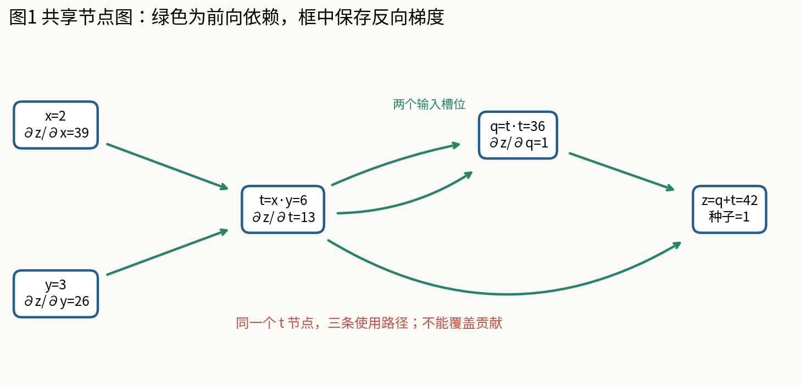
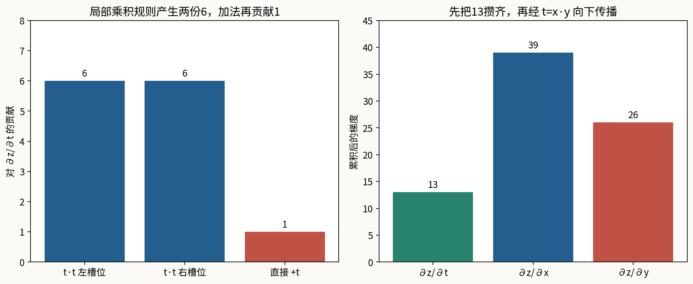
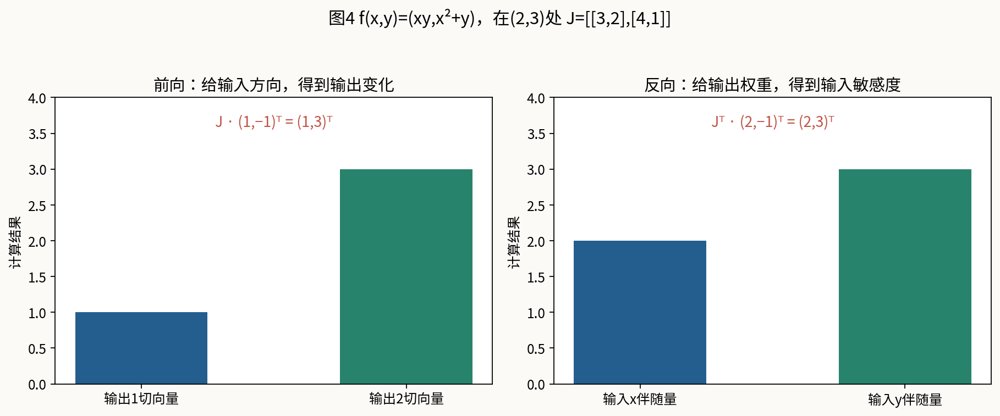
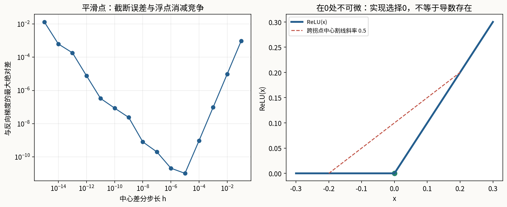

# 第084课 计算图与自动微分

本课问题：一个由许多简单运算拼成的程序，能否自动得到对所有输入的导数？我们不用现成自动微分库，自己建立标量计算图，沿图累加梯度，再用手算、前向模式和数值差分交叉核验。

直接先修：004至005、014至015、083。需要知道变量、函数、乘法求导和链式法则；下面仍会从局部变化重新解释这些规则。本课实现只依赖Python标准库，图像重建才需要NumPy与Matplotlib。学习目标不是记住backward这个方法名，而是能够解释它访问了哪些节点、为什么必须按特定次序访问、共享节点的多条贡献在哪里相加。

## 1 先分清三个同名“前向”

神经网络的前向计算，是把输入和参数带入模型得到输出或损失。例如先算$z=wx+b$，再算$h=\operatorname{ReLU}(z)$，最后算误差。这只是算函数值，本身没有说明采用哪种求导算法。自动微分的前向模式则会在算函数值的同时传播一个输入方向引起的微小变化，它是一种求导方式。

反向模式同样需要先执行一次通常意义的前向计算，保存后面求导需要的信息，然后从输出向输入传播敏感度。因此“反向模式有一个前向阶段”毫不矛盾。不要把前向模式误解为推理，把反向模式误解为训练；推理可以不用任何微分，而训练中的微分也有多种计算策略。

再区分梯度计算与参数更新。反向传播算出“若某个参数增加一点，损失一阶上会如何变化”；优化器才决定参数向哪里移动、移动多少。本课只构造和核验导数，不悄悄修改参数。把两个动作分开，下一课才能检查到底是梯度错了，还是学习率和更新规则不合适。

## 2 一张计算图是什么

把每个中间结果当作节点，把“后一个结果用到了前一个结果”当作有方向的边。考虑$x=2,y=3$，依次执行$t=xy$、$q=t\times t$、$z=q+t$。节点有$x,y,t,q,z$，前向数值分别是2、3、6、36、42。箭头方向沿计算依赖从输入指向输出。

这个图是有向无环图：当前结果只依赖已经存在的量，不能在尚未定义自己时又要求自己的值。一个中间节点可以被多次使用，所以计算图通常不是一棵树。这里$t$既是$q$乘法的两个输入，又直接参与最后的加法，这是本课故意设置的共享情况。

节点与输入槽位必须区别。$q=t\times t$只有一个被复用的$t$节点，但乘法有两个输入槽位，每个槽位都产生一项局部导数贡献。如果用集合保存父节点后只保留一条“t到q”的信息，而没有合并两项导数，梯度就会少一半。节点可以去重，数学上的使用次数不能丢失。

## 3 导数是一种局部变化率

对于单变量函数，若输入增加很小的$\Delta x$，输出变化可近似写成$\Delta f\approx f'(x)\Delta x$。导数不是输出值本身，而是当前点附近的变化比例。例如$f(x)=x^2$在$x=3$时输出9，导数6；输入从3增加到3.001，输出变化约0.006，精确变化为0.006001。

多输入函数对每个输入都有一个偏导数，计算某一偏导时暂时把其他独立输入固定。对$t=xy$，固定$y$时，$x$变化$\Delta x$使$t$变化$y\Delta x$，所以$\partial t/\partial x=y$；同理$\partial t/\partial y=x$。在$(2,3)$处，两项分别是3和2。

局部偏导与整个输出对输入的总敏感度也不同。$\partial t/\partial x=3$只描述这一次乘法，而$\partial z/\partial x$还要考虑$t$之后怎样影响$q$和$z$。自动微分将这些小规则组合起来，不需要每个基本运算都知道整个网络的公式。

## 4 两个最重要的局部规则

若$c=a+b$，局部导数为$\partial c/\partial a=1$、$\partial c/\partial b=1$。如果已经知道最终输出对$c$的敏感度是$\bar c$，那么这条加法向$a$贡献$\bar c$，向$b$也贡献$\bar c$。横线上划线的记号$\bar a$表示最终标量输出对$a$的偏导，也叫伴随量；它不是均值。

若$c=ab$，向$a$的贡献为$\bar c\,b$，向$b$的贡献为$\bar c\,a$。请注意乘的是前向时另一个输入的值，而不是另一个输入的梯度。两个梯度相乘会把乘法法则与链式法则混为一谈。代码为每条边保存“父节点、当前点的局部导数”这一对信息，让反向传播只需乘上游敏感度再相加。

同一节点有多个下游使用者时，总敏感度等于所有路径贡献之和。于是更新应写成$\bar a\leftarrow\bar a+\bar c\,\partial c/\partial a$，而非覆盖成右侧的最后一项。这个加号是整个反向累积算法的核心；它不仅用于分支图，也用于一个参数被多个样本、多个位置共同使用的情况。

## 5 从输出种子开始，完整手算一次

对$z=q+t$，先设$\bar z=\partial z/\partial z=1$，其他伴随量初始化为0。最后加法向$q$贡献1，向$t$直接贡献1，因此此刻$\bar q=1$、$\bar t=1$。但此时不能马上把$t$的梯度往$x,y$传播，因为$q$的路径贡献还没有抵达。

接着处理$q=t\times t$。左输入槽位向$t$贡献$\bar q\times t=1\times6=6$，右槽位又贡献6。加上刚才的直接贡献，得到$\bar t=1+6+6=13$。最后处理$t=xy$，得到$\bar x=13\times3=39$、$\bar y=13\times2=26$。结果并不是简单地把每条边导数相加，而是沿每条路径相乘、不同路径再相加。

独立展开公式验证：$z=(xy)^2+xy=x^2y^2+xy$。所以$\partial z/\partial x=2xy^2+y=2\times2\times9+3=39$，$\partial z/\partial y=2x^2y+x=2\times4\times3+2=26$。手算图算法与展开公式一致，为实现提供了不依赖自身代码的期望答案。

## 6 为什么反向拓扑顺序不可省略

拓扑顺序是一种排列，使每个节点都出现在使用它的节点之前。本例$x,y,t,q,z$是一种有效顺序。反过来访问$z,q,t,y,x$，能保证处理某个节点时，它所有下游使用者已经向它贡献过梯度，因此该节点的伴随量已经攒齐。

如果从$z$顺着某条边立刻深入$t$，只看到直接路径的1就向$x,y$传播，会暂时给出3和2。后来$q$再贡献12时，除非你精心设计重复传播机制，否则这部分就丢了。朴素“见到一条边就递归传播”很容易在共享节点上重复计算或漏算；先建立顺序，再集中反向处理，更容易验证。

代码使用显式栈构造后序排列，而不是依赖Python函数递归，因此2500次连续加法组成的图也能通过测试。visited集合按对象身份让每个节点只入序一次，但边列表保留重复槽位。不能按数值去重：两个不同节点都等于6，也可能来自不同输入，代表不同的依赖关系。

## 7 从零实现Value：保存什么，舍弃什么

每个Value包含前向数值data、当前梯度grad、父边edges、操作名op以及可选label。乘法发生时立刻计算结果，并记录两条边，其局部导数分别是另一个输入当前的数值。加法记录两条局部导数为1的边。输出仍是Value，因此普通表达式可以继续组合，形成一张实际执行过的图。

Python的运算符重载让$x+y$调用加法实现，让$x*y$调用乘法实现。普通数字会自动包装成常量叶节点，从而支持$2*x+1$。这些常量也可能得到梯度，但它们不是用户需要更新的参数；“被计算了梯度”与“会被优化器更新”不是同一身份。生产系统常有requires_grad等机制避免无用追踪，本课为可读性没有加入。

data属性对正常使用者只读。因为局部导数记录于前向时，如果之后直接把输入值改掉而不重建图，图中结果与导数可能属于不同点，失去一致含义。我们的约定是：想在新参数处求导，就新建Value并重新执行函数；不要修改内部_data或edges。教学实现没有版本计数、原地修改检测与完整权限封装，不能当作生产框架直接使用。

## 8 backward的完整职责与一个特别约定

backward先取得所有可达节点的拓扑顺序，把它们的grad全部设为0，再把输出grad设为seed，默认seed等于1。随后按逆序遍历节点，把该节点grad乘每条边的局部导数，累加到父节点grad。它返回访问顺序，方便打印轨迹；它不改变任何前向数值，也不更新任何模型参数。

本课刻意采用“每次调用清空所有可达梯度”的语义。因此对$x=3,z=x^2+x$连续调用两次backward，x.grad仍是7，不会变成14。设置seed=2时才得到14。这个约定减少初学者在反复核验时受到残留梯度的干扰，但它与PyTorch的叶子.grad默认跨调用累积行为不同。PyTorch使用前通常要明确清梯度，且重复遍历已释放的图还涉及保留或重建图。[1]

同一调用内部的分支贡献必须相加，与多次调用之间是否保留旧值，是两个不同维度。不要因为本课“每次清零”就把边传播写成覆盖；也不要把框架“跨批次可累积”误解为共享节点可以重复访问并随意再次传播。先写明API约定，再测试符合约定的行为，才不会在切换框架时套错经验。

## 9 局部Jacobian让标量规则有统一语言

一个函数$g:\mathbb R^n\to\mathbb R^m$的Jacobian是$m$行$n$列矩阵，第$i$行第$j$列为$\partial g_i/\partial x_j$。它描述输入小变化如何一阶映射到输出小变化。加法$g(a,b)=a+b$的Jacobian是$(1,1)$；乘法$g(a,b)=ab$的Jacobian是$(b,a)$，都只有一行，因为输出是标量。

如果$c=g(u)$而最终损失$L$依赖$c$，列向量记号下链式法则为$\nabla_u L=J_g(u)^\top\nabla_c L$。这表示拿输出侧的敏感度，乘局部Jacobian的转置，变成输入侧敏感度。标量Value实现没有显式建矩阵，却逐条执行了这个乘积中对应的乘加。

对仿射层$z=Wx+b$，相对于$x$的Jacobian就是$W$。若传回$\bar z$，则$\bar x=W^\top\bar z$。这一式与上一课列向量约定一致。下一课使用样本按行的批量矩阵时，转置位置会随表示约定改变，但“输出敏感度通过局部线性化回传”这条含义不变。先查形状，再背公式。

## 10 前向模式：让每个数带着一个方向导数

前向模式为每个节点同时保存数值$v$和切向量$\dot v$。切向量表示沿一个预先指定的输入变化方向，当前节点的一阶变化率。例如要计算对$x$的偏导，可设$\dot x=1,\dot y=0$；要计算沿方向$(1,-1)$的变化，可设$\dot x=1,\dot y=-1$。

加法规则是$\dot c=\dot a+\dot b$；乘法规则是$\dot c=\dot a\,b+a\,\dot b$。这些规则在前向执行时就可使用，无需等到最终输出出现。以$t=xy$且$(x,y)=(2,3)$为例，方向$(1,0)$给$\dot t=3$，再有$\dot q=2t\dot t=36$，最后$\dot z=36+3=39$。

这与反向模式得到的$x$偏导一致，但工作组织不同。若需要对两个独立输入的所有偏导，最直接的标量前向实现需分别播种$(1,0)$和$(0,1)$。若只关心一个指定方向，即便输入很多，也只要传播这一个方向。代码的Dual类实现相同算子，使同一个复合函数能用Value与Dual分别求导，而不改函数结构。

## 11 反向模式：一次得到标量损失的全部输入敏感度

对许多参数到一个标量损失的函数，反向模式非常合适：输出种子是1，沿整张图回传一次，就能得到所有参数的偏导。它不是对第一个参数扰动一次，再对第二个参数扰动一次，也不会因为参数增加就要求每个参数重跑一次整个模型。[2][3]

设已执行计算图有$V$个节点与$E$条输入边，本课构图后的排序与反向传播耗时为$O(V+E)$，存储节点、边和中间值同样需要相应规模。对固定有限输入数的基本算子，边数与算子数同阶，因此反向计算通常与前向计算同一数量级，但不是所有实现都拥有同一个固定常数倍。

这种效率要付代价：反向时常需要前向中间量。复杂模型可能在内存与重新计算之间权衡，检查点等技术会在之后课程讨论。前向模式可按程序执行顺序推进，不一定需要保存完整反向轨迹。选择模式时应看输入输出维数、需要的乘积、计算结构与内存预算，而不是把某一种模式绝对称为更先进。

## 12 多输出情况下，一次反向究竟得到什么

设$f(x,y)=(xy,x^2+y)$，在$(2,3)$处，Jacobian为

$$J=\begin{pmatrix}3&2\\4&1\end{pmatrix}.$$

若给输入方向$v=(1,-1)^\top$，前向模式计算$Jv=(3-2,4-1)^\top=(1,3)^\top$。这两个数描述沿输入方向移动时两个输出的变化，不是整个Jacobian四个元素。

若给输出权重$u=(2,-1)^\top$，把输出组合成$L=2f_1-f_2$，反向模式计算$J^\top u=(6-4,4-1)^\top=(2,3)^\top$。常见名称VJP写成$u^\top J$，那是行向量表达；本课用列向量保存结果，所以写$J^\top u$。它们转置后数值一致，没有两个不同算法。

要用反向模式得到完整Jacobian，可以分别对每个输出播种基向量，相当于逐行求导；前向模式则逐个输入基方向，得到各列。实际框架可并行批处理这些操作，但“一次任意种子反向自动吐出完整Jacobian”的说法仍不正确。很多机器学习任务只需一个乘积，显式形成大矩阵反而浪费。[2]

## 13 自动微分、符号微分与数值差分

符号微分操作代数表达式，可能返回另一个表达式，例如把$x^2y^2+xy$变成$2xy^2+y$。它很适合推导与精确化简，但程序包含大量分支、循环和复杂数据结构时，如何表示与简化结果会变成工程问题。自动微分在一次具体执行上把基础算子的已知导数按链式法则组合，结果是该输入处的数值导数。[3]

数值差分则不要求查看程序内部，只观察邻近输入的输出。中心差分近似为$[f(x+h)-f(x-h)]/(2h)$。它非常适合做独立核验，因为计算路径与反向传播不同；但每个输入坐标通常要两次函数求值，而且存在步长导致的近似误差和浮点误差。

自动微分没有有限差分步长，也不靠两次邻点相减来定义梯度，因此不具有同样的截断误差来源。但这不等于“绝对精确”：前向值、基础函数和导数组合仍在浮点数中计算，可能舍入、上溢或下溢；原程序如果在当前点不可微，自动执行局部规则也不能创造不存在的数学导数。

## 14 用一个平滑复合函数做四路核验

取$f(x,y)=(xy+\sin x)e^y$。先写独立解析导数：对$x$求导得到$(y+\cos x)e^y$；对$y$求导时两个因子都依赖$y$，结果为$xe^y+(xy+\sin x)e^y=(x+xy+\sin x)e^y$。后一项很容易漏掉指数函数的贡献，因此是有价值的测试。

在$(0.7,-1.2)$处，真实执行得到函数值约$-0.0589684994$，反向梯度约$(-0.1310670145,0.1518674489)$。两个前向基方向与解析公式给出一致结果；中心差分步长$10^{-5}$时，最大绝对差约$1.04\times10^{-11}$。实验还预先固定另外四个点，覆盖正值、负值、零输入及混合符号，避免只在偶然抵消错误的单点核验。

四路核验并不完全独立到可以替代所有测试：前向与反向都使用同样的基本数学规则，也可能一起写错同一条公式。因此我们还加入最小加法、最小乘法、重复操作数、共享菱形图、种子倍乘和长链等单元测试。独立解析期望与不同结构的用例能帮助定位问题，单一巨大端到端例子通常只能告诉你“某处不对”。

## 15 差分步长不是越小越好

在平滑函数处，中心差分的截断误差通常随$h^2$缩小，因为左右展开中的偶数阶项相消。但是当$h$极小时，两个几乎相等的浮点数相减会发生有效数字消减，随后除以很小的$2h$又会放大误差。因此误差曲线常先下降再上升，不应把机器能表示的最小步长当成最佳步长。

本课扫描$10^{-1}$到$10^{-15}$，保存每个步长相对反向梯度的最大绝对差。这里只在固定平滑点与双精度环境展示趋势，不把最佳步长当作跨函数通用参数。变量尺度很大或很小时，可考虑相对尺度步长，并同时看绝对误差和相对误差。梯度接近零时只看相对误差容易夸大无关紧要的数值噪声。

有限差分还需要控制随机性。若每次函数求值都重新采样，左右差异可能主要来自不同随机数，而非输入变化。应冻结同一数据、同一随机样本与相同执行设置后比较。对于含状态更新的程序，还要保证左右评估从相同状态出发。本课所有函数确定且无外部状态，让核验失败能更直接指向导数或数值问题。

## 16 ReLU拐点与分支：导数有边界

ReLU在负半轴导数0，在正半轴导数1，在0处左右导数不同，因此普通导数不存在。我们的实现约定0处回传0。对称差分在0处却等于$[h-0]/(2h)=0.5$。这两个数不同，不是一个精度不足的问题，而是测试点不满足可微条件。必须把“数学导数”“实现选择的局部规则”和“某种差分平均”分开说。

对分支程序，例如输入为正时返回$x^2$，否则返回$3x$，当前执行的图只包含所选分支。在远离分界处，当前分支的导数可以就是整体分段函数的导数；在边界处则需要单独检查函数是否连续、左右导数是否相同。自动微分不会替你证明这些条件，也不会自动比较没有走过的分支。

循环也是类似道理：若执行了固定次数的可微算子，它们会展开成当前轨迹。若循环停止次数随输入离散变化，输入跨过阈值后图结构可能改变，当前轨迹的导数不描述那个跳变。分类标签、排序、索引选择、四舍五入等操作也不因被放进程序就自动拥有有用梯度。模型设计必须承认这些算子与连续优化之间的差异。

## 17 用一个神经元把图接回机器学习

取固定输入$x_1=2,x_2=-1$，参数$w_1=0.4,w_2=-0.8,b=0.1$，先算$a=w_1x_1+w_2x_2+b=0.8+0.8+0.1=1.7$。ReLU后预测仍是1.7，目标为1，损失$L=\frac12(1.7-1)^2=0.245$。这个前向步骤与上一课完全相同，只是现在每个中间结果都记录依赖。

反向先有$\partial L/\partial\hat y=\hat y-1=0.7$。当前预激活为正，ReLU局部导数为1，因此$\bar a=0.7$。再得到$\partial L/\partial w_1=0.7\times2=1.4$，$\partial L/\partial w_2=0.7\times(-1)=-0.7$，$\partial L/\partial b=0.7$。偏置前向只加一次，局部导数因此是1。

正负梯度描述当前点的一阶方向，不直接给出最佳参数。若简单作梯度下降，正梯度参数会减小，负梯度参数会增大，但移动很大时可能跨越ReLU分界，也可能让损失反而升高。本课只核验1.4、-0.7、0.7这些值；如何选步长、批量如何聚合和怎样验证更新，将交给下一课。

## 18 工程边界必须与算法一起交付

本实现支持加、乘、减、正整数幂、sin、exp、log与ReLU。它不支持张量广播、自动GPU运算、除法运算符、任意实数幂、高阶微分或完整的框架互操作。尤其局部导数作为普通浮点数保存，反向过程自身没有建图，所以不能对grad再调用backward就得到Hessian。功能少是为了看清机制，不是对生产框架能力的否定。

log要求正输入；Value拒绝NaN与无穷前向值；极大的exp仍可能触发Python上溢错误。域检查不能保证所有中间导数都数值稳定，例如接近零的log导数会很大。自动微分忠实执行一个数值不稳定的表达式，仍可能产生不稳定梯度；稳定的模型和损失写法是独立的重要要求。

不连到输出的输入不会出现在当前可达图中。新建的无关Value梯度初始为0，但如果用户保留了此前其他图写入的梯度，本次backward不会自动清空一个根本不可达的对象。因此本API承诺清零的是“当前输出可达的全部节点”，不是进程中所有对象。准确的边界描述能够避免看见旧值后错误地判断存在依赖。

## 19 如何设计可靠的验收，而不只追求全绿

本课19项unittest既有单算子，也有共享路径、重复槽位、重入清零、非单位种子、异常域、只读数值和2500步长图测试。普通Python与python -O均真实执行通过，测试断言不依赖会被优化删除的裸assert。完整实测结果与数据哈希一起保存，方便读者重跑后比较。

如果某项失败，先缩小到最小计算图。例如$x*x$导数错，优先检查重复操作数是否保留两条贡献；$t*t+t$错而$x*x$对，检查共享节点累加与拓扑顺序；第一次对第二次错，检查梯度初始化；只在极小步长差分错，检查浮点消减；只在ReLU零点不一致，检查可微前提。错误类型本身就是诊断线索。

测试没有覆盖的能力不能通过换一个名字宣称具备。本课不声称实现了可替代PyTorch的通用自动微分系统，也不声称几个点的差分一致就证明所有函数正确。它交付的是一个规则清晰、可独立解释、覆盖典型失败模式的标量教学实现，足以作为理解大框架反向机制的起点。

## 20 离开本课前应能说清的五句话

第一，反向模式复用局部导数和链式法则，不是逐个参数做有限差分。第二，图中共享节点的所有路径贡献必须累加，并在向更早节点传播前汇合。第三，去重的是节点访问，重复输入槽位对应的导数贡献仍须保留。第四，前向模式算输入方向的JVP，反向模式算输出权重的VJP，两者回答不同的线性化问题。第五，数值核验有步长和可微前提，梯度计算正确也只是训练流程的一环。

下一课将对真实的小型网络写出分层反向传播和参数更新。看到矩阵版本时，不必重新死记一套无关公式；它们是本课标量规则、共享参数累加与局部Jacobian的批量组织方式。先完成实验册，尤其是共享图和不可微点的解释，再进入下一步，能减少很多“框架明明运行了，为何我不理解输出”的困惑。

## 参考资料

[1] PyTorch官方自动微分入门：图、梯度累积与输出种子。https://docs.pytorch.org/tutorials/beginner/basics/autogradqs_tutorial.html

[2] JAX官方Forward- and reverse-mode autodiff：JVP、VJP与Jacobian乘积。https://docs.jax.dev/en/latest/jacobian-vector-products.html

[3] Baydin、Pearlmutter、Radul、Siskind，Automatic differentiation in machine learning: a survey。https://arxiv.org/abs/1502.05767

来源用于定义与算法背景；具体标量实现、例题、数据与数值均为本课原创并真实执行。核验时间和范围见sources.md。
